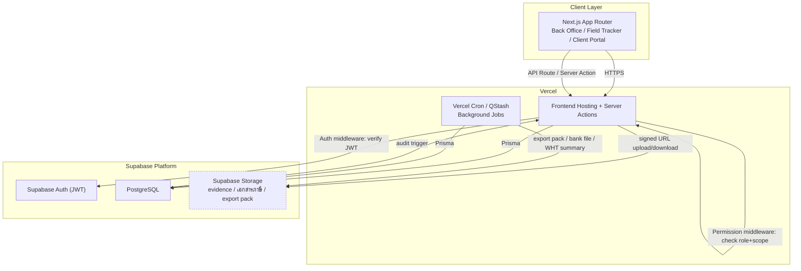

# 01-architecture.md

# 01 — Architecture
## AssetRecovery — Asset Recovery Operations Platform

> สถานะ: Specification v2 (Reformatted)
> Document Level: Foundation / Platform Build Spec
> Applies To: All implementation sprints
> เอกสารอ้างอิง: `00-project-overview.md`, `02-database-schema-design.md`, `03-non-functional-requirements.md`, `94-decision-log.md`, `cursor-system-prompt.md`

## Changelog

| Version | วันที่ | การเปลี่ยนแปลง |
|---|---|---|
| v1 | (เดิม) | สร้างไฟล์ครั้งแรก — Architecture concepts, permission model draft |
| v1.1 | 02/07/2569 | ปิด DEC-001, DEC-002, DEC-003 (Tech Stack, Permission Architecture, File Storage) |
| v2 | 03/07/2569 | Reformat ตามมาตรฐานเอกสารชุดใหม่ (header block, component diagram, Decisions/Open Items แยกชัดเจน) — **เนื้อหาเดิมคงไว้ครบ ไม่มีการเปลี่ยน business logic** |

ขอบเขตเอกสารนี้: โครงสร้างระบบระดับ technical — Tech Stack, Permission Architecture, Layer Architecture, Background Jobs, Audit/Export service สำหรับ Back Office/API/Database/Storage

**ไม่รวมอยู่ในไฟล์นี้**: Production infrastructure sizing (ยังไม่กำหนด — ดู Open Items), Final DB schema เต็มรูปแบบ (ดู `02-database-schema-design.md`), Performance/Reliability targets เชิงตัวเลข (ดู `03-non-functional-requirements.md`)

---

## 1. Summary

โครงสร้างระบบระดับ technical สำหรับ Back Office, API, Database, Storage, Jobs และ Integrations

## 2. Purpose

ให้ Cursor วางระบบแบบ modular, auditable, versioned และรองรับ Finance/Accounting workflow โดยไม่ผูก logic ไว้ใน UI อย่างเดียว

## 3. In Scope

- Frontend app
- Backend API
- Database
- Object storage
- Background jobs
- Audit service
- Notification service
- Export service
- Integration boundary

## 4. Out of Scope

- Cloud vendor final decision
- Production infrastructure sizing
- Final DB schema

## 5. Actors & Responsibilities

| Actor / Role | Responsibility | Scope |
|---|---|---|
| Superadmin | กำหนดค่าและเข้าถึงทุกส่วน | Global |
| บริหาร / Executive | อนุมัติ policy, exception, lock/unlock, scope decision | Organization |
| บัญชี (Accounting) | ตรวจข้อมูลบัญชี ส่งออก pack กระทบยอด WHT | Accounting scope |
| การเงิน (Finance) | ควบคุม claim payout payee billing receipt | Finance scope |
| ผู้จัดการทีมติดตามทรัพย์ (Manager) | กำกับทีม ตรวจงาน อนุมัติขั้นต้นค่าตอบแทน | หลายทีม (Role Group: inhouse/outsource) |
| ธุรการ / Admin | บันทึกข้อมูลและแนบเอกสารตามสิทธิ์ | Assigned scope |

## 6. Core Concepts

### 6.0 Tech Stack ที่ตัดสินใจแล้ว (Decision Date: 02/07/2569 — DEC-001)

| Layer | เทคโนโลยี | เหตุผล |
|---|---|---|
| **Frontend + Backend** | **Next.js App Router + TypeScript** | Full-stack, native กับ Vercel, Server Actions รองรับ form logic ฝั่ง server |
| **ORM** | **Prisma** | Type-safe, migration tool ครบ, เหมาะ schema ซับซ้อน (state machine + relation หลายชั้น) |
| **Database** | **PostgreSQL** (Supabase managed) | ACID, FK constraint, JSON field, full-text search |
| **Permission** | **Backend middleware (API layer)** | Role logic ซับซ้อน 10+ roles หลาย scope — RLS SQL ดูแลยาก, middleware test ง่ายกว่า |
| **File Storage** | **Supabase Storage** | Native กับ Supabase, signed URL, access policy ต่อ bucket |
| **Hosting** | **Vercel** | Next.js native, edge functions, zero DevOps, auto-scale |
| **Auth** | **Supabase Auth** | JWT + session, SSO-ready, ผูกกับ Supabase Storage policy |
| **Background Jobs** | **Vercel Cron / QStash (Upstash)** | Export pack, bank file, WHT summary, notification |

> **หมายเหตุ Supabase**: ใช้ Supabase สำหรับ PostgreSQL + Auth + Storage เท่านั้น — **ไม่ใช้ Supabase RLS** เป็น permission layer หลัก (ใช้ backend middleware แทน ดู §6.1)

### 6.0.1 Component Diagram (High-level)



> หมายเหตุ: diagram นี้แทนที่แนวทาง RLS + Edge Function เดิม — สอดคล้องกับ DEC-002 ที่ permission enforce ที่ backend middleware (Next.js API layer) ไม่ใช่ Supabase RLS

### 6.1 Permission Architecture (ตัดสินใจแล้ว — DEC-002)

```
Request → Next.js API Route/Server Action
    → Auth middleware (verify Supabase JWT)
    → Permission middleware (check role + scope จาก DB)
    → Business logic
    → Prisma → PostgreSQL
```

- Permission check เกิดที่ **API layer ทุกครั้ง** — UI hide/disable เป็นแค่ UX ไม่ใช่ security
- Role + scope ดึงจาก `UserSession` ที่ cache ใน server session (ไม่ query DB ทุก request)
- ทุก endpoint มี `requirePermission(action, resource, scope)` wrapper

### 6.2 Architecture Concepts

| Concept | Meaning | Implementation Notes |
|---|---|---|
| Layered Architecture | UI → API → Service → Repository → DB | ห้าม business rule สำคัญอยู่แค่ frontend |
| Module Boundary | แยก master/case/finance/accounting/platform | ลด coupling |
| Event-driven Jobs | export/import/retry ใช้ job/event | idempotent |
| Immutable Export | export ต้อง versioned และ hash | ใช้กับ accounting pack/bank file |
| Central Audit | ทุก mutation ผ่าน audit service | ค้นย้อนหลังได้ |

## 7. Data Entities / Required Objects

| Entity / Object | Purpose | Required Key Fields |
|---|---|---|
| Frontend | Web app | routes, components, state |
| API Service | Business layer | endpoints, validation, auth |
| Database | Persistent storage | tables, relations, indexes |
| Object Storage | Files/evidence/exports | path, hash, metadata |
| Job Queue | Async process | job_type, status, retry_count |
| Audit Log | Traceability | actor, action, before, after |

## 8. UI / UX Rules

- ใช้ shared component
- API error ต้อง map เป็น UI error
- Loading/empty/error state ต้องมีทุกหน้า
- Route guard ตาม permission

## 9. Workflow / Lifecycle

- User action → API validation → DB transaction → audit → event/job → notification
- Export action → snapshot → job → file storage → export metadata

## 10. Security / Control Rules

- API ต้อง enforce permission
- Job ต้อง idempotent
- File ต้องมี checksum
- Evidence/export ห้าม overwrite

## 11. Validation & Error Handling

| Code / Scenario | Condition | System Behavior |
|---|---|---|
| API_VALIDATION_FAILED | payload invalid | return 400 with field errors |
| JOB_DUPLICATE | idempotency key ซ้ำ | return existing job |
| STORAGE_FAILED | upload/export fail | mark job failed and allow retry |
| AUDIT_WRITE_FAILED | audit log เขียนไม่ได้ | rollback critical transaction |

## 12. Permission Requirements

| Capability | Allowed Roles | Notes |
|---|---|---|
| Deploy/manage | Developer/Superadmin | env scoped |
| Trigger job | Allowed module roles | ตาม feature permission |
| View audit | Superadmin/บริหาร/บัญชี/การเงินบางส่วน | scope-based |

## 13. Audit Log Requirements

- ทุก mutation ต้องบันทึก `actor_id`, `role`, `action`, `target_type`, `target_id`, `before`, `after`, `reason`, `created_at`
- ข้อมูลที่กระทบเงิน สิทธิ์ ธนาคาร ภาษี หรือการ lock period ต้องบันทึก reason เสมอ
- Audit log ห้ามแก้ไขย้อนหลัง
- รายการ export/import/background job ต้อง trace กลับไปผู้สั่งงานได้

## 14. API / Integration Draft

| Method | Endpoint / Event | Purpose | Notes |
|---|---|---|---|
| POST | /api/jobs | create async job | requires idempotency_key |
| GET | /api/jobs/{id} | job status | used by export/import |
| POST | /api/files | upload file | returns file_id/hash |
| EVENT | *.created/*.updated | module events | central event stream |

## 15. Acceptance Criteria

- Cursor สามารถใช้ไฟล์นี้เป็น rule กลางก่อน implement module ใด ๆ
- ทุก module ในกลุ่ม A ต้องอ้างอิง foundation เหล่านี้
- UI, permission, audit, validation ต้องสอดคล้องกันทั้งระบบ
- ไม่มี requirement ที่ทำให้ระบบกลายเป็น ERP/GL/Tax filing เต็มรูปแบบ

## 16. Test Cases

| Test Case | Steps | Expected Result |
|---|---|---|
| Business rule location | ลองแก้ payload ผ่าน API | API reject แม้ frontend ไม่เช็ค |
| Export retry | job fail แล้ว retry | ไม่สร้างไฟล์ซ้ำผิด |
| Audit required | สร้าง payout | มี audit record |

---

## 17. การตัดสินใจที่เกี่ยวข้อง (Decisions)

- **DEC-001 — Tech Stack**: Next.js App Router + TypeScript + Prisma + PostgreSQL (Supabase) + Vercel (02/07/2569) — เหตุผลเต็มดู `94-decision-log.md`
- **DEC-002 — Permission Architecture**: Backend middleware (API layer) — **ไม่ใช้ Supabase RLS เป็นหลัก** (02/07/2569) — Supabase ใช้เฉพาะ Auth + Storage
- **DEC-003 — File Storage**: Supabase Storage (02/07/2569)
- **Permission check เกิดที่ API layer เสมอ** — UI hide/disable เป็นแค่ UX ไม่ใช่ security (ข้อ 6.1, 10)
- **ทุก endpoint ต้องมี `requirePermission(action, resource, scope)` wrapper** — ไม่มีข้อยกเว้น (ข้อ 6.1)
- **Job ทุกตัวต้อง idempotent** — ใช้ idempotency_key ป้องกันสร้างซ้ำเมื่อ retry (ข้อ 10, 11, 14)
- **Export/Evidence ห้าม overwrite** — ต้อง versioned + hash เสมอ (ข้อ 6.2, 10)

## 18. สิ่งที่ยังต้องตัดสินใจ (Open Items)

- [ ] Production infrastructure sizing — กำหนดตอนใกล้ deploy จริง (Vercel plan tier, Supabase plan tier, expected concurrent users)

---

*เอกสารนี้เป็นไฟล์ที่ 2 ในหมวด Foundation & Platform ต่อจาก `00-project-overview.md` และก่อน `02-database-schema-design.md`*
