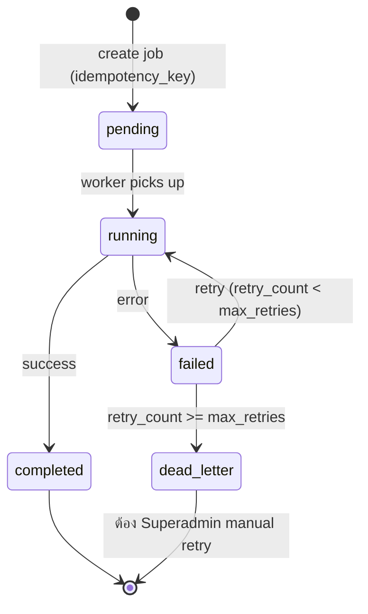

# 91-platform-api-integration-jobs.md

# 91 — Platform API Integration & Background Jobs
## AssetRecovery — Asset Recovery Operations Platform

> สถานะ: Specification v2 (Reformatted)
> Document Level: Foundation / Platform Build Spec
> Applies To: All implementation sprints
> เอกสารอ้างอิง: `00-project-overview.md`, `01-architecture.md`, `02-database-schema-design.md` §10 (jobs table), `37-accounting-pack-export-history.md`, `DECISIONS-NEEDED.md`

## Changelog

| Version | วันที่ | การเปลี่ยนแปลง |
|---|---|---|
| v1 | (เดิม) | สร้างไฟล์ครั้งแรก — Background Job, Import/Export, Retry, Queue |
| v2 | 03/07/2569 | Reformat ตามมาตรฐานเอกสารชุดใหม่ (header block, job lifecycle state diagram, job_type จริงจาก schema, endpoint จริง, Decisions/Open Items แยกชัดเจน) — **เนื้อหาเดิมคงไว้ครบ ไม่มีการเปลี่ยน business logic** |
| v2.1 | 04/07/2569 | **เพิ่ม §14.1 Dev Trigger Endpoint** (`POST /api/dev/trigger-job`) — เพื่อให้ dev ทดสอบ Background Job บน local ได้โดยไม่ต้องรอ Vercel Cron — บังคับปิดตัวเองใน production เสมอ (ดู §14, §14.1) |
| v2.2 | 04/07/2569 | **เติม job_type `advance_overdue` ใน §6.1** — background job auto-mark Advance ที่เลย `due_clear_date` เป็น `overdue` ถูกกำหนดไว้แล้วในไฟล์ 15 (§9.1/§10/§13/EVENT `advance.overdue`) แต่ตกหล่นจากรายการ job_type — sync comment ใน `02-database-schema-design.md` (ตาราง jobs) แล้วเช่นกัน |

ขอบเขตเอกสารนี้: มาตรฐาน Background Job, Import/Export, Retry, Queue และ Scheduled Tasks ที่ใช้ร่วมกันข้ามทุกโมดูล — รันผ่าน Vercel Cron / QStash (Upstash) ตาม DEC-001

**ไม่รวมอยู่ในไฟล์นี้**: รายละเอียด export pack ของ accounting โดยเฉพาะ (ดู `37-accounting-pack-export-history.md`), รายละเอียด API contract ของแต่ละ module (ดู `27-finance-api-contracts.md`, `45-case-warehouse-api-contracts.md`)

---

## 1. Summary

มาตรฐาน Background Job, Import/Export, Retry, Queue และ Scheduled Tasks

## 2. Purpose

มาตรฐาน Background Job, Import/Export, Retry, Queue และ Scheduled Tasks

## 3. In Scope

- Foundation spec
- ใช้รองรับกลุ่ม A และอนาคต
- กำหนดมาตรฐาน implementation

## 4. Out of Scope

- business flow เฉพาะหน้าจอในกลุ่ม A
- workflow ติดตามทรัพย์ final

## 5. Actors & Responsibilities

| Actor / Role | Responsibility | Scope |
|---|---|---|
| Superadmin | กำหนดค่าและเข้าถึงทุกส่วน | Global |
| บริหาร / Executive | อนุมัติ policy, exception, lock/unlock, scope decision | Organization |
| บัญชี (Accounting) | ตรวจข้อมูลบัญชี ส่งออก pack กระทบยอด WHT | Accounting scope |
| การเงิน (Finance) | ควบคุม claim payout payee billing receipt | Finance scope |
| เจ้าหน้าที่อนุมัติเคส (Case Approver) | พิจารณารับ/ไม่รับเคส, อนุมัติ recycle, ตีกลับหลักฐาน | Global — ทุกเคส (Role Group: system) |
| ผู้จัดการทีมติดตามทรัพย์ (Manager) | กำกับทีม ตรวจงาน อนุมัติขั้นต้นค่าตอบแทน | หลายทีม (Role Group: inhouse/outsource) |
| หัวหน้า (Supervisor) | กำกับทีมเดียว | ทีมเดียว (Role Group: inhouse/outsource) |
| ธุรการ / Admin | บันทึกข้อมูลและแนบเอกสารตามสิทธิ์ | Assigned scope |
| บริษัทไฟแนนซ์ (Company User) | ยื่นเคสและติดตามสถานะที่ได้รับอนุญาต | Company scope — 3 ระดับ (ผู้จัดการ/หัวหน้า/แอดมิน) |
| พนักงานติดตามทรัพย์ (Field Agent) | รับงาน อัปเดตผล แนบหลักฐาน | Assigned case scope (Role Group: inhouse/outsource) |

## 6. Core Concepts

| Concept | Meaning | Implementation Notes |
|---|---|---|
| Consistency | ใช้มาตรฐานเดียวกันทุก module | ลดงานแก้ภายหลัง |
| Reusability | component/rule ใช้ซ้ำ | Cursor ทำซ้ำได้ |
| Traceability | ทุก action ต้อง trace | audit/report |

### 6.1 Job Type ที่ระบบรู้จัก (จาก `02-database-schema-design.md` §10)

| job_type | ใช้เมื่อ | ไฟล์อ้างอิง |
|---|---|---|
| `export_pack` | บัญชีกดปุ่ม "Export Accounting Pack" ตอนปิดงวด | `37-accounting-pack-export-history.md` |
| `bank_file` | สร้างไฟล์โอนเงินสำหรับ Payout Batch | `17-payroll-and-payout.md` |
| `wht_summary` | สรุปยื่น WHT รายเดือน (ภ.ง.ด.3/53) | `33-accounting-wht-data.md` |
| `reassign_timeout` | Assignment หมดเวลารอรับงาน → auto reassign | `40-case-assignment-routing.md` |
| `advance_overdue` | สแกน Advance ที่ `status = approved` และเลย `due_clear_date` → auto-mark เป็น `overdue` (actor = system job, ต้อง audit) | `15-claims-and-advances.md` §9.1/§10 |

> รายการนี้อาจเพิ่มในอนาคตตาม module ใหม่ — ทุก job_type ใหม่ต้อง update ตารางนี้

### 6.2 Job Lifecycle (State Diagram)

> ตรงกับ enum `job_status` ใน `02-database-schema-design.md` §3 (`pending`, `running`, `completed`, `failed`, `cancelled`) — `dead_letter` เป็น terminal state เชิง concept ที่ derive จาก `failed` + `retry_count >= max_retries` ไม่ใช่ enum value แยก

## 7. Data Entities / Required Objects

| Entity / Object | Purpose | Required Key Fields |
|---|---|---|
| Job | งานเบื้องหลัง | job_type, status, payload, retry_count |
| Import | นำเข้าไฟล์ | source, file_id, result |
| Export | ส่งออกไฟล์ | export_id, version, file_hash |

## 8. UI / UX Rules

- Job status page/log
- Retry button
- Download output
- Error detail

## 9. Workflow / Lifecycle

- Create job → pending → running → success/fail → retry/dead letter

## 10. Security / Control Rules

- Job ต้อง idempotent
- Retry ห้ามสร้างผลซ้ำ
- ไฟล์ output ต้อง versioned/hash

## 11. Validation & Error Handling

| Code / Scenario | Condition | System Behavior |
|---|---|---|
| REQUIRED_MISSING | ข้อมูลบังคับไม่ครบ | inline error |
| DUPLICATE_RECORD | ข้อมูลซ้ำ | reject พร้อมอธิบาย |
| PERMISSION_DENIED | ไม่มีสิทธิ์ | UI hide/disable และ API 403 |
| INVALID_STATUS | สถานะไม่ถูก | reject transition |
| JOB_DUPLICATE | idempotency_key ซ้ำ | คืน job เดิมที่มีอยู่แล้ว ไม่สร้างใหม่ (ตาม `01-architecture.md` §11) |

## 12. Permission Requirements

| Capability | Allowed Roles | Notes |
|---|---|---|
| Trigger job | Allowed module role | ตาม action |
| Retry job | Superadmin/Owner | reason |

## 13. Audit Log Requirements

- ทุก mutation ต้องบันทึก `actor_id`, `role`, `action`, `target_type`, `target_id`, `before`, `after`, `reason`, `created_at`
- ข้อมูลที่กระทบเงิน สิทธิ์ ธนาคาร ภาษี หรือการ lock period ต้องบันทึก reason เสมอ
- Audit log ห้ามแก้ไขย้อนหลัง
- รายการ export/import/background job ต้อง trace กลับไปผู้สั่งงานได้

## 14. API / Integration Draft

| Method | Endpoint / Event | Purpose | Notes |
|---|---|---|---|
| POST | /api/jobs | สร้าง async job | ต้องมี `idempotency_key` (ตาม `01-architecture.md` §11) |
| GET | /api/jobs/{id} | ดูสถานะ job | ใช้ poll จาก UI ระหว่างรอ |
| POST | /api/jobs/{id}/retry | Retry job ที่ failed/dead_letter | Superadmin/Owner เท่านั้น + ต้องระบุ reason |
| GET | /api/jobs?job_type=export_pack | filter ตาม job_type | ใช้ในหน้า Job Log |
| EVENT | job.status.changed | job เปลี่ยนสถานะ | ใช้ trigger notification (ดู `90-platform-audit-notification-reporting.md`) |
| POST | /api/dev/trigger-job | 🔧 **Development Environment เท่านั้น** — Trigger job ทดสอบทันทีโดยไม่ต้องรอ Vercel Cron (เช่น `reassign_timeout`, `export_pack`) | Body: `{ "job_type": string, "payload"?: object }` — **ต้อง return 404 ทันทีถ้า `process.env.NODE_ENV === 'production'`** (ดู §14.1) |

### 14.1 Dev Trigger Endpoint (`/api/dev/trigger-job`)

**วัตถุประสงค์**: Background Job ทั้งหมดรันผ่าน Vercel Cron / QStash ตามเวลาที่ตั้งไว้ (DEC-001) ซึ่งทดสอบใน local development ยาก (ต้องรอเวลาจริงหรือปลอมวันที่เครื่อง) — endpoint นี้ให้ dev กด trigger job ทดสอบได้ทันทีโดยไม่กระทบ production

**กฎบังคับ**:
- **ต้องปิดการใช้งานทันทีเมื่อ `NODE_ENV === 'production'`** (return `404 Not Found` เหมือนไม่มี route นี้อยู่) — ป้องกันไม่ให้มีใครยิง job ทดสอบใน production โดยไม่ได้ตั้งใจ
- รับ `job_type` ตามรายการใน §6.1 เท่านั้น (`export_pack` | `bank_file` | `wht_summary` | `reassign_timeout`) — ถ้าไม่ตรง reject ด้วย `INVALID_STATUS`
- ยังต้องสร้าง job record ผ่าน flow เดียวกับ `POST /api/jobs` ปกติ (มี `idempotency_key`, บันทึก audit log) — ไม่ใช่ shortcut ที่ข้าม business logic แค่ข้าม "การรอเวลา cron" เท่านั้น
- จำกัดสิทธิ์เรียกเฉพาะ role ที่มีสิทธิ์ Trigger job ตาม §12 เช่นเดียวกับ production endpoint

## 15. Acceptance Criteria

- Cursor สามารถใช้ไฟล์นี้เป็น rule กลางก่อน implement module ใด ๆ
- ทุก module ในกลุ่ม A ต้องอ้างอิง foundation เหล่านี้
- UI, permission, audit, validation ต้องสอดคล้องกันทั้งระบบ
- ไม่มี requirement ที่ทำให้ระบบกลายเป็น ERP/GL/Tax filing เต็มรูปแบบ

## 16. Test Cases

| Test Case | Steps | Expected Result |
|---|---|---|
| Permission | role ไม่มีสิทธิ์ | ไม่เห็นปุ่มและ API reject |
| Audit | แก้ข้อมูลสำคัญ | มี audit before/after |
| Validation | ข้อมูลไม่ครบ | แสดง error ชัดเจน |
| Idempotency | ยิง POST /api/jobs ด้วย idempotency_key เดิมซ้ำ | ต้องคืน job เดิม ไม่สร้าง job ใหม่ |
| Dead letter | job fail เกิน max_retries | ต้องเข้าสถานะ dead_letter ไม่ retry ต่อเองอัตโนมัติ |

---

## 17. การตัดสินใจที่เกี่ยวข้อง (Decisions)

- **Background Jobs รันผ่าน Vercel Cron / QStash (Upstash)** — DEC-001 ใน `01-architecture.md` §6.0
- **ทุก job ต้อง idempotent และมี `idempotency_key`** — ป้องกันสร้างผลซ้ำเมื่อ retry (ข้อ 10, 11, 14)
- **job_type ที่ระบบรู้จักตอนนี้มี 4 ประเภท**: `export_pack`, `bank_file`, `wht_summary`, `reassign_timeout` (§6.1) — ตรงกับ table `jobs` ใน `02-database-schema-design.md`
- **Retry มีเพดาน `max_retries`** เกินแล้วเข้า `dead_letter` ต้อง manual retry โดย Superadmin เท่านั้น (§6.2, ข้อ 12)
- **ไฟล์ output (export/bank file) ต้อง versioned + hash เสมอ** ห้าม overwrite (ข้อ 10) — สอดคล้อง Immutable Rules ใน `02-database-schema-design.md` §13

## 18. สิ่งที่ยังต้องตัดสินใจ (Open Items)

- [ ] **Google Maps API** (ใช้คำนวณระยะทางจริงสำหรับค่าน้ำมัน PER_KM) — มี API Key อยู่แล้วหรือยัง? ต้องการ budget limit ต่อเดือนเท่าไหร่? ยังไม่ตัดสินใจ — ดู `DECISIONS-NEEDED.md` หมวด 4.1
- [ ] **SMS/Email Gateway provider** สำหรับ notification jobs — ยังไม่เลือก (ตรงกับ Open Item เดียวกันใน `90-platform-audit-notification-reporting.md` §18)
- [ ] ยืนยันรายละเอียดเมื่อเริ่ม sprint เฉพาะ module (Open Item เดิม)

---

*เอกสารนี้เป็นไฟล์ที่ 2 ในหมวด Platform (90–95) ต่อจาก `90-platform-audit-notification-reporting.md` และก่อน `92-platform-data-model.md`*
