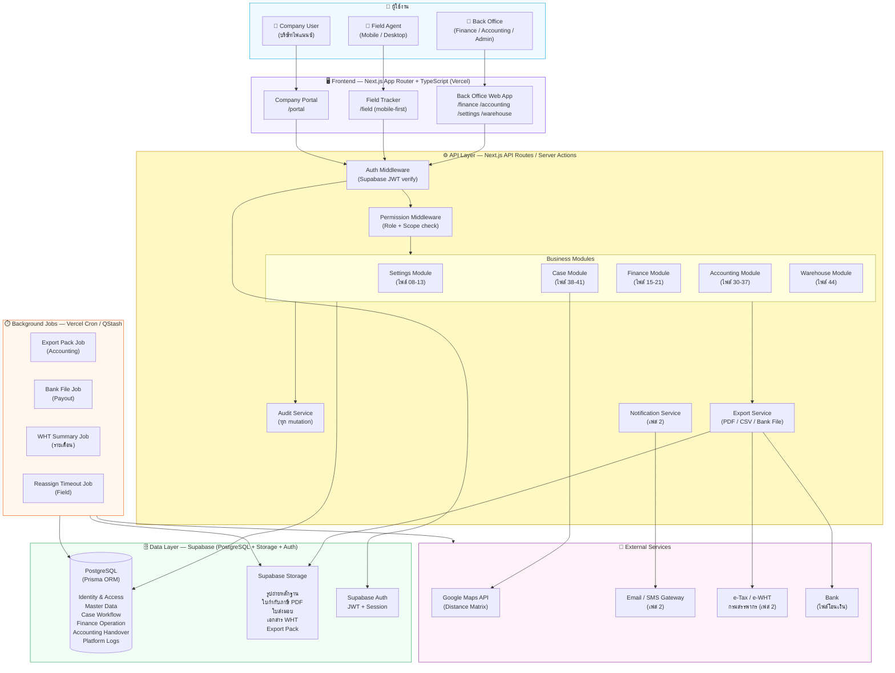
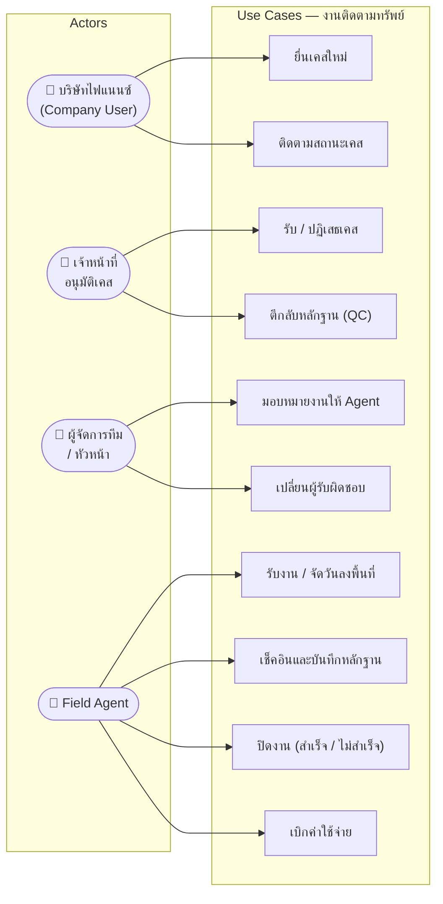
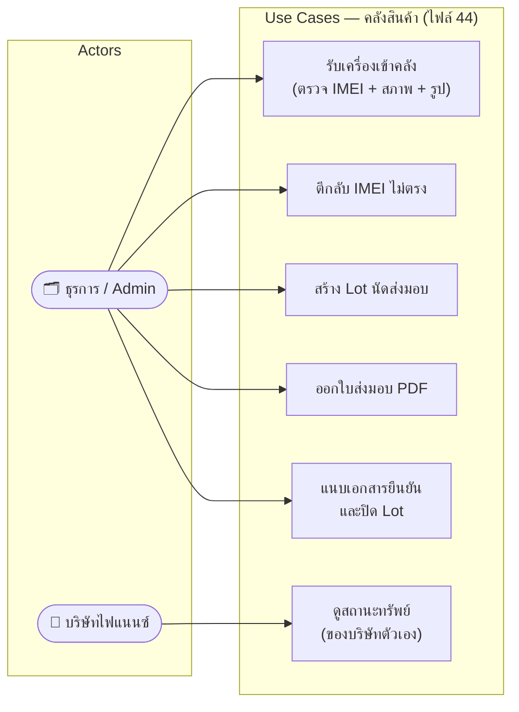
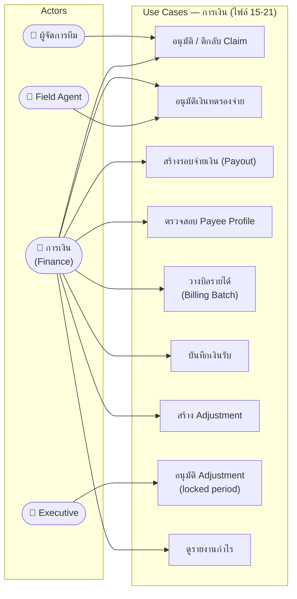
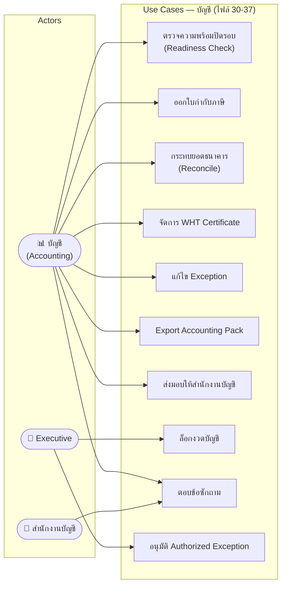
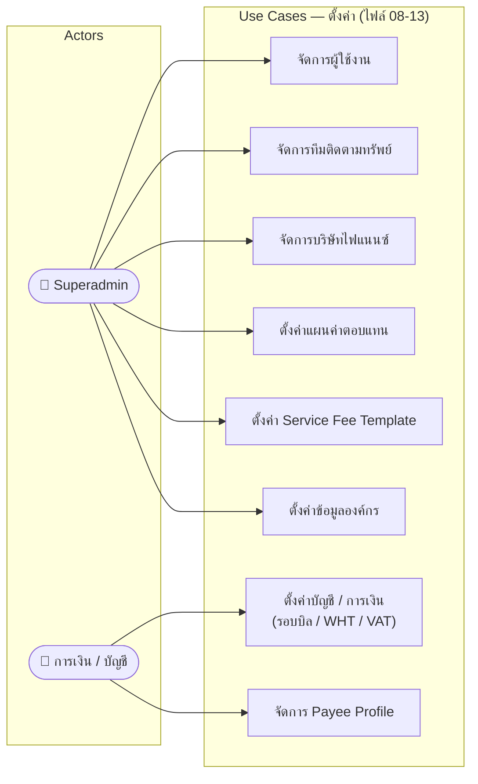
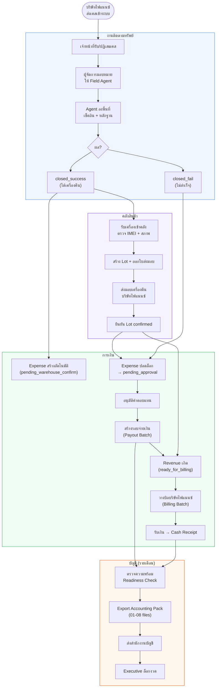

# 95-diagrams.md

# 95 — Diagrams (System Architecture / ER / Use Case / Workflow)
## AssetRecovery — Asset Recovery Operations Platform

> สถานะ: Specification v2 (Reformatted)
> Format: Mermaid — render ได้บน GitHub, Notion, GitLab, และ Cursor
> เอกสารอ้างอิง: `01-architecture.md`, `02-database-schema-design.md`, `26-finance-data-model.md`, `06-menu-and-navigation-map.md`, `07-roles-permissions.md`, `00-project-overview.md`, `92-platform-data-model.md`, `94-decision-log.md`

## Changelog

| Version | วันที่ | การเปลี่ยนแปลง |
|---|---|---|
| v1 | 02/07/2569 | สร้างไฟล์ครั้งแรก — System Architecture, ER Diagram, Use Case Diagram ×5, Main Workflow Diagram |
| v2 | 03/07/2569 | Reformat header ตามมาตรฐานเอกสารชุดใหม่ + เพิ่ม Decisions/Open Items — **Diagram ทั้ง 4 ตัวคงไว้ครบทุกบรรทัด ไม่มีการแก้ไข** (ตรวจสอบแล้วว่า Main Workflow §4 สอดคล้องกับ Warehouse gate ที่บันทึกไว้ใน `92-platform-data-model.md` §6.1 อยู่แล้ว) |

ขอบเขตเอกสารนี้: Diagram รวมของทั้งระบบ 4 ประเภท — System Architecture, ER Diagram, Use Case Diagram (5 module), Main Workflow (Business Flow ภาพรวม) — เป็น visual reference กลางที่ไฟล์อื่นชี้มาที่นี่แทนการวาดซ้ำ

**ไม่รวมอยู่ในไฟล์นี้**: Sequence diagram ระดับ use-case ย่อยของแต่ละ feature (อยู่กระจายในไฟล์ที่เกี่ยวข้อง เช่น `05-auth-and-access-control.md` §6.1, `91-platform-api-integration-jobs.md` §6.2), field เต็มของแต่ละ entity (ดู `02-database-schema-design.md`)

---

## 1. System Architecture Diagram

ภาพรวมโครงสร้างระบบ AssetRecovery ตาม Tech Stack ที่ตัดสินใจแล้ว (DEC-001 ถึง DEC-004)

---

## 2. ER Diagram (Entity Relationship)

แสดงความสัมพันธ์หลักของ entities ทั้งระบบ (อ้างอิงไฟล์ 02, 26, 44)

```mermaid
erDiagram
    %% ══════════════════════════════════════
    %% MASTER DATA
    %% ══════════════════════════════════════
    Organization ||--o{ FinanceCompany : "คู่ค้า"
    Organization ||--o{ Team : "ทีมติดตาม"
    Organization ||--o{ User : "ผู้ใช้งาน"

    FinanceCompany ||--o{ ServiceFeeTemplate : "กติกาค่าบริการ"
    FinanceCompany ||--o{ CompanyUser : "บัญชีไฟแนนซ์"
    FinanceCompany ||--o{ Case : "ส่งเคส"

    Team ||--|| CompensationPlan : "ผูกแผนค่าตอบแทน"
    Team ||--o{ TeamMember : "สมาชิก"
    User ||--o{ TeamMember : ""

    %% ══════════════════════════════════════
    %% CASE WORKFLOW
    %% ══════════════════════════════════════
    Case ||--o{ CaseAssignment : "มอบหมาย"
    Case ||--|| CaseOutcome : "ผลการติดตาม"
    Case ||--o{ Evidence : "หลักฐาน"
    Case ||--o{ CheckIn : "เช็คอิน"
    CaseAssignment }o--|| User : "Field Agent"

    %% ══════════════════════════════════════
    %% WAREHOUSE (ไฟล์ 44)
    %% ══════════════════════════════════════
    Case ||--o| Asset : "ทรัพย์ที่ยึดได้"
    Asset }o--o| HandoverLot : "ล็อตส่งมอบ"
    HandoverLot }o--|| FinanceCompany : "ส่งคืน"

    %% ══════════════════════════════════════
    %% FINANCE OPERATION
    %% ══════════════════════════════════════
    Case ||--o{ Expense : "รายการเบิก"
    Case ||--o| Revenue : "รายได้"

    Expense }o--|| PayeeProfile : "ผู้รับเงิน"
    Expense }o--o| PayoutBatchItem : ""
    PayoutBatchItem }o--|| PayoutBatch : "รอบจ่ายเงิน"

    Revenue }o--o| BillingBatch : "รอบวางบิล"
    BillingBatch }o--|| FinanceCompany : ""

    PayeeProfile }o--|| TaxProfile : "กติกาภาษี"
    PayeeProfile ||--|| User : ""

    Case ||--o{ Advance : "เงินทดรอง"
    Advance }o--|| PayeeProfile : ""

    %% ══════════════════════════════════════
    %% ACCOUNTING HANDOVER
    %% ══════════════════════════════════════
    AccountingPeriod ||--o{ SalesRecord : "รายได้บัญชี"
    AccountingPeriod ||--o{ ExpenseRecord : "ค่าใช้จ่ายบัญชี"
    AccountingPeriod ||--o{ BankTransaction : "รายการธนาคาร"
    AccountingPeriod ||--o{ WHTCertificate : "ใบ 50 ทวิ"
    AccountingPeriod ||--o{ Exception : "ข้อยกเว้น"
    AccountingPeriod ||--o{ AccountantQuestion : "คำถาม"
    AccountingPeriod ||--o{ ExportRecord : "ประวัติ Export"

    SalesRecord ||--o{ TaxInvoice : "ใบกำกับภาษี"
    BillingBatch ||--|| SalesRecord : ""
    BankTransaction }o--o| BillingBatch : "จับคู่"
    BankTransaction }o--o| PayoutBatch : "จับคู่"

    ExpenseRecord ||--o{ WHTCertificate : ""

    %% ══════════════════════════════════════
    %% ADJUSTMENT (polymorphic)
    %% ══════════════════════════════════════
    Adjustment }o--o| Revenue : "ปรับปรุง"
    Adjustment }o--o| Expense : "ปรับปรุง"
    Adjustment }o--o| BillingBatch : "ปรับปรุง"
    Adjustment }o--o| PayoutBatch : "ปรับปรุง"

    %% ══════════════════════════════════════
    %% PLATFORM
    %% ══════════════════════════════════════
    AuditLog }o--|| User : "actor"
```

---

## 3. Use Case Diagram

แสดงความสัมพันธ์ระหว่าง Actor และ Use Case หลักของแต่ละ module

### 3.1 งานติดตามทรัพย์ (Case Workflow)

### 3.2 คลังสินค้า (Warehouse)

### 3.3 การเงิน (Finance)

### 3.4 บัญชี (Accounting)

### 3.5 ตั้งค่า (Settings)

---

## 4. Main Workflow Diagram (Business Flow ภาพรวม)

---

## 5. การตัดสินใจที่เกี่ยวข้อง (Decisions)

- **Diagram ทั้งหมดในไฟล์นี้สร้างจาก Mermaid** — แก้ไขได้โดยตรงในไฟล์นี้ ไม่ต้องใช้เครื่องมือวาดภาพภายนอก
- **System Architecture Diagram สะท้อน DEC-001~004 ครบ** (Next.js/Prisma/Supabase/Vercel, Permission middleware ไม่ใช่ RLS, Supabase Storage, Background Jobs)
- **Main Workflow Diagram (§4) ยืนยันแล้วว่าสอดคล้องกับ Warehouse gate**: Revenue (F5) เกิดจาก Lot confirmed (W4) เป็นหลัก ไม่ใช่จาก Case close (C5) ตรงๆ — ตรงกับที่บันทึกไว้ใน `92-platform-data-model.md` §6.1
- **ไฟล์นี้เป็น single source of truth ของ diagram ระดับระบบ** — ไฟล์อื่นที่ต้องการ diagram ระดับนี้ให้ลิงก์มาที่นี่แทนการวาดซ้ำ (ยกเว้น sequence diagram ระดับ use-case ย่อยที่อยู่ในไฟล์นั้นๆ เอง)

## 6. สิ่งที่ยังต้องตัดสินใจ (Open Items)

- [ ] **ไฟล์นี้ต้องอัปเดตทุกครั้งที่มีการเปลี่ยน Entity, Role, หรือ Flow สำคัญ** (หมายเหตุเดิม) — ยังไม่มี process อัตโนมัติตรวจว่า diagram sync กับ schema จริงหรือไม่ ต้องอาศัยวินัย manual update
- [x] ~~Company Portal (`/portal`) ใน System Architecture Diagram มาร์คเป็น "เฟส 2"~~ ✅ **แก้แล้ว 04/07/2569** — Product Owner ยืนยัน Client Portal deploy เป็นส่วนหนึ่งของ Phase 1 (`97-client-portal.md` v4) — ลบ label "เฟส 2" ออกจาก diagram (§1) แล้ว
- [ ] Notification Service ใน System Architecture Diagram มาร์คเป็น "เฟส 2" — ต้อง sync กับการตัดสินใจ Notification channel ที่ยังค้างอยู่ (ดู `90-platform-audit-notification-reporting.md` §18)

---

*เอกสารนี้เป็นไฟล์สุดท้ายในหมวด Platform (90–95) และเป็นไฟล์สุดท้ายของ Batch 1 (Foundation & Platform) — Batch 1 เสร็จสมบูรณ์ครบ 13/13 ไฟล์*
