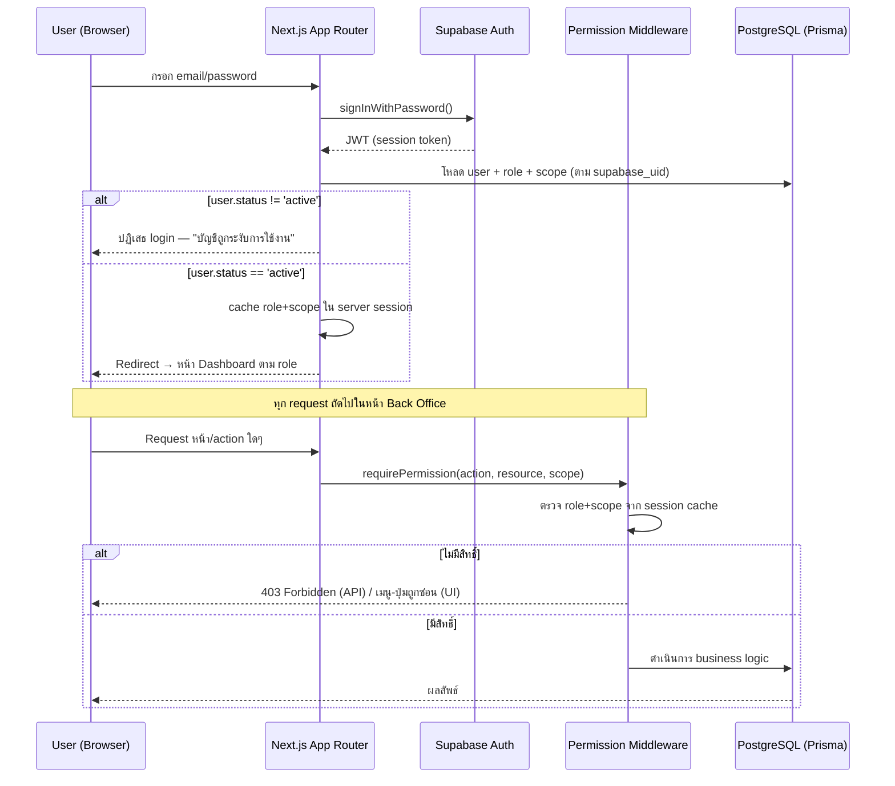

# 05-auth-and-access-control.md

# 05 — Authentication & Access Control
## AssetRecovery — Asset Recovery Operations Platform

> สถานะ: Specification v2 (Reformatted)
> Document Level: Foundation / Platform Build Spec
> Applies To: All implementation sprints
> เอกสารอ้างอิง: `00-project-overview.md`, `01-architecture.md` §6.1, `07-roles-permissions.md`, `08-users.md`, `94-decision-log.md`

## Changelog

| Version | วันที่ | การเปลี่ยนแปลง |
|---|---|---|
| v1 | (เดิม) | สร้างไฟล์ครั้งแรก — Login, Session, Route Guard, Action-level permission |
| v2 | 03/07/2569 | Reformat ตามมาตรฐานเอกสารชุดใหม่ (header block, Login sequence diagram, endpoint จริงแทน placeholder, Decisions/Open Items แยกชัดเจน) — **เนื้อหาเดิมคงไว้ครบ ไม่มีการเปลี่ยน business logic** |
| v3 | 03/07/2569 | Product Owner ยืนยัน 2 Open Item: (1) Session timeout = 24 ชั่วโมง (2) MFA ไม่เปิดใช้ในเฟส 1 — ย้ายจาก Open Item เป็น Decision (§17), อัปเดตค่าใน §10 |
| v3.2 | 14/08/2569 | **ปิด open item D1** ตามมติ PO: การตั้งรหัสผ่านครั้งแรกใช้ลิงก์คำเชิญทางอีเมล (`inviteUserByEmail`) → เพิ่มเป็น Decision ใน §17 พร้อมรายละเอียดหน้าปลายทาง/ผู้ส่งซ้ำ/นโยบายรหัสผ่าน · implement ที่ Phase 1.9 (`lib/users/invite.ts` · `lib/users/provisioning.ts` · `/auth/set-password`) — ไม่กระทบ auth logic เดิม (login/session/route guard เหมือนเดิมทุกข้อ) |
| v3.1 | 04/07/2569 | แก้จำนวน role อ้างอิง "14" → "15" ตามการนับใหม่ในไฟล์ 07 v2.2 / seed data ไฟล์ 02 §12 (แก้ตัวเลขอ้างอิงเท่านั้น ไม่กระทบ auth logic) |

ขอบเขตเอกสารนี้: กลไก Authentication/Session/Route Guard เชิงเทคนิค — วิธี login, การตรวจสอบ session, การ guard route ตาม permission

**ไม่รวมอยู่ในไฟล์นี้**: รายชื่อ Role และ Permission Matrix แบบละเอียด (ดู `07-roles-permissions.md` — เป็น single source of truth ของ Role/Permission) การจัดการ User lifecycle (ดู `08-users.md`)

---

## 1. Summary

มาตรฐาน Login, Session, Role, Permission, Route Guard และ Action-level permission

## 2. Purpose

มาตรฐาน Login, Session, Role, Permission, Route Guard และ Action-level permission

## 3. In Scope

- Foundation spec
- ใช้รองรับกลุ่ม A และอนาคต
- กำหนดมาตรฐาน implementation

## 4. Out of Scope

- business flow เฉพาะหน้าจอในกลุ่ม A
- workflow ติดตามทรัพย์ final

## 5. Actors & Responsibilities

| Actor / Role | Responsibility | Scope |
|---|---|---|
| Superadmin | กำหนดค่าและเข้าถึงทุกส่วน | Global |
| บริหาร / Executive | อนุมัติ policy, exception, lock/unlock, scope decision | Organization |
| บัญชี (Accounting) | ตรวจข้อมูลบัญชี ส่งออก pack กระทบยอด WHT | Accounting scope |
| การเงิน (Finance) | ควบคุม claim payout payee billing receipt | Finance scope |
| เจ้าหน้าที่อนุมัติเคส (Case Approver) | พิจารณารับ/ไม่รับเคส, อนุมัติ recycle, ตีกลับหลักฐาน | Global — ทุกเคส (Role Group: system) |
| ผู้จัดการทีมติดตามทรัพย์ (Manager) | กำกับทีม ตรวจงาน อนุมัติขั้นต้นค่าตอบแทน | หลายทีม (Role Group: inhouse/outsource) |
| หัวหน้า (Supervisor) | กำกับทีมเดียว | ทีมเดียว (Role Group: inhouse/outsource) |
| ธุรการ / Admin | บันทึกข้อมูลและแนบเอกสารตามสิทธิ์ | Assigned scope |
| บริษัทไฟแนนซ์ (Company User) | ยื่นเคสและติดตามสถานะที่ได้รับอนุญาต | Company scope — 3 ระดับ (ผู้จัดการ/หัวหน้า/แอดมิน) |
| พนักงานติดตามทรัพย์ (Field Agent) | รับงาน อัปเดตผล แนบหลักฐาน | Assigned case scope (Role Group: inhouse/outsource) |

## 6. Core Concepts

| Concept | Meaning | Implementation Notes |
|---|---|---|
| Consistency | ใช้มาตรฐานเดียวกันทุก module | ลดงานแก้ภายหลัง |
| Reusability | component/rule ใช้ซ้ำ | Cursor ทำซ้ำได้ |
| Traceability | ทุก action ต้อง trace | audit/report |

### 6.1 Login Flow (Sequence Diagram)

> สอดคล้องกับ Permission Architecture ใน `01-architecture.md` §6.1 — Auth (Supabase) แยกจาก Permission (backend middleware) เสมอ ไม่ใช้ Supabase RLS

## 7. Data Entities / Required Objects

| Entity / Object | Purpose | Required Key Fields |
|---|---|---|
| User | บัญชีผู้ใช้ | email, phone, role_id, status |
| Role | บทบาท | name, group, permissions |
| Session | การเข้าใช้งาน | user_id, expires_at |
| Permission | สิทธิ์ action | capability, roles |

## 8. UI / UX Rules

- เมนูที่ไม่มีสิทธิ์ต้องซ่อนหรือ disabled
- ปุ่ม action ที่ไม่มีสิทธิ์ต้องซ่อน/disabled
- API ต้องตรวจสิทธิ์ซ้ำ

## 9. Workflow / Lifecycle

- Login → Load user/role → Render allowed menu → Action checks permission → Audit

## 10. Security / Control Rules

- API permission สำคัญกว่า UI
- Superadmin ห้าม lockout
- User inactive ห้าม login
- Session timeout = 24 ชั่วโมง (ยืนยันแล้ว — ดู §17 Decisions) — หลังหมดอายุบังคับ re-login

## 11. Validation & Error Handling

| Code / Scenario | Condition | System Behavior |
|---|---|---|
| REQUIRED_MISSING | ข้อมูลบังคับไม่ครบ | inline error |
| DUPLICATE_RECORD | ข้อมูลซ้ำ | reject พร้อมอธิบาย |
| PERMISSION_DENIED | ไม่มีสิทธิ์ | UI hide/disable และ API 403 |
| INVALID_STATUS | สถานะไม่ถูก | reject transition |

## 12. Permission Requirements

| Capability | Allowed Roles | Notes |
|---|---|---|
| Manage users | Superadmin, ธุรการ (ตามสิทธิ์ที่ได้รับมอบหมาย) | ตาม scope |
| Manage roles | Superadmin | critical — ดูรายชื่อ Role เต็ม 15 ตัวที่ไฟล์ 07 |
| View own profile | All users | self |

> **หมายเหตุ**: ไฟล์นี้กำหนดกลไก Auth/Session/Route Guard เชิงเทคนิค — รายชื่อ Role และ Permission Matrix แบบละเอียดเป็น single source of truth ที่ไฟล์ 07

## 13. Audit Log Requirements

- ทุก mutation ต้องบันทึก `actor_id`, `role`, `action`, `target_type`, `target_id`, `before`, `after`, `reason`, `created_at`
- ข้อมูลที่กระทบเงิน สิทธิ์ ธนาคาร ภาษี หรือการ lock period ต้องบันทึก reason เสมอ
- Audit log ห้ามแก้ไขย้อนหลัง
- รายการ export/import/background job ต้อง trace กลับไปผู้สั่งงานได้
- **Login/failed login ต้องบันทึกทุกครั้ง** (ตาม `90-platform-audit-notification-reporting.md` §1.1 — audit action `login`/`logout`)

## 14. API / Integration Draft

| Method | Endpoint / Event | Purpose | Notes |
|---|---|---|---|
| POST | /api/auth/login | Sign in ผ่าน Supabase Auth | คืน JWT + redirect ตาม role |
| POST | /api/auth/logout | Sign out | invalidate session |
| GET | /api/auth/session | ตรวจ session ปัจจุบัน | ใช้ตอน page load เพื่อโหลด role+scope |
| EVENT | auth.login.failed | บันทึก failed login | ส่งไป audit log ทุกครั้ง |

## 15. Acceptance Criteria

- Cursor สามารถใช้ไฟล์นี้เป็น rule กลางก่อน implement module ใด ๆ
- ทุก module ในกลุ่ม A ต้องอ้างอิง foundation เหล่านี้
- UI, permission, audit, validation ต้องสอดคล้องกันทั้งระบบ
- ไม่มี requirement ที่ทำให้ระบบกลายเป็น ERP/GL/Tax filing เต็มรูปแบบ

## 16. Test Cases

| Test Case | Steps | Expected Result |
|---|---|---|
| Permission | role ไม่มีสิทธิ์ | ไม่เห็นปุ่มและ API reject |
| Audit | แก้ข้อมูลสำคัญ | มี audit before/after |
| Validation | ข้อมูลไม่ครบ | แสดง error ชัดเจน |
| Inactive login | user.status = suspended ลอง login | ปฏิเสธ พร้อมข้อความชัดเจน |
| Superadmin lockout | ลอง deactivate Superadmin คนสุดท้าย | ระบบต้อง block ไม่ให้ lockout ตัวเอง |

---

## 17. การตัดสินใจที่เกี่ยวข้อง (Decisions)

- **Auth (Supabase Auth/JWT) แยกจาก Permission (backend middleware) เสมอ** — สอดคล้อง DEC-002 ใน `01-architecture.md` §6.1 ไม่ใช้ Supabase RLS
- **Role + scope cache ใน server session** ไม่ query DB ทุก request — ตาม `01-architecture.md` §6.1
- **API permission สำคัญกว่า UI เสมอ** — UI hide/disable เป็นแค่ UX (ข้อ 8, 10)
- **User ที่ status ≠ active ห้าม login เด็ดขาด** (ข้อ 10)
- **Superadmin ห้าม lockout ตัวเอง** — ต้องมี safeguard กันไม่ให้ deactivate Superadmin คนสุดท้ายของระบบ (ข้อ 10, เพิ่ม test case ข้อ 16)
- **รายชื่อ Role/Permission Matrix แบบเต็มอยู่ที่ `07-roles-permissions.md` เท่านั้น** — ไฟล์นี้ไม่ duplicate รายละเอียด role
- **Session timeout = 24 ชั่วโมง** — ยืนยันกับ Product Owner 03/07/2569 (เดิมเป็น Open Item)
- **การตั้งรหัสผ่านครั้งแรก = ลิงก์คำเชิญทางอีเมล (`inviteUserByEmail`)** — ยืนยันกับ Product Owner 14/08/2569 (ปิด open item D1): ผู้ใช้ตั้งรหัสผ่านเองที่หน้า `/auth/set-password` · ระบบไม่เก็บ/ไม่ตั้งรหัสผ่านแทนใคร · ส่งซ้ำได้โดยผู้มีสิทธิ์ `manage_users` ผ่าน `POST /api/users/:id/invite` (บังคับ `reason`) · อายุลิงก์ใช้ค่าของ Supabase project · รหัสผ่านขั้นต่ำ 8 ตัว มีทั้งตัวอักษรและตัวเลข
- **MFA (Multi-Factor Authentication) ไม่เปิดใช้ในเฟส 1** — ยืนยันกับ Product Owner 03/07/2569 — คงเป็น Open Item สำหรับเฟส 2 ว่าจะเปิดหรือไม่ และถ้าเปิดจะเปิดทุก role หรือเฉพาะ role สูง

## 18. สิ่งที่ยังต้องตัดสินใจ (Open Items)

- [ ] ยืนยันรายละเอียดเมื่อเริ่ม sprint เฉพาะ module (Open Item เดิม)

---

*เอกสารนี้เป็นไฟล์ที่ 6 ในหมวด Foundation & Platform ต่อจาก `04-ui-ux-design-system.md` และก่อน `06-menu-and-navigation-map.md`*
