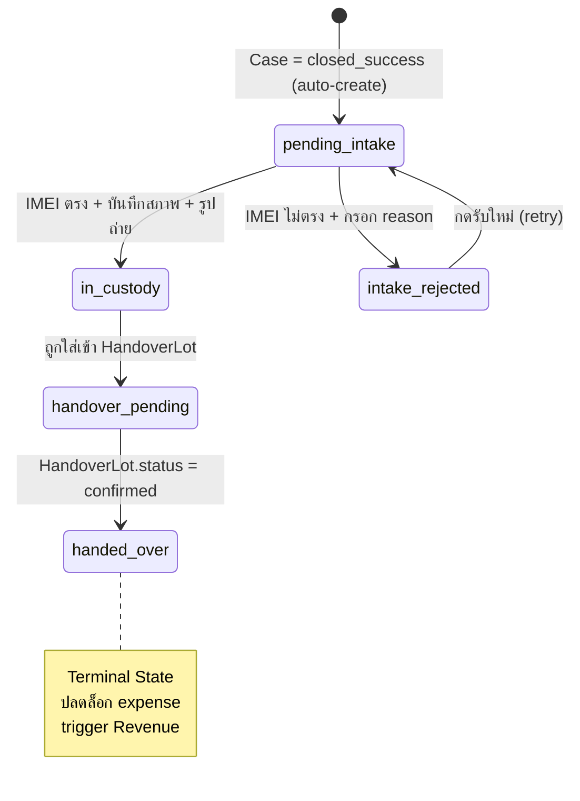
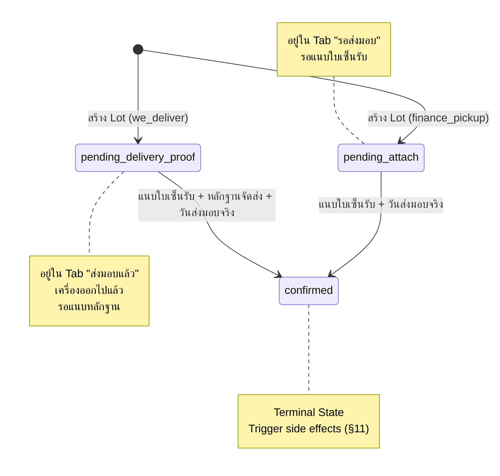

# 44-asset-custody-handover.md

# 44 — Asset Custody & Handover (คลังสินค้าและการส่งมอบทรัพย์คืน)
## AssetRecovery — Asset Recovery Operations Platform

> สถานะ: Specification v2 (Reformatted — โครงสร้างตามมาตรฐานเอกสารชุดใหม่)
> Document Level: Case & Field Operations Module — Build Spec / Implementation-ready
> เอกสารอ้างอิง: `41-field-tracker-mobile.md` §6.6, `15-claims-and-advances.md`, `19-revenue-billing-receivable.md` §6.1, `23-finance-state-machines.md`, `38-case-submission.md`
> Supersedes: flag `pending_warehouse_confirm` แบบหยาบเดิม (ไฟล์ 41 §6.6) — ปิด Open Item #3 จากไฟล์ 41

## Changelog

| Version | วันที่ | การเปลี่ยนแปลง |
|---|---|---|
| v1 | (เดิม) | ออกแบบเสร็จสมบูรณ์ พร้อม Mockup (`warehouse.html`) |
| v2 | 03/07/2569 | Reformat ตามมาตรฐานเอกสารชุดใหม่ (header/Changelog + แยก Decisions/Open Items ชัดเจน) — **เนื้อหา business logic เดิมคงไว้ครบ 100% ไม่มีการเปลี่ยนแปลง** |
| v2.1 | 14/08/2569 | §12 เพิ่ม 3 code ที่ตารางเดิมตกหล่น (`ASSET_NOT_FOUND`, `ASSET_INVALID_STATUS`, `LOT_NOT_FOUND`) — code ระดับ "ไม่พบ/สถานะไม่ตรง" ที่ทุก endpoint ของ §15 ต้องใช้ ลงพร้อม implementation Phase 2.13 ตาม Rule 04 (doc + code คอมมิตเดียวกัน) · **business logic เดิมไม่เปลี่ยน** |

ขอบเขตเอกสารนี้: โมดูลบริหารจัดการสินทรัพย์ที่ยึดคืนจากเคส `closed_success` ตั้งแต่รับเข้าคลัง ตรวจสภาพ จัดล็อตส่งมอบ จนถึงยืนยันส่งมอบคืนบริษัทไฟแนนซ์ — พร้อม trigger ปลดล็อก expense และสร้าง Revenue อัตโนมัติเมื่อล็อต confirmed

**ไม่รวมอยู่ในไฟล์นี้**: GPS tracking การขนส่ง (เฟส 2), Auto Notification ไปบริษัทไฟแนนซ์ (เฟส 2)

---

## 1. Summary
โมดูลบริหารจัดการสินทรัพย์ที่ยึดคืนจากเคส `closed_success` ตั้งแต่รับเข้าคลัง ตรวจสภาพ จัดล็อตส่งมอบ จนถึงยืนยันส่งมอบคืนบริษัทไฟแนนซ์ — และ trigger ปลดล็อก expense + Revenue อัตโนมัติ

## 2. Purpose
แทนที่ flag หยาบ `pending_warehouse_confirm` (ไฟล์ 41 §6.6) ด้วย module จริงที่มี state machine ครบ เชื่อม 3 module:
- **expense** (ไฟล์ 15): ปลดล็อกเมื่อ Lot confirmed
- **Revenue** (ไฟล์ 19): trigger สร้างเมื่อ Lot confirmed + expense approved
- **Case** (ไฟล์ 38): ปิดสมบูรณ์เมื่อ asset ทุกตัว handed_over

## 3. In Scope
- รับเครื่องเข้าคลัง: ตรวจ IMEI, บันทึกสภาพ, ถ่ายรูป 7 มุม
- ตีกลับ (intake_rejected): IMEI ไม่ตรง — ยังไม่รับเข้าคลัง
- ในคลัง: ดูรายการเครื่อง grouped by บริษัทไฟแนนซ์
- นัดวันส่งมอบ (สร้าง Lot): เลือกเครื่อง + รูปแบบ + วันนัด
- ออกใบส่งมอบ PDF อัตโนมัติ
- แนบเอกสารและยืนยัน Lot → ปลดล็อก expense + Revenue

## 4. Out of Scope
- GPS Tracking การขนส่ง (เฟส 2)
- Auto Notification ไปบริษัทไฟแนนซ์ (เฟส 2)
- Inventory Management (สต็อก อุปกรณ์อื่น ฯลฯ)
- เคส `closed_fail` — ไม่มีการยึดทรัพย์ ไม่ผ่านโมดูลนี้เลย

---

## 5. Actors & Responsibilities

| Actor / Role | Responsibility | Scope |
|---|---|---|
| ธุรการ / Admin | รับเครื่องเข้าคลัง, ตรวจ IMEI, ถ่ายรูป, ตีกลับ, สร้าง Lot, นัดวัน, แนบเอกสาร, ยืนยัน | Warehouse scope |
| ผู้จัดการทีม / Supervisor | ตรวจสอบกรณี IMEI ไม่ตรง | Team scope |
| การเงิน / Finance | ดู asset status ประกอบการอนุมัติ expense | Read-only |
| บัญชี / Accounting | ดู Lot confirmed ประกอบการลงบัญชี | Read-only |
| Executive | ดูภาพรวม Warehouse Summary | Read-only |
| บริษัทไฟแนนซ์ (Company User) | ดูสถานะ asset ของเคสบริษัทตัวเอง | Company scope — Read-only |

---

## 6. Core Concepts

### 6.1 Asset (ทรัพย์ที่ยึดคืน)
เครื่องที่ Field Agent ยึดได้จากเคส `closed_success` — **1 เคส = 1 Asset เสมอ**

Asset เกิดขึ้นอัตโนมัติเมื่อ Case เปลี่ยนเป็น `closed_success` (ไฟล์ 38) และเข้าคิวรอรับเข้าคลัง (`pending_intake`)

### 6.2 HandoverLot (ล็อตส่งมอบ)
กลุ่ม Asset ที่ส่งมอบพร้อมกันในครั้งเดียว

**กฎสำคัญ:**
- **1 Lot = 1 บริษัทไฟแนนซ์ เสมอ** — ห้ามผสมบริษัท (MIXED_COMPANY_LOT)
- **1 Lot = 1 ใบส่งมอบ** — เลขที่ออกอัตโนมัติ `DLV-YYYY-XXX` (พ.ศ.)
- **1 Lot = 1 เลขล็อต** — ออกอัตโนมัติ `LOT-YYYY-XXX` (พ.ศ.)
- เลขที่ทั้งสองไม่ซ้ำและแก้ไขไม่ได้หลังสร้าง

### 6.3 รูปแบบการส่งมอบ (HandoverType)

| Type | Description | เอกสารที่ต้องแนบก่อน confirmed | Draft อยู่ที่ tab ไหน |
|---|---|---|---|
| `finance_pickup` | บริษัทไฟแนนซ์มารับที่คลัง | ① ใบส่งมอบที่มีลายเซ็นผู้รับ | **"รอส่งมอบ"** (รอแนบเซ็น) |
| `we_deliver` | เราจัดส่งไปให้ | ① ใบส่งมอบลายเซ็น + ② หลักฐานจัดส่ง | **"ส่งมอบแล้ว"** (เครื่องออกไปแล้ว รอหลักฐาน) |

> **เหตุผลที่ we_deliver อยู่ใน "ส่งมอบแล้ว" ทันที**: เมื่อจัดส่งออกไปแล้ว เครื่องไม่อยู่ในคลังแล้ว จึงจัดอยู่ใน "ส่งมอบแล้ว" แม้จะยังรอหลักฐานยืนยัน

### 6.4 เอกสาร
- **ใบส่งมอบ PDF**: ออกจากระบบอัตโนมัติตาม template — เลขที่ไม่ซ้ำ ไม่แก้ไขได้ — พิมพ์ให้ผู้รับเซ็น แล้วสแกนแนบกลับ
- **Export Excel ต่อ Lot**: รายการเครื่องทั้งหมดในล็อต (case ref, ชื่อลูกหนี้, IMEI, สภาพ)
- **ใบส่งมอบลายเซ็น**: Supabase Storage — `handover-lots/{lotId}/signed-doc.pdf`
- **หลักฐานจัดส่ง** (we_deliver): Supabase Storage — `handover-lots/{lotId}/delivery-proof.{ext}`

### 6.5 IMEI Validation
- เปรียบเทียบ `imei_actual` กับ `imei_contract` แบบ **exact match 15 หลัก**
- ห้าม fuzzy match เด็ดขาด — IMEI ที่ต่างกัน 1 หลักถือว่าไม่ตรง
- ถ้าไม่ตรง: แสดงค่าทั้งสองเคียงกันให้ธุรการเปรียบเทียบ และแนะนำให้ตีกลับ

---

## 7. Data Entities / Required Objects

### 7.1 Asset

| Field | Type | Required | Description |
|---|---|---|---|
| id | uuid | ✅ | Primary key |
| organization_id | uuid | ✅ | Multi-tenant (ไฟล์ 02 §5) |
| case_id | uuid | ✅ | FK → Case (ไฟล์ 38) — ต้องเป็น closed_success |
| company_id | uuid | ✅ | FK → FinanceCompany (ไฟล์ 10) |
| lot_id | uuid \| null | — | FK → HandoverLot — null ถ้ายังไม่มี Lot |
| case_ref | string | ✅ | snapshot จาก Case เช่น SF-2026-00832 |
| debtor_name | string | ✅ | snapshot ชื่อลูกหนี้ |
| device_desc | string | ✅ | ยี่ห้อ รุ่น สี |
| imei_contract | varchar(15) | ✅ | IMEI จากสัญญา (ดึงจาก Case) |
| imei_actual | varchar(15) \| null | — | IMEI ที่ตรวจจริง (null ก่อนตรวจ) |
| asset_status | enum | ✅ | ดู §9.1 |
| condition | enum \| null | — | normal / damaged / partial_loss |
| condition_note | string \| null | — | บังคับถ้า condition ≠ normal |
| photos | string[] | — | Supabase Storage URLs (7 มุม) |
| closed_at | timestamptz | ✅ | วันที่เคสปิด (snapshot จาก Case) |
| received_at | timestamptz \| null | — | วันเวลารับเข้าคลัง |
| reject_reason | string \| null | — | เหตุผลตีกลับ (บังคับถ้า intake_rejected) |
| rejected_at | timestamptz \| null | — | — |
| rejected_by | uuid \| null | — | FK → User |
| created_at | timestamptz | ✅ | UTC |
| created_by | uuid | ✅ | FK → User |
| updated_at | timestamptz | ✅ | UTC |
| updated_by | uuid \| null | — | FK → User |
| deleted_at | timestamptz \| null | — | Soft delete |

**Constraints:**
- `UNIQUE(organization_id, imei_contract)` — 1 IMEI ต่อ 1 organization
- `INDEX(organization_id, asset_status)` — query รายการตาม status
- `INDEX(organization_id, company_id, asset_status)` — filter ตาม company

### 7.2 HandoverLot

| Field | Type | Required | Description |
|---|---|---|---|
| id | uuid | ✅ | Primary key |
| organization_id | uuid | ✅ | Multi-tenant |
| company_id | uuid | ✅ | FK → FinanceCompany |
| lot_number | string | ✅ | Auto-gen: LOT-2569-001 — UNIQUE |
| doc_ref | string | ✅ | Auto-gen: DLV-2569-001 — UNIQUE |
| type | enum | ✅ | finance_pickup / we_deliver |
| status | enum | ✅ | ดู §9.2 |
| scheduled_at | timestamptz \| null | — | วันนัดรับ/ส่ง |
| contact_person | string \| null | — | ผู้ประสานงาน (finance_pickup) |
| delivery_addr | string \| null | — | ที่อยู่จัดส่ง (we_deliver — บังคับ) |
| delivered_at | timestamptz \| null | — | วันส่งมอบจริง (กรอกตอนยืนยัน) |
| tracking_no | string \| null | — | เลขพัสดุ (we_deliver — ไม่บังคับ กรณีไรเดอร์) |
| confirmed_at | timestamptz \| null | — | วันยืนยัน |
| confirmed_by | uuid \| null | — | FK → User |
| signed_doc_url | string \| null | — | ① ใบส่งมอบลายเซ็น (บังคับก่อน confirmed) |
| delivery_proof_url | string \| null | — | ② หลักฐานจัดส่ง (บังคับเฉพาะ we_deliver) |
| note | string \| null | — | หมายเหตุ |
| created_at | timestamptz | ✅ | UTC |
| created_by | uuid | ✅ | FK → User |
| updated_at | timestamptz | ✅ | UTC |
| updated_by | uuid \| null | — | FK → User |
| deleted_at | timestamptz \| null | — | Soft delete (ห้ามถ้า confirmed) |

**Constraints:**
- `UNIQUE(lot_number)` / `UNIQUE(doc_ref)` — ใช้ PostgreSQL sequence
- `INDEX(organization_id, status)` — filter "รอส่งมอบ"
- `INDEX(organization_id, company_id, status)` — filter ตาม company

---

## 8. UI / UX Rules (อ้างอิง warehouse.html)

### 8.1 โครงสร้างหน้า

4 แท็บหลัก (ตัวเลขใน badge = จำนวนรายการ):

| แท็บ | Badge นับจาก | หน้าตา |
|---|---|---|
| รับเข้าคลัง | `pending_intake` + `intake_rejected` | ตาราง + filter bar |
| ในคลัง | `in_custody` + `handover_pending` | การ์ด grouped by บริษัท |
| รอส่งมอบ | `pending_attach` Lots | การ์ด Lot |
| ส่งมอบแล้ว | `confirmed` + `pending_delivery_proof` Lots | การ์ด Lot |

### 8.2 แท็บ "รับเข้าคลัง"

**Filter Bar (7 filter):**
- Search: IMEI / ชื่อลูกหนี้ / เลขสัญญา
- วันที่ปิดเคส (date picker)
- บริษัทไฟแนนซ์ (dropdown)
- ทีม (dropdown)
- พนักงาน (dropdown)
- สถานะ: รอรับเข้าคลัง / ตีกลับ
- สภาพ: ปกติ / ชำรุด / สูญหายบางส่วน

**ตาราง Columns:** เลขสัญญา | ลูกหนี้ | IMEI สัญญา | อุปกรณ์ | ทีม/พนักงาน | วันปิดเคส | สภาพ | สถานะ | Action

**Action Buttons ตามสถานะ:**
- `pending_intake` → [รับเข้าคลัง] [ตีกลับ]
- `intake_rejected` → [ดูเหตุผล] [รับใหม่]

**Modal "รับเข้าคลัง" (intake) — 3 ขั้นตอนใน modal เดียว:**

```
ขั้น 1/3: ตรวจสอบ IMEI
  - แสดง IMEI สัญญา (อ่านอย่างเดียว)
  - กรอก IMEI จริงบนเครื่อง
  - ถ้าตรง → highlight เขียว ไปขั้น 2
  - ถ้าไม่ตรง → highlight แดง เตือน แต่ยังไปต่อได้ (force proceed ถ้าธุรการยืนยัน)

ขั้น 2/3: บันทึกสภาพ
  - Radio: ปกติ / ชำรุด / อุปกรณ์ขาดหาย
  - Textarea: รายละเอียด (บังคับถ้าไม่ใช่ "ปกติ")

ขั้น 3/3: ถ่ายรูปหลักฐาน
  - File upload 7 มุม: หน้า/หลัง/บน/ล่าง/ซ้าย/ขวา/IMEI
  - Preview thumbnail
  - ปุ่ม "ยืนยันรับเข้าคลัง" → asset_status = in_custody
```

**Modal "ตีกลับ" (reject-intake):**
- แสดง Asset header (case ref, debtor, IMEI เปรียบเทียบ)
- Textarea: เหตุผลตีกลับ (บังคับ)
- ปุ่ม "ยืนยันตีกลับ" → asset_status = intake_rejected

**Modal "ดูเหตุผลตีกลับ" (view-reject):** read-only — แสดง reject_reason + rejected_at

### 8.3 แท็บ "ในคลัง"

**Filter Bar:** Search | บริษัทไฟแนนซ์

**การ์ด (grouped by บริษัทไฟแนนซ์):**
- 1 การ์ด = 1 บริษัท
- แสดง: ชื่อบริษัท | จำนวนเครื่อง (breakdown: พร้อมส่ง vs ใน Lot แล้ว)
- คลิกการ์ด → drill-down ตาราง

**Drill-down ตาราง:**
- Filter: Search | วันที่รับเข้า
- Columns: ✓ (checkbox) | Case Ref | ลูกหนี้ | อุปกรณ์ | IMEI | สภาพ | วันรับเข้า | Action
- Checkbox: เลือกได้เฉพาะ `in_custody` (ยังไม่ได้อยู่ใน Lot)
- เมื่อเลือก ≥ 1 → ปุ่ม "นัดวันส่งมอบ (N)" active
- Action: [ดู] → modal ดูรายละเอียด

**Modal "ดูรายละเอียดเครื่อง" (view-custody):** แสดง IMEI, สภาพ, รูปถ่าย, วันรับเข้า

**Modal "นัดวันส่งมอบ" (handover-lot):**
```
1. เลือกรูปแบบ (Radio card):
   🏢 บริษัทไฟแนนซ์มารับ | 🚚 เราจัดส่งไปให้
   (แต่ละ option แสดง note ว่าต้องแนบเอกสารอะไรในขั้นตอนถัดไป)

2. ข้อมูลการนัด (conditional):
   - วันนัดรับ / กำหนดจัดส่ง (datetime-local) *
   - ชื่อผู้ประสานงาน (finance_pickup — optional)
   - ที่อยู่จัดส่ง (we_deliver — บังคับ, default จากบริษัทไฟแนนซ์)

3. หมายเหตุ (optional)

4. แสดง (Auto-gen — อ่านอย่างเดียว):
   เลขล็อต: LOT-2569-XXX | เลขใบส่งมอบ: DLV-2569-XXX
   ปุ่ม: [ดูตัวอย่าง] [พิมพ์/PDF]

5. รายการเครื่อง (ด้านล่าง collapsible):
   แสดงเครื่องที่เลือกทั้งหมด + ปุ่ม Export Excel
```

### 8.4 แท็บ "รอส่งมอบ"

**แสดง:** Lot ที่ `status = pending_attach` เท่านั้น (finance_pickup รอแนบเซ็น)

**Filter Bar:** Search (เลขล็อต / IMEI / ชื่อลูกหนี้) | วันที่ | บริษัทไฟแนนซ์

**การ์ด Lot:**
- Badge ประเภท: 🏢 ไฟแนนซ์มารับ / 🚚 เราส่งให้
- Badge สถานะ: "รอแนบใบเซ็นรับ"
- แสดงเอกสารที่ต้องการ
- วันนัด
- Actions: [ดูรายการ] [แนบเอกสาร]

**Drill-down:** ตารางรายการเครื่องใน Lot + ปุ่ม [ใบส่งมอบ PDF] [แนบเซ็นรับ & ยืนยัน]

**Modal "แนบเอกสาร" (attach-doc):**
- แสดง Lot info (id, บริษัท, ประเภท, จำนวนเครื่อง)
- Banner สีตามประเภท: สีน้ำเงิน (finance_pickup) / สีส้ม (we_deliver)
- Upload zone แบ่งตามประเภท:
  - finance_pickup: 1 upload zone (ใบเซ็นรับ)
  - we_deliver: 2 upload zones (ใบเซ็นรับ + หลักฐานจัดส่ง)
- กรอกวันที่ส่งมอบจริง
- Banner สีเขียว: แจ้งผลที่จะเกิดขึ้นหลังยืนยัน (ปลดล็อก expense + Revenue)
- ปุ่ม "ยืนยันสำเร็จ" → Lot.status = confirmed + trigger side effects

### 8.5 แท็บ "ส่งมอบแล้ว"

**แสดง:** Lot ที่ `status = confirmed` + `pending_delivery_proof`

**Filter Bar:** Search | วันที่ | บริษัทไฟแนนซ์ | สถานะ (รอยืนยัน / ยืนยันแล้ว)

**การ์ด Lot:**
- border amber = pending_delivery_proof (we_deliver รอหลักฐาน)
- border emerald = confirmed
- แสดงรายการเอกสารที่แนบแล้ว (✅/⏳)
- Actions: [ดูรายการ] [แนบหลักฐาน] (pending) หรือ [ดูเอกสาร] (confirmed)

**Modal "ดูเอกสารที่แนบ" (view-attached-doc):**
- แสดง Lot info + ประเภท
- finance_pickup: 1 เอกสาร (ใบเซ็นรับ) + ปุ่ม download
- we_deliver: 2 เอกสาร (ใบเซ็นรับ + หลักฐาน) + ปุ่ม download แต่ละชิ้น

---

## 9. Workflow / State Machines

### 9.1 Asset Status Flow



### 9.2 HandoverLot Status Flow



### 9.3 สรุป Draft / Confirmed ใน UI

| Lot status | Tab | Label |
|---|---|---|
| `pending_attach` | รอส่งมอบ | รอแนบใบเซ็นรับ (amber) |
| `pending_delivery_proof` | ส่งมอบแล้ว | รอแนบหลักฐานจัดส่ง (amber) |
| `confirmed` | ส่งมอบแล้ว | ยืนยันแล้ว ✅ (emerald) |

---

## 10. Security / Control Rules

| Rule | Detail |
|---|---|
| IMEI Exact Match | เปรียบเทียบ 15 หลักตรงกันเป๊ะ — ห้าม trim, ห้าม ignore dash |
| Reject Requires Reason | reject_reason บังคับ ห้าม null/empty string |
| Condition Note | บังคับถ้า condition = damaged หรือ partial_loss |
| Lot Must Have Assets | ห้ามสร้าง Lot ที่ asset_ids ว่าง (EMPTY_LOT) |
| 1 Lot = 1 Company | ทุก Asset ใน Lot ต้องมี company_id เดียวกัน (MIXED_COMPANY_LOT) |
| Asset Must Be in_custody | ห้ามใส่ Asset ที่ไม่ใช่ `in_custody` เข้า Lot |
| Asset Already in Lot | ห้ามใส่ Asset ที่มี `lot_id` แล้วเข้า Lot อื่น |
| Confirmed is Terminal | ห้ามแก้ไข / เพิ่ม / ลด Asset ใน Lot ที่ confirmed แล้ว |
| Confirm Requires Docs | signed_doc_url บังคับทุกประเภท + delivery_proof_url บังคับเฉพาะ we_deliver |
| Lot Number Immutable | lot_number และ doc_ref ออกครั้งเดียว ไม่เปลี่ยน ไม่ recycle |

---

## 11. ผลกระทบต่อ Module อื่นเมื่อ Lot.status = confirmed

ทั้งหมดเกิดใน **Prisma `$transaction` เดียว** — ถ้า step ใด fail ต้อง rollback ทั้งหมด

```
WHEN HandoverLot.status → confirmed:

  Step 1: UPDATE assets
    SET asset_status = 'handed_over'
    WHERE lot_id = :lotId

  Step 2: UPDATE expenses (ไฟล์ 15, 41 §6.6)
    SET status = 'pending_approval'
    WHERE case_id IN (SELECT case_id FROM assets WHERE lot_id = :lotId)
      AND status = 'pending_warehouse_confirm'

  Step 3: CREATE audit_log entries
    (lot_confirmed, who, when, expense_ids_unlocked)

  Step 4: CALL RevenueService.tryCreateRevenue() (ไฟล์ 19 §6.1)
    — ตรวจแต่ละ case ที่อยู่ใน lot:
      ถ้า case.outcome = closed_success
      AND expense.status = approved (หลัง step 2)
      AND lot.status = confirmed (เพิ่งเปลี่ยน)
      → CREATE Revenue record
```

| Module | Event | อ้างอิง |
|---|---|---|
| Asset | asset_status → handed_over | §9.1 |
| Expense (ไฟล์ 15) | status: pending_warehouse_confirm → pending_approval | ไฟล์ 41 §6.6 |
| Revenue (ไฟล์ 19) | tryCreateRevenue() trigger | ไฟล์ 19 §6.1 |
| Case (ไฟล์ 38) | ปิดสมบูรณ์ (ทุก asset = handed_over) | ไฟล์ 38 |
| Accounting (ไฟล์ 32) | expense ปรากฏใน รอบบัญชีถัดไป | ไฟล์ 32 |
| Audit Log | บันทึก lot_confirmed + expense_ids_unlocked | ไฟล์ 90 |

---

## 12. Validation & Error Handling

| Code | Condition | System Behavior |
|---|---|---|
| `IMEI_MISMATCH` | imei_actual ≠ imei_contract (exact) | แสดงค่าทั้งสองเปรียบเทียบ + เตือน แต่ไม่ block (ธุรการยืนยันได้) |
| `INTAKE_MISSING_CONDITION` | ยืนยันรับโดยไม่เลือกสภาพ | reject — inline error |
| `INTAKE_MISSING_NOTE` | condition = damaged/partial_loss ไม่มี note | reject — inline error |
| `REJECT_MISSING_REASON` | กดตีกลับโดยไม่กรอก reason | reject — inline error |
| `MIXED_COMPANY_LOT` | Asset ใน Lot มี company_id ต่างกัน | reject — show mismatched companies |
| `EMPTY_LOT` | สร้าง Lot โดยไม่เลือก Asset | reject |
| `ASSET_NOT_IN_CUSTODY` | เลือก Asset ที่ไม่ใช่ in_custody | reject — ระบุ asset IDs |
| `ASSET_ALREADY_IN_LOT` | Asset มี lot_id แล้ว | reject — ระบุ lot number |
| `LOT_MISSING_SIGNED_DOC` | ยืนยัน Lot ไม่แนบใบเซ็นรับ | reject — บังคับทุกประเภท |
| `LOT_MISSING_DELIVERY_PROOF` | ยืนยัน we_deliver ไม่แนบหลักฐาน | reject |
| `LOT_ALREADY_CONFIRMED` | แก้ไข/เพิ่ม/ลด Asset ใน Lot ที่ confirmed | reject — Terminal State |
| `CONFIRM_TRANSACTION_FAILED` | side effects ใน $transaction fail | rollback ทั้งหมด + alert |
| `ASSET_NOT_FOUND` | ไม่พบ asset ที่ระบุ **หรือ** อยู่นอก scope ของผู้เรียก | reject 404 — ข้อความเดียวกันทั้งสองกรณี (ห้าม leak ว่ามีของบริษัทอื่นอยู่จริง §13) |
| `ASSET_INVALID_STATUS` | asset_status ปัจจุบันไม่รองรับ action ที่สั่ง (§9.1) | reject — ให้รีเฟรชแล้วลองใหม่ (กันสองคนกดพร้อมกัน) |
| `LOT_NOT_FOUND` | ไม่พบ lot ที่ระบุ **หรือ** อยู่นอก scope ของผู้เรียก | reject 404 — เช่นเดียวกับ `ASSET_NOT_FOUND` |

---

## 13. Permission Requirements

| Capability | Roles ที่ทำได้ | Notes |
|---|---|---|
| ดูทุกรายการ | Superadmin, Executive, การเงิน, บัญชี | Read-only |
| รับเครื่องเข้าคลัง | ธุรการ, ผู้จัดการทีม | — |
| ตีกลับ IMEI ไม่ตรง | ธุรการ, ผู้จัดการทีม | บังคับกรอก reason |
| สร้าง Lot / นัดวัน | ธุรการ | — |
| แนบเอกสาร / ยืนยัน Lot | ธุรการ | — |
| ดูสถานะ Asset บริษัทตัวเอง | Company User (ไฟล์ 10) | company_id scope เท่านั้น |
| Export Excel / PDF | ธุรการ, การเงิน, บัญชี | — |

---

## 14. Audit Log Requirements

ทุก event บันทึกตาม AuditLog schema (ไฟล์ 90):

| Event | Fields ที่บันทึก |
|---|---|
| `asset.intake` | asset_id, imei_actual, imei_match, condition, photos_count, received_at |
| `asset.intake_rejected` | asset_id, imei_actual, imei_contract, reject_reason |
| `asset.intake_retry` | asset_id (reset from intake_rejected) |
| `lot.created` | lot_id, lot_number, type, company_id, asset_ids, scheduled_at |
| `lot.doc_attached` | lot_id, doc_type (signed/delivery_proof), file_url |
| `lot.confirmed` | lot_id, confirmed_by, confirmed_at, expense_ids_unlocked[], revenue_ids_created[] |

ห้ามแก้ไข audit log ย้อนหลัง

---

## 15. API Endpoints

### Assets

| Method | Endpoint | Auth | Description |
|---|---|---|---|
| GET | `/api/assets` | internal | List assets with filter |
| GET | `/api/assets/:id` | internal | Get single asset + lot info |
| POST | `/api/assets/:id/intake` | ธุรการ+ | รับเข้าคลัง |
| POST | `/api/assets/:id/reject-intake` | ธุรการ+ | ตีกลับ |

**GET /api/assets — Query Params:**
```
status?:    AssetStatus | AssetStatus[]
companyId?: string
teamId?:    string
agentId?:   string
condition?: AssetCondition
search?:    string   // caseRef | debtorName | imeiContract
dateFrom?:  string   // ISO date
dateTo?:    string
page?:      number   (default: 1)
limit?:     number   (default: 50)
```

**POST /api/assets/:id/intake — Request Body:**
```json
{
  "imeiActual":    "355000000000001",
  "condition":     "normal",
  "conditionNote": null,
  "photos":        ["https://storage.../front.jpg", "..."]
}
```

**POST /api/assets/:id/reject-intake — Request Body:**
```json
{
  "rejectReason": "IMEI บนเครื่อง (355000000000999) ไม่ตรงกับสัญญา (355000000000001)"
}
```

### HandoverLots

| Method | Endpoint | Auth | Description |
|---|---|---|---|
| GET | `/api/handover-lots` | internal | List lots with filter |
| GET | `/api/handover-lots/:id` | internal | Get lot + assets |
| POST | `/api/handover-lots` | ธุรการ | สร้าง Lot + นัดวัน |
| PATCH | `/api/handover-lots/:id/confirm` | ธุรการ | ยืนยัน + แนบเอกสาร → trigger side effects |
| GET | `/api/handover-lots/:id/pdf` | ธุรการ+ | ดาวน์โหลดใบส่งมอบ PDF |
| GET | `/api/handover-lots/:id/export-excel` | ธุรการ+ | Export รายการเครื่องใน Lot |

**GET /api/handover-lots — Query Params:**
```
status?:    HandoverLotStatus | HandoverLotStatus[]
companyId?: string
type?:      HandoverType
dateFrom?:  string
dateTo?:    string
search?:    string   // lotNumber | docRef
page?:      number
limit?:     number
```

**POST /api/handover-lots — Request Body:**
```json
{
  "companyId":    "uuid",
  "assetIds":     ["uuid1", "uuid2"],
  "type":         "finance_pickup",
  "scheduledAt":  "2569-07-10T10:00:00+07:00",
  "contactPerson": "คุณวิภา ฝ่ายติดตามทรัพย์",
  "deliveryAddr": null,
  "trackingNo":   null,
  "note":         ""
}
```

**PATCH /api/handover-lots/:id/confirm — Request Body:**
```json
{
  "deliveredAt":       "2569-07-10T11:30:00+07:00",
  "signedDocUrl":      "https://storage.../signed-doc.pdf",
  "deliveryProofUrl":  null
}
```

**Response ทุก endpoint:**
```json
{
  "success": true,
  "data": { ... },
  "error": null
}
```

**Error Response:**
```json
{
  "success": false,
  "data": null,
  "error": {
    "code":    "MIXED_COMPANY_LOT",
    "message": "ไม่สามารถสร้าง Lot ที่มี Asset จากบริษัทไฟแนนซ์ต่างกันได้",
    "field":   "assetIds"
  }
}
```

---

## 16. Acceptance Criteria

- [ ] เคส `closed_success` สร้าง Asset อัตโนมัติพร้อม `pending_intake`
- [ ] IMEI mismatch แสดงค่าทั้งสองเปรียบเทียบ — ไม่ block แต่เตือน
- [ ] condition = damaged/partial_loss บังคับกรอก note
- [ ] lot_number และ doc_ref ไม่ซ้ำกันข้าม organization
- [ ] ห้ามผสม company ใน Lot เดียว
- [ ] finance_pickup Lot → `pending_attach` → อยู่ใน "รอส่งมอบ"
- [ ] we_deliver Lot → `pending_delivery_proof` → ย้ายไป "ส่งมอบแล้ว" ทันที
- [ ] ยืนยัน Lot → expense `pending_warehouse_confirm` → `pending_approval` ใน $transaction เดียวกัน
- [ ] ยืนยัน Lot → Revenue trigger ถูกต้องตามไฟล์ 19 §6.1
- [ ] Lot `confirmed` แก้ไขย้อนหลังไม่ได้
- [ ] Export PDF และ Excel ถูกต้องตรงกับข้อมูลจริง

---

## 17. Test Cases

| # | Test Case | Steps | Expected Result |
|---|---|---|---|
| T01 | รับเครื่อง IMEI ตรง + normal | กรอก IMEI ตรง เลือก normal กด confirm | asset_status = in_custody |
| T02 | รับเครื่อง IMEI ตรง + damaged (ไม่มี note) | เลือก damaged ไม่กรอก note | reject INTAKE_MISSING_NOTE |
| T03 | IMEI ไม่ตรง แต่ยืนยันรับต่อ | กรอก IMEI ต่างจากสัญญา กด force proceed | รับได้ แต่ imei_actual ≠ imei_contract บันทึกไว้ |
| T04 | ตีกลับไม่กรอก reason | กดตีกลับ ปล่อย reason ว่าง | reject REJECT_MISSING_REASON |
| T05 | สร้าง Lot mixed company | เลือก asset ต่างบริษัท | reject MIXED_COMPANY_LOT |
| T06 | สร้าง Lot asset ว่าง | กด confirm ไม่เลือก asset | reject EMPTY_LOT |
| T07 | finance_pickup Lot — อยู่ใน tab ไหน | สร้าง finance_pickup Lot | ปรากฏใน "รอส่งมอบ" เท่านั้น |
| T08 | we_deliver Lot — อยู่ใน tab ไหน | สร้าง we_deliver Lot | ปรากฏใน "ส่งมอบแล้ว" ทันที |
| T09 | ยืนยัน finance_pickup ไม่แนบเซ็น | กด confirm ไม่ upload signed_doc | reject LOT_MISSING_SIGNED_DOC |
| T10 | ยืนยัน we_deliver แนบครบ | upload signed_doc + delivery_proof | status = confirmed → expense ปลดล็อก |
| T11 | $transaction rollback | mock DB fail ใน step 2 | Lot ไม่ confirmed, expense ไม่เปลี่ยน |
| T12 | Revenue trigger | Lot confirmed + expense = approved | Revenue record ถูกสร้าง (ไฟล์ 19 §6.1) |
| T13 | Revenue ยังไม่เกิด | Lot confirmed แต่ expense ยัง pending_approval | Revenue ยังไม่สร้าง — รอ expense approved |
| T14 | แก้ไข Lot confirmed | พยายาม PATCH Lot ที่ confirmed | reject LOT_ALREADY_CONFIRMED |
| T15 | Company User ดู asset อื่น | Company User ของ SF ดู ATF asset | 403 Permission Denied |

---

## 18. การตัดสินใจที่เกี่ยวข้อง (Decisions)

- **Module นี้แทนที่ flag หยาบ `pending_warehouse_confirm`** (ไฟล์ 41 §6.6) ด้วย state machine เต็มรูปแบบ เชื่อม 3 module: expense (ไฟล์ 15), Revenue (ไฟล์ 19), Case (ไฟล์ 38) (§2)
- **1 Lot = 1 Company เท่านั้น** ทุก Asset ใน Lot ต้องมี `company_id` เดียวกัน — ห้ามสร้าง Lot ที่ asset_ids ว่าง (§10)
- **IMEI ต้อง exact match 15 หลัก** ห้าม trim หรือ ignore dash (§10)
- **Lot ที่ confirmed แล้วเป็น terminal state** ห้ามแก้ไข/เพิ่ม/ลด Asset ใน Lot อีก — `lot_number`/`doc_ref` ออกครั้งเดียว ไม่ recycle (§10)
- **การ confirm Lot ต้องมีเอกสารครบ**: `signed_doc_url` บังคับทุกประเภท, `delivery_proof_url` บังคับเฉพาะ `we_deliver` (§10)
- **เมื่อ Lot confirmed ทั้งหมดเกิดใน Prisma `$transaction` เดียว** — ถ้า step ใด fail ต้อง rollback ทั้งหมด: (1) asset → `handed_over` (2) expense → `pending_approval` (3) audit log (4) trigger `RevenueService.tryCreateRevenue()` (§11)
- **Revenue สร้างได้ก็ต่อเมื่อ** `case.outcome = closed_success` AND `expense.status = approved` AND `lot.status = confirmed` ครบทั้ง 3 เงื่อนไข (§11)
- **Case ปิดสมบูรณ์ก็ต่อเมื่อ asset ทุกตัวในเคส = `handed_over`** เท่านั้น (§11)

## 19. สิ่งที่ยังต้องตัดสินใจ (Open Items)

- ✅ ปิด Open Item #3 จากไฟล์ 41 — Warehouse module ออกแบบครบ
- GPS tracking การขนส่ง → เฟส 2 (ไฟล์ 41 Open Item #1)
- Auto Notification ไปบริษัทไฟแนนซ์ → เฟส 2
