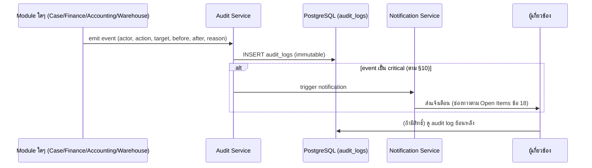

# 90-platform-audit-notification-reporting.md

# 90 — Platform Audit, Notification & Reporting
## AssetRecovery — Asset Recovery Operations Platform

> สถานะ: Specification v2 (Reformatted)
> Document Level: Foundation / Platform Build Spec
> Applies To: All implementation sprints
> เอกสารอ้างอิง: `00-project-overview.md`, `01-architecture.md`, `07-roles-permissions.md`, `96-reports.md`, `DECISIONS-NEEDED.md`

## Changelog

| Version | วันที่ | การเปลี่ยนแปลง |
|---|---|---|
| v1 | (เดิม) | สร้างไฟล์ครั้งแรก — Audit Log, Notification, Report ข้ามโมดูล |
| v2 | 03/07/2569 | Reformat ตามมาตรฐานเอกสารชุดใหม่ (header block, event flow diagram, endpoint จริง, Decisions/Open Items แยกชัดเจน) — **เนื้อหาเดิมคงไว้ครบ ไม่มีการเดาตัวเลข retention/notification channel ที่ยังไม่ตัดสินใจ** |
| v3 | 03/07/2569 | (1) เพิ่ม **§6.2 PDPA / Privacy Scope (Draft)** ตามคำขอ Product Owner — ยังไม่ปิด Open Item รอทนายความอนุมัติ (2) ปิด Open Item **Notification channel**: เฟส 1 = Push/In-app เท่านั้น, event trigger = ทุก status change สำคัญของเคส/การเงิน — เพิ่ม **§6.3** ตารางรายการ event เริ่มต้น (3) SMS/Email Gateway provider เปลี่ยนสถานะเป็นไม่บล็อกเฟส 1 (รอ PO แจ้งตอน implement เฟส 2) (4) ปิด Open Item **Audit Log Retention = 5 ปี** อ้างอิง พ.ร.บ.การบัญชี พ.ศ. 2543 |
| v4 | 04/07/2569 | **Batch 6 (DEC-006/D3)**: ตาราง `notifications` เพิ่มเข้า `02-database-schema-design.md` v3.5 แล้ว (เดิม endpoint ใน §14 มีอยู่แต่ไม่มี entity รองรับใน schema) + เติม endpoint `PATCH /api/notifications/read-all` ที่ขาด + อัปเดตหมายเหตุ §7 ให้ครอบคลุมตาราง notifications |
| v2.3 | 15/08/2569 | **มติ PO ตอนรีวิว Phase 5 (D16) — ถอน 2 event ที่สคีมาไม่มีที่ให้เกิดออกจาก §6.3**: `payout_batch.failed` (`02` §3 `payout_batch_status` ไม่มีสถานะล้มเหลว) และ "Exception ใกล้ deadline" (`02` §9 `exceptions` ไม่มีคอลัมน์กำหนดเส้นตาย) — ตอน implement Phase 5.2 ต่อสายครบทุกแถวยกเว้นสองตัวนี้ เพราะไม่มีจุดใดในระบบยิงได้ · ยึดลำดับเอกสาร `02` ชนะไฟล์ spec ของโมดูล ⇒ **ไม่ประดิษฐ์ status/คอลัมน์ใหม่** · ต่อสายได้เมื่อมีมติเพิ่ม `payout_batch_status = 'failed'` + `exceptions.due_date` ลง `02` · ส่วน "Exception ใหม่" ยังอยู่ (จำกัดที่ระดับ critical ตาม `37` ซึ่งเป็นตัวบล็อก Export Pack) |
| v4.1 | 04/07/2569 | แก้จำนวนรายงานอ้างอิง "13" → **"17"** — นับจริงจากไฟล์ 96: F1–F5 (5) + O1–O5 (5) + A1–A4 (4) + E1–E3 (3) = 17 (เลข 13 เดิมนับผิด คัดลอกต่อกันใน README/implementation-todo — แก้พร้อมกันแล้ว) |

ขอบเขตเอกสารนี้: ระบบกลางสำหรับ Audit Log, Notification, Exception และ Reporting ที่ใช้ร่วมกันข้ามทุกโมดูล

**ไม่รวมอยู่ในไฟล์นี้**: รายการรายงานแบบละเอียดทั้ง 17 รายงาน (ดู `96-reports.md`), Exception ระดับ accounting โดยเฉพาะ (ดู `34-accounting-document-checklist-exceptions.md`), การตัดสินใจเรื่อง retention/notification channel ที่ยังค้างอยู่ (ดู `DECISIONS-NEEDED.md` หมวด 1.3, 5.2)

---

## 1. Summary

ระบบกลางสำหรับ Audit Log, Notification, Exception และ Reporting ข้ามโมดูล

## 2. Purpose

ระบบกลางสำหรับ Audit Log, Notification, Exception และ Reporting ข้ามโมดูล

## 3. In Scope

- Foundation spec
- ใช้รองรับกลุ่ม A และอนาคต
- กำหนดมาตรฐาน implementation

## 4. Out of Scope

- business flow เฉพาะหน้าจอในกลุ่ม A
- workflow ติดตามทรัพย์ final

## 5. Actors & Responsibilities

| Actor / Role | Responsibility | Scope |
|---|---|---|
| Superadmin | กำหนดค่าและเข้าถึงทุกส่วน | Global |
| บริหาร / Executive | อนุมัติ policy, exception, lock/unlock, scope decision | Organization |
| บัญชี (Accounting) | ตรวจข้อมูลบัญชี ส่งออก pack กระทบยอด WHT | Accounting scope |
| การเงิน (Finance) | ควบคุม claim payout payee billing receipt | Finance scope |
| เจ้าหน้าที่อนุมัติเคส (Case Approver) | พิจารณารับ/ไม่รับเคส, อนุมัติ recycle, ตีกลับหลักฐาน | Global — ทุกเคส (Role Group: system) |
| ผู้จัดการทีมติดตามทรัพย์ (Manager) | กำกับทีม ตรวจงาน อนุมัติขั้นต้นค่าตอบแทน | หลายทีม (Role Group: inhouse/outsource) |
| หัวหน้า (Supervisor) | กำกับทีมเดียว | ทีมเดียว (Role Group: inhouse/outsource) |
| ธุรการ / Admin | บันทึกข้อมูลและแนบเอกสารตามสิทธิ์ | Assigned scope |
| บริษัทไฟแนนซ์ (Company User) | ยื่นเคสและติดตามสถานะที่ได้รับอนุญาต | Company scope — 3 ระดับ (ผู้จัดการ/หัวหน้า/แอดมิน) |
| พนักงานติดตามทรัพย์ (Field Agent) | รับงาน อัปเดตผล แนบหลักฐาน | Assigned case scope (Role Group: inhouse/outsource) |

## 6. Core Concepts

| Concept | Meaning | Implementation Notes |
|---|---|---|
| Consistency | ใช้มาตรฐานเดียวกันทุก module | ลดงานแก้ภายหลัง |
| Reusability | component/rule ใช้ซ้ำ | Cursor ทำซ้ำได้ |
| Traceability | ทุก action ต้อง trace | audit/report |

### 6.1 Event Flow (Audit → Notification)

### 6.2 PDPA / Privacy Scope (Draft — 03/07/2569)

> ⚠️ **ร่างเบื้องต้นจากหลักการ PDPA ทั่วไปเท่านั้น ไม่ใช่คำแนะนำทางกฎหมาย** — ต้องให้ทนายความ/ที่ปรึกษา PDPA ตรวจสอบและอนุมัติก่อน go-live เสมอ (ดู Open Item §18)

**สถานะทางกฎหมายของ AssetRecovery**: ทำหน้าที่เป็น **ผู้ประมวลผลข้อมูลส่วนบุคคล (Data Processor)** ให้บริษัทไฟแนนซ์แต่ละราย ซึ่งเป็น **ผู้ควบคุมข้อมูล (Data Controller)** ของข้อมูลลูกหนี้ — ฐานทางกฎหมายในการประมวลผล (lawful basis) จึงอิงกับสัญญาสินเชื่อระหว่างบริษัทไฟแนนซ์กับลูกหนี้เป็นหลัก ไม่ใช่ consent ที่ AssetRecovery ขอเองโดยตรง

**เอกสารที่ต้องมีก่อน go-live**:
| เอกสาร | คู่สัญญา | สถานะ |
|---|---|---|
| Data Processing Agreement (DPA) | AssetRecovery ↔ บริษัทไฟแนนซ์แต่ละราย | ยังไม่มี — ต้องทำก่อนรับเคสจากบริษัทใหม่ |
| Privacy Policy (ภายนอก) | AssetRecovery → ลูกหนี้/พนักงานภาคสนาม | ยังไม่มี |
| Employee/Field Agent Privacy Notice | AssetRecovery → พนักงาน (แจ้งเรื่อง GPS tracking) | ยังไม่มี |

**หมวดข้อมูลที่ระบบเก็บ (Data Inventory เบื้องต้น)**:
| หมวด | ตัวอย่าง Field | ความอ่อนไหว |
|---|---|---|
| ข้อมูลระบุตัวตนลูกหนี้ | ชื่อ, เลขบัตรประชาชน, ที่อยู่, เบอร์โทร, LINE, Facebook | ปานกลาง-สูง (เลขบัตรประชาชนเป็นข้อมูลอ่อนไหวตาม พ.ร.บ.) |
| ข้อมูลการเงินลูกหนี้ | มูลหนี้คงเหลือ, ประวัติการชำระ | ปานกลาง |
| หลักฐานภาคสนาม | รูปถ่าย/วิดีโอ/เสียงบันทึกการเจรจา, พิกัด GPS ของพนักงาน | **สูง** — มีภาพใบหน้า/เสียง/ตำแหน่งที่ตั้งจริง |
| ข้อมูลพนักงาน/Field Agent | ชื่อ, เบอร์โทร, ตำแหน่ง GPS ระหว่างปฏิบัติงาน | ปานกลาง-สูง |
| ข้อมูล Company User | ชื่อ, อีเมล, เบอร์โทรผู้ติดต่อบริษัท | ต่ำ |

**หลักการที่เสนอ (รอ Product Owner/ที่ปรึกษากฎหมายยืนยัน)**:
- จำกัดการเข้าถึงข้อมูลอ่อนไหว (หลักฐานภาคสนาม/GPS) ตาม role scope ที่มีอยู่แล้วในไฟล์ 07 — ไม่เปิดให้ role ที่ไม่จำเป็นเห็น
- Client Portal (ไฟล์ 97) เป็นตัวอย่างการจำกัดขอบเขตแล้ว — ไม่แสดง GPS/วิดีโอ/เสียงให้บริษัทไฟแนนซ์เห็น
- Data Retention: ผูกกับ Open Item เดิม "Data Retention period ที่ไม่ใช่ audit log" (`03-non-functional-requirements.md` §18) — ยังไม่มีตัวเลข ต้องตัดสินใจคู่กัน
- Data Subject Rights (สิทธิขอเข้าถึง/แก้ไข/ลบข้อมูล): ต้องออกแบบ process รับคำขอจากลูกหนี้ ผ่านบริษัทไฟแนนซ์ (ในฐานะ Data Controller) เป็นหลัก ไม่ใช่รับคำขอตรงจาก AssetRecovery

### 6.3 Notification Channel & Event Trigger (Decided — 03/07/2569)

**ช่องทาง**: เฟส 1 ใช้ **Push/In-app notification เท่านั้น** — ไม่ส่งออกนอกระบบ (ไม่ใช้ SMS/Email/LINE OA ในเฟส 1) จึงไม่ต้อง integrate SMS/Email Gateway provider ใดๆ ในเฟส 1 (ดู `DECISIONS-NEEDED.md` §1.3, §4.2 — เลื่อน Gateway provider ไปตัดสินใจตอน implement เฟส 2)

**Storage (เพิ่ม 04/07/2569 — DEC-006/D3)**: ตาราง `notifications` ใน `02-database-schema-design.md` v3.5 (Schema Group G) — fields: `user_id` (ผู้รับ), `event_code`, `title`, `body`, `link_path` (deep link), `read_at` (NULL = ยังไม่อ่าน) + index `(user_id, read_at, created_at DESC)`

**Event ที่ trigger notification**: หลักการคือ **ทุก status change สำคัญของเคส/การเงิน** — รายการเริ่มต้นที่ระบุได้จาก state machine ที่มีอยู่แล้ว (ต้องทบทวนอีกครั้งตอน implement แต่ละโมดูลว่าครบหรือไม่):

| Module | Event | อ้างอิง |
|---|---|---|
| Case (38) | `need_info_requested`, `rejected`, `approved` | `38-case-submission.md` §10 |
| Case (38) | `recycle_approved` (เคสกลับเข้า pipeline ใหม่) | `38-case-submission.md` §6.6 |
| Assignment (40) | `reassignment_requested`, `reassignment_timeout` | `40-case-assignment-routing.md` |
| Field Tracker (41) | `case.closed_success`, `case.closed_fail`, `evidence.reject_evidence` | `41-field-tracker-mobile.md` |
| Warehouse (44) | `asset.intake_rejected` (IMEI ไม่ตรง), `lot.confirmed` | `44-asset-custody-handover.md` |
| Finance (15/16) | `expense.rejected`, `expense.approved` | `16-compensation-approval.md` |
| Finance (17) | `payout_batch.completed` | `17-payroll-and-payout.md` |
| Accounting (33) | WHT ใกล้ครบกำหนดยื่น (reminder) | `33-accounting-wht-data.md` |
| Accounting (34) | Exception ใหม่ (ระดับ critical) | `34-accounting-document-checklist-exceptions.md` |

> รายการนี้เป็นจุดเริ่มต้นตาม state machine ที่มีอยู่ — เมื่อ implement แต่ละโมดูลจริงให้ตรวจสอบ event เพิ่มเติมที่อาจตกหล่นและอัปเดตตารางนี้กลับมา (ตามหลักการ §17 ของไฟล์นี้)
>
> **ถอนออก 15/08/2569 (v2.3 — มติ PO ตอนรีวิว Phase 5, ข้อ D16)**: `payout_batch.failed` และ "Exception ใกล้ deadline" ถูกตัดออกจากตารางนี้เพราะ **สคีมาไม่มีที่ให้เกิด** — `02` §3 `payout_batch_status` มีแค่ `draft/pending_approval/approved/paid` (ไม่มีสถานะล้มเหลว) และ `02` §9 `exceptions` ไม่มีคอลัมน์กำหนดเส้นตาย จึงคำนวณ "ใกล้ครบกำหนด" ไม่ได้ · ยึดลำดับเอกสาร (`02` ชนะไฟล์ spec ของโมดูล) ⇒ ไม่ประดิษฐ์ status/คอลัมน์ใหม่เพื่อรองรับ event · จะกลับมาต่อสายได้เมื่อมีมติเพิ่ม `payout_batch_status = 'failed'` และ `exceptions.due_date` ลง `02` (เปิดเป็น item ใหม่ได้ตอนนั้น)

## 7. Data Entities / Required Objects

| Entity / Object | Purpose | Required Key Fields |
|---|---|---|
| Audit Log | ประวัติ action | actor, action, target, before, after, reason |
| Notification | การแจ้งเตือน | recipient, type, payload, status |
| Report | รายงาน | module, filters, export |

> ตรงกับ table `audit_logs` และ `notifications` ใน `02-database-schema-design.md` §10 (Schema Group G) — field ตรงกันทั้งหมด (notifications เพิ่ม 04/07/2569 DEC-006/D3)

## 8. UI / UX Rules

- Audit table read-only
- Notification center
- Report filters/export

## 9. Workflow / Lifecycle

- Module emits event → audit saved → notification generated → user views/acts

## 10. Security / Control Rules

- Audit ห้ามแก้ย้อนหลัง
- Critical event ต้อง notify
- Report ต้อง respect permission

## 11. Validation & Error Handling

| Code / Scenario | Condition | System Behavior |
|---|---|---|
| REQUIRED_MISSING | ข้อมูลบังคับไม่ครบ | inline error |
| DUPLICATE_RECORD | ข้อมูลซ้ำ | reject พร้อมอธิบาย |
| PERMISSION_DENIED | ไม่มีสิทธิ์ | UI hide/disable และ API 403 |
| INVALID_STATUS | สถานะไม่ถูก | reject transition |

## 12. Permission Requirements

| Capability | Allowed Roles | Notes |
|---|---|---|
| View audit | Superadmin/บริหาร/บัญชี/การเงิน | scope |
| Manage notification rule | Superadmin | admin |

## 13. Audit Log Requirements

- ทุก mutation ต้องบันทึก `actor_id`, `role`, `action`, `target_type`, `target_id`, `before`, `after`, `reason`, `created_at`
- ข้อมูลที่กระทบเงิน สิทธิ์ ธนาคาร ภาษี หรือการ lock period ต้องบันทึก reason เสมอ
- Audit log ห้ามแก้ไขย้อนหลัง
- รายการ export/import/background job ต้อง trace กลับไปผู้สั่งงานได้

## 14. API / Integration Draft

| Method | Endpoint / Event | Purpose | Notes |
|---|---|---|---|
| GET | /api/audit-logs | list พร้อม filter (target_type, actor_id, date range) | ตาม permission scope |
| GET | /api/audit-logs/{id} | detail รายการเดียว | before/after JSON เต็ม |
| GET | /api/notifications | รายการแจ้งเตือนของ user ปัจจุบัน | read/unread |
| PATCH | /api/notifications/{id}/read | mark อ่านแล้ว | |
| PATCH | /api/notifications/read-all | mark อ่านแล้วทั้งหมดของ user ปัจจุบัน | เพิ่ม 04/07/2569 (DEC-006/D3) |
| EVENT | audit.log.created | ทุกครั้งที่มี mutation สำคัญ | trigger notification ถ้า critical |

## 15. Acceptance Criteria

- Cursor สามารถใช้ไฟล์นี้เป็น rule กลางก่อน implement module ใด ๆ
- ทุก module ในกลุ่ม A ต้องอ้างอิง foundation เหล่านี้
- UI, permission, audit, validation ต้องสอดคล้องกันทั้งระบบ
- ไม่มี requirement ที่ทำให้ระบบกลายเป็น ERP/GL/Tax filing เต็มรูปแบบ

## 16. Test Cases

| Test Case | Steps | Expected Result |
|---|---|---|
| Permission | role ไม่มีสิทธิ์ | ไม่เห็นปุ่มและ API reject |
| Audit | แก้ข้อมูลสำคัญ | มี audit before/after |
| Validation | ข้อมูลไม่ครบ | แสดง error ชัดเจน |
| Audit immutability | ลอง UPDATE/DELETE audit_logs โดยตรง | ต้อง reject ที่ระดับ backend (ไม่ใช่แค่ UI) |

---

## 17. การตัดสินใจที่เกี่ยวข้อง (Decisions)

- **Audit fields มาตรฐานเดียวกันทั้งระบบ**: actor_id, role, action, target_type, target_id, before, after, reason, created_at — ทุก mutation สำคัญต้องมีครบ (ข้อ 13) ตรงกับ table `audit_logs` ใน `02-database-schema-design.md`
- **Audit log ห้ามแก้ไข/ลบเด็ดขาด** ไม่มีข้อยกเว้น แม้แต่ Superadmin (ข้อ 10, README "Key Business Rules")
- **Critical event ต้อง notify เสมอ** — เฟส 1 ใช้ Push/In-app เท่านั้น (ยืนยันแล้ว — ดู §6.3)
- **Event flow มาตรฐาน**: Module emits event → Audit Service บันทึก (immutable) → ถ้า critical → Notification Service ส่งแจ้งเตือน (§6.1)
- **Notification channel เฟส 1 = Push/In-app เท่านั้น**, event trigger = ทุก status change สำคัญของเคส/การเงิน (รายการเริ่มต้น §6.3) — ยืนยันกับ Product Owner 03/07/2569
- **Audit Log Retention = 5 ปี** — อ้างอิง พ.ร.บ.การบัญชี พ.ศ. 2543 (เอกสารบัญชีเก็บอย่างน้อย 5 ปี) เนื่องจาก audit log ผูกกับ mutation ทางการเงินโดยตรง — ยืนยันกับ Product Owner 03/07/2569

## 18. สิ่งที่ยังต้องตัดสินใจ (Open Items)

- [ ] **PDPA Compliance** — 🟡 มี **Draft scope แล้ว** (ดู §6.2) ยืนยันกับ Product Owner 03/07/2569 ว่ายังไม่มีนโยบายทางการ ให้ร่างเบื้องต้นตามหลัก PDPA ทั่วไปก่อน — **ยังไม่ปิด Open Item** เพราะต้องให้ทนายความ/ที่ปรึกษา PDPA ตรวจสอบและอนุมัติ DPA + Privacy Policy จริงก่อน go-live
- [ ] **SMS/Email Gateway provider** — 🟢 ไม่บล็อกเฟส 1 (ใช้ Push/In-app เท่านั้น — ดู §6.3) Product Owner จะแจ้ง provider ตอน implement เฟส 2 ที่ต้องใช้จริง — ดู `DECISIONS-NEEDED.md` หมวด 4.2
- [ ] ยืนยันรายละเอียดเมื่อเริ่ม sprint เฉพาะ module (Open Item เดิม)

---

*เอกสารนี้เป็นไฟล์แรกในหมวด Platform (90–95) ต่อด้วย `91-platform-api-integration-jobs.md`*
