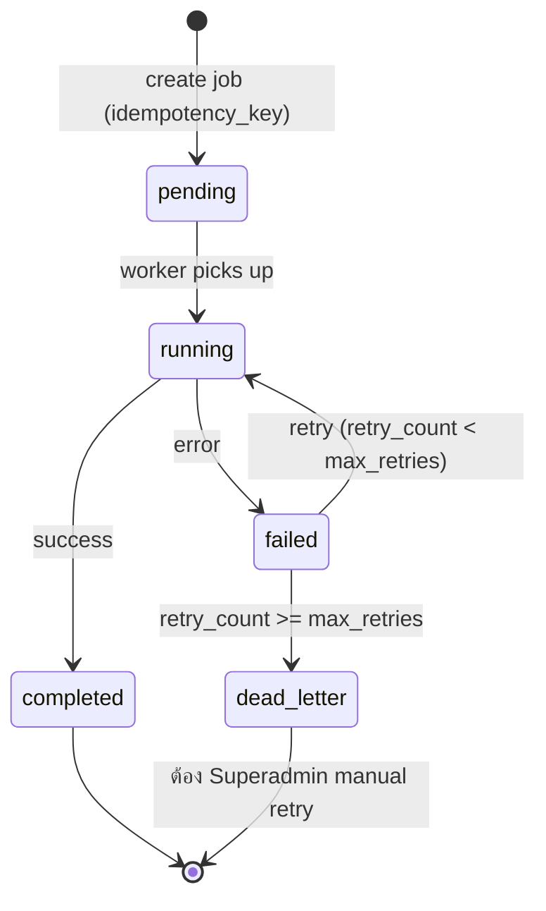

# 91-platform-api-integration-jobs.md

# 91 — Platform API Integration & Background Jobs
## AssetRecovery — Asset Recovery Operations Platform

> สถานะ: Specification v2 (Reformatted)
> Document Level: Foundation / Platform Build Spec
> Applies To: All implementation sprints
> เอกสารอ้างอิง: `00-project-overview.md`, `01-architecture.md`, `02-database-schema-design.md` §10 (jobs table), `37-accounting-pack-export-history.md`, `DECISIONS-NEEDED.md`

## Changelog

| Version | วันที่ | การเปลี่ยนแปลง |
|---|---|---|
| v1 | (เดิม) | สร้างไฟล์ครั้งแรก — Background Job, Import/Export, Retry, Queue |
| v2 | 03/07/2569 | Reformat ตามมาตรฐานเอกสารชุดใหม่ (header block, job lifecycle state diagram, job_type จริงจาก schema, endpoint จริง, Decisions/Open Items แยกชัดเจน) — **เนื้อหาเดิมคงไว้ครบ ไม่มีการเปลี่ยน business logic** |
| v2.1 | 04/07/2569 | **เพิ่ม §14.1 Dev Trigger Endpoint** (`POST /api/dev/trigger-job`) — เพื่อให้ dev ทดสอบ Background Job บน local ได้โดยไม่ต้องรอ Vercel Cron — บังคับปิดตัวเองใน production เสมอ (ดู §14, §14.1) |
| v2.3 | 15/08/2569 | **sync §14.1/§17 ให้ครบ 5 job_type** (ปิด C8 ใน `docs/02_OPEN_DECISIONS.md` ตามมติ PO 12/08/2569 ข้อ 1 — ใช้ตัวเลือก default): §6.1 เติม `advance_overdue` ไปตั้งแต่ v2.2 แต่ §14.1 และ §17 ยังเขียน 4 ตัว · Phase 5.3 implement dev trigger ให้รับครบ 5 ตัวตาม §6.1 จึงแก้ถ้อยคำให้ตรงกัน **ไม่มีการเปลี่ยน business logic** |
| v2.5 | 05/10/2569 | **มติ PO 05/10/2569 (U25 · BUG-093)** — §6.1 `daily_field_allowance`: วันที่งวดบัญชีปิดแล้วยังข้าม (ไม่ settle ข้ามงวด) แต่แจ้งเตือนในระบบถึงผู้ถือ `create_adjustment` พร้อมยอดที่คำนวณไว้ · idempotent: คีย์กันซ้ำต่อ (พนักงาน, วัน) — รันซ้ำไม่แจ้งซ้ำ · ผลของ job เพิ่ม `periodLockedNotified` / `approvalNotified` · แถวที่ settle แล้วเข้าคิวอนุมัติทันทีแจ้งผู้อนุมัติขั้น 1 (U29 — `16` §9.1) |
| v2.6 | 05/10/2569 | **มติ PO 05/10/2569 (U50)** — §6.1 `daily_field_allowance`: วันที่งวดปิดแจ้ง**ทั้งการเงินและบัญชี** (คนละลิงก์ · กันซ้ำต่อผู้รับ) · การเงินสร้างรายการเบิกย้อนหลังลงงวดที่เปิดอยู่ได้ (`41` §6.6) — สร้างแถว `field_day_settlements` ของวันนั้น ⇒ job รอบถัดไปไม่เห็นวันนั้นอีก (ไม่ settle ซ้ำ) · job กับปุ่มชนกันได้ชุดเดียวด้วย UNIQUE เดิม |
| v2.7 | 05/10/2569 | **มติ PO 05/10/2569 (U65)** — เพิ่ม §14.2 ทางลัด dev ส่ง/ล็อกงวดด้วยวันที่จำลอง (`POST /api/dev/accounting-periods/{id}/send` · `/lock`) แบบเดียวกับ asOf ของ `advance_overdue` (O10): production = 404 ก่อนชั้นสิทธิ์ · สิทธิ์ชุดเดียวกับ route จริง · วันจำลองใช้กับยามสิ้นเดือน (`30` §6.2a) + Readiness เท่านั้น · audit ติด `[จำลองวันที่ DD/MM/YYYY]` · route จริงไม่รับเวลาจากผู้เรียก |
| v2.8 | 06/10/2569 | **มติ PO 06/10/2569 (UAT U93)**: §6.1 `wht_filing_reminder` เตือนตามกำหนดยื่นที่เลื่อนวันหยุด/เสาร์-อาทิตย์แล้ว (`33` §7.2 · ปฏิทิน `13` §6.15) — ไม่มี job_type ใหม่ · การคิดกำหนดใหม่เกิดใน request ที่เพิ่ม/ลบวันหยุด (ไม่ใช่ job) |
| v2.9 | 06/10/2569 | **มติ PO 06/10/2569 (U97 — PDPA)**: §6.1 เพิ่ม job_type **`purge_debtor_documents`** (รายวัน · idempotent · actor = system + job id) ลบไฟล์เอกสารลูกหนี้ของเคสที่จบนานกว่าระยะเก็บ (`13` §6.16 ค่าเริ่มต้น 5 ปี) — เก็บ metadata วันที่ลบ ไม่ลบข้อมูลเคส · dev trigger รับได้ (รายการ §6.1 เป็น 7 ตัว) |
| v2.10 | 06/10/2569 | **มติ PO 06/10/2569 (U120 · DEC-015)**: เพิ่ม §6.3 **คิวแจ้งเตือนของ job** (`notification_outbox`) — job ที่เปลี่ยนสถานะแล้วแจ้งเตือนต้องเข้าคิวในทรานแซกชันเดียวกัน · ตัวส่งแยกท้าย job + ทุกรอบ cron · retry/backoff · ส่งซ้ำไม่แจ้งซ้ำ · เพิ่มเทสต์ใน §16 + ข้อตัดสินใจใน §17 |
| v2.12-EA | 07/10/2569 | **มติ PO U162**: §6.1 `device_catalog_sync` ดึงรุ่นของแบรนด์ในรายชื่อตลาดไทย (รายชื่อแบรนด์ในค่าตั้ง Model Phone) ก่อน ตามลำดับรายชื่อ แล้วค่อยแบรนด์อื่น (ลำดับเดิม) · resume ด้วย `last_synced_at` คงเดิม |
| v2.13-GA | 07/10/2569 | **มติ PO U166 → U167 → U168 (DEC-017 แทน DEC-016)**: §6.1 แทน `device_catalog_sync` (RapidAPI — เลิกใช้ ลบ job/client/env) ด้วย **`device_tac_sync`** รายวันหลังเที่ยงคืนไทย — เช็ก sha ของไฟล์ผ่าน GitHub commits API ก่อน (ไม่เปลี่ยน = ไม่ดาวน์โหลด) → fallback ETag → เพิ่มเฉพาะ TAC ใหม่ · ประวัติการอัปเดต `device_tac_updates` · ล้ม = แจ้งผู้ดูแลผ่าน outbox แล้ว retry · ปุ่ม "อัปเดตตอนนี้" (+ บังคับ) / "นำเข้าไฟล์เอง" · dev trigger รับ `device_tac_sync` (รวม 8 ตัวเท่าเดิม) |
| v2.11-DE | 07/10/2569 | **มติ PO U155 → U157 → U159 (DEC-016 — Model Phone)**: §6.1 เพิ่ม job_type **`device_catalog_sync`** (รายวันหลังเที่ยงคืนไทย ผ่านตัวตั้งเวลาเดิม + ผู้ดูแลสั่ง "ดึงข้อมูลตอนนี้" ได้) — ดึงทุกแบรนด์/รุ่นจาก RapidAPI เก็บไว้ · ประหยัดโควตา (เพดาน request ต่อรอบ + resume) · 429 = ข้าม · ไม่มีคีย์ = ข้าม · ไม่เขียนทับการตั้งด้วยมือ · dev trigger รับได้ (รายการ §6.1 เป็น 8 ตัว) |
| v2.1x-CA | 07/10/2569 | **มติ PO 07/10/2569 (U134)**: §6.4 ใหม่ **ตัวกวาดขั้นหลังรอบจ่ายสำเร็จ** — job_type `payout_completion_repair` (นอก §6.1 · ตั้งโดยตัวกวาดใน `GET /api/cron/jobs` หนึ่งงานต่อรอบจ่าย) ทำบันทึกจ่าย/50 ทวิ ที่ล้มหลัง commit ต่อให้ครบ · แจ้งเตือนรอบจ่ายสำเร็จย้ายเข้าคิว §6.3 · §16 เพิ่ม test |
| v2.4 | 03/10/2569 | **เพิ่ม job_type `daily_field_allowance`** ตามมติ PO 03/10/2569 (UAT Q21 · DEC-012): ค่าน้ำมันเหมาจ่าย (`DAILY_FLAT`) + เบี้ยเลี้ยง คิดวันละครั้งต่อพนักงานต่อวันปฏิทินไทย แล้วกระจายเท่ากันทุกเคสที่เช็คอินวันนั้น — สร้างรายการเบิกหลังจบวันด้วย job รายวัน (cron รอบแรกหลังเที่ยงคืนไทย · ประมวลผลเฉพาะวันที่จบแล้ว · เก็บตกวันที่พลาด) · idempotent ต่อ (พนักงาน, วัน) ด้วย UNIQUE ของ `field_day_settlements` (`02` v4.12) · §14.1 dev trigger รับครบ 6 ตัว และรับ payload `date` (`YYYY-MM-DD` ≤ วันนี้) **เฉพาะ job นี้ผ่าน dev trigger** — cron จริงไม่รับ |
| v2.2 | 04/07/2569 | **เติม job_type `advance_overdue` ใน §6.1** — background job auto-mark Advance ที่เลย `due_clear_date` เป็น `overdue` ถูกกำหนดไว้แล้วในไฟล์ 15 (§9.1/§10/§13/EVENT `advance.overdue`) แต่ตกหล่นจากรายการ job_type — sync comment ใน `02-database-schema-design.md` (ตาราง jobs) แล้วเช่นกัน |

ขอบเขตเอกสารนี้: มาตรฐาน Background Job, Import/Export, Retry, Queue และ Scheduled Tasks ที่ใช้ร่วมกันข้ามทุกโมดูล — รันผ่าน Vercel Cron / QStash (Upstash) ตาม DEC-001

**ไม่รวมอยู่ในไฟล์นี้**: รายละเอียด export pack ของ accounting โดยเฉพาะ (ดู `37-accounting-pack-export-history.md`), รายละเอียด API contract ของแต่ละ module (ดู `27-finance-api-contracts.md`, `45-case-warehouse-api-contracts.md`)

---

## 1. Summary

มาตรฐาน Background Job, Import/Export, Retry, Queue และ Scheduled Tasks

## 2. Purpose

มาตรฐาน Background Job, Import/Export, Retry, Queue และ Scheduled Tasks

## 3. In Scope

- Foundation spec
- ใช้รองรับกลุ่ม A และอนาคต
- กำหนดมาตรฐาน implementation

## 4. Out of Scope

- business flow เฉพาะหน้าจอในกลุ่ม A
- workflow ติดตามทรัพย์ final

## 5. Actors & Responsibilities

| Actor / Role | Responsibility | Scope |
|---|---|---|
| Superadmin | กำหนดค่าและเข้าถึงทุกส่วน | Global |
| บริหาร / Executive | อนุมัติ policy, exception, lock/unlock, scope decision | Organization |
| บัญชี (Accounting) | ตรวจข้อมูลบัญชี ส่งออก pack กระทบยอด WHT | Accounting scope |
| การเงิน (Finance) | ควบคุม claim payout payee billing receipt | Finance scope |
| เจ้าหน้าที่อนุมัติเคส (Case Approver) | พิจารณารับ/ไม่รับเคส, อนุมัติ recycle, ตีกลับหลักฐาน | Global — ทุกเคส (Role Group: system) |
| ผู้จัดการทีมติดตามทรัพย์ (Manager) | กำกับทีม ตรวจงาน อนุมัติขั้นต้นค่าตอบแทน | หลายทีม (Role Group: inhouse/outsource) |
| หัวหน้า (Supervisor) | กำกับทีมเดียว | ทีมเดียว (Role Group: inhouse/outsource) |
| ธุรการ / Admin | บันทึกข้อมูลและแนบเอกสารตามสิทธิ์ | Assigned scope |
| บริษัทไฟแนนซ์ (Company User) | ยื่นเคสและติดตามสถานะที่ได้รับอนุญาต | Company scope — 3 ระดับ (ผู้จัดการ/หัวหน้า/แอดมิน) |
| พนักงานติดตามทรัพย์ (Field Agent) | รับงาน อัปเดตผล แนบหลักฐาน | Assigned case scope (Role Group: inhouse/outsource) |

## 6. Core Concepts

| Concept | Meaning | Implementation Notes |
|---|---|---|
| Consistency | ใช้มาตรฐานเดียวกันทุก module | ลดงานแก้ภายหลัง |
| Reusability | component/rule ใช้ซ้ำ | Cursor ทำซ้ำได้ |
| Traceability | ทุก action ต้อง trace | audit/report |

### 6.1 Job Type ที่ระบบรู้จัก (จาก `02-database-schema-design.md` §10)

| job_type | ใช้เมื่อ | ไฟล์อ้างอิง |
|---|---|---|
| `export_pack` | บัญชีกดปุ่ม "Export Accounting Pack" ตอนปิดงวด | `37-accounting-pack-export-history.md` |
| `bank_file` | สร้างไฟล์โอนเงินสำหรับ Payout Batch | `17-payroll-and-payout.md` |
| `wht_summary` | สรุปยื่น WHT รายเดือน (ภ.ง.ด.3/53) | `33-accounting-wht-data.md` |
| `reassign_timeout` | Assignment หมดเวลารอรับงาน → auto reassign | `40-case-assignment-routing.md` |
| `advance_overdue` | สแกน Advance ที่ `status = approved` และเลย `due_clear_date` → auto-mark เป็น `overdue` (actor = system job, ต้อง audit) | `15-claims-and-advances.md` §9.1/§10 |
| `daily_field_allowance` | รายวันหลังเที่ยงคืนไทย: (พนักงาน, วันที่จบแล้ว) ที่มีเช็คอินแต่ยังไม่ settle → คิดค่าน้ำมันเหมาจ่าย + เบี้ยเลี้ยงวันละครั้ง (อัตราจากแผนเวอร์ชันของทีม ณ วันนั้น) แล้วกระจายเท่ากันทุกเคสที่เช็คอินวันนั้น (เศษลงเคสแรก) → สร้าง expense ต่อเคส + แถว `field_day_settlements` · idempotent ต่อ (พนักงาน, วัน) · actor = system job + audit มี job id · วันที่งวดบัญชีปิดแล้วข้ามไว้ พร้อมแจ้งเตือนการเงิน (`create_adjustment`) + บัญชี (`manage_accounting_period`) ด้วยยอดที่คำนวณไว้ (กันซ้ำต่อพนักงาน×วัน — มติ PO 05/10/2569 U25 · U50) → การเงินกด "สร้างรายการเบิกย้อนหลัง" ลงงวดที่เปิดอยู่ (`41` §6.6 — ใช้ settlement UNIQUE เดิม ⇒ job ไม่ทำซ้ำ) · หลัง settle เรียกตรวจเกตรายได้ของเคสในวันนั้น | มติ PO 03/10/2569 (UAT Q21) · `22` §6.2/§6.3 · `41` §6.6 · `19` §6.1 |
| `purge_debtor_documents` | รายวัน (PDPA — มติ PO 06/10/2569 U97): เคสที่จบ (`closed_success`/`closed_fail` นับจาก `closed_at` · `rejected` นับจาก `reviewed_at`) นานกว่าระยะเก็บขององค์กร (`data_retention_settings` ค่าเริ่มต้น 5 ปี · `13` §6.16) → ลบไฟล์บน Storage **เฉพาะช่องเอกสารลูกหนี้ที่เป็นข้อมูลส่วนบุคคล** (`contract_doc`/`national_id_doc`/`bundle_doc`/`other_doc` ตามตัวจำแนก `lib/uploads/personal-data.ts`) · แถว `case_documents` คงอยู่ + `purged_at`/`deleted_at` · `cases.debtor_documents_purged_at` · ไม่ลบแถวเคส/ข้อมูลที่ไม่ใช่ไฟล์ · **ไม่แตะเอกสารบัญชี** (ใบกำกับ/50 ทวิ/Export Pack/ใบเสร็จ) และรูปสินค้า/หลักฐานปิดงาน · idempotent (มาร์คเฉพาะแถวที่ `purged_at IS NULL` · ลบไฟล์ไม่สำเร็จ = ลองใหม่รอบหน้า) · audit ต่อเคส `delete` actor = system + job id ใน reason · dev trigger ได้ (ไม่มีวันที่จำลอง) | `90` §6.2 · `13` §6.16 · `02` v4.37 |
| `device_tac_sync` | **รายวันหลังเที่ยงคืนเวลาไทย** (มติ PO U166 → U167 → U168 · DEC-017 — แทน `device_catalog_sync` ที่เลิกใช้แล้ว · คีย์กันซ้ำ = วันที่ไทย ผ่าน cron เดิม `*/10`): อัปเดตฐาน **TAC** ของ Model Phone (ยี่ห้อ/รุ่นจาก IMEI) จากไฟล์ `tac_full.csv` ของ GitHub repo `MoazEb/tac-database` — **ลำดับ (U167)**: ① GitHub REST `GET /repos/MoazEb/tac-database/commits?path=tac_full.csv&per_page=1` (ไม่ใช้ token) → sha + วันที่ไฟล์ถูกแก้ล่าสุด ② sha = sha ของการนำเข้าสำเร็จครั้งล่าสุด (ทุกองค์กร) และไม่บังคับ ⇒ **ไม่ดาวน์โหลด** บันทึกประวัติ `not_modified` ③ sha เปลี่ยน ⇒ ดาวน์โหลด raw CSV (~12 MB) → แยกไฟล์ (`parseTacCsv()`) → **เพิ่มเฉพาะ TAC ใหม่** + เติมแบรนด์/รุ่นที่ยังไม่มี (`source = tacdb`) + เติมปีที่ออกที่ยังว่าง ④ commits API ล้ม (rate limit/เครือข่าย) ⇒ fallback ดาวน์โหลดแบบ `If-None-Match` (ETag) — 304 = `not_modified` · **ผู้ดูแลสั่งเอง**: "อัปเดตตอนนี้" (`POST /api/settings/device-catalog/tac-update` · ลำดับเดียวกัน · `force` = ข้าม sha/ETag · คีย์กันซ้ำรายชั่วโมง) และ "นำเข้าไฟล์เอง" (`POST /api/settings/device-catalog/tac-import` · trigger `file` · อ่านไฟล์ที่อัปโหลดเข้า storage ขององค์กรนั้น) · **ไม่ทับ**: แถว TAC เดิมทุกแหล่ง (`learned`/`manual`/`tacdb`) · `manual_status` · ชื่อที่ผู้ดูแลแก้ · ทุกรอบเขียนแถว insert-only `device_tac_updates` ต่อองค์กร (ผล `success`/`not_modified`/`failed` · sha · วันที่ไฟล์ต้นทาง · จำนวน TAC/แบรนด์/รุ่นใหม่ + รายชื่อรุ่นสูงสุด 2,000) · **ล้มเหลว** (เครือข่าย/ไฟล์ผิดรูปแบบ) = แถวประวัติ `failed` + สาเหตุ + แจ้งผู้ถือ `manage_device_catalog` ระดับ manage (`device_catalog.tac_update_failed` ผ่าน `notification_outbox` ในทรานแซกชันเดียวกัน §6.3 · กันซ้ำวันละครั้งตามวันไทย) แล้ว**โยน error ต่อ** ⇒ retry ตามระบบเดิม · idempotent (เพิ่มเฉพาะ TAC ที่ยังไม่มี) · audit **1 แถวสรุปต่อรอบ** (actor = system + job id ใน reason หรือผู้ดูแลที่สั่ง) · ไม่มีคีย์/โควตา · dev trigger ได้ · migration ยกเลิกงาน `device_catalog_sync` ที่ค้างคิว | `13` §6.18 · `38` §6.2 · `94` DEC-017 · `02` v4.5x-GA |

> รายการนี้อาจเพิ่มในอนาคตตาม module ใหม่ — ทุก job_type ใหม่ต้อง update ตารางนี้

### 6.2 Job Lifecycle (State Diagram)

> ตรงกับ enum `job_status` ใน `02-database-schema-design.md` §3 (`pending`, `running`, `completed`, `failed`, `cancelled`) — `dead_letter` เป็น terminal state เชิง concept ที่ derive จาก `failed` + `retry_count >= max_retries` ไม่ใช่ enum value แยก

### 6.3 คิวแจ้งเตือนของ job (Notification Outbox — มติ PO 06/10/2569 U120 · DEC-015)

job ที่ **เปลี่ยนสถานะแล้วต้องแจ้งเตือน** ห้ามเขียนแจ้งเตือนหลัง commit ตรง ๆ (ขั้นแจ้งเตือนล้ม = แจ้งเตือนหายถาวร เพราะรอบหน้าไม่หยิบรายการเดิมซ้ำ):

1. **เข้าคิวในทรานแซกชันเดียวกับการเปลี่ยนสถานะ** — แถว `notification_outbox` (`02` §10) · ทรานแซกชัน rollback = ไม่มีแถวคิว · กุญแจ `dedupe_key` UNIQUE ต่อองค์กร ⇒ job รันซ้ำไม่เข้าคิวซ้ำ
2. **ตัวส่งแยก** — รันท้าย job ที่เข้าคิว และทุกรอบของ `GET /api/cron/jobs` (ต่อจากตัวกวาดคิว `fuel_distance_retry`) · จองแถวด้วย conditional update + lease 5 นาที ⇒ ตัวส่งพร้อมกันได้แถวละตัวเดียว
3. **retry/backoff** — ส่งไม่สำเร็จ = เก็บ `last_error` + นับ `attempts` แล้วรอ 1, 2, 4 … นาที (เพดาน 60 นาที) · ครบ `max_attempts` (ค่าเริ่มต้น 8) = `failed` (เลิกลอง — ไล่ดูจาก `last_error`) · ตัวส่ง**ไม่โยน error** ⇒ job ที่ commit แล้วไม่ล้มตาม
4. **ส่งซ้ำไม่แจ้งซ้ำ** — แถว `notifications` ใช้ id แบบ deterministic จาก `dedupeKey` ของข้อความ ⇒ ตัวส่งตายหลังเขียนแจ้งเตือนแต่ก่อนมาร์ค `sent` แล้วรอบหน้าส่งซ้ำ ก็ยังได้แถวเดียว
5. **ตามรอยได้** — `source_job_type` + `source_job_ref` (id ของ job ที่สั่งรัน)

job ที่ใช้คิวนี้: `reassign_timeout` · `advance_overdue` · `daily_field_allowance` (แจ้งผู้อนุมัติรายการที่เข้าคิว) · `fuel_distance_retry` (แจ้งผู้อนุมัติรายการที่เข้าคิว) — job ที่**ไม่เปลี่ยนสถานะ** (`wht_filing_reminder`, วันที่งวดปิดของ `daily_field_allowance`) รอบหน้าหยิบรายการเดิมซ้ำอยู่แล้ว (at-least-once + `dedupeKey`) จึงไม่ต้องผ่านคิว

### 6.4 ตัวกวาดขั้นหลังรอบจ่ายสำเร็จ (`payout_completion_repair` — มติ PO 07/10/2569 U134)

รอบจ่ายเปลี่ยนเป็น `completed` ในทรานแซกชันของมันเอง แล้วจึงทำ "ขั้นหลัง commit" (บันทึกบัญชีค่าใช้จ่าย → ออกใบ 50 ทวิ) — ขั้นนี้ล้มเดิมทำให้รอบค้างเป็น `completed` โดยไม่มีบันทึกจ่าย/50 ทวิ และไม่มีทางซ่อม ⇒ แนวเดียวกับ §6.3:

1. **แจ้งเตือน "รอบจ่ายโอนเงินสำเร็จ"** เข้าคิว `notification_outbox` ในทรานแซกชันเดียวกับการเปลี่ยนเป็น `completed` (ทั้งยืนยันด้วยมือและจับคู่ธนาคาร · `source_job_type = payout_batch_completed`)
2. **บันทึกจ่าย + 50 ทวิ ครบแล้วมาร์ค** `payout_batches.post_completion_synced_at` · ขั้นนี้ล้มหลัง commit ⇒ คำขอเดิม**ไม่โยน error** (รอบจ่ายสำเร็จจริงแล้ว)
3. **ตัวกวาด** ในรอบของ `GET /api/cron/jobs` (ต่อจาก `fuel_distance_retry` ก่อนตัวส่งคิวแจ้งเตือน) หารอบ `completed` ที่ยังไม่มีเครื่องหมายเกินช่วงผ่อนผัน 5 นาที ⇒ ตั้ง job `payout_completion_repair` **หนึ่งงานต่อรอบจ่าย** (คีย์กันซ้ำ `payout_completion_repair:<batch_id>`) แล้วรันทันที · ล้ม = เข้าบันได retry/dead letter ปกติ ⇒ เห็นใน Job Log
4. **ไม่ซ้ำ** — ใช้กุญแจเดิม (`expense_records.payout_batch_item_id` UNIQUE + ใบ 50 ทวิ active ต่อรายการ) · ตัวกวาดพร้อมกันได้งานเดียว · งานทำต่อออกเฉพาะใบที่**ยังไม่เคยออก** (ใบที่คนยกเลิกแล้วไม่ออกใบแทนให้เอง)
5. **ตามรอยได้** — ผู้กระทำ = ผู้ยืนยันรอบจ่ายสำเร็จ (สำรอง: ผู้สร้างรอบ) · เหตุผล audit ของบันทึกจ่าย/ใบ 50 ทวิ ที่ทำต่อต่อท้าย job id

`payout_completion_repair` ไม่อยู่ในรายการ §6.1 (ไม่มีรอบเวลาของตัวเอง · dev trigger เรียกไม่ได้) — ตั้งโดยตัวกวาดเท่านั้น

## 7. Data Entities / Required Objects

| Entity / Object | Purpose | Required Key Fields |
|---|---|---|
| Job | งานเบื้องหลัง | job_type, status, payload, retry_count |
| Import | นำเข้าไฟล์ | source, file_id, result |
| Export | ส่งออกไฟล์ | export_id, version, file_hash |

## 8. UI / UX Rules

- Job status page/log
- Retry button
- Download output
- Error detail

## 9. Workflow / Lifecycle

- Create job → pending → running → success/fail → retry/dead letter

## 10. Security / Control Rules

- Job ต้อง idempotent
- Retry ห้ามสร้างผลซ้ำ
- ไฟล์ output ต้อง versioned/hash

## 11. Validation & Error Handling

| Code / Scenario | Condition | System Behavior |
|---|---|---|
| REQUIRED_MISSING | ข้อมูลบังคับไม่ครบ | inline error |
| DUPLICATE_RECORD | ข้อมูลซ้ำ | reject พร้อมอธิบาย |
| PERMISSION_DENIED | ไม่มีสิทธิ์ | UI hide/disable และ API 403 |
| INVALID_STATUS | สถานะไม่ถูก | reject transition |
| JOB_DUPLICATE | idempotency_key ซ้ำ | คืน job เดิมที่มีอยู่แล้ว ไม่สร้างใหม่ (ตาม `01-architecture.md` §11) |

## 12. Permission Requirements

| Capability | Allowed Roles | Notes |
|---|---|---|
| Trigger job | Allowed module role | ตาม action |
| Retry job | Superadmin/Owner | reason |

## 13. Audit Log Requirements

- ทุก mutation ต้องบันทึก `actor_id`, `role`, `action`, `target_type`, `target_id`, `before`, `after`, `reason`, `created_at`
- ข้อมูลที่กระทบเงิน สิทธิ์ ธนาคาร ภาษี หรือการ lock period ต้องบันทึก reason เสมอ
- Audit log ห้ามแก้ไขย้อนหลัง
- รายการ export/import/background job ต้อง trace กลับไปผู้สั่งงานได้

## 14. API / Integration Draft

| Method | Endpoint / Event | Purpose | Notes |
|---|---|---|---|
| POST | /api/jobs | สร้าง async job | ต้องมี `idempotency_key` (ตาม `01-architecture.md` §11) |
| GET | /api/jobs/{id} | ดูสถานะ job | ใช้ poll จาก UI ระหว่างรอ |
| POST | /api/jobs/{id}/retry | Retry job ที่ failed/dead_letter | Superadmin/Owner เท่านั้น + ต้องระบุ reason |
| GET | /api/jobs?job_type=export_pack | filter ตาม job_type | ใช้ในหน้า Job Log |
| EVENT | job.status.changed | job เปลี่ยนสถานะ | ใช้ trigger notification (ดู `90-platform-audit-notification-reporting.md`) |
| POST | /api/dev/trigger-job | 🔧 **Development Environment เท่านั้น** — Trigger job ทดสอบทันทีโดยไม่ต้องรอ Vercel Cron (เช่น `reassign_timeout`, `export_pack`) | Body: `{ "job_type": string, "payload"?: object }` — **ต้อง return 404 ทันทีถ้า `process.env.NODE_ENV === 'production'`** (ดู §14.1) |

### 14.1 Dev Trigger Endpoint (`/api/dev/trigger-job`)

**วัตถุประสงค์**: Background Job ทั้งหมดรันผ่าน Vercel Cron / QStash ตามเวลาที่ตั้งไว้ (DEC-001) ซึ่งทดสอบใน local development ยาก (ต้องรอเวลาจริงหรือปลอมวันที่เครื่อง) — endpoint นี้ให้ dev กด trigger job ทดสอบได้ทันทีโดยไม่กระทบ production

**กฎบังคับ**:
- **ต้องปิดการใช้งานทันทีเมื่อ `NODE_ENV === 'production'`** (return `404 Not Found` เหมือนไม่มี route นี้อยู่) — ป้องกันไม่ให้มีใครยิง job ทดสอบใน production โดยไม่ได้ตั้งใจ
- รับ `job_type` ตามรายการใน §6.1 เท่านั้น (`export_pack` | `bank_file` | `wht_summary` | `reassign_timeout` | `advance_overdue` | `daily_field_allowance`) — ถ้าไม่ตรง reject ด้วย `INVALID_STATUS` (implement เป็น `JOB_INVALID_STATUS` ตาม pattern ชื่อของ `24` §7 — ดู `24` §6.11)
- `daily_field_allowance` รับ `payload.date` (`YYYY-MM-DD` วันไทย ต้อง ≤ วันนี้ ไม่งั้น 400) เพื่อ settle วันที่ระบุทันที (รวม "วันนี้" สำหรับทดสอบ) — ตัวรันงานอ่าน `date` เฉพาะงานที่สร้างจาก dev trigger นอก production เท่านั้น · cron จริงไม่รับ (settle เฉพาะวันที่จบแล้ว) · ตัวอย่าง body: `{ "jobType": "daily_field_allowance", "payload": { "date": "2026-10-03" } }`
- ยังต้องสร้าง job record ผ่าน flow เดียวกับ `POST /api/jobs` ปกติ (มี `idempotency_key`, บันทึก audit log) — ไม่ใช่ shortcut ที่ข้าม business logic แค่ข้าม "การรอเวลา cron" เท่านั้น
- จำกัดสิทธิ์เรียกเฉพาะ role ที่มีสิทธิ์ Trigger job ตาม §12 เช่นเดียวกับ production endpoint

### 14.2 Dev ส่ง/ล็อกงวดด้วยวันที่จำลอง (`/api/dev/accounting-periods/{id}/send|lock` — มติ PO 05/10/2569 U65)

**วัตถุประสงค์**: `30` §6.2a (U51) ห้ามส่งสำนักงานบัญชี/ล็อกงวดก่อนสิ้นเดือน ⇒ UAT ปิดงวดของเดือนปัจจุบันไม่ได้จนกว่าจะข้ามเดือนจริง — ทางลัดนี้ให้จำลอง "วันนี้" ตอนส่ง/ล็อก โดยไม่แก้ข้อมูลในฐานและไม่เปิดช่องใน route จริง (แบบเดียวกับ `asOf` ของ `advance_overdue` ใน §14.1)

| Method | Path | สิทธิ์ (ชุดเดียวกับ route จริง) | Body |
|---|---|---|---|
| POST | `/api/dev/accounting-periods/{id}/send` | `manage:manage_accounting_period` (= `PATCH /api/accounting/periods/{id}/send`) | `{ "reason": string, "asOf": "YYYY-MM-DD" }` |
| POST | `/api/dev/accounting-periods/{id}/lock` | `manage:manage_accounting_period` หรือ `manage:unlock_period` (= `PATCH …/lock`) | เหมือนกัน |

**กฎบังคับ**:
- `NODE_ENV === 'production'` ⇒ **404 ก่อนชั้นสิทธิ์** (ไม่ล็อกอินก็ได้ 404 ไม่ใช่ 401) · service ยังตัดวันจำลองทิ้งอีกชั้นเมื่อเป็น production
- `asOf` = วันไทยรูป `YYYY-MM-DD` ตั้งแต่วันนี้ถึง +31 วัน (ช่วงเดียวกับ asOf ของ O10) ไม่งั้น 400 · ระบบใช้เที่ยงวันไทยของวันนั้นเป็น "วันนี้จำลอง"
- วันจำลองใช้กับ**ยามสิ้นเดือน + Readiness Check** เท่านั้น — เงื่อนไขอื่นของ Readiness (critical/กระทบยอด/ยอดบิล) ยังบังคับเต็ม · `sent_at`/`locked_at` บันทึกเวลาจริง
- audit (`status_change`/`lock`) ต่อท้าย `reason` ด้วย `[จำลองวันที่ DD/MM/YYYY]` (พ.ศ.) และ `after.simulated_as_of` ค่าเดียวกัน
- route จริง (`PATCH /api/accounting/periods/{id}/send|lock`) **ไม่รับเวลาจากผู้เรียก** — ส่ง `asOf` ไปก็ถูกตัดทิ้ง

## 15. Acceptance Criteria

- Cursor สามารถใช้ไฟล์นี้เป็น rule กลางก่อน implement module ใด ๆ
- ทุก module ในกลุ่ม A ต้องอ้างอิง foundation เหล่านี้
- UI, permission, audit, validation ต้องสอดคล้องกันทั้งระบบ
- ไม่มี requirement ที่ทำให้ระบบกลายเป็น ERP/GL/Tax filing เต็มรูปแบบ

## 16. Test Cases

| Test Case | Steps | Expected Result |
|---|---|---|
| Permission | role ไม่มีสิทธิ์ | ไม่เห็นปุ่มและ API reject |
| Audit | แก้ข้อมูลสำคัญ | มี audit before/after |
| Validation | ข้อมูลไม่ครบ | แสดง error ชัดเจน |
| Idempotency | ยิง POST /api/jobs ด้วย idempotency_key เดิมซ้ำ | ต้องคืน job เดิม ไม่สร้าง job ใหม่ |
| Dead letter | job fail เกิน max_retries | ต้องเข้าสถานะ dead_letter ไม่ retry ต่อเองอัตโนมัติ |
| Outbox — ส่งล้มหลังเปลี่ยนสถานะ (§6.3) | ขั้นแจ้งเตือนล้มหลัง job มาร์คสถานะ | job ไม่ล้ม · แถวคิวยังอยู่ (`last_error`, `attempts`) · รอบส่งถัดไปส่งสำเร็จ |
| Outbox — ส่งซ้ำ/พร้อมกัน (§6.3) | ตัวส่งหลายตัวพร้อมกัน / ส่งซ้ำหลังเขียนแจ้งเตือนแล้ว | แจ้งเตือนแถวเดียว |
| Outbox — rollback (§6.3) | ทรานแซกชันเปลี่ยนสถานะล้ม | ไม่มีแถวคิว ไม่มีแจ้งเตือน |
| รอบจ่ายสำเร็จแต่ขั้นหลังล้ม (§6.4) | บันทึกจ่ายล้มหลังรอบเป็น completed แล้วรอบ cron ถัดไปกวาด | งาน `payout_completion_repair` 1 งานใน Job Log · บันทึกจ่าย/50 ทวิ ครบอย่างละหนึ่ง · กวาดซ้ำไม่สร้างเพิ่ม |
| ตัวกวาดพร้อมกัน (§6.4) | กวาด 2 ตัวพร้อมกัน | งานเดียว · ไม่สร้างซ้ำ |

---

## 17. การตัดสินใจที่เกี่ยวข้อง (Decisions)

- **Background Jobs รันผ่าน Vercel Cron / QStash (Upstash)** — DEC-001 ใน `01-architecture.md` §6.0
- **ทุก job ต้อง idempotent และมี `idempotency_key`** — ป้องกันสร้างผลซ้ำเมื่อ retry (ข้อ 10, 11, 14)
- **job_type ที่ระบบรู้จักตอนนี้มี 6 ประเภท**: `export_pack`, `bank_file`, `wht_summary`, `reassign_timeout`, `advance_overdue`, `daily_field_allowance` (§6.1 — ตัวหลังเพิ่มตามมติ PO 03/10/2569 UAT Q21 · DEC-012) — ตรงกับ table `jobs` ใน `02-database-schema-design.md`
  - โมดูลที่เกิดทีหลังเพิ่ม job_type ของตัวเองได้ตามหมายเหตุท้าย §6.1 (ปัจจุบัน: `fuel_distance_retry` — มติ PO 14/08/2569 D10 · `wht_filing_reminder` — `33` §6.2/§8 · เตือนตาม `wht_filing_summaries.filing_due_date` ที่**เลื่อนวันหยุด/เสาร์-อาทิตย์แล้ว** (มติ PO U93 — job ไม่คิดวันเอง ใช้ค่าที่เก็บ · การเพิ่ม/ลบวันหยุดคิดกำหนดของรอบ pending ใหม่ทันที ⇒ รอบเตือนถัดไปใช้วันใหม่) แต่ **dev trigger (§14.1) รับเฉพาะ 6 ตัวในตาราง §6.1**
- **Retry มีเพดาน `max_retries`** เกินแล้วเข้า `dead_letter` ต้อง manual retry โดย Superadmin เท่านั้น (§6.2, ข้อ 12)
- **ไฟล์ output (export/bank file) ต้อง versioned + hash เสมอ** ห้าม overwrite (ข้อ 10) — สอดคล้อง Immutable Rules ใน `02-database-schema-design.md` §13
- **แจ้งเตือนของ job ผ่านคิว `notification_outbox`** — เข้าคิวในทรานแซกชันเดียวกับการเปลี่ยนสถานะ · ตัวส่งแยก idempotent (§6.3 · DEC-015 · มติ PO U120)

## 18. สิ่งที่ยังต้องตัดสินใจ (Open Items)

- [ ] **Google Maps API** (ใช้คำนวณระยะทางจริงสำหรับค่าน้ำมัน PER_KM) — มี API Key อยู่แล้วหรือยัง? ต้องการ budget limit ต่อเดือนเท่าไหร่? ยังไม่ตัดสินใจ — ดู `DECISIONS-NEEDED.md` หมวด 4.1
- [ ] **SMS/Email Gateway provider** สำหรับ notification jobs — ยังไม่เลือก (ตรงกับ Open Item เดียวกันใน `90-platform-audit-notification-reporting.md` §18)
- [ ] ยืนยันรายละเอียดเมื่อเริ่ม sprint เฉพาะ module (Open Item เดิม)

---

*เอกสารนี้เป็นไฟล์ที่ 2 ในหมวด Platform (90–95) ต่อจาก `90-platform-audit-notification-reporting.md` และก่อน `92-platform-data-model.md`*
