# คู่มือผู้ดูแลระบบ (Superadmin) — AssetRecovery

> เล่ม 1 · ตั้งค่าระบบตั้งแต่เริ่มต้นจนพร้อมใช้งาน
> ภาพหน้าจอในเล่มนี้ถ่ายจากการทดลองใช้งานจริง ข้อมูลในภาพ (ชื่อบริษัท ชื่อบุคคล เลขบัญชี เลขประจำตัว) เป็นข้อมูลสมมติทั้งหมด

---

## ใครใช้เล่มนี้

- **ผู้ดูแลระบบ (Superadmin)** — ผู้ตั้งค่าระบบก่อนเปิดใช้งาน และดูแลข้อมูลหลักต่อเนื่อง (เพิ่มทีม เพิ่มบริษัทลูกค้า เพิ่มผู้ใช้ ปรับอัตรา)
- ผู้ใช้บทบาทอื่นที่ได้รับมอบให้ช่วยตั้งค่าบางส่วน (เช่น ธุรการช่วยดูแลผู้ใช้งาน / Model Phone / ปฏิทินวันหยุด) อ่านเฉพาะบทที่เกี่ยวข้องได้

## ผู้ดูแลระบบทำอะไรได้บ้าง (โดยย่อ)

| ทำได้ | หมายเหตุ |
|---|---|
| ตั้งค่าทุกหน้าในเมนู **การตั้งค่า** | ทุกการแก้ไขต้องกรอกเหตุผล และถูกเก็บประวัติถาวร |
| รายการที่ **ผู้ดูแลระบบเท่านั้น** ทำได้ (มอบให้บทบาทอื่นไม่ได้) | สิทธิ์การใช้งาน · บริษัทไฟแนนซ์ · เทมเพลตค่าบริการ · กติกาภาษี (Tax Profile) · นโยบายการล็อกรอบ · เลขที่เอกสาร |
| ดูเมนูอื่น ๆ ทั้งหมด (จัดการเคส · การเงิน · บัญชี · คลังสินค้า · รายงาน) | งานประจำวันของแต่ละฝ่ายดูได้ในคู่มือของฝ่ายนั้น |
| ดูบันทึกการใช้งาน (Audit Log) และสั่งทำงานเบื้องหลังที่ล้มเหลวใหม่ (Job Log) | — |

สิ่งที่ผู้ดูแลระบบ **ไม่ต้องทำ**: กด "ยืนยันแล้ว" ในหน้าค่าตั้งรอนักบัญชียืนยัน — เป็นงานของฝ่ายบัญชี

## เข้าสู่ระบบ

1. เปิด `https://<โดเมนระบบ>/login`
2. กรอก **อีเมล หรือ username** และรหัสผ่าน แล้วกด **เข้าสู่ระบบ**
3. ถ้าเป็นการเข้าครั้งแรกด้วยรหัสผ่านเริ่มต้น ระบบจะให้ **ตั้งรหัสผ่านใหม่ก่อนเริ่มใช้งาน**
4. ระบบเปิดหน้า **แดชบอร์ด** — กดเมนู **การตั้งค่า** ที่แถบบนเพื่อเริ่มตั้งค่า

> **คอมพิวเตอร์ / มือถือ:** งานในเล่มนี้ออกแบบให้ทำบนคอมพิวเตอร์ (หน้าจอกว้าง ฟอร์มยาว และมีตาราง) แนะนำให้ใช้คอมพิวเตอร์ทุกขั้นตอน ภาพในเล่มถ่ายจากคอมพิวเตอร์

## ผังงานของบทบาทนี้

ดูผังภาพรวมงานผู้ดูแลระบบได้ที่ [ผังงานราย role — 1. ผู้ดูแลระบบ](../diagrams/03-role-flowcharts.md#1-ผู้ดูแลระบบ)
และวิธีอ่านสัญลักษณ์ในผังที่ [README ของผัง](../diagrams/README.md)

---

## สารบัญ

- [บทที่ 1 รู้จักเมนูการตั้งค่าและลำดับการตั้งค่า](#บทที่-1-รู้จักเมนูการตั้งค่าและลำดับการตั้งค่า)
- [บทที่ 2 ตรวจค่าตั้งมาตรฐาน (การเงิน/ภาษี)](#บทที่-2-ตรวจค่าตั้งมาตรฐาน-การเงินภาษี)
- [บทที่ 3 ข้อมูลองค์กร โลโก้ และลายเซ็น](#บทที่-3-ข้อมูลองค์กร-โลโก้-และลายเซ็น)
- [บทที่ 4 รูปแบบไฟล์ธนาคาร (ไฟล์โอนเงิน / statement)](#บทที่-4-รูปแบบไฟล์ธนาคาร-ไฟล์โอนเงิน--statement)
- [บทที่ 5 บัญชีธนาคารบริษัท](#บทที่-5-บัญชีธนาคารบริษัท)
- [บทที่ 6 แผนค่าตอบแทน (จ่ายทีมติดตาม)](#บทที่-6-แผนค่าตอบแทน-จ่ายทีมติดตาม)
- [บทที่ 7 เทมเพลตค่าบริการ (เก็บจากบริษัทไฟแนนซ์)](#บทที่-7-เทมเพลตค่าบริการ-เก็บจากบริษัทไฟแนนซ์)
- [บทที่ 8 รอบวางบิล (AR)](#บทที่-8-รอบวางบิล-ar)
- [บทที่ 9 บริษัทไฟแนนซ์และเอกสารบริษัท](#บทที่-9-บริษัทไฟแนนซ์และเอกสารบริษัท)
- [บทที่ 10 ทีมติดตามทรัพย์](#บทที่-10-ทีมติดตามทรัพย์)
- [บทที่ 11 ผู้ใช้งาน สังกัด และข้อมูลรับเงิน](#บทที่-11-ผู้ใช้งาน-สังกัด-และข้อมูลรับเงิน)
- [บทที่ 12 ฐานรุ่นมือถือ (Model Phone)](#บทที่-12-ฐานรุ่นมือถือ-model-phone)
- [บทที่ 13 สิทธิ์การใช้งาน](#บทที่-13-สิทธิ์การใช้งาน)
- [บทที่ 14 บันทึกการใช้งาน (Audit Log) และงานเบื้องหลัง (Job Log)](#บทที่-14-บันทึกการใช้งาน-audit-log-และงานเบื้องหลัง-job-log)
- [บทที่ 15 ตรวจความพร้อมก่อนเปิดใช้งาน](#บทที่-15-ตรวจความพร้อมก่อนเปิดใช้งาน)
- [ภาคผนวก ก คำศัพท์](#ภาคผนวก-ก-คำศัพท์)
- [ภาคผนวก ข คำถามที่พบบ่อย](#ภาคผนวก-ข-คำถามที่พบบ่อย)
- [ภาคผนวก ค สถานะและป้ายที่จะเห็น](#ภาคผนวก-ค-สถานะและป้ายที่จะเห็น)

---

## บทที่ 1 รู้จักเมนูการตั้งค่าและลำดับการตั้งค่า

**เป้าหมาย:** รู้ว่าเมนูตั้งค่าแต่ละหน้าอยู่ตรงไหน และควรตั้งค่าตามลำดับใด

**ขั้นตอน**

1. กดเมนู **การตั้งค่า** ที่แถบบน
2. ระบบเปิดหน้า **สิทธิ์การใช้งาน** เป็นหน้าแรก พร้อมแถบเมนูย่อยด้านบน: **สิทธิ์การใช้งาน · ผู้ใช้งาน · ข้อมูลองค์กร · แผนค่าตอบแทน · เทมเพลตค่าบริการ · ทีมติดตามทรัพย์ · บริษัทไฟแนนซ์ · Model Phone · ตั้งค่าบัญชี/การเงิน · บันทึกการใช้งาน (Audit Log) · งานเบื้องหลัง (Job Log)**

**ลำดับการตั้งค่าที่แนะนำ** (ข้อหลังต้องใช้ข้อมูลจากข้อก่อน)

| ลำดับ | หน้า | เหตุผลที่ต้องมาก่อน |
|---|---|---|
| 1 | ตรวจค่าตั้งมาตรฐาน | VAT ภาษีหัก ณ ที่จ่าย สายอนุมัติ ถูกตั้งไว้ให้แล้ว — ตรวจให้ตรงกับบริษัท |
| 2 | ข้อมูลองค์กร | ใช้พิมพ์บนเอกสารทุกฉบับ |
| 3 | รูปแบบไฟล์ธนาคาร | ต้องมีก่อนจึงผูกกับบัญชีธนาคารได้ |
| 4 | บัญชีธนาคารบริษัท | ใช้รับเงินและจ่ายเงิน |
| 5 | แผนค่าตอบแทน | ต้องมีก่อนสร้างทีม |
| 6 | เทมเพลตค่าบริการ | ต้องมีก่อนสร้างบริษัทไฟแนนซ์ |
| 7 | รอบวางบิล (AR) | ต้องมีก่อนสร้างบริษัทไฟแนนซ์ |
| 8 | บริษัทไฟแนนซ์ | ต้องมีก่อนรับเคสและก่อนผูกผู้ใช้พอร์ทัล |
| 9 | ทีมติดตามทรัพย์ | ต้องมีก่อนผูกสังกัดผู้ใช้ภาคสนาม |
| 10 | ผู้ใช้งาน + ข้อมูลรับเงิน | ต้องมีทีม/บริษัทก่อน |
| 11 | Model Phone | ช่วยให้ธุรการกรอก IMEI แล้วระบบเติมรุ่นให้ |

> **เคล็ดลับ:** ทุกฟอร์มในการตั้งค่ามีช่อง **เหตุผล** (บังคับ) — เขียนสั้น ๆ ให้คนอื่นอ่านแล้วเข้าใจ เช่น "ตั้งแผนค่าตอบแทนทีมในก่อนเริ่มใช้งานจริง" เพราะเหตุผลจะถูกเก็บในบันทึกการใช้งานตลอดไป

---

## บทที่ 2 ตรวจค่าตั้งมาตรฐาน (การเงิน/ภาษี)

**เป้าหมาย:** ตรวจว่าค่าตั้งมาตรฐานด้านการเงินและภาษีที่ระบบเตรียมไว้ถูกต้องสำหรับบริษัท

**ก่อนเริ่ม:** ระบบที่ติดตั้งใหม่จะมีค่าตั้งมาตรฐานตามแนวปฏิบัติไทยตั้งไว้แล้ว (รายละเอียดเต็มอยู่ใน [ค่าตั้งเริ่มต้นตามมาตรฐานการเงิน/ภาษีไทย](../settings-preset.md))

**ขั้นตอน**

1. **การตั้งค่า** › **ตั้งค่าบัญชี/การเงิน**
2. หน้านี้มีแท็บทางซ้าย 19 แท็บ กดทีละแท็บเพื่อตรวจค่า:
   **รอบบิลและรอบจ่าย · สายการอนุมัติ · บัญชีธนาคารบริษัท · ผู้รับเงิน (Payee) · กติกาภาษี (Tax Profile) · ค่าตั้งภาษีหัก ณ ที่จ่าย · อัตรา VAT · ศูนย์ต้นทุน · รูปแบบเอกสารภายใน · ไฟล์โอนธนาคาร · รูปแบบไฟล์ส่งบัญชี · สิทธิ์บัญชี/การเงิน · การล็อกรอบและ Adjustment · เลขที่เอกสาร · เทมเพลตเอกสาร · เกณฑ์ SLA งานติดตาม · นโยบายการมอบหมายงาน · ระยะเก็บเอกสารลูกหนี้ · ปฏิทินวันหยุด**

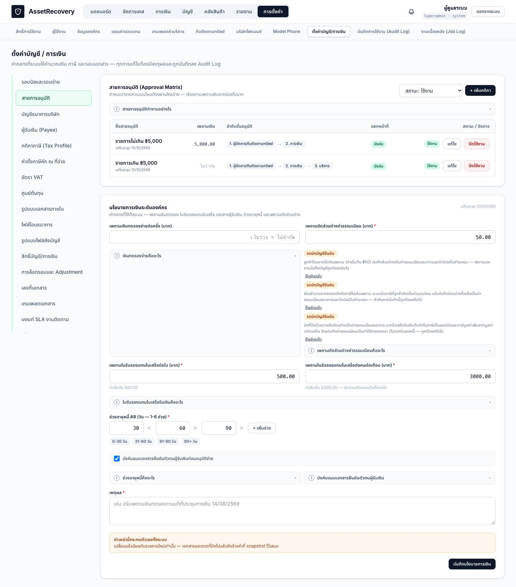

**ค่าที่ควรเห็น (ค่าตั้งมาตรฐาน)**

| แท็บ | ค่ามาตรฐาน |
|---|---|
| อัตรา VAT | 7% มีผลตั้งแต่ 01/10/2568 |
| กติกาภาษี (Tax Profile) | บุคคลธรรมดา ค่าจ้างทำของ 3% · นิติบุคคล ค่าบริการ 3% · ค่าขนส่ง 1% (บุคคล/นิติ) · ไม่หักเมื่อจ่ายต่ำกว่า 1,000 บาท |
| ค่าตั้งภาษีหัก ณ ที่จ่าย | ฐานก่อน VAT · ยื่นแบบกระดาษ (วันที่ 7 ของเดือนถัดไป) |
| สายการอนุมัติ | ไม่เกิน 5,000 บาท: ผู้จัดการทีม → การเงิน · เกิน 5,000 บาท: ผู้จัดการทีม → การเงิน → บริหาร |
| รอบบิลและรอบจ่าย | รอบจ่ายพนักงาน ตัดรอบวันที่ 15 และสิ้นเดือน |
| ศูนย์ต้นทุน | CC-IN ทีมใน · CC-OUT ทีมนอก |
| ระยะเก็บเอกสารลูกหนี้ | 5 ปี |
| ปฏิทินวันหยุด | วันหยุดราชการปี 2569 จำนวน 18 วัน |

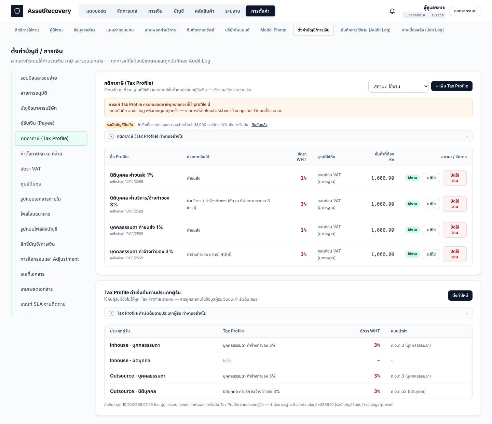

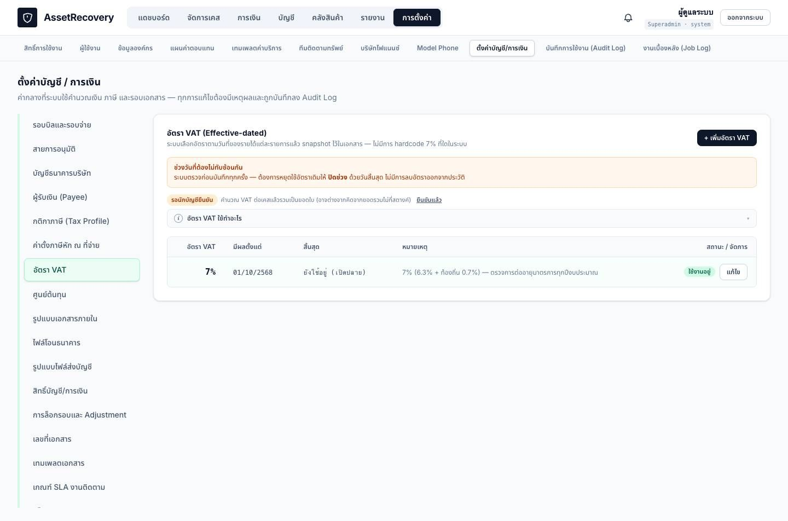

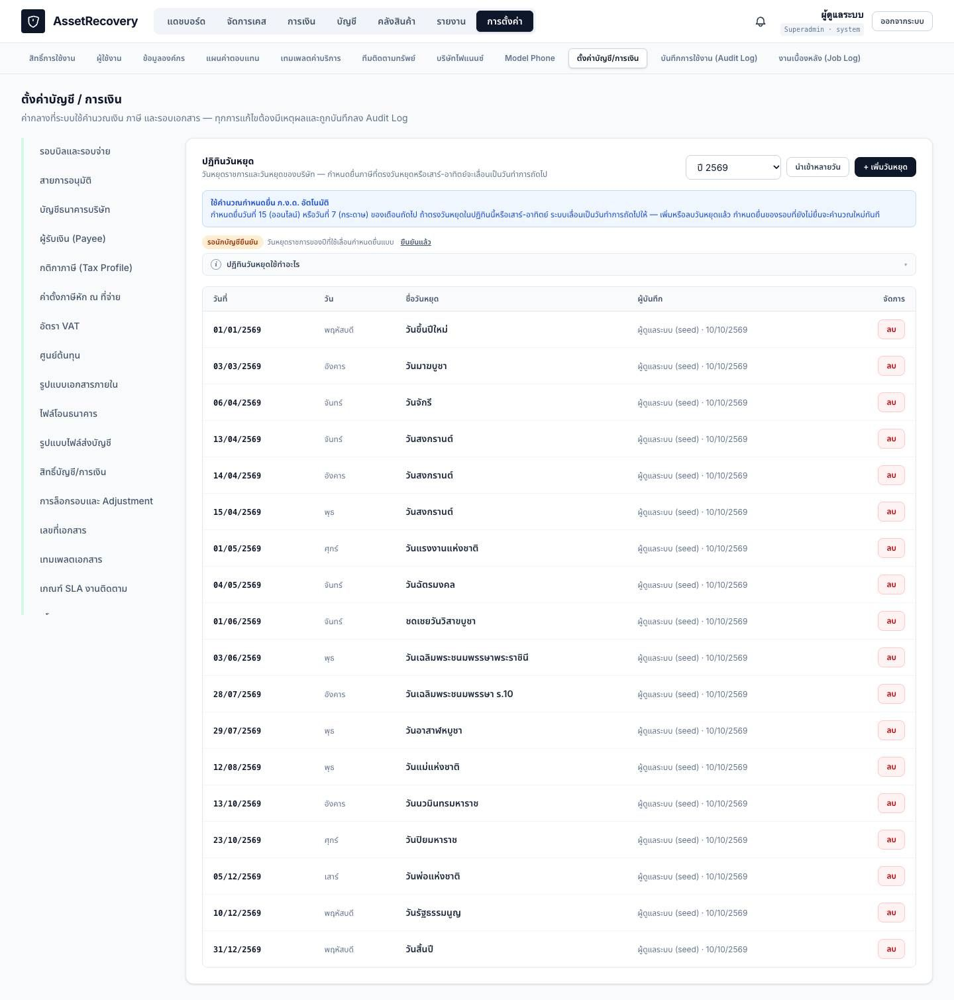

**ดูรายการที่รอนักบัญชียืนยัน**

1. กดเมนู **บัญชี** ที่แถบบน › **ค่าตั้งรอนักบัญชียืนยัน**
2. จะเห็นจำนวน "รอนักบัญชียืนยัน" และ "ยืนยันแล้ว" พร้อมรายการค่าตั้ง แต่ละแถวมีปุ่ม **ไปหน้าตั้งค่า** และ **ยืนยันแล้ว**

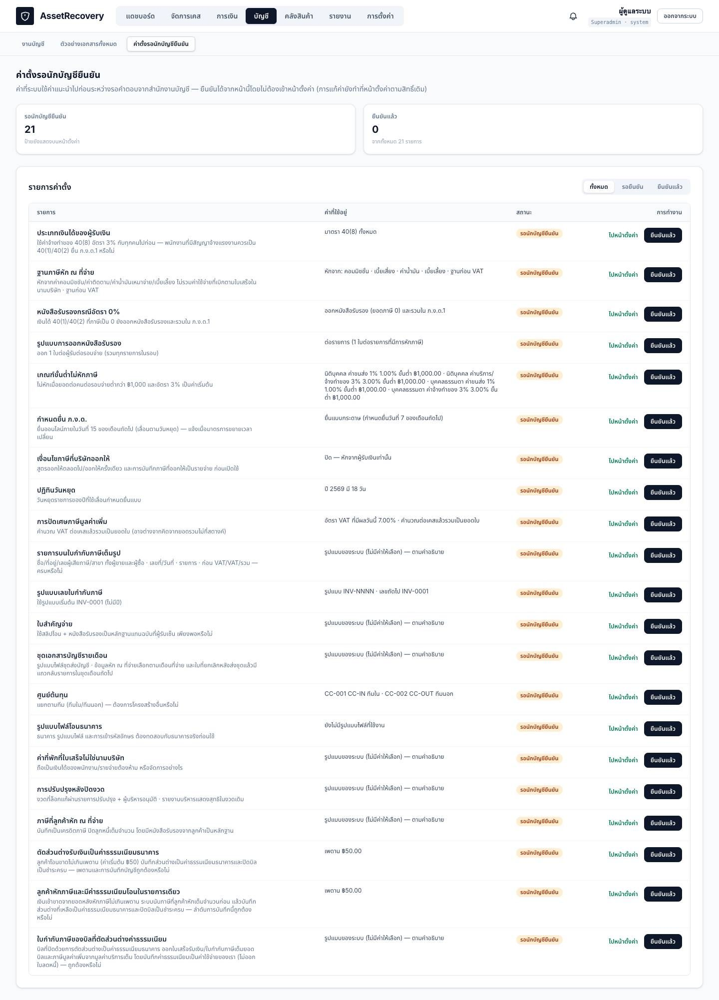

**ผลที่ควรเห็น:** ค่าในแต่ละแท็บตรงกับตารางด้านบน แท็บที่ยังรอสำนักงานบัญชีตรวจจะมีป้ายสีเหลือง **รอนักบัญชียืนยัน**

**ข้อควรระวัง / เคล็ดลับ**

- ป้าย **รอนักบัญชียืนยัน** หมายถึง "ใช้ค่านี้ไปก่อน รอสำนักงานบัญชียืนยัน" — ระบบทำงานได้ตามปกติ ไม่ต้องรอ
- ปุ่ม **ยืนยันแล้ว** เป็นงานของฝ่ายบัญชี ผู้ดูแลระบบไม่ต้องกด
- **ประเภทเงินได้** ของภาษีหัก ณ ที่จ่ายตั้งไว้เป็น "มาตรา 40(8) ทั้งหมด" — ถ้าพนักงานทีมในเป็นลูกจ้างประจำ ให้ปรึกษานักบัญชีเรื่องการเปลี่ยนเป็นแบบแยกตามประเภททีมก่อนใช้งานจริง
- ค่าที่เปลี่ยนตามกฎหมาย (VAT · วันหยุด) ให้ **เพิ่มแถวใหม่ตามวันที่มีผล** ไม่แก้แถวเดิม เพราะเอกสารเก่าต้องอ้างอัตราเดิม
- ทุกเดือนธันวาคม ควรเพิ่มวันหยุดราชการของปีถัดไปในแท็บ **ปฏิทินวันหยุด**

---

## บทที่ 3 ข้อมูลองค์กร โลโก้ และลายเซ็น

**เป้าหมาย:** กรอกข้อมูลบริษัทของเราให้ครบ เพื่อใช้พิมพ์บนใบกำกับภาษี ใบเสร็จ และใบแจ้งหนี้

**ก่อนเริ่ม:** เตรียมหนังสือรับรองบริษัท (ชื่อ เลขผู้เสียภาษี ที่อยู่) และไฟล์โลโก้/รูปลายเซ็น (PNG หรือ JPG ไม่เกิน 1 MB)

**ขั้นตอน — แก้ข้อมูลองค์กร**

1. **การตั้งค่า** › **ข้อมูลองค์กร** (รอข้อความ "กำลังเปิดหน้า..." หายไปก่อน ประมาณ 3–5 วินาที)
2. กด **แก้ไขข้อมูล**
3. กรอก/แก้ข้อมูลตามตารางด้านล่าง
4. กรอก **เหตุผล** แล้วกด **บันทึก**

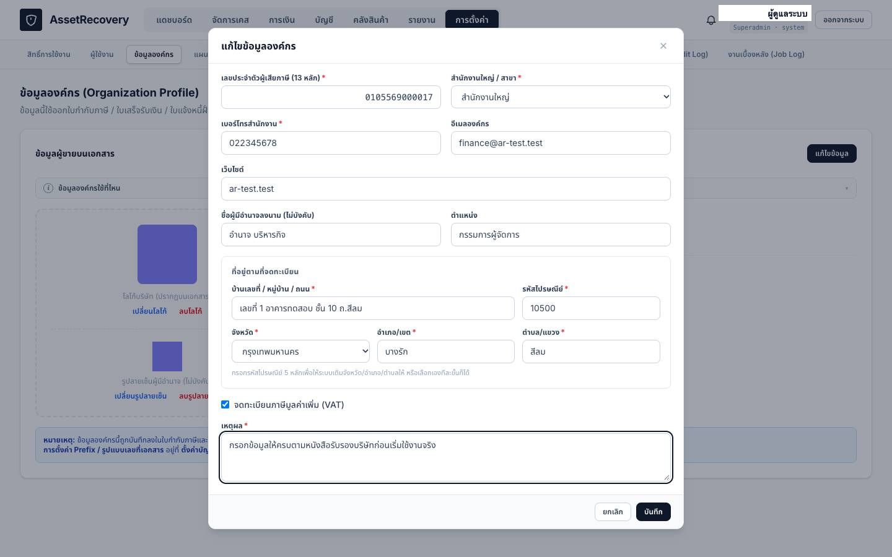

| ช่อง | ตัวอย่าง | บังคับ | หมายเหตุ |
|---|---|---|---|
| ชื่อบริษัท (ไทย) | บริษัท แอสเซ็ท รีคัฟเวอรี่ (ทดสอบ) จำกัด | บังคับ | ตามหนังสือรับรอง |
| เลขประจำตัวผู้เสียภาษี (13 หลัก) | 0105569000017 | บังคับ | |
| สำนักงานใหญ่ / สาขา | สำนักงานใหญ่ | บังคับ | |
| เบอร์โทรสำนักงาน | 022345678 | บังคับ | |
| อีเมลองค์กร / เว็บไซต์ | finance@ตัวอย่าง | ไม่บังคับ | |
| ชื่อผู้มีอำนาจลงนาม / ตำแหน่ง | อำนาจ บริหารกิจ · กรรมการผู้จัดการ | ไม่บังคับ | พิมพ์บนเอกสาร |
| บ้านเลขที่ / หมู่บ้าน / ถนน | เลขที่ 1 อาคารทดสอบ ชั้น 10 ถ.สีลม | บังคับ | |
| รหัสไปรษณีย์ · จังหวัด · อำเภอ/เขต · ตำบล/แขวง | 10500 · กรุงเทพมหานคร · บางรัก · สีลม | บังคับ | กรอกรหัสไปรษณีย์ ระบบเติมจังหวัด/อำเภอ/ตำบลให้ แก้เองได้ |
| จดทะเบียนภาษีมูลค่าเพิ่ม (VAT) | ติ๊ก | — | |
| เหตุผล | กรอกข้อมูลให้ครบตามหนังสือรับรองบริษัทก่อนเริ่มใช้งานจริง | บังคับ | |

**ผลที่ควรเห็น:** ข้อความ "บันทึกข้อมูลองค์กรแล้ว — มีผลกับเอกสารที่ออกหลังจากนี้"

**ขั้นตอน — เปลี่ยนโลโก้ / รูปลายเซ็น**

1. ในหน้า **ข้อมูลองค์กร** กด **เปลี่ยนโลโก้** (หรือ **เปลี่ยนรูปลายเซ็น**)
2. เลือกไฟล์ PNG/JPG ไม่เกิน 1 MB (แนะนำขนาด 400×400 พิกเซล)
3. กรอก **เหตุผล** แล้วกด **บันทึกโลโก้**

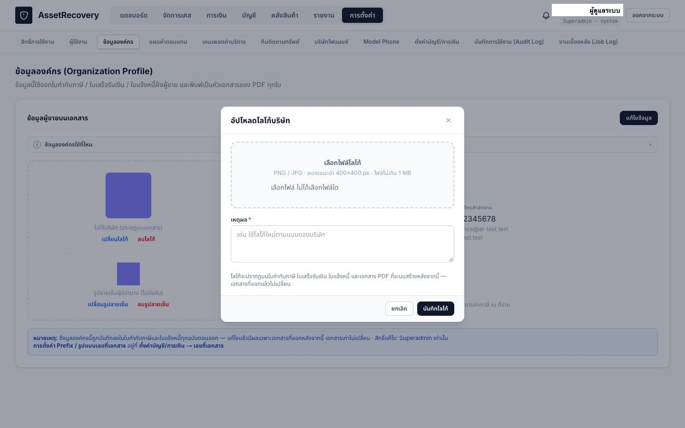

**ข้อควรระวัง / เคล็ดลับ**

- การแก้ข้อมูลองค์กรมีผลกับ **เอกสารที่ออกหลังจากนี้เท่านั้น** เอกสารที่ออกไปแล้วไม่เปลี่ยน
- ถ้าเปิดหน้านี้แล้วค้างที่ "กำลังเปิดหน้า..." ให้รอสักครู่ ปกติจะเปิดได้ภายในไม่กี่วินาที

---

## บทที่ 4 รูปแบบไฟล์ธนาคาร (ไฟล์โอนเงิน / statement)

**เป้าหมาย:** บอกระบบว่าไฟล์ที่ส่งให้ธนาคาร (ไฟล์โอนเงิน) และไฟล์ที่ดึงจากธนาคาร (statement) มีคอลัมน์อะไร เรียงอย่างไร

**ก่อนเริ่ม:** ขอรูปแบบไฟล์ (ชนิดไฟล์ การเข้ารหัสอักษร และลำดับคอลัมน์) จากธนาคารที่ใช้

**ขั้นตอน — เพิ่มรูปแบบไฟล์โอนเงิน**

1. **การตั้งค่า** › **ตั้งค่าบัญชี/การเงิน** › แท็บ **ไฟล์โอนธนาคาร**
2. กด **+ เพิ่มรูปแบบไฟล์**
3. **ใช้สำหรับ** = ไฟล์โอนเงิน (ส่งธนาคาร) · เลือก **ธนาคาร** · **ชนิดไฟล์** · **Encoding**
4. ระบบใส่คอลัมน์ที่ขาดไม่ได้ 4 คอลัมน์แรกให้ (รหัสธนาคารผู้รับ · เลขบัญชีผู้รับ · ชื่อบัญชีผู้รับ · จำนวนเงิน) กด **+ เพิ่มคอลัมน์** เพื่อเพิ่มคอลัมน์อื่นตามที่ธนาคารกำหนด เช่น วันที่โอน · เลขที่อ้างอิง · หมายเหตุ ใช้ลูกศร ↑ ↓ จัดลำดับ
5. กรอก **เหตุผล** แล้วกด **เพิ่มรูปแบบไฟล์**

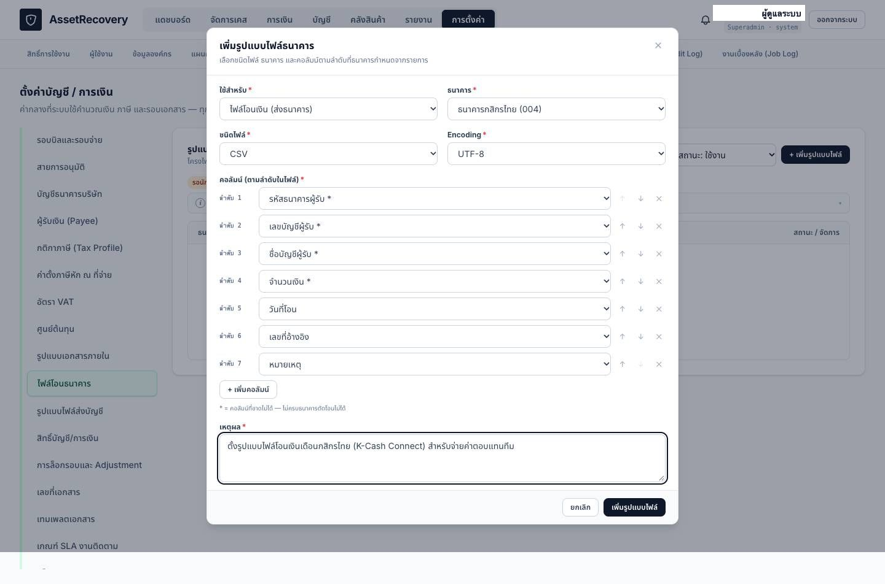

| ช่อง | ตัวอย่าง | บังคับ | หมายเหตุ |
|---|---|---|---|
| ใช้สำหรับ | ไฟล์โอนเงิน (ส่งธนาคาร) / ไฟล์ statement (นำเข้ากระทบยอด) | บังคับ | |
| ธนาคาร | ธนาคารกสิกรไทย (004) | บังคับ | |
| ชนิดไฟล์ / Encoding | CSV / UTF-8 | บังคับ | |
| คอลัมน์ (ตามลำดับในไฟล์) | 7 คอลัมน์ | บังคับ | คอลัมน์ที่มี * ขาดไม่ได้ |
| เหตุผล | ตั้งรูปแบบไฟล์โอนเงินกสิกรไทยสำหรับจ่ายค่าตอบแทนทีม | บังคับ | |

**ขั้นตอน — ทดสอบรูปแบบไฟล์**

1. ในแถวรูปแบบที่เพิ่งสร้าง (สถานะ "ยังไม่ทดสอบ") กด **ทดสอบ**
2. กรอก **เหตุผล** แล้วกด **เริ่มทดสอบ**

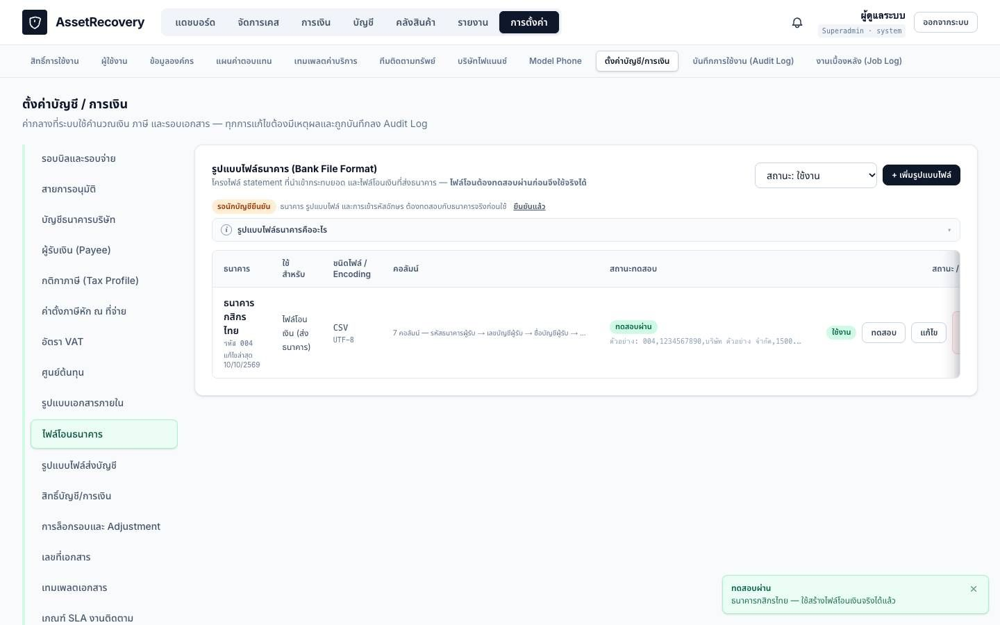

**ขั้นตอน — เพิ่มรูปแบบไฟล์ statement:** ทำเหมือนข้างบน แต่เลือก **ใช้สำหรับ** = ไฟล์ statement (นำเข้ากระทบยอด) ระบบใส่คอลัมน์ วันที่ · รายละเอียด · เงินเข้า · เงินออก ให้ เพิ่มเช่น เลขที่อ้างอิง · ยอดคงเหลือ แล้วทดสอบเช่นเดียวกัน

**ผลที่ควรเห็น:** ข้อความ "ทดสอบผ่าน — ใช้สร้างไฟล์โอนเงินจริงได้แล้ว" และป้าย **ทดสอบผ่าน** พร้อมตัวอย่างบรรทัดข้อมูล

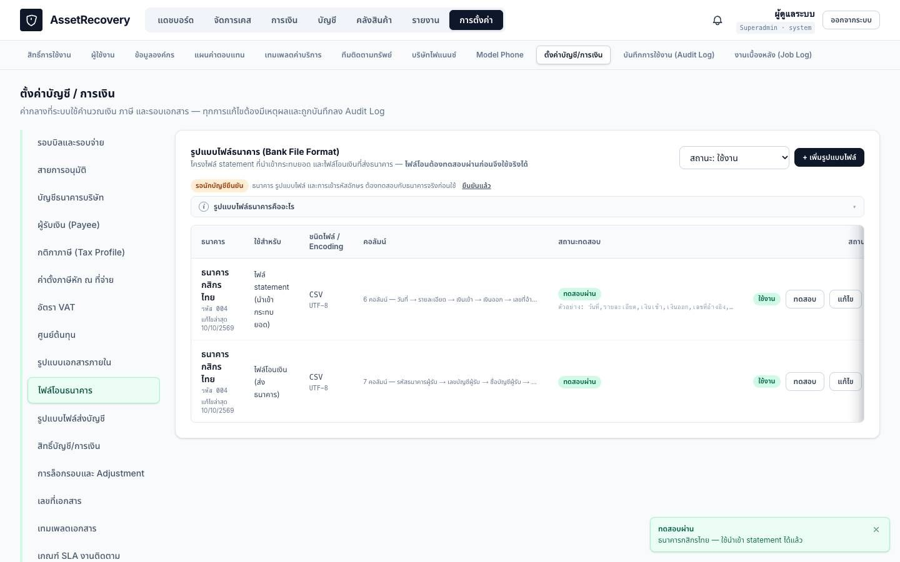

**ข้อควรระวัง / เคล็ดลับ**

- รูปแบบไฟล์โอนที่ **ยังไม่ทดสอบผ่าน ใช้สร้างไฟล์โอนเงินจริงไม่ได้**
- ดูตัวอย่างบรรทัดหลังทดสอบ — วันที่ในไฟล์แสดงเป็นปี พ.ศ. ควรสอบถามธนาคารว่ารับรูปแบบนี้หรือไม่ก่อนใช้จริง

---

## บทที่ 5 บัญชีธนาคารบริษัท

**เป้าหมาย:** เพิ่มบัญชีธนาคารของบริษัทที่ใช้รับเงินจากบริษัทไฟแนนซ์และจ่ายเงินให้ทีม

**ก่อนเริ่ม:** สร้างรูปแบบไฟล์ธนาคารตามบทที่ 4 ก่อน จึงจะเลือกผูกในฟอร์มนี้ได้

**ขั้นตอน**

1. **การตั้งค่า** › **ตั้งค่าบัญชี/การเงิน** › แท็บ **บัญชีธนาคารบริษัท**
2. กด **+ เพิ่มบัญชี**
3. กรอกข้อมูลตามตาราง เลือกรูปแบบไฟล์ statement และไฟล์โอนเงินที่สร้างไว้
4. ถ้าเป็นบัญชีหลัก ติ๊ก **ตั้งเป็นบัญชีหลักขององค์กร**
5. กรอก **เหตุผล** แล้วกด **เพิ่มบัญชี**

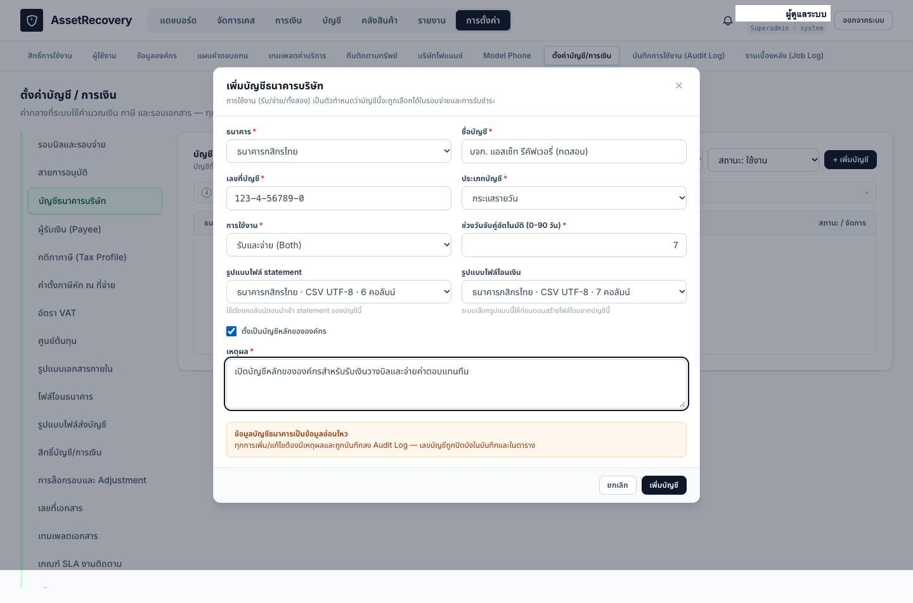

| ช่อง | ตัวอย่าง | บังคับ | หมายเหตุ |
|---|---|---|---|
| ธนาคาร | ธนาคารกสิกรไทย | บังคับ | |
| ชื่อบัญชี | บจก. แอสเซ็ท รีคัฟเวอรี่ (ทดสอบ) | บังคับ | |
| เลขที่บัญชี | 123-4-56789-0 | บังคับ | |
| ประเภทบัญชี | กระแสรายวัน | บังคับ | |
| การใช้งาน | รับและจ่าย (Both) | บังคับ | กำหนดว่าบัญชีนี้เลือกได้ในรอบจ่าย/การรับชำระหรือไม่ |
| ช่วงวันจับคู่อัตโนมัติ (0–90 วัน) | 7 | บังคับ | ใช้ตอนจับคู่รายการ statement กับบิล |
| รูปแบบไฟล์ statement | ธนาคารกสิกรไทย · CSV UTF-8 · 6 คอลัมน์ | ไม่บังคับ | |
| รูปแบบไฟล์โอนเงิน | ธนาคารกสิกรไทย · CSV UTF-8 · 7 คอลัมน์ | ไม่บังคับ | |
| ตั้งเป็นบัญชีหลักขององค์กร | ติ๊ก | — | |
| เหตุผล | เปิดบัญชีหลักขององค์กรสำหรับรับเงินวางบิลและจ่ายค่าตอบแทนทีม | บังคับ | |

**ผลที่ควรเห็น:** แถวใหม่ในตาราง เลขบัญชีแสดงแบบปิดบัง (เช่น xxxxxx7890) พร้อมป้าย **บัญชีหลัก**

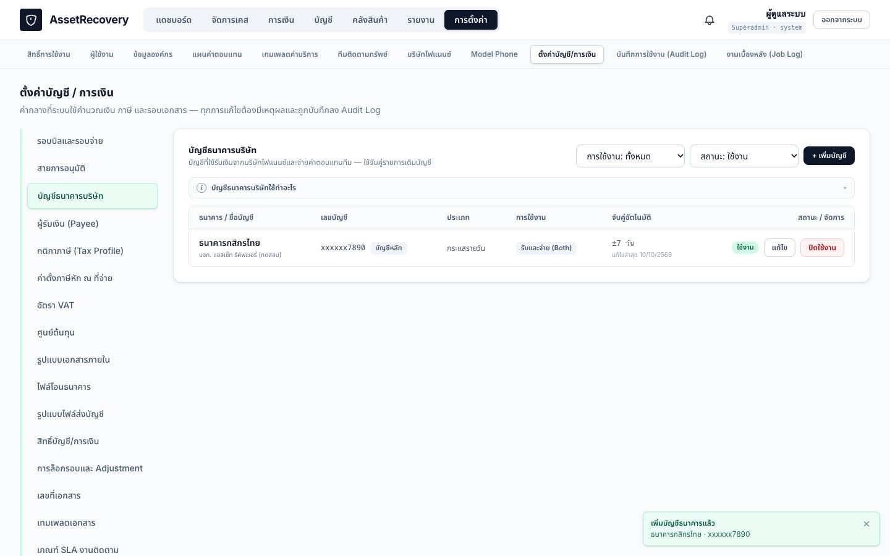

**ข้อควรระวัง:** ข้อมูลบัญชีธนาคารเป็นข้อมูลอ่อนไหว ทุกการเพิ่ม/แก้ต้องมีเหตุผลและถูกบันทึกในบันทึกการใช้งาน

---

## บทที่ 6 แผนค่าตอบแทน (จ่ายทีมติดตาม)

**เป้าหมาย:** กำหนดอัตราค่าน้ำมัน เบี้ยเลี้ยง ค่าที่พัก คอมมิชชั่น และเบี้ยเสี่ยงที่จ่ายให้พนักงานติดตาม

**ก่อนเริ่ม:** ได้อัตราที่ผู้บริหารอนุมัติแล้ว แยกตามฝั่งทีม (Inhouse = ทีมใน, Outsource = ทีมนอก)

**ขั้นตอน**

1. **การตั้งค่า** › **แผนค่าตอบแทน** › กด **+ สร้างแผนค่าตอบแทน**
2. กรอก **ชื่อแผน** และเลือก **ฝั่งทีม**
3. เลือกโหมดค่าน้ำมัน **ตามระยะทาง** หรือ **เหมาจ่ายรายวัน** แล้วกรอกอัตรา
4. กรอกเบี้ยเลี้ยง ค่าที่พักสูงสุด ค่าคอมมิชชั่น เบี้ยเสี่ยง หัก ณ ที่จ่าย และวันเริ่มมีผล
5. กรอก **เหตุผล** แล้วกด **สร้างแผน** (ทำซ้ำตามจำนวนแผนที่ต้องการ)

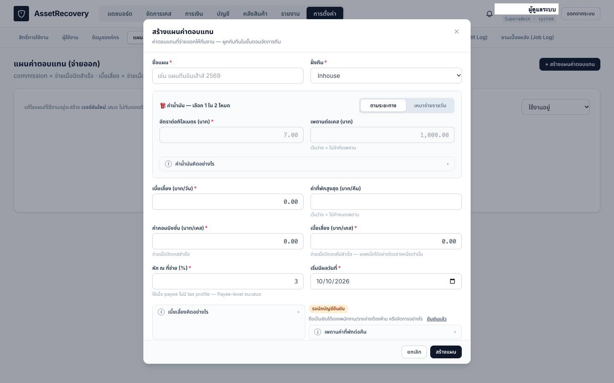

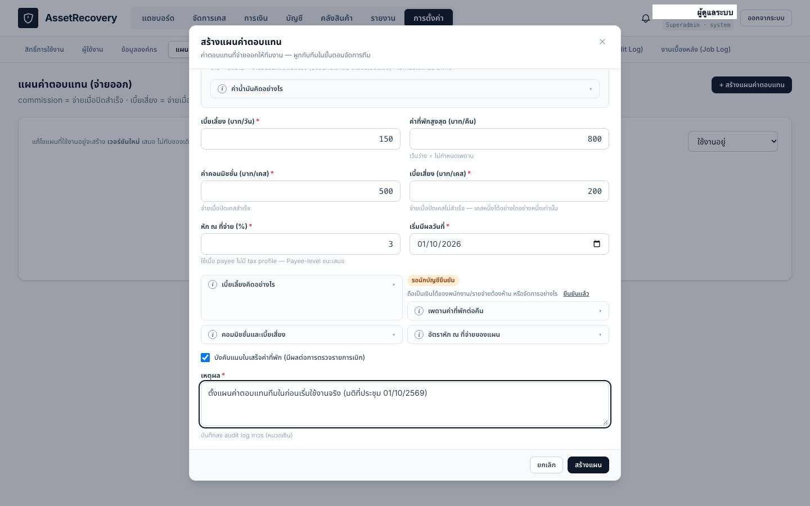

| ช่อง | ตัวอย่าง | บังคับ | หมายเหตุ |
|---|---|---|---|
| ชื่อแผน | PLAN_IN แผนทีมใน 2569 | บังคับ | |
| ฝั่งทีม | Inhouse | บังคับ | ทีมจะเลือกได้เฉพาะแผนฝั่งเดียวกัน |
| ค่าน้ำมัน — เหมาจ่ายรายวัน | 200 บาท/วัน | บังคับ (เลือก 1 ใน 2 โหมด) | |
| ค่าน้ำมัน — ตามระยะทาง | 5 บาท/กม. · เพดาน 400 บาท/เคส | บังคับ (เลือก 1 ใน 2 โหมด) | เพดานเว้นว่าง = ไม่จำกัด |
| เบี้ยเลี้ยง (บาท/วัน) | 150 | บังคับ | ใส่ 0 ได้ |
| ค่าที่พักสูงสุด (บาท/คืน) | 800 | ไม่บังคับ | เว้นว่าง = ไม่กำหนดเพดาน |
| ค่าคอมมิชชั่น (บาท/เคส) | 500 | บังคับ | จ่ายเมื่อปิดเคสสำเร็จ |
| เบี้ยเสี่ยง (บาท/เคส) | 200 | บังคับ | จ่ายเมื่อปิดเคสไม่สำเร็จ |
| หัก ณ ที่จ่าย (%) | 3 | บังคับ | ใช้เมื่อผู้รับเงินไม่มีกติกาภาษีรายคน |
| เริ่มมีผลวันที่ | 01/10/2569 | บังคับ | |
| บังคับแนบใบเสร็จค่าที่พัก | ติ๊ก | — | มีผลตอนตรวจรายการเบิก |
| เหตุผล | ตั้งแผนค่าตอบแทนทีมในก่อนเริ่มใช้งานจริง | บังคับ | |

ตัวอย่างแผนที่ใช้ทดลอง: **PLAN_IN** (ทีมใน เหมาน้ำมัน 200/วัน) · **PLAN_OUT** (ทีมนอก เหมาน้ำมัน 300/วัน คอม 1,000 เบี้ยเสี่ยง 300 ที่พักไม่จำกัด) · **PLAN_KM** (ทีมใน น้ำมัน 5 บาท/กม. เพดาน 400/เคส)

**ผลที่ควรเห็น:** ข้อความ "สร้างแผนค่าตอบแทนแล้ว" และการ์ดแผน v1 พร้อมวันที่มีผล

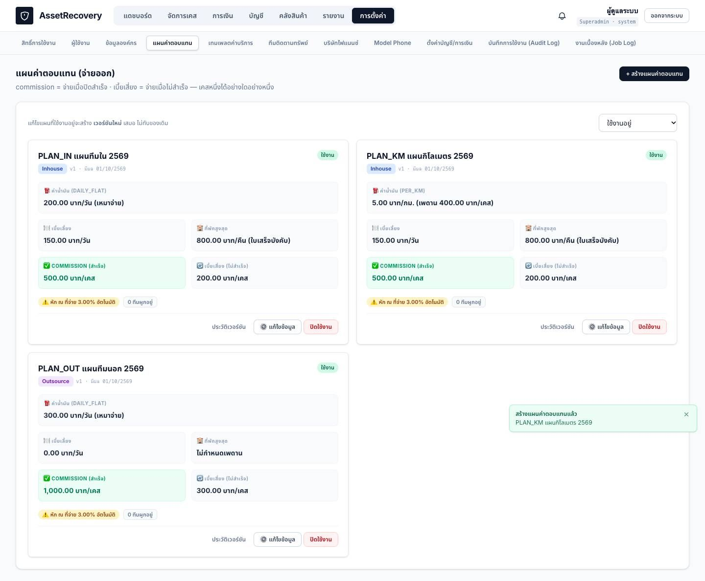

**ข้อควรระวัง / เคล็ดลับ**

- **การแก้แผนที่ใช้งานอยู่ = สร้างเวอร์ชันใหม่เสมอ** เคสเดิมยังใช้อัตราเวอร์ชันเดิม ดูย้อนหลังได้ที่ **ประวัติเวอร์ชัน**
- เคสหนึ่งได้ **คอมมิชชั่น (สำเร็จ) หรือ เบี้ยเสี่ยง (ไม่สำเร็จ) อย่างใดอย่างหนึ่ง** เท่านั้น
- ช่องวันที่ใช้ตัวเลือกวันที่ของเบราว์เซอร์ ซึ่งอาจแสดงปีเป็น ค.ศ. (เช่น 01/10/2026 = 01/10/2569) — บนการ์ดและหน้าอื่นระบบแสดงเป็น พ.ศ.
- บนการ์ดอาจเห็นคำภาษาอังกฤษกำกับ เช่น "DAILY_FLAT" (เหมาจ่ายรายวัน) "PER_KM" (ตามระยะทาง) "COMMISSION" (คอมมิชชั่น)

---

## บทที่ 7 เทมเพลตค่าบริการ (เก็บจากบริษัทไฟแนนซ์)

**เป้าหมาย:** กำหนดวิธีคิดค่าบริการที่เรียกเก็บจากบริษัทไฟแนนซ์ต่อเคส

**ขั้นตอน**

1. **การตั้งค่า** › **เทมเพลตค่าบริการ** › กด **+ สร้างเทมเพลต**
2. กรอก **ชื่อเทมเพลตค่าบริการ**
3. เลือก **โมเดลเก็บเงิน (Pricing Model)**: Success Fee (% ความสำเร็จ) / Flat Rate (เหมา) / Hybrid (เหมา + %)
4. กรอกค่าตามโมเดล ถ้าต้องการเก็บเงินแม้ติดตามไม่สำเร็จ ติ๊ก **เรียกเก็บกรณีไม่สำเร็จ** แล้วกรอกยอด
5. กรอก **เหตุผล** แล้วกด **สร้างเทมเพลต**

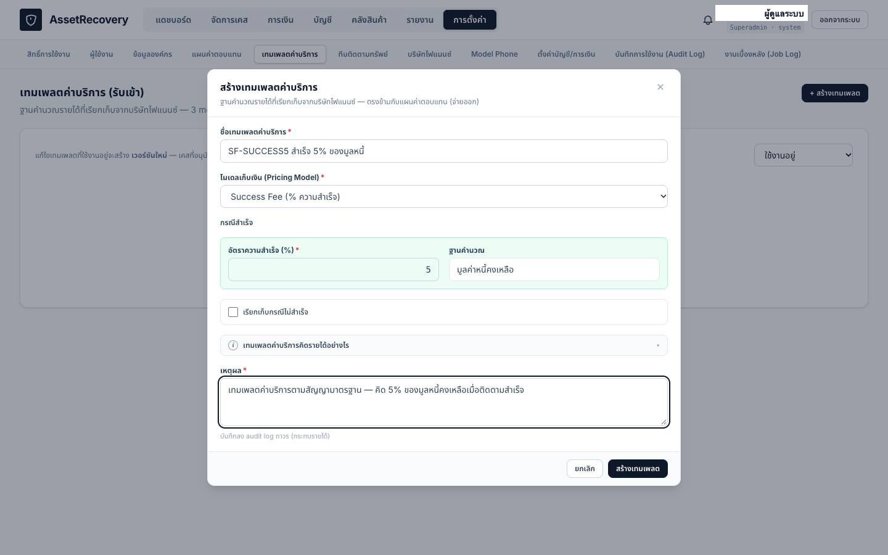

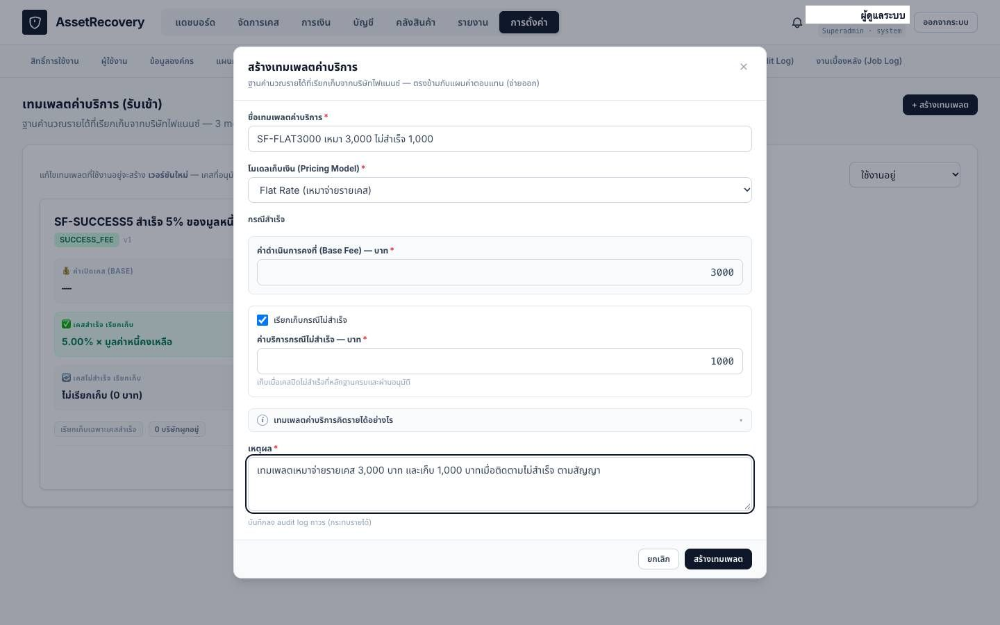

| โมเดล | ตัวอย่าง | ค่าที่ต้องกรอก |
|---|---|---|
| Success Fee | SF-SUCCESS5 สำเร็จ 5% ของมูลหนี้ | อัตรา % × มูลค่าหนี้คงเหลือ |
| Flat Rate | SF-FLAT3000 เหมา 3,000 ไม่สำเร็จ 1,000 | ค่าเหมา (บาท) · ยอดกรณีไม่สำเร็จ (ถ้าติ๊ก) |
| Hybrid | SF-HYBRID ผสม 2,000 + 3% | ค่าเหมา + อัตรา % |

**ผลที่ควรเห็น:** ข้อความ "สร้างเทมเพลตค่าบริการแล้ว" และการ์ดเทมเพลตในรายการ

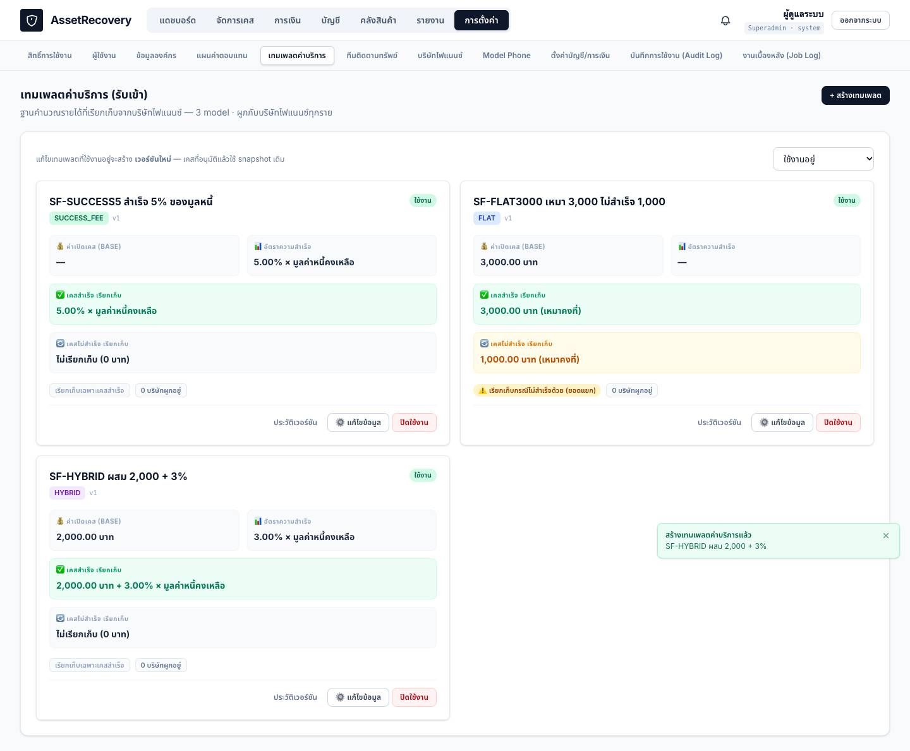

**ข้อควรระวัง:** เคสที่อนุมัติแล้วจะจำค่าบริการ ณ วันที่อนุมัติไว้ การแก้เทมเพลตภายหลัง (ซึ่งสร้างเวอร์ชันใหม่) **ไม่กระทบเคสเดิม**

---

## บทที่ 8 รอบวางบิล (AR)

**เป้าหมาย:** กำหนดรอบตัดยอดวางบิลและเงื่อนไขชำระเงินของบริษัทไฟแนนซ์ — **ต้องทำก่อนสร้างบริษัทไฟแนนซ์**

**ขั้นตอน**

1. **การตั้งค่า** › **ตั้งค่าบัญชี/การเงิน** › แท็บ **รอบบิลและรอบจ่าย** › กด **+ สร้างรอบ**
2. กรอกตามตาราง
3. กรอก **เหตุผล** แล้วกด **สร้างรอบ**

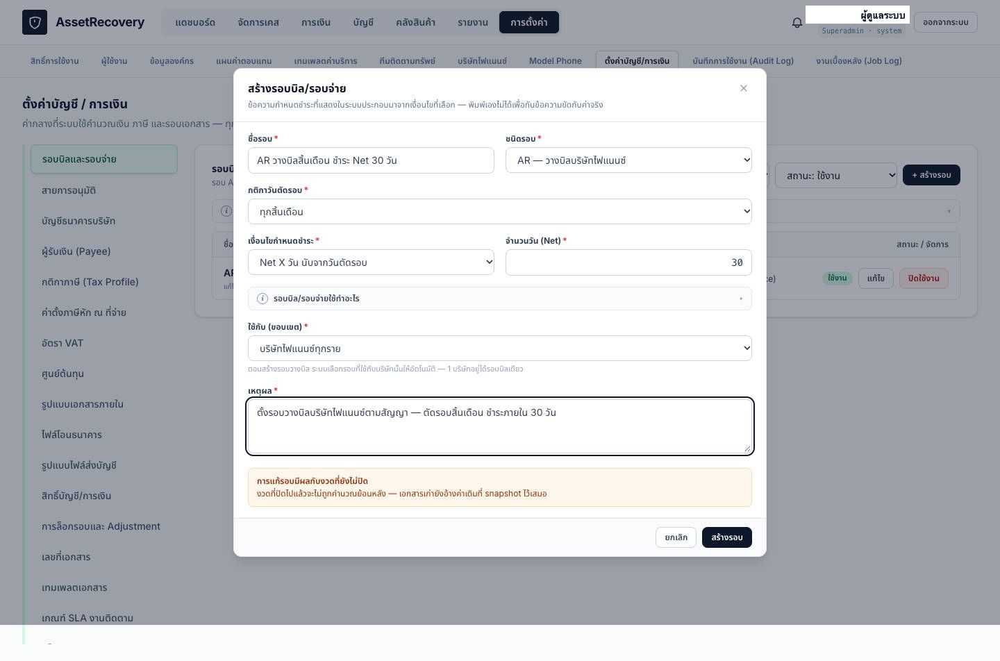

| ช่อง | ตัวอย่าง | บังคับ | หมายเหตุ |
|---|---|---|---|
| ชื่อรอบ | AR วางบิลสิ้นเดือน ชำระ Net 30 วัน | บังคับ | |
| ชนิดรอบ | AR — วางบิลบริษัทไฟแนนซ์ | บังคับ | (รอบ AP = รอบจ่ายพนักงาน มีให้แล้ว) |
| กติกาวันตัดรอบ | ทุกสิ้นเดือน | บังคับ | |
| เงื่อนไขกำหนดชำระ / จำนวนวัน | Net X วัน นับจากวันตัดรอบ / 30 | บังคับ | |
| ใช้กับ (ขอบเขต) | บริษัทไฟแนนซ์ทุกราย | บังคับ | 1 บริษัทอยู่ได้รอบบิลเดียว |
| เหตุผล | ตั้งรอบวางบิลบริษัทไฟแนนซ์ตามสัญญา | บังคับ | |

**ผลที่ควรเห็น:** ข้อความ "สร้างรอบแล้ว" และแถวรอบใหม่สถานะ **ใช้งาน**

**ข้อควรระวัง / เคล็ดลับ**

- ถ้ายังไม่มีรอบ AR ช่อง **รอบบิลที่ใช้** ในฟอร์มบริษัทจะว่าง และจะวางบิลบริษัทนั้นไม่ได้
- รอบที่ตั้งเป็น "บริษัทไฟแนนซ์ทุกราย" จะถูกเลือกให้บริษัทใหม่อัตโนมัติ (ช่องในฟอร์มบริษัทเป็นสีเทา)
- การแก้รอบมีผลกับงวดที่ยังไม่ปิดเท่านั้น

---

## บทที่ 9 บริษัทไฟแนนซ์และเอกสารบริษัท

**เป้าหมาย:** เพิ่มบริษัทลูกค้าที่ส่งเคสมาให้ติดตาม พร้อมแนบหนังสือรับรองและ ภ.พ.20

**ก่อนเริ่ม:** มีเทมเพลตค่าบริการ (บทที่ 7) และรอบวางบิล AR (บทที่ 8) แล้ว · เตรียมข้อมูลบริษัทตามหนังสือรับรอง

**ขั้นตอน — สร้างบริษัท**

1. **การตั้งค่า** › **บริษัทไฟแนนซ์** › กด **+ สร้างบริษัท**
2. กรอกชื่อ ชื่อย่อ เลขผู้เสียภาษี ที่อยู่ ผู้ติดต่อ ผู้ลงนาม อีเมล
3. เลือก **เทมเพลตค่าบริการที่ผูก · รูปแบบส่งใบกำกับภาษีเริ่มต้น · สถานะ VAT ของบริษัท · รูปแบบราคา/VAT** และกรอก **% ที่ลูกค้าหักภาษี ณ ที่จ่าย**
4. ตรวจช่อง **รอบบิลที่ใช้** (ระบบเลือกให้)
5. กรอก **เหตุผล** แล้วกด **สร้างบริษัท**

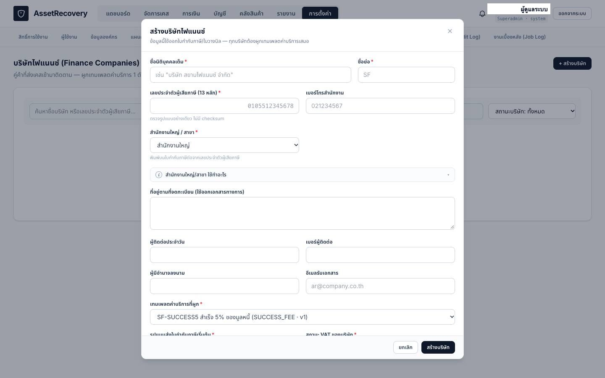

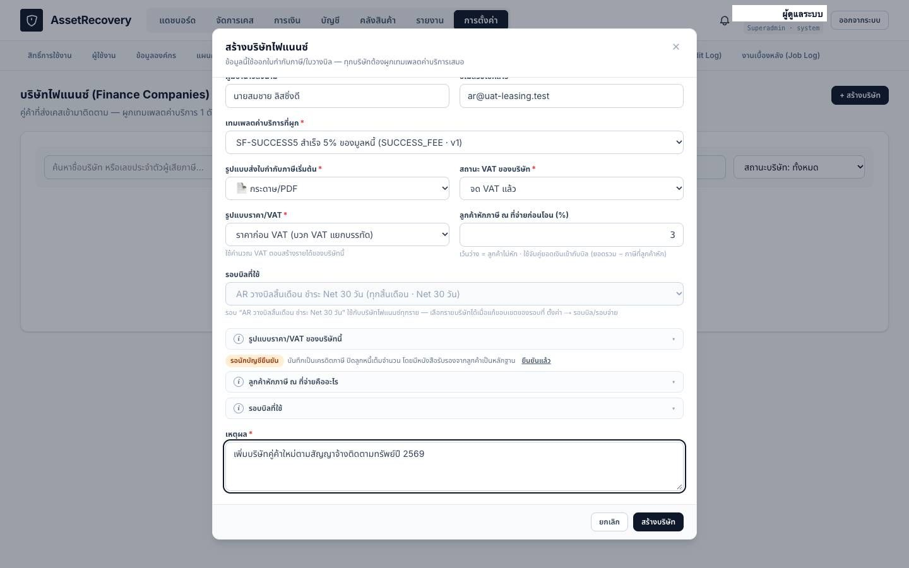

| ช่อง | ตัวอย่าง | บังคับ | หมายเหตุ |
|---|---|---|---|
| ชื่อนิติบุคคลเต็ม | บริษัท ยูเอที ลิสซิ่ง จำกัด | บังคับ | |
| ชื่อย่อ | UAT-L | บังคับ | |
| เลขประจำตัวผู้เสียภาษี (13 หลัก) | 0105569001017 | บังคับ | ตรวจเฉพาะรูปแบบ — ตรวจทานตัวเลขให้ดี |
| เบอร์โทรสำนักงาน | 021234567 | ไม่บังคับ | |
| สำนักงานใหญ่ / สาขา | สำนักงานใหญ่ | บังคับ | พิมพ์บนใบกำกับภาษี |
| ที่อยู่ตามที่จดทะเบียน | 99 อาคารยูเอที ทาวเวอร์ ชั้น 12 ถ.รัชดาภิเษก ... | ไม่บังคับ | ใช้ออกเอกสารทางการ — ควรกรอก |
| ผู้ติดต่อประจำวัน / เบอร์ผู้ติดต่อ | นางสาวพิมพ์ชนก ติดตามดี / 0812345601 | ไม่บังคับ | |
| ผู้มีอำนาจลงนาม | นายสมชาย ลิสซิ่งดี | ไม่บังคับ | |
| อีเมลรับเอกสาร | ar@ตัวอย่าง | ไม่บังคับ | |
| เทมเพลตค่าบริการที่ผูก | SF-SUCCESS5 สำเร็จ 5% ของมูลหนี้ | บังคับ | |
| รูปแบบส่งใบกำกับภาษีเริ่มต้น | กระดาษ/PDF | บังคับ | |
| สถานะ VAT ของบริษัท | จด VAT แล้ว | บังคับ | |
| รูปแบบราคา/VAT | ราคาก่อน VAT (บวก VAT แยกบรรทัด) / ราคารวม VAT แล้ว | บังคับ | |
| ลูกค้าหักภาษี ณ ที่จ่ายก่อนโอน (%) | 3 | ไม่บังคับ | เว้นว่าง = ลูกค้าไม่หัก |
| รอบบิลที่ใช้ | AR วางบิลสิ้นเดือน ชำระ Net 30 วัน | — | ระบบเลือกให้ |
| เหตุผล | เพิ่มบริษัทคู่ค้าใหม่ตามสัญญาจ้างติดตามทรัพย์ปี 2569 | บังคับ | |

**ผลที่ควรเห็น:** ข้อความ "สร้างบริษัทไฟแนนซ์แล้ว" การ์ดบริษัทแสดงรอบบิล AR และป้ายเตือน **เอกสารบริษัทยังไม่ครบ**

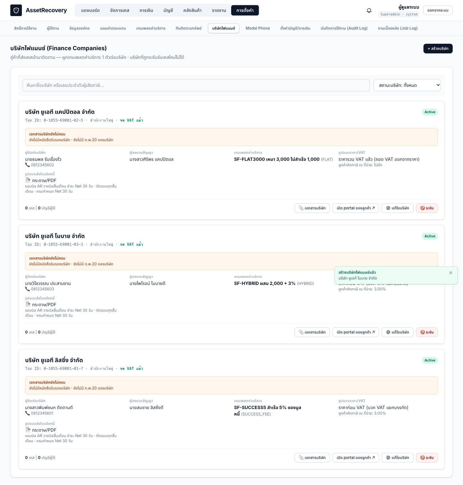

**ขั้นตอน — แนบเอกสารบริษัท**

1. บนการ์ดบริษัท กด **📎 เอกสารบริษัท**
2. ในส่วน **แนบเอกสารใหม่** เลือก **ชนิดเอกสาร** (หนังสือรับรองบริษัท / ภ.พ.20)
3. หนังสือรับรอง: กรอก **วันที่ออกหนังสือรับรอง**
4. เลือกไฟล์ (PDF หรือรูปภาพ ไม่เกิน 10 MB) · กรอก **เหตุผล** · กด **แนบเอกสาร**
5. ทำซ้ำกับ ภ.พ.20 · กด **เปิดดู** เพื่อตรวจไฟล์

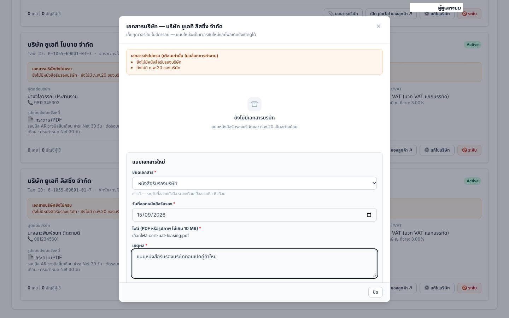

**ผลที่ควรเห็น:** ข้อความ "แนบเอกสารแล้ว" รายการเอกสารแสดงเวอร์ชันและรหัสตรวจสอบไฟล์ ป้ายเตือนเอกสารไม่ครบหายไปจากการ์ด

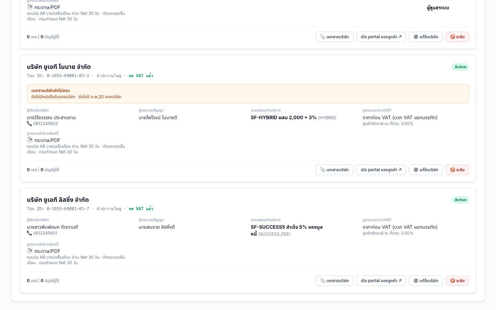

**ข้อควรระวัง / เคล็ดลับ**

- ป้าย **เอกสารบริษัทยังไม่ครบ** เป็นการเตือนเท่านั้น ไม่ห้ามการทำงาน แต่ควรแนบให้ครบก่อนวางบิล
- ระบบเตือนเมื่อหนังสือรับรองออกเกิน 6 เดือน
- เอกสารเก็บทุกเวอร์ชัน **ไม่มีการลบ** — แนบใหม่จะกลายเป็นเวอร์ชันใหม่ ไฟล์เดิมยังเปิดดูได้
- ปุ่ม **เปิด portal ของลูกค้า** ใช้ดูหน้าที่บริษัทไฟแนนซ์เห็น (ดูอย่างเดียว) · ปุ่ม **ระงับ** ใช้หยุดรับเคสใหม่ของบริษัท

---

## บทที่ 10 ทีมติดตามทรัพย์

**เป้าหมาย:** สร้างทีม กำหนดแผนค่าตอบแทน ผู้จัดการ หัวหน้าทีม และจังหวัดที่ดูแล (ระบบใช้จังหวัดเสนอทีมให้เคสอัตโนมัติ)

**ก่อนเริ่ม:** มีแผนค่าตอบแทนแล้ว (บทที่ 6) · ผู้ใช้บทบาทผู้จัดการ/หัวหน้าทีมถูกสร้างไว้แล้ว (บทที่ 11)

**ขั้นตอน**

1. **การตั้งค่า** › **ทีมติดตามทรัพย์** › กด **+ สร้างทีม**
2. กรอก **ชื่อทีม** เลือก **ฝั่ง (Group)** และ **แผนค่าตอบแทน**
3. เลือก **หัวหน้าทีมติดตามทรัพย์** (ถ้ามี) และ **สถานะทีม**
4. ติ๊กชื่อใน **ผู้จัดการทีม** (เลือกได้มากกว่า 1 คน) และติ๊ก **จังหวัดที่ดูแล**
5. กรอก **เหตุผล** แล้วกด **สร้างทีม**

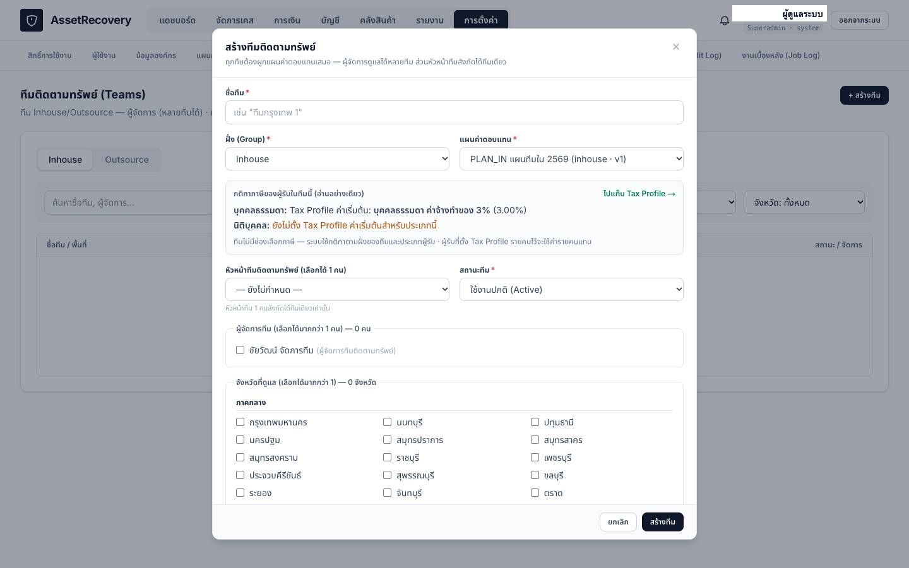

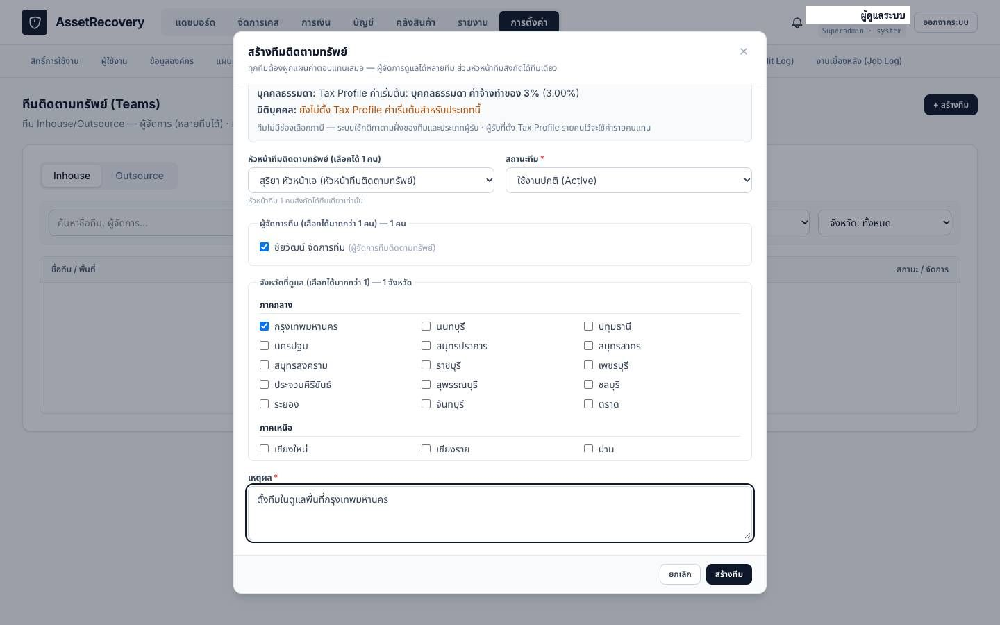

| ช่อง | ตัวอย่าง | บังคับ | หมายเหตุ |
|---|---|---|---|
| ชื่อทีม | TEAM_A กรุงเทพ | บังคับ | |
| ฝั่ง (Group) | Inhouse | บังคับ | รายการแผน/หัวหน้า/ผู้จัดการจะกรองตามฝั่ง |
| แผนค่าตอบแทน | PLAN_IN แผนทีมใน 2569 | บังคับ | |
| หัวหน้าทีมติดตามทรัพย์ | สุริยา หัวหน้าเอ | ไม่บังคับ | หัวหน้า 1 คนสังกัดได้ทีมเดียว |
| สถานะทีม | ใช้งานปกติ (Active) | บังคับ | |
| ผู้จัดการทีม | ชัยวัฒน์ จัดการทีม | — | ผู้จัดการ 1 คนดูแลได้หลายทีม |
| จังหวัดที่ดูแล | กรุงเทพมหานคร | — | เลือกได้หลายจังหวัด |
| เหตุผล | ตั้งทีมในดูแลพื้นที่กรุงเทพมหานคร | บังคับ | |

กล่อง **กติกาภาษีของผู้รับในทีมนี้** แสดงอัตราภาษีหัก ณ ที่จ่ายที่จะใช้กับคนในทีม (อ่านอย่างเดียว)

**ผลที่ควรเห็น:** ข้อความ "สร้างทีมแล้ว" และทีมใหม่ในรายการ

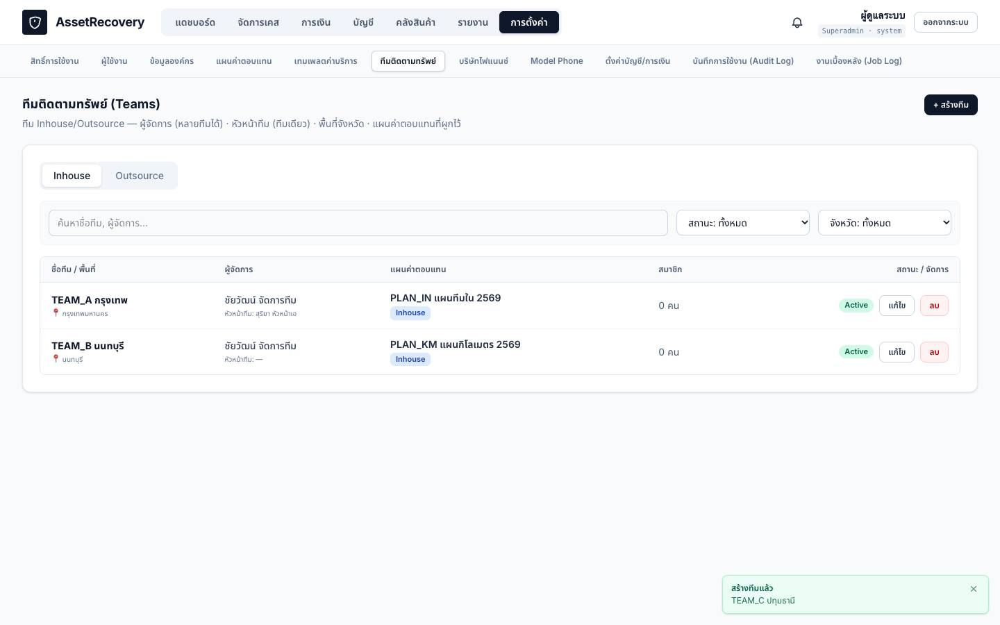

**ข้อควรระวัง / เคล็ดลับ**

- สร้างทีมแล้ว ต้องไปตั้ง **ทีมที่สังกัด** ของหัวหน้า/ผู้จัดการ/พนักงานที่หน้าผู้ใช้งานด้วย (บทที่ 11)
- ตรวจให้หัวหน้าทีมแต่ละคนอยู่ทีมเดียว — รายชื่อในช่องหัวหน้าอาจยังแสดงคนที่เป็นหัวหน้าทีมอื่นอยู่แล้ว ให้เลือกให้ถูกคน
- รายชื่อจังหวัดในฟอร์มอาจยังไม่ครบทุกจังหวัด ถ้าหาจังหวัดที่ต้องการไม่พบ ให้แจ้งทีมผู้พัฒนาระบบ

---

## บทที่ 11 ผู้ใช้งาน สังกัด และข้อมูลรับเงิน

**เป้าหมาย:** สร้างบัญชีผู้ใช้ ผูกทีม/บริษัท และบันทึกข้อมูลรับเงิน (สำหรับจ่ายค่าตอบแทนและออกหนังสือรับรองการหักภาษี)

**ก่อนเริ่ม:** มีทีม (บทที่ 10) และบริษัทไฟแนนซ์ (บทที่ 9) แล้ว · สำหรับพนักงานที่รับเงิน เตรียมสำเนาบัตรประชาชน (หรือหนังสือรับรองบริษัท) และเลขบัญชีธนาคาร

หน้า **ผู้ใช้งาน** แบ่งเป็น 3 แท็บ: **แอดมิน** (บทบาทฝ่ายสำนักงาน) · **เจ้าหน้าที่ติดตามทรัพย์** (แท็บย่อย Inhouse / Outsource) · **บริษัทไฟแนนซ์** (ผู้ใช้พอร์ทัล)

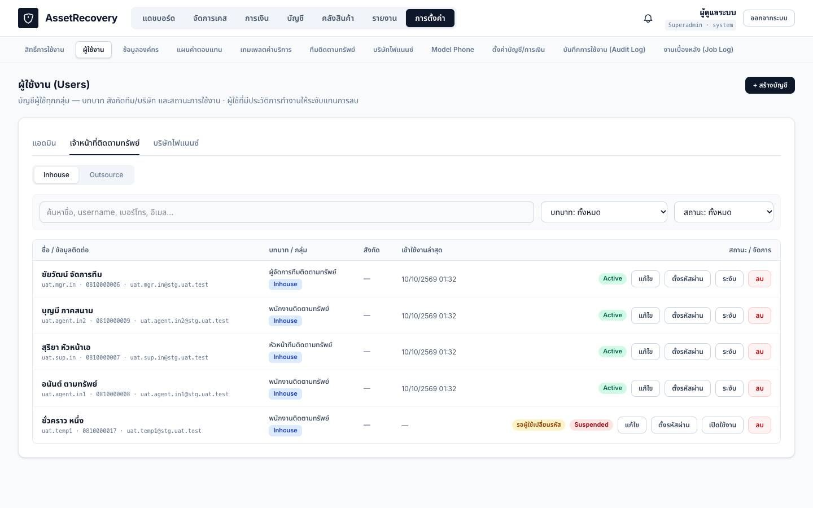

### 11.1 สร้างบัญชีผู้ใช้ใหม่

1. **การตั้งค่า** › **ผู้ใช้งาน** › กด **+ สร้างบัญชี**
2. เลือก **กลุ่มผู้ใช้ (Role Group)** แล้วเลือก **บทบาท (Role)**
3. กรอก **ชื่อ-นามสกุล · ชื่อผู้ใช้ (ใช้เข้าสู่ระบบ) · อีเมล (ไม่บังคับ) · เบอร์โทร · รหัสพนักงาน**
4. เลือก **ทีมที่สังกัด** (กลุ่มติดตามทรัพย์) หรือ **บริษัทไฟแนนซ์** (กลุ่มบริษัทไฟแนนซ์)
5. ตั้ง **รหัสผ่านเริ่มต้น** และ **ยืนยันรหัสผ่าน** แล้วกด **สร้างบัญชี**
6. แจ้งชื่อผู้ใช้และรหัสผ่านเริ่มต้นให้ผู้ใช้ทางช่องทางที่ปลอดภัย — ระบบไม่ส่งอีเมลให้

ผู้ใช้จะต้อง **เปลี่ยนรหัสผ่านเองตอนเข้าสู่ระบบครั้งแรก** (ระหว่างนั้นในรายการจะเห็นป้าย "รอผู้ใช้เปลี่ยนรหัส")

### 11.2 ผูกทีมให้หัวหน้า / ผู้จัดการทีม

1. แท็บ **เจ้าหน้าที่ติดตามทรัพย์** › เลือก **Inhouse** หรือ **Outsource**
2. กด **แก้ไข** ในแถวของผู้ใช้
3. เลือก **ทีมที่สังกัด** แล้วกด **บันทึกการแก้ไข**

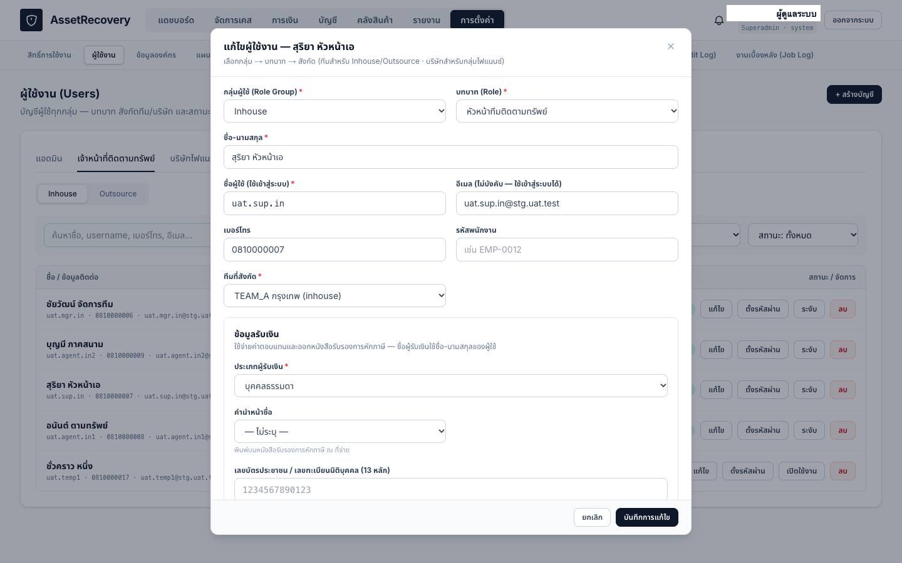

**ผลที่ควรเห็น:** คอลัมน์ **สังกัด** แสดงชื่อทีม

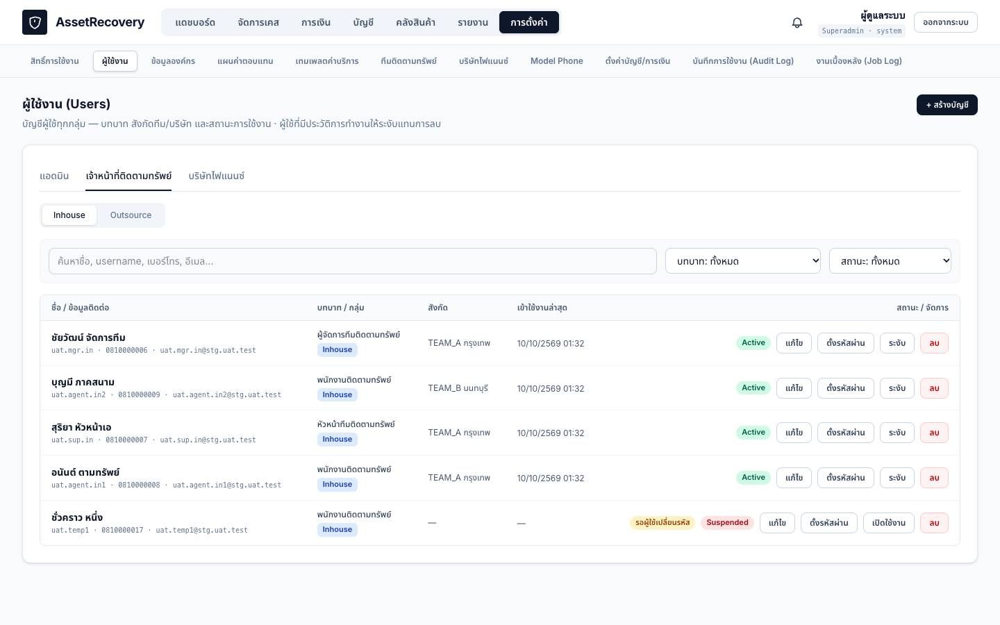

### 11.3 บันทึกข้อมูลรับเงินของพนักงานภาคสนาม

1. กด **แก้ไข** ในแถวของพนักงาน
2. ตรวจ **ทีมที่สังกัด** และกรอก **รหัสพนักงาน**
3. ในส่วน **ข้อมูลรับเงิน** เลือก **ประเภทผู้รับเงิน** · **คำนำหน้าชื่อ** · กรอก **เลขบัตรประชาชน / เลขทะเบียนนิติบุคคล (13 หลัก)** · ที่อยู่ (พิมพ์รหัสไปรษณีย์ ระบบเติมจังหวัด/อำเภอให้)
4. ในส่วน **ข้อมูลบัญชีธนาคาร** เลือก **ธนาคาร** กรอก **ชื่อบัญชี** และ **เลขบัญชี**
5. ที่ **เอกสารยืนยันตัวตน** แตะ **แตะเพื่อเลือกไฟล์เอกสาร** แล้วแนบสำเนาบัตรประชาชน (หรือหนังสือรับรองบริษัท)
6. ติ๊ก **ยืนยันข้อมูลรับเงิน** และกรอก **เหตุผลการแก้ข้อมูลรับเงิน**
7. กด **บันทึกการแก้ไข**

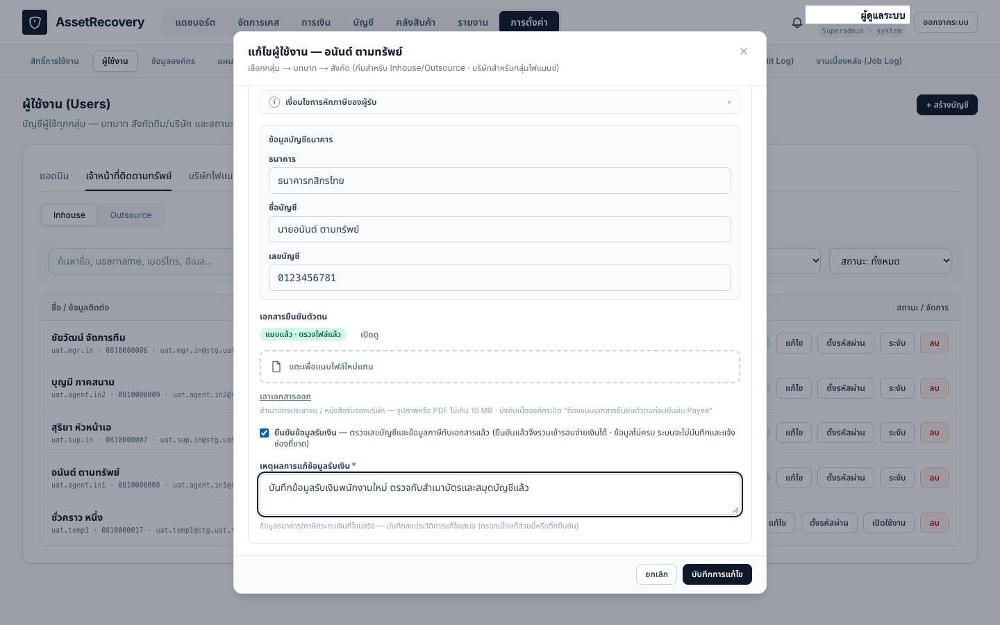

| ช่อง | ตัวอย่าง | บังคับ | หมายเหตุ |
|---|---|---|---|
| ทีมที่สังกัด | TEAM_A กรุงเทพ (inhouse) | บังคับ | เลือกได้ทีมเดียว |
| รหัสพนักงาน | EMP-IN-001 | ไม่บังคับ | |
| ประเภทผู้รับเงิน | บุคคลธรรมดา / นิติบุคคล | บังคับ | |
| คำนำหน้าชื่อ | นาย | ไม่บังคับ | พิมพ์บนหนังสือรับรองการหักภาษี |
| เลขบัตรประชาชน / เลขทะเบียนนิติบุคคล | 1101700123456 (สมมติ) | บังคับเมื่อยืนยัน | 13 หลัก |
| ที่อยู่ | 99/12 หมู่บ้านสุขใจ ซ.ลาดพร้าว 71 · 10230 | บังคับเมื่อยืนยัน | |
| ธนาคาร / ชื่อบัญชี / เลขบัญชี | ธนาคารกสิกรไทย / นายอนันต์ ตามทรัพย์ / 0123456781 | บังคับเมื่อยืนยัน | |
| เอกสารยืนยันตัวตน | สำเนาบัตรประชาชน (รูปหรือ PDF ไม่เกิน 10 MB) | บังคับ | องค์กรตั้งให้ต้องแนบก่อนยืนยัน |
| ยืนยันข้อมูลรับเงิน | ติ๊ก | — | ยืนยันแล้วจึงรวมเข้ารอบจ่ายเงินได้ |
| เหตุผลการแก้ข้อมูลรับเงิน | บันทึกข้อมูลรับเงินพนักงานใหม่ ตรวจกับสำเนาบัตรและสมุดบัญชีแล้ว | บังคับ | |

**ผลที่ควรเห็น:** ข้อความ "บันทึกข้อมูลผู้ใช้แล้ว" และในหน้า **ตั้งค่าบัญชี/การเงิน** › แท็บ **ผู้รับเงิน (Payee)** จะเห็นพนักงานสถานะ **ยืนยันแล้ว**

ตารางผู้รับเงินแสดง ชื่อ · ประเภท · เลขประจำตัวผู้เสียภาษีและที่อยู่ · บัญชีธนาคาร · อัตราภาษีหัก ณ ที่จ่ายที่ใช้ · สถานะ พร้อมผู้ยืนยันและวันที่ยืนยัน

### 11.4 ผู้รับเงินที่เป็นนิติบุคคล

เลือก **ประเภทผู้รับเงิน** = นิติบุคคล แล้วกรอกเลขทะเบียนนิติบุคคล แนบหนังสือรับรองบริษัท

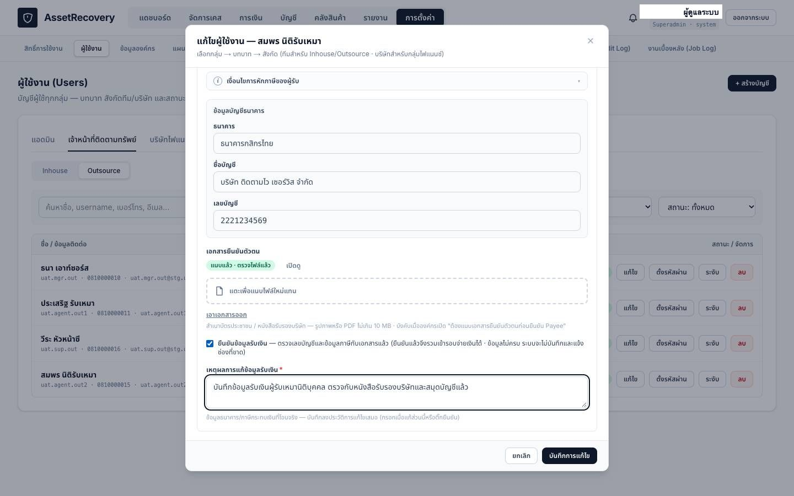

> **ข้อควรระวัง:** ชื่อผู้รับเงินในระบบใช้ **ชื่อ-นามสกุลของผู้ใช้** ถ้าชื่อบัญชีธนาคารเป็นชื่อบริษัท ระบบจะขึ้นป้ายเตือนว่าชื่อบัญชีไม่ตรง (บันทึกได้) — ก่อนเริ่มจ่ายเงินจริงให้ปรึกษาฝ่ายบัญชีว่าจะพิมพ์ชื่อบนหนังสือรับรองการหักภาษีอย่างไร

### 11.5 ผูกผู้ใช้พอร์ทัลกับบริษัทไฟแนนซ์

1. แท็บ **บริษัทไฟแนนซ์** › กด **แก้ไข** ในแถวผู้ใช้
2. เลือก **บริษัทไฟแนนซ์** แล้วกด **บันทึกการแก้ไข**

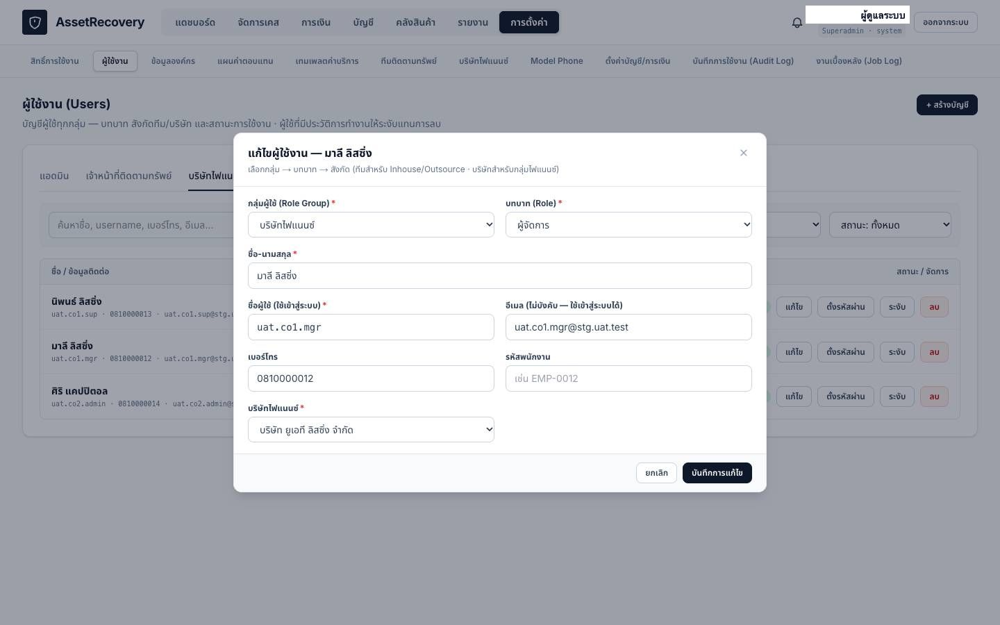

**ผลที่ควรเห็น:** คอลัมน์ **สังกัด** แสดงชื่อบริษัท

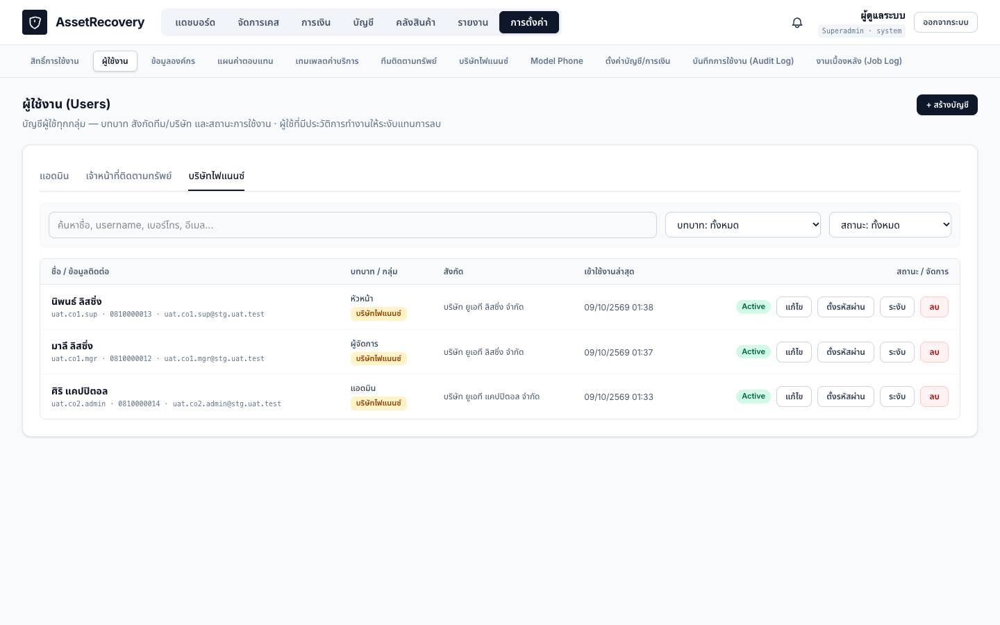

### 11.6 ปุ่มอื่นในรายการผู้ใช้

| ปุ่ม | ใช้เมื่อ |
|---|---|
| **ตั้งรหัสผ่าน** | ผู้ใช้ลืมรหัสผ่าน — ตั้งรหัสใหม่ให้ แล้วผู้ใช้ต้องเปลี่ยนเองตอนเข้าครั้งถัดไป |
| **ระงับ** / **เปิดใช้งาน** | พนักงานลาออกหรือพักงาน — ผู้ใช้ที่ถูกระงับเข้าสู่ระบบไม่ได้ทันที แต่ประวัติยังอยู่ครบ |
| **ลบ** | ลบได้เฉพาะบัญชีที่ยังไม่มีประวัติการทำงาน ถ้ามีเคส/งาน/รายการเงินผูกอยู่ ให้ใช้ **ระงับ** แทน |

**ข้อควรระวัง / เคล็ดลับ (ทั้งบท)**

- **ผู้จัดการที่ดูแลหลายทีม:** เลือก "ทีมที่สังกัด" เป็นทีมหลัก 1 ทีมที่หน้าผู้ใช้ แล้วไปติ๊กชื่อเป็นผู้จัดการในหน้าทีม **ทุกทีม** ที่ดูแล
- ผู้ใช้พอร์ทัลต้อง **ออกจากระบบแล้วเข้าใหม่** หลังผูกบริษัท จึงจะเห็นข้อมูลของบริษัท
- พิมพ์รหัสไปรษณีย์ทีละตัว ระบบจะเติมจังหวัด (และอำเภอถ้ามีอำเภอเดียว) — ถ้าช่องตำบลไม่มีรายการให้เลือก ให้พิมพ์ชื่อตำบลเอง
- **อย่ากดแท็บที่เลือกอยู่แล้วซ้ำ** ถ้าตารางค้างที่ "กำลังโหลดข้อมูล..." ให้กดรีเฟรชหน้าเบราว์เซอร์
- พนักงานภาคสนามไม่มีหน้าแก้ข้อมูลรับเงินของตัวเอง ถ้าข้อมูลเปลี่ยน (เช่น เปลี่ยนบัญชี) ให้แจ้งผู้ดูแลระบบแก้ให้
- เลขบัตรประชาชนและเลขบัญชีเป็นข้อมูลส่วนบุคคล — อย่าถ่ายภาพหน้าจอผู้รับเงินส่งต่อ

---

## บทที่ 12 ฐานรุ่นมือถือ (Model Phone)

**เป้าหมาย:** เตรียมฐานข้อมูลรุ่นมือถือ เพื่อให้ธุรการกรอก IMEI แล้วระบบเติมยี่ห้อ/รุ่นให้อัตโนมัติ

> TAC คือเลข 8 หลักแรกของ IMEI ซึ่งบอกยี่ห้อและรุ่นของเครื่อง ระบบตรวจฐานข้อมูลใหม่ทุกวันหลังเที่ยงคืน

**ขั้นตอน — นำเข้าไฟล์ TAC เอง**

1. **การตั้งค่า** › **Model Phone**
2. กด **นำเข้าไฟล์เอง** แล้วเลือกไฟล์ CSV (คอลัมน์ Brand, TAC, SPECS)
3. สถานะขึ้น "กำลังอัปเดต/รอคิว" — **รอประมาณ 1 นาทีแล้วกดรีเฟรชหน้า**

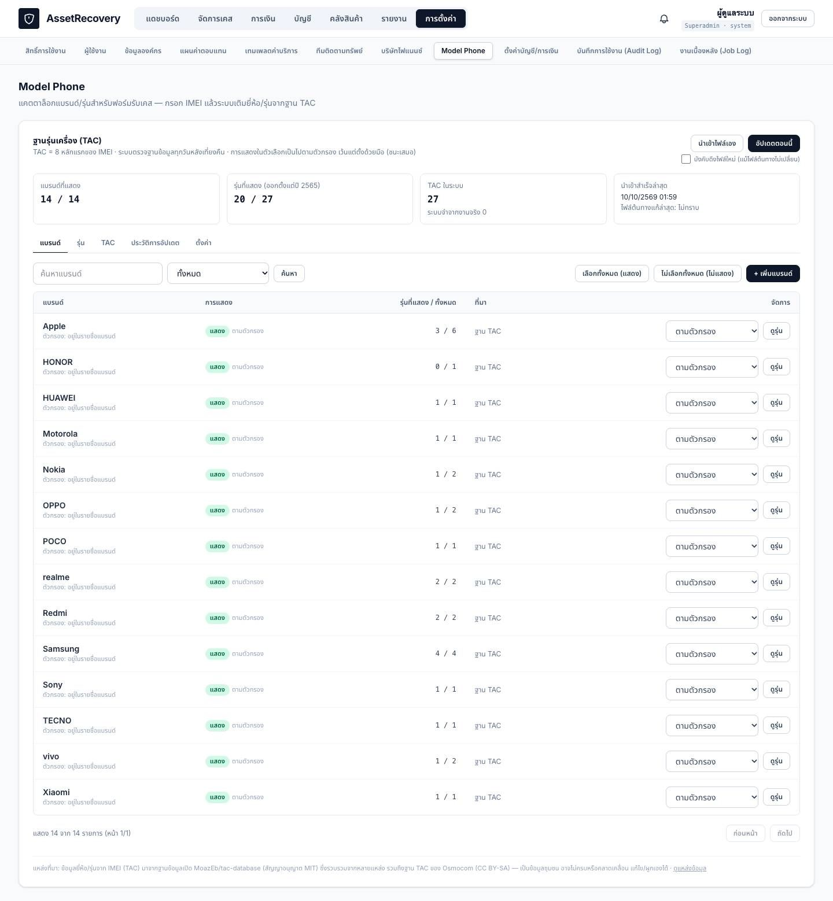

**ผลที่ควรเห็น (หลังรีเฟรช):** การ์ด **แบรนด์ที่แสดง · รุ่นที่แสดง · TAC ในระบบ · นำเข้าสำเร็จล่าสุด** อัปเดตเป็นค่าใหม่ พร้อมวันเวลานำเข้า

ปุ่ม **อัปเดตตอนนี้** ใช้สั่งดึงข้อมูลจากแหล่งข้อมูลกลางทันที (ไม่ต้องรอรอบกลางคืน)

**ขั้นตอน — เพิ่มแบรนด์และรุ่นเอง**

1. กด **+ เพิ่มแบรนด์** พิมพ์ชื่อแบรนด์ (ห้ามซ้ำ) แล้วกด **เพิ่มแบรนด์**
2. กด **ดูรุ่น** ในแถวแบรนด์นั้น › **+ เพิ่มรุ่น**
3. กรอก **ชื่อรุ่น · ประเภท · ปีที่ออก (พ.ศ.)** แล้วกด **เพิ่มรุ่น**

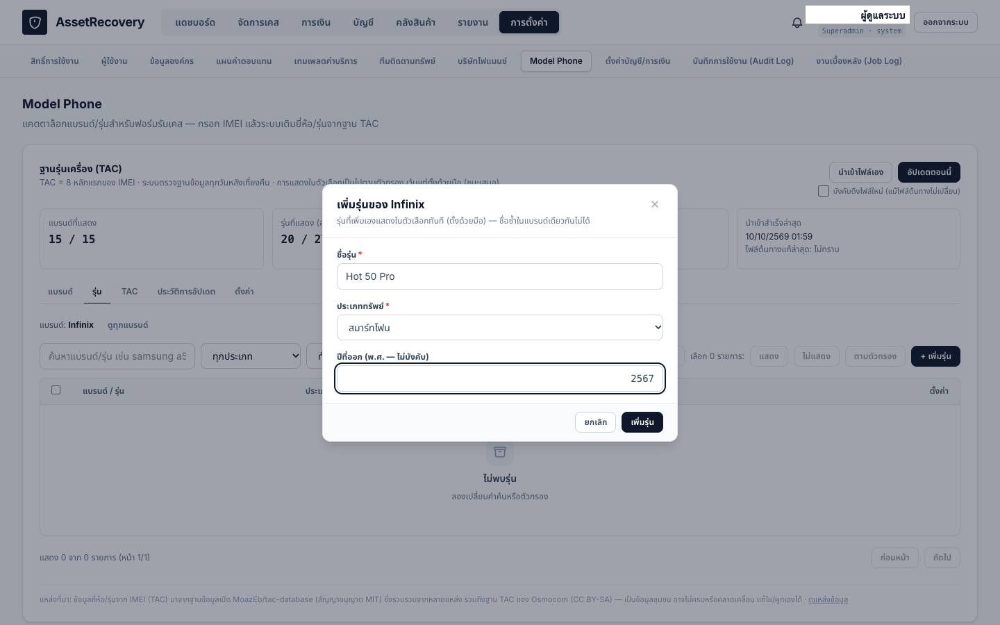

**ผลที่ควรเห็น:** ข้อความ "เพิ่มแบรนด์ … แล้ว" / "เพิ่มรุ่น … แล้ว" และรุ่นใหม่มีป้าย **เพิ่มเอง**

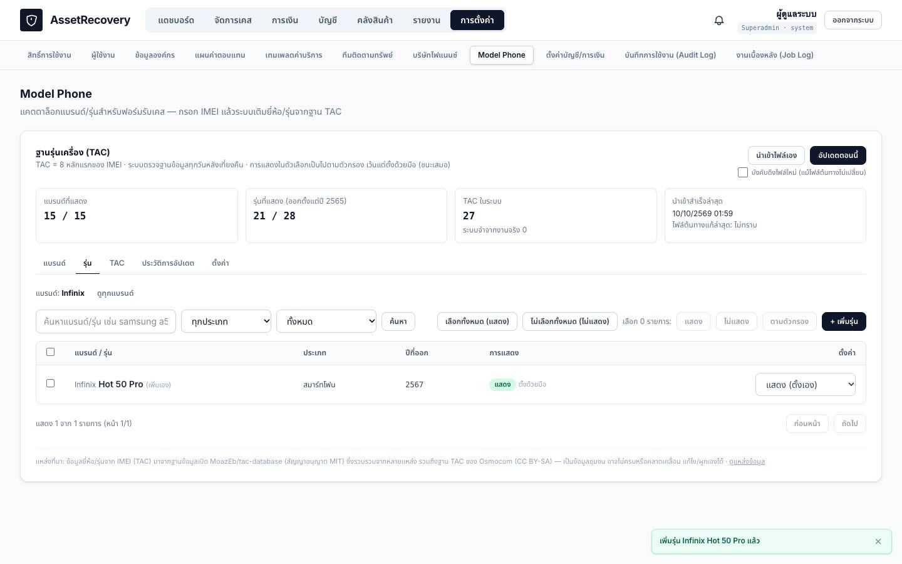

**ข้อควรระวัง / เคล็ดลับ**

- หลังนำเข้าไฟล์ **หน้าไม่อัปเดตเองและไม่มีข้อความแจ้งผล** — ต้องกดรีเฟรชหน้าเพื่อดูผล
- ใช้ตัวเลือก **ตามตัวกรอง / แสดง / ไม่แสดง** ในแต่ละแบรนด์เพื่อซ่อนแบรนด์หรือรุ่นที่ไม่ต้องการให้ธุรการเห็นในรายการ (ค่าที่ตั้งเองชนะเสมอ)
- ถ้าธุรการกรอก IMEI ที่ไม่มีในฐานแล้วพิมพ์รุ่นเอง ระบบจะจำไว้ใช้ครั้งต่อไปให้อัตโนมัติ

---

## บทที่ 13 สิทธิ์การใช้งาน

**เป้าหมาย:** ดูว่าแต่ละบทบาททำอะไรได้ และสร้างบทบาทเพิ่มเมื่อจำเป็น

**ขั้นตอน — ดูสิทธิ์ของบทบาท**

1. **การตั้งค่า** › **สิทธิ์การใช้งาน** (มีแท็บ **แอดมิน · เจ้าหน้าที่ติดตามทรัพย์ · บริษัทไฟแนนซ์**)
2. กด **กำหนดสิทธิ์** ในแถวบทบาทที่ต้องการดู
3. ตรวจสิทธิ์แยกหมวด (ปฏิบัติงาน · การเงิน · บัญชี · บริหาร) แต่ละรายการมี 3 ระดับ: **✅ ทำได้ / 👁️ ดูอย่างเดียว / — ไม่มีสิทธิ์**
4. ถ้าแค่ดู กด **ยกเลิก**

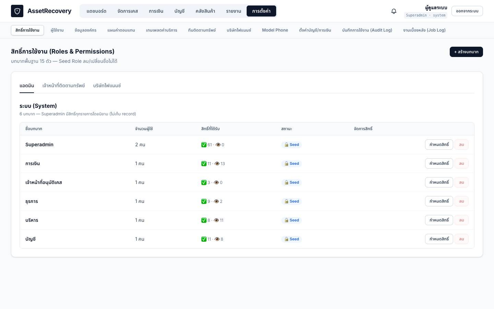

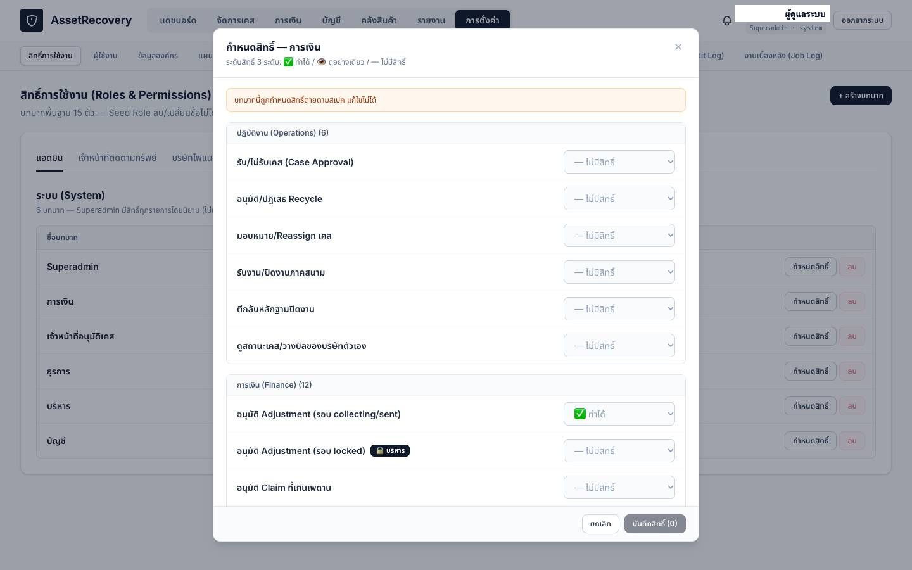

**ดูสิทธิ์ฝั่งบัญชี/การเงินแบบตาราง:** **ตั้งค่าบัญชี/การเงิน** › แท็บ **สิทธิ์บัญชี/การเงิน** แสดงฟังก์ชันทั้งหมดพร้อมบทบาทที่ได้สิทธิ์

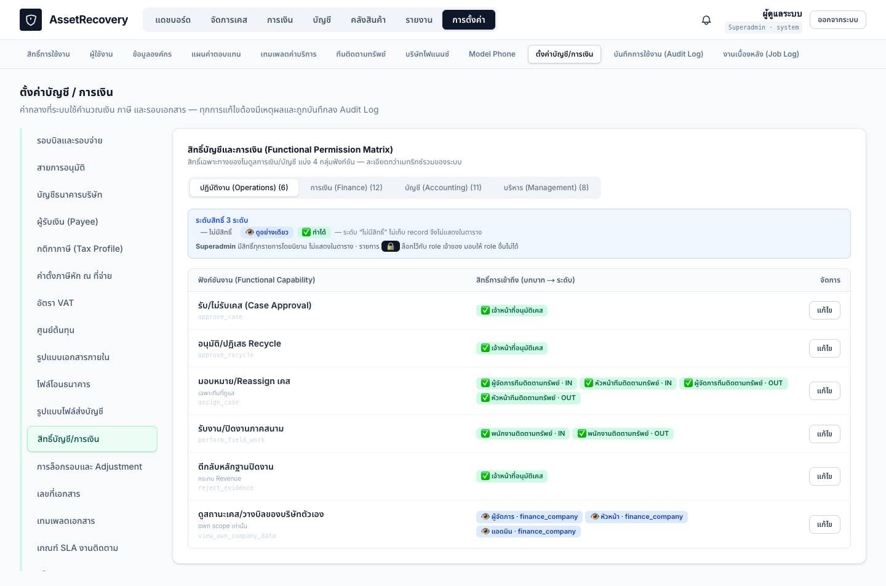

**ข้อควรระวัง / เคล็ดลับ**

- บทบาทพื้นฐาน 15 บทบาท (ป้าย **Seed**) **ลบหรือเปลี่ยนชื่อไม่ได้** และสิทธิ์ถูกกำหนดตายตัว
- รายการที่มีป้าย 🔒 ล็อกกับบทบาทเจ้าของ มอบให้บทบาทอื่นไม่ได้
- Superadmin มีสิทธิ์ทุกรายการโดยอัตโนมัติ
- ถ้าต้องการบทบาทพิเศษ ใช้ปุ่ม **+ สร้างบทบาท** — แนะนำให้ปรึกษาผู้บริหารก่อน เพราะกระทบความปลอดภัยของข้อมูล

---

## บทที่ 14 บันทึกการใช้งาน (Audit Log) และงานเบื้องหลัง (Job Log)

**เป้าหมาย:** ตรวจย้อนหลังว่าใครทำอะไร เมื่อไร และดูแลงานที่ระบบทำให้เบื้องหลัง

> หมายเหตุ: บทนี้เขียนจากหน้าจอปัจจุบันของระบบ ยังไม่มีภาพประกอบจากการทดลองใช้งาน

### 14.1 บันทึกการใช้งาน (Audit Log)

1. **การตั้งค่า** › **บันทึกการใช้งาน (Audit Log)**
2. ใช้ตัวกรอง **เป้าหมาย (Target)** · **ผู้ดำเนินการ** · **ตั้งแต่วันที่ / ถึงวันที่**
3. ตารางแสดง **วันเวลา · ผู้ดำเนินการ · การกระทำ (Action) · เป้าหมาย (Target) · เหตุผล / รายละเอียด**
4. กดที่แถวเพื่อเปิด **รายละเอียดบันทึกการใช้งาน** ซึ่งแสดง **ค่าก่อน / หลัง** ของแต่ละฟิลด์ และที่มาของการเรียก (อุปกรณ์)

- บันทึกนี้ **แก้ไขหรือลบไม่ได้ทุกกรณี** (รวมถึงผู้ดูแลระบบ) และเก็บไว้ 5 ปี
- ถ้าไม่พบรายการ ให้ลองขยายช่วงวันที่ หรือเปลี่ยนเป้าหมาย/การกระทำ

### 14.2 งานเบื้องหลัง (Job Log)

1. **การตั้งค่า** › **งานเบื้องหลัง (Job Log)**
2. กรองด้วย **ประเภทงาน** และ **สถานะ**
3. ตารางแสดง **ประเภทงาน · สถานะ · ผู้สั่งงาน · สร้างเมื่อ · ผลล่าสุด** — กดแถวเพื่อดูรายละเอียด (เริ่มทำเมื่อ · จบเมื่อ · สาเหตุที่ทำงานไม่สำเร็จ · ไฟล์ผลลัพธ์)
4. งานที่ **ล้มเหลว** ระบบจะลองใหม่อัตโนมัติจนครบจำนวนครั้ง ถ้ายังไม่สำเร็จ ให้ตรวจสาเหตุ (เช่น ระบบปลายทางล่มชั่วคราว) แก้ไขแล้วกด **สั่งทำงานใหม่** (ปุ่มนี้มีเฉพาะผู้ดูแลระบบ และเฉพาะงานที่ล้มเหลว/ถูกยกเลิก)

---

## บทที่ 15 ตรวจความพร้อมก่อนเปิดใช้งาน

**เป้าหมาย:** ตรวจว่าตั้งค่าครบก่อนให้ธุรการเริ่มรับเคส

1. กดเมนู **แดชบอร์ด** — เมื่อยังไม่มีเคส การ์ดตัวเลขจะเป็นศูนย์ และแสดง "ไม่มีงานค้าง"
2. ตรวจรายการด้านล่างให้ครบ

**รายการตรวจ**

- [ ] ข้อมูลองค์กรครบ (ชื่อ เลขผู้เสียภาษี ที่อยู่ โลโก้ ลายเซ็น)
- [ ] รูปแบบไฟล์โอนเงินและ statement **ทดสอบผ่าน**
- [ ] บัญชีธนาคารบริษัทอย่างน้อย 1 บัญชี ตั้งเป็นบัญชีหลัก
- [ ] แผนค่าตอบแทนครบทุกฝั่ง (Inhouse / Outsource)
- [ ] เทมเพลตค่าบริการครบตามสัญญาลูกค้า
- [ ] รอบวางบิล AR และรอบจ่าย AP
- [ ] บริษัทไฟแนนซ์ทุกราย + เอกสารบริษัท (หนังสือรับรอง · ภ.พ.20)
- [ ] ทีมทุกทีมมีแผน ผู้จัดการ และจังหวัดที่ดูแล — ทุกจังหวัดที่รับงานมีทีมรองรับ
- [ ] ผู้ใช้ทุกคนมีบทบาทและสังกัดถูกต้อง
- [ ] พนักงานที่รับเงินมีข้อมูลรับเงินสถานะ **ยืนยันแล้ว**
- [ ] ผู้ใช้พอร์ทัลผูกบริษัทแล้ว
- [ ] ฐานรุ่นมือถือ (Model Phone) นำเข้าแล้ว
- [ ] ปฏิทินวันหยุดปีปัจจุบันครบ
- [ ] แจ้งฝ่ายบัญชีให้ตรวจหน้า **ค่าตั้งรอนักบัญชียืนยัน**

---

## ภาคผนวก ก คำศัพท์

| คำ | ความหมาย |
|---|---|
| Superadmin / ผู้ดูแลระบบ | ผู้มีสิทธิ์สูงสุด ตั้งค่าได้ทุกหน้า |
| บทบาท (Role) | กลุ่มสิทธิ์ของผู้ใช้ เช่น ธุรการ การเงิน หัวหน้าทีม |
| Inhouse / Outsource | ทีมใน (พนักงานบริษัท) / ทีมนอก (ผู้รับเหมา) |
| แผนค่าตอบแทน | อัตราที่บริษัท **จ่าย** ให้ทีมติดตาม (ค่าน้ำมัน เบี้ยเลี้ยง คอมมิชชั่น ฯลฯ) |
| เทมเพลตค่าบริการ | อัตราที่บริษัท **เก็บ** จากบริษัทไฟแนนซ์ |
| คอมมิชชั่น | เงินที่พนักงานได้เมื่อปิดเคสสำเร็จ |
| เบี้ยเสี่ยง | เงินที่พนักงานได้เมื่อปิดเคสไม่สำเร็จ |
| Success Fee / Flat Rate / Hybrid | ค่าบริการแบบ % ของมูลหนี้ / แบบเหมา / แบบเหมา + % |
| รอบวางบิล (AR) | รอบตัดยอดเรียกเก็บเงินจากบริษัทไฟแนนซ์ |
| รอบจ่าย (AP) | รอบตัดยอดจ่ายค่าตอบแทนพนักงาน |
| Net 30 | ครบกำหนดชำระ 30 วันนับจากวันตัดรอบ |
| ภาษีหัก ณ ที่จ่าย (WHT) | ภาษีที่หักไว้ก่อนจ่ายเงิน |
| กติกาภาษี (Tax Profile) | ชุดอัตราภาษีหัก ณ ที่จ่ายตามประเภทผู้รับ |
| ผู้รับเงิน (Payee) | ผู้ที่บริษัทจ่ายเงินให้ (พนักงาน/ผู้รับเหมา) พร้อมข้อมูลบัญชีและภาษี |
| ภ.พ.20 | ใบทะเบียนภาษีมูลค่าเพิ่ม |
| statement | ไฟล์รายการเดินบัญชีจากธนาคาร ใช้กระทบยอด |
| IMEI / TAC | เลขประจำเครื่องมือถือ 15 หลัก / 8 หลักแรกของ IMEI ที่บอกยี่ห้อรุ่น |
| เวอร์ชัน | ทุกครั้งที่แก้แผน/เทมเพลต/เอกสาร ระบบเก็บเป็นเวอร์ชันใหม่ ของเดิมไม่หาย |
| พอร์ทัล | หน้าสำหรับบริษัทไฟแนนซ์เข้ามาดูสถานะเคสของตัวเอง (ดูอย่างเดียว) |

## ภาคผนวก ข คำถามที่พบบ่อย

**ถาม: แก้อัตราในแผนค่าตอบแทนแล้ว เคสเก่าจะเปลี่ยนตามไหม**
ตอบ: ไม่เปลี่ยน ระบบสร้างเวอร์ชันใหม่ เคสที่เกิดก่อนหน้ายังใช้อัตราเดิม

**ถาม: ทำไมฟอร์มบริษัทไฟแนนซ์เลือกรอบบิลไม่ได้**
ตอบ: ยังไม่ได้สร้างรอบวางบิล AR (บทที่ 8) หรือรอบที่มีอยู่ตั้งเป็น "บริษัทไฟแนนซ์ทุกราย" ซึ่งระบบเลือกให้อัตโนมัติ (ช่องเป็นสีเทา)

**ถาม: ผู้จัดการคนเดียวดูแล 2 ทีมได้ไหม**
ตอบ: ได้ ตั้งทีมหลักที่หน้าผู้ใช้ 1 ทีม แล้วติ๊กชื่อเป็นผู้จัดการในหน้าทีมทุกทีมที่ดูแล

**ถาม: ตารางผู้ใช้ค้าง "กำลังโหลดข้อมูล..."**
ตอบ: กดรีเฟรชหน้าเบราว์เซอร์ และหลีกเลี่ยงการกดแท็บที่เลือกอยู่แล้วซ้ำ

**ถาม: นำเข้าไฟล์ TAC แล้วตัวเลขไม่เปลี่ยน**
ตอบ: รอประมาณ 1 นาทีแล้วรีเฟรชหน้า ดูวันเวลาในการ์ด "นำเข้าสำเร็จล่าสุด"

**ถาม: ผู้ใช้พอร์ทัลเข้าแล้วไม่เห็นข้อมูลบริษัท**
ตอบ: ตรวจว่าผูกบริษัทแล้ว แล้วให้ผู้ใช้ออกจากระบบและเข้าใหม่

**ถาม: พนักงานลาออก ลบบัญชีได้ไหม**
ตอบ: ถ้ามีประวัติงานหรือรายการเงินแล้ว ลบไม่ได้ ให้กด **ระงับ** แทน

**ถาม: ทำไมจ่ายเงินพนักงานบางคนไม่ได้**
ตอบ: ข้อมูลรับเงินยังไม่ได้ติ๊ก **ยืนยันข้อมูลรับเงิน** หรือยังไม่แนบเอกสารยืนยันตัวตน

**ถาม: VAT เปลี่ยนอัตรา ต้องทำอย่างไร**
ตอบ: แท็บ **อัตรา VAT** เพิ่มแถวใหม่พร้อมวันที่มีผล ห้ามแก้แถวเดิม

## ภาคผนวก ค สถานะและป้ายที่จะเห็น

| ป้าย | ที่ไหน | ความหมาย |
|---|---|---|
| รอนักบัญชียืนยัน | แท็บตั้งค่าการเงิน/ภาษี | ใช้ค่านี้ไปก่อน รอสำนักงานบัญชียืนยัน |
| ยังไม่ทดสอบ / ทดสอบผ่าน | รูปแบบไฟล์ธนาคาร | ต้อง "ทดสอบผ่าน" ก่อนใช้สร้างไฟล์โอนจริง |
| บัญชีหลัก | บัญชีธนาคารบริษัท | บัญชีที่ระบบเลือกเป็นค่าเริ่มต้น |
| ใช้งาน / ปิดใช้งาน | แผน · เทมเพลต · รอบ · รูปแบบไฟล์ | ปิดใช้งานแล้วเลือกใช้กับรายการใหม่ไม่ได้ |
| v1, v2 … | แผน · เทมเพลต · เอกสารบริษัท | เวอร์ชันของข้อมูล |
| เอกสารบริษัทยังไม่ครบ | การ์ดบริษัทไฟแนนซ์ | ยังไม่มีหนังสือรับรอง และ/หรือ ภ.พ.20 (เตือนเท่านั้น) |
| Active / Suspended | ผู้ใช้ · บริษัท | ใช้งานได้ / ถูกระงับ |
| รอผู้ใช้เปลี่ยนรหัส | ผู้ใช้ | ผู้ใช้ยังไม่ได้เปลี่ยนรหัสผ่านเริ่มต้น |
| ยืนยันแล้ว | ผู้รับเงิน (Payee) | ข้อมูลรับเงินตรวจแล้ว รวมเข้ารอบจ่ายได้ |
| แนบแล้ว · ตรวจไฟล์แล้ว | เอกสารยืนยันตัวตน | แนบเอกสารแล้ว |
| ชื่อบัญชีไม่ตรง | ข้อมูลรับเงิน | ชื่อบัญชีธนาคารไม่ตรงกับชื่อผู้รับเงิน (เตือนเท่านั้น) |
| Seed | สิทธิ์การใช้งาน | บทบาทพื้นฐาน ลบ/เปลี่ยนชื่อไม่ได้ |
| 🔒 | สิทธิ์การใช้งาน | สิทธิ์ล็อกกับบทบาทเจ้าของ |
| เพิ่มเอง / ฐาน TAC | Model Phone | รุ่นที่ผู้ดูแลเพิ่มเอง / มาจากฐานข้อมูลกลาง |
| กำลังอัปเดต/รอคิว | Model Phone | กำลังนำเข้าข้อมูล — รีเฟรชหน้าเพื่อดูผล |
