# คู่มือรับเคสและอนุมัติเคส — ธุรการ + เจ้าหน้าที่อนุมัติเคส — AssetRecovery

> เล่ม 2 · รับเคสจากบริษัทไฟแนนซ์ → ส่งตรวจ → อนุมัติ/ขอข้อมูลเพิ่ม/ปฏิเสธ → ตรวจหลักฐานปิดงาน → รีไซเคิล
> ภาพหน้าจอในเล่มนี้ถ่ายจากการทดลองใช้งานจริง ข้อมูลในภาพ (ชื่อลูกหนี้ เลขบัตร เบอร์โทร IMEI) เป็นข้อมูลสมมติทั้งหมด

---

## ใครใช้เล่มนี้

| บทบาท | งานหลักในเล่มนี้ |
|---|---|
| **ธุรการ** | รับเคสจากบริษัทไฟแนนซ์ (กรอกมือ / นำเข้าไฟล์) · แนบเอกสาร · ส่งตรวจสอบเคส · แก้เคสที่ถูกขอข้อมูลเพิ่ม · ค้นหา/ดูเคส |
| **เจ้าหน้าที่อนุมัติเคส** | พิจารณาเคส: รับเคส & ยืนยันทีม / เปลี่ยนทีม / ขอข้อมูลเพิ่ม / ไม่รับเคส · ตีกลับหลักฐานปิดงาน · ขอและอนุมัติรีไซเคิล (ติดตามรอบใหม่) |

## ทำอะไรได้บ้าง (โดยย่อ)

| งาน | ธุรการ | เจ้าหน้าที่อนุมัติเคส |
|---|---|---|
| สร้างเคส (กรอกมือ / Import ไฟล์) | ✅ | — |
| แก้ไขเคส แนบ/ลบเอกสาร | ✅ (ก่อนรับเคส) | — |
| ส่งตรวจสอบเคส | ✅ | — |
| รับเคส / ขอข้อมูลเพิ่ม / ไม่รับเคส / เปลี่ยนทีม | ดูได้อย่างเดียว | ✅ |
| ตีกลับหลักฐานปิดงาน | — | ✅ |
| ขอรีไซเคิล / อนุมัติรีไซเคิล | — | ✅ |
| ค้นหาและดูรายละเอียดเคส | ✅ | ✅ |

> ธุรการยังมีงานด้านคลังสินค้า (รับเครื่องเข้าคลัง / ใบส่งมอบ) ซึ่งอยู่ในคู่มือเล่มคลัง/ส่งมอบ

## เข้าสู่ระบบ

1. เปิด `https://<โดเมนระบบ>/login`
2. กรอก **อีเมล หรือ username** และรหัสผ่าน แล้วกด **เข้าสู่ระบบ** (เข้าครั้งแรกระบบจะให้ตั้งรหัสผ่านใหม่)
3. ระบบเปิดหน้า **แดชบอร์ด** — งานทั้งหมดในเล่มนี้อยู่ที่เมนู **จัดการเคส** › แท็บ **รับเคส**

> **คอมพิวเตอร์ / มือถือ:** งานในเล่มนี้ออกแบบให้ทำบนคอมพิวเตอร์ (ฟอร์มยาว ตารางกว้าง และต้องแนบไฟล์) แนะนำให้ใช้คอมพิวเตอร์ทุกขั้นตอน ภาพในเล่มถ่ายจากคอมพิวเตอร์

## ผังงานของบทบาทนี้

ดูผังภาพรวมงานได้ที่ [ผังงานราย role — 2. ธุรการ + เจ้าหน้าที่อนุมัติเคส](../diagrams/03-role-flowcharts.md#2-ธุรการ--เจ้าหน้าที่อนุมัติเคส)
วิธีอ่านสัญลักษณ์ในผังดูที่ [README ของผัง](../diagrams/README.md)

**เส้นทางของเคสโดยย่อ**

```
ร่าง ──ส่งตรวจสอบเคส──▶ รอพิจารณา ──รับเคส & ยืนยันทีม──▶ รับเคสแล้ว ──▶ (ทีมติดตามลงพื้นที่) ──▶ ปิดงานสำเร็จ / ปิดงานไม่สำเร็จ
  ▲                         │  │
  └──กลับไปแก้ไขเป็นร่าง── ขอข้อมูลเพิ่ม │
                               └──ไม่รับเคส (จบ)
ปิดงานไม่สำเร็จ ──ขอรีไซเคิล──▶ รออนุมัติรีไซเคิล ──อนุมัติ──▶ รับเคสแล้ว (รอบที่ 2)
```

---

## สารบัญ

**ส่วนที่ 1 — ธุรการ**
- [บทที่ 1 แดชบอร์ดและหน้ารับเคส](#บทที่-1-แดชบอร์ดและหน้ารับเคส)
- [บทที่ 2 รับเคสแบบกรอกมือ](#บทที่-2-รับเคสแบบกรอกมือ)
- [บทที่ 3 รับเคสแบบนำเข้าไฟล์ (Import)](#บทที่-3-รับเคสแบบนำเข้าไฟล์-import)
- [บทที่ 4 แนบเอกสารให้เคสที่นำเข้า (3 แบบ)](#บทที่-4-แนบเอกสารให้เคสที่นำเข้า-3-แบบ)
- [บทที่ 5 ส่งตรวจสอบเคส](#บทที่-5-ส่งตรวจสอบเคส)
- [บทที่ 6 แก้เคสที่ถูกขอข้อมูลเพิ่มแล้วส่งใหม่](#บทที่-6-แก้เคสที่ถูกขอข้อมูลเพิ่มแล้วส่งใหม่)

**ส่วนที่ 2 — เจ้าหน้าที่อนุมัติเคส**
- [บทที่ 7 คิวงานรอพิจารณา](#บทที่-7-คิวงานรอพิจารณา)
- [บทที่ 8 พิจารณาและรับเคส](#บทที่-8-พิจารณาและรับเคส)
- [บทที่ 9 รับเคสโดยเปลี่ยนทีม](#บทที่-9-รับเคสโดยเปลี่ยนทีม)
- [บทที่ 10 ขอข้อมูลเพิ่ม](#บทที่-10-ขอข้อมูลเพิ่ม)
- [บทที่ 11 ไม่รับเคส](#บทที่-11-ไม่รับเคส)
- [บทที่ 12 ตรวจและตีกลับหลักฐานปิดงาน](#บทที่-12-ตรวจและตีกลับหลักฐานปิดงาน)
- [บทที่ 13 รีไซเคิล — ขอติดตามรอบใหม่และอนุมัติ](#บทที่-13-รีไซเคิล--ขอติดตามรอบใหม่และอนุมัติ)

**ส่วนที่ 3 — ใช้ร่วมกัน**
- [บทที่ 14 ค้นหา กรอง และดูรายละเอียดเคส](#บทที่-14-ค้นหา-กรอง-และดูรายละเอียดเคส)
- [ภาคผนวก ก คำศัพท์](#ภาคผนวก-ก-คำศัพท์)
- [ภาคผนวก ข คำถามที่พบบ่อย](#ภาคผนวก-ข-คำถามที่พบบ่อย)
- [ภาคผนวก ค สถานะเคสและความหมาย](#ภาคผนวก-ค-สถานะเคสและความหมาย)

---

# ส่วนที่ 1 — ธุรการ

## บทที่ 1 แดชบอร์ดและหน้ารับเคส

**เป้าหมาย:** ดูงานค้างก่อนเริ่มงานแต่ละวัน และรู้จักหน้ารับเคส

**ขั้นตอน**

1. เข้าสู่ระบบ ระบบเปิดหน้า **แดชบอร์ด**
2. ดูการ์ดงานค้าง 4 ใบ: **เคสร่างที่ยังไม่ส่งพิจารณา · เคสที่ขอข้อมูลเพิ่ม · เครื่องรอรับเข้าคลัง · ใบส่งมอบที่ยังไม่ยืนยัน** กดการ์ดที่มีตัวเลขเพื่อไปยังคิวงานนั้นได้ทันที
3. กดเมนู **จัดการเคส** ที่แถบบน ระบบเปิดแท็บ **รับเคส**

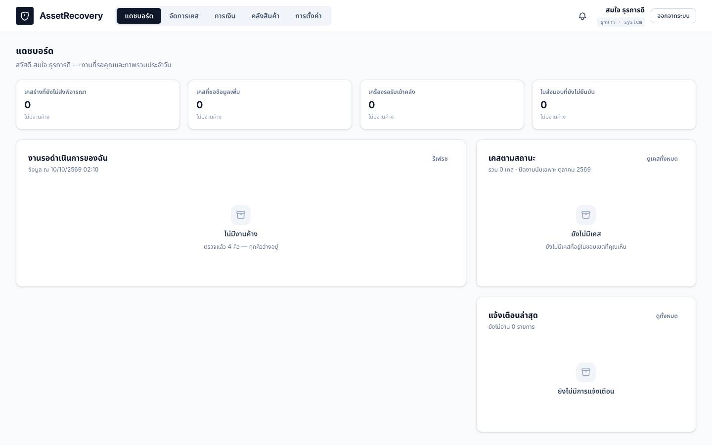

หน้า **รับเคส (Case Submission)** ประกอบด้วย

- ปุ่ม **Import ไฟล์** และ **+ รับเคส (กรอกมือ)** มุมขวาบน
- การ์ดนับจำนวน **ร่าง · รอพิจารณา · ขอข้อมูลเพิ่ม · รับเคสแล้ว**
- ช่องค้นหาและตัวกรอง **สถานะ · ช่องทาง · ไฟแนนซ์ · จังหวัด**
- ตารางเคส: เลขที่สัญญา/รอบ · ไฟแนนซ์/ช่องทาง · ลูกหนี้/จังหวัด · ทรัพย์ · มูลหนี้คงเหลือ · ทีมที่เสนอ · สร้าง/ส่งตรวจ/พิจารณา · สถานะ · จัดการ

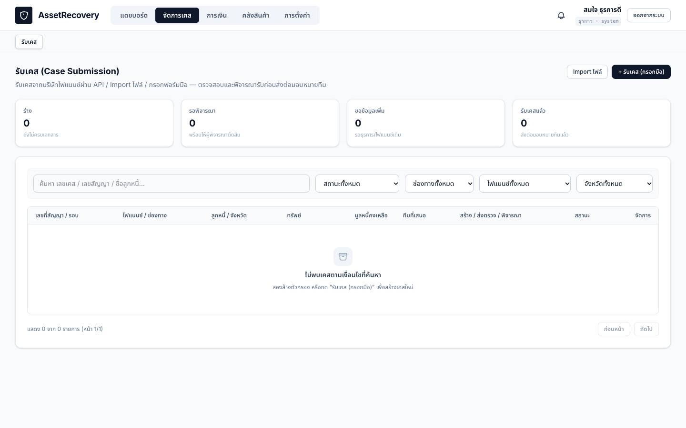

---

## บทที่ 2 รับเคสแบบกรอกมือ

**เป้าหมาย:** สร้างเคสใหม่ทีละเคสจากข้อมูลที่บริษัทไฟแนนซ์ส่งมา

**ก่อนเริ่ม:** เตรียมข้อมูลสัญญา ข้อมูลลูกหนี้ ที่อยู่ ข้อมูลเครื่อง (IMEI) และไฟล์เอกสาร — **สัญญาเช่าซื้อ (PDF) · สำเนาบัตรประชาชนลูกหนี้ · รูปสินค้า**

### 2.1 ข้อมูลสัญญาและลูกหนี้

1. กด **+ รับเคส (กรอกมือ)**
2. เลือก **บริษัทไฟแนนซ์** และกรอก **เลขที่สัญญา**
3. กรอก **ชื่อ-นามสกุล** เลือก **สัญชาติ** และกรอก **เลขบัตรประชาชน** (สัญชาติอื่นใช้เลข Passport)
4. กรอก **เบอร์โทรมือถือ** (และ เบอร์โทรที่ทำงาน · LINE ID · Facebook ถ้ามี)

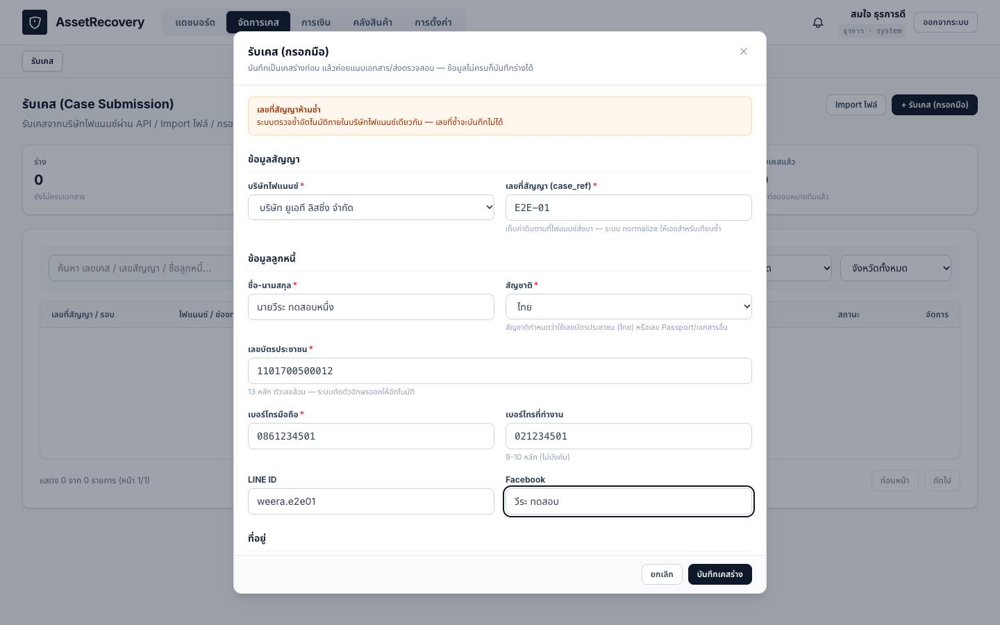

### 2.2 ที่อยู่

1. กรอก **บ้านเลขที่ / หมู่บ้าน / ถนน** ของ **ที่อยู่ปัจจุบัน**
2. พิมพ์ **รหัสไปรษณีย์** 5 หลัก แล้วเลือกตำบล/แขวงจากรายการที่ระบบแสดง ระบบจะเติมจังหวัด/อำเภอ/ตำบลให้
3. ทำซ้ำกับ **ที่อยู่ตามบัตรประชาชน** (ที่อยู่ที่ทำงานไม่บังคับ)

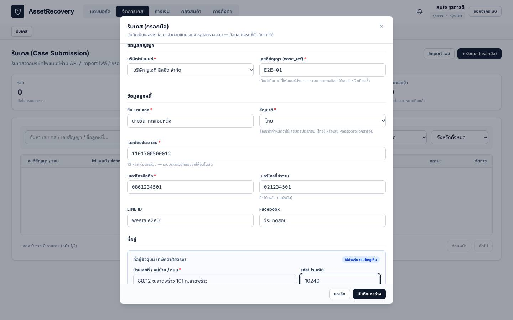

> **สำคัญ:** จังหวัดของ **ที่อยู่ปัจจุบัน** คือสิ่งที่ระบบใช้เลือกทีมติดตาม — กรอกให้ถูกต้อง

### 2.3 ผู้ติดต่ออื่นและข้อมูลทรัพย์

1. (ถ้ามี) กด **+ เพิ่มผู้ติดต่อ** แล้วกรอกชื่อ ความสัมพันธ์ เบอร์โทร
2. เลือก **ประเภททรัพย์** เช่น สมาร์ทโฟน
3. กรอก **IMEI / Serial Number** — ถ้าเป็น IMEI ที่มีในฐานข้อมูล ระบบจะเติม **ยี่ห้อ/รุ่นเครื่อง** ให้ พร้อมข้อความ "พบจาก IMEI … — แก้ได้ถ้าไม่ตรง"
4. เลือก **ความจุ** และ **สี** (มีตัวเลือก "ไม่ระบุในสัญญา") และกรอก **มูลหนี้คงเหลือ (บาท)**

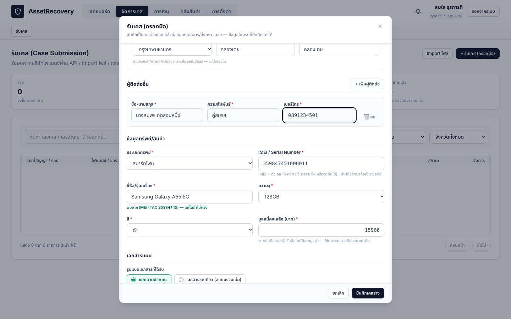

**ถ้า IMEI ไม่อยู่ในฐานข้อมูล:** ช่องรุ่นจะขึ้นว่า "ไม่พบรุ่นจาก IMEI นี้ — เลือกจากรายการหรือระบุเอง" ให้พิมพ์ชื่อรุ่น แล้วเลือก **ไม่พบในรายการ — ระบุเอง** ระบบจะจำไว้ใช้ครั้งต่อไป

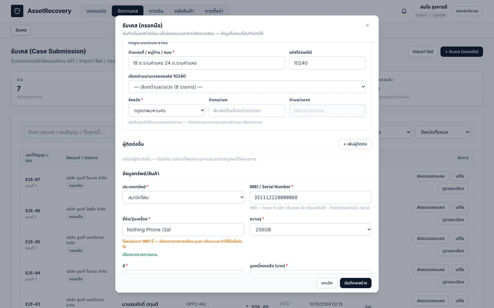

### 2.4 เอกสารแนบ

1. **รูปแบบเอกสารที่ได้รับ**: เลือก **แยกตามประเภท** (หรือ **เอกสารชุดเดียว (สแกนรวมเล่ม)** ถ้าได้รับเป็นไฟล์เดียว — ดูบทที่ 4)
2. **สัญญาเช่าซื้อ/สัญญาผ่อนชำระ**: กด **เลือกไฟล์**
3. **บัตรประชาชน/Passport ลูกหนี้**: กด **เลือกไฟล์** (แนบหน้า-หลังได้หลายไฟล์)
4. **รูปสินค้า**: ลากรูปมาวาง หรือกด **เลือกรูปสินค้า** (สูงสุด 8 รูป)

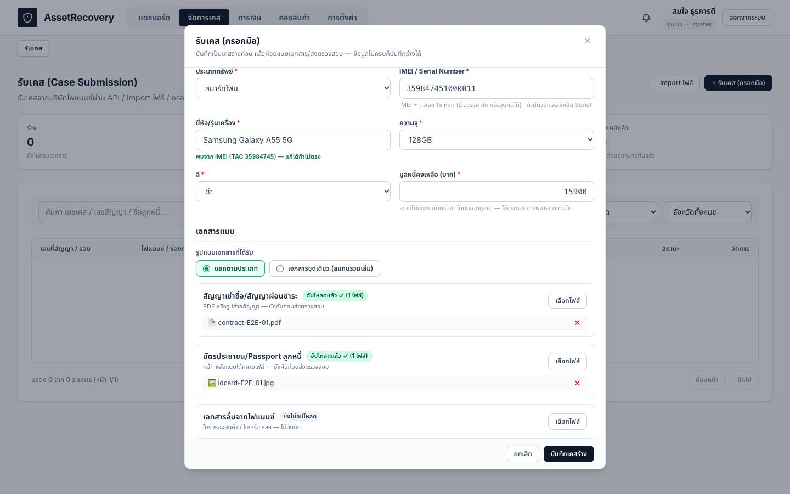

### 2.5 ตรวจทีมที่เสนอและบันทึก

1. ดูกล่อง **ทีมที่เสนอ** ด้านล่างฟอร์ม — แสดงทีมตามจังหวัดพร้อมค่าใช้จ่ายตามแผนของทีม
2. กด **บันทึกเคสร่าง** แล้วรอ 4–10 วินาที (ระบบกำลังอัปโหลดไฟล์) **อย่ากดซ้ำ**

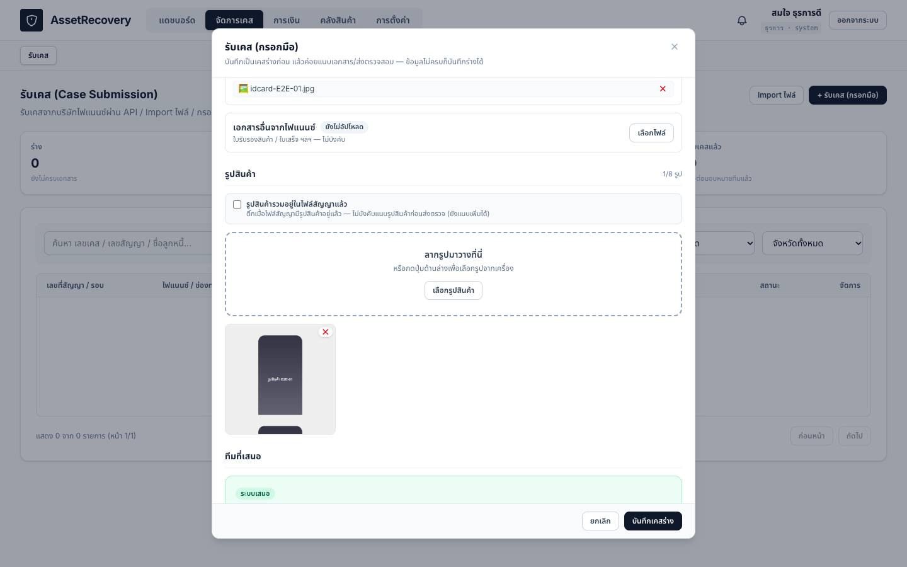

**ผลที่ควรเห็น:** ข้อความ "สร้างเคสร่างแล้ว …" ฟอร์มปิด และมีแถวใหม่สถานะ **ร่าง** พร้อมจำนวนเอกสารแนบ

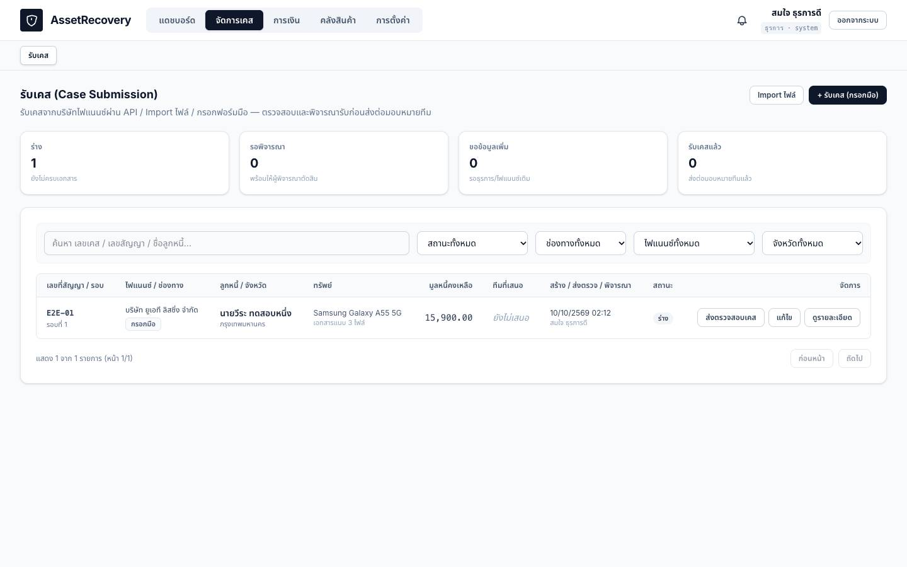

### ตารางช่องที่ต้องกรอก

| ช่อง | ตัวอย่าง | บังคับ | หมายเหตุ |
|---|---|---|---|
| บริษัทไฟแนนซ์ | บริษัท ยูเอที ลิสซิ่ง จำกัด | บังคับ | |
| เลขที่สัญญา | E2E-01 | บังคับ | ห้ามซ้ำในบริษัทเดียวกัน (ไม่สนตัวพิมพ์เล็ก/ใหญ่และช่องว่าง) |
| ชื่อ-นามสกุล | นายวีระ ทดสอบหนึ่ง | บังคับ | |
| สัญชาติ | ไทย | บังคับ | ไทย = เลขบัตรประชาชน / อื่น ๆ = เลข Passport |
| เลขบัตรประชาชน | 13 หลัก | บังคับ | ระบบตัดตัวอักษรอื่นออกให้ |
| เบอร์โทรมือถือ | 0861234501 | บังคับ | 10 หลัก |
| เบอร์โทรที่ทำงาน / LINE ID / Facebook | 021234501 | ไม่บังคับ | |
| ที่อยู่ปัจจุบัน (บ้านเลขที่/ถนน · จังหวัด) | 88/12 ซ.ลาดพร้าว 101 · กรุงเทพมหานคร | บังคับ | ใช้เสนอทีม |
| รหัสไปรษณีย์ | 10240 | ไม่บังคับ | ช่วยเติมจังหวัด/อำเภอ/ตำบล |
| ที่อยู่ตามบัตรประชาชน | 12 หมู่ 4 ถ.สุขุมวิท · 10110 | บังคับ | |
| ผู้ติดต่ออื่น | นางสมพร ทดสอบหนึ่ง · คู่สมรส · 0891234501 | ไม่บังคับ | |
| ประเภททรัพย์ | สมาร์ทโฟน | บังคับ | |
| IMEI / Serial Number | 359847451000011 | บังคับ | IMEI = ตัวเลข 15 หลัก คั่นด้วยเว้นวรรค ขีด หรือจุดได้ |
| ยี่ห้อ/รุ่นเครื่อง | Samsung Galaxy A55 5G | บังคับ | เติมอัตโนมัติจาก IMEI แก้ได้ |
| ความจุ / สี | 128GB / ดำ | บังคับ | มี "ไม่ระบุในสัญญา" |
| มูลหนี้คงเหลือ (บาท) | 15900 | บังคับ | |
| สัญญาเช่าซื้อ | ไฟล์ PDF | บังคับก่อนส่งตรวจ | |
| บัตรประชาชน/Passport ลูกหนี้ | ไฟล์รูป | บังคับก่อนส่งตรวจ | |
| รูปสินค้า | ไฟล์รูป (สูงสุด 8) | บังคับก่อนส่งตรวจ | ยกเว้นติ๊ก "รูปสินค้ารวมอยู่ในไฟล์สัญญาแล้ว" |

### ข้อควรระวัง / เคล็ดลับ

- **บันทึกร่างได้แม้ข้อมูลยังไม่ครบ** ความครบถ้วนจะถูกตรวจตอนกด **ส่งตรวจสอบเคส**
- **IMEI ต้องเป็นตัวเลข 15 หลักพอดี** ถ้าใส่ 14 หรือ 16 หลัก ระบบจะไม่บันทึกและแสดงข้อความใต้ช่อง "IMEI ต้องเป็นตัวเลข 15 หลัก…" — ข้อความนี้จะเห็น **ตอนกดบันทึก** ไม่ใช่ขณะพิมพ์ ให้นับหลักให้ครบก่อนกด

  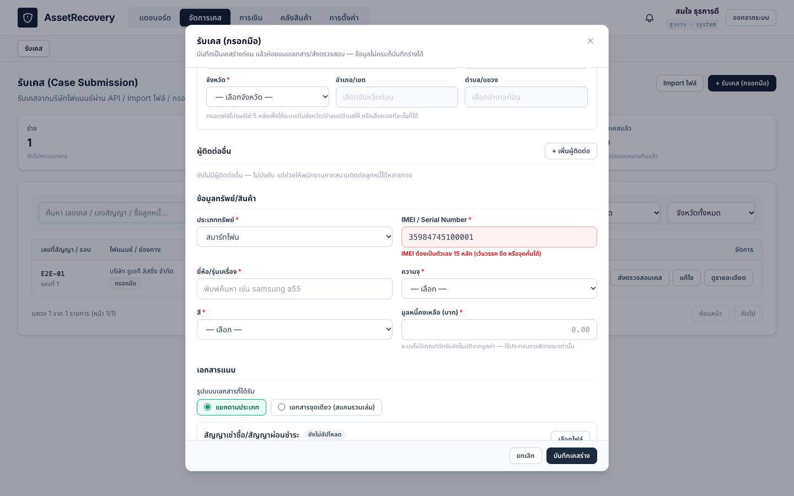

- ถ้าพิมพ์ตัวอักษรที่หน้าตาคล้ายตัวเลขปน (เช่น ตัว O แทนเลข 0) ระบบจะเตือนสีส้ม "ดูเหมือน IMEI ที่มีตัวอักษรปน — ตรวจอีกครั้ง" ถ้าเป็น Serial Number จริงก็บันทึกต่อได้
- **เลขที่สัญญาซ้ำ** จะรู้ตอนกดบันทึก (อาจรอประมาณ 20 วินาที) ระบบขึ้นกล่องแดง "เลขที่สัญญาซ้ำ…" พร้อมลิงก์ **เปิดเคสเดิม** — ตรวจกับบริษัทไฟแนนซ์ก่อนสร้างใหม่

  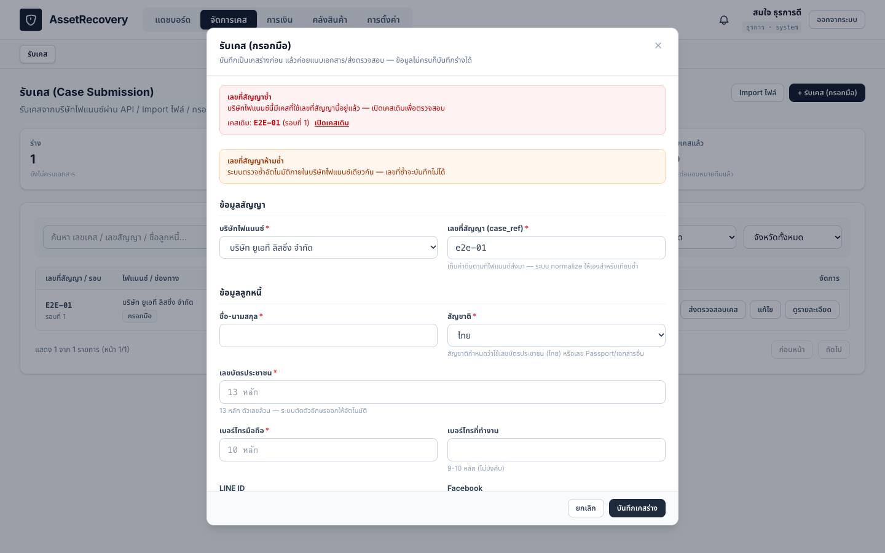

- ทีมที่เสนอเปลี่ยนตามจังหวัดของที่อยู่ปัจจุบัน และกล่องจะแสดงค่าใช้จ่ายตามแผนของทีมนั้น เช่น ทีมที่คิดค่าน้ำมันตามระยะทาง

  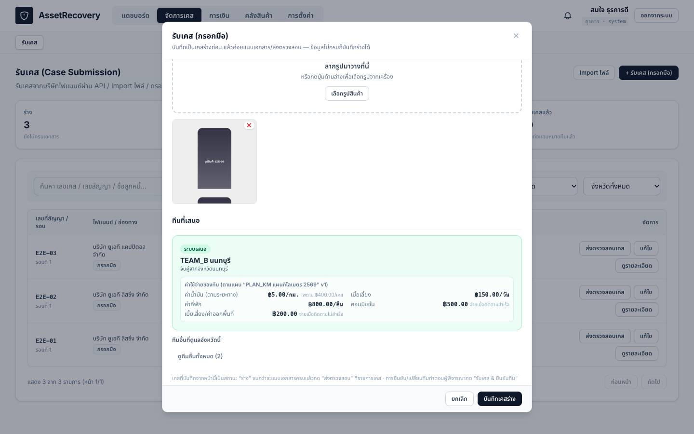

- คอลัมน์ **ทีมที่เสนอ** ในตารางของเคสร่างจะแสดง "ยังไม่เสนอ" — ระบบบันทึกทีมที่เสนอจริงตอนกดส่งตรวจ

---

## บทที่ 3 รับเคสแบบนำเข้าไฟล์ (Import)

**เป้าหมาย:** สร้างเคสหลายเคสพร้อมกันจากไฟล์ Excel/CSV

**ก่อนเริ่ม:** 1 ไฟล์ = 1 บริษัทไฟแนนซ์ · ไม่เกิน 1,000 แถวต่อไฟล์

### 3.1 ดาวน์โหลดไฟล์ตัวอย่าง

1. กด **Import ไฟล์**
2. กด **ดูคำอธิบายคอลัมน์ (31 คอลัมน์)** เพื่ออ่านว่าคอลัมน์ไหนบังคับ
3. กด **ดาวน์โหลดไฟล์ตัวอย่าง (.xlsx)** (หรือ **หรือ CSV**)

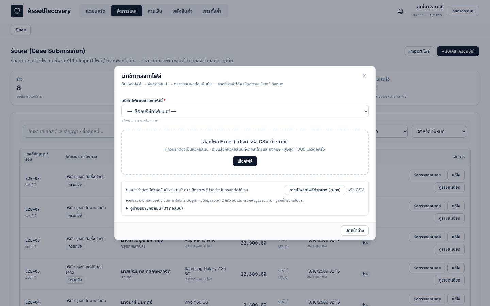

ไฟล์ตัวอย่างมี 2 แผ่น: แผ่น **ข้อมูล** (มีข้อมูลสมมติ 2 แถว) และแผ่น **คำอธิบาย**

### 3.2 กรอกไฟล์และนำเข้า

1. ลบ 2 แถวตัวอย่างออก แล้วกรอกข้อมูลจริง 1 เคสต่อ 1 แถว (ช่องยี่ห้อ/รุ่นเว้นว่างได้ ระบบจะเติมจาก IMEI)
2. กลับมาที่หน้าต่าง **นำเข้าเคสจากไฟล์** เลือก **บริษัทไฟแนนซ์ของไฟล์นี้**
3. กด **เลือกไฟล์** แล้วเลือกไฟล์ที่กรอก
4. ตรวจตาราง **จับคู่คอลัมน์** — ระบบจับคู่หัวคอลัมน์ภาษาไทยให้เอง แก้ได้ที่ช่อง **นำเข้าเป็น**
5. กด **ตรวจสอบข้อมูล (ไม่บันทึก)**

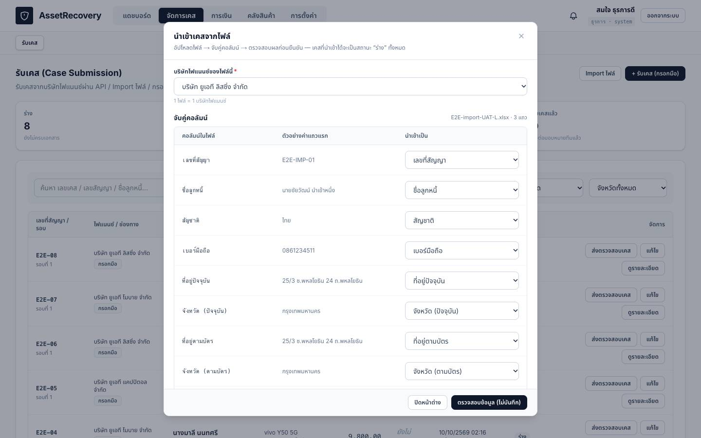

6. ดู **ผลการตรวจสอบ (ยังไม่บันทึก)** — ทุกแถวควรเป็น **พร้อมนำเข้า** แถวที่มีหมายเหตุ เช่น "เติมยี่ห้อ/รุ่นจาก IMEI …" นำเข้าได้ตามปกติ ถ้ามีแถวผิด กด **ย้อนกลับไปแก้ mapping** หรือแก้ไฟล์แล้วเลือกใหม่
7. กด **ยืนยันนำเข้า N รายการ**

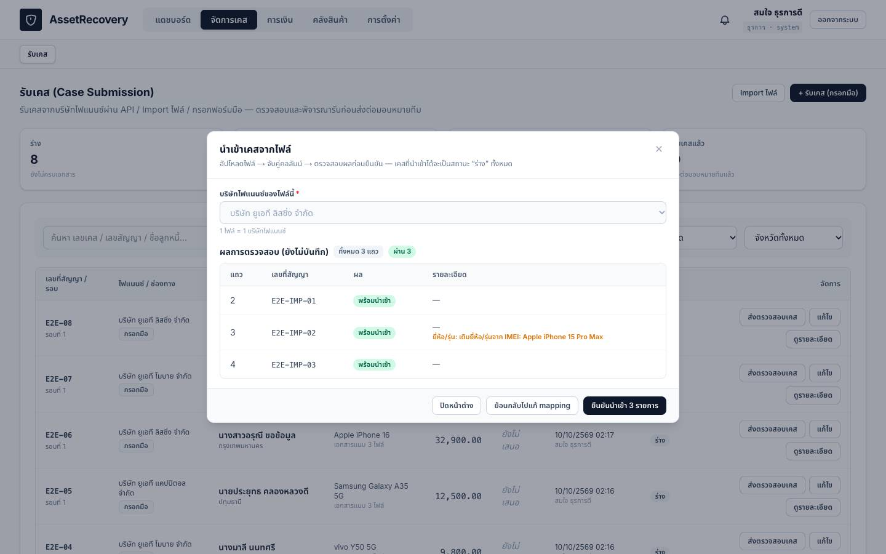

**ผลที่ควรเห็น:** สรุป "ทั้งหมด N แถว · สร้างแล้ว N" — เคสใหม่สถานะ **ร่าง** ช่องทาง **Import** และ **เอกสารแนบ 0 ไฟล์**

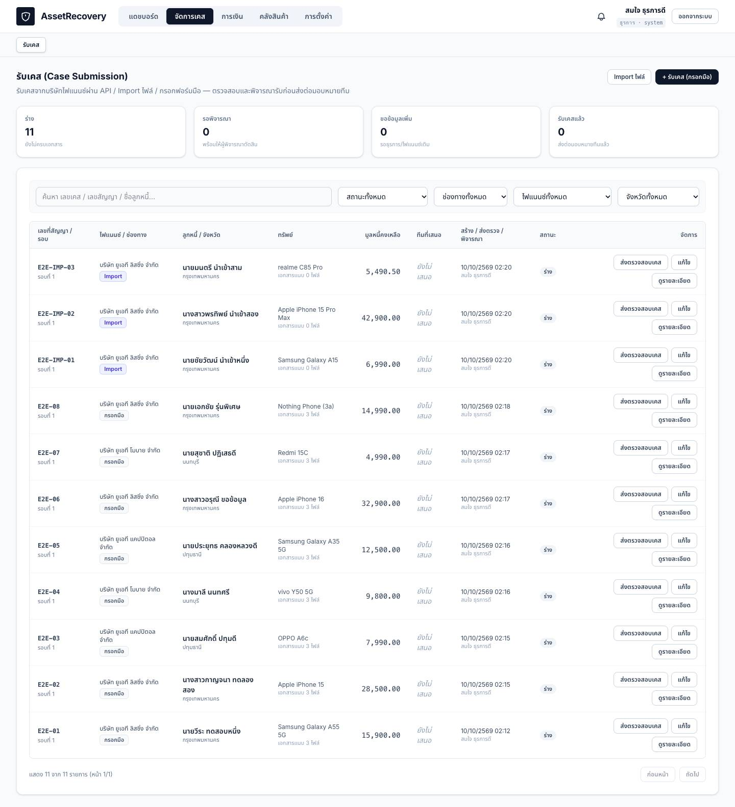

### ข้อควรระวัง / เคล็ดลับ

- **ใช้ไฟล์ .xlsx ดีกว่า CSV** — เลข 0 นำหน้าเบอร์โทรและ IMEI 15 หลักจะไม่เพี้ยน
- การนำเข้าไม่รวมไฟล์เอกสาร — **ต้องแนบเอกสารทีละเคส** ก่อนส่งตรวจ (บทที่ 4)

---

## บทที่ 4 แนบเอกสารให้เคสที่นำเข้า (3 แบบ)

**เป้าหมาย:** แนบเอกสารให้ครบก่อนส่งตรวจ

**ถ้าลืมแนบแล้วกดส่งตรวจ** ระบบจะขึ้นข้อความแดง "เอกสารแนบยังไม่ครบ — เอกสารที่ยังไม่ได้แนบ: …" และเคสยังเป็น **ร่าง**

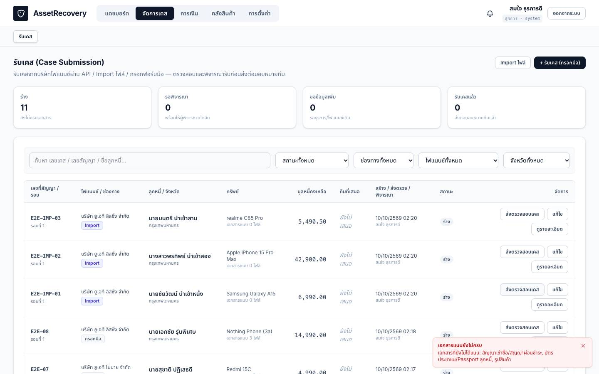

**ขั้นตอน**

1. กด **แก้ไข** ในแถวเคส
2. เลื่อนลงไปส่วน **เอกสารแนบ** แล้วเลือกแบบที่ตรงกับเอกสารที่ได้รับ:

| แบบ | วิธีแนบ | เอกสารที่ต้องมี |
|---|---|---|
| ก. แยกตามประเภท | เลือก **แยกตามประเภท** แล้วแนบทีละช่อง | สัญญา + บัตรประชาชน + รูปสินค้าอย่างน้อย 1 รูป |
| ข. เอกสารชุดเดียว | เลือก **เอกสารชุดเดียว (สแกนรวมเล่ม)** แล้วแนบไฟล์เดียว | ไฟล์ชุดเดียวนับแทนสัญญา + บัตร · รูปสินค้าไม่บังคับ |
| ค. รูปสินค้าอยู่ในสัญญา | แนบสัญญา + บัตร แล้วติ๊ก **รูปสินค้ารวมอยู่ในไฟล์สัญญาแล้ว** | ไม่ต้องแนบรูปสินค้าแยก |

3. กด **บันทึกการแก้ไข**

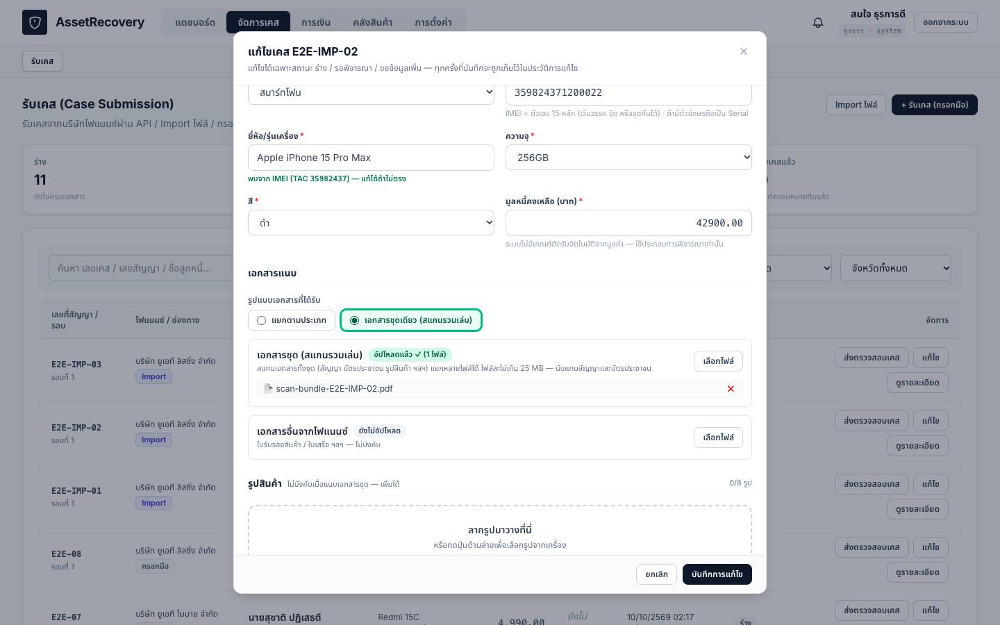

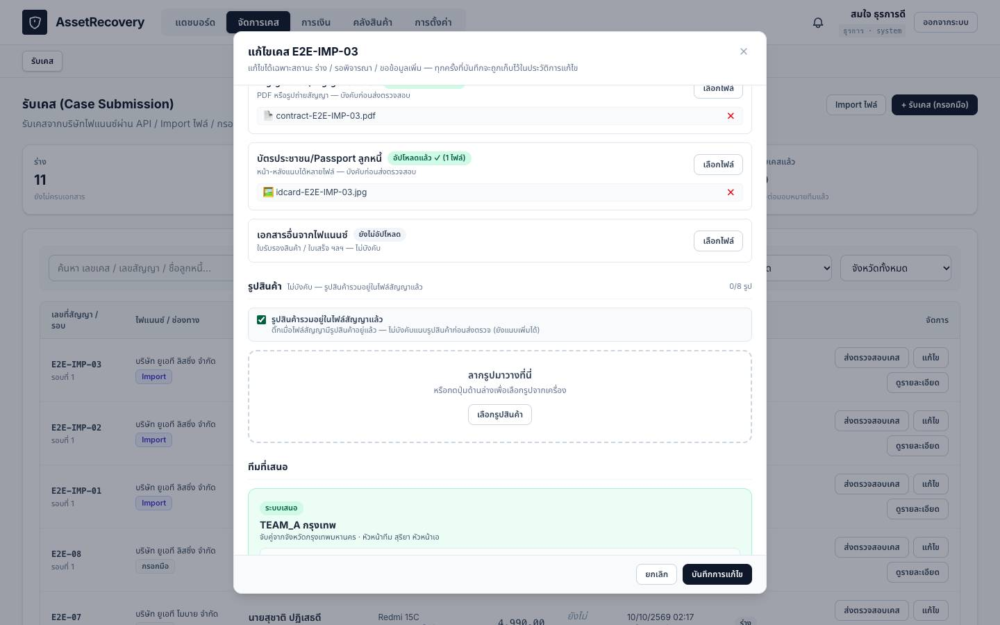

**ผลที่ควรเห็น:** บันทึกสำเร็จ คอลัมน์ทรัพย์แสดงจำนวนเอกสารแนบ

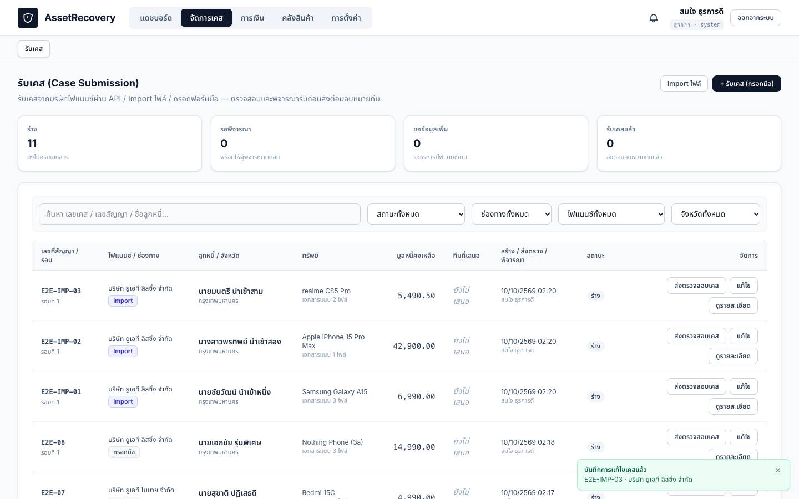

**เคล็ดลับ:** ทุกการบันทึกแก้ไขถูกเก็บในประวัติ — ถ้าเลือก "เอกสารชุดเดียว" เจ้าหน้าที่อนุมัติเคสต้องเปิดไฟล์ตรวจและติ๊กยืนยันก่อนรับเคส

---

## บทที่ 5 ส่งตรวจสอบเคส

**เป้าหมาย:** ส่งเคสร่างที่ครบแล้วให้เจ้าหน้าที่อนุมัติเคสพิจารณา

**ขั้นตอน**

1. ในหน้า **รับเคส** หาแถวเคสสถานะ **ร่าง**
2. กด **ส่งตรวจสอบเคส** ในแถวนั้น (ทำทีละเคส)

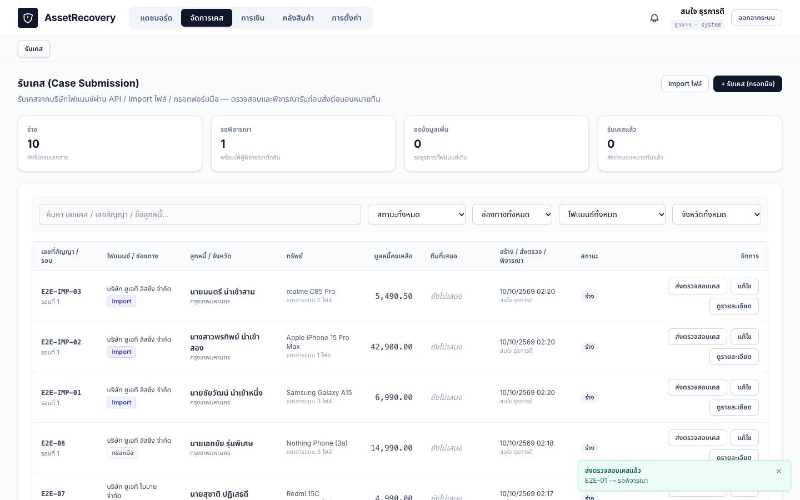

**ผลที่ควรเห็น:** สถานะเปลี่ยนเป็น **รอพิจารณา** ทันที คอลัมน์ **ทีมที่เสนอ** แสดงชื่อทีม และมีเวลา **ส่งตรวจ** ใต้วันที่สร้าง การ์ด **รอพิจารณา** นับเพิ่ม

**ข้อควรระวัง / เคล็ดลับ**

- การส่งตรวจ **ไม่มีหน้าต่างยืนยัน** — ตรวจข้อมูลก่อนกด
- ยังไม่มีการเลือกหลายเคสแล้วส่งพร้อมกัน ต้องกดทีละแถว
- เคสที่ส่งแล้ว ธุรการเห็นปุ่ม **พิจารณา** ได้ แต่เปิดได้เพื่อดูอย่างเดียว (การตัดสินใจเป็นของเจ้าหน้าที่อนุมัติเคส)

---

## บทที่ 6 แก้เคสที่ถูกขอข้อมูลเพิ่มแล้วส่งใหม่

**เป้าหมาย:** แก้เคสตามที่เจ้าหน้าที่อนุมัติเคสขอ แล้วส่งตรวจอีกครั้ง

### 6.1 รู้ว่ามีเคสถูกขอข้อมูลเพิ่ม และอ่านเหตุผล

1. แดชบอร์ดขึ้นการ์ด **เคสที่ขอข้อมูลเพิ่ม** พร้อมตัวเลข
2. กดกระดิ่ง หรือ **ดูทั้งหมด** ในกล่องแจ้งเตือนล่าสุด → หน้า **การแจ้งเตือน**
3. อ่านรายการ "ผู้ตรวจขอข้อมูลเพิ่มเติม — เคส … — <เหตุผล>" แล้วกด **เปิดรายการ** เพื่อไปที่เคส

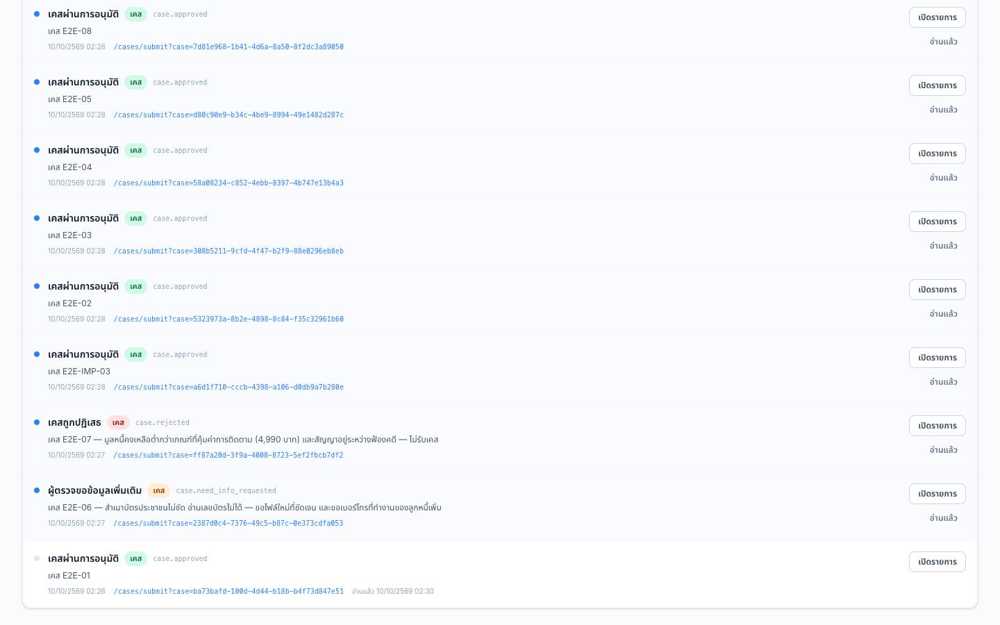

> **สำคัญ:** เหตุผลที่ผู้ตรวจขอข้อมูลเพิ่ม **ดูได้จากหน้าการแจ้งเตือน** — หน้ารายละเอียด/แก้ไขเคสไม่แสดงเหตุผลนี้ ให้จดไว้ก่อนเริ่มแก้

### 6.2 แก้เคส

1. ในหน้า **รับเคส** กรองสถานะ **ขอข้อมูลเพิ่ม**
2. กด **แก้ไข** ในแถวเคส
3. แก้ข้อมูลตามที่ขอ เช่น เพิ่ม **เบอร์โทรที่ทำงาน**
4. ถ้าต้องเปลี่ยนไฟล์: กด **ลบ** ที่ไฟล์เดิม → กรอกเหตุผล (ไม่บังคับ) → กด **ลบเอกสาร** แล้วแนบไฟล์ใหม่
5. กด **บันทึกการแก้ไข** (สถานะยังเป็น **ขอข้อมูลเพิ่ม**)

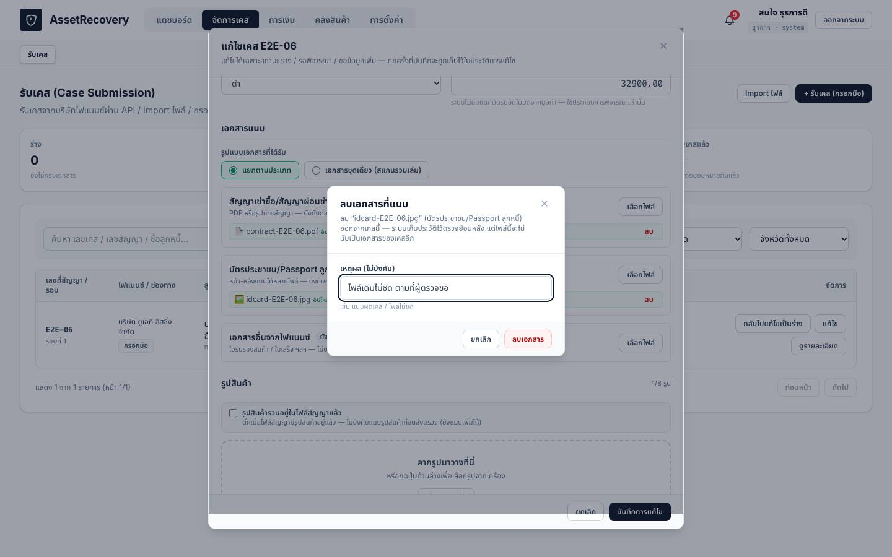

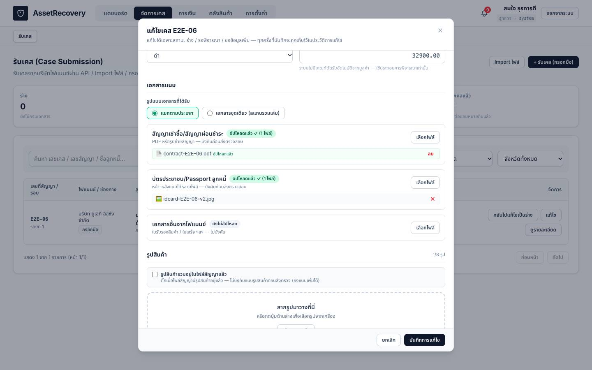

### 6.3 ส่งตรวจใหม่

1. กด **กลับไปแก้ไขเป็นร่าง** ในแถวเคส (สถานะเปลี่ยนเป็น **ร่าง**)
2. กด **ส่งตรวจสอบเคส**


**ผลที่ควรเห็น:** สถานะ **รอพิจารณา** และเวลา **ส่งตรวจ** อัปเดตเป็นรอบใหม่

**ข้อควรระวัง / เคล็ดลับ**

- ถ้าตั้งตัวกรอง **ขอข้อมูลเพิ่ม** ไว้ แถวจะหายจากตารางหลังกด **กลับไปแก้ไขเป็นร่าง** — เปลี่ยนตัวกรองเป็น **สถานะทั้งหมด** เพื่อหาเคสแล้วกดส่งตรวจ
- การลบเอกสารไม่ได้ลบถาวร ระบบเก็บประวัติไฟล์เดิมไว้

---

# ส่วนที่ 2 — เจ้าหน้าที่อนุมัติเคส

## บทที่ 7 คิวงานรอพิจารณา

**เป้าหมาย:** ดูว่ามีเคสรอพิจารณาเท่าไร

**ขั้นตอน**

1. เข้าสู่ระบบ ดูการ์ด **เคสรอพิจารณารับ** บนแดชบอร์ด
2. กด **ไปที่ รับเคส** — ทุกแถวที่รอพิจารณาจะมีปุ่ม **พิจารณา**

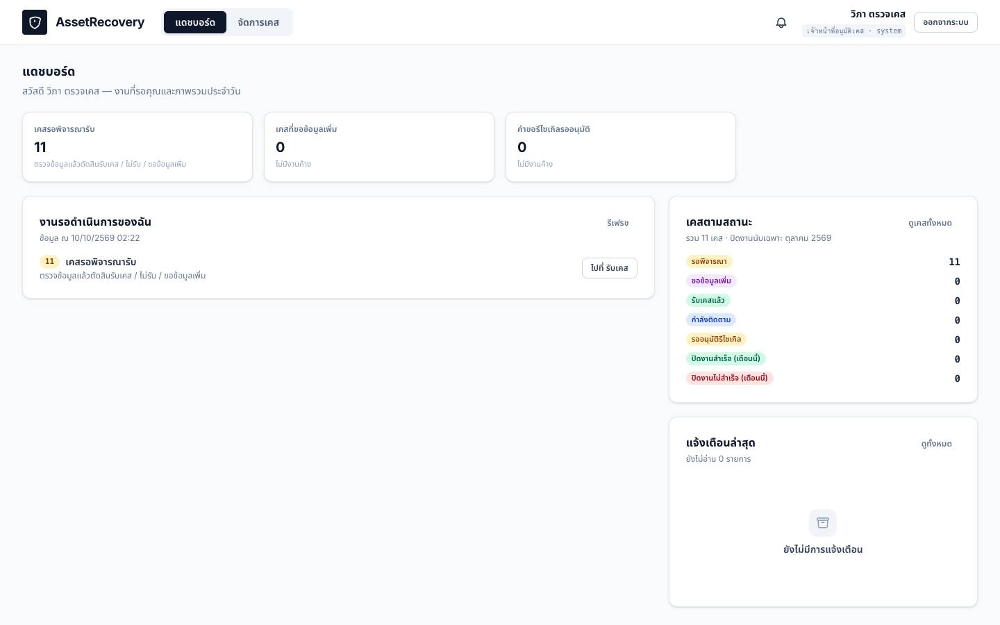

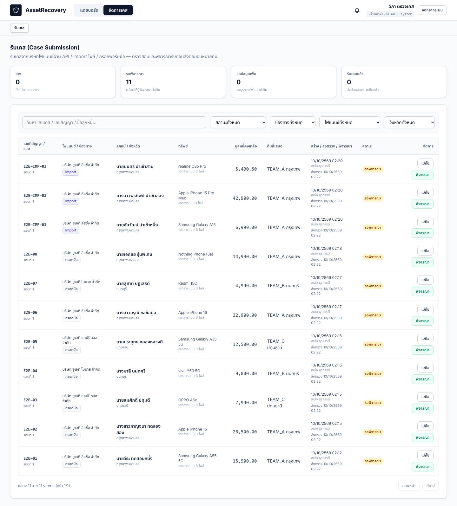

**เคล็ดลับ:** ระบบไม่ส่งแจ้งเตือนทุกครั้งที่ธุรการส่งเคสเข้ามา — ให้ดูตัวเลขบนการ์ดแดชบอร์ดเป็นประจำ

---

## บทที่ 8 พิจารณาและรับเคส

**เป้าหมาย:** ตรวจข้อมูล เอกสาร และทีมที่ระบบเสนอ แล้วรับเคสเพื่อส่งต่อให้ทีมติดตาม

**ขั้นตอน**

1. กด **พิจารณา** ในแถวเคส
2. อ่าน **สรุปเคส** (ลูกหนี้ บริษัท ทรัพย์ IMEI มูลหนี้)
3. ดู **ประมาณการรายได้ (ถ้าติดตามสำเร็จ)** — คำนวณจากเทมเพลตค่าบริการของบริษัท
4. ดู **ทีมที่เสนอ** (ป้าย **ระบบเสนอ** · จับคู่จากจังหวัด · ค่าใช้จ่ายตามแผนของทีม) และ **ช่องทางติดต่อ**
5. ที่ส่วน **เอกสารแนบ** กดชื่อไฟล์เพื่อเปิดดู (รูปแสดงภาพขยาย · PDF เปิดในหน้าต่าง มีปุ่ม **เปิดในแท็บใหม่**)
6. ถ้าข้อมูลครบถูกต้อง กด **รับเคส & ยืนยันทีม**

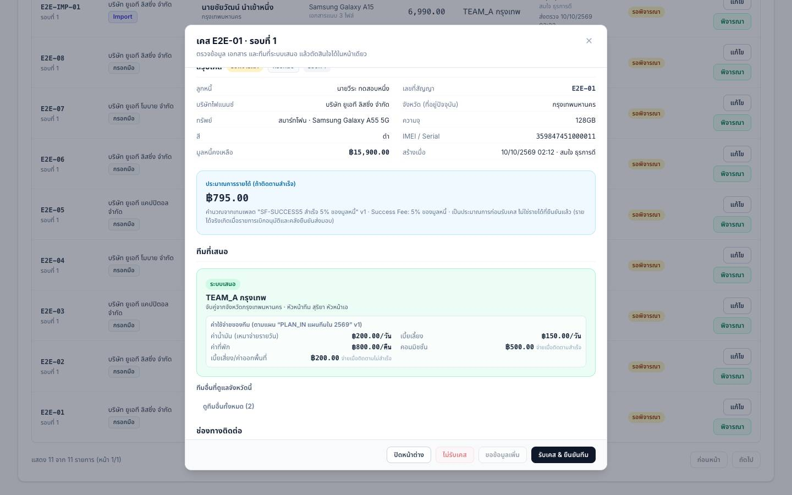

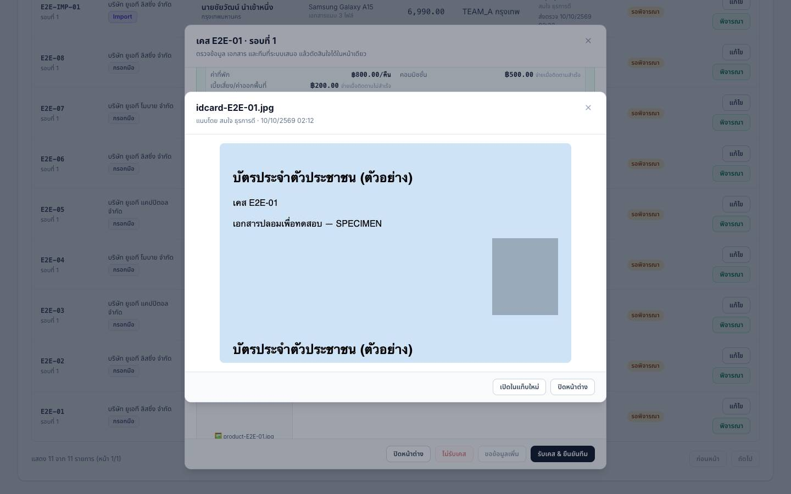

**ผลที่ควรเห็น:** สถานะ **รับเคสแล้ว** แถวแสดงเวลารับเคส และธุรการได้รับแจ้งเตือน "เคสผ่านการอนุมัติ" — เคสเข้าคิวให้หัวหน้า/ผู้จัดการทีมมอบหมายงาน

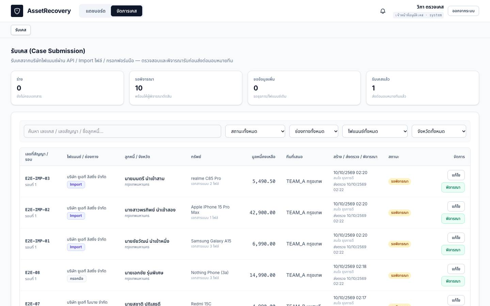

### กรณีเอกสารชุดเดียว (สแกนรวมเล่ม)

1. เปิดไฟล์เอกสารชุด ตรวจว่ามีสัญญาและบัตรประชาชนครบ
2. ติ๊ก **ตรวจเอกสารชุดแล้ว — ในชุดมีสัญญาเช่าซื้อ/ผ่อนชำระ และบัตรประชาชน/Passport ลูกหนี้ครบ**
3. กด **รับเคส & ยืนยันทีม**

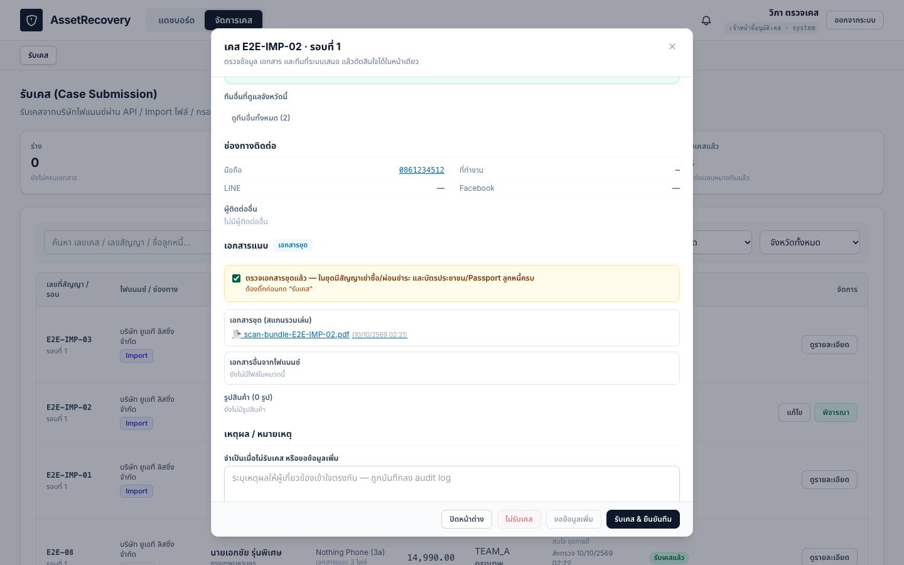

**ข้อควรระวัง / เคล็ดลับ**

- **รับเคส & ยืนยันทีม** มีผลทันที ไม่มีหน้าต่างยืนยัน
- ถ้ายังไม่ติ๊กยืนยันเอกสารชุด ปุ่มรับเคสยังกดได้ แต่ระบบจะปฏิเสธพร้อมข้อความแดง "ต้องยืนยันเอกสารชุดก่อนรับเคส"
- ประมาณการรายได้เป็นตัวเลขประกอบการตัดสินใจ ยังไม่ใช่รายได้จริง ตัวอย่าง: แบบ 5% ของมูลหนี้ ฿15,900 = ฿795.00 · แบบเหมา = ฿3,000.00 · แบบ ฿2,000 + 3% ของมูลหนี้ ฿9,800 = ฿2,294.00
- เคสที่ธุรการระบุรุ่นเองจะแสดงชื่อรุ่นตามที่พิมพ์ — ตรวจกับเอกสารสัญญา

---

## บทที่ 9 รับเคสโดยเปลี่ยนทีม

**เป้าหมาย:** ให้ทีมอื่นรับเคสแทนทีมที่ระบบเสนอ (เช่น ลูกหนี้ย้ายที่อยู่)

**ขั้นตอน**

1. เปิด **พิจารณา** › ในกล่องทีมกด **ดูทีมอื่นทั้งหมด (N)**
2. เทียบค่าใช้จ่ายตามแผนของแต่ละทีม แล้วกด **เลือกทีมนี้** ที่ทีมที่ต้องการ
3. หน้าต่าง **เปลี่ยนทีมเป็น "…"** กรอก **เหตุผล** แล้วกด **ยืนยันเปลี่ยนทีม**
4. กด **รับเคส & ยืนยันทีม**

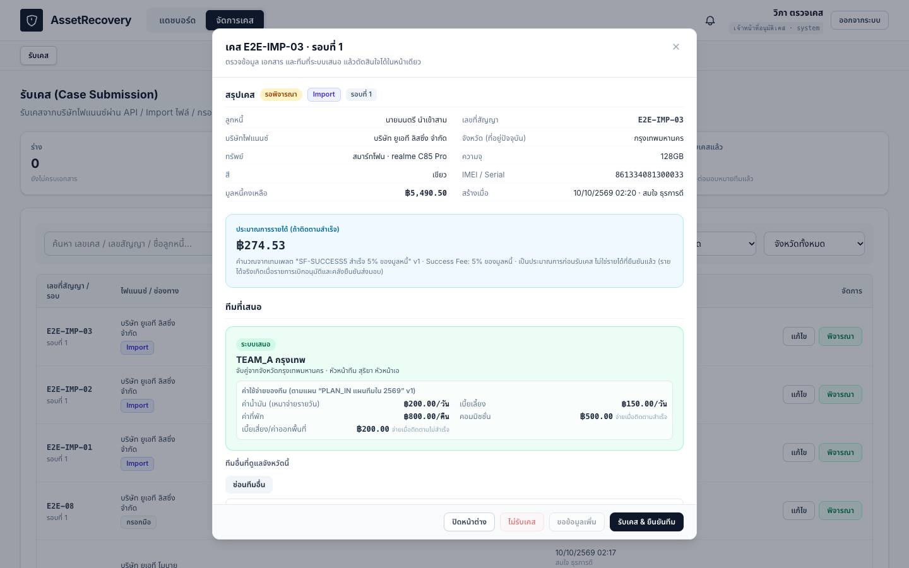

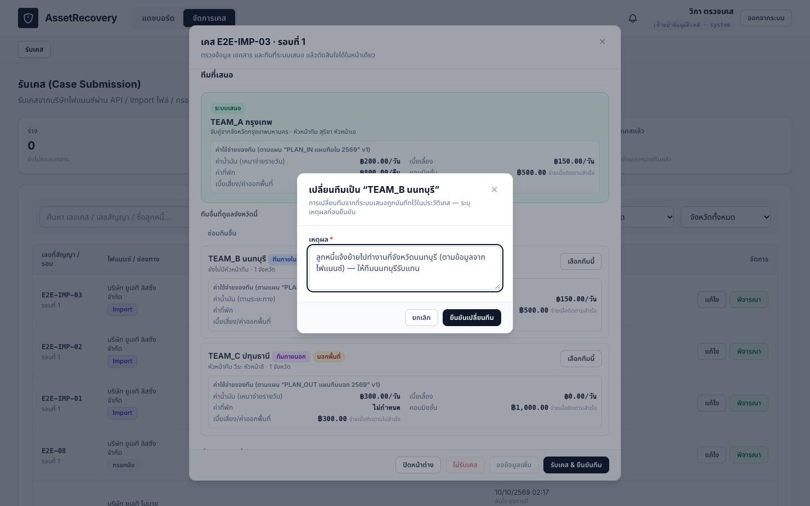

| ช่อง | ตัวอย่าง | บังคับ | หมายเหตุ |
|---|---|---|---|
| เหตุผล (เปลี่ยนทีม) | ลูกหนี้แจ้งย้ายไปทำงานที่จังหวัดนนทบุรี — ให้ทีมนนทบุรีรับแทน | บังคับ | ถูกบันทึกในประวัติเคส |

**ผลที่ควรเห็น:** กล่องทีมแสดง "<ทีมใหม่> (เปลี่ยนจากที่ระบบเสนอ: <ทีมเดิม>)" และหลังรับเคส คอลัมน์ทีมเป็นทีมใหม่

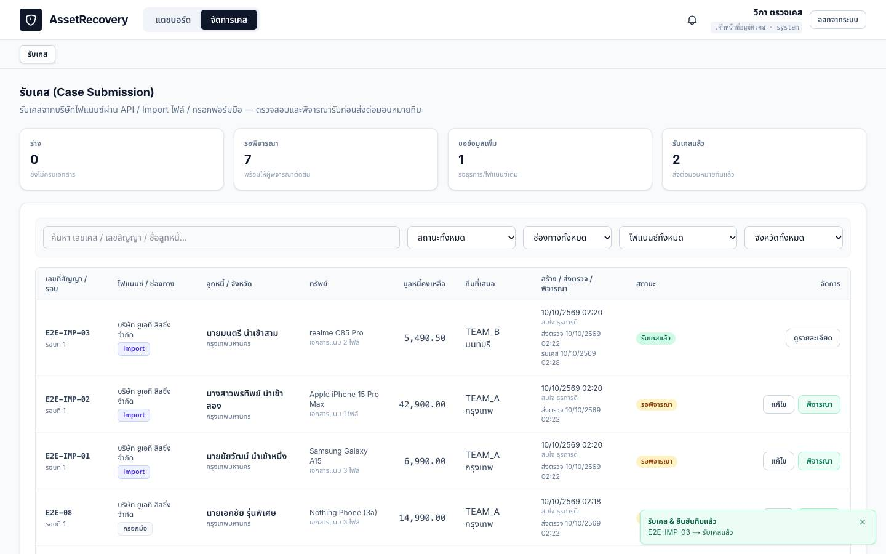

**เคล็ดลับ:** หลังเปลี่ยนทีม กล่องทีมอาจยังมีป้าย "ระบบเสนอ" ค้างอยู่ — ให้ดูบรรทัด "(เปลี่ยนจากที่ระบบเสนอ: …)" เป็นหลัก ทีมนอกพื้นที่จะมีป้าย **นอกพื้นที่** กำกับ

---

## บทที่ 10 ขอข้อมูลเพิ่ม

**เป้าหมาย:** ส่งเคสกลับให้ธุรการแก้ไข เมื่อข้อมูลหรือเอกสารไม่ครบ/ไม่ชัด

**ขั้นตอน**

1. เปิด **พิจารณา** ที่เคส
2. พิมพ์เหตุผลในช่อง **เหตุผล / หมายเหตุ** (ปุ่ม **ขอข้อมูลเพิ่ม** จะกดได้เมื่อมีเหตุผล)
3. กด **ขอข้อมูลเพิ่ม**

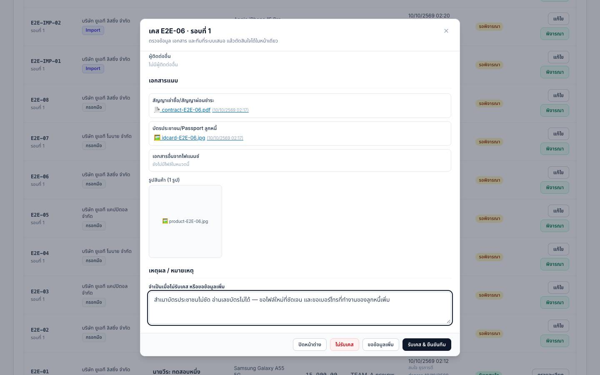

| ช่อง | ตัวอย่าง | บังคับ |
|---|---|---|
| เหตุผล / หมายเหตุ | สำเนาบัตรประชาชนไม่ชัด อ่านเลขบัตรไม่ได้ — ขอไฟล์ใหม่ที่ชัดเจน และขอเบอร์โทรที่ทำงานของลูกหนี้เพิ่ม | บังคับ |

**ผลที่ควรเห็น:** สถานะ **ขอข้อมูลเพิ่ม** และธุรการได้รับแจ้งเตือนพร้อมเหตุผล

**เคล็ดลับ:** เขียนเหตุผลให้ชัดว่าต้องแก้อะไรบ้าง — ธุรการเห็นเหตุผลนี้ในหน้าการแจ้งเตือนเท่านั้น · เมื่อธุรการส่งกลับมา เคสจะกลับเข้าคิว **รอพิจารณา** ให้ตรวจจุดที่ขอแก้แล้วรับเคสตามปกติ

---

## บทที่ 11 ไม่รับเคส

**เป้าหมาย:** ปฏิเสธเคสที่ไม่ควรติดตาม (ย้อนกลับไม่ได้)

**ขั้นตอน**

1. เปิด **พิจารณา** › พิมพ์เหตุผลในช่อง **เหตุผล / หมายเหตุ**
2. กด **ไม่รับเคส**
3. อ่านหน้าต่างยืนยัน แล้วกด **ยืนยันไม่รับเคส**

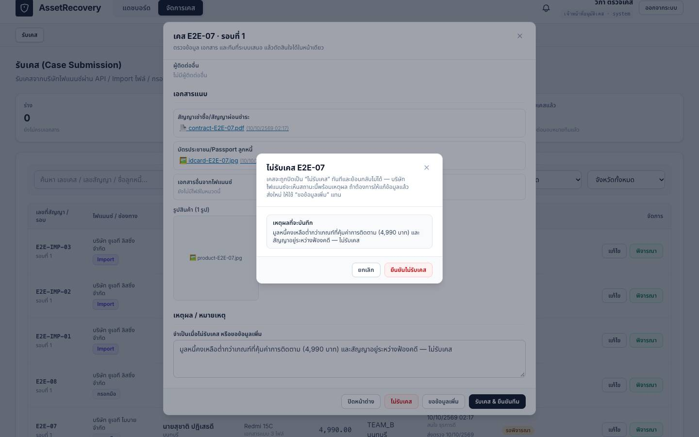

| ช่อง | ตัวอย่าง | บังคับ |
|---|---|---|
| เหตุผล | มูลหนี้คงเหลือต่ำกว่าเกณฑ์ที่คุ้มค่าการติดตาม และสัญญาอยู่ระหว่างฟ้องคดี — ไม่รับเคส | บังคับ |

**ผลที่ควรเห็น:** สถานะ **ไม่รับเคส** (ป้ายแดง) ในแถวเหลือแค่ปุ่ม **ดูรายละเอียด**

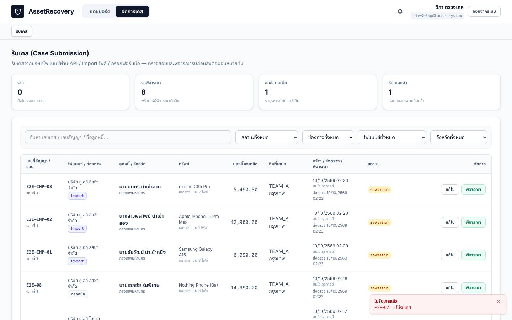

**ข้อควรระวัง:** **ไม่รับเคสแล้วย้อนกลับไม่ได้** ถ้าต้องการให้ธุรการแก้ไขแล้วส่งใหม่ ให้ใช้ **ขอข้อมูลเพิ่ม** แทน

---

## บทที่ 12 ตรวจและตีกลับหลักฐานปิดงาน

**เป้าหมาย:** ตรวจหลักฐานที่พนักงานภาคสนามส่งตอนปิดงาน และส่งกลับให้แก้เมื่อหลักฐานไม่ครบ/ไม่ชัด

**ก่อนเริ่ม:** เคสต้องถูกปิดงานโดยพนักงานภาคสนามแล้ว (สถานะ **ปิดงานสำเร็จ** หรือ **ปิดงานไม่สำเร็จ**)

**ขั้นตอน**

1. **จัดการเคส** › **รับเคส** › ตัวกรองสถานะ **ปิดงานสำเร็จ** (หรือ **ปิดงานไม่สำเร็จ**)
2. กด **ดูรายละเอียด** ในแถวเคส แล้วเลื่อนลงไปส่วน **หลักฐานปิดงาน** — มี ผู้ส่ง · เวลาปิดงาน · บันทึกเพิ่มเติม · รูปถ่าย · วิดีโอ · รูปสินค้ายืนยัน · เสียงบันทึกการสนทนา · จุดเช็คอิน (พิกัด)
3. กดชื่อไฟล์เพื่อเปิดดู
4. ถ้าหลักฐานไม่ถูกต้อง กด **ตีกลับหลักฐานปิดงาน** → กรอก **เหตุผล** → กด **ยืนยันตีกลับ**

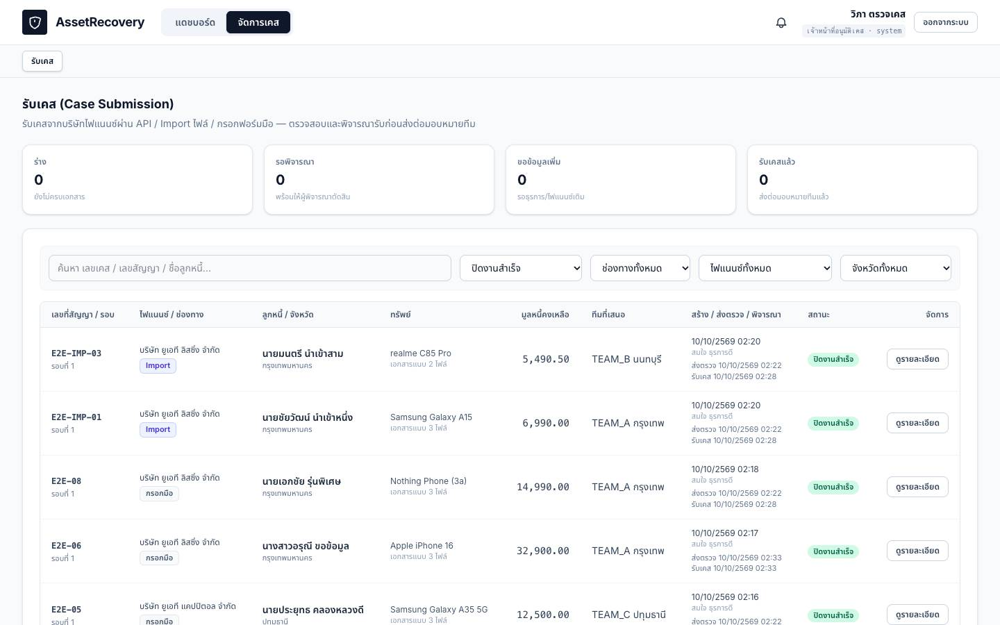

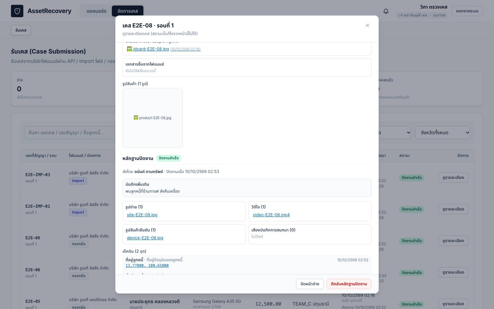

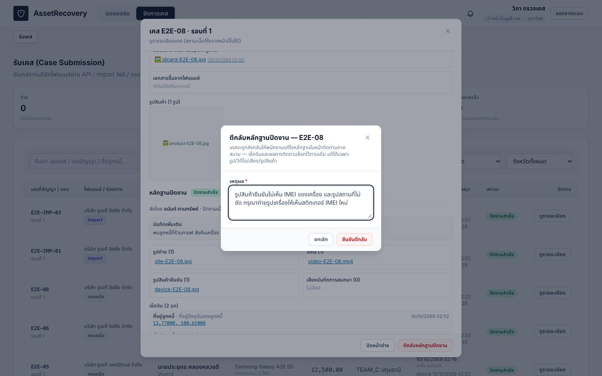

| ช่อง | ตัวอย่าง | บังคับ | หมายเหตุ |
|---|---|---|---|
| เหตุผล | รูปสินค้ายืนยันไม่เห็น IMEI ของเครื่อง และรูปสถานที่ไม่ชัด กรุณาถ่ายรูปเครื่องให้เห็นสติกเกอร์ IMEI ใหม่ | บังคับ | 5–1,000 ตัวอักษร |

**ผลที่ควรเห็น:** ข้อความ "ตีกลับหลักฐานปิดงานแล้ว — แจ้งพนักงานให้แก้ไขหลักฐาน…" และพนักงานได้รับแจ้งเตือน

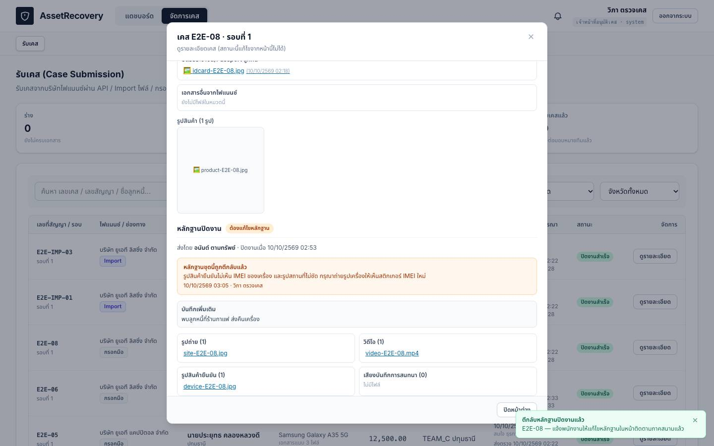

**ข้อควรระวัง / เคล็ดลับ**

- การตีกลับหลักฐานเป็นสิทธิ์ของ **เจ้าหน้าที่อนุมัติเคสเท่านั้น** (หัวหน้า/ผู้จัดการทีมทำไม่ได้)
- **ไม่มีปุ่ม "อนุมัติหลักฐาน"** — ถ้าหลักฐานถูกต้องไม่ต้องทำอะไร หลักฐานจะผ่านอัตโนมัติเมื่อคลังรับเครื่องเข้า (เคสสำเร็จ) หรือเมื่อค่าตอบแทนอนุมัติครบ (เคสไม่สำเร็จ)
- พนักงานแก้ได้เฉพาะ รูป/วิดีโอ/เสียง/รูปสินค้า — จุดเช็คอินและผลการติดตาม (สำเร็จ/ไม่สำเร็จ) ล็อกไว้ตามเดิม ระบุในเหตุผลให้ชัดว่าต้องถ่ายอะไรใหม่
- หน้าต่างรายละเอียดอาจมีคำบรรยายว่า "สถานะนี้แก้ไขจากหน้านี้ไม่ได้" — ปุ่ม **ตีกลับหลักฐานปิดงาน** ด้านล่างยังใช้งานได้ตามปกติ

---

## บทที่ 13 รีไซเคิล — ขอติดตามรอบใหม่และอนุมัติ

**เป้าหมาย:** นำเคสที่ปิดงานไม่สำเร็จกลับมาติดตามรอบใหม่ (เช่น บริษัทไฟแนนซ์แจ้งที่อยู่ใหม่ของลูกหนี้)

> บนหน้าจอใช้คำว่า **รีไซเกิล** ในชื่อปุ่มและสถานะ (เช่น **ขอรีไซเกิล (re-track)** · **อนุมัติรีไซเกิล** · **รออนุมัติรีไซเกิล**) — หมายถึงการรีไซเคิลเคสในคู่มือนี้

### 13.1 ขอรีไซเคิล

1. **จัดการเคส** › **รับเคส** › ตัวกรองสถานะ **ปิดงานไม่สำเร็จ**
2. กด **ดูรายละเอียด** ที่เคส อ่าน **เหตุผลที่ไม่สำเร็จ** และหลักฐาน
3. กรอก **เหตุผล / หมายเหตุ**
4. กด **ขอรีไซเกิล (re-track)**

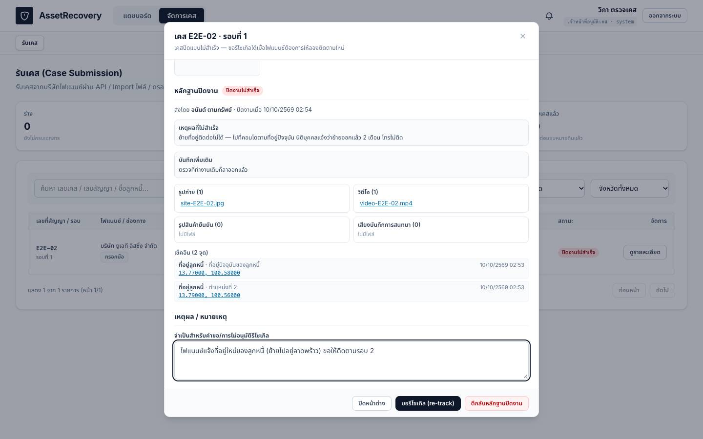

| ช่อง | ตัวอย่าง | บังคับ |
|---|---|---|
| เหตุผล / หมายเหตุ | ไฟแนนซ์แจ้งที่อยู่ใหม่ของลูกหนี้ (ย้ายไปอยู่ลาดพร้าว) ขอให้ติดตามรอบ 2 | บังคับ |

**ผลที่ควรเห็น:** ข้อความแจ้งว่าขอรีไซเคิลแล้ว และสถานะเคสเป็น **รออนุมัติรีไซเกิล**

### 13.2 อนุมัติรีไซเคิล

1. แดชบอร์ดขึ้นการ์ด **คำขอรีไซเกิลรออนุมัติ** — กดเพื่อเปิดหน้ารับเคส (แล้วกรองสถานะ **รออนุมัติรีไซเกิล** เพื่อหาเคสได้เร็วขึ้น)
2. กด **ดูรายละเอียด** ที่เคส — ดูกล่อง **ประวัติรีไซเกิล** (หมายเหตุคำขอ · วันที่ยื่น)
3. กด **อนุมัติรีไซเกิล** (หรือ **ไม่อนุมัติ** ซึ่งต้องกรอกเหตุผล)


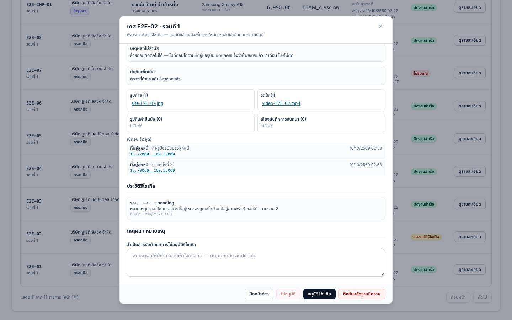

**ผลที่ควรเห็น:** ข้อความ "อนุมัติรีไซเกิลแล้ว — … → รับเคสแล้ว" เคสกลับเป็น **รับเคสแล้ว** ในรอบที่ 2 และหัวหน้าทีมมอบหมายงานใหม่ได้ทันที

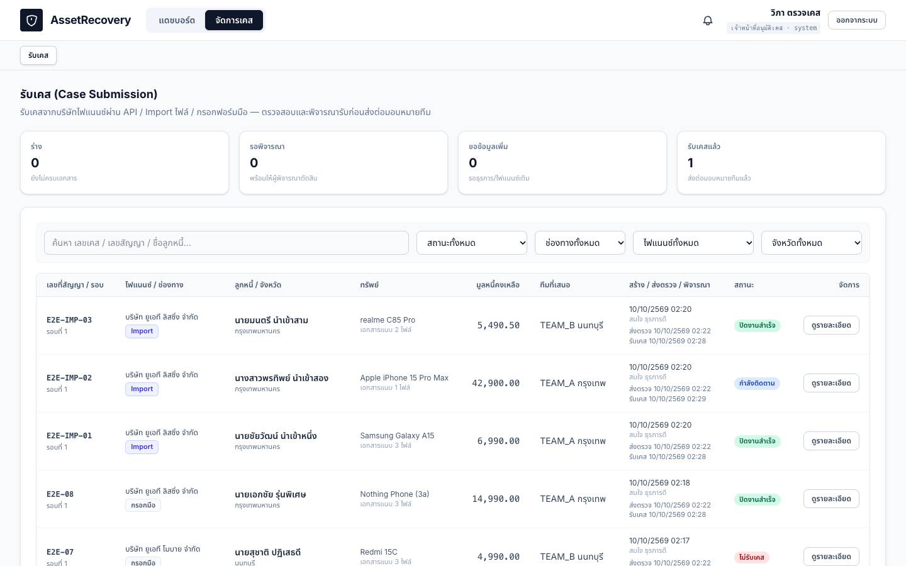

**ข้อควรระวัง / เคล็ดลับ**

- ผู้ขอและผู้อนุมัติรีไซเคิลเป็นบทบาทเดียวกัน (เจ้าหน้าที่อนุมัติเคส)
- ปุ่ม **อนุมัติรีไซเกิล** มีผลทันที **ไม่มีหน้าต่างยืนยัน** — ตรวจให้แน่ใจก่อนกด
- ถ้าไม่อนุมัติ เคสจะคงสถานะ **ปิดงานไม่สำเร็จ** (จบ)
- ในกล่องประวัติรีไซเคิลอาจเห็นสถานะเป็นคำภาษาอังกฤษ เช่น "pending" (= รออนุมัติ)

---

# ส่วนที่ 3 — ใช้ร่วมกัน

## บทที่ 14 ค้นหา กรอง และดูรายละเอียดเคส

**เป้าหมาย:** หาเคสที่ต้องการได้เร็ว และดูข้อมูลครบในหน้าเดียว

### 14.1 ค้นหาและกรอง

1. พิมพ์ในช่อง **ค้นหา เลขเคส / เลขสัญญา / ชื่อลูกหนี้...**
2. เลือกตัวกรอง: **สถานะ · ช่องทาง** (API / Import / กรอกมือ) **· ไฟแนนซ์ · จังหวัด**

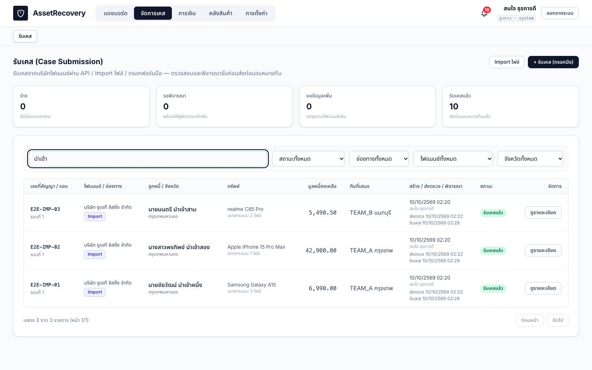

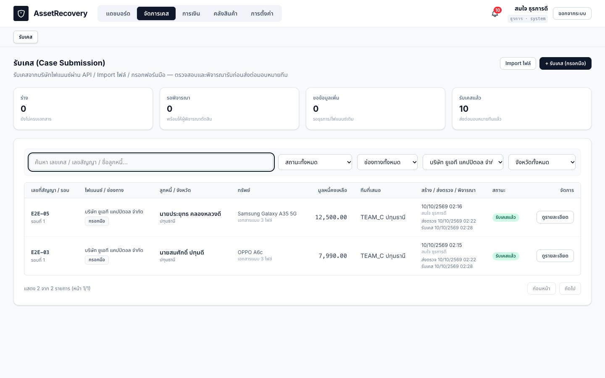

### 14.2 ดูรายละเอียดเคส

1. กด **ดูรายละเอียด** ในแถวเคส
2. เลื่อนดู **สรุปเคส · ประมาณการรายได้ · ทีม · ช่องทางติดต่อ · เอกสารแนบ · รูปสินค้า** (และ **หลักฐานปิดงาน** เมื่อปิดงานแล้ว)
3. กดไฟล์ PDF เพื่อเปิดดูในหน้าต่าง

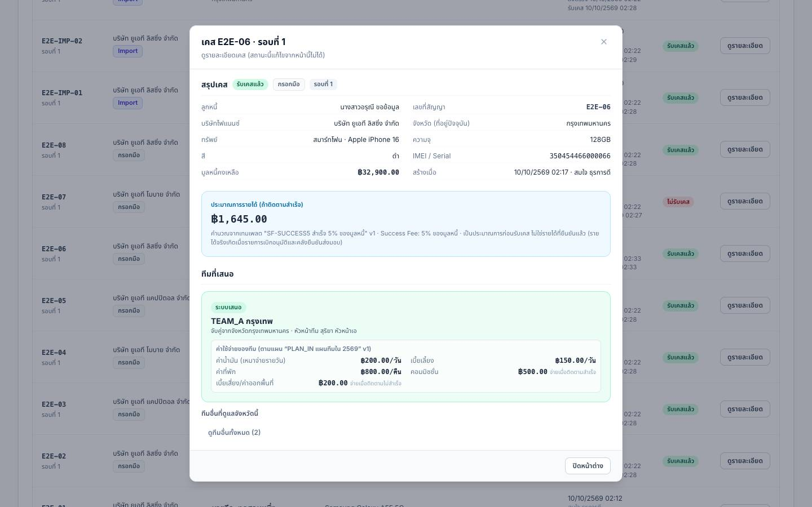

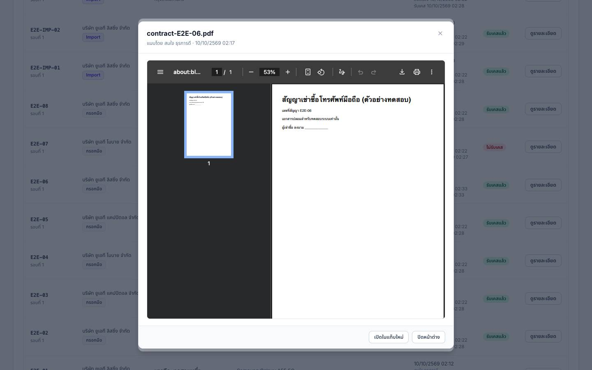

**ข้อควรระวัง / เคล็ดลับ**

- ตัวกรอง **จังหวัด** ใช้จังหวัดที่อยู่ปัจจุบันของลูกหนี้ ไม่ใช่จังหวัดของทีม
- หน้ารายละเอียดยังไม่มีส่วน "ประวัติ" และไม่แสดงเหตุผลไม่รับเคส/ขอข้อมูลเพิ่ม — ดูเวลาของแต่ละขั้นได้จากคอลัมน์ **สร้าง / ส่งตรวจ / พิจารณา** ในตาราง และดูเหตุผลจากหน้าการแจ้งเตือน
- **ถ้าตารางค้างที่ "กำลังโหลดข้อมูล..."** (มักเกิดเมื่อเลือกตัวกรองค่าเดิมซ้ำ) ให้เปลี่ยนตัวกรองเป็นค่าอื่น หรือกดรีเฟรชหน้าเบราว์เซอร์
- หน้าการแจ้งเตือนอาจแสดงรหัสภาษาอังกฤษกำกับรายการ (เช่น case.approved) — ให้อ่านข้อความภาษาไทยในรายการเป็นหลัก และกด **เปิดรายการ** เพื่อไปที่เคส

---

## ภาคผนวก ก คำศัพท์

| คำ | ความหมาย |
|---|---|
| เคส | งานติดตามทรัพย์ 1 สัญญา จากบริษัทไฟแนนซ์ |
| เลขที่สัญญา | เลขอ้างอิงที่บริษัทไฟแนนซ์ใช้ ห้ามซ้ำในบริษัทเดียวกัน |
| รอบ (รอบที่ 1, 2 …) | รอบการติดตาม — เพิ่มขึ้นเมื่อรีไซเคิล |
| ช่องทาง | วิธีที่เคสเข้าระบบ: กรอกมือ / Import / API |
| มูลหนี้คงเหลือ | ยอดหนี้ที่ลูกหนี้ยังค้าง ใช้คำนวณค่าบริการแบบ % |
| IMEI | เลขประจำเครื่องมือถือ ตัวเลข 15 หลัก |
| Serial Number | เลขประจำเครื่องที่มีตัวอักษรปน (อุปกรณ์อื่นที่ไม่มี IMEI) |
| ทีมที่เสนอ | ทีมที่ระบบเลือกจากจังหวัดที่อยู่ปัจจุบันของลูกหนี้ |
| ประมาณการรายได้ | ค่าบริการที่คาดว่าจะเก็บได้ถ้าติดตามสำเร็จ (ยังไม่ใช่รายได้จริง) |
| เอกสารชุดเดียว (สแกนรวมเล่ม) | ไฟล์เดียวที่รวมสัญญาและบัตรประชาชน |
| หลักฐานปิดงาน | รูป/วิดีโอ/เสียง/รูปสินค้า/จุดเช็คอิน ที่พนักงานส่งตอนปิดงาน |
| ตีกลับหลักฐาน | ส่งเคสกลับให้พนักงานแก้หลักฐาน |
| รีไซเคิล (บนจอ: รีไซเกิล) | นำเคสที่ปิดไม่สำเร็จกลับมาติดตามรอบใหม่ |

## ภาคผนวก ข คำถามที่พบบ่อย

**ถาม (ธุรการ): บันทึกร่างแล้ว แต่ส่งตรวจไม่ได้**
ตอบ: เอกสารยังไม่ครบ อ่านข้อความแดงว่าขาดเอกสารใด แล้วกด **แก้ไข** แนบให้ครบ

**ถาม (ธุรการ): กดบันทึกแล้วรอนาน**
ตอบ: การบันทึกครั้งแรกต้องอัปโหลดไฟล์ ใช้เวลา 4–10 วินาที ถ้าเลขที่สัญญาซ้ำอาจรอประมาณ 20 วินาทีก่อนขึ้นข้อความ อย่ากดซ้ำ

**ถาม (ธุรการ): IMEI ถูกต้องแล้วแต่บันทึกไม่ได้**
ตอบ: นับหลักอีกครั้ง ต้องเป็นตัวเลข 15 หลักพอดี (คั่นด้วยเว้นวรรค/ขีด/จุดได้)

**ถาม (ธุรการ): จะรู้ได้อย่างไรว่าผู้ตรวจขออะไรเพิ่ม**
ตอบ: เปิดหน้า **การแจ้งเตือน** (กระดิ่ง) เหตุผลอยู่ในรายการแจ้งเตือน

**ถาม (ธุรการ): แก้เคสที่ขอข้อมูลเพิ่มแล้ว ทำไมสถานะยังไม่เปลี่ยน**
ตอบ: ต้องกด **กลับไปแก้ไขเป็นร่าง** แล้ว **ส่งตรวจสอบเคส** อีกครั้ง

**ถาม (ธุรการ): ไฟล์นำเข้าเบอร์โทรหาย 0 ข้างหน้า**
ตอบ: ใช้ไฟล์ตัวอย่าง .xlsx ที่ดาวน์โหลดจากระบบ (ทุกช่องเป็นข้อความ) แทน CSV

**ถาม (ผู้อนุมัติ): กดรับเคสแล้วขึ้นข้อความแดง**
ตอบ: เคสใช้เอกสารชุดเดียว ต้องเปิดไฟล์ตรวจแล้วติ๊ก "ตรวจเอกสารชุดแล้ว…" ก่อน

**ถาม (ผู้อนุมัติ): ไม่รับเคสไปแล้ว ย้อนได้ไหม**
ตอบ: ไม่ได้ ต้องให้ธุรการสร้างเคสใหม่ (กรณีที่ต้องแก้ไข ให้ใช้ **ขอข้อมูลเพิ่ม** แทน)

**ถาม (ผู้อนุมัติ): ปุ่มขอข้อมูลเพิ่ม/ไม่รับเคสกดไม่ได้**
ตอบ: ต้องกรอก **เหตุผล / หมายเหตุ** ก่อน

**ถาม (ผู้อนุมัติ): หลักฐานถูกต้อง ต้องกดอนุมัติไหม**
ตอบ: ไม่ต้อง หลักฐานผ่านอัตโนมัติ — กดเฉพาะเมื่อจะตีกลับ

**ถาม: ตารางค้าง "กำลังโหลดข้อมูล..."**
ตอบ: เปลี่ยนตัวกรองเป็นค่าอื่น หรือรีเฟรชหน้าเบราว์เซอร์

## ภาคผนวก ค สถานะเคสและความหมาย

| สถานะ | ความหมาย | ใครทำต่อ |
|---|---|---|
| ร่าง | สร้างแล้ว ยังไม่ส่งตรวจ (ข้อมูล/เอกสารอาจยังไม่ครบ) | ธุรการ: แนบเอกสาร → ส่งตรวจสอบเคส |
| รอพิจารณา | ส่งตรวจแล้ว รอการตัดสินใจ | เจ้าหน้าที่อนุมัติเคส |
| ขอข้อมูลเพิ่ม | ผู้ตรวจขอให้แก้/เพิ่มข้อมูล | ธุรการ: แก้ไข → กลับไปแก้ไขเป็นร่าง → ส่งตรวจ |
| ไม่รับเคส | ปฏิเสธแล้ว (จบ ย้อนไม่ได้) | — |
| รับเคสแล้ว | อนุมัติแล้ว รอทีมติดตามมอบหมาย/ลงพื้นที่ | หัวหน้า/ผู้จัดการทีม |
| ปิดงานสำเร็จ | พนักงานได้เครื่องคืน รอเข้าคลัง | คลัง · (ผู้อนุมัติตีกลับหลักฐานได้) |
| ปิดงานไม่สำเร็จ | ติดตามไม่สำเร็จ | (ผู้อนุมัติขอรีไซเคิลได้) |
| รออนุมัติรีไซเกิล | มีคำขอติดตามรอบใหม่ | เจ้าหน้าที่อนุมัติเคส |

**ป้ายอื่นที่พบในหน้ารับเคส**

| ป้าย | ความหมาย |
|---|---|
| กรอกมือ / Import | ช่องทางที่เคสเข้าระบบ |
| ระบบเสนอ | ทีมที่ระบบเลือกจากจังหวัด |
| นอกพื้นที่ | ทีมนี้ไม่ได้ดูแลจังหวัดของลูกหนี้ |
| ทีมภายใน / ทีมภายนอก | ทีม Inhouse / Outsource |
| อัปโหลดแล้ว ✓ (N ไฟล์) | แนบเอกสารในช่องนั้นแล้ว |
