# เล่ม 3 — ทีมติดตามทรัพย์

> คู่มือผู้ใช้ AssetRecovery สำหรับ **ผู้จัดการทีม · หัวหน้าทีม · พนักงานภาคสนาม**
> ข้อมูลและภาพในเล่มนี้มาจากการทดลองใช้งานจริงบนระบบทดสอบ เมื่อ 10/10/2569 — ชื่อคน เลขเคส และยอดเงินในภาพเป็นข้อมูลตัวอย่าง

---

## เล่มนี้สำหรับใคร

| บทบาท | ใช้ระบบบน | ทำอะไรได้ |
|---|---|---|
| **ผู้จัดการทีมติดตามทรัพย์** | คอมพิวเตอร์ (ใช้บนมือถือได้) | ดูแลได้หลายทีม · มอบหมายงาน · ขอย้ายงาน · **อนุมัติรายการเบิกขั้นที่ 1** หรือตีกลับ · ดูแดชบอร์ดทีม · ดูคลังสินค้าเฉพาะเครื่องของทีม (อ่านอย่างเดียว) |
| **หัวหน้าทีมติดตามทรัพย์** | คอมพิวเตอร์ (ใช้บนมือถือได้) | ดูคิวงานของทีม · เปรียบเทียบพนักงาน · มอบหมายงาน · ขอย้ายงาน · ดูภาพรวมทีม |
| **พนักงานติดตามทรัพย์ (ภาคสนาม)** | **มือถือ** (แอปบนหน้าจอโฮม) | รับงาน · จัดวัน · เรียงลำดับเคส · เริ่มงาน · เช็คอิน · แนบหลักฐาน · ปิดงาน · เบิกค่าใช้จ่าย · ขอ/เคลียร์เงินทดรอง · ดูรายได้ · รับแจ้งเตือน |

### เข้าระบบอย่างไร

- **ผู้จัดการ / หัวหน้าทีม:** เปิดเบราว์เซอร์ไปที่ `https://<โดเมนระบบ>/login` → กรอกอีเมลหรือชื่อผู้ใช้ และรหัสผ่านที่ได้รับ → กด **เข้าสู่ระบบ** ระบบจะเปิด **แดชบอร์ด** ให้
  เมนูด้านบนของหัวหน้าทีมคือ **แดชบอร์ด · จัดการเคส · คลังสินค้า · รายงาน** (ผู้จัดการมีเมนู **การเงิน** เพิ่ม)
- **พนักงานภาคสนาม:** เปิด `https://<โดเมนระบบ>/login` บนมือถือ แล้วเข้าสู่ระบบแบบเดียวกัน ระบบจะพาไปหน้าแอปภาคสนาม (`https://<โดเมนระบบ>/field`) — แนะนำให้ **ติดตั้งลงหน้าจอโฮม** (ดูบทที่ ค1)

### ผังงาน (Flowchart)

- ผู้จัดการ / หัวหน้าทีม → [ผังงานกลุ่ม 3.1](../diagrams/03-role-flowcharts.md#31-ผู้จัดการ--หัวหน้าทีม)
- พนักงานภาคสนาม → [ผังงานกลุ่ม 3.2](../diagrams/03-role-flowcharts.md#32-พนักงานติดตามทรัพย์-มือถือ)
- งานคลังที่ต่อจากการปิดงานสำเร็จ → [ผังงานกลุ่ม 4](../diagrams/03-role-flowcharts.md#4-คลังส่งมอบ) และ [เล่ม 4 คลังและส่งมอบ](04-warehouse.md)

### ภาพรวมเส้นทางของเคสหนึ่งเคส

```
เคสผ่านการรับเคส → หัวหน้า/ผู้จัดการ "มอบหมาย" → พนักงาน "รับงาน" → "จัดวันที่"
→ "เริ่มงาน" → เช็คอิน + แนบหลักฐาน → "ยืนยันปิดงาน"
   ├─ สำเร็จ    → เครื่องเข้าคิวคลัง → คลังรับเข้า + ยืนยันล็อตส่งมอบ → รายการเบิกเข้าคิวผู้จัดการ (ขั้น 1) → การเงิน (ขั้น 2) → รอบจ่าย
   └─ ไม่สำเร็จ → รายการเบิก (เบี้ยเสี่ยง) เข้าคิวผู้จัดการ (ขั้น 1) ทันที → การเงิน (ขั้น 2) → รอบจ่าย
```

---

## สารบัญ

**ภาค ก — ผู้จัดการทีม**
- [ก1. แดชบอร์ดทีม](#ก1-แดชบอร์ดทีม)
- [ก2. มอบหมายงานให้พนักงาน (ผู้จัดการดูแลหลายทีม)](#ก2-มอบหมายงานให้พนักงาน-ผู้จัดการดูแลหลายทีม)
- [ก3. ขอย้ายงานที่พนักงานรับแล้ว](#ก3-ขอย้ายงานที่พนักงานรับแล้ว)
- [ก4. อนุมัติรายการเบิกขั้นที่ 1](#ก4-อนุมัติรายการเบิกขั้นที่-1)
- [ก5. ตีกลับรายการเบิกให้พนักงานแก้ไข](#ก5-ตีกลับรายการเบิกให้พนักงานแก้ไข)
- [ก6. ดูคลังสินค้าของทีม](#ก6-ดูคลังสินค้าของทีม)

**ภาค ข — หัวหน้าทีม**
- [ข1. ดูคิวรอมอบหมาย](#ข1-ดูคิวรอมอบหมาย)
- [ข2. ดูรายละเอียดเคสก่อนมอบหมาย](#ข2-ดูรายละเอียดเคสก่อนมอบหมาย)
- [ข3. เปรียบเทียบพนักงานและมอบหมายงาน](#ข3-เปรียบเทียบพนักงานและมอบหมายงาน)
- [ข4. ดูภาพรวมทีม](#ข4-ดูภาพรวมทีม)
- [ข5. มอบหมายเคสรอบที่ 2 (เคสรีไซเกิล)](#ข5-มอบหมายเคสรอบที่-2-เคสรีไซเกิล)
- [ข6. ใช้งานบนมือถือ](#ข6-ใช้งานบนมือถือ)

**ภาค ค — พนักงานภาคสนาม (แอปมือถือ)**
- [ค1. ติดตั้งแอปลงหน้าจอโฮมและเปิดการแจ้งเตือน](#ค1-ติดตั้งแอปลงหน้าจอโฮมและเปิดการแจ้งเตือน)
- [ค2. รู้จักหน้าจอแอป](#ค2-รู้จักหน้าจอแอป)
- [ค3. รับงาน](#ค3-รับงาน)
- [ค4. จัดวันที่ติดตาม](#ค4-จัดวันที่ติดตาม)
- [ค5. เรียงลำดับเคสในวัน](#ค5-เรียงลำดับเคสในวัน)
- [ค6. เริ่มงานและจุดเริ่มเดินทาง](#ค6-เริ่มงานและจุดเริ่มเดินทาง)
- [ค7. เช็คอินตำแหน่ง](#ค7-เช็คอินตำแหน่ง)
- [ค8. บันทึกร่าง (บันทึก Draft) แล้วกลับมาทำต่อ](#ค8-บันทึกร่าง-บันทึก-draft-แล้วกลับมาทำต่อ)
- [ค9. ปิดงานสำเร็จ](#ค9-ปิดงานสำเร็จ)
- [ค10. ปิดงานไม่สำเร็จ](#ค10-ปิดงานไม่สำเร็จ)
- [ค11. หลักฐานถูกตีกลับ — แก้แล้วส่งใหม่](#ค11-หลักฐานถูกตีกลับ--แก้แล้วส่งใหม่)
- [ค12. ตอบคำขอย้ายงาน (ยินยอม / ไม่ยินยอม)](#ค12-ตอบคำขอย้ายงาน-ยินยอม--ไม่ยินยอม)
- [ค13. ดูงานที่จบแล้ว](#ค13-ดูงานที่จบแล้ว)
- [ค14. รายการเบิกค่าใช้จ่ายของฉัน](#ค14-รายการเบิกค่าใช้จ่ายของฉัน)
- [ค15. เบิกค่าที่พัก](#ค15-เบิกค่าที่พัก)
- [ค16. รายการเบิกถูกตีกลับ — แก้ไขและส่งใหม่](#ค16-รายการเบิกถูกตีกลับ--แก้ไขและส่งใหม่)
- [ค17. ขอเงินทดรองจ่าย](#ค17-ขอเงินทดรองจ่าย)
- [ค18. เคลียร์เงินทดรอง (ใบเสร็จ / ใบรับรองแทนใบเสร็จ)](#ค18-เคลียร์เงินทดรอง-ใบเสร็จ--ใบรับรองแทนใบเสร็จ)
- [ค19. สรุปรายได้ / ค่าตอบแทน](#ค19-สรุปรายได้--ค่าตอบแทน)
- [ค20. การแจ้งเตือน](#ค20-การแจ้งเตือน)

**ภาคผนวก**
- [ภาคผนวก 1 — คำศัพท์](#ภาคผนวก-1--คำศัพท์)
- [ภาคผนวก 2 — สถานะที่จะเห็นและความหมาย](#ภาคผนวก-2--สถานะที่จะเห็นและความหมาย)
- [ภาคผนวก 3 — ค่าน้ำมันและเบี้ยเลี้ยงคิดอย่างไร](#ภาคผนวก-3--ค่าน้ำมันและเบี้ยเลี้ยงคิดอย่างไร)
- [ภาคผนวก 4 — คำถามที่พบบ่อย (FAQ)](#ภาคผนวก-4--คำถามที่พบบ่อย-faq)

---

# ภาค ก — ผู้จัดการทีม

ผู้จัดการทำได้ทุกอย่างที่หัวหน้าทีมทำ (ดูภาค ข) และมีงานเพิ่มคือ **อนุมัติรายการเบิกขั้นที่ 1** ของพนักงานในทีมที่ตัวเองดูแล

## ก1. แดชบอร์ดทีม

**เป้าหมาย:** เห็นงานค้างของทีมในหน้าเดียวทุกเช้า

**ขั้นตอน**
1. เข้าสู่ระบบ ระบบเปิด **แดชบอร์ด**
2. ดูการ์ดสำคัญ:
   - **ค่าตอบแทน/เบิกจ่ายรออนุมัติขั้นของฉัน** — จำนวนรายการเบิกที่รอคุณอนุมัติ
   - **เคสรอมอบหมายงาน** — เคสที่ยังไม่มีผู้รับผิดชอบ
   - **คำขอย้ายงานรอผู้รับยินยอม** — คำขอย้ายงานที่พนักงานยังไม่ตอบ
   - **เคสตามสถานะ** และ **แจ้งเตือนล่าสุด**
3. กดลิงก์ **ไปที่ …** บนการ์ดเพื่อไปหน้าที่ต้องทำงานต่อ

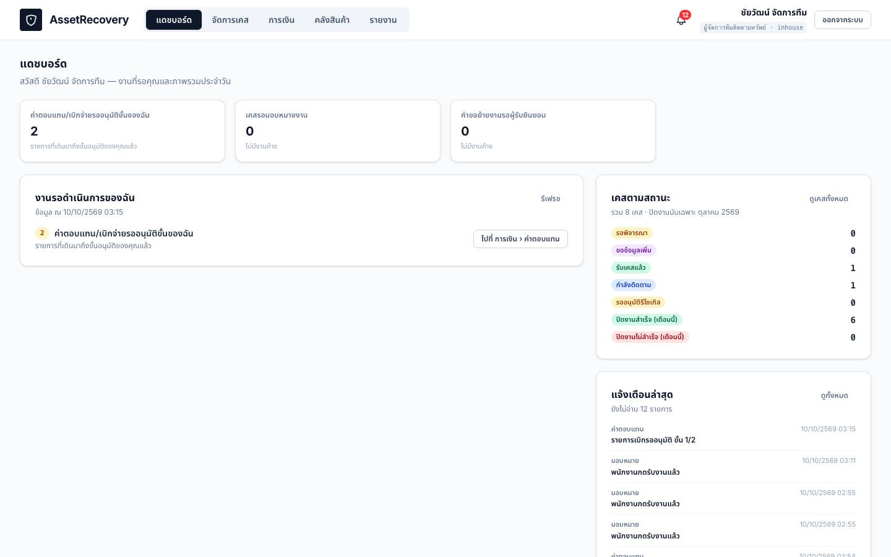

**ข้อควรระวัง / เคล็ดลับ**
- ลิงก์ **ดูเคสทั้งหมด** พาไปหน้า **มอบหมายงาน** ซึ่งแสดงเฉพาะเคสที่อยู่ระหว่าง *พร้อมมอบหมาย / มอบหมายแล้ว / รับงานแล้ว* — เคสที่ปิดงานแล้วจะไม่อยู่ในรายการนี้ ถ้าต้องการดูผลงานที่ปิดแล้วให้ดูจากตัวเลขบนแดชบอร์ดหรือรายงานของทีม

## ก2. มอบหมายงานให้พนักงาน (ผู้จัดการดูแลหลายทีม)

**เป้าหมาย:** ส่งเคสให้พนักงานในทีมที่เหมาะสม

**ก่อนเริ่ม:** เคสต้องอยู่สถานะ **พร้อมมอบหมาย**

**ขั้นตอน**
1. แดชบอร์ด → **ไปที่ มอบหมายงาน** (หรือเมนู **จัดการเคส › มอบหมายงาน**)
2. ใช้ตัวกรอง **ทุกทีมที่ดูแล** เพื่อเลือกทีมที่ต้องการ
3. กด **มอบหมาย** ที่แถวเคส → เลือกการ์ดพนักงาน → กด **ยืนยันมอบหมาย**
   (ขั้นตอนเลือกพนักงานเหมือนกับของหัวหน้าทีม — ดู [ข3](#ข3-เปรียบเทียบพนักงานและมอบหมายงาน))


**ผลที่ควรเห็น:** เคสเปลี่ยนเป็น **มอบหมายแล้ว (รอรับ)** และแถวแสดงเวลา "มอบหมายเมื่อ …"

**เคล็ดลับ**
- ในหน้าต่างมอบหมายจะเห็น **แผนค่าตอบแทนของทีม** ด้วย เช่น ค่าน้ำมันแบบตามระยะทาง 5.00 บาท/กม. เพดาน 400.00 บาท/เคส — ช่วยประเมินต้นทุนก่อนส่งงาน

## ก3. ขอย้ายงานที่พนักงานรับแล้ว

**เป้าหมาย:** เปลี่ยนผู้รับผิดชอบเคส

**ก่อนเริ่ม:** รู้ว่าเคสอยู่ในสถานะไหน
- ถ้า **ยังไม่รับงาน** (มอบหมายแล้ว รอรับ) → เปลี่ยนคนได้ทันที
- ถ้า **รับงานแล้ว** → ระบบจะส่ง **คำขอ** ไปให้พนักงานคนเดิมยินยอมก่อน

**ขั้นตอน**
1. **จัดการเคส › มอบหมายงาน** → ตัวกรองสถานะเลือก **รับงานแล้ว**
2. กด **เปลี่ยนผู้รับผิดชอบ** ที่แถวเคส
3. เลือกพนักงานคนใหม่ (การ์ดคนเดิมจะมีป้าย **ผู้รับผิดชอบปัจจุบัน**)
4. กรอก **เหตุผลในการเปลี่ยนผู้รับผิดชอบ** (อย่างน้อย 5 ตัวอักษร) — ระบบแจ้งว่า "เคสนี้รับงานแล้ว — ต้องขอความยินยอมก่อน"
5. กด **ส่งคำขอเปลี่ยนผู้รับผิดชอบ**

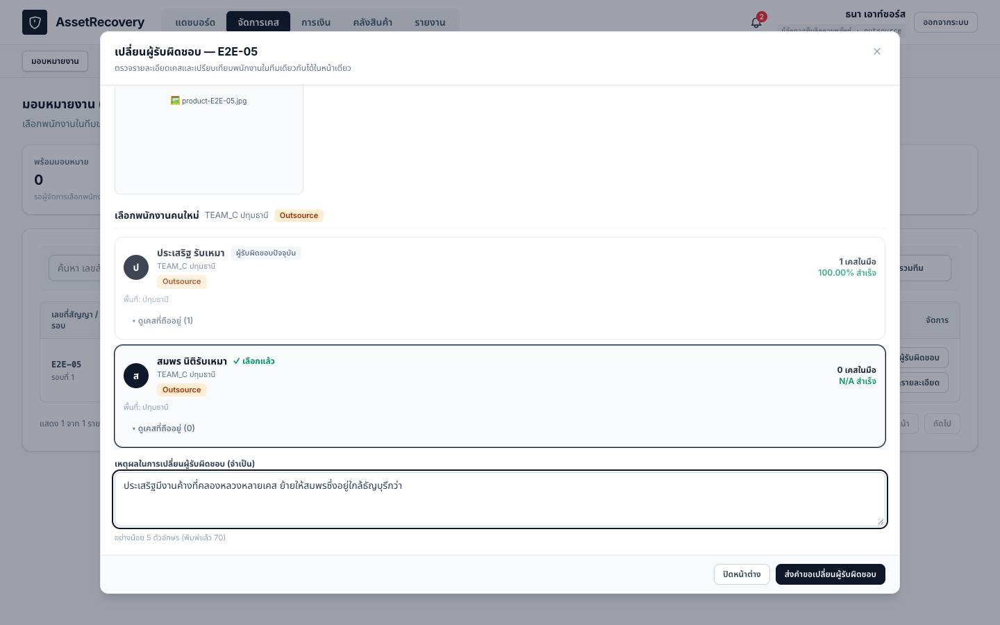

**ผลที่ควรเห็น:** ข้อความ "ส่งคำขอแล้ว — … รอ … ยืนยันก่อนเปลี่ยนเป็น …" และแถวเคสมีป้ายคำขอค้าง

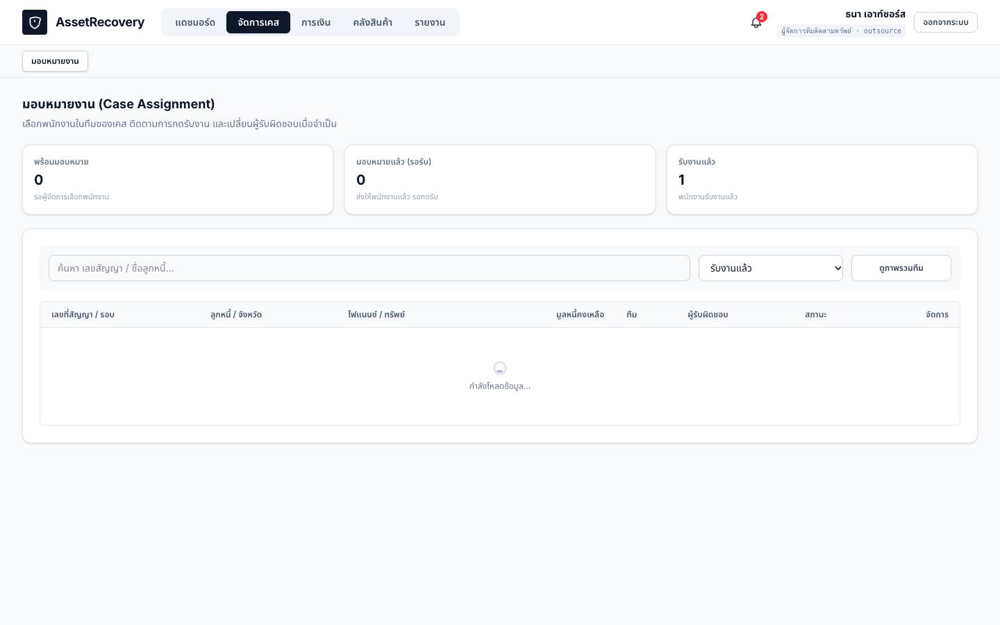

**ข้อควรระวัง / เคล็ดลับ**
- พนักงานคนเดิมมีเวลาตอบ **3 ชั่วโมง** — ถ้าไม่ตอบภายในเวลา ระบบย้ายงานให้อัตโนมัติ
- เมื่อพนักงานกดยินยอม คุณจะได้แจ้งเตือน "พนักงานยินยอมเปลี่ยนผู้รับผิดชอบแล้ว" และเคสไปรอรับที่พนักงานคนใหม่
- เขียนเหตุผลให้ชัด เพราะพนักงานคนเดิมจะเห็นข้อความนี้

## ก4. อนุมัติรายการเบิกขั้นที่ 1

**เป้าหมาย:** ตรวจและอนุมัติค่าตอบแทน/ค่าใช้จ่ายของพนักงานในทีม ก่อนส่งต่อให้การเงิน (ขั้นที่ 2)

**ก่อนเริ่ม — รายการจะเข้าคิวคุณเมื่อไร**
| ประเภทรายการ | เข้าคิวผู้จัดการเมื่อ |
|---|---|
| คอมมิชชั่น / ค่าน้ำมันตามระยะทาง ของเคส **ปิดงานสำเร็จ** | หลังคลัง **ยืนยันล็อตส่งมอบ** ของเครื่องนั้นแล้วเท่านั้น (ก่อนหน้านั้นสถานะ "รอยืนยันคืนคลัง") |
| เบี้ยเสี่ยงของเคส **ปิดงานไม่สำเร็จ** | ทันทีที่พนักงานปิดงาน |
| ค่าที่พัก / ค่าใช้จ่ายเบิกแยก | ทันทีที่พนักงานส่งคำขอ |
| ค่าน้ำมันเหมาจ่ายรายวัน / เบี้ยเลี้ยง | หลังระบบสรุปวันลงพื้นที่ (ทุกคืนหลังเที่ยงคืน) |

**ขั้นตอน**
1. แดชบอร์ด การ์ด **ค่าตอบแทน/เบิกจ่ายรออนุมัติขั้นของฉัน** → **ไปที่ การเงิน › ค่าตอบแทน** (หรือเมนู **การเงิน** แท็บค่าตอบแทน)
2. ตารางแสดง เคส/ผู้รับเงิน · ประเภท · สูตร (เช่น "34.46 กม. × 5.00 บาท/กม.") · Gross / WHT / Net · สถานะ/ขั้น
3. กด **รายละเอียด** เพื่อดูวันที่ · อ้างอิงเคส · ยอด · หมายเหตุผู้เบิก · คำชี้แจงตอนส่งใหม่ · **เปิดดูใบเสร็จ**
4. กด **ดูสูตร** เพื่อดู GROSS / WHT / NET และประวัติการอนุมัติ
5. ถ้าถูกต้อง กด **อนุมัติขั้น 1**

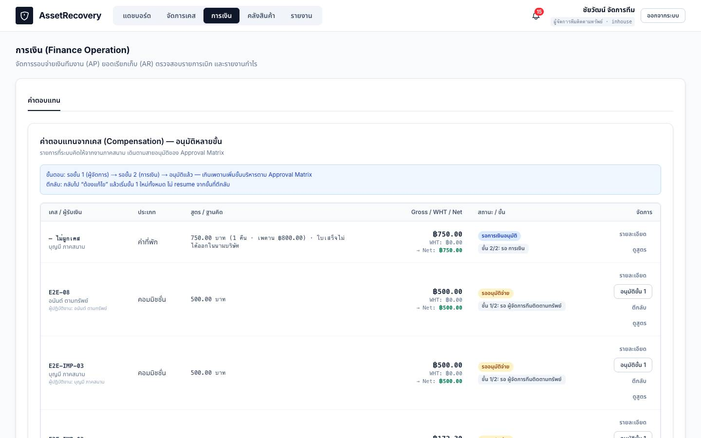

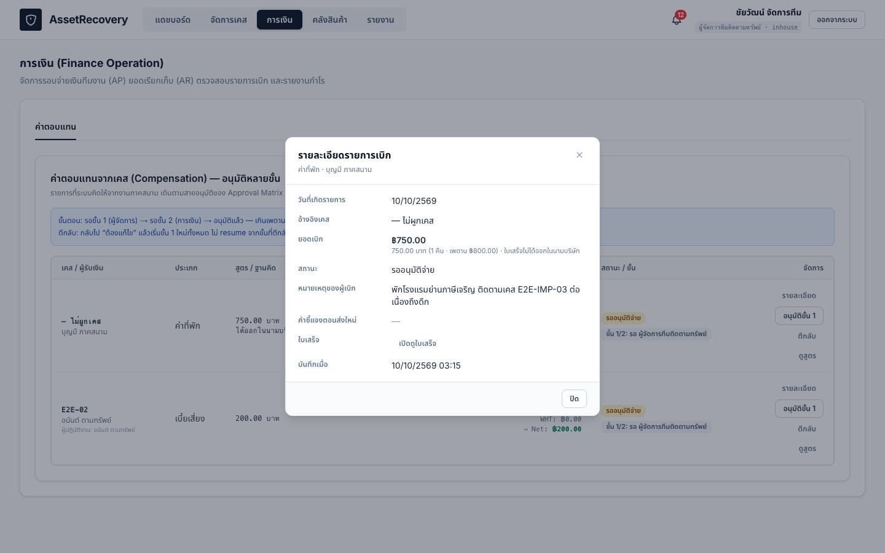

**ผลที่ควรเห็น:** ข้อความ "อนุมัติแล้ว — <ชื่อ> — <ประเภท>" และสถานะเป็น **รอการเงินอนุมัติ — ขั้น 2/2: รอ การเงิน**

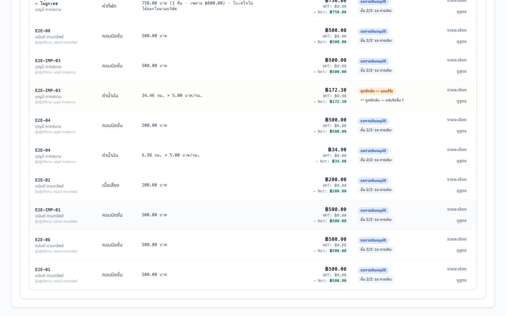

**ข้อควรระวัง / เคล็ดลับ**
- กด **อนุมัติขั้น 1** แล้วมีผลทันที **ไม่มีหน้าต่างถามยืนยัน** — ตรวจรายละเอียดก่อนกดทุกครั้ง
- อนุมัติได้ **ทีละแถว** (ยังไม่มีปุ่มอนุมัติหลายรายการพร้อมกัน)
- คุณเห็นเฉพาะรายการของทีมที่ตัวเองดูแล รายการที่อยู่ขั้น 2/2 แล้วจะแสดงไว้ดูอย่างเดียว
- ช่อง WHT ในคิวเป็น **ยอดคาดการณ์** — ถ้ายอดต่อรายการต่ำกว่า 1,000 บาท อาจเห็นอัตรา 3.00% คู่กับยอด 0.00 บาท ซึ่งหมายถึง "ยังไม่ถึงเกณฑ์หัก" ยอดหักจริงคำนวณตอนการเงินสร้างรอบจ่ายจากยอดรวมต่อคน
- ค่าน้ำมันตามระยะทาง หน้ารายละเอียดแสดงเพียงระยะทาง × อัตรา (ไม่มีแผนที่/จุดเช็คอิน) — ถ้าสงสัยระยะทางให้ **ตีกลับ** เพื่อขอคำชี้แจง (บท ก5)
- รายการที่พนักงานส่งใหม่หลังถูกตีกลับ ในตารางไม่มีป้ายแยก ให้เปิด **รายละเอียด** แล้วดูหัวข้อ **คำชี้แจงตอนส่งใหม่**
- ถ้าสงสัยว่า **หลักฐานปิดงาน** ไม่น่าเชื่อถือ (รูป/วิดีโอ) ให้แจ้ง **เจ้าหน้าที่อนุมัติเคส** เป็นผู้ตีกลับหลักฐาน — ไม่ใช่ตีกลับรายการเบิก
- ถ้าตารางว่าง "ยังไม่มีรายการค่าตอบแทน" ไม่ได้แปลว่าทีมไม่มีค่าตอบแทน — อาจยังรอคลังยืนยันล็อตอยู่

## ก5. ตีกลับรายการเบิกให้พนักงานแก้ไข

**เป้าหมาย:** ส่งรายการกลับให้พนักงานชี้แจง/แก้ไข

**ขั้นตอน**
1. ในแท็บค่าตอบแทน กด **ตีกลับ** ที่แถวรายการ
2. อ่านคำอธิบาย: รายการจะกลับไป "ต้องแก้ไข" และ **เริ่มขั้น 1 ใหม่ทั้งหมด**
3. กรอก **เหตุผล** (บังคับ — ปุ่มกดได้เมื่อกรอกแล้ว) → กด **ตีกลับรายการ**

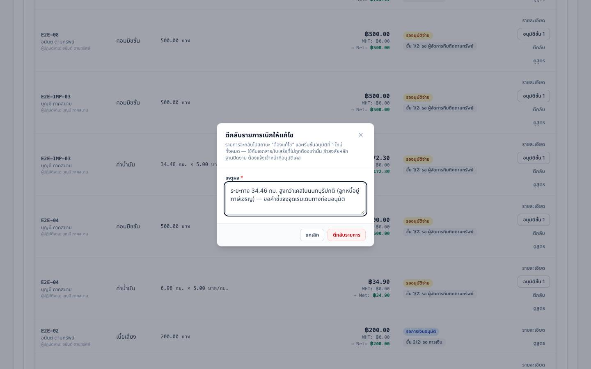

**ผลที่ควรเห็น:** ข้อความ "ตีกลับให้แก้ไขแล้ว — รายการกลับไปเริ่มที่ขั้น 1 ใหม่ทั้งหมด" · แถวแสดง **ถูกตีกลับ — รอแก้ไข** · พนักงานแก้และส่งกลับได้บนมือถือ (บท ค16) แล้วรายการจะกลับมาในคิวของคุณอีกครั้ง

**เคล็ดลับ:** ยอดที่ระบบคำนวณ (คอมมิชชั่น/ค่าน้ำมัน) พนักงานแก้ตัวเลขเองไม่ได้ — สิ่งที่พนักงานส่งกลับมาคือ **คำชี้แจง** เท่านั้น

## ก6. ดูคลังสินค้าของทีม

**เป้าหมาย:** ตรวจว่าเครื่องที่ทีมยึดคืนมาเข้าคลัง/ส่งมอบแล้วหรือยัง

**ขั้นตอน**
1. เมนู **คลังสินค้า** → เลือกแท็บ (เช่น **ส่งมอบแล้ว**)
2. กด **ดูรายการ** ที่ล็อตเพื่อดูเครื่องในล็อต

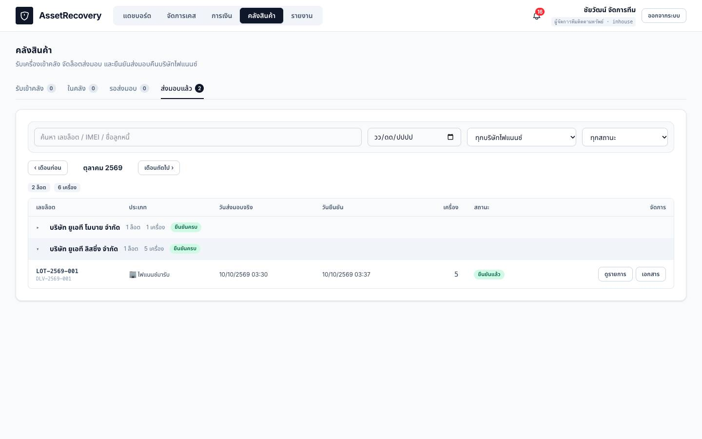

**ข้อควรระวัง**
- เห็นเฉพาะ **เครื่องของทีมตัวเอง** และเป็นแบบอ่านอย่างเดียว — ไม่มีปุ่มรับเข้า/สร้างล็อต/ส่งออก
- ปุ่ม **เอกสาร** ของล็อตจะขึ้น "ไม่พบไฟล์ที่แนบไว้" และกดเปิดไฟล์ไม่ได้ — ไฟล์ไม่ได้หาย แต่ใบเซ็นรับเปิดดูได้เฉพาะฝ่ายคลัง ถ้าต้องการให้ขอจากธุรการ

---

# ภาค ข — หัวหน้าทีม

## ข1. ดูคิวรอมอบหมาย

**ขั้นตอน**
1. เข้าสู่ระบบ → **แดชบอร์ด** ดูการ์ด **เคสรอมอบหมายงาน**
2. กด **ไปที่ มอบหมายงาน** ระบบเปิดหน้า **มอบหมายงาน** ที่กรองสถานะ **พร้อมมอบหมาย** ไว้ให้

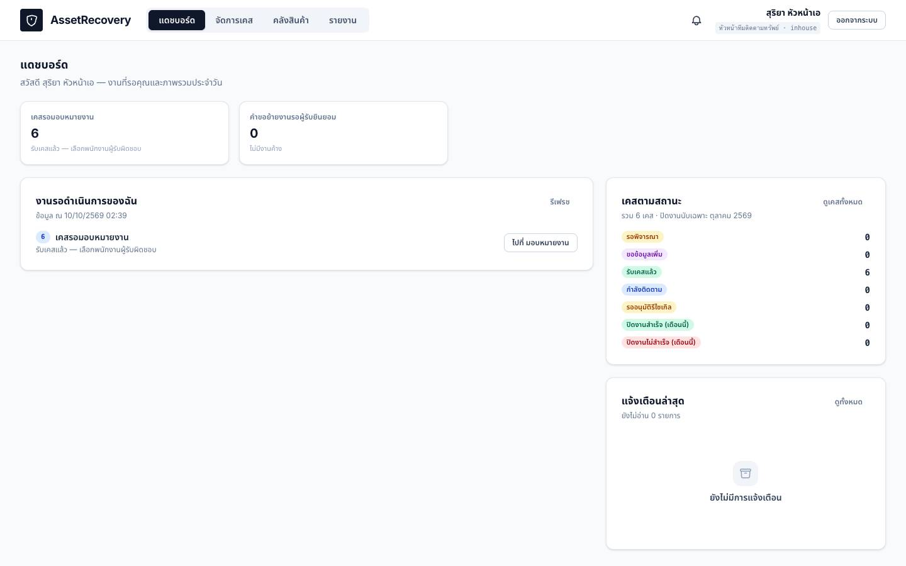

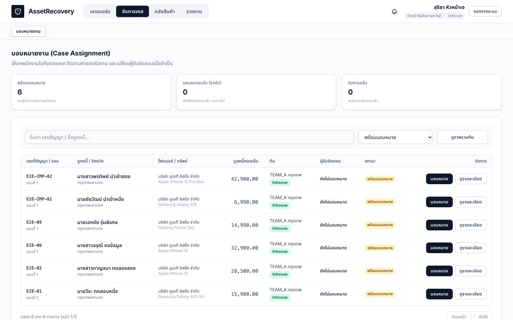

**เคล็ดลับ:** หน้ามอบหมายงานอาจขึ้น "กำลังเปิดหน้า..." 2–4 วินาทีก่อนตารางแสดง ให้รอสักครู่

## ข2. ดูรายละเอียดเคสก่อนมอบหมาย

**ขั้นตอน**
1. กด **ดูรายละเอียด** ที่แถวเคส
2. อ่านข้อมูลลูกหนี้ · ทรัพย์ · ประมาณการรายได้ · ค่าใช้จ่ายของทีมตามแผน · เอกสารแนบ (สัญญา บัตรประชาชน รูปสินค้า)
3. กด **ปิดหน้าต่าง**

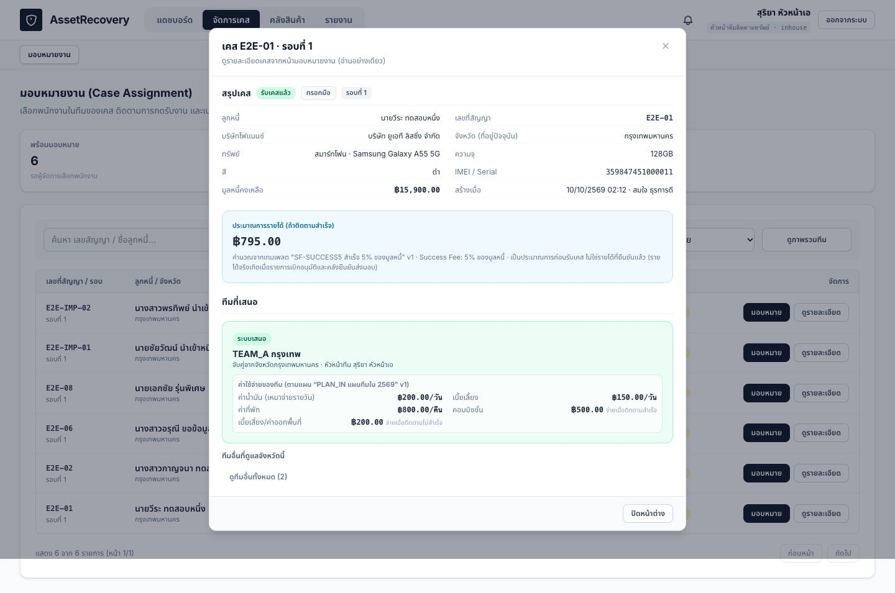

## ข3. เปรียบเทียบพนักงานและมอบหมายงาน

**เป้าหมาย:** เลือกพนักงานที่เหมาะสมที่สุดจากภาระงาน/ผลงาน/พื้นที่

**ขั้นตอน**
1. กด **มอบหมาย** ที่แถวเคส
2. เลื่อนลงส่วน **เลือกพนักงาน** — การ์ดพนักงานแต่ละคนแสดง:
   - จำนวน **เคสในมือ** · **% สำเร็จ** · **พื้นที่** · ปุ่ม **▾ ดูเคสที่ถืออยู่**
3. แตะการ์ดพนักงานที่ต้องการ (ขึ้น ✓ เลือกแล้ว)
4. กด **ยืนยันมอบหมาย**

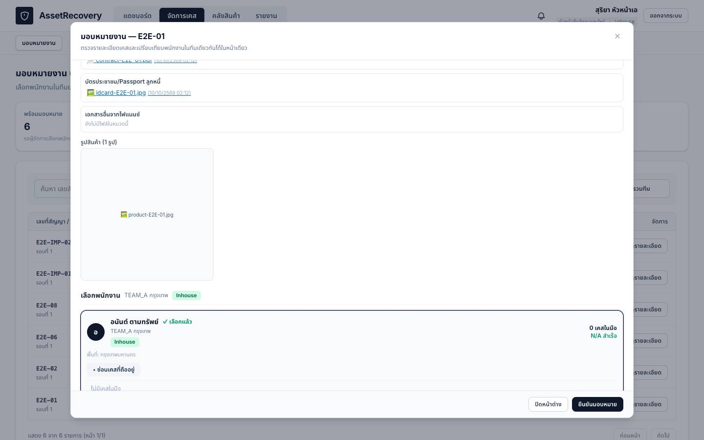

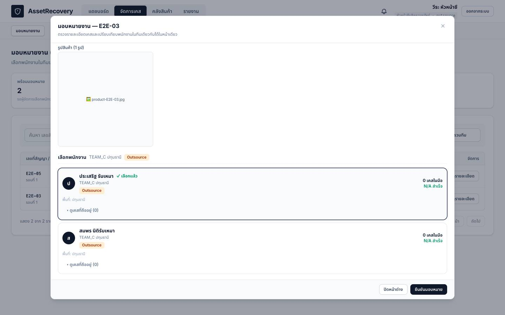

**ผลที่ควรเห็น:** หน้าต่างปิด เคสหายจากตัวกรอง **พร้อมมอบหมาย** การ์ด **มอบหมายแล้ว (รอรับ)** เพิ่มขึ้น และแถวแสดง "มอบหมายเมื่อ …"

| ช่อง | ตัวอย่าง | หมายเหตุ |
|---|---|---|
| เลือกพนักงาน | พนักงานในทีม A | เลือกได้เฉพาะพนักงานใน **ทีมของเคส** |

**ข้อควรระวัง / เคล็ดลับ**
- หลังกด **ยืนยันมอบหมาย** หน้าต่างจะปิดเลยโดยไม่มีข้อความยืนยัน — ให้ตรวจผลโดยเปลี่ยนตัวกรองสถานะเป็น **มอบหมายแล้ว (รอรับ)**
- ถ้าองค์กรตั้งค่าไม่ให้หัวหน้าทีมมอบหมาย ปุ่ม **มอบหมาย** จะไม่แสดง — ให้ผู้จัดการทีมเป็นผู้มอบหมาย
- จะมอบหมายหลายเคสให้คนเดียวกัน ต้องทำทีละเคส

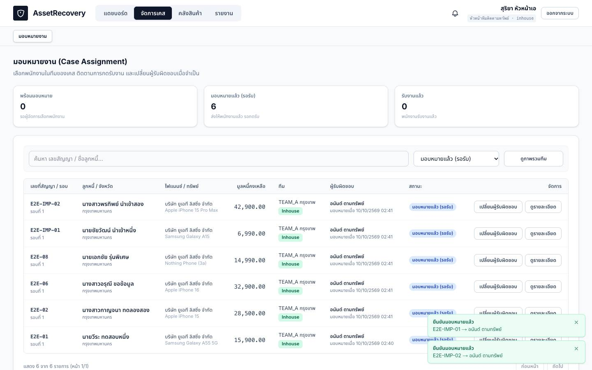

## ข4. ดูภาพรวมทีม

**ขั้นตอน**
1. ในหน้ามอบหมายงาน กด **ดูภาพรวมทีม**
2. กรองตามจังหวัด/สถานะได้

**ผลที่ควรเห็น:** คอลัมน์ต่อพนักงาน พร้อมการ์ดเคสที่แต่ละคนถืออยู่ — ใช้ดูว่าใครงานล้นหรือว่าง

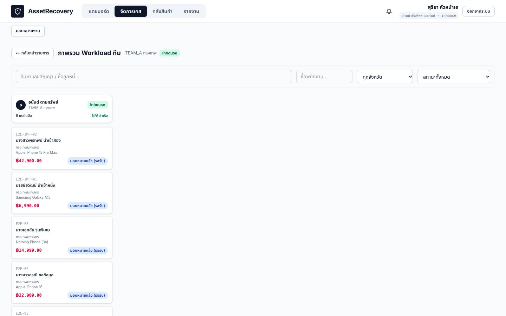

## ข5. มอบหมายเคสรอบที่ 2 (เคสรีไซเกิล)

**เป้าหมาย:** ส่งเคสที่เคยปิดไม่สำเร็จ และได้รับอนุมัติให้ติดตามใหม่ กลับไปให้พนักงาน

**ก่อนเริ่ม:** เคสที่ปิดไม่สำเร็จจะกลับมาให้มอบหมายได้ก็ต่อเมื่อ **เจ้าหน้าที่อนุมัติเคส** ขอรีไซเกิลและอนุมัติแล้ว

**ขั้นตอน**
1. หน้ามอบหมายงาน แถวเคสจะแสดง **รอบที่ 2** และ **พร้อมมอบหมาย**
2. กด **มอบหมาย** → เลือกพนักงาน → **ยืนยันมอบหมาย**

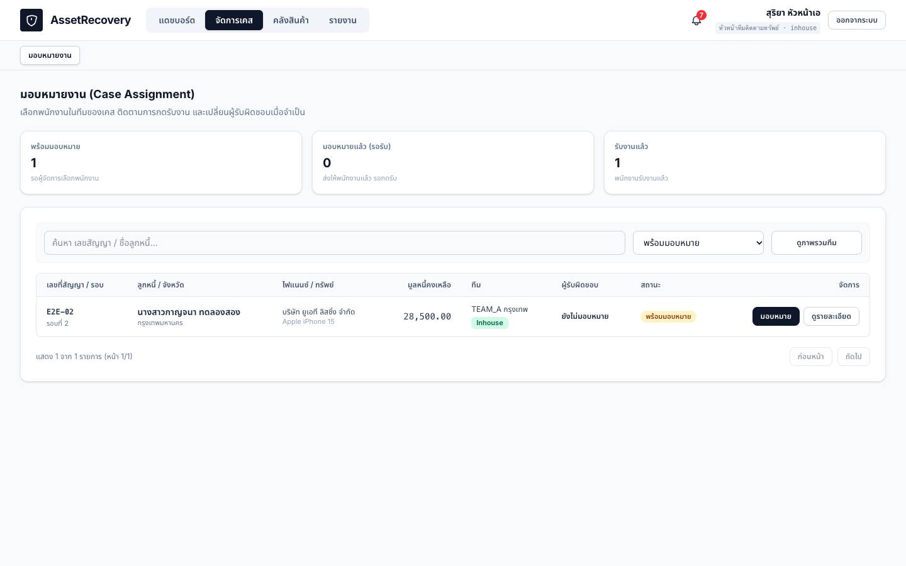

**เคล็ดลับ:** การ์ด "รอรับงาน" บนมือถือพนักงานไม่ได้บอกว่าเป็นรอบที่ 2 — ถ้ามอบหมายให้คนเดิมหรือคนใหม่ ควรโทรแจ้งพนักงานว่าเป็นเคสติดตามซ้ำ พร้อมข้อมูลใหม่ (เช่น ที่อยู่ใหม่)

## ข6. ใช้งานบนมือถือ

หน้าจอของหัวหน้าและผู้จัดการ (แดชบอร์ด · มอบหมายงาน · การเงิน) เปิดบนมือถือได้ โดยไม่ต้องเลื่อนซ้าย-ขวา เหมาะสำหรับมอบหมายงานด่วนนอกสำนักงาน

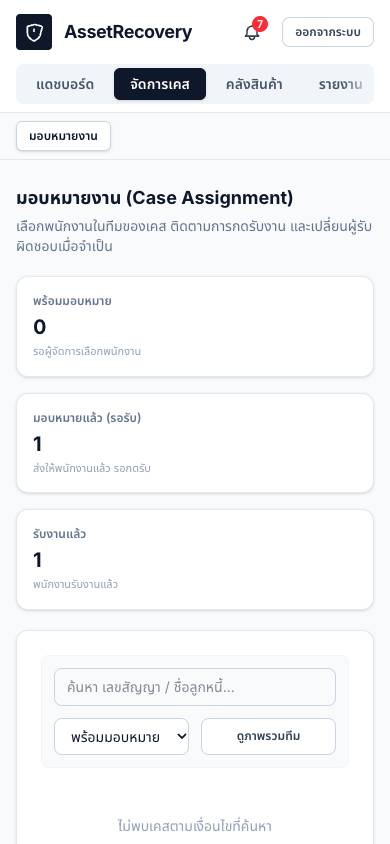

---

# ภาค ค — พนักงานภาคสนาม (แอปมือถือ)

## ค1. ติดตั้งแอปลงหน้าจอโฮมและเปิดการแจ้งเตือน

**เป้าหมาย:** เปิดแอปได้ด้วยไอคอนเดียว และได้รับแจ้งเตือนทันทีเมื่อมีงานใหม่

**ขั้นตอน — iPhone (Safari)**
1. เปิด `https://<โดเมนระบบ>/login` ด้วย **Safari** แล้วเข้าสู่ระบบ
2. ที่หน้าแรกจะมีกรอบ **เพิ่มแอปนี้ลงหน้าจอโฮมเพื่อรับการแจ้งเตือนทันที**
3. กดปุ่ม **แชร์** ของ Safari (สี่เหลี่ยมมีลูกศรชี้ขึ้น) → เลือก **เพิ่มไปยังหน้าจอโฮม** → **เพิ่ม**
4. เปิดแอปจากไอคอน **AssetRecovery** บนหน้าจอโฮม
5. ถ้ามีแถบ **เปิดการแจ้งเตือนเพื่อรู้ทันทีเมื่อมีเคสใหม่หรือคำขอเปลี่ยนผู้รับผิดชอบ** ให้กด **เปิดการแจ้งเตือน** แล้วกด **อนุญาต**

**ขั้นตอน — Android (Chrome)**
1. เปิด `https://<โดเมนระบบ>/login` ด้วย **Chrome** แล้วเข้าสู่ระบบ
2. กดเมนู **⋮** มุมขวาบน → **ติดตั้งแอป** หรือ **เพิ่มลงในหน้าจอหลัก**
3. เปิดแอปจากไอคอน แล้วกด **เปิดการแจ้งเตือน** → **อนุญาต**

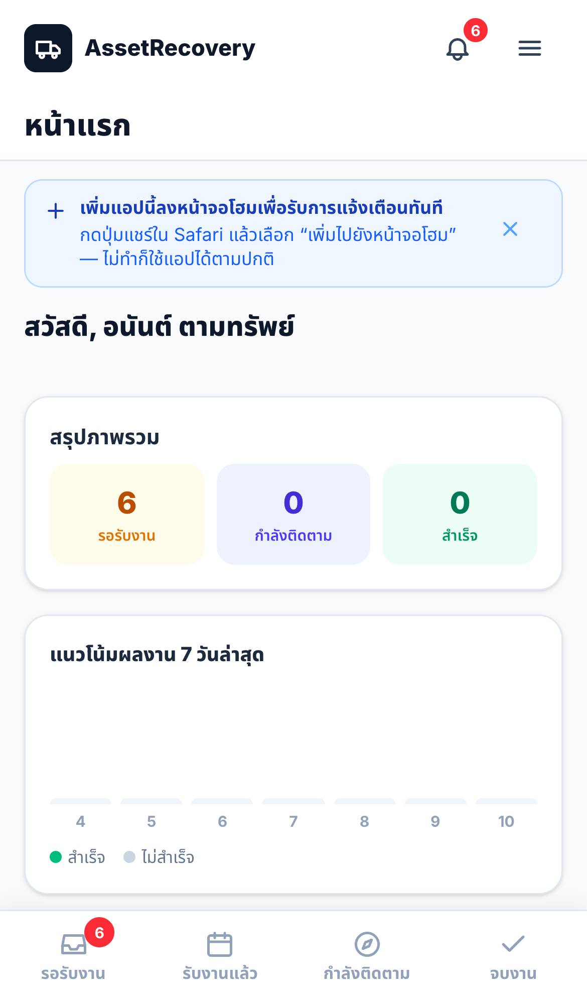

**ผลที่ควรเห็น:** ข้อความ "เปิดการแจ้งเตือนบนอุปกรณ์นี้แล้ว" · แอปเปิดเต็มจอเหมือนแอปทั่วไป

**ข้อควรระวัง / เคล็ดลับ**
- ไม่ติดตั้งก็ใช้งานได้ตามปกติผ่านเบราว์เซอร์ แต่บน iPhone **ต้องติดตั้งลงหน้าจอโฮมก่อน** จึงจะได้รับแจ้งเตือนแบบเด้งบนเครื่อง
- **ต้องอนุญาตตำแหน่ง (Location)** ให้แอป/เบราว์เซอร์ ไม่อย่างนั้นจะเช็คอินไม่ได้ — iPhone: การตั้งค่า › ความเป็นส่วนตัว › บริการหาตำแหน่ง › Safari → "ขณะใช้แอป"
- แอปที่ติดตั้งแล้วไม่มีปุ่มรีเฟรชของเบราว์เซอร์ ถ้าข้อมูลดูไม่อัปเดตให้ปิดแอปแล้วเปิดใหม่ หรือกดปุ่ม **ลองใหม่** ที่ระบบแสดง

## ค2. รู้จักหน้าจอแอป

| ส่วน | อยู่ที่ไหน | ใช้ทำอะไร |
|---|---|---|
| **แท็บด้านล่าง** | ล่างสุดของจอ | **รอรับงาน · รับงานแล้ว · กำลังติดตาม · จบงาน** (ตัวเลขแดง = งานที่ต้องทำ) |
| **กระดิ่ง 🔔** | มุมขวาบน | การแจ้งเตือน (ตัวเลข = ยังไม่อ่าน) |
| **เมนู ☰** | มุมขวาบน | **งานของฉัน:** หน้าแรก · รอรับงาน · รับงานแล้ว (จัดวันที่) · กำลังติดตาม · จบงาน — **การเงิน:** เบิกค่าใช้จ่าย · เงินทดรองจ่าย · สรุปรายได้ — และออกจากระบบ |
| **หน้าแรก** | เมนู ☰ › หน้าแรก | สรุปภาพรวม รอรับงาน / กำลังติดตาม / สำเร็จ · แนวโน้มผลงาน 7 วัน · แถบคำขอย้ายงาน (ถ้ามี) |

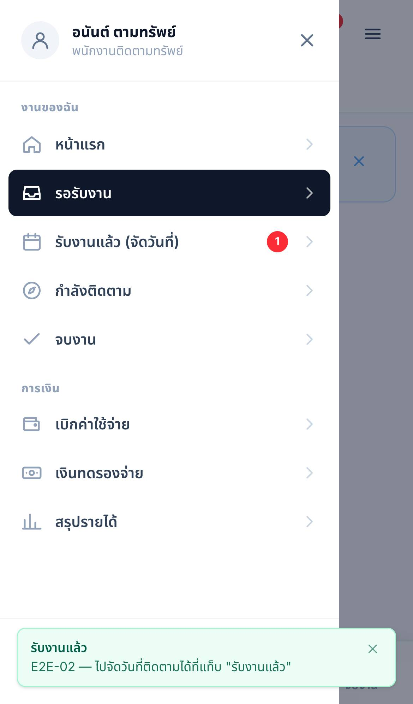

**ข้อควรระวัง:** แอปยังไม่มีหน้าโปรไฟล์/ข้อมูลรับเงิน (บัญชีธนาคาร เลขผู้เสียภาษี) ให้ตรวจเอง — ถ้าข้อมูลไม่ครบจะมีข้อความเตือนในหน้า **เบิกค่าใช้จ่าย** ให้ติดต่อฝ่ายการเงิน/ผู้ดูแลระบบเพื่อตรวจหรือแก้ไข

## ค3. รับงาน

**เป้าหมาย:** ตอบรับเคสใหม่ที่หัวหน้าทีมมอบหมาย

**ขั้นตอน**
1. แตะแท็บ **รอรับงาน**
2. แต่ละการ์ดแสดงชื่อลูกหนี้ พื้นที่ และ **จะได้รับถ้าจบงานสำเร็จ ฿…** (คอมมิชชั่นตามแผนทีม)
3. กด **ดูรายละเอียด** เพื่อดูที่อยู่ (กดเปิด Google Maps ได้) · ช่องทางติดต่อ · เอกสาร · รูปสินค้า
4. กด **รับงาน**

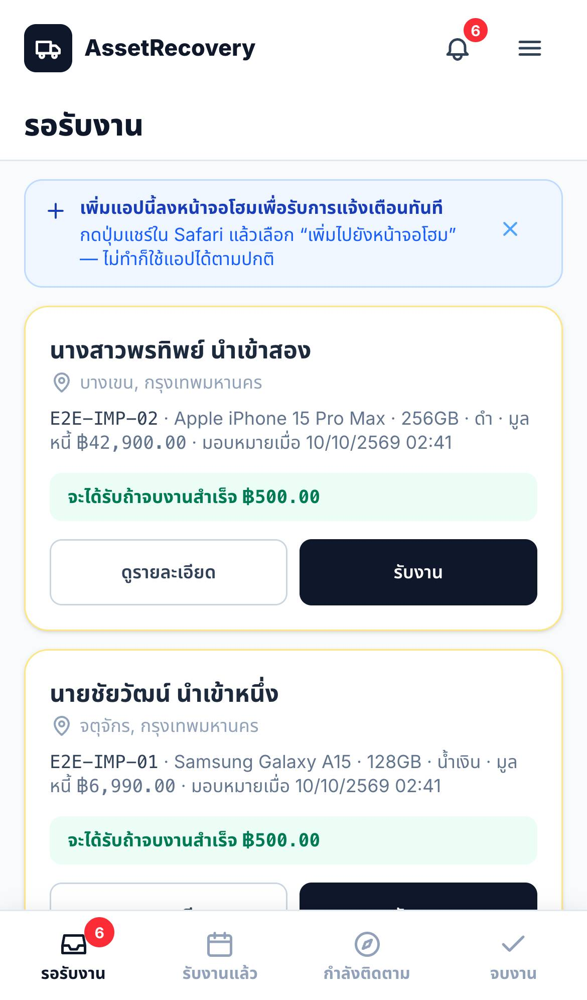

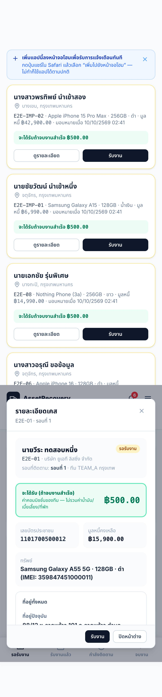

**ผลที่ควรเห็น:** การ์ดหายจาก **รอรับงาน** ไปอยู่ที่ **รับงานแล้ว** (อาจมีข้อความ "รับงานแล้ว … ไปจัดวันที่ติดตามได้ที่แท็บ รับงานแล้ว")

**ข้อควรระวัง:** ปุ่ม **รับงาน** ไม่มีหน้าต่างถามยืนยัน — กดแล้วรับทันที อ่านรายละเอียดก่อนกด

## ค4. จัดวันที่ติดตาม

**เป้าหมาย:** กำหนดว่าจะออกไปติดตามเคสนี้วันไหน

**ขั้นตอน**
1. แตะแท็บ **รับงานแล้ว**
2. กด **จัดวันที่** ที่การ์ดเคส
3. เลือกวันในปฏิทิน
4. หน้าต่างยืนยัน "ยืนยันจัดเคส … ลงวันนี้?" → กด **ยืนยันเลือกวันนี้**

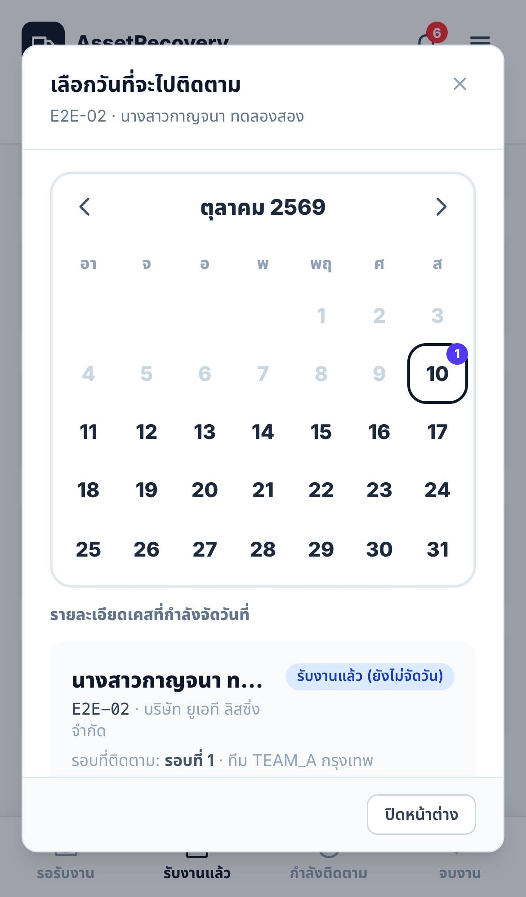

**ผลที่ควรเห็น:** เคสย้ายไปแท็บ **กำลังติดตาม** จัดกลุ่มตามวัน

| ช่อง | ตัวอย่าง | หมายเหตุ |
|---|---|---|
| วันที่ติดตาม | 10/10/2569 (วันนี้) หรือ 15/10/2569 | เลือกวันที่ผ่านมาแล้วไม่ได้ |

**เคล็ดลับ**
- ตัวเลขเล็กใต้แต่ละวันคือจำนวนเคสที่คุณจัดไว้วันนั้นแล้ว ช่วยกระจายงานไม่ให้กระจุกวันเดียว
- จัดวันล่วงหน้าได้ เคสจะรอในแท็บกำลังติดตามใต้หัววันนั้น

## ค5. เรียงลำดับเคสในวัน

**เป้าหมาย:** วางลำดับการเดินทางของวันด้วยตัวเอง

> **สำคัญ:** ระบบ **ไม่จัดเส้นทางให้อัตโนมัติ** — พนักงานต้องเรียงลำดับเคสเองตามเส้นทางที่วางแผนไว้

**ขั้นตอน**
1. แตะแท็บ **กำลังติดตาม** — เคสจัดกลุ่มตามวัน มีหมายเลขลำดับ 1, 2, 3 …
2. **ลาก** ที่จุดจับ ⋮⋮ ด้านซ้ายการ์ด หรือกดปุ่ม **▲ / ▼** เพื่อสลับลำดับ

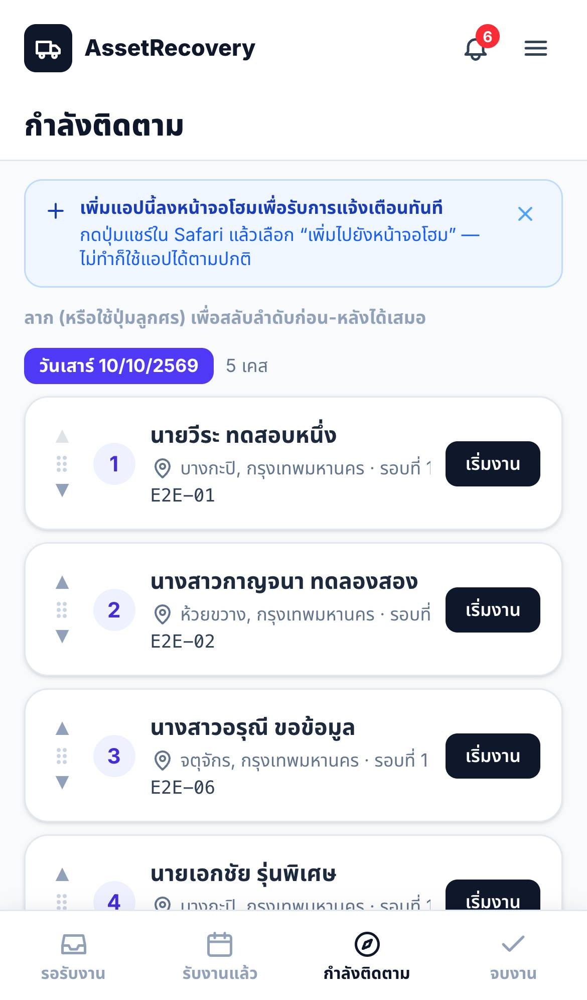

**เคล็ดลับ:** เปิด **ดูรายละเอียด** แต่ละเคสเพื่อกดเปิดที่อยู่ใน Google Maps ประกอบการวางลำดับ — สลับลำดับได้ตลอดทั้งวัน

## ค6. เริ่มงานและจุดเริ่มเดินทาง

**เป้าหมาย:** เริ่มทำเคส และ (ถ้าทีมคิดค่าน้ำมันตามระยะทาง) บันทึกจุดออกเดินทาง

**ขั้นตอน**
1. แท็บ **กำลังติดตาม** → กด **เริ่มงาน** ที่การ์ดเคส ระบบเปิดฟอร์ม **ปิดงาน** ทันที
2. **เฉพาะทีมที่คิดค่าน้ำมันตามระยะทาง:** ด้านบนฟอร์มมีส่วน **จุดเริ่มเดินทาง (สำหรับคำนวณค่าน้ำมัน)**
   - ระบบดึงพิกัดจาก GPS ให้อัตโนมัติ ("ดึงจาก GPS อัตโนมัติ")
   - ถ้าไม่ตรงจุดที่ออกเดินทางจริง **ลากหมุด** เพื่อปรับ หรือกด **ดึง GPS ใหม่**
3. ทำต่อที่บทเช็คอิน (ค7)

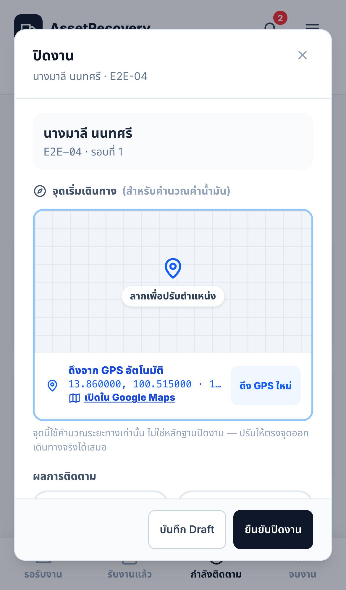

| ช่อง | ตัวอย่าง | หมายเหตุ |
|---|---|---|
| จุดเริ่มเดินทาง | 13.860000, 100.515000 | ใช้คำนวณระยะทางเท่านั้น ไม่ใช่หลักฐานปิดงาน · ปรับให้ตรงจุดออกเดินทางจริงได้เสมอ |

**ข้อควรระวัง / เคล็ดลับ**
- ทีมที่ได้ **ค่าน้ำมันเหมาจ่ายรายวัน** จะไม่มีส่วนจุดเริ่มเดินทาง — เป็นเรื่องปกติ
- ตั้งจุดเริ่มให้ตรงจริง (เช่น บ้าน/จุดนัดทีม) เพราะระบบใช้จุดนี้คู่กับจุดเช็คอินตอนปิดงานคำนวณระยะทาง ถ้าระยะทางสูงผิดปกติ ผู้จัดการอาจตีกลับขอคำชี้แจง
- หลังกด **เริ่มงาน** ปุ่มบนการ์ดจะเปลี่ยนเป็น **จบงาน** ใช้ปุ่มนี้เปิดฟอร์มเดิมกลับมาทำต่อ

## ค7. เช็คอินตำแหน่ง

**เป้าหมาย:** บันทึกพิกัดที่คุณไปถึงจริง เป็นหลักฐานการลงพื้นที่

**ขั้นตอน**
1. ในฟอร์ม **ปิดงาน** เลือก **ผลการติดตาม** (✅ สำเร็จ / ❌ ไม่สำเร็จ) — เลือกก่อนหรือหลังเช็คอินก็ได้
2. เมื่อถึงจุดหมาย กด **แตะเพื่อเช็คอินตำแหน่งปัจจุบัน**
3. ย้ายไปจุดถัดไป (เช่น ที่ทำงานลูกหนี้) แล้วกด **+ เช็คอินอีกจุด**

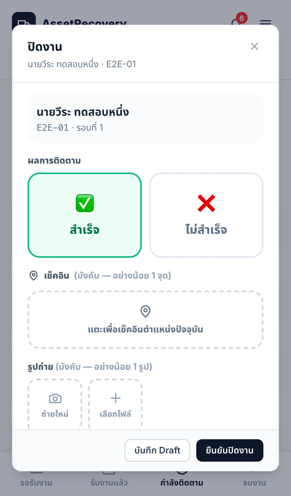

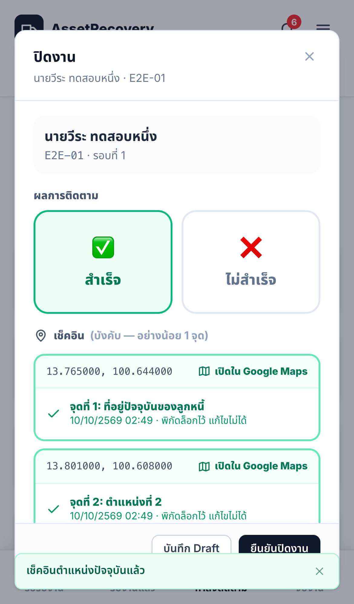

**ผลที่ควรเห็น:** แต่ละจุดแสดงพิกัด · ลิงก์ **เปิดใน Google Maps** · เวลา · "พิกัดล็อกไว้ แก้ไขไม่ได้"

**ข้อควรระวัง**
- ต้องเช็คอิน **อย่างน้อย 1 จุด** และ **ปักหมุดเองไม่ได้** — ต้องไปอยู่ที่จุดนั้นจริง
- เช็คอินแล้วแก้ไขพิกัดไม่ได้ ตรวจว่า GPS จับตำแหน่งได้แล้วก่อนกด (อยู่ที่โล่ง เปิด Location ความแม่นยำสูง)
- ทีมคิดค่าน้ำมันตามระยะทาง: ระบบใช้ **จุดเช็คอินตอนปิดงาน** เป็นปลายทางของการคำนวณ

## ค8. บันทึกร่าง (บันทึก Draft) แล้วกลับมาทำต่อ

**เป้าหมาย:** เก็บสิ่งที่กรอกไว้ระหว่างทาง โดยยังไม่ปิดงาน

**ขั้นตอน**
1. ในฟอร์มปิดงาน กรอกข้อมูลที่มี (ผลการติดตาม เช็คอิน บันทึกเพิ่มเติม)
2. กด **บันทึก Draft** — มีข้อความ "บันทึก Draft แล้ว กลับมาทำต่อได้ทีหลัง"
3. การ์ดเคสขึ้นป้าย **Draft** และปุ่มเป็น **จบงาน**
4. เมื่อพร้อม กด **จบงาน** เพื่อเปิดฟอร์มเดิม

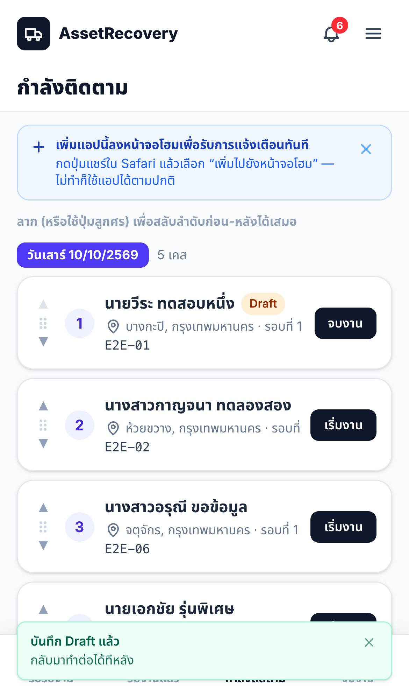

**ผลที่ควรเห็น:** ผลการติดตาม จุดเช็คอิน และบันทึกเพิ่มเติม ยังอยู่ครบ

**เคล็ดลับ:** กด **บันทึก Draft** ทุกครั้งหลังเช็คอินแต่ละจุด กันข้อมูลหายถ้าสัญญาณหลุดหรือแบตหมด

## ค9. ปิดงานสำเร็จ

**เป้าหมาย:** ส่งผลการยึดคืนเครื่องพร้อมหลักฐาน

**ก่อนเริ่ม:** มีเครื่องอยู่ในมือ เช็คอินอย่างน้อย 1 จุดแล้ว

**ขั้นตอน**
1. ฟอร์มปิดงาน → **ผลการติดตาม** เลือก **✅ สำเร็จ**
2. **รูปถ่าย** — กด **ถ่ายใหม่** (เปิดกล้อง) หรือ **เลือกไฟล์**
3. **วิดีโอ** — กด **ถ่ายใหม่** หรือ **เลือกไฟล์**
4. **รูปสินค้ายืนยัน** — ถ่ายรูปเครื่องที่ได้คืน ให้เห็น IMEI ชัด
5. **เสียง** (ถ้ามี) · **บันทึกเพิ่มเติม**
6. กด **ยืนยันปิดงาน**

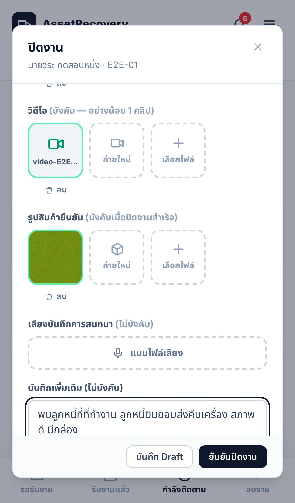

| ช่อง | บังคับ | หมายเหตุ |
|---|---|---|
| ผลการติดตาม | ✔ | สำเร็จ / ไม่สำเร็จ |
| เช็คอิน | ✔ อย่างน้อย 1 จุด | GPS เท่านั้น |
| รูปถ่าย | ✔ อย่างน้อย 1 รูป | ถ่ายใหม่หรือเลือกไฟล์ |
| วิดีโอ | ✔ อย่างน้อย 1 ไฟล์ | คลิปสั้น ๆ พอ |
| รูปสินค้ายืนยัน | ✔ เมื่อสำเร็จ | ควรเห็น IMEI |
| เสียง | – | ไม่บังคับ |
| บันทึกเพิ่มเติม | – | |

**ผลที่ควรเห็น:** ข้อความ "ปิดงานเรียบร้อย — ระบบสร้างรายการเบิกให้อัตโนมัติ: คอมมิชชั่น ฿…" (ทีมคิดค่าน้ำมันตามระยะทางจะเห็น "ค่าน้ำมัน ฿… · คอมมิชชั่น ฿…" ด้วย) · เคสย้ายไปแท็บ **จบงาน**

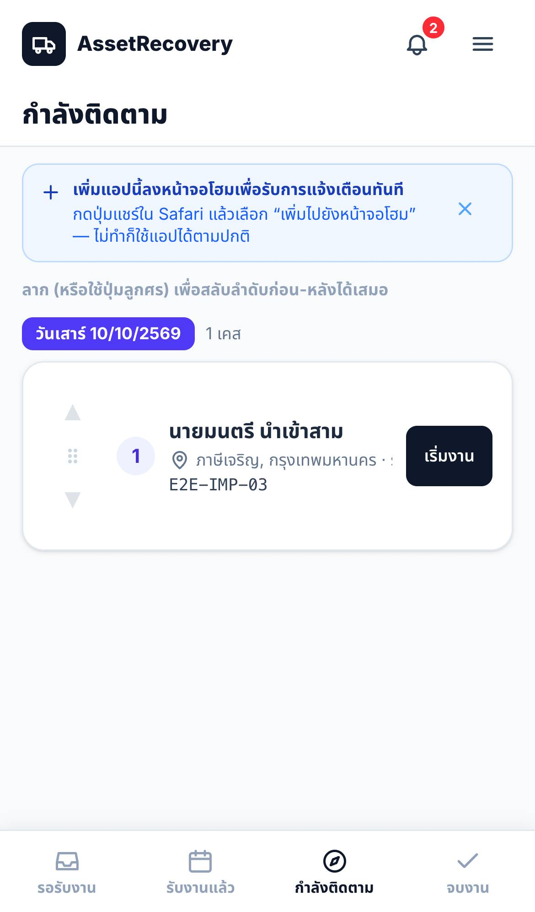

**ข้อควรระวัง / เคล็ดลับ**
- **ยืนยันปิดงาน** ไม่มีหน้าต่างถามซ้ำ ตรวจหลักฐานให้ครบก่อนกด
- ทีมคิดค่าน้ำมันตามระยะทาง การปิดงานใช้เวลาประมาณ 10 วินาที (ระบบคำนวณระยะทางผ่านแผนที่) อย่ากดซ้ำ
- ทีมค่าน้ำมันเหมาจ่ายรายวัน/เบี้ยเลี้ยง จะ **ไม่เห็น** ค่าน้ำมันในข้อความตอนปิดงาน — ระบบสรุปให้ทุกคืน (ดู [ภาคผนวก 3](#ภาคผนวก-3--ค่าน้ำมันและเบี้ยเลี้ยงคิดอย่างไร))
- หลังปิดงาน ให้นำเครื่องส่งคลัง — คอมมิชชั่นจะอยู่สถานะ **รอยืนยันคืนคลัง** จนกว่าคลังรับเข้าและยืนยันล็อตส่งมอบ
- ถ้าคลังพบว่าเครื่องไม่ตรง (เช่น IMEI ไม่ตรง) จะ **ตีกลับการรับเข้า** และคุณได้แจ้งเตือน "คลังตีกลับการรับเข้า" พร้อมเหตุผล — ในแอปไม่มีปุ่มให้ดำเนินการ ให้ประสานหัวหน้าทีมและนำเครื่องที่ถูกต้องไปส่งคลังอีกครั้ง

## ค10. ปิดงานไม่สำเร็จ

**ขั้นตอน**
1. กด **เริ่มงาน** (หรือ **จบงาน** ถ้ามีร่าง) → เลือก **❌ ไม่สำเร็จ**
2. เช็คอินจุดที่ไปจริง · แนบรูปถ่าย + วิดีโอ (ไม่ต้องมีรูปสินค้า)
3. เลือก **เหตุผลที่ไม่สำเร็จ** และอธิบายเพิ่มเติม
4. กด **ยืนยันปิดงาน**

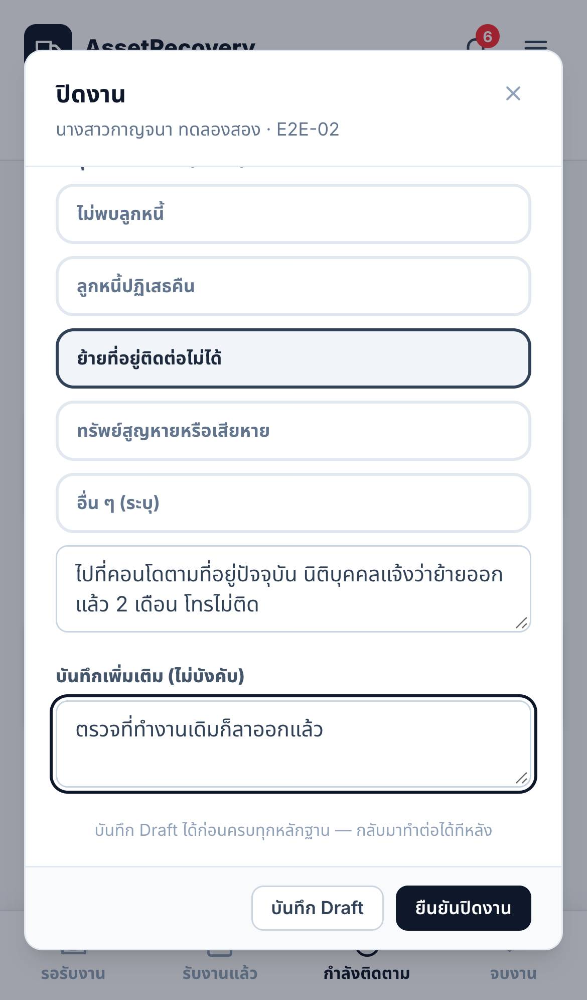

| ช่อง | ตัวเลือก | หมายเหตุ |
|---|---|---|
| เหตุผลที่ไม่สำเร็จ | ไม่พบลูกหนี้ · ลูกหนี้ปฏิเสธคืน · ย้ายที่อยู่ติดต่อไม่ได้ · ทรัพย์สูญหายหรือเสียหาย · อื่น ๆ (ระบุ) | บังคับ |
| อธิบายเพิ่มเติม | เช่น "เพื่อนบ้านแจ้งว่าย้ายออกไปแล้ว 2 เดือน" | ช่วยให้ทีมรับเคสตัดสินใจติดตามรอบใหม่ |

**ผลที่ควรเห็น:** "ปิดงานเรียบร้อย — … เบี้ยเสี่ยง ฿…" (ถ้าแผนทีมมีเบี้ยเสี่ยง) · รายการเบิกเข้าคิวผู้จัดการทันที (ไม่ต้องรอคลัง)

**เคล็ดลับ:** เคสไม่สำเร็จอาจถูกส่งกลับมาเป็น **รอบที่ 2** ถ้าบริษัทไฟแนนซ์ให้ข้อมูลใหม่ — เขียนรายละเอียดให้ครบจะช่วยรอบถัดไปมาก

## ค11. หลักฐานถูกตีกลับ — แก้แล้วส่งใหม่

**เป้าหมาย:** แก้รูป/วิดีโอตามที่เจ้าหน้าที่อนุมัติเคสขอ

**ก่อนเริ่ม:** คุณจะได้แจ้งเตือน "หลักฐานปิดงานถูกตีกลับ" พร้อมเหตุผลที่กระดิ่ง 🔔

**ขั้นตอน**
1. แท็บ **กำลังติดตาม** → กลุ่ม **ถูกตีกลับ ต้องแก้ไขหลักฐาน** → กด **แก้ไขหลักฐาน**
2. อ่าน **เหตุผลที่ถูกตีกลับ** ด้านบนฟอร์ม (ผลการติดตามและเช็คอินถูกล็อกไว้ แก้ไม่ได้)
3. กด **ลบ** ที่ไฟล์เดิมที่ไม่ผ่าน → ยืนยัน **ลบไฟล์** → แนบไฟล์ใหม่ (เพิ่มรูปได้)
4. กด **ส่งกลับยืนยันอีกครั้ง**

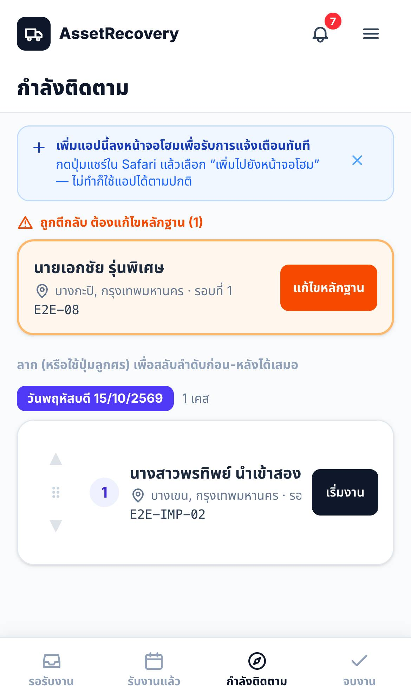

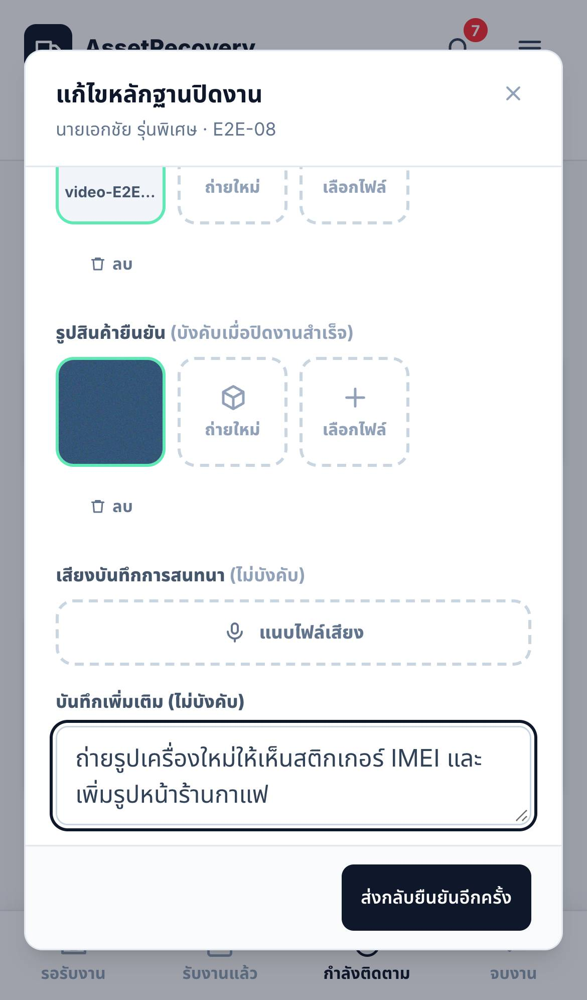

**ผลที่ควรเห็น:** "ส่งหลักฐานกลับให้ตรวจอีกครั้งแล้ว — รายการเบิกของรอบเดิมถูกแทนที่ด้วย: คอมมิชชั่น ฿…"

**ข้อควรระวัง / เคล็ดลับ**
- **หน้าแรกไม่มีแถบเตือน** เมื่อหลักฐานถูกตีกลับ — ให้ดูกระดิ่ง 🔔 และแท็บ **กำลังติดตาม** เป็นประจำ
- แก้ได้เฉพาะ รูป / วิดีโอ / เสียง / รูปสินค้า
- รายการเบิกเดิมจะขึ้นสถานะ **ถูกแทนที่แล้ว** และมีรายการใหม่แทน — ยอดไม่ซ้ำไม่หาย

## ค12. ตอบคำขอย้ายงาน (ยินยอม / ไม่ยินยอม)

**เป้าหมาย:** ตอบผู้จัดการ/หัวหน้าที่ขอย้ายเคสที่คุณรับไว้ให้คนอื่น

**ขั้นตอน**
1. หน้าแรกมีแถบ **มีคำขอเปลี่ยนผู้รับผิดชอบ** → กด **ตอบเลย**
2. อ่านเหตุผล · ผู้ขอ · เวลาหมดเขต
3. กด **ยินยอม** หรือ **ไม่ยินยอม** (ต้องระบุเหตุผล)

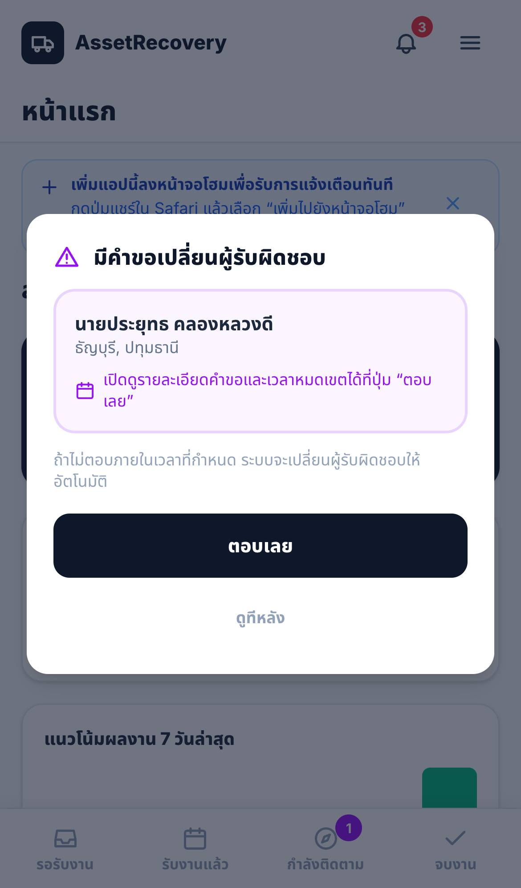

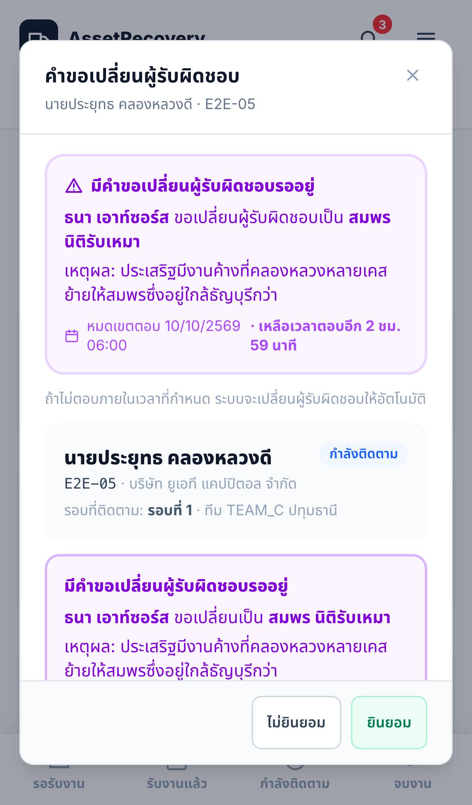

**ผลที่ควรเห็น:** ยินยอม → เคสหายจากงานของคุณและไปรอรับที่พนักงานคนใหม่ · ผู้ขอได้แจ้งเตือนผล

**ข้อควรระวัง:** ถ้าไม่ตอบภายในเวลาที่กำหนด (3 ชั่วโมง) **ระบบย้ายงานให้อัตโนมัติ**

## ค13. ดูงานที่จบแล้ว

**ขั้นตอน**
1. แตะแท็บ **จบงาน**
2. กรอง **ทั้งหมด / สำเร็จ / ไม่สำเร็จ / ถูกโอนไป** และเลือกเดือน

**ผลที่ควรเห็น:** รายการเคสพร้อมสถานะค่าใช้จ่ายของแต่ละเคส (เช่น รอยืนยันคืนคลัง / รออนุมัติจ่าย)

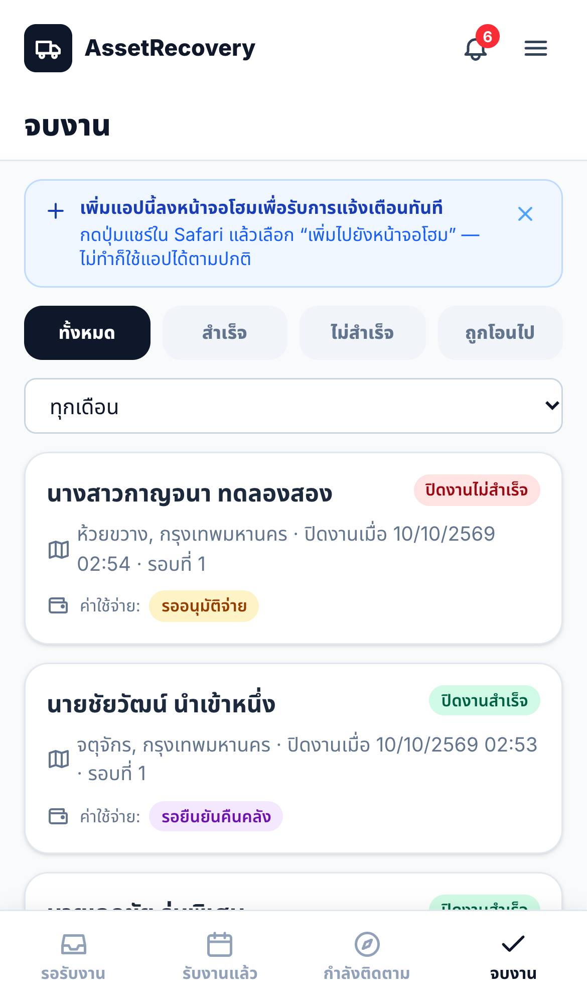

## ค14. รายการเบิกค่าใช้จ่ายของฉัน

**เป้าหมาย:** ตรวจรายการเบิกที่ระบบสร้างให้ และติดตามสถานะ

**ขั้นตอน**
1. เมนู ☰ → **เบิกค่าใช้จ่าย**
2. แท็บ **ผูกกับเคส** — รายการอัตโนมัติ (คอมมิชชั่น · ค่าน้ำมันตามระยะทาง · เบี้ยเสี่ยง) แตะเพื่อดูรายละเอียด
3. แท็บ **เบิกแยก** — รายการที่คุณขอเอง เช่น ค่าที่พัก

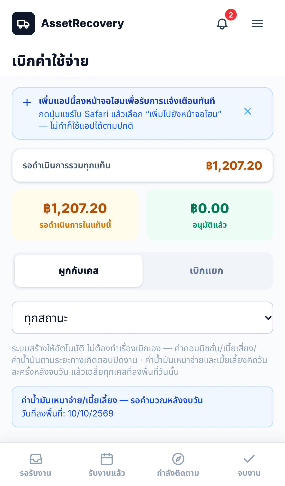

**เคล็ดลับ**
- แถบ **ค่าน้ำมันเหมาจ่าย/เบี้ยเลี้ยง — รอคำนวณหลังจบวัน DD/MM/YYYY** แปลว่าระบบยังไม่ได้สรุปวันนั้น จะเห็นรายการในวันถัดไป
- รายการของเคสสำเร็จจะ **รอยืนยันคืนคลัง** ก่อน เป็นเรื่องปกติ

## ค15. เบิกค่าที่พัก

**ขั้นตอน**
1. **เบิกค่าใช้จ่าย** → แท็บ **เบิกแยก** → กด **เบิกที่พัก**
2. กรอกข้อมูลตามตาราง แนบใบเสร็จ
3. กด **ส่งคำขอเบิก**

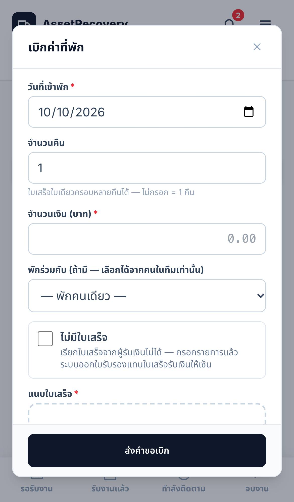

| ช่อง | บังคับ | ตัวอย่าง / หมายเหตุ |
|---|---|---|
| วันที่เข้าพัก | ✔ | 10/10/2569 |
| จำนวนคืน | – | ไม่กรอก = 1 คืน · ใบเสร็จใบเดียวครอบหลายคืนได้ |
| จำนวนเงิน (บาท) | ✔ | 750 — ไม่เกินเพดานต่อคืนที่บริษัทกำหนด |
| พักร่วมกับ | – | เลือกได้เฉพาะคนในทีม |
| ไม่มีใบเสร็จ | – | ติ๊กเมื่อเรียกใบเสร็จไม่ได้ → กรอกรายการ ระบบออก **ใบรับรองแทนใบเสร็จ** ให้เซ็น |
| แนบใบเสร็จ | ✔ (ถ้าไม่ติ๊ก "ไม่มีใบเสร็จ") | รูปหรือ PDF |
| ใบเสร็จออกในนามบริษัท | – | ติ๊กเมื่อใบเสร็จระบุชื่อบริษัทเป็นผู้ซื้อ ถ้าออกในชื่อตัวเองหรือไม่ระบุชื่อ ไม่ต้องติ๊ก |
| หมายเหตุ | – | |

**ผลที่ควรเห็น:** "ส่งคำขอเบิกค่าที่พักแล้ว — รอผู้อนุมัติตรวจสอบ" · รายการสถานะ **รออนุมัติจ่าย**

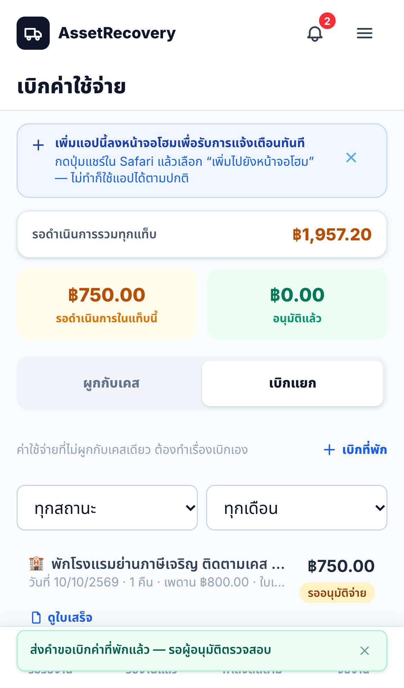

**เคล็ดลับ**
- ช่องวันที่บนมือถือบางรุ่นแสดงปี ค.ศ. ตามปฏิทินของเครื่อง — ระบบบันทึกถูกต้องและแสดงผลเป็น พ.ศ. ในรายการ
- ระบบจับคู่ค่าที่พักกับเคสที่จัดวันไว้ในช่วงวันที่พักให้อัตโนมัติ เพื่อใช้ตรวจสอบ
- ถ้าเลือก **ไม่มีใบเสร็จ** ต้องดาวน์โหลดใบรับรองแทนใบเสร็จไปเซ็น แล้วอัปโหลดฉบับเซ็นจากรายการเบิก (วิธีเดียวกับ ค18 ขั้นที่ 7–8)

## ค16. รายการเบิกถูกตีกลับ — แก้ไขและส่งใหม่

**ขั้นตอน**
1. **เบิกค่าใช้จ่าย** → กล่องสีส้ม **ถูกตีกลับ ต้องแก้ไขแล้วส่งใหม่ (N)** พร้อมเหตุผลของผู้ตีกลับ
2. กด **แก้ไขและส่งใหม่**
3. อ่านเหตุผล → กรอก **สิ่งที่แก้ไข / ชี้แจง**
4. กด **ส่งกลับเข้าคิวอนุมัติ**

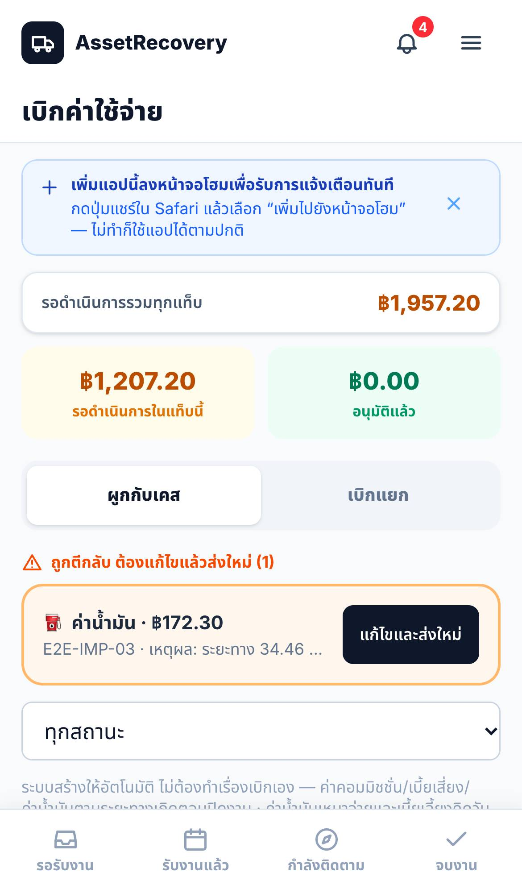

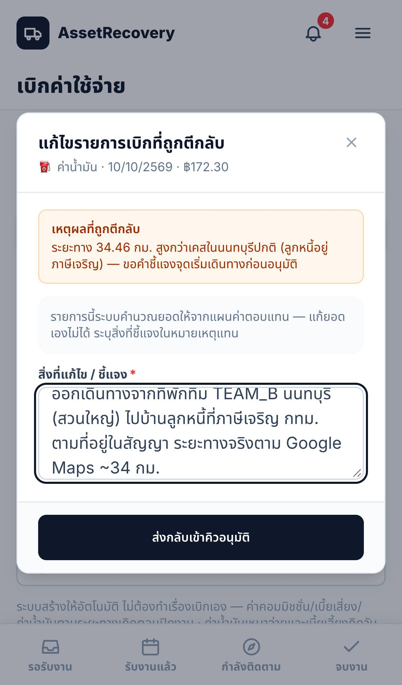

**ผลที่ควรเห็น:** "ส่งรายการเบิกกลับเข้าคิวอนุมัติแล้ว" · กล่องสีส้มหาย · รายการกลับไป **รออนุมัติจ่าย** เริ่มจากผู้จัดการ (ขั้น 1) ใหม่

**ข้อควรระวัง:** ยอดที่ระบบคำนวณ (คอมมิชชั่น ค่าน้ำมัน) **แก้เองไม่ได้** ให้เขียนคำชี้แจงให้ชัด เช่น จุดออกเดินทางจริงและเส้นทางที่ใช้ รายการถูกตีกลับได้ทั้งจากผู้จัดการและฝ่ายการเงิน

## ค17. ขอเงินทดรองจ่าย

**เป้าหมาย:** ขอเงินล่วงหน้าไปสำรองจ่ายค่าเดินทาง แล้วเคลียร์ด้วยใบเสร็จภายหลัง

**ขั้นตอน**
1. เมนู ☰ → **เงินทดรองจ่าย** → กด **ขอเงินทดรอง**
2. กรอกข้อมูลตามตาราง
3. กด **ส่งคำขออนุมัติ**

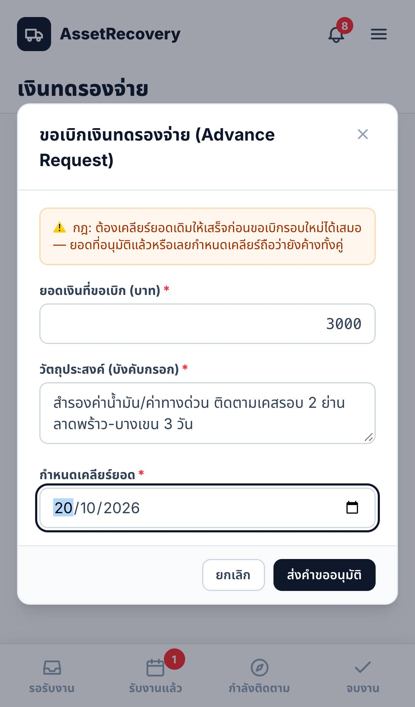

| ช่อง | บังคับ | ตัวอย่าง |
|---|---|---|
| ยอดเงินที่ขอเบิก (บาท) | ✔ | 3000 |
| วัตถุประสงค์ | ✔ | สำรองค่าน้ำมัน/ค่าทางด่วน ติดตามเคสรอบ 2 ย่านลาดพร้าว-บางเขน 3 วัน |
| กำหนดเคลียร์ยอด | ✔ | 20/10/2569 |

**ผลที่ควรเห็น:** "ส่งคำขอแล้ว รอการเงินอนุมัติก่อนรับเงิน" · การ์ดสถานะ **รออนุมัติ**

**ข้อควรระวัง / เคล็ดลับ**
- **ต้องเคลียร์ยอดเดิมให้เรียบร้อยก่อน** จึงจะขอรอบใหม่ได้
- การเงินอาจอนุมัติ **ยอดน้อยกว่าที่ขอ** — ตัวเลขใหญ่บนการ์ดคือยอดที่ขอ ส่วน **ยอดที่อนุมัติจริง** อยู่บรรทัด **อนุมัติ** ด้านล่าง
- ตอนนี้ยังไม่มีแจ้งเตือนเมื่อเงินทดรองได้รับอนุมัติหรือเมื่อโอนเงินแล้ว — ให้เปิดหน้า **เงินทดรองจ่าย** ตรวจสถานะเอง หรือสอบถามฝ่ายการเงิน
- เงินทดรองจะโอนให้ในรอบจ่ายของบริษัท และ **เคลียร์ยอดได้หลังได้รับเงินแล้วเท่านั้น**

## ค18. เคลียร์เงินทดรอง (ใบเสร็จ / ใบรับรองแทนใบเสร็จ)

**เป้าหมาย:** แจ้งยอดใช้จริงพร้อมหลักฐาน และคืนเงินส่วนที่เหลือ

**ก่อนเริ่ม:** การ์ดเงินทดรองอยู่สถานะ **อนุมัติแล้ว — รอเคลียร์ยอด** และได้รับเงินแล้ว · เตรียมรูปใบเสร็จ

**ขั้นตอน**
1. เมนู ☰ → **เงินทดรองจ่าย** → การ์ด **อนุมัติแล้ว — รอเคลียร์ยอด** → กด **เคลียร์ยอด**
2. กรอก **ยอดที่ใช้จริง** — ระบบคำนวณ **ยอดต้องคืน** ให้
3. เลือก **วิธีคืนยอด**
4. **แนบใบเสร็จ** (รูป/PDF)
5. ถ้ามีรายจ่ายที่เรียกใบเสร็จไม่ได้ (ค่าวินมอเตอร์ไซค์ ค่าที่จอดรถ ค่าทางด่วนเงินสด) ติ๊ก **ไม่มีใบเสร็จ** → กรอกแต่ละรายการ (วันที่ · รายละเอียด · จำนวนเงิน · สถานที่) → กด **เพิ่มรายการ** ถ้ามีหลายรายการ
6. กด **บันทึกการเคลียร์ยอด**
7. ถ้ามีรายการไม่มีใบเสร็จ ระบบออก **ใบรับรองแทนใบเสร็จ** (เลข CRT-ปี พ.ศ.-ลำดับ) → กด **ดาวน์โหลดใบรับรอง PDF** → พิมพ์ เซ็น ถ่ายรูป
8. กด **อัปโหลดฉบับเซ็นแล้ว** → เลือกไฟล์

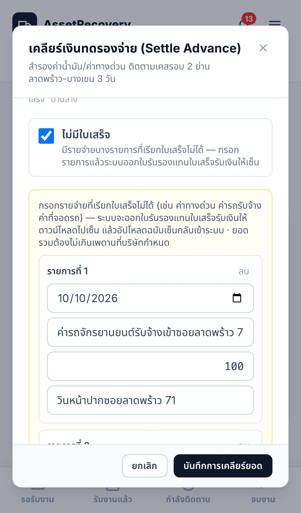

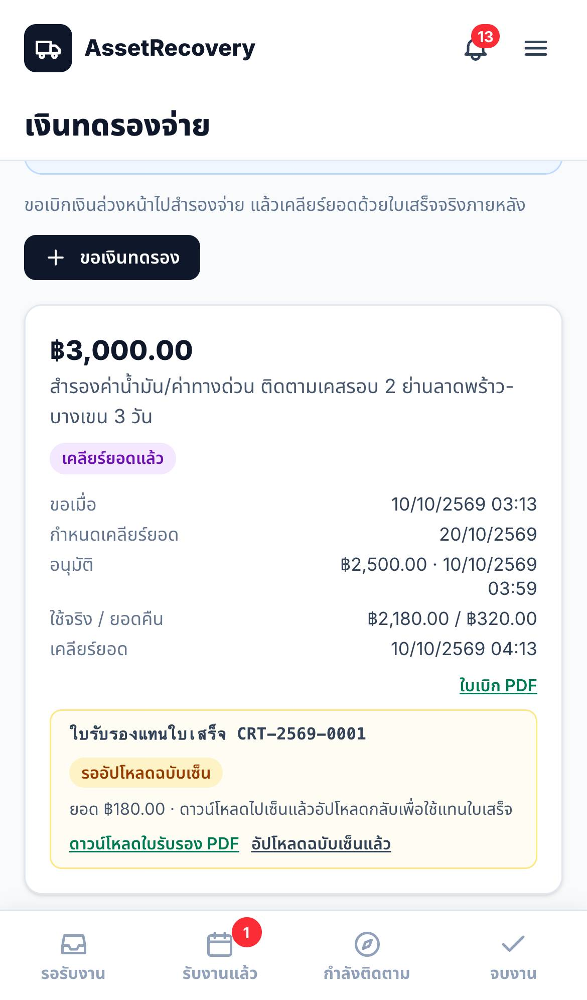

| ช่อง | บังคับ | ตัวอย่าง / หมายเหตุ |
|---|---|---|
| ยอดที่ใช้จริง (บาท) | ✔ | 2180 — ถ้าเกินยอดที่ได้รับ ระบบสร้างคำขอเบิกส่วนเกินให้ |
| วิธีคืนยอด | ✔ (เมื่อมียอดคืน) | **รับคืนแยก (เงินสด/โอน)** หรือ **หักกลบในรอบจ่ายถัดไป** |
| แนบใบเสร็จ | ✔ ถ้าไม่ติ๊ก "ไม่มีใบเสร็จ" | ใบเสร็จปั๊มน้ำมัน 2,000 บาท |
| รายการไม่มีใบเสร็จ | – | ค่ารถจักรยานยนต์รับจ้าง 100 · ค่าที่จอดรถ 80 — ยอดรวมต้องไม่เกินเพดานที่บริษัทกำหนด |

**ผลที่ควรเห็น:** "เคลียร์ยอดเงินทดรองสำเร็จ — ยอดคืน ฿…" และ "ออกใบรับรองแทนใบเสร็จ CRT-… แล้ว" · การ์ดเป็น **เคลียร์ยอดแล้ว** · หลังอัปโหลดฉบับเซ็นจะเห็นป้าย **อัปโหลดฉบับเซ็นแล้ว** · เมื่อการเงินบันทึกรับเงินคืนครบ สถานะเป็น **คืนครบแล้ว**

**ข้อควรระวัง**
- เคลียร์ให้ทัน **กำหนดเคลียร์ยอด** — เลยกำหนดการ์ดจะขึ้นสีแดง **เลยกำหนดเคลียร์**
- เลือก "รับคืนแยก" แล้ว ให้นำเงินคืนฝ่ายการเงินตามช่องทางที่ตกลง (การเงินจะบันทึกรับคืนและออกใบรับคืนให้)
- อย่าลืมขั้นที่ 7–8: ใบรับรองแทนใบเสร็จต้องมี **ฉบับที่เซ็นแล้ว** ในระบบ

## ค19. สรุปรายได้ / ค่าตอบแทน

**ขั้นตอน**
1. เมนู ☰ → **สรุปรายได้**
2. เลือก **สะสมตลอด** หรือรายเดือน

**ผลที่ควรเห็น:** รายได้รวม (คอมมิชชั่น) · จำนวนเคสสำเร็จ / ไม่สำเร็จ (เบี้ยเสี่ยง) · รายการรายเคส

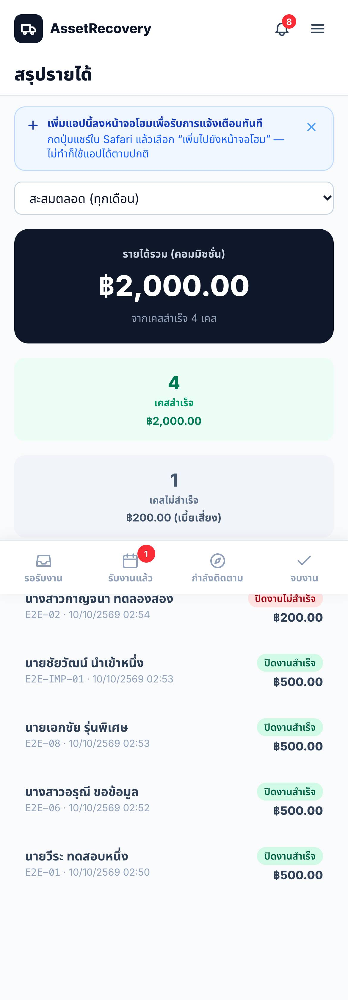

**เคล็ดลับ:** ยอดในหน้านี้เป็นยอดก่อนหักภาษี ณ ที่จ่าย — ยอดโอนจริงจะเห็นในรอบจ่ายของบริษัท (ภาษีหักเมื่อยอดรวมต่อรอบถึงเกณฑ์)

## ค20. การแจ้งเตือน

**ขั้นตอน**
1. แตะ **กระดิ่ง 🔔** มุมขวาบน (ตัวเลข = ยังไม่อ่าน)
2. แตะรายการเพื่ออ่าน · กด **อ่านทั้งหมด** เพื่อล้างตัวเลข

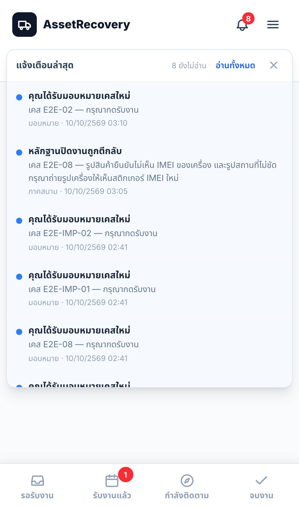

**แจ้งเตือนที่จะได้รับ**
| แจ้งเตือน | ต้องทำอะไร |
|---|---|
| มอบหมายเคสใหม่ | ไปที่ **รอรับงาน** → รับงาน |
| คำขอเปลี่ยนผู้รับผิดชอบ | ตอบภายใน 3 ชั่วโมง (บท ค12) |
| หลักฐานปิดงานถูกตีกลับ (พร้อมเหตุผล) | แก้หลักฐาน (บท ค11) |
| คลังตีกลับการรับเข้า (พร้อมเหตุผล) | ประสานหัวหน้าทีม นำเครื่องที่ถูกต้องส่งคลัง |
| รายการเบิกอนุมัติแล้ว | รับทราบ — รอเข้ารอบจ่าย |

> รายการเบิกที่ถูกตีกลับจะเห็นเป็นกล่องสีส้มในหน้า **เบิกค่าใช้จ่าย** (บท ค16) — เปิดหน้านี้ตรวจเป็นประจำ

---

# ภาคผนวก

## ภาคผนวก 1 — คำศัพท์

| คำ | ความหมาย |
|---|---|
| เคส | งานติดตามทรัพย์ 1 สัญญา ของลูกหนี้ 1 ราย |
| รอบที่ (รอบติดตาม) | ครั้งที่ออกติดตามเคสนั้น — รอบที่ 2 ขึ้นไปคือเคสที่เคยไม่สำเร็จแล้วได้รับอนุมัติให้ติดตามใหม่ (รีไซเกิล) |
| มอบหมาย | หัวหน้า/ผู้จัดการส่งเคสให้พนักงาน |
| ย้ายงาน / เปลี่ยนผู้รับผิดชอบ | เปลี่ยนพนักงานของเคส — ถ้ารับงานแล้วต้องได้ความยินยอมจากคนเดิม |
| เช็คอิน | บันทึกพิกัด GPS ณ จุดที่ไปถึงจริง (แก้ไม่ได้) |
| จุดเริ่มเดินทาง | พิกัดจุดออกเดินทาง ใช้คำนวณค่าน้ำมันตามระยะทาง |
| Draft (ร่าง) | ข้อมูลปิดงานที่บันทึกไว้แต่ยังไม่ส่ง |
| หลักฐานปิดงาน | รูป วิดีโอ รูปสินค้า เสียง และจุดเช็คอินที่แนบตอนปิดงาน |
| ตีกลับ | ส่งกลับให้แก้ไข (หลักฐาน / รายการเบิก / การรับเข้าคลัง) |
| คอมมิชชั่น | ค่าตอบแทนเมื่อปิดงานสำเร็จ ตามแผนของทีม |
| เบี้ยเสี่ยง | ค่าตอบแทนเมื่อปิดงานไม่สำเร็จ (ถ้าแผนทีมกำหนด) |
| ค่าน้ำมันเหมาจ่ายรายวัน / เบี้ยเลี้ยง | ยอดต่อวันที่ลงพื้นที่ ระบบสรุปให้ทุกคืน |
| เงินทดรองจ่าย | เงินที่ขอรับล่วงหน้าไปสำรองจ่าย แล้วเคลียร์ด้วยใบเสร็จ |
| ใบรับรองแทนใบเสร็จ | เอกสารที่ระบบออกให้เซ็นแทนใบเสร็จ สำหรับรายจ่ายที่เรียกใบเสร็จไม่ได้ |
| อนุมัติขั้น 1 / ขั้น 2 | ขั้น 1 = ผู้จัดการทีม · ขั้น 2 = ฝ่ายการเงิน |
| ล็อตส่งมอบ | ชุดเครื่องที่คลังส่งคืนบริษัทไฟแนนซ์ครั้งเดียวกัน — เมื่อยืนยันล็อตแล้วรายการเบิกของเคสสำเร็จจะเข้าคิวอนุมัติ |
| WHT (ภาษีหัก ณ ที่จ่าย) | ภาษีที่บริษัทหักก่อนโอน เมื่อยอดถึงเกณฑ์ |

## ภาคผนวก 2 — สถานะที่จะเห็นและความหมาย

### สถานะงาน (มุมพนักงาน / หน้ามอบหมาย)
| สถานะ | ความหมาย | ใครทำต่อ |
|---|---|---|
| พร้อมมอบหมาย | เคสผ่านการรับเคสแล้ว ยังไม่มีพนักงาน | หัวหน้า / ผู้จัดการ |
| มอบหมายแล้ว (รอรับ) | ส่งให้พนักงานแล้ว รอกดรับ | พนักงาน |
| รับงานแล้ว (ยังไม่จัดวัน) | รับแล้ว ยังไม่เลือกวัน | พนักงาน |
| กำลังติดตาม | จัดวันแล้ว / เริ่มงานแล้ว | พนักงาน |
| Draft | มีข้อมูลปิดงานบันทึกค้าง | พนักงาน (กด **จบงาน**) |
| ถูกตีกลับ ต้องแก้ไขหลักฐาน | หลักฐานไม่ผ่าน | พนักงาน |
| จบงาน | ปิดงานแล้ว (สำเร็จ / ไม่สำเร็จ) | — |
| ถูกโอนไป | เคสถูกย้ายไปให้พนักงานคนอื่น | — |

### สถานะเคส (มุมหัวหน้า / ผู้จัดการ)
| สถานะ | ความหมาย |
|---|---|
| รับเคสแล้ว | เคสพร้อมให้ทีมติดตาม |
| กำลังติดตาม | มีพนักงานรับผิดชอบอยู่ |
| ปิดงานสำเร็จ | ได้เครื่องคืน — รอคลังรับเข้า |
| ปิดงานไม่สำเร็จ | ติดตามไม่ได้ |
| รออนุมัติรีไซเกิล | มีคำขอติดตามรอบใหม่ รอเจ้าหน้าที่อนุมัติเคสตัดสิน |

### สถานะรายการเบิก
| สถานะ | ความหมาย |
|---|---|
| รอยืนยันคืนคลัง | เคสสำเร็จ รอคลังรับเครื่องและยืนยันล็อตส่งมอบ |
| รออนุมัติจ่าย | รอผู้จัดการอนุมัติขั้น 1 |
| รอการเงินอนุมัติ (ขั้น 2/2) | ผู้จัดการอนุมัติแล้ว รอฝ่ายการเงิน |
| อนุมัติแล้ว | ผ่านครบ รอเข้ารอบจ่าย |
| ถูกตีกลับ — รอแก้ไข | ต้องแก้/ชี้แจงแล้วส่งใหม่ (เริ่มขั้น 1 ใหม่) |
| ถูกแทนที่แล้ว | รายการเดิมที่ถูกแทนด้วยรายการใหม่ (เช่น หลังส่งหลักฐานใหม่) |
| ไม่อนุมัติ | ไม่จ่าย |

### สถานะเงินทดรอง
| สถานะ | ความหมาย |
|---|---|
| รออนุมัติ | รอฝ่ายการเงินพิจารณา |
| อนุมัติแล้ว — รอเคลียร์ยอด | อนุมัติแล้ว (เคลียร์ได้หลังได้รับเงิน) |
| เลยกำหนดเคลียร์ | เกินวันกำหนดเคลียร์ยอด — รีบเคลียร์ |
| เคลียร์ยอดแล้ว | ส่งยอดใช้จริงแล้ว (อาจมียอดคืนค้าง) |
| คืนครบแล้ว | การเงินรับคืนครบ ปิดรายการ |
| ไม่อนุมัติ | คำขอไม่ผ่าน |

## ภาคผนวก 3 — ค่าน้ำมันและเบี้ยเลี้ยงคิดอย่างไร

| แบบ | คิดเมื่อไร | ข้อมูลที่ใช้ | พนักงานต้องทำ |
|---|---|---|---|
| **ค่าน้ำมันตามระยะทาง** | ทันทีที่กด **ยืนยันปิดงาน** | **จุดเริ่มเดินทาง** + **จุดเช็คอินตอนปิดงาน** → ระยะทางตามแผนที่ × อัตราต่อ กม. (ไม่เกินเพดานต่อเคส) | ตั้งจุดเริ่มเดินทางให้ตรงจริง · เช็คอินที่จุดหมายจริง |
| **ค่าน้ำมันเหมาจ่ายรายวัน** | ระบบสรุปอัตโนมัติ **ทุกคืนหลังเที่ยงคืน** | วันที่คุณมีการลงพื้นที่ (เช็คอิน) | ไม่ต้องเบิกเอง — **เห็นรายการในวันถัดไป** |
| **เบี้ยเลี้ยง** | ระบบสรุปอัตโนมัติ **ทุกคืนหลังเที่ยงคืน** | วันที่ลงพื้นที่ | ไม่ต้องเบิกเอง — **เห็นรายการในวันถัดไป** |

- ทีมของคุณใช้แบบไหน ดูได้จากหน้าต่างมอบหมาย (ของหัวหน้า) หรือสอบถามหัวหน้าทีม
- ระหว่างวันในหน้า **เบิกค่าใช้จ่าย** จะเห็นแถบ "ค่าน้ำมันเหมาจ่าย/เบี้ยเลี้ยง — รอคำนวณหลังจบวัน" เป็นเรื่องปกติ

## ภาคผนวก 4 — คำถามที่พบบ่อย (FAQ)

**ถาม: ระบบจัดเส้นทางให้ไหม?**
ตอบ: ไม่ — พนักงานเรียงลำดับเคสในวันเองที่แท็บ **กำลังติดตาม** ด้วยการลากหรือปุ่ม ▲▼ (บท ค5)

**ถาม: กดเช็คอินไม่ได้ / ขึ้นว่าหาตำแหน่งไม่ได้**
ตอบ: ตรวจว่าเปิด Location และอนุญาตให้ Safari/Chrome หรือแอปใช้ตำแหน่ง แล้วลองใหม่ในที่โล่ง ระบบไม่ให้ปักหมุดเอง

**ถาม: ปิดงานสำเร็จแล้ว ทำไมคอมมิชชั่นยัง "รอยืนยันคืนคลัง"?**
ตอบ: ต้องรอคลังรับเครื่องเข้าและยืนยันล็อตส่งมอบให้บริษัทไฟแนนซ์ก่อน แล้วรายการจึงเข้าคิวผู้จัดการ → การเงิน

**ถาม: ทำไมไม่เห็นค่าน้ำมันของวันนี้?**
ตอบ: ถ้าทีมใช้ค่าน้ำมันเหมาจ่ายรายวัน/เบี้ยเลี้ยง ระบบสรุปทุกคืนหลังเที่ยงคืน จะเห็นในวันถัดไป

**ถาม: ส่งปิดงานผิด แก้ได้ไหม?**
ตอบ: หลัง **ยืนยันปิดงาน** แก้เองไม่ได้ — แจ้งหัวหน้าทีม ถ้าหลักฐานต้องแก้ เจ้าหน้าที่อนุมัติเคสจะตีกลับให้แก้ (แก้ได้เฉพาะรูป/วิดีโอ/เสียง/รูปสินค้า)

**ถาม: คลังตีกลับเครื่องที่ส่งไป ต้องทำอะไร?**
ตอบ: อ่านเหตุผลในแจ้งเตือน ประสานหัวหน้าทีม และนำเครื่องที่ถูกต้องไปให้คลังรับใหม่ — ในแอปไม่มีปุ่มดำเนินการ

**ถาม: ไม่ได้ตอบคำขอย้ายงาน จะเกิดอะไร?**
ตอบ: เมื่อครบ 3 ชั่วโมง ระบบย้ายงานให้อัตโนมัติ

**ถาม: ผู้จัดการ/หัวหน้าตีกลับหลักฐานปิดงานได้ไหม?**
ตอบ: ไม่ได้ — ผู้ตีกลับหลักฐานคือ **เจ้าหน้าที่อนุมัติเคส** เท่านั้น ผู้จัดการตีกลับได้เฉพาะ **รายการเบิก** · หลักฐานจะ "ผ่าน" อัตโนมัติเมื่อคลังรับเครื่องเข้า (เคสสำเร็จ) หรือเมื่อค่าตอบแทนของเคสอนุมัติครบ (เคสไม่สำเร็จ)

**ถาม: จะดูข้อมูลบัญชีรับเงินของตัวเองได้ที่ไหน?**
ตอบ: แอปยังไม่มีหน้านี้ ให้ติดต่อฝ่ายการเงินหรือผู้ดูแลระบบ ถ้าข้อมูลไม่ครบจะมีข้อความเตือนในหน้า **เบิกค่าใช้จ่าย**

**ถาม: ใช้คอมพิวเตอร์ทำงานภาคสนามแทนมือถือได้ไหม?**
ตอบ: ได้ หน้าจอและขั้นตอนเหมือนกันทุกอย่าง แต่การเช็คอินต้องใช้ตำแหน่งจริงของอุปกรณ์ จึงแนะนำมือถือ

**ถาม: หัวหน้า/ผู้จัดการใช้มือถือทำงานได้ไหม?**
ตอบ: ได้ เปิดเบราว์เซอร์บนมือถือแล้วเข้าสู่ระบบตามปกติ หน้าจอปรับขนาดให้พอดีจอ (บท ข6)
