# เล่ม 4 — คลังและส่งมอบ (ธุรการคลัง)

> คู่มือผู้ใช้ AssetRecovery สำหรับ **ธุรการที่ดูแลคลังสินค้า**
> ข้อมูลและภาพในเล่มนี้มาจากการทดลองใช้งานจริงบนระบบทดสอบ เมื่อ 10/10/2569 — ชื่อคน บริษัท IMEI และเลขเอกสารในภาพเป็นข้อมูลตัวอย่าง

---

## เล่มนี้สำหรับใคร

| บทบาท | สิทธิ์ในคลังสินค้า |
|---|---|
| **ธุรการ (คลังสินค้า)** | ทำงานคลังได้ทั้งสาย: รับเครื่องเข้า · ตีกลับ/รับใหม่ · สร้างล็อตส่งมอบ · พิมพ์ใบส่งมอบ PDF / Excel · แนบใบเซ็นรับและหลักฐานจัดส่ง · **ยืนยันล็อต** · ค้นหา IMEI · ดูประวัติล็อต |
| ผู้จัดการทีมติดตามทรัพย์ | ดูอย่างเดียว เฉพาะเครื่องของทีมตัวเอง |
| การเงิน · บัญชี | ดูหน้าคลังได้อย่างเดียว |
| ผู้บริหาร · ผู้จัดการทีม (เฉพาะทีมตัวเอง) | ดูอย่างเดียว + รายงานสรุปคลังสินค้า (ส่งออก Excel / PDF) |

**งานคลังเชื่อมกับใคร**
- **ต้นทาง:** พนักงานภาคสนามกด "ปิดงานสำเร็จ" → เครื่องเข้าคิว **รับเข้าคลัง** เองอัตโนมัติ (ดู [เล่ม 3](03-field-team.md))
- **ปลายทาง:** เมื่อคุณ **ยืนยันล็อต** → รายการเบิกของพนักงานในเคสนั้นถูกปลดล็อกให้ผู้จัดการทีมอนุมัติ และเปิดทางให้ฝ่ายการเงินสร้างรายได้/วางบิลบริษัทไฟแนนซ์

### เข้าระบบอย่างไร

1. เปิดเบราว์เซอร์บนคอมพิวเตอร์ไปที่ `https://<โดเมนระบบ>/login`
2. กรอกอีเมลหรือชื่อผู้ใช้ และรหัสผ่านที่ได้รับ → กด **เข้าสู่ระบบ**
3. ระบบเปิด **แดชบอร์ด** — เมนูด้านบนมี **แดชบอร์ด · จัดการเคส · การเงิน · คลังสินค้า · การตั้งค่า** (ตามสิทธิ์)
4. งานในเล่มนี้อยู่ที่เมนู **คลังสินค้า** (`https://<โดเมนระบบ>/warehouse`) ซึ่งมี 4 แท็บ: **รับเข้าคลัง · ในคลัง · รอส่งมอบ · ส่งมอบแล้ว**

> แนะนำให้ใช้ **คอมพิวเตอร์** สำหรับงานคลัง (ตารางกว้าง พิมพ์ใบส่งมอบได้สะดวก) — รูป 7 มุมถ่ายด้วยมือถือแล้วโอนเข้าคอมพิวเตอร์ แล้วแตะช่องแต่ละมุมเพื่อเลือกไฟล์

### ผังงาน (Flowchart)

- งานคลังและส่งมอบ → [ผังงานกลุ่ม 4](../diagrams/03-role-flowcharts.md#4-คลังส่งมอบ)
- ที่มาของเครื่อง (ทีมภาคสนาม) → [ผังงานกลุ่ม 3](../diagrams/03-role-flowcharts.md#3-ทีมติดตาม-ผู้จัดการ--หัวหน้า--พนักงานภาคสนาม)
- งานการเงินที่ต่อจากการยืนยันล็อต → [ผังงานกลุ่ม 5](../diagrams/03-role-flowcharts.md#5-การเงิน)

### ภาพรวมเส้นทางของเครื่องหนึ่งเครื่อง

```
พนักงานปิดงานสำเร็จ → [รับเข้าคลัง] รอรับเข้าคลัง
   ├─ ตรวจแล้วผ่าน → รับเข้าคลัง → [ในคลัง] อยู่ในคลัง
   └─ ไม่ตรง/ไม่มั่นใจ → ตีกลับ → (ได้เครื่องที่ถูกต้อง) → รับใหม่
[ในคลัง] เลือกเครื่องของบริษัทเดียวกัน → นัดวันส่งมอบ = สร้างล็อต + ใบส่งมอบ
   ├─ ไฟแนนซ์มารับที่คลัง → [รอส่งมอบ] รอแนบใบเซ็นรับ
   └─ เราจัดส่งไปให้      → [ส่งมอบแล้ว] รอแนบหลักฐานจัดส่ง
แนบเอกสารครบ → ยืนยันส่งมอบสำเร็จ → ล็อตยืนยันแล้ว (แก้ไม่ได้) · เครื่อง "ส่งมอบแล้ว"
```

---

## สารบัญ

1. [แดชบอร์ดงานคลัง](#1-แดชบอร์ดงานคลัง)
2. [ดูคิวเครื่องรอรับเข้าคลัง](#2-ดูคิวเครื่องรอรับเข้าคลัง)
3. [รับเครื่องเข้าคลัง — ขั้นที่ 1 ตรวจ IMEI และสี/ความจุ](#3-รับเครื่องเข้าคลัง--ขั้นที่-1-ตรวจ-imei-และสีความจุ)
4. [รับเครื่องเข้าคลัง — ขั้นที่ 2–3 สภาพเครื่องและรูป 7 มุม](#4-รับเครื่องเข้าคลัง--ขั้นที่-23-สภาพเครื่องและรูป-7-มุม)
5. [กรณีพิเศษตอนรับเข้า: ไม่ตรง / ชำรุด / อุปกรณ์ขาดหาย](#5-กรณีพิเศษตอนรับเข้า-ไม่ตรง--ชำรุด--อุปกรณ์ขาดหาย)
6. [ตีกลับการรับเข้า](#6-ตีกลับการรับเข้า)
7. [ดูเหตุผลตีกลับและรับใหม่](#7-ดูเหตุผลตีกลับและรับใหม่)
8. [ดูเครื่องในคลังและค้นหา IMEI](#8-ดูเครื่องในคลังและค้นหา-imei)
9. [สร้างล็อตส่งมอบ — ไฟแนนซ์มารับที่คลัง](#9-สร้างล็อตส่งมอบ--ไฟแนนซ์มารับที่คลัง)
10. [สร้างล็อตส่งมอบ — เราจัดส่งไปให้](#10-สร้างล็อตส่งมอบ--เราจัดส่งไปให้)
11. [พิมพ์ใบส่งมอบ PDF และส่งออก Excel](#11-พิมพ์ใบส่งมอบ-pdf-และส่งออก-excel)
12. [แนบใบเซ็นรับและยืนยันล็อต (ไฟแนนซ์มารับ)](#12-แนบใบเซ็นรับและยืนยันล็อต-ไฟแนนซ์มารับ)
13. [แนบใบเซ็นรับ + หลักฐานจัดส่ง และยืนยันล็อต (เราจัดส่ง)](#13-แนบใบเซ็นรับ--หลักฐานจัดส่ง-และยืนยันล็อต-เราจัดส่ง)
14. [ผลของการยืนยันล็อตต่อรายการเบิกและรายได้](#14-ผลของการยืนยันล็อตต่อรายการเบิกและรายได้)
15. [ประวัติล็อต · ค้นหา IMEI ในเครื่องที่ส่งมอบแล้ว · ดูเอกสารแนบ](#15-ประวัติล็อต--ค้นหา-imei-ในเครื่องที่ส่งมอบแล้ว--ดูเอกสารแนบ)
16. [ส่งออกข้อมูลคลัง](#16-ส่งออกข้อมูลคลัง)
17. [ตรวจปิดงานประจำวัน](#17-ตรวจปิดงานประจำวัน)

**ภาคผนวก**
- [ภาคผนวก 1 — คำศัพท์](#ภาคผนวก-1--คำศัพท์)
- [ภาคผนวก 2 — สถานะที่จะเห็นและความหมาย](#ภาคผนวก-2--สถานะที่จะเห็นและความหมาย)
- [ภาคผนวก 3 — เช็กลิสต์ก่อนกดยืนยันล็อต](#ภาคผนวก-3--เช็กลิสต์ก่อนกดยืนยันล็อต)
- [ภาคผนวก 4 — คำถามที่พบบ่อย (FAQ)](#ภาคผนวก-4--คำถามที่พบบ่อย-faq)

---

## 1. แดชบอร์ดงานคลัง

**เป้าหมาย:** รู้ทันทีว่ามีงานคลังค้างอะไรบ้าง

**ขั้นตอน**
1. เข้าสู่ระบบ ระบบเปิด **แดชบอร์ด**
2. ดูการ์ด **เครื่องรอรับเข้าคลัง** (จำนวนเครื่องที่ทีมภาคสนามปิดงานสำเร็จแล้วรอคุณตรวจรับ)
3. ดูการ์ด **ใบส่งมอบที่ยังไม่ยืนยัน** (ล็อตที่ยังไม่ปิด)
4. กด **ไปที่ คลังสินค้า** หรือเมนู **คลังสินค้า**

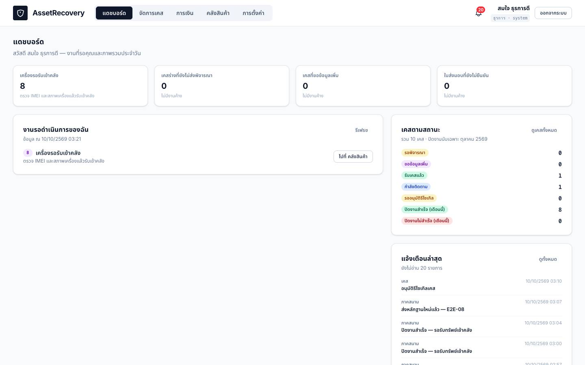

**ผลที่ควรเห็น:** เปิดหน้า **คลังสินค้า** แท็บ **รับเข้าคลัง**

## 2. ดูคิวเครื่องรอรับเข้าคลัง

**เป้าหมาย:** เห็นรายการเครื่องที่ต้องตรวจรับวันนี้

**ขั้นตอน**
1. **คลังสินค้า** → แท็บ **รับเข้าคลัง**
2. กรองได้ด้วย **บริษัทไฟแนนซ์ · ทีม · พนักงาน · สถานะ** (รอรับเข้าคลัง / ตีกลับ) **· สภาพ** หรือพิมพ์ค้นหา IMEI / ชื่อลูกหนี้ / เลขสัญญา

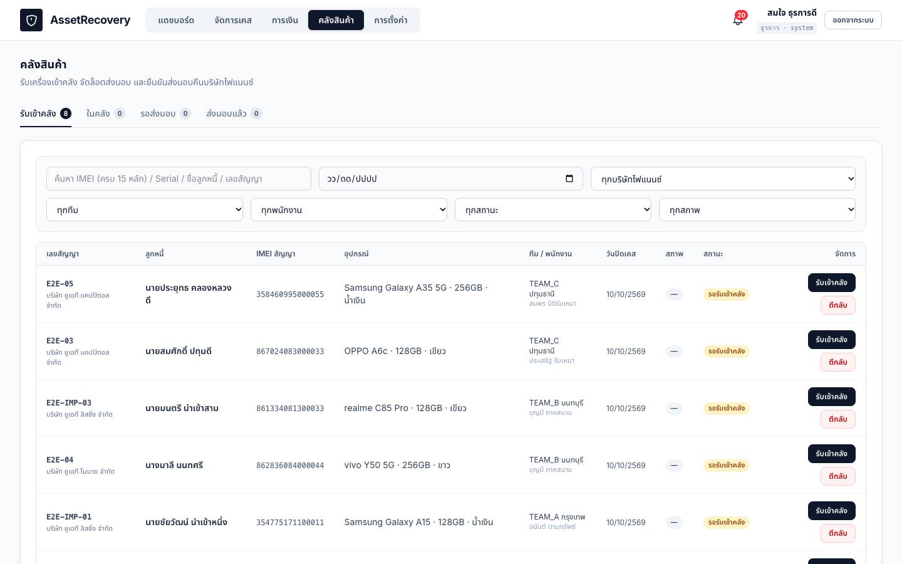

**ผลที่ควรเห็น:** ตารางแสดง เลขสัญญา + บริษัท · ลูกหนี้ · IMEI ตามสัญญา · อุปกรณ์ (รุ่น · ความจุ · สี) · ทีม/พนักงาน · วันปิดเคส · สภาพ · สถานะ · ปุ่ม **รับเข้าคลัง** / **ตีกลับ**

**เคล็ดลับ:** ไม่ต้องสร้างรายการเอง — เครื่องเข้าคิวนี้อัตโนมัติทันทีที่พนักงานปิดงานสำเร็จ ถ้ามีเครื่องมาถึงคลังแต่ไม่มีในคิว ให้ตรวจกับหัวหน้าทีมว่าพนักงานกดปิดงานแล้วหรือยัง

## 3. รับเครื่องเข้าคลัง — ขั้นที่ 1 ตรวจ IMEI และสี/ความจุ

**เป้าหมาย:** ยืนยันว่าเครื่องที่ได้รับคือเครื่องตามสัญญา

**ก่อนเริ่ม:** มีเครื่องอยู่ในมือ เปิดดู IMEI บนเครื่อง (กด `*#06#` หรือดูที่ถาดซิม/ฉลากกล่อง)

**ขั้นตอน**
1. กด **รับเข้าคลัง** ที่แถวเครื่อง — หน้าต่าง **รับเครื่องเข้าคลัง** มี 3 ขั้น: ตรวจ IMEI → บันทึกสภาพ → ถ่ายรูปหลักฐาน 7 มุม
2. ช่อง **IMEI ที่ตรวจจริงบนเครื่อง** — พิมพ์หรือสแกน IMEI 15 หลัก
3. ดูผลตรวจทันที:
   - กรอบ **เขียว** "ตรงกับสัญญา — ตรวจแล้วตรงทุกช่อง รับเข้าคลังได้เลย"
   - กรอบ **แดง** "IMEI ที่ตรวจจริงไม่ตรงกับสัญญา — ยังรับเข้าคลังต่อได้ … แนะนำให้ตีกลับถ้าไม่มั่นใจ"
   - ข้อความ "ต้อง 15 หลัก" ถ้าพิมพ์ไม่ครบ
4. ช่อง **สี/ความจุตรงกับสัญญา** — เทียบกับค่าที่แสดง "ตามสัญญา: ความจุ … · สี …" แล้วเลือก **ตรง** หรือ **ไม่ตรง**

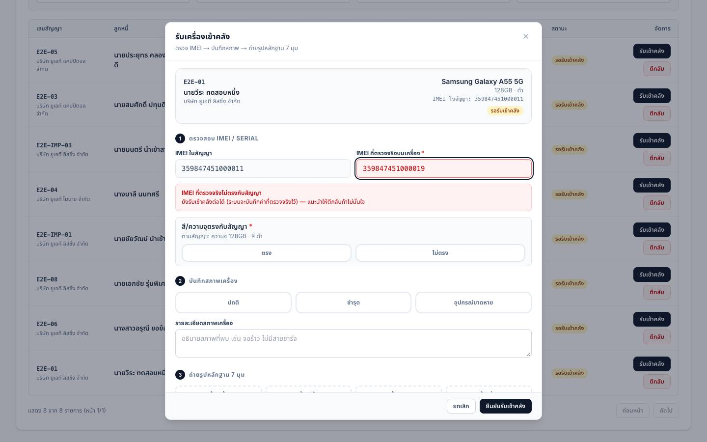

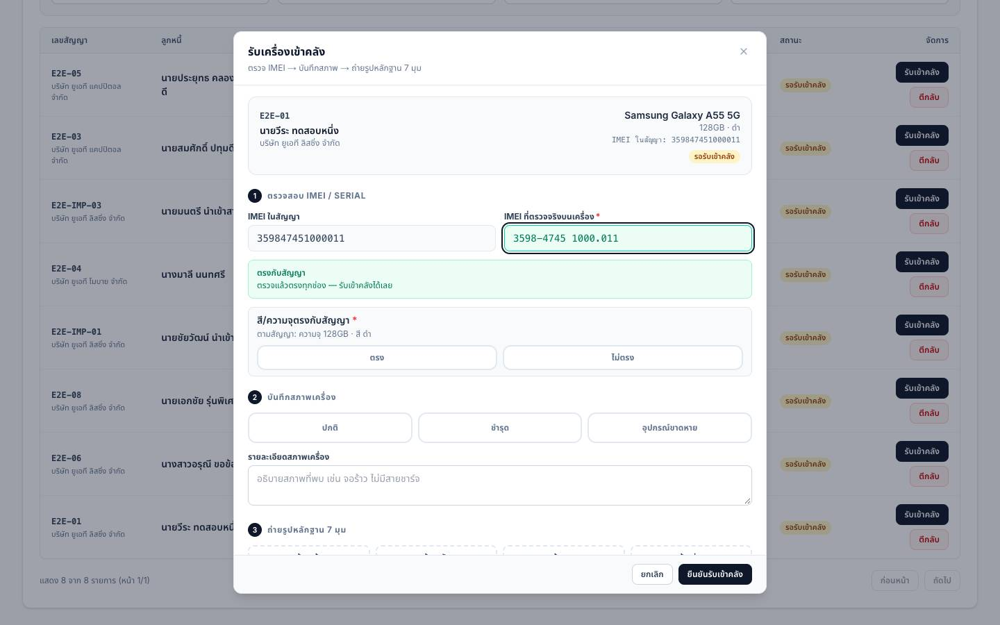

| ช่อง | บังคับ | ตัวอย่าง / หมายเหตุ |
|---|---|---|
| IMEI ที่ตรวจจริงบนเครื่อง | ✔ | `359847451000011` — คั่นด้วยเว้นวรรค ขีด หรือจุดได้ เช่น `3598-4745 1000.011` · อักขระอื่นหรือไม่ครบ 15 หลักจะไม่ผ่าน |
| สี/ความจุตรงกับสัญญา | ✔ | ตรง / ไม่ตรง |
| สิ่งที่พบ | ✔ เมื่อเลือก "ไม่ตรง" | เช่น "สีเทาอ่อน (ไม่ใช่ขาว) · ความจุ 256GB ตรง" |

**ข้อควรระวัง / เคล็ดลับ**
- IMEI ต้อง **ตรงทุกหลัก** — ต่างกันแม้ 1 หลักก็ถือว่าไม่ตรง ระบบไม่เดาหรือแก้ให้
- IMEI ไม่ตรง ระบบ **ไม่บล็อก** แต่ถ้าไม่ตรงจริง **ให้ใช้ปุ่ม ตีกลับ แทน** (บทที่ 6) — การรับเข้าเครื่องผิดจะส่งผลต่อใบส่งมอบและการจ่ายเงินพนักงาน
- ถ้าพิมพ์ผิด แก้ในช่องได้เลย กรอบจะเปลี่ยนเป็นสีเขียวเมื่อถูก

## 4. รับเครื่องเข้าคลัง — ขั้นที่ 2–3 สภาพเครื่องและรูป 7 มุม

**ขั้นตอน**
1. ขั้น 2 **บันทึกสภาพเครื่อง** — เลือก **ปกติ / ชำรุด / อุปกรณ์ขาดหาย**
2. ถ้าไม่ใช่ "ปกติ" กรอก **รายละเอียดสภาพเครื่อง**
3. ขั้น 3 **ถ่ายรูปหลักฐาน 7 มุม** — แตะช่องแต่ละมุมเพื่อถ่าย/เลือกรูป: **ด้านหน้า · ด้านหลัง · ด้านบน · ด้านล่าง · ด้านซ้าย · ด้านขวา · IMEI บนเครื่อง**
4. กด **ยืนยันรับเข้าคลัง**

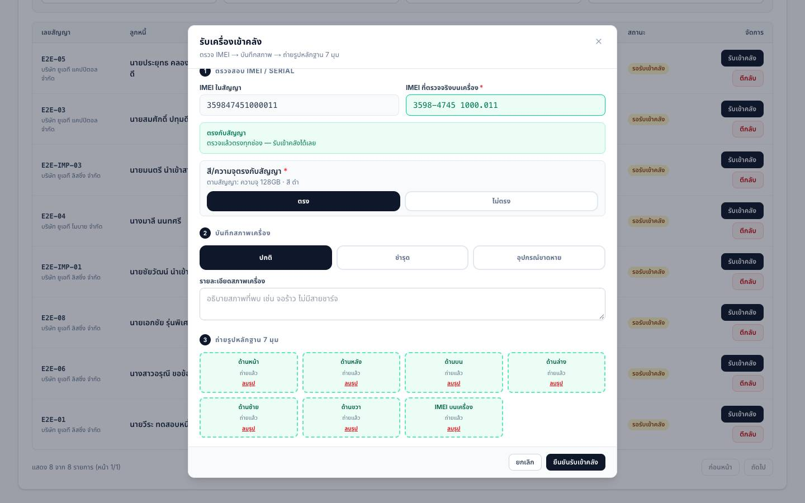

| ช่อง | บังคับ | หมายเหตุ |
|---|---|---|
| สภาพเครื่อง | ✔ | ปกติ / ชำรุด / อุปกรณ์ขาดหาย |
| รายละเอียดสภาพเครื่อง | ✔ เมื่อไม่ใช่ "ปกติ" | เช่น "กระจกหลังร้าวมุมขวาล่าง ยาว 2 ซม. · เปิดติด ใช้งานได้ · ไม่มีสายชาร์จ" |
| รูปหลักฐาน 7 มุม | แนะนำให้ครบ | ไม่ครบยังรับเข้าได้ แต่มีป้ายเตือน "ยังไม่ได้ถ่ายอีก N มุม" |

**ผลที่ควรเห็น:** ข้อความ "รับเครื่องเข้าคลังแล้ว <เลขเคส> · <รุ่น>" (ใช้เวลาประมาณ 5–6 วินาที) · แถวหายจากคิว · ตัวเลขแท็บ **ในคลัง** เพิ่มขึ้น

**ข้อควรระวัง / เคล็ดลับ**
- ช่องรูปที่ถ่ายแล้วจะเป็นกรอบเขียว "ถ่ายแล้ว" พร้อมลิงก์ **ลบรูป** แต่ **ไม่มีภาพย่อให้ดู** — ตั้งชื่อไฟล์ตามมุม (เช่น `เลขเคส-front.jpg`) หรือถ่ายเรียงตามลำดับช่อง เพื่อไม่ให้สลับมุม
- ถ่ายรูปให้ครบ 7 มุมเสมอ โดยเฉพาะมุม **IMEI บนเครื่อง** และรอยชำรุด เพราะเป็นหลักฐานเมื่อบริษัทไฟแนนซ์โต้แย้งสภาพเครื่อง
- กด **ยืนยันรับเข้าคลัง** ครั้งเดียวแล้วรอ อย่ากดซ้ำ

## 5. กรณีพิเศษตอนรับเข้า: ไม่ตรง / ชำรุด / อุปกรณ์ขาดหาย

| กรณี | ทำอย่างไร | ผลที่ตามมา |
|---|---|---|
| **สี/ความจุไม่ตรงสัญญา** แต่ IMEI ตรง | เลือก **ไม่ตรง** → กรอก **สิ่งที่พบ** (บังคับ) → ทำต่อตามปกติ | ค่าที่ไม่ตรงจะแสดงใน **ใบส่งมอบ PDF / Excel** ให้ผู้รับเห็น |
| **ชำรุด** | สภาพ **ชำรุด** → กรอกรายละเอียด (บังคับ) → ถ่ายรูปจุดชำรุด | สภาพแสดงในใบส่งมอบ · การ์ดบริษัทในแท็บ ในคลัง แยกนับตามสภาพ |
| **อุปกรณ์ขาดหาย** | สภาพ **อุปกรณ์ขาดหาย** → กรอกรายละเอียด เช่น "ไม่มีถาดซิมและฝาครอบเคส" | เช่นเดียวกับชำรุด |
| **IMEI ไม่ตรง / ไม่ใช่เครื่องตามสัญญา** | **อย่ารับเข้า** → ใช้ **ตีกลับ** (บทที่ 6) | พนักงานได้แจ้งเตือน · รายการเบิกของเคสยังล็อก |

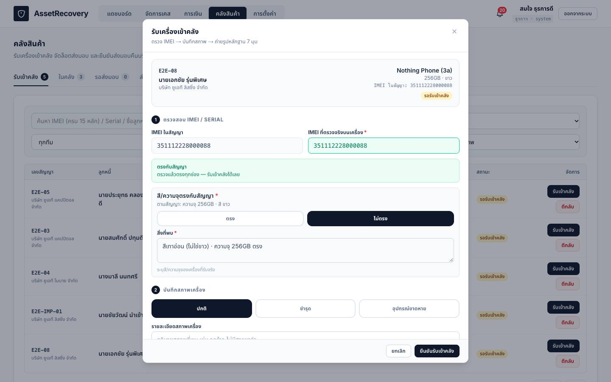

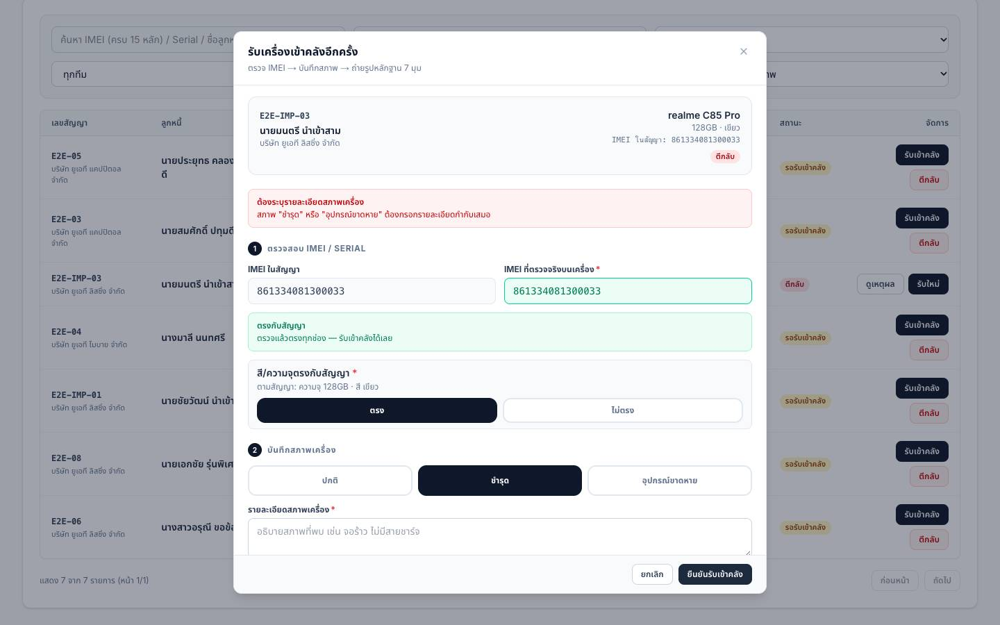

**ผลที่ควรเห็นเมื่อกดยืนยันโดยไม่กรอก:** ข้อความแดง "ต้องระบุรายละเอียดสภาพเครื่อง"

## 6. ตีกลับการรับเข้า

**เป้าหมาย:** ไม่รับเครื่องที่ไม่ตรงหรือไม่มั่นใจ และแจ้งเหตุผลกลับไปที่ทีมภาคสนาม

**ขั้นตอน**
1. แท็บ **รับเข้าคลัง** → กด **ตีกลับ** ที่แถวเครื่อง
2. อ่านกรอบเตือน "ตีกลับ = ไม่รับเข้าคลัง — เจ้าหน้าที่ภาคสนามยังเบิกค่าใช้จ่ายของเคสนี้ไม่ได้…"
3. กรอก **IMEI ที่พบบนเครื่อง** (ถ้าอ่านได้) และ **เหตุผลที่ตีกลับ**
4. กด **ยืนยันตีกลับ**

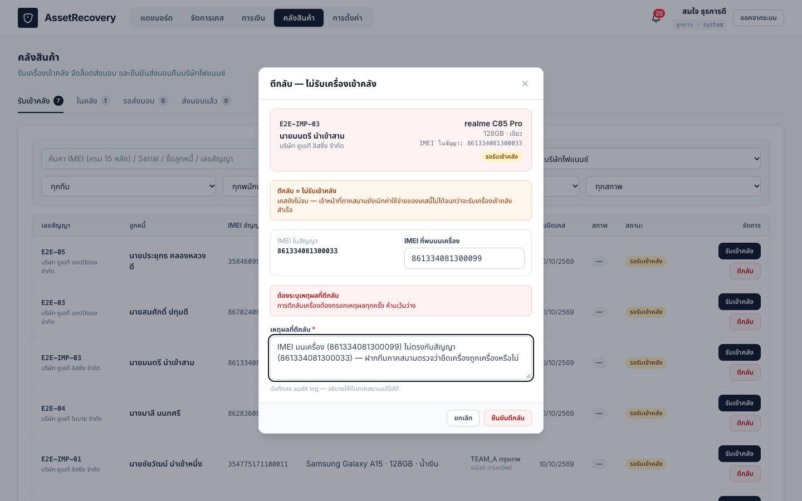

| ช่อง | บังคับ | ตัวอย่าง |
|---|---|---|
| IMEI ที่พบบนเครื่อง | – | `861334081300099` |
| เหตุผลที่ตีกลับ | ✔ | "IMEI บนเครื่อง (861334081300099) ไม่ตรงกับสัญญา (861334081300033) — ฝากทีมภาคสนามตรวจว่ายึดเครื่องถูกเครื่องหรือไม่" |

**ผลที่ควรเห็น:** ข้อความ "ตีกลับเครื่องแล้ว <เลขเคส>" · แถวสถานะ **ตีกลับ** ปุ่มเปลี่ยนเป็น **ดูเหตุผล** / **รับใหม่** · เคสยังเป็น "ปิดงานสำเร็จ" · พนักงานเจ้าของเคสได้แจ้งเตือน "คลังตีกลับการรับเข้า" พร้อมเหตุผลของคุณ

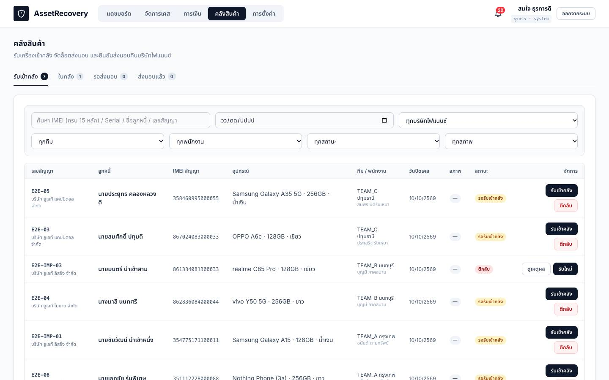

**ข้อควรระวัง / เคล็ดลับ**
- กด **ยืนยันตีกลับ** โดยไม่กรอกเหตุผล ระบบจะขึ้น "ต้องระบุเหตุผลที่ตีกลับ"
- เหตุผลถูกบันทึกถาวรในประวัติ — เขียนข้อเท็จจริงที่ตรวจพบ
- แจ้งเตือนส่งถึง **พนักงานเจ้าของเคสคนเดียว** และในแอปพนักงานไม่มีปุ่มดำเนินการ — **ควรโทรหรือส่งข้อความแจ้งหัวหน้าทีม/ผู้จัดการทีมด้วย** เพื่อประสานนำเครื่องที่ถูกต้องมาส่ง
- ตีกลับ **ย้อนได้** — เมื่อได้เครื่องที่ถูกต้องให้ **รับใหม่** (บทที่ 7)

## 7. ดูเหตุผลตีกลับและรับใหม่

**ขั้นตอน**
1. แท็บ **รับเข้าคลัง** (ตัวกรองสถานะ **ตีกลับ** ถ้าหาไม่เจอ)
2. กด **ดูเหตุผล** → เห็นเหตุผล · เวลา · IMEI ที่พบ → **ปิดหน้าต่าง**
3. เมื่อได้เครื่องที่ถูกต้อง กด **รับใหม่** — หน้าต่างชื่อ **รับเครื่องเข้าคลังอีกครั้ง** (ช่อง IMEI เติมค่าที่พบครั้งก่อนไว้ให้)
4. แก้ IMEI ให้ตรงกับเครื่องที่อยู่ในมือ → ทำขั้น 1–3 ตามปกติ → **ยืนยันรับเข้าคลัง**

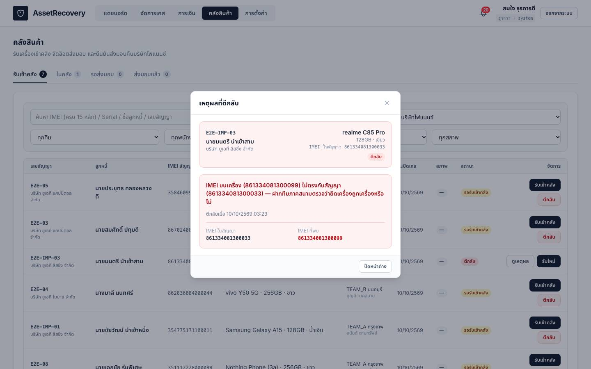

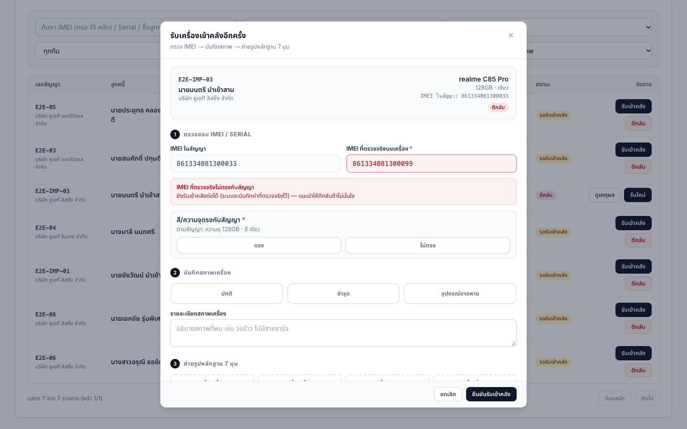

**ผลที่ควรเห็น:** "รับเครื่องเข้าคลังอีกครั้งแล้ว <เลขเคส> · <รุ่น>"

**ข้อควรระวัง:** ช่อง IMEI ที่ระบบเติมไว้คือ **ค่าที่พบครั้งก่อน** (ซึ่งอาจเป็นค่าที่ไม่ตรง) — ต้องพิมพ์/สแกนใหม่จากเครื่องจริงทุกครั้ง

## 8. ดูเครื่องในคลังและค้นหา IMEI

**ขั้นตอน**
1. **คลังสินค้า** → แท็บ **ในคลัง** — แสดงการ์ดต่อบริษัทไฟแนนซ์ (จำนวนเครื่อง · พร้อมส่ง · อยู่ในล็อต · แยกตามสภาพ)
2. กดการ์ดบริษัทเพื่อดูรายการเครื่อง (กด **← กลับไปหน้ารวมบริษัท** เพื่อย้อนกลับ)
3. ค้นหาด้วย **IMEI ครบ 15 หลัก** / ชื่อลูกหนี้ / เลขสัญญา
4. กด **ดู** ที่แถว → หน้าต่าง **ข้อมูลเครื่องในคลัง** → กดชื่อมุมเพื่อเปิดรูป

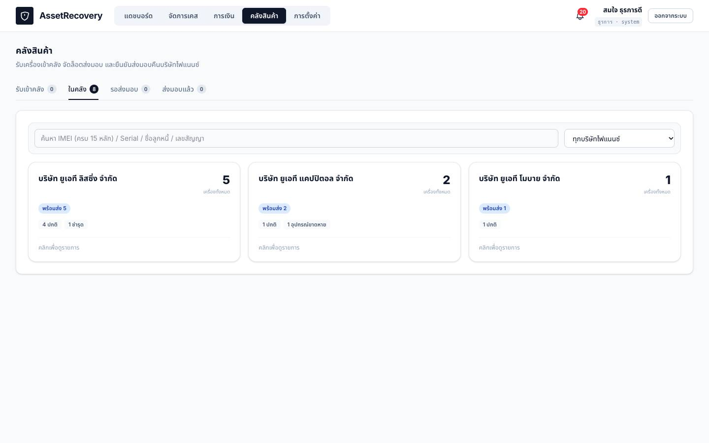

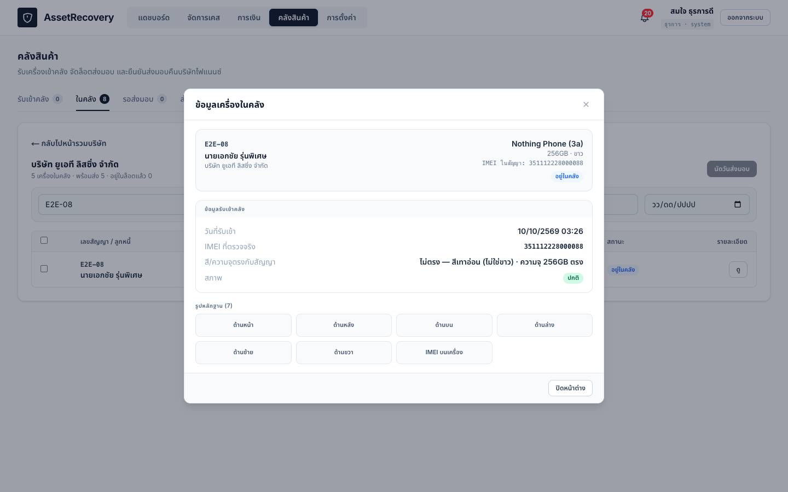

**ผลที่ควรเห็น:** วันที่รับเข้า · IMEI ที่ตรวจจริง · สี/ความจุ (และ "สิ่งที่พบ" ถ้าไม่ตรง) · สภาพ · รูป 7 มุม (เปิดในหน้าต่างหรือแท็บใหม่ได้)

**ข้อควรระวัง:** ช่องค้นหา IMEI ต้องพิมพ์ **ครบ 15 หลัก** — พิมพ์บางส่วน (เช่น 8 หลักท้าย) จะขึ้น "ไม่พบเครื่องตามเงื่อนไข" ถ้าจำไม่ครบให้ค้นด้วยชื่อลูกหนี้หรือเลขสัญญาแทน

## 9. สร้างล็อตส่งมอบ — ไฟแนนซ์มารับที่คลัง

**เป้าหมาย:** รวมเครื่องที่จะคืนบริษัทไฟแนนซ์ 1 ราย เป็นล็อตเดียว พร้อมใบส่งมอบ

**ก่อนเริ่ม:** ได้วันเวลานัดรับและชื่อผู้มารับจากบริษัทไฟแนนซ์แล้ว

**ขั้นตอน**
1. แท็บ **ในคลัง** → กดการ์ดบริษัทที่จะส่งมอบ
2. ติ๊กเครื่องที่จะส่ง (ติ๊กช่องหัวตาราง = เลือกทั้งหมด) — ปุ่มเปลี่ยนเป็น **นัดวันส่งมอบ (N)**
3. กด **นัดวันส่งมอบ (N)**
4. **รูปแบบการส่งมอบ** เลือก **🏢 ไฟแนนซ์มารับที่คลัง**
5. กรอก **วันเวลานัดรับ** · **ชื่อผู้ประสานงาน** · **หมายเหตุ**
6. กด **ดูรายการ ▼** ตรวจเครื่องในล็อต · กด **ดูตัวอย่างใบส่งมอบ** ตรวจร่าง → **ปิด**
7. กด **บันทึกการนัด**

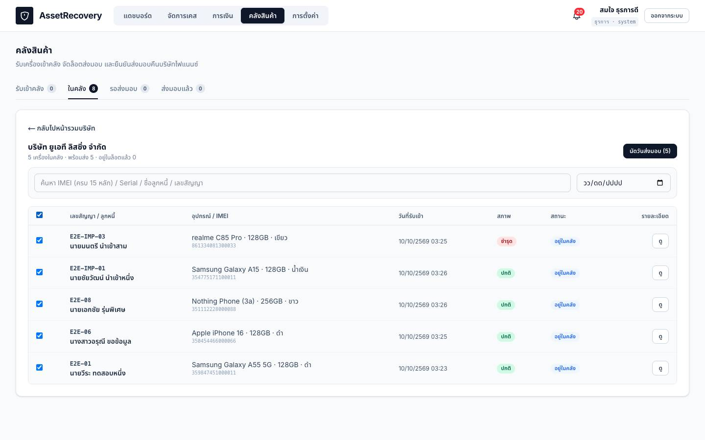

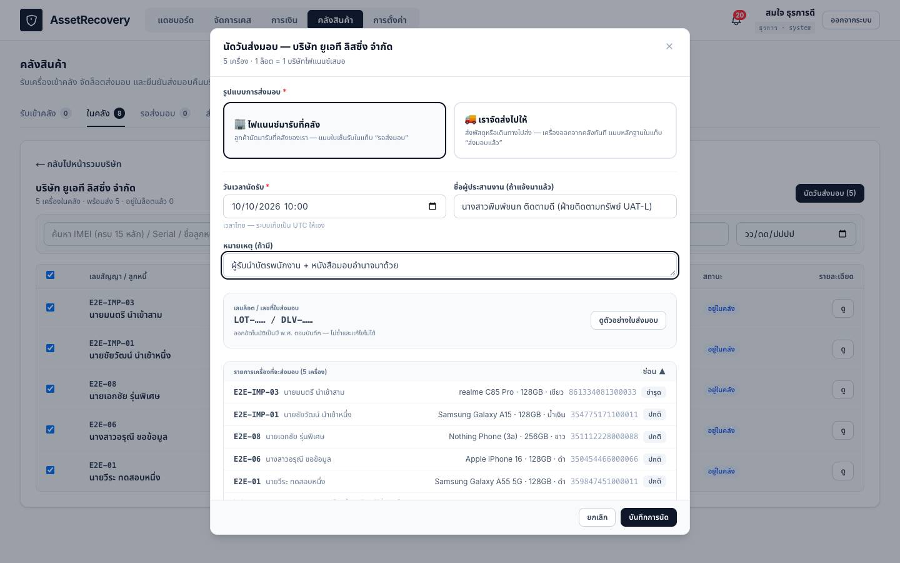

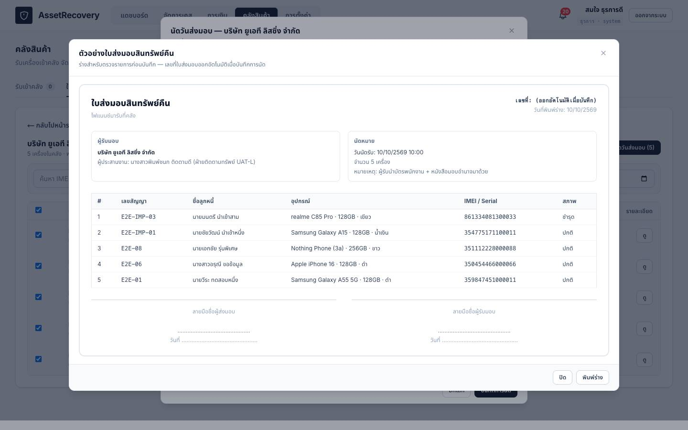

| ช่อง | บังคับ | ตัวอย่าง / หมายเหตุ |
|---|---|---|
| รูปแบบการส่งมอบ | ✔ | ไฟแนนซ์มารับที่คลัง |
| วันเวลานัดรับ | ✔ | 10/10/2569 10:00 (เวลาไทย) |
| ชื่อผู้ประสานงาน | – | "นางสาว… (ฝ่ายติดตามทรัพย์ บริษัท…)" |
| หมายเหตุ | – | "ผู้รับนำบัตรพนักงาน + หนังสือมอบอำนาจมาด้วย" |

**ผลที่ควรเห็น:** "สร้างล็อต LOT-2569-001 แล้ว · 5 เครื่อง · ใบส่งมอบ DLV-2569-001 · ไปต่อที่แท็บ “รอส่งมอบ”" และระบบพาไปแท็บ **รอส่งมอบ**

**ข้อควรระวัง / เคล็ดลับ**
- **1 ล็อต = 1 บริษัทไฟแนนซ์** เสมอ — เลือกเครื่องได้เฉพาะในการ์ดบริษัทเดียว
- **เลขล็อต (LOT-ปี พ.ศ.-ลำดับ) และเลขใบส่งมอบ (DLV-ปี พ.ศ.-ลำดับ)** ระบบออกให้ตอนกดบันทึก ไม่ซ้ำและแก้ไม่ได้
- ช่องวันเวลาในบางเบราว์เซอร์แสดงปี ค.ศ. ตามเครื่อง — ระบบบันทึกเป็นเวลาไทยและแสดงผลเป็น พ.ศ. ในรายการ/เอกสาร
- กด **บันทึกการนัด** โดยไม่กรอกวัน ระบบขึ้น "ต้องระบุวันนัดรับ"
- หลังสร้างล็อต การ์ดบริษัทในแท็บ ในคลัง จะแสดง "พร้อมส่ง 0 · อยู่ในล็อต N"

## 10. สร้างล็อตส่งมอบ — เราจัดส่งไปให้

**ขั้นตอน**
1. แท็บ **ในคลัง** → กดการ์ดบริษัท → ติ๊กเครื่อง → **นัดวันส่งมอบ (N)**
2. **รูปแบบการส่งมอบ** เลือก **🚚 เราจัดส่งไปให้**
3. กรอก **กำหนดวันเวลาจัดส่ง** · **ที่อยู่จัดส่ง** (ระบบเติมจากที่อยู่บริษัทไฟแนนซ์ให้ แก้ได้) · **เลขพัสดุ** · **หมายเหตุ**
4. กด **บันทึกการนัด**

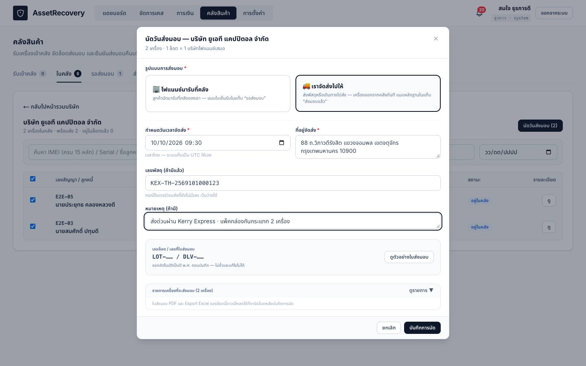

| ช่อง | บังคับ | ตัวอย่าง |
|---|---|---|
| กำหนดวันเวลาจัดส่ง | ✔ | 10/10/2569 09:30 |
| ที่อยู่จัดส่ง | ✔ | 88 ถ.วิภาวดีรังสิต แขวงจอมพล เขตจตุจักร กรุงเทพมหานคร 10900 |
| เลขพัสดุ | – | เลขติดตามพัสดุของบริษัทขนส่ง |
| หมายเหตุ | – | |

**ผลที่ควรเห็น:** "สร้างล็อต LOT-… แล้ว · N เครื่อง · ใบส่งมอบ DLV-… · ไปต่อที่แท็บ “ส่งมอบแล้ว”"

**ข้อควรระวัง:** ล็อตแบบ **เราจัดส่ง** จะไปอยู่แท็บ **ส่งมอบแล้ว** ทันที (เพราะเครื่องออกจากคลังแล้ว) ในสถานะ **รอแนบหลักฐานจัดส่ง** — อย่าหาในแท็บรอส่งมอบ

## 11. พิมพ์ใบส่งมอบ PDF และส่งออก Excel

**เป้าหมาย:** ได้เอกสารให้ผู้รับเซ็น และไฟล์รายการเครื่องสำหรับส่งบริษัทไฟแนนซ์

**ขั้นตอน**
1. แท็บ **รอส่งมอบ** (หรือ **ส่งมอบแล้ว** สำหรับแบบจัดส่ง) — การ์ดล็อตแสดงประเภท · สถานะ (เช่น **รอแนบใบเซ็นรับ**) · เอกสารที่ต้องแนบ · วันนัด
2. กด **ดูรายการ** ที่การ์ดล็อต
3. กด **ใบส่งมอบ PDF** → ไฟล์ดาวน์โหลด → พิมพ์ให้ผู้รับเซ็น
4. กด **Export Excel** ถ้าต้องการไฟล์รายการเครื่อง

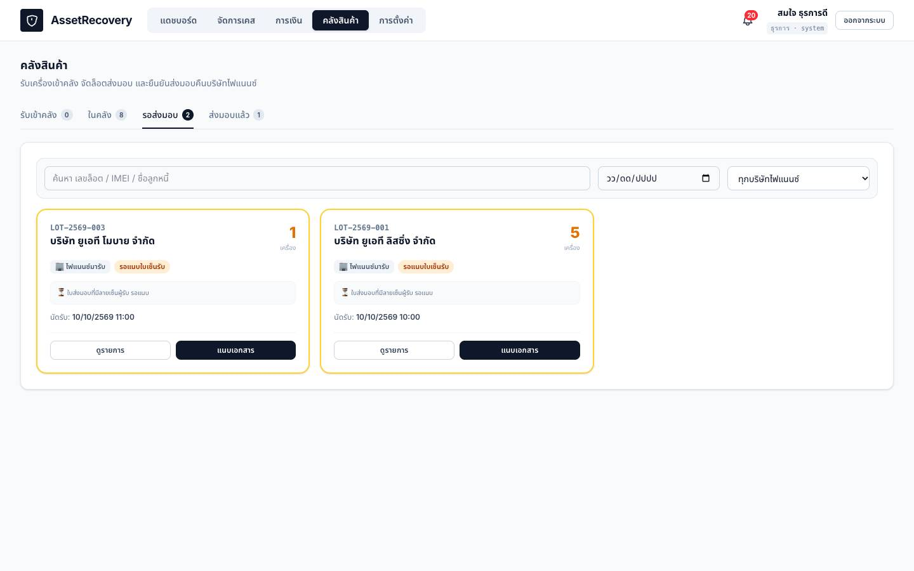

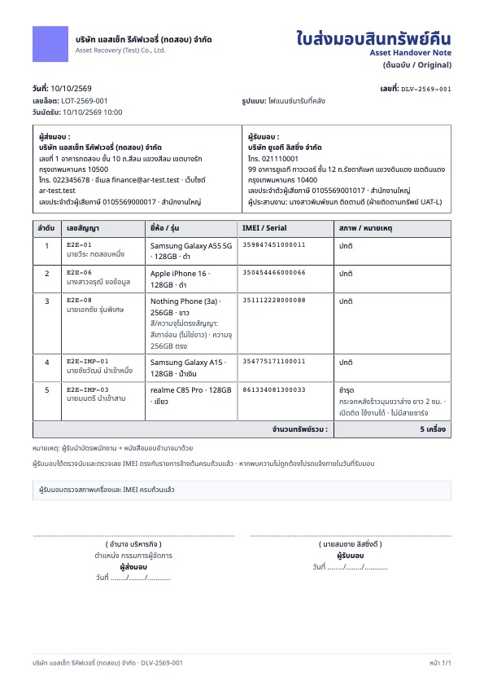

**ผลที่ควรเห็น**
- **PDF:** "ใบส่งมอบสินทรัพย์คืน" เลขที่ DLV-… · ข้อมูลผู้ส่งมอบ/ผู้รับมอบ · ตารางเครื่อง พร้อมสภาพและสี/ความจุที่ไม่ตรง · ช่องลงนามทั้ง 2 ฝ่าย
- **Excel:** หัวเอกสาร + ตารางเครื่อง (IMEI ตามสัญญา / ตรวจจริง · สภาพ · หมายเหตุ)

**เคล็ดลับ**
- ไฟล์ PDF ที่ดาวน์โหลดตั้งชื่อตาม **เลขล็อต** (LOT-….pdf) ไม่ใช่เลขใบส่งมอบ — ในเอกสารยังพิมพ์เลข DLV-… ตามปกติ
- แบบ **เราจัดส่ง** แนะนำพิมพ์ 2 ชุด: แนบไปกับพัสดุให้ผู้รับเซ็นส่งกลับ และเก็บสำเนาไว้

## 12. แนบใบเซ็นรับและยืนยันล็อต (ไฟแนนซ์มารับ)

**เป้าหมาย:** ปิดล็อตหลังผู้รับมารับเครื่องและเซ็นใบส่งมอบแล้ว

**ก่อนเริ่ม:** สแกนหรือถ่ายรูปใบส่งมอบที่ผู้รับเซ็นแล้ว (PDF หรือรูป)

**ขั้นตอน**
1. แท็บ **รอส่งมอบ** → กด **แนบเอกสาร** บนการ์ดล็อต (หรือในหน้ารายละเอียดล็อต กด **แนบเอกสาร & ยืนยัน**)
2. ตรวจข้อมูลล็อต: เลขล็อต · เลขใบส่งมอบ · บริษัท · รูปแบบ · จำนวนเครื่อง
3. ช่อง **① ใบส่งมอบที่มีลายเซ็นผู้รับ** → แตะ **เลือกไฟล์** → เลือกไฟล์สแกน (แสดง "แนบแล้ว ✅" · กด **ดูไฟล์ที่แนบ** ตรวจได้)
4. ตรวจ **วันเวลาที่ผู้รับมารับจริง** (ค่าตั้งต้น = ตอนนี้) แก้ให้ตรงเวลาที่รับจริง
5. อ่านกรอบสีเขียว "เมื่อยืนยันแล้ว ระบบจะทำให้ทันที…"
6. กด **ยืนยันส่งมอบสำเร็จ**

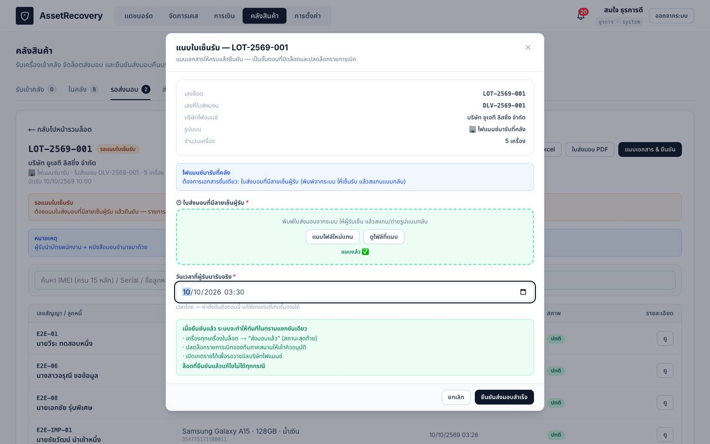

| ช่อง | บังคับ | หมายเหตุ |
|---|---|---|
| ① ใบส่งมอบที่มีลายเซ็นผู้รับ | ✔ | PDF หรือรูป |
| วันเวลาที่ผู้รับมารับจริง | ✔ | เวลาไทย · ค่าตั้งต้นคือเวลาปัจจุบัน |

**ผลที่ควรเห็น:** (ใช้เวลาประมาณ 10 วินาที) ข้อความ "ยืนยันส่งมอบ LOT-… แล้ว · เครื่อง N เครื่องส่งมอบแล้ว · ปลดล็อกรายการเบิก M รายการ" · ล็อตย้ายไปแท็บ **ส่งมอบแล้ว** สถานะ **ยืนยันแล้ว**

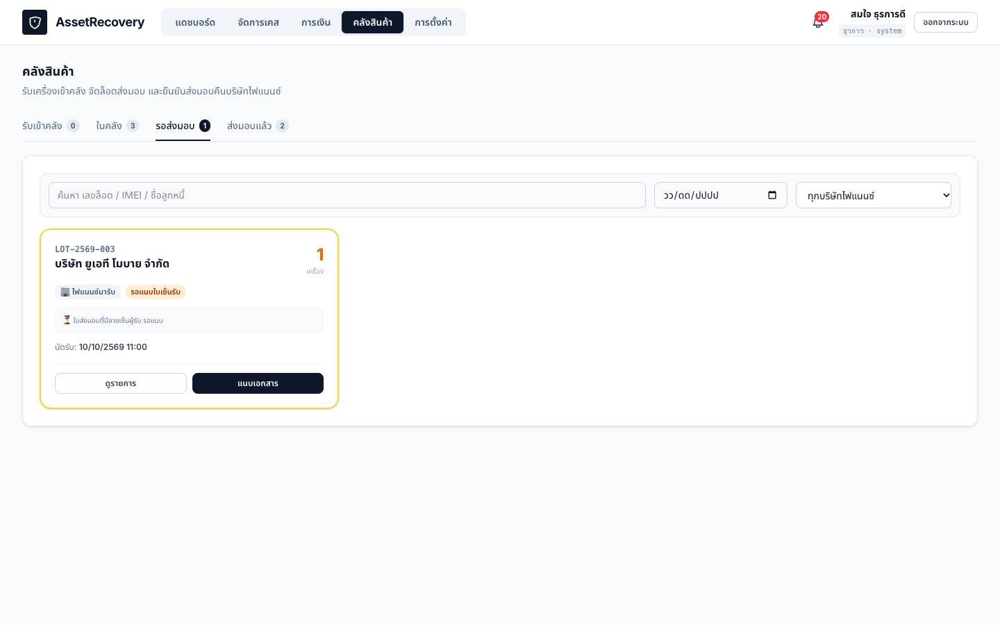

**ข้อควรระวัง**
- ปุ่ม **ยืนยันส่งมอบสำเร็จ** จะกดไม่ได้จนกว่าแนบไฟล์ครบ
- กดแล้ว **ไม่มีหน้าต่างถามซ้ำ** และ **ล็อตที่ยืนยันแล้วแก้ไข/ลบไม่ได้ทุกกรณี** — ตรวจตาม [เช็กลิสต์ภาคผนวก 3](#ภาคผนวก-3--เช็กลิสต์ก่อนกดยืนยันล็อต) ก่อนกด
- **วันเวลาที่ผู้รับมารับจริง** ต้องเป็นเวลาที่เกิดขึ้นแล้ว — **ห้ามใส่เวลาในอนาคต** (ระบบยังไม่ได้กันไว้) เพราะวันนี้ใช้กำหนดงวดบัญชีของการส่งมอบ
- ถ้าแนบไฟล์ผิด กด **แนบไฟล์ใหม่แทน** ก่อนกดยืนยัน

## 13. แนบใบเซ็นรับ + หลักฐานจัดส่ง และยืนยันล็อต (เราจัดส่ง)

**ก่อนเริ่ม:** มี 2 ไฟล์: ใบส่งมอบที่ผู้รับเซ็น และหลักฐานพัสดุถึงปลายทาง (เช่น ภาพหน้าจอสถานะ "Delivered" จากเว็บขนส่ง)

**ขั้นตอน**
1. แท็บ **ส่งมอบแล้ว** → กดหัวกลุ่มชื่อบริษัทเพื่อกางรายการ
2. ที่แถวล็อตสถานะ **รอแนบหลักฐานจัดส่ง** กด **แนบเอกสาร**
3. แนบ **① ใบส่งมอบที่มีลายเซ็นผู้รับ** และ **② หลักฐานส่งพัสดุ / Delivered**
4. ตรวจ **วันเวลาที่ส่งมอบจริง** → กด **ยืนยันส่งมอบสำเร็จ**

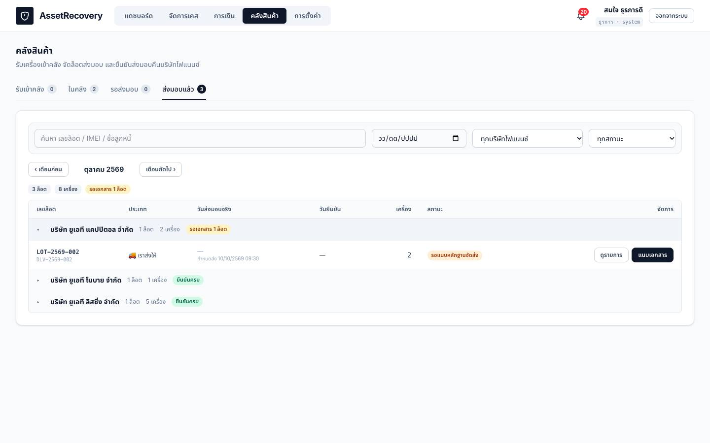

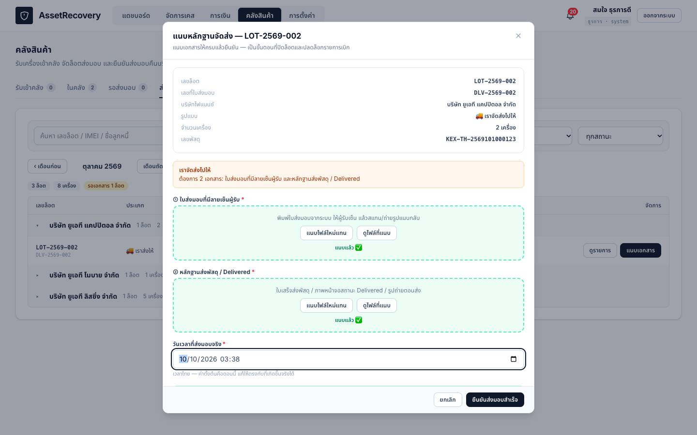

| ช่อง | บังคับ | หมายเหตุ |
|---|---|---|
| ① ใบส่งมอบที่มีลายเซ็นผู้รับ | ✔ | PDF หรือรูป |
| ② หลักฐานส่งพัสดุ / Delivered | ✔ (เฉพาะแบบจัดส่ง) | ภาพหน้าจอสถานะพัสดุ / ใบรับพัสดุ |
| วันเวลาที่ส่งมอบจริง | ✔ | เวลาที่พัสดุถึงผู้รับ |

**ผลที่ควรเห็น:** "ยืนยันส่งมอบ LOT-… แล้ว · เครื่อง N เครื่องส่งมอบแล้ว · ปลดล็อกรายการเบิก M รายการ" · กลุ่มบริษัทแสดง **ยืนยันครบ**

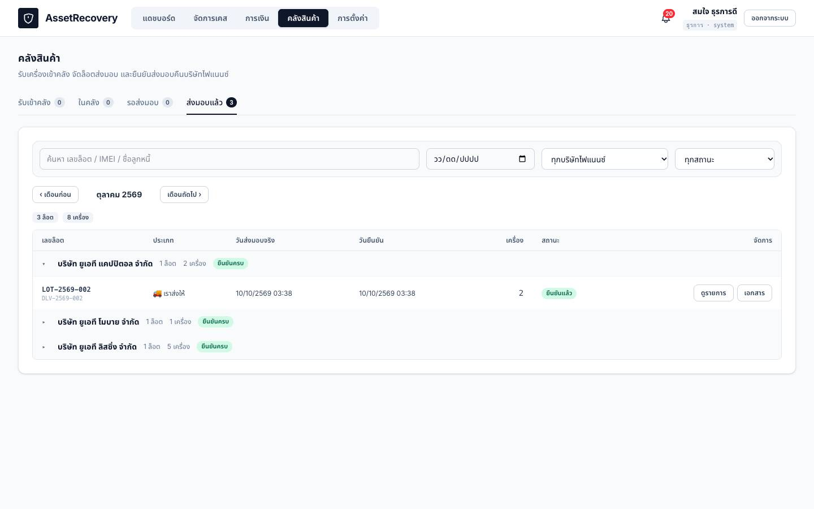

**ข้อควรระวัง:** ปุ่มยืนยันกดได้เมื่อแนบ **ครบ 2 ไฟล์** เท่านั้น — ข้อควรระวังเรื่องวันเวลาและการแก้ไขไม่ได้เหมือนบทที่ 12

## 14. ผลของการยืนยันล็อตต่อรายการเบิกและรายได้

เมื่อกด **ยืนยันส่งมอบสำเร็จ** ระบบทำ 4 อย่างพร้อมกันในครั้งเดียว (ถ้าข้อใดล้ม จะย้อนกลับทั้งหมดและแจ้งข้อผิดพลาด — ล็อตยังไม่ถูกยืนยัน ให้ลองใหม่หรือแจ้งผู้ดูแลระบบ):

| สิ่งที่เกิด | ผลกับใคร |
|---|---|
| เครื่องทุกเครื่องในล็อต → **ส่งมอบแล้ว** (สถานะสุดท้าย) | คลัง |
| **ปลดล็อกรายการเบิก** ของเคสในล็อต (คอมมิชชั่น · ค่าน้ำมันตามระยะทาง) จาก "รอยืนยันคืนคลัง" → เข้าคิวอนุมัติขั้น 1 | ผู้จัดการทีม → การเงิน → พนักงานได้รับเงินในรอบจ่าย |
| บันทึกประวัติการยืนยัน (ผู้ยืนยัน · เวลา · เอกสาร) | ตรวจสอบย้อนหลังได้ |
| **เปิดทางให้ระบบสร้างรายได้** เพื่อวางบิลบริษัทไฟแนนซ์ | การเงิน |

- รายได้ของเคสจะเกิดจริงเมื่อ **ครบทุกเงื่อนไข**: ล็อตยืนยันแล้ว + รายการเบิกของเคสนั้นอนุมัติครบทั้ง 2 ขั้น + ระบบสรุปวันลงพื้นที่ของเคสนั้นแล้ว (ทุกคืน) — จึงอาจเห็นรายได้ช้ากว่าวันที่ยืนยันล็อต 1 วันขึ้นไป เป็นเรื่องปกติ
- หลักฐานปิดงานของเคสที่รับเข้าคลังแล้วถือว่า **ผ่านอัตโนมัติ**
- **ยิ่งยืนยันล็อตช้า พนักงานยิ่งได้รับเงินช้า** — ควรแนบเอกสารและยืนยันภายในวันที่ส่งมอบ

## 15. ประวัติล็อต · ค้นหา IMEI ในเครื่องที่ส่งมอบแล้ว · ดูเอกสารแนบ

**ขั้นตอน — ดูประวัติและค้นหา**
1. แท็บ **ส่งมอบแล้ว** — เลื่อนเดือนด้วย **‹ เดือนก่อน / เดือนถัดไป ›** · กรองบริษัท / สถานะ / วันส่งมอบ
2. ค้นหา **เลขล็อต / IMEI / ชื่อลูกหนี้** (IMEI ต้องครบ 15 หลัก) — เช่น พิมพ์ IMEI จะเหลือเฉพาะล็อตที่มีเครื่องนั้น
3. กด **ดูรายการ** → เห็นวันนัดรับ · วันส่งมอบจริง · วันยืนยัน · ปุ่ม **Export Excel** · **ใบส่งมอบ PDF** · **ดูเอกสารแนบ**
4. กด **ดู** ที่เครื่อง → สถานะ **ส่งมอบแล้ว** และ "ล็อตส่งมอบ LOT-… · DLV-…"

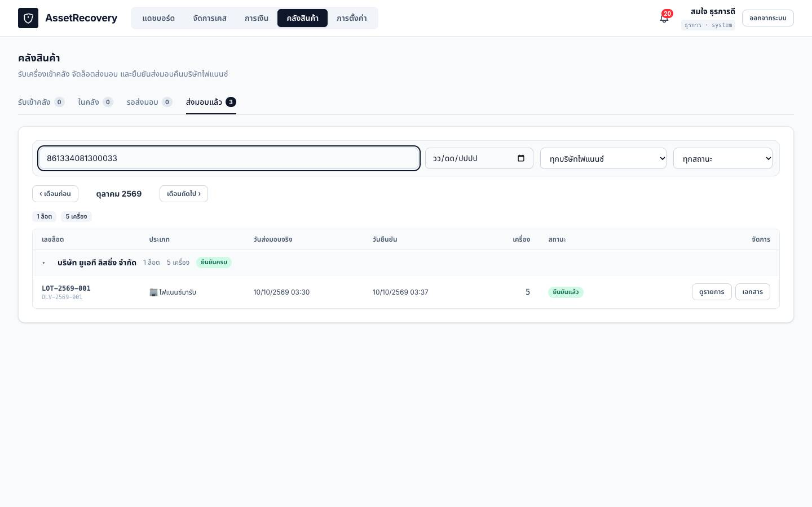

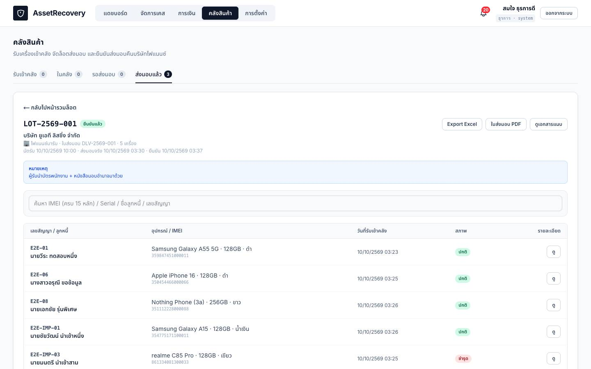

**ขั้นตอน — ดูเอกสารที่แนบ**
1. กด **เอกสาร** ที่แถวล็อต
2. ดูวันส่งมอบจริง · ยืนยันเมื่อ/โดย · ไฟล์ ① ② → กด **เปิดดู / ดาวน์โหลด** (มีปุ่ม **เปิดในแท็บใหม่**)

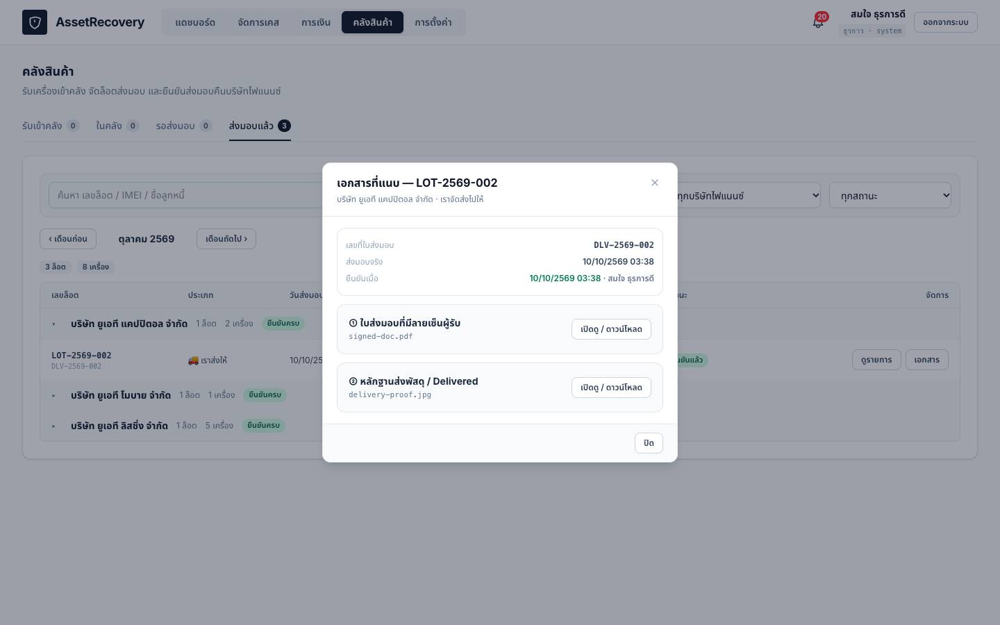

**เคล็ดลับ:** หัวหน้าต่างดูรูปอาจแสดงชื่อไฟล์ยาวที่มีรหัสนำหน้า — เป็นชื่อไฟล์ที่ระบบเก็บไว้ ไม่มีผลต่อเอกสาร

## 16. ส่งออกข้อมูลคลัง

| ต้องการ | ใครทำได้ | ทำอย่างไร |
|---|---|---|
| รายการเครื่องของ **ล็อตเดียว** | ธุรการ | หน้ารายละเอียดล็อต → **Export Excel** / **ใบส่งมอบ PDF** (บทที่ 11 / 15) |
| **สรุปคลังทั้งหมด** (รอรับเข้า · ในคลัง · รอส่งมอบ · ส่งมอบแล้ว แยกตามบริษัท) | ผู้บริหาร · ผู้จัดการทีม (เฉพาะทีมตัวเอง) | เมนู **รายงาน** → **สรุปคลังสินค้า** → เลือกช่วงเวลา → **ส่งออก Excel** / **ส่งออก PDF** |

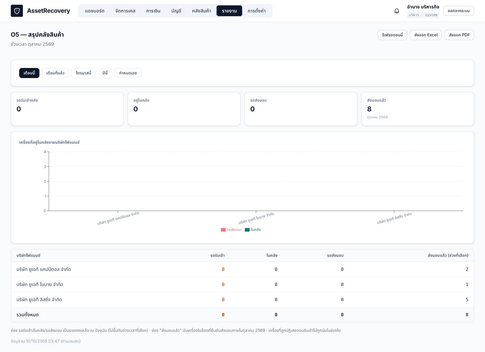

**ข้อควรระวัง:** ธุรการ **ไม่มีเมนูรายงาน** — ถ้าต้องการสรุปคลังทั้งเดือน ให้ขอจากผู้บริหาร หรือส่งออก Excel ทีละล็อต

## 17. ตรวจปิดงานประจำวัน

**ขั้นตอน**
1. กลับ **แดชบอร์ด**
2. ตรวจว่า **เครื่องรอรับเข้าคลัง 0** และ **ใบส่งมอบที่ยังไม่ยืนยัน 0** (หรือเหลือเฉพาะล็อตที่นัดวันหลัง)

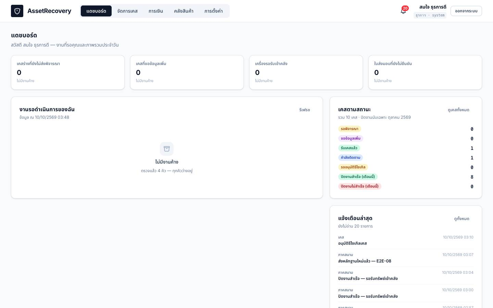

**เคล็ดลับ:** ถ้ายังมีเครื่องสถานะ **ตีกลับ** ค้าง ให้ติดตามกับหัวหน้าทีมว่าจะนำเครื่องที่ถูกต้องมาส่งเมื่อไร

---

# ภาคผนวก

## ภาคผนวก 1 — คำศัพท์

| คำ | ความหมาย |
|---|---|
| IMEI | หมายเลขประจำเครื่องมือถือ 15 หลัก — ต้องตรงกับสัญญาทุกหลัก |
| IMEI ตามสัญญา / ตรวจจริง | ค่าในสัญญาของบริษัทไฟแนนซ์ / ค่าที่คลังอ่านได้จากเครื่องจริง |
| รับเข้าคลัง | ตรวจและบันทึกว่าได้รับเครื่องแล้ว |
| ตีกลับ (การรับเข้า) | ไม่รับเครื่องเข้าคลัง พร้อมเหตุผล — ย้อนได้ด้วย "รับใหม่" |
| สภาพเครื่อง | ปกติ / ชำรุด / อุปกรณ์ขาดหาย |
| รูป 7 มุม | ด้านหน้า · หลัง · บน · ล่าง · ซ้าย · ขวา · IMEI บนเครื่อง |
| ล็อตส่งมอบ (LOT) | ชุดเครื่องของบริษัทไฟแนนซ์ 1 รายที่ส่งคืนพร้อมกัน — เลข LOT-ปี พ.ศ.-ลำดับ |
| ใบส่งมอบ (DLV) | เอกสารส่งมอบสินทรัพย์คืนของล็อต ให้ผู้รับเซ็น — เลข DLV-ปี พ.ศ.-ลำดับ |
| ไฟแนนซ์มารับที่คลัง | ผู้แทนบริษัทไฟแนนซ์มารับเครื่องเอง — ต้องแนบใบเซ็นรับ 1 ไฟล์ |
| เราจัดส่งไปให้ | ส่งพัสดุไปให้บริษัทไฟแนนซ์ — ต้องแนบใบเซ็นรับ + หลักฐานจัดส่ง 2 ไฟล์ |
| ยืนยันล็อต | ปิดล็อตหลังแนบเอกสารครบ — แก้ไขไม่ได้ และปลดล็อกรายการเบิกของพนักงาน |
| รายการเบิก | ค่าตอบแทน/ค่าใช้จ่ายของพนักงานภาคสนาม (เช่น คอมมิชชั่น ค่าน้ำมัน) |

## ภาคผนวก 2 — สถานะที่จะเห็นและความหมาย

### สถานะเครื่อง
| สถานะ | อยู่แท็บ | ความหมาย | ทำอะไรต่อ |
|---|---|---|---|
| **รอรับเข้าคลัง** | รับเข้าคลัง | พนักงานปิดงานสำเร็จ รอคลังตรวจรับ | รับเข้าคลัง หรือ ตีกลับ |
| **ตีกลับ** | รับเข้าคลัง | คลังไม่รับ (มีเหตุผล) | รอเครื่องที่ถูกต้อง → รับใหม่ |
| **อยู่ในคลัง** | ในคลัง | รับเข้าแล้ว ยังไม่อยู่ในล็อต (พร้อมส่ง) | สร้างล็อต |
| **รอส่งมอบ** | ในคลัง / รอส่งมอบ | อยู่ในล็อตที่ยังไม่ยืนยัน | แนบเอกสาร + ยืนยันล็อต |
| **ส่งมอบแล้ว** | ส่งมอบแล้ว | ล็อตยืนยันแล้ว (สถานะสุดท้าย) | — |

### สถานะล็อต
| สถานะ | ความหมาย |
|---|---|
| **รอแนบใบเซ็นรับ** | ล็อตแบบไฟแนนซ์มารับ — รอผู้รับเซ็นแล้วแนบไฟล์ |
| **รอแนบหลักฐานจัดส่ง** | ล็อตแบบเราจัดส่ง — รอแนบใบเซ็นรับ + หลักฐานพัสดุถึง |
| **ยืนยันแล้ว** | ปิดล็อตแล้ว แก้ไข/ลบไม่ได้ |
| **ยืนยันครบ** (ป้ายกลุ่มบริษัท) | ทุกล็อตของบริษัทนั้นที่แสดงอยู่ยืนยันแล้ว |

### สภาพเครื่อง
| สภาพ | สีป้าย | ต้องกรอกรายละเอียด |
|---|---|---|
| ปกติ | เขียว | ไม่ต้อง |
| ชำรุด | แดง | ต้อง |
| อุปกรณ์ขาดหาย | เหลือง | ต้อง |

### สถานะรายการเบิกที่เกี่ยวกับคลัง (ที่ผู้จัดการ/พนักงานเห็น)
| สถานะ | ความหมาย |
|---|---|
| รอยืนยันคืนคลัง | ยังรอคลังรับเข้า + ยืนยันล็อต |
| รออนุมัติจ่าย | หลังยืนยันล็อตแล้ว — รอผู้จัดการทีมอนุมัติขั้น 1 |
| รอการเงินอนุมัติ | ผ่านขั้น 1 แล้ว รอการเงิน |

## ภาคผนวก 3 — เช็กลิสต์ก่อนกดยืนยันล็อต

- [ ] จำนวนเครื่องในล็อตตรงกับที่ผู้รับนับจริง
- [ ] ใบส่งมอบที่แนบมีลายเซ็นผู้รับครบ อ่านออก และเป็นเลข DLV ของล็อตนี้
- [ ] (แบบจัดส่ง) หลักฐานพัสดุแสดงว่าถึงผู้รับแล้ว
- [ ] **วันเวลาที่รับ/ส่งมอบจริง** ถูกต้อง และ **ไม่ใช่เวลาในอนาคต**
- [ ] ตรวจไฟล์ด้วยปุ่ม **ดูไฟล์ที่แนบ** แล้ว
- [ ] เข้าใจว่ากดแล้ว **แก้ไขไม่ได้ทุกกรณี**

## ภาคผนวก 4 — คำถามที่พบบ่อย (FAQ)

**ถาม: IMEI ไม่ตรงแต่ระบบยังให้กดรับเข้าได้ ควรทำอย่างไร?**
ตอบ: ระบบเตือนแต่ไม่บล็อก เพื่อรองรับกรณีพิเศษที่ตรวจสอบแล้ว — ถ้าไม่มั่นใจให้ **ตีกลับ** เสมอ

**ถาม: พิมพ์ IMEI มีขีดหรือเว้นวรรคได้ไหม?**
ตอบ: ได้ คั่นด้วยเว้นวรรค ขีด หรือจุด ระบบตัดออกให้ แต่ตัวเลขที่เหลือต้องครบ 15 หลักพอดี

**ถาม: ค้นหา IMEI แล้วไม่เจอ ทั้งที่มีเครื่องอยู่**
ตอบ: ต้องพิมพ์ครบ 15 หลัก ถ้าจำไม่ครบให้ค้นด้วยชื่อลูกหนี้หรือเลขสัญญา และตรวจว่าอยู่แท็บที่ถูกต้อง (ในคลัง / ส่งมอบแล้ว)

**ถาม: รูปไม่ครบ 7 มุมรับเข้าได้ไหม?**
ตอบ: ได้ (มีป้ายเตือน) แต่ควรถ่ายให้ครบเพื่อใช้เป็นหลักฐานกับบริษัทไฟแนนซ์

**ถาม: รวมเครื่องหลายบริษัทในล็อตเดียวได้ไหม?**
ตอบ: ไม่ได้ — 1 ล็อต = 1 บริษัทไฟแนนซ์

**ถาม: สร้างล็อตผิด / ยืนยันล็อตผิด แก้ได้ไหม?**
ตอบ: ล็อตที่ **ยืนยันแล้วแก้ไม่ได้ทุกกรณี** — ถ้าผิดพลาดหลังยืนยันให้แจ้งผู้บริหาร/ผู้ดูแลระบบทันที · ก่อนยืนยันให้ตรวจตามเช็กลิสต์ภาคผนวก 3

**ถาม: ตีกลับเครื่องแล้ว พนักงานรู้ไหม?**
ตอบ: พนักงานเจ้าของเคสได้แจ้งเตือนพร้อมเหตุผล แต่หัวหน้า/ผู้จัดการทีมไม่ได้รับ — ควรแจ้งหัวหน้าทีมเพิ่มเอง

**ถาม: ยืนยันล็อตแล้ว ทำไมพนักงานยังไม่ได้เงิน?**
ตอบ: การยืนยันล็อตแค่ปลดล็อกรายการเบิก ต่อจากนั้นต้องผ่านผู้จัดการทีม (ขั้น 1) → การเงิน (ขั้น 2) → รอบจ่าย

**ถาม: ผู้จัดการทีมกด "เอกสาร" ของล็อตแล้วขึ้น "ไม่พบไฟล์ที่แนบไว้"**
ตอบ: ไฟล์ไม่ได้หาย — ใบเซ็นรับเปิดดูได้เฉพาะฝ่ายคลัง ถ้าผู้จัดการต้องการ ให้ธุรการดาวน์โหลดส่งให้

**ถาม: ใช้มือถือทำงานคลังได้ไหม?**
ตอบ: เปิดผ่านเบราว์เซอร์บนมือถือได้ แต่ตารางคลังกว้างและต้องพิมพ์ใบส่งมอบ จึงแนะนำคอมพิวเตอร์เป็นหลัก
