# เล่ม 5 — การเงิน (เจ้าหน้าที่การเงิน)

> คู่มือผู้ใช้ AssetRecovery สำหรับ **เจ้าหน้าที่การเงิน**
> ข้อมูลและภาพในเล่มนี้มาจากการทดลองใช้งานจริงบนระบบทดสอบ เมื่อ 10/10/2569 — ชื่อคน บริษัท เลขบัญชี เลขผู้เสียภาษี และเลขเอกสารในภาพเป็นข้อมูลตัวอย่าง

---

## เล่มนี้สำหรับใคร

| บทบาท | งานการเงินที่ทำได้ |
|---|---|
| **การเงิน** | อนุมัติรายการเบิก **ขั้นที่ 2** · ตีกลับ / ปฏิเสธรายการเบิก · อนุมัติ / ปรับลด / ไม่อนุมัติ **เงินทดรอง** · บันทึกรับคืนเงินทดรอง · สร้าง **รอบจ่าย** · สร้าง **ไฟล์โอนธนาคาร** · **ยืนยันจ่ายสำเร็จ** · สร้างและส่ง **รอบวางบิล** · พิมพ์ **ใบแจ้งหนี้ PDF** · บันทึกรับ **50 ทวิ ที่ลูกค้าหัก** · สร้างและอนุมัติ **รายการปรับปรุง (Adjustment)** · ดูแลข้อมูล **ผู้รับเงิน** · ดู **กำไรขั้นต้น** และรายงานหมวดการเงิน |
| ผู้จัดการทีมติดตามทรัพย์ | อนุมัติรายการเบิกขั้นที่ 1 (ก่อนถึงคุณ) |
| บริหาร | อนุมัติขั้นสุดท้ายเมื่อรายการเบิกเกินเพดาน · ร่วมอนุมัติรายการปรับปรุงบางกรณี |
| บัญชี | งานเอกสารภาษีและกระทบยอดธนาคาร (ดูตารางแบ่งหน้าที่ด้านล่าง) |

### แบ่งหน้าที่ "การเงิน" กับ "บัญชี" — ใครทำอะไร

งานเงินเข้า–เงินออกบางอย่างคุณ **มองเห็น** ในระบบ แต่ **ผู้กดทำคือฝ่ายบัญชี** ให้ยึดตารางนี้

| งาน | การเงิน | บัญชี | อ่านต่อ |
|---|---|---|---|
| อนุมัติรายการเบิก ขั้นที่ 2 · เงินทดรอง · รอบจ่าย · ไฟล์โอน · ยืนยันจ่าย | **ทำ** | ดู | เล่มนี้ |
| รายได้ · สร้างรอบวางบิล · ส่งบิล · ใบแจ้งหนี้ PDF | **ทำ** | ดู | เล่มนี้ |
| บันทึกรับ 50 ทวิ ที่ลูกค้าหัก | **ทำ** | **ทำ** | เล่มนี้ / เล่ม 6 |
| สร้าง / อนุมัติรายการปรับปรุง (Adjustment) | **ทำ** | ไม่มีสิทธิ์ | เล่มนี้ |
| **นำเข้า statement ธนาคาร · จับคู่รายการเดินบัญชี · เงินรับรอตรวจสอบ** | ดูอย่างเดียว | **ทำ** | [เล่ม 6](06-accounting-exec.md) |
| **ออกใบเสร็จรับเงิน / ใบกำกับภาษี · ใบลดหนี้ / ใบเพิ่มหนี้** | ไม่มีสิทธิ์ | **ทำ** | [เล่ม 6](06-accounting-exec.md) |
| ดู / พิมพ์ 50 ทวิ ที่บริษัทออกให้ผู้รับเงิน · สรุปยื่น ภ.ง.ด.3/53 | ขอจากบัญชี | **ทำ** | [เล่ม 6](06-accounting-exec.md) |
| แก้ข้อยกเว้น (เอกสารไม่ครบ) · ปิดงวด · ส่งชุดเอกสารให้สำนักงานบัญชี | ดู Alerts | **ทำ** | [เล่ม 6](06-accounting-exec.md) |

> ระบบนี้ **เตรียมข้อมูล** ให้สำนักงานบัญชี — ไม่ลงบัญชีแยกประเภทเอง และไม่ยื่นภาษีแทน เอกสารภาษีฉบับสุดท้ายออกโดยสำนักงานบัญชี

### เข้าระบบอย่างไร

1. เปิดเบราว์เซอร์บนคอมพิวเตอร์ไปที่ `https://<โดเมนระบบ>/login`
2. กรอกอีเมลหรือชื่อผู้ใช้ และรหัสผ่านที่ได้รับ → กด **เข้าสู่ระบบ**
3. ระบบเปิด **แดชบอร์ด** — เมนูด้านบนของการเงินมี **แดชบอร์ด · การเงิน · บัญชี · คลังสินค้า · รายงาน · การตั้งค่า** (ตามสิทธิ์)
4. งานเกือบทั้งหมดในเล่มนี้อยู่ที่เมนู **การเงิน** (`https://<โดเมนระบบ>/finance`) ซึ่งมี 10 แท็บ: **ภาพรวม · รออนุมัติ · ค่าตอบแทน · เงินทดรองจ่าย · รอบจ่ายเงิน · รายได้และวางบิล · ผู้รับเงิน (Payee) · ปรับปรุง · กำไรและต้นทุน · 50 ทวิ ลูกค้า**

> แนะนำให้ใช้ **คอมพิวเตอร์** — ตารางการเงินกว้าง และต้องดาวน์โหลดไฟล์โอนไปอัปโหลดเข้าระบบธนาคาร

### ผังงาน (Flowchart)

- งานการเงินขาจ่าย (ค่าตอบแทน · เงินทดรอง · รอบจ่าย) → [ผังงานกลุ่ม 5.1](../diagrams/03-role-flowcharts.md#51-ขาจ่าย-ค่าตอบแทน--เงินทดรอง--รอบจ่าย)
- งานการเงินขารับ (รายได้ · วางบิล · ปรับปรุง) → [ผังงานกลุ่ม 5.2](../diagrams/03-role-flowcharts.md#52-ขารับ-รายได้--วางบิล--ปรับปรุง)
- ต้นทางของรายการเบิก (ผู้จัดการทีม / พนักงาน) → [ผังงานกลุ่ม 3](../diagrams/03-role-flowcharts.md#3-ทีมติดตาม-ผู้จัดการ--หัวหน้า--พนักงานภาคสนาม)
- งานบัญชีที่ต่อจากคุณ (กระทบยอด · ใบกำกับ · ปิดงวด) → [ผังงานกลุ่ม 6](../diagrams/03-role-flowcharts.md#6-บัญชี--บริหาร)

### ภาพรวมเส้นทางเงิน

```
ขาจ่าย (เงินออกให้พนักงาน/ทีมนอก)
พนักงานปิดงาน → คลังยืนยันล็อต → ผู้จัดการอนุมัติขั้น 1 → [คุณ] อนุมัติขั้น 2 (→ บริหาร ถ้าเกินเพดาน)
   → [คุณ] สร้างรอบจ่าย → ตรวจ → สร้างไฟล์โอน → อัปโหลดเข้าธนาคาร → ยืนยันจ่ายสำเร็จ
   → ระบบออก 50 ทวิ อัตโนมัติ → ฝ่ายบัญชีจับคู่ statement / ยื่น ภ.ง.ด.

ขารับ (เงินเข้าจากบริษัทไฟแนนซ์)
ครบ 3 เงื่อนไข (อนุมัติรายการเบิกครบ + คลังยืนยันล็อต + ระบบสรุปวันลงพื้นที่แล้ว) → รายได้ "รอวางบิล"
   → [คุณ] สร้างรอบวางบิล (ร่าง) → ส่งบิล + ใบแจ้งหนี้ PDF → ไฟแนนซ์โอนเงิน
   → ฝ่ายบัญชีนำเข้า statement + จับคู่ → รอบวางบิล "รับชำระครบ" → [คุณ] บันทึก 50 ทวิ ลูกค้า
```

---

## สารบัญ

**ส่วนที่ 1 — งานประจำวัน**
1. [แดชบอร์ดและภาพรวมการเงิน](#1-แดชบอร์ดและภาพรวมการเงิน)
2. [คิวรายการเบิกรออนุมัติ](#2-คิวรายการเบิกรออนุมัติ)
3. [ตรวจรายละเอียดและใบเสร็จ](#3-ตรวจรายละเอียดและใบเสร็จ)
4. [ดูสูตรคำนวณและภาษีหัก ณ ที่จ่าย](#4-ดูสูตรคำนวณและภาษีหัก-ณ-ที่จ่าย)
5. [อนุมัติขั้นที่ 2](#5-อนุมัติขั้นที่-2)
6. [ตีกลับหรือปฏิเสธรายการเบิก](#6-ตีกลับหรือปฏิเสธรายการเบิก)
7. [ค่าน้ำมันเหมาจ่ายและเบี้ยเลี้ยงที่ระบบสรุปทุกคืน](#7-ค่าน้ำมันเหมาจ่ายและเบี้ยเลี้ยงที่ระบบสรุปทุกคืน)
8. [เงินทดรอง — อนุมัติหรือปรับลดยอด](#8-เงินทดรอง--อนุมัติหรือปรับลดยอด)
9. [เงินทดรอง — พนักงานเคลียร์ยอดและใบรับรองแทนใบเสร็จ](#9-เงินทดรอง--พนักงานเคลียร์ยอดและใบรับรองแทนใบเสร็จ)
10. [เงินทดรอง — บันทึกรับคืนและปิดยอด](#10-เงินทดรอง--บันทึกรับคืนและปิดยอด)

**ส่วนที่ 2 — งานประจำรอบจ่าย (ตัดรอบวันที่ 15 และสิ้นเดือน)**

11. [หลักการของรอบจ่ายและภาษีหัก ณ ที่จ่าย](#11-หลักการของรอบจ่ายและภาษีหัก-ณ-ที่จ่าย)
12. [สร้างรอบจ่าย](#12-สร้างรอบจ่าย)
13. [ตรวจรายการในรอบและเอกสารรอบจ่าย](#13-ตรวจรายการในรอบและเอกสารรอบจ่าย)
14. [สร้างไฟล์โอนธนาคาร](#14-สร้างไฟล์โอนธนาคาร)
15. [ยืนยันจ่ายสำเร็จ](#15-ยืนยันจ่ายสำเร็จ)
16. [หนังสือรับรอง 50 ทวิ ที่ระบบออกอัตโนมัติ](#16-หนังสือรับรอง-50-ทวิ-ที่ระบบออกอัตโนมัติ)
17. [ตัวอย่างรอบจ่ายเล็กที่ไม่ถูกหักภาษี](#17-ตัวอย่างรอบจ่ายเล็กที่ไม่ถูกหักภาษี)

**ส่วนที่ 3 — งานประจำเดือน (ขารับ · ปรับปรุง · รายงาน)**

18. [รายได้เกิดขึ้นเมื่อไร](#18-รายได้เกิดขึ้นเมื่อไร)
19. [สร้างรอบวางบิล](#19-สร้างรอบวางบิล)
20. [ส่งบิลและพิมพ์ใบแจ้งหนี้ PDF](#20-ส่งบิลและพิมพ์ใบแจ้งหนี้-pdf)
21. [ติดตามการรับชำระและอายุหนี้](#21-ติดตามการรับชำระและอายุหนี้)
22. [บันทึกรับ 50 ทวิ ที่ลูกค้าหัก](#22-บันทึกรับ-50-ทวิ-ที่ลูกค้าหัก)
23. [ปรับปรุงรายการ (Adjustment)](#23-ปรับปรุงรายการ-adjustment)
24. [ดูแลข้อมูลผู้รับเงิน](#24-ดูแลข้อมูลผู้รับเงิน)
25. [กำไรขั้นต้นและรายงานฝั่งการเงิน](#25-กำไรขั้นต้นและรายงานฝั่งการเงิน)
26. [ข้อยกเว้นที่ต้องจัดการ (Alerts)](#26-ข้อยกเว้นที่ต้องจัดการ-alerts)

**ภาคผนวก**
- [ภาคผนวก 1 — สถานะที่จะเห็นและความหมาย](#ภาคผนวก-1--สถานะที่จะเห็นและความหมาย)
- [ภาคผนวก 2 — สูตรที่ควรรู้ (ภาษาคน)](#ภาคผนวก-2--สูตรที่ควรรู้-ภาษาคน)
- [ภาคผนวก 3 — คำถามที่พบบ่อย (FAQ)](#ภาคผนวก-3--คำถามที่พบบ่อย-faq)
- [ภาคผนวก 4 — ปฏิทินงานการเงินรายเดือน](#ภาคผนวก-4--ปฏิทินงานการเงินรายเดือน)
- [ภาคผนวก 5 — คำศัพท์](#ภาคผนวก-5--คำศัพท์)

---

# ส่วนที่ 1 — งานประจำวัน

## 1. แดชบอร์ดและภาพรวมการเงิน

**เป้าหมาย:** รู้ทันทีว่ามีงานการเงินค้างอะไรบ้าง

**ขั้นตอน**
1. เข้าสู่ระบบ ระบบเปิด **แดชบอร์ด**
2. ดูการ์ด **ภาพรวมการเงิน** 4 ใบ: **เงินรออนุมัติ (Claim) · เงินรอจ่าย (Payout) · ยอดค้างรับ (AR) · กำไรขั้นต้นเดือนนี้**
3. ดูกล่อง **งานรอดำเนินการของฉัน** — เช่น "ค่าตอบแทน/เบิกจ่ายรออนุมัติขั้นของฉัน (12)" และ "เงินทดรองรออนุมัติ (1)"
4. กดปุ่ม **ไปที่ การเงิน › …** ข้างแต่ละงานเพื่อเข้าคิวนั้นโดยตรง

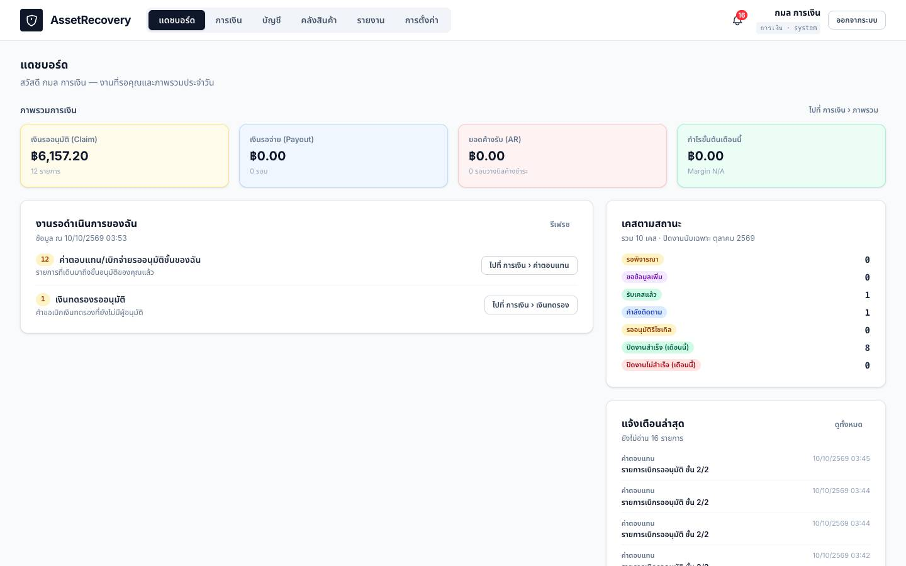

5. เมนู **การเงิน** → แท็บ **ภาพรวม** — การ์ด 4 ใบเดียวกัน + ตาราง **Alerts ที่ต้องจัดการ (Exceptions)** (ดูบทที่ 26)

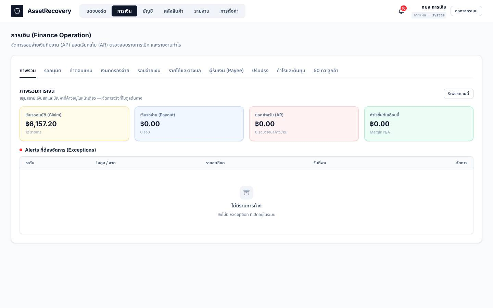

**เคล็ดลับ:** ตัวเลข "กำไรขั้นต้นเดือนนี้" เป็น **N/A** เมื่อเดือนนั้นยังไม่มีรายได้ (ระบบไม่หารด้วยศูนย์) — เป็นเรื่องปกติช่วงต้นเดือน

## 2. คิวรายการเบิกรออนุมัติ

**เป้าหมาย:** เห็นรายการเบิกทั้งหมดที่ผ่านผู้จัดการทีมแล้วและรอคุณ

**ขั้นตอน**
1. **การเงิน** → แท็บ **รออนุมัติ**
2. ด้านบนมีการ์ด **เงินรออนุมัติ (Claim) · เงินทดรองที่ยังไม่เคลียร์ · เลยกำหนดเคลียร์ (Overdue)**
3. ตาราง **รายการเบิก (Claims) — อนุมัติหลายขั้น** กรองได้: **ทั้งหมด · รอขั้น 1 (ผู้จัดการ) · รอขั้น 2 (การเงิน) · ถูกตีกลับ · อนุมัติแล้ว**
4. แต่ละแถวแสดง วันที่ / อ้างอิงเคส · ประเภท · ผู้เบิก / ทีม · **Gross / WHT / Net** · สถานะ / ขั้น · ปุ่ม **รายละเอียด · อนุมัติขั้น 2 · ตีกลับ · ดูสูตร**
5. เลื่อนลงล่างสุดจะเป็นตาราง **เงินทดรองจ่าย (Advances)** ที่รออนุมัติ (บทที่ 8)


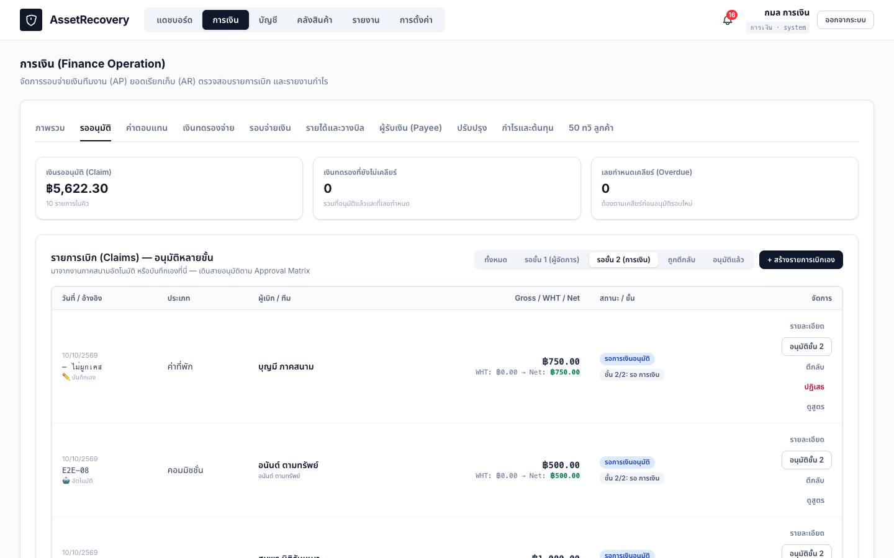

**ประเภทรายการที่พบบ่อย**

| ประเภท | ที่มา | หมายเหตุ |
|---|---|---|
| คอมมิชชั่น | ระบบสร้างเมื่อพนักงานปิดงานสำเร็จ | ตามแผนค่าตอบแทนของทีม |
| เบี้ยเสี่ยง (เบี้ยไม่สำเร็จ) | ระบบสร้างเมื่อปิดงานไม่สำเร็จ | |
| ค่าน้ำมัน (ตามระยะทาง) | ระบบคิดจากระยะทางที่บันทึก × บาท/กม. | ทีมที่ใช้แผนคิดตามกิโลเมตร |
| ค่าน้ำมันเหมาจ่าย · เบี้ยเลี้ยง | ระบบสรุปทุกคืน (บทที่ 7) | กระจายเท่ากันทุกเคสที่เช็คอินวันนั้น |
| ค่าที่พัก ฯลฯ | พนักงาน **บันทึกเอง** พร้อมใบเสร็จ | มีป้าย "✏️ บันทึกเอง" และมีปุ่ม **ปฏิเสธ** เพิ่ม |

**ข้อควรระวัง:** ตัวเลข **WHT ในคิวเป็นยอดคาดการณ์** — ยอดหักจริงคิดตอนสร้างรอบจ่ายจากยอดรวมต่อคนในรอบนั้น (บทที่ 11) จึงอาจเห็น WHT ฿0.00 ในคิวแต่ถูกหักจริงในรอบจ่าย หรือกลับกัน

## 3. ตรวจรายละเอียดและใบเสร็จ

**เป้าหมาย:** ตรวจหลักฐานก่อนอนุมัติ โดยเฉพาะรายการที่พนักงานบันทึกเอง

**ขั้นตอน**
1. กด **รายละเอียด** ที่แถวรายการ (ตัวอย่าง: ค่าที่พัก)
2. ดูยอดเทียบเพดาน (เช่น "1 คืน · เพดาน ฿800") · หมายเหตุผู้เบิก · ข้อสังเกตเรื่องใบเสร็จ
3. กด **เปิดดูใบเสร็จ** → หน้าต่างแสดงรูปใบเสร็จ (กด **เปิดในแท็บใหม่** เพื่อขยาย)

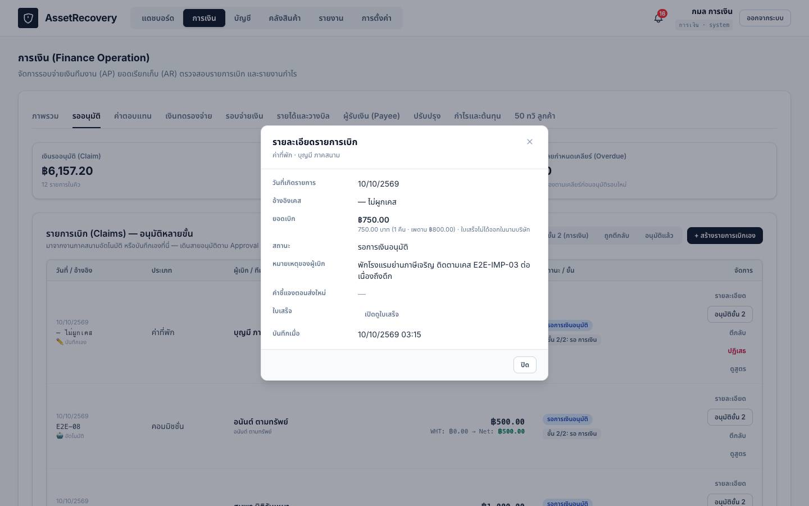

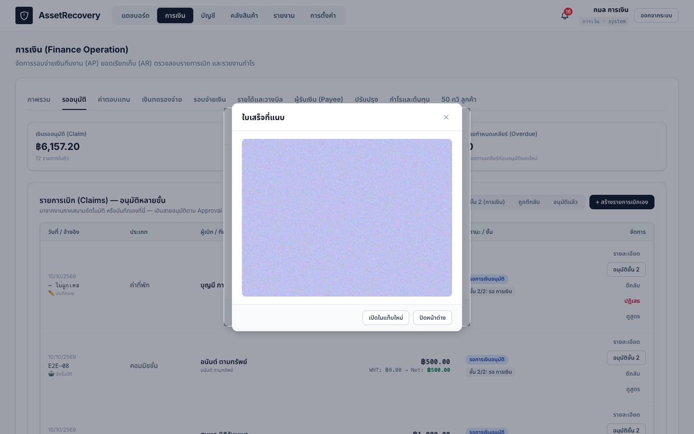

**ข้อควรระวัง / เคล็ดลับ**
- ใบเสร็จที่ **ไม่ได้ออกในนามบริษัท** ยังอนุมัติได้ แต่ฝ่ายบัญชีอาจต้องบันทึกเป็น **ข้อยกเว้น** ในเดือนนั้น — แจ้งพนักงานให้ขอใบเสร็จในนามบริษัทครั้งต่อไป
- ค่าที่พักเป็นการ **ชดใช้ตามจริง** จึง **ไม่อยู่ในฐานภาษีหัก ณ ที่จ่าย**

## 4. ดูสูตรคำนวณและภาษีหัก ณ ที่จ่าย

**เป้าหมาย:** เข้าใจที่มาของยอดก่อนอนุมัติ

**ขั้นตอน**
1. กด **ดูสูตร** ที่แถวรายการ
2. หน้าต่าง **รายละเอียดสูตรคำนวณค่าตอบแทน** แสดง:
   - **GROSS / WHT / NET จ่ายจริง**
   - **สูตร / ฐานคิด** เช่น "34.46 กม. × 5.00 บาท/กม." หรือ "1,000.00 บาท"
   - ที่มาของอัตรา WHT เช่น "3.00% · จาก Tax Profile ค่าเริ่มต้นตามประเภทผู้รับ · ยอดคาดการณ์ — ยอดจริงคิดตอนสร้างรอบจ่าย"
   - **ประวัติอนุมัติ (Multi-step)** — ใครอนุมัติ/ตีกลับขั้นไหน เมื่อไร พร้อมเหตุผล

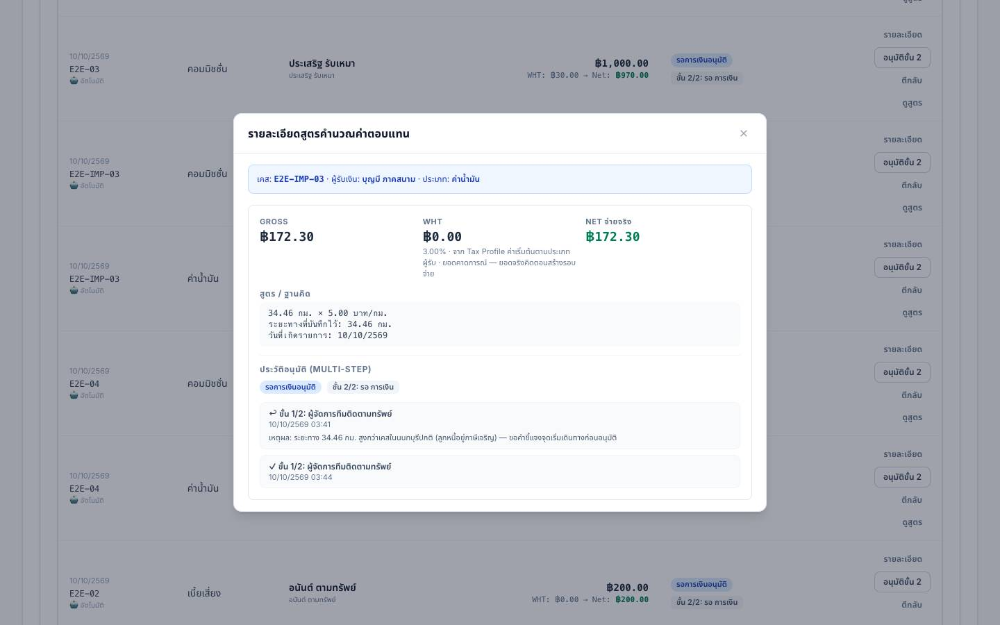

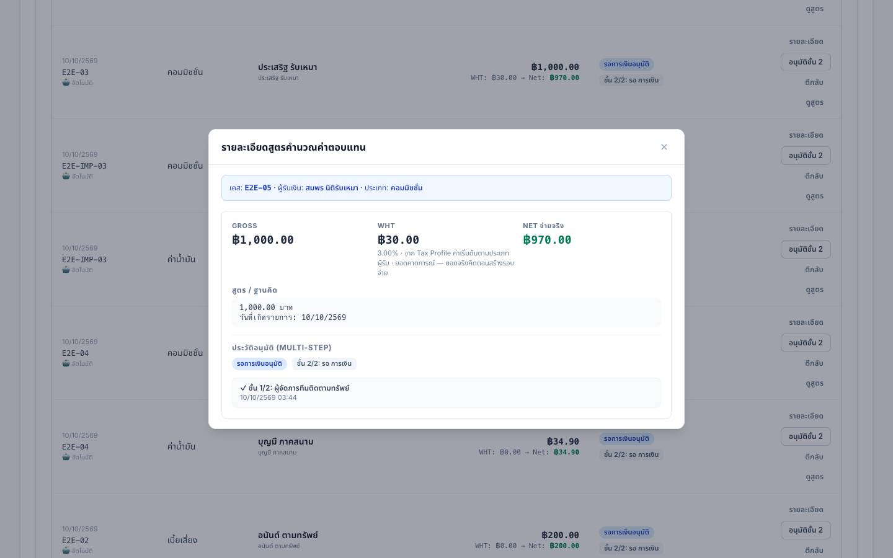

**เคล็ดลับ:** แท็บ **ค่าตอบแทน** แสดงรายการชุดเดียวกันพร้อมคอลัมน์สูตร/ฐานคิดในตาราง — สะดวกเมื่อต้องไล่ดูหลายรายการ

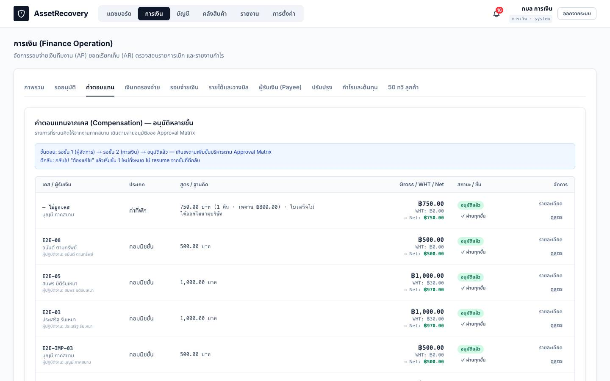

## 5. อนุมัติขั้นที่ 2

**ก่อนเริ่ม:** ตรวจรายละเอียด/สูตรแล้ว (บทที่ 3–4) และผู้รับเงินมีข้อมูลบัญชีที่ **ยืนยันแล้ว** (บทที่ 24)

**ขั้นตอน**
1. กด **อนุมัติขั้น 2** ที่แถวรายการ — **มีผลทันที ไม่มีหน้าต่างยืนยัน**
2. ระบบแสดง toast "อนุมัติแล้ว — <ผู้เบิก> — <ประเภท>" และแถวเปลี่ยนเป็น **อนุมัติแล้ว ✓ ผ่านทุกขั้น**
3. ทำทีละแถวจนครบ (ยังไม่มีปุ่มอนุมัติหลายรายการพร้อมกัน)
4. ใช้ตัวกรอง **อนุมัติแล้ว** ตรวจผล — การ์ด **เงินรออนุมัติ** ลดลงตามยอด

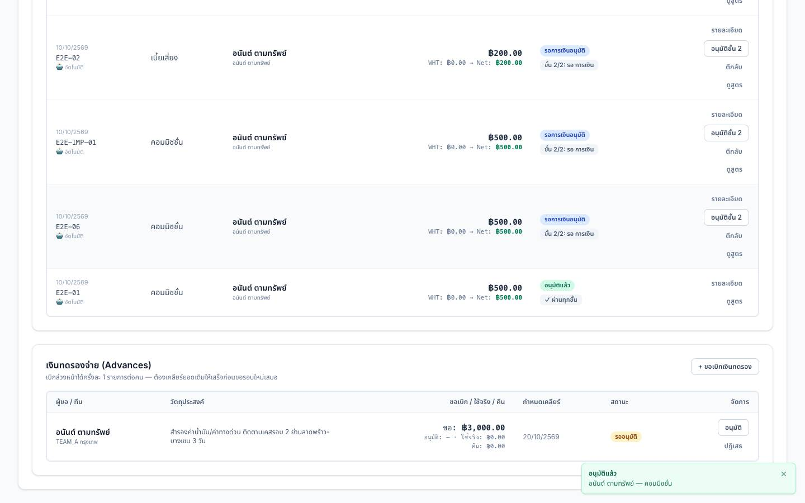

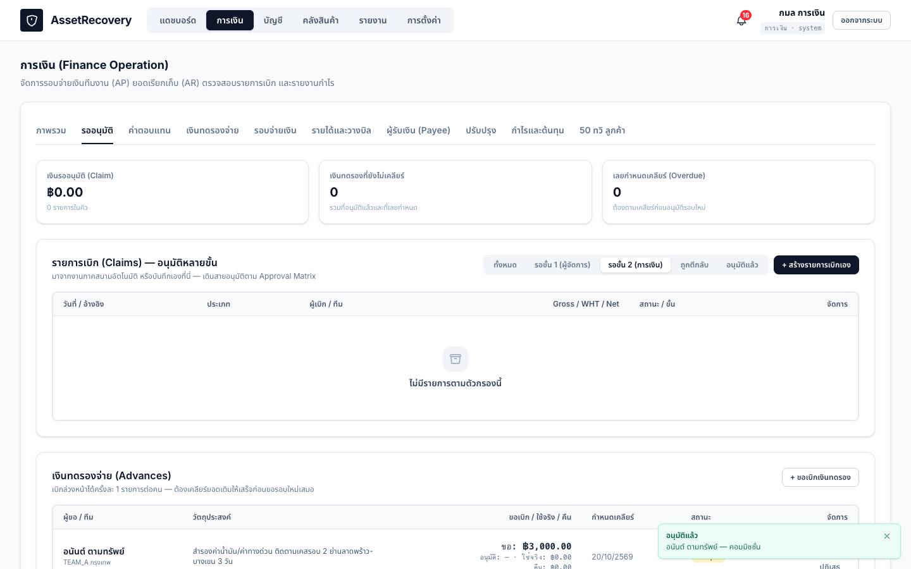

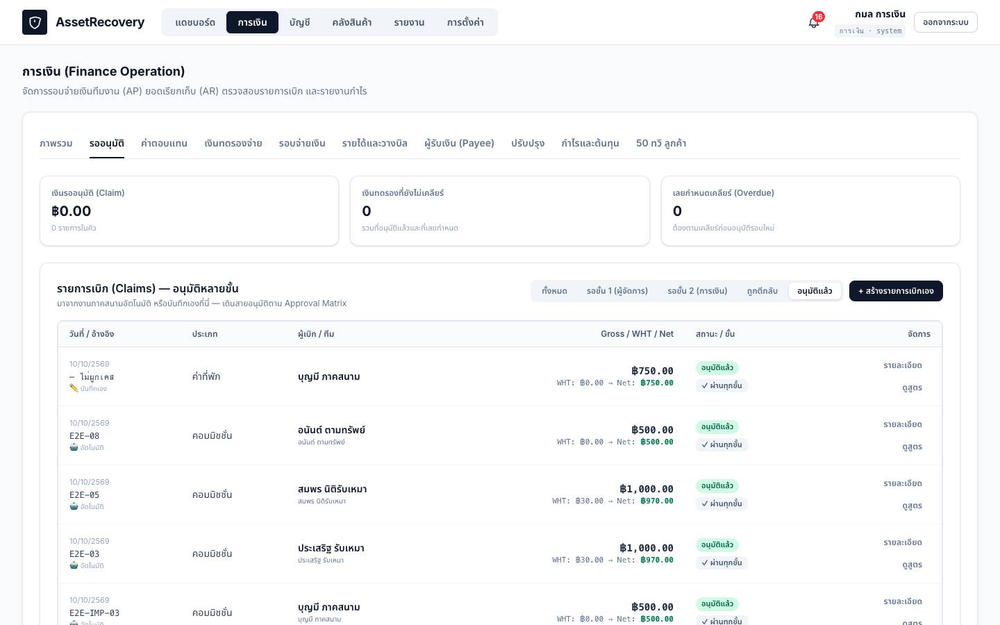

**ผลที่ควรเห็น:** พนักงานได้แจ้งเตือน "รายการเบิกผ่านอนุมัติครบทุกขั้น" · รายการพร้อมเข้ารอบจ่ายถัดไป

**สายอนุมัติ (ค่าเริ่มต้นของระบบ)**

| ยอดต่อรายการ | ขั้นอนุมัติ |
|---|---|
| ไม่เกิน 5,000 บาท | ผู้จัดการทีม → **การเงิน** (จบ) |
| เกิน 5,000 บาท | ผู้จัดการทีม → **การเงิน** → บริหาร |

**ข้อควรระวัง:** ระบบแยกหน้าที่ผู้ขอกับผู้อนุมัติ — ถ้าคุณเป็นผู้บันทึกรายการเบิกเอง (ปุ่ม **+ สร้างรายการเบิกเอง**) คุณจะอนุมัติรายการนั้นเองไม่ได้

## 6. ตีกลับหรือปฏิเสธรายการเบิก

**ตีกลับ กับ ปฏิเสธ ต่างกันอย่างไร**

| ปุ่ม | ใช้เมื่อ | ผล |
|---|---|---|
| **ตีกลับ** | เอกสาร/ใบเสร็จ/ข้อมูลไม่ถูกต้อง แก้ไขได้ | สถานะ **ถูกตีกลับ — รอแก้ไข** และ **เริ่มขั้นที่ 1 ใหม่ทั้งหมด** |
| **ปฏิเสธ** (เฉพาะรายการบันทึกเอง) | ไม่ควรจ่ายเลย | สถานะ **ไม่อนุมัติ** ถาวร |

**ขั้นตอน — ตีกลับ**
1. กด **ตีกลับ** ที่แถวรายการ
2. อ่านคำเตือน: รายการจะกลับเป็น "ต้องแก้ไข" และเริ่มขั้นอนุมัติที่ 1 ใหม่ทั้งหมด
3. กรอก **เหตุผล** (บังคับ) → กด **ตีกลับรายการ**

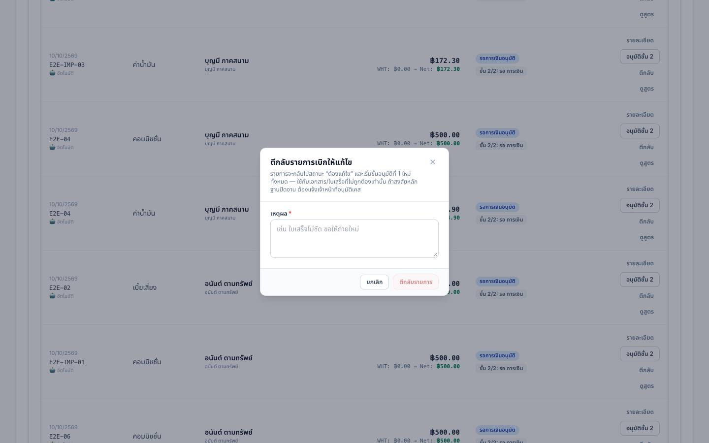

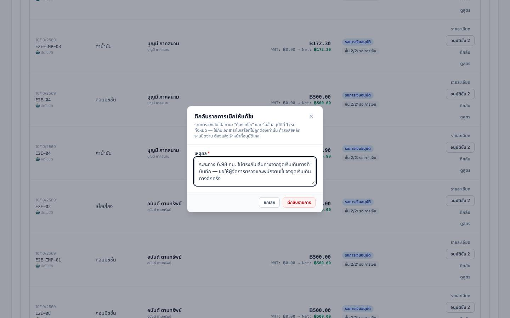

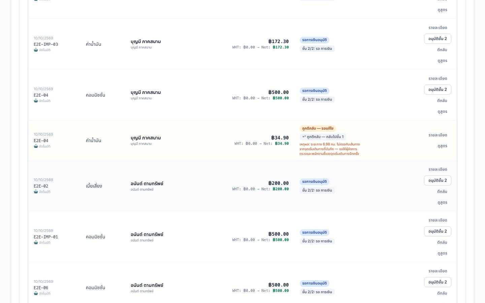

| ช่อง | บังคับ | ตัวอย่าง |
|---|---|---|
| เหตุผล | ✔ | "ระยะทาง 6.98 กม. ไม่ตรงกับเส้นทางจากจุดเริ่มเดินทางที่บันทึก — ขอให้ผู้จัดการตรวจและพนักงานชี้แจงจุดเริ่มเดินทางอีกครั้ง" |

**หลังตีกลับ เกิดอะไรต่อ**
1. พนักงานเห็นกล่องสีส้ม **ถูกตีกลับ ต้องแก้ไขแล้วส่งใหม่** พร้อมเหตุผลของคุณ → กด **แก้ไขและส่งใหม่** → กรอก **สิ่งที่แก้ไข / ชี้แจง** (ยอดที่ระบบคิดให้ พนักงานแก้ไม่ได้) → **ส่งกลับเข้าคิวอนุมัติ** (ดู [เล่ม 3](03-field-team.md))
2. ผู้จัดการทีมอนุมัติขั้น 1 อีกครั้ง
3. รายการกลับมาในคิวของคุณ → กด **รายละเอียด** ดู **คำชี้แจงตอนส่งใหม่** → อนุมัติขั้น 2

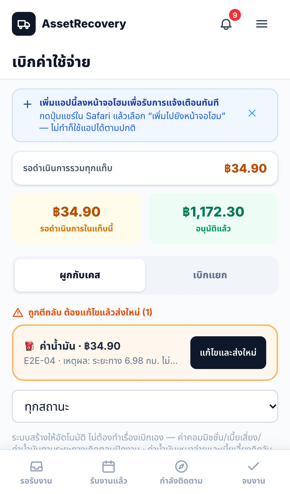

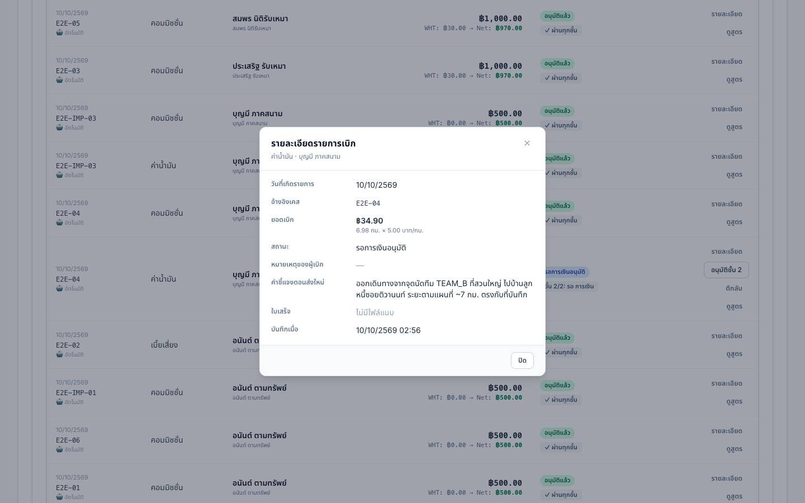

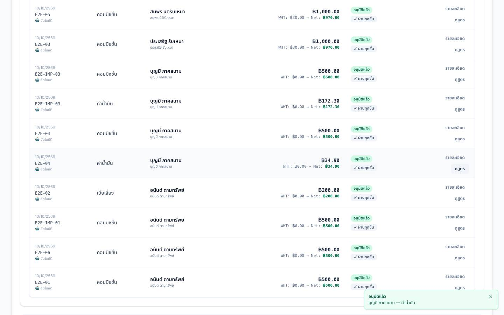

**ข้อควรระวัง:** ถ้าสงสัย **หลักฐานปิดงาน** (เช่น รูปเครื่อง/สถานที่) อย่าตีกลับรายการเบิก — ให้แจ้ง **เจ้าหน้าที่อนุมัติเคส** แทน การตีกลับรายการเบิกใช้กับเอกสาร/ใบเสร็จ/ยอดที่ไม่ถูกต้องเท่านั้น

## 7. ค่าน้ำมันเหมาจ่ายและเบี้ยเลี้ยงที่ระบบสรุปทุกคืน

**เป้าหมาย:** เข้าใจรายการรายวันที่ระบบสร้างเอง และอนุมัติให้ครบ

**ระบบทำอะไรให้ทุกคืน**
- หลังเที่ยงคืน (เวลาไทย) ระบบ **สรุปวันลงพื้นที่** ของพนักงานแต่ละคนในวันที่ผ่านมา แล้วสร้างรายการ **ค่าน้ำมันเหมาจ่าย** และ **เบี้ยเลี้ยง** ตามแผนค่าตอบแทนของทีม
- ยอดเหมาต่อวัน **กระจายเท่ากันทุกเคสที่เช็คอินวันนั้น** เช่น เบี้ยเลี้ยง 150.00 บาท/วัน ÷ 5 เคส = 30.00 ต่อเคส
- ทีมที่ใช้แผน **ค่าน้ำมันตามระยะทาง** จะไม่มีค่าน้ำมันเหมาจ่าย (มีเฉพาะเบี้ยเลี้ยงถ้าแผนกำหนด)
- **ไม่ต้องกดอะไร** — บนระบบจริงทำให้เองทุกคืน ผู้ดูแลระบบตรวจผลได้ที่ **การตั้งค่า › งานเบื้องหลัง (Job Log)** งาน "คำนวณค่าน้ำมันเหมาจ่าย/เบี้ยเลี้ยงรายวัน"

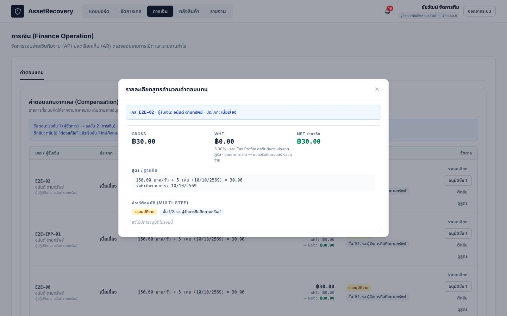

**ขั้นตอน**
1. เช้าวันถัดไป รายการรายวันจะไปที่ผู้จัดการทีมเพื่ออนุมัติขั้น 1 ก่อน
2. เมื่อผ่านขั้น 1 รายการเข้าคิว **รออนุมัติ** ของคุณ (ประเภท ค่าน้ำมัน / เบี้ยเลี้ยง)
3. ตรวจด้วย **ดูสูตร** → กด **อนุมัติขั้น 2** ทีละแถว

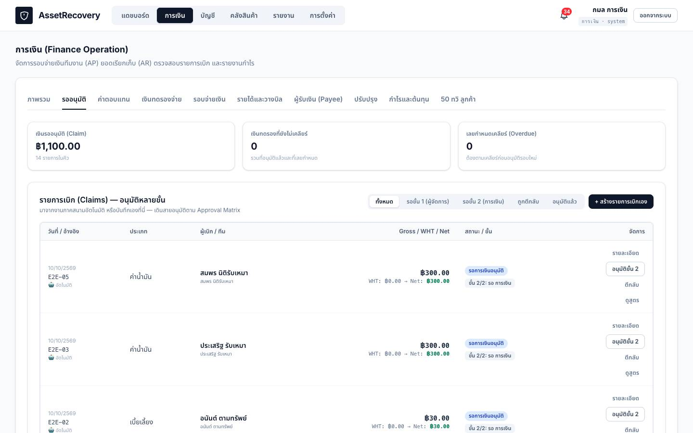

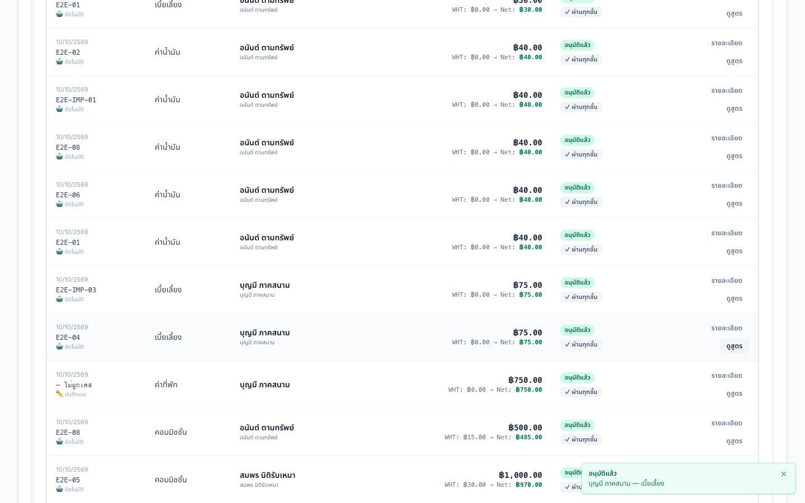

**ทำไมเรื่องนี้สำคัญ:** การสรุปวันลงพื้นที่เป็น **เงื่อนไขข้อที่ 3 ของการเกิดรายได้** (บทที่ 18) — รายได้ของเคสจะเกิดหลังรายการรายวันของวันนั้นถูกสร้างและอนุมัติครบแล้ว จึงมักเห็นรายได้ **ช้ากว่าวันยืนยันล็อต 1 วันขึ้นไป** เป็นเรื่องปกติ

## 8. เงินทดรอง — อนุมัติหรือปรับลดยอด

**เป้าหมาย:** พิจารณาคำขอเงินทดรองของพนักงาน (ยืมไปใช้ก่อน แล้วเคลียร์ทีหลัง)

**ขั้นตอน**
1. **การเงิน** → แท็บ **เงินทดรองจ่าย** — กรองได้: ทั้งหมด · รออนุมัติ · ยังไม่เคลียร์ · เลยกำหนด · เคลียร์แล้ว · ไม่อนุมัติ · ยอดคืนค้าง
2. แถวคำขอ (เช่น `ADV-2569-0001`) กด **อนุมัติ** (หรือ **ปฏิเสธ** ถ้าไม่อนุมัติ)
3. อ่านกล่องเตือน "อนุมัติแล้วถือว่า **เงินออกจริง** — ผู้ขอจะขอเบิกรอบใหม่ไม่ได้จนกว่าจะเคลียร์ยอดนี้เสร็จ"
4. กรอก **ยอดที่อนุมัติ** (เว้นว่าง = อนุมัติเต็มจำนวน) และ **หมายเหตุ** → กด **อนุมัติและปล่อยเงิน**

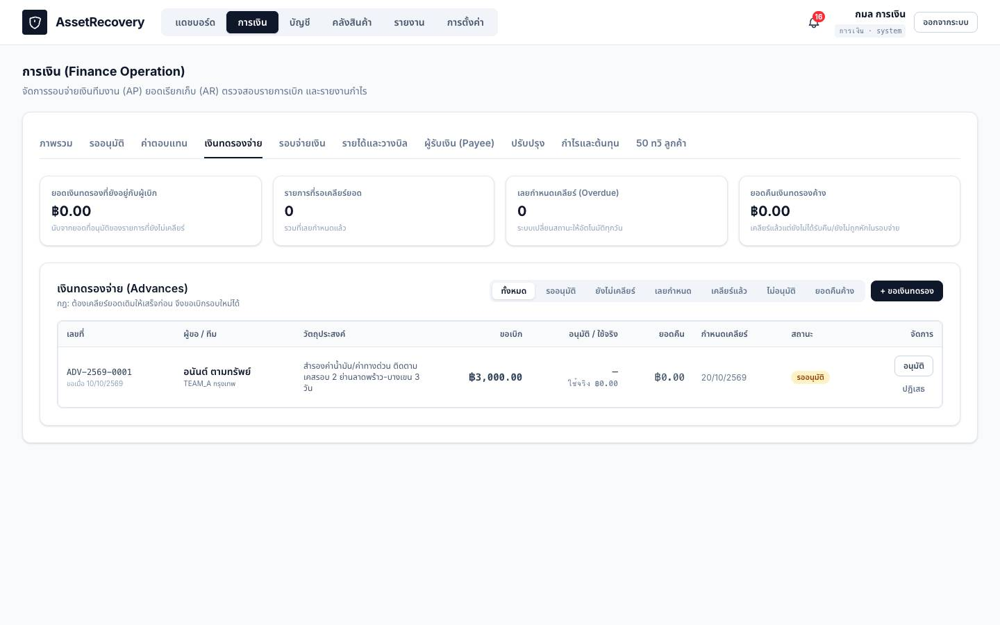

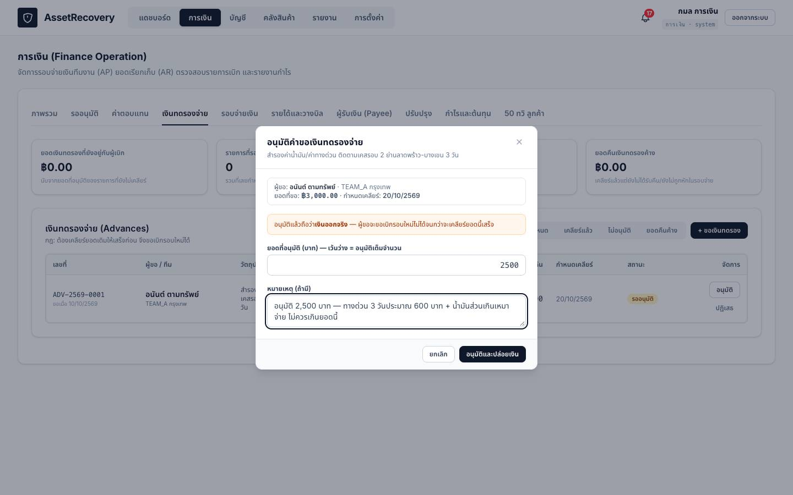

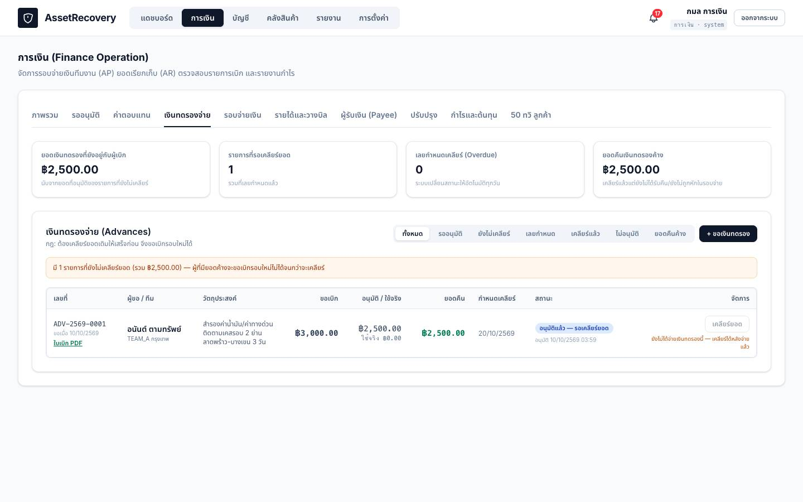

| ช่อง | บังคับ | ตัวอย่าง / หมายเหตุ |
|---|---|---|
| ยอดที่อนุมัติ (บาท) | ไม่บังคับ | `2500` (ขอมา 3,000) — เว้นว่าง = เต็มจำนวน |
| หมายเหตุ | ไม่บังคับ | "อนุมัติ 2,500 บาท — ทางด่วน 3 วันประมาณ 600 บาท + น้ำมันส่วนเกินเหมาจ่าย ไม่ควรเกินยอดนี้" |

**ผลที่ควรเห็น:** toast "อนุมัติเงินทดรองแล้ว — รอเคลียร์ยอดภายใน <วันที่>" · แถวมีลิงก์ **ใบเบิก PDF** (ใบเบิกเงินทดรอง)

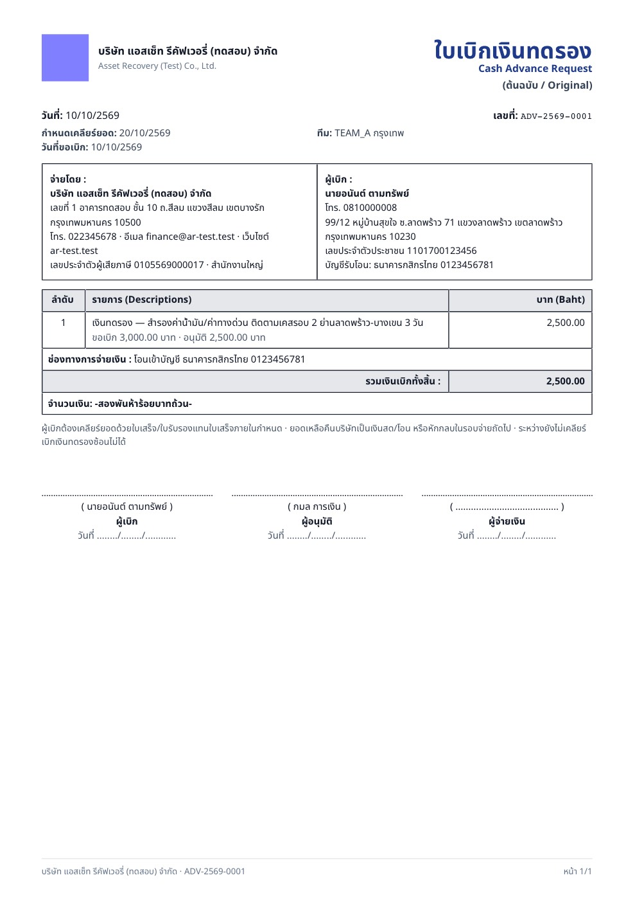

**ข้อควรระวัง / เคล็ดลับ**
- **อนุมัติแล้วยังไม่ใช่การโอน** — เงินทดรองต้อง **จ่ายผ่านรอบจ่าย Inhouse** (บทที่ 12) พนักงานจึงจะเคลียร์ยอดได้ ก่อนจ่ายปุ่มเคลียร์ของพนักงานจะขึ้น "ยังไม่ได้จ่ายเงินทดรองนี้ — เคลียร์ได้หลังจ่ายแล้ว"
- พนักงาน 1 คนมีเงินทดรองที่ยังไม่เคลียร์ได้ครั้งละ 1 รายการ
- พนักงาน **ไม่ได้รับแจ้งเตือน** ตอนคุณอนุมัติ และตอนโอนเงิน — ควรแจ้งพนักงานเองว่าอนุมัติยอดเท่าไร และโอนเมื่อไร
- บนมือถือ ตัวเลขใหญ่ของการ์ดเงินทดรองเป็น **ยอดที่ขอ** ส่วนยอดอนุมัติอยู่บรรทัดเล็ก — ถ้าปรับลด ให้ย้ำยอดอนุมัติกับพนักงาน
- การ์ด **ยอดคืนเงินทดรองค้าง** อาจแสดงยอดเต็มตั้งแต่อนุมัติ ทั้งที่ยังไม่ได้เคลียร์ — ให้ดูคอลัมน์สถานะประกอบ (ยอดคืนจริงทราบหลังพนักงานเคลียร์)
- เลยกำหนดเคลียร์ ระบบเปลี่ยนสถานะเป็น **เลยกำหนดเคลียร์** ให้เองทุกวัน → ติดตามพนักงาน

## 9. เงินทดรอง — พนักงานเคลียร์ยอดและใบรับรองแทนใบเสร็จ

> ขั้นตอนนี้ **พนักงานทำบนมือถือ** (รายละเอียดใน [เล่ม 3](03-field-team.md)) — คุณควรรู้เพื่อตอบคำถามและตรวจผล

**พนักงานทำอะไร**
1. เมนู **เงินทดรองจ่าย** → การ์ด "อนุมัติแล้ว — รอเคลียร์ยอด" → **เคลียร์ยอด**
2. กรอก **ยอดที่ใช้จริง** → ระบบคำนวณ **ยอดต้องคืน** ให้ → เลือก **วิธีคืนยอด**: **หักกลบในรอบจ่ายถัดไป** หรือ **รับคืนแยก (เงินสด/โอน)**
3. แนบใบเสร็จ (รูป/PDF)
4. รายการที่เรียกใบเสร็จไม่ได้ (เช่น ค่าวินมอเตอร์ไซค์ ค่าที่จอดรถ) → ติ๊ก **ไม่มีใบเสร็จ** แล้วกรอก วันที่ · รายละเอียด · จำนวน
5. **บันทึกการเคลียร์ยอด** → ระบบออก **ใบรับรองแทนใบเสร็จ** (เช่น `CRT-2569-0001`) ให้อัตโนมัติ
6. พนักงานดาวน์โหลดใบรับรอง PDF → พิมพ์ → เซ็น → ถ่ายรูป → **อัปโหลดฉบับเซ็นแล้ว**


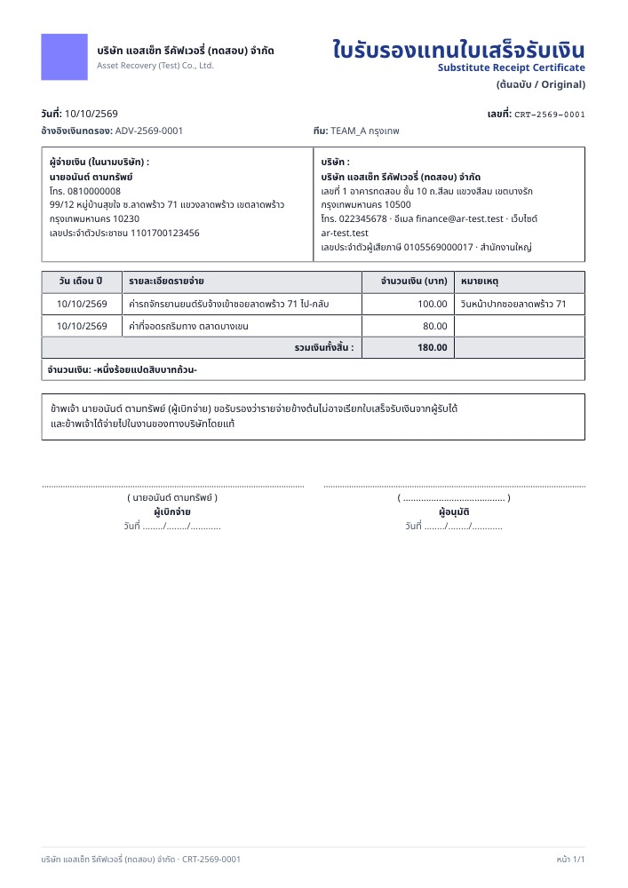

**กติกาที่ควรรู้**
- ใบรับรองแทนใบเสร็จ **ไม่เกิน 500 บาทต่อใบ และ 3,000 บาทต่อเดือน** (ค่าเริ่มต้นของระบบ ปรับได้โดยผู้ดูแลระบบ)
- ใช้ **มากกว่า** ยอดที่ยืม → ระบบสร้างคำขอเบิกส่วนเกินให้ (เข้าคิวอนุมัติตามปกติ) · ใช้ **น้อยกว่า** → เกิดยอดต้องคืน
- เคลียร์แล้วสถานะเป็น **เคลียร์ยอดแล้ว** ทันที (ไม่มีขั้นการเงินตรวจการเคลียร์) และหน้าการเงิน **ไม่แสดงรูปใบเสร็จ** ที่พนักงานแนบ — ถ้าต้องการตรวจ ให้ขอรูปจากพนักงานโดยตรง และตรวจใบรับรองแทนใบเสร็จ (ดาวน์โหลดได้จากแถว)

## 10. เงินทดรอง — บันทึกรับคืนและปิดยอด

**เป้าหมาย:** ปิดเงินทดรองเมื่อพนักงานคืนเงินส่วนที่เหลือ

**ขั้นตอน**
1. แท็บ **เงินทดรองจ่าย** → แถวสถานะ **เคลียร์ยอดแล้ว** · "รอรับคืนแยก ค้าง ฿…"
2. ตรวจ: ยอดอนุมัติ / ใช้จริง · ใบรับรองแทนใบเสร็จ (มีป้าย **อัปโหลดฉบับเซ็นแล้ว** · ลิงก์ **ดาวน์โหลดใบรับรอง PDF** · **ยกเลิกใบรับรอง** ถ้าผิด)
3. กด **บันทึกรับคืน** → เลือก **ช่องทาง** · **ยอด** (ว่าง = เต็มยอดค้าง) · **วันที่** · แนบ **หลักฐาน** · หมายเหตุ → **บันทึกรับคืน**

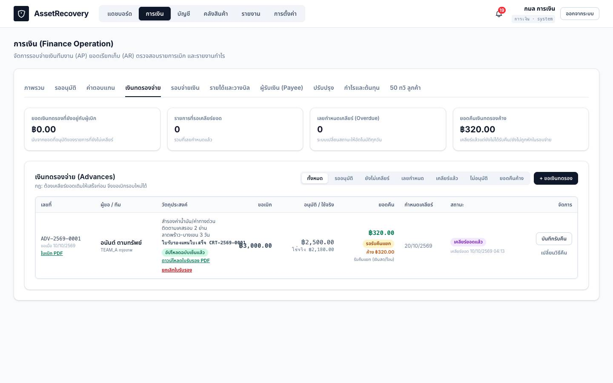

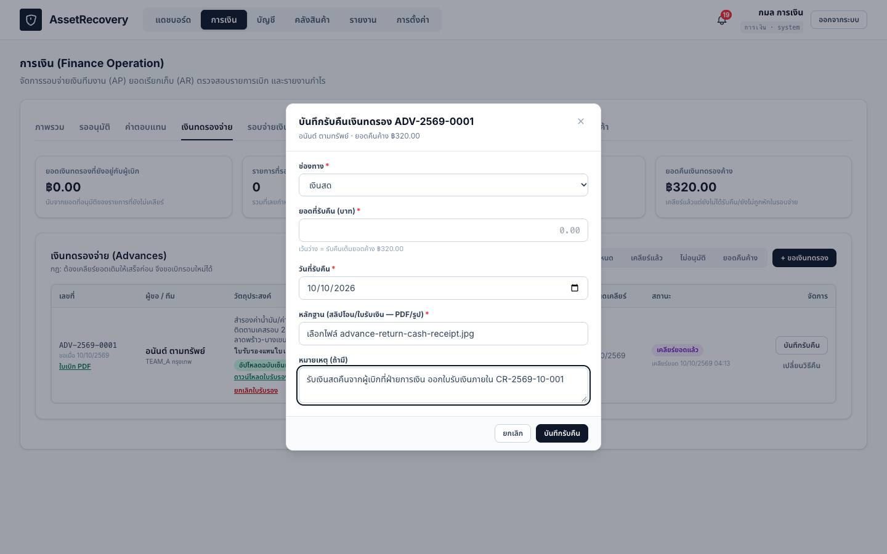

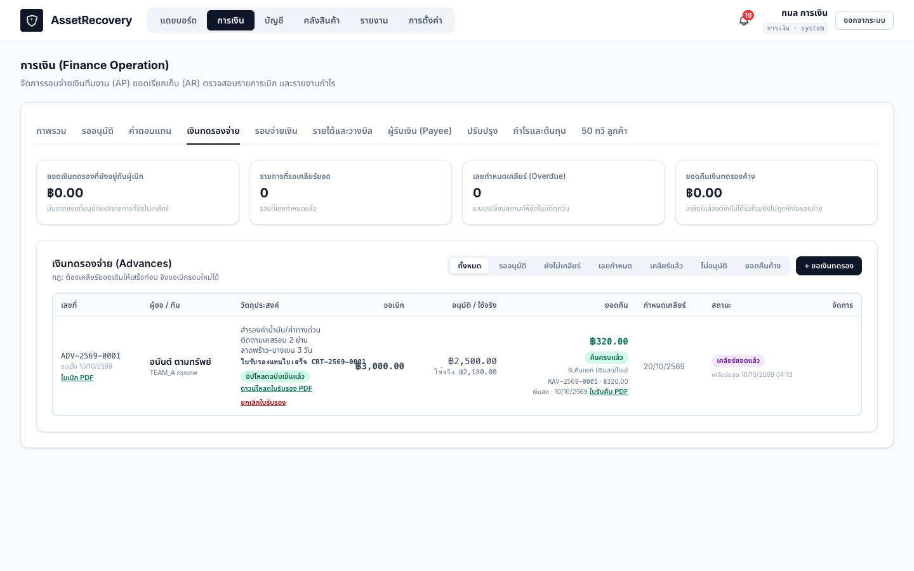

| ช่อง | บังคับ | ตัวอย่าง |
|---|---|---|
| ช่องทาง | ✔ | เงินสด / โอน |
| ยอดรับคืน | ไม่บังคับ | ว่าง = เต็มยอดค้าง |
| หลักฐาน | ✔ | รูปใบรับเงินสด / สลิปโอน |

**ผลที่ควรเห็น:** toast "บันทึกรับคืนเงินทดรองแล้ว — ยอดคืนครบ — ปิดยอดแล้ว" · แถวแสดง **คืนครบแล้ว** + เลขใบรับคืน (เช่น `RAV-2569-0001`) + **ใบรับคืน PDF**

**เคล็ดลับ:** ถ้าพนักงานเลือก **หักกลบในรอบจ่ายถัดไป** ไม่ต้องบันทึกรับคืน — ระบบหักให้เองในรอบจ่าย Inhouse ถัดไป (สถานะ "รอหักในรอบจ่ายถัดไป") · เปลี่ยนวิธีคืนได้ด้วยปุ่ม **เปลี่ยนวิธีคืน**

---

# ส่วนที่ 2 — งานประจำรอบจ่าย

## 11. หลักการของรอบจ่ายและภาษีหัก ณ ที่จ่าย

- **ตัดรอบวันที่ 15 และสิ้นเดือน · จ่ายสิ้นเดือน** (ค่าเริ่มต้นของระบบ — ดูชื่อรอบ AP ในหน้าต่างสร้างรอบ)
- **1 รอบ = 1 ฝั่ง** — ห้ามรวม **Inhouse** (ทีมใน) กับ **Outsource** (ทีมนอก) ในรอบเดียว
- ระบบดึงรายการที่ **อนุมัติครบแล้ว** ของผู้รับเงินที่ **ยืนยันข้อมูลแล้ว** จนถึงวันตัดรอบให้อัตโนมัติ — ผู้รับเงินที่ยังไม่ยืนยันข้อมูลธนาคาร/ภาษีจะทำให้รอบถูกล็อก
- เงินทดรองที่อนุมัติแล้วจ่ายผ่านรอบ Inhouse และยอดที่พนักงานเลือก "หักกลบในรอบจ่ายถัดไป" ถูกหักในรอบนี้

**ภาษีหัก ณ ที่จ่าย (WHT) คิดอย่างไร**
- คิดจาก **ยอดรวมของผู้รับเงินแต่ละคนในรอบจ่ายนั้น** ตามอัตราของผู้รับเงิน (Tax Profile) — อัตรารายคนชนะค่าเริ่มต้นเสมอ
- **ฐานภาษีคือยอดก่อน VAT** และนับเฉพาะประเภทที่อยู่ในฐาน (คอมมิชชั่น · เบี้ยไม่สำเร็จ · ค่าน้ำมัน · เบี้ยเลี้ยง) — **ค่าที่พักไม่อยู่ในฐาน** · **เงินทดรองไม่หัก WHT**
- **ยอดในฐานต่อคนต่อรอบต่ำกว่า 1,000 บาท → ไม่หัก**
- เพราะคิด **ต่อรอบ** ผู้รับเงินคนเดียวกันในเดือนเดียวกัน ถ้ารอบหนึ่งยอดน้อย อาจไม่ถูกหักในรอบนั้น (บทที่ 17)

| ตัวอย่าง (รอบเดียวกัน) | ยอดในฐาน | อัตรา | WHT |
|---|---|---|---|
| อนันต์: คอมมิชชั่น 500 × 4 + เบี้ยเสี่ยง 200 | 2,200.00 | 3% | 66.00 |
| บุญมี: คอมมิชชั่น 1,000 + ค่าน้ำมัน 172.30 + 34.90 (ค่าที่พัก 750 ไม่นับ) | 1,207.20 | 3% | 36.22 |
| ผู้รับเงินรายหนึ่งในรอบถัดไป: เบี้ยเลี้ยง/ค่าน้ำมันเหมารวม 350.00 | 350.00 | 3% | 0.00 (ต่ำกว่าเกณฑ์) |

## 12. สร้างรอบจ่าย

**ขั้นตอน**
1. **การเงิน** → แท็บ **รอบจ่ายเงิน** → กด **+ สร้างรอบจ่าย**
2. เลือก **ฝั่งของรอบการจ่าย** (Inhouse / Outsource)
3. ตั้ง **วันตัดรอบ** — ⚠️ ค่าเริ่มต้นเป็น **วันตัดรอบล่าสุดที่ผ่านไปแล้ว** (เช่น 30/09/2569) ให้เปลี่ยนเป็นรอบปัจจุบัน (เช่น 15/10/2569) ก่อนทุกครั้ง
4. **รอบจ่าย (AP)** ระบบเลือกให้ตามฝั่ง — กำหนดจ่ายคิดจากวันตัดรอบตามเงื่อนไขของรอบ
5. **ชื่อรอบจ่าย** เว้นว่างได้ (ระบบตั้งชื่อจากฝั่ง + วันตัดรอบ) หรือตั้งเอง เช่น "… (รอบ 2 ค่าน้ำมันเหมา/เบี้ยเลี้ยง)"
6. กด **สร้างรอบจ่าย**

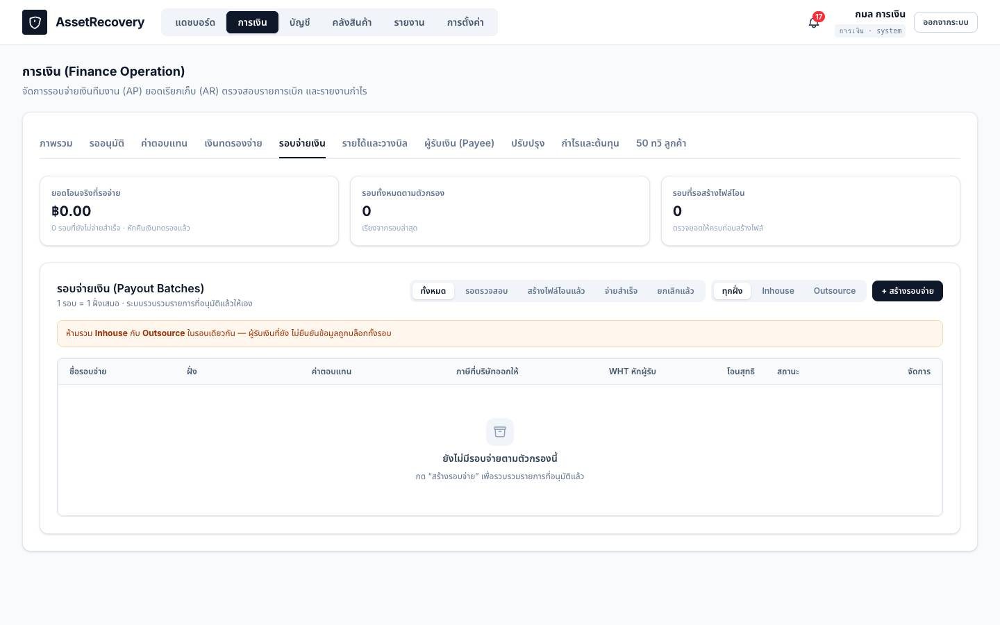

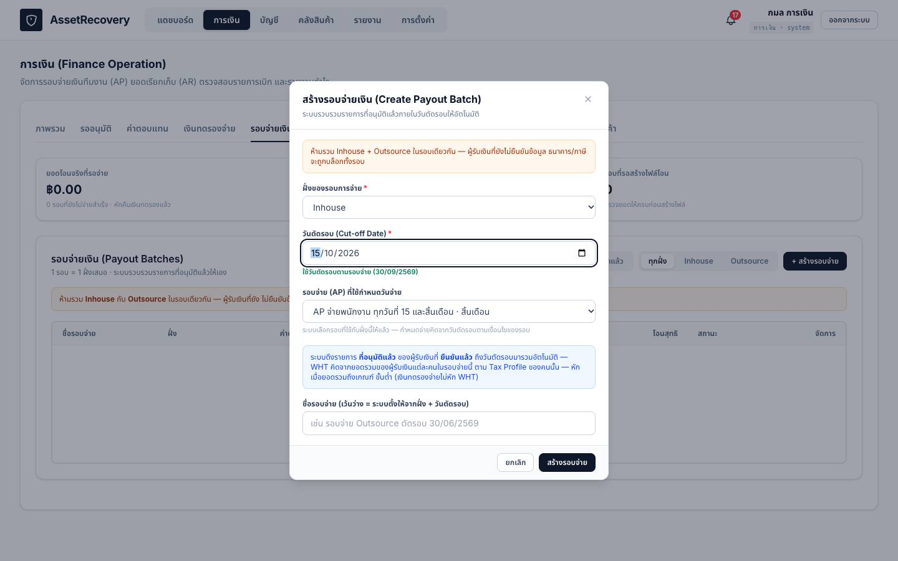

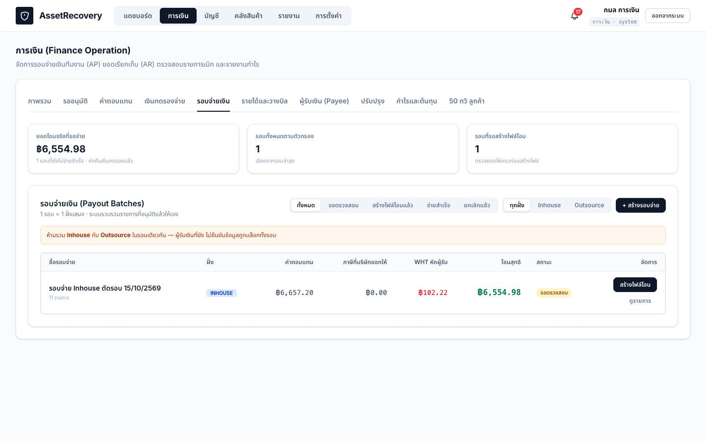

| ช่อง | บังคับ | ตัวอย่าง / หมายเหตุ |
|---|---|---|
| ฝั่งของรอบการจ่าย | ✔ | Inhouse หรือ Outsource |
| วันตัดรอบ | ✔ | 15/10/2569 (ช่องวันที่ของเบราว์เซอร์แสดงปี ค.ศ.) |
| รอบจ่าย (AP) | ✔ | "AP จ่ายพนักงาน ทุกวันที่ 15 และสิ้นเดือน" — ระบบเลือกให้ |
| ชื่อรอบจ่าย | ไม่บังคับ | ว่าง = ระบบตั้งให้ |

**ผลที่ควรเห็น:** toast "สร้างรอบจ่ายเงินแล้ว — รอบจ่าย Inhouse ตัดรอบ 15/10/2569" · แถวแสดงจำนวนรายการ · ค่าตอบแทน · WHT · โอนสุทธิ · สถานะ **รอตรวจสอบ**

7. ทำซ้ำสำหรับฝั่ง **Outsource**

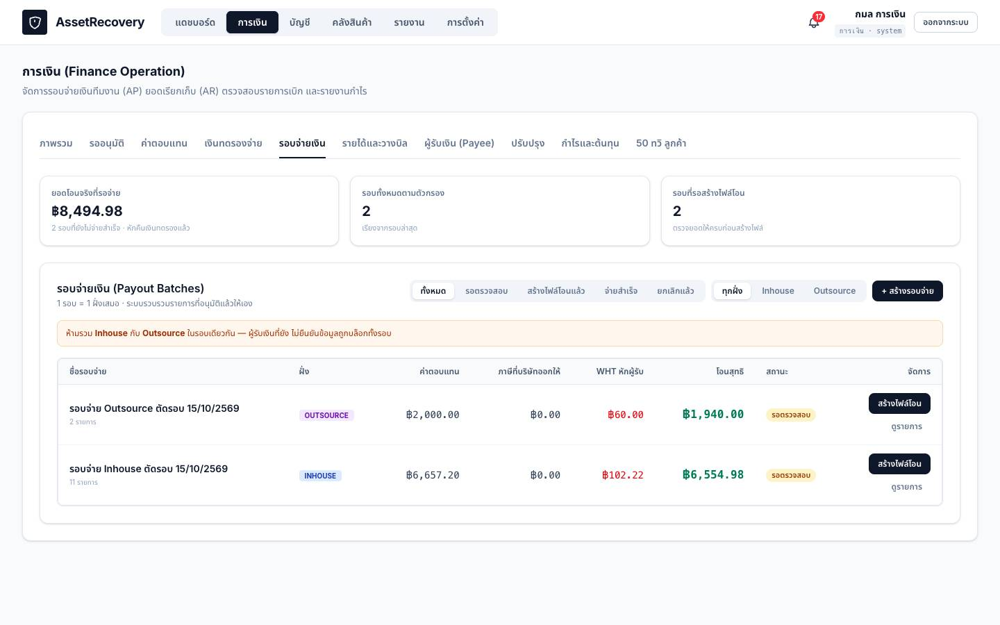

**เคล็ดลับ:** ถ้าสร้างแล้วได้ **0 รายการ** ให้ตรวจวันตัดรอบ (อาจเป็นรอบที่ผ่านไปแล้ว) และตรวจว่ารายการผ่านอนุมัติครบทุกขั้นแล้ว

## 13. ตรวจรายการในรอบและเอกสารรอบจ่าย

**ขั้นตอน**
1. กด **ดูรายการ** ที่แถวรอบ
2. ตรวจแต่ละบรรทัด: ผู้รับเงิน / ทีม · รายการ (เคส) · **บัญชีรับเงิน** (ปิดเลขบางส่วน) · ค่าตอบแทน · **WHT หักผู้รับ** (อัตรา + Tax Profile) · **สุทธิ**
3. สังเกตป้าย **ไม่อยู่ในฐานภาษี** (ค่าที่พัก) และ **ไม่หัก WHT** (เงินทดรอง)
4. กด **สรุปรอบจ่าย PDF** และ **สลิปค่าตอบแทน** (PDF รายคน) เก็บไว้หรือส่งให้พนักงาน

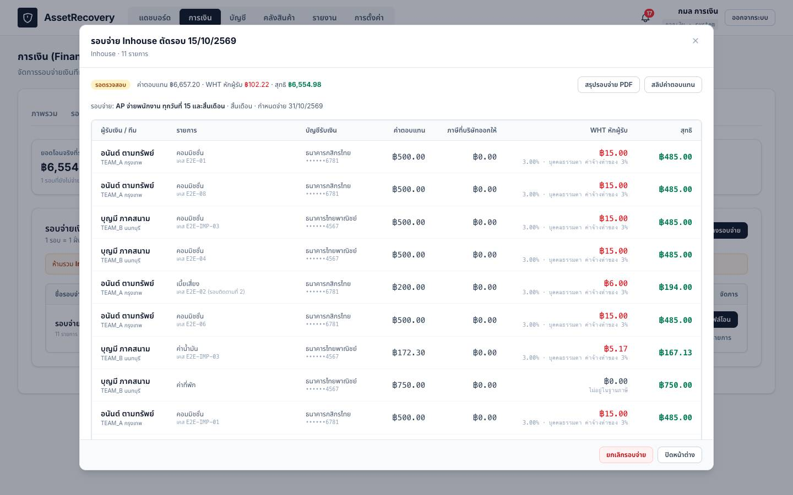

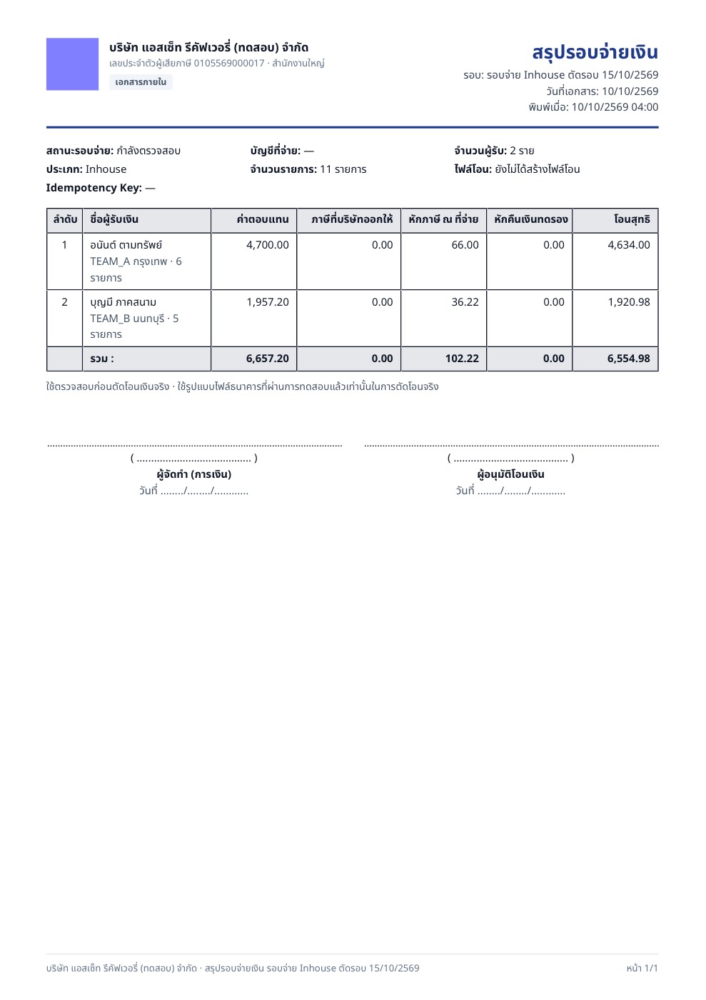

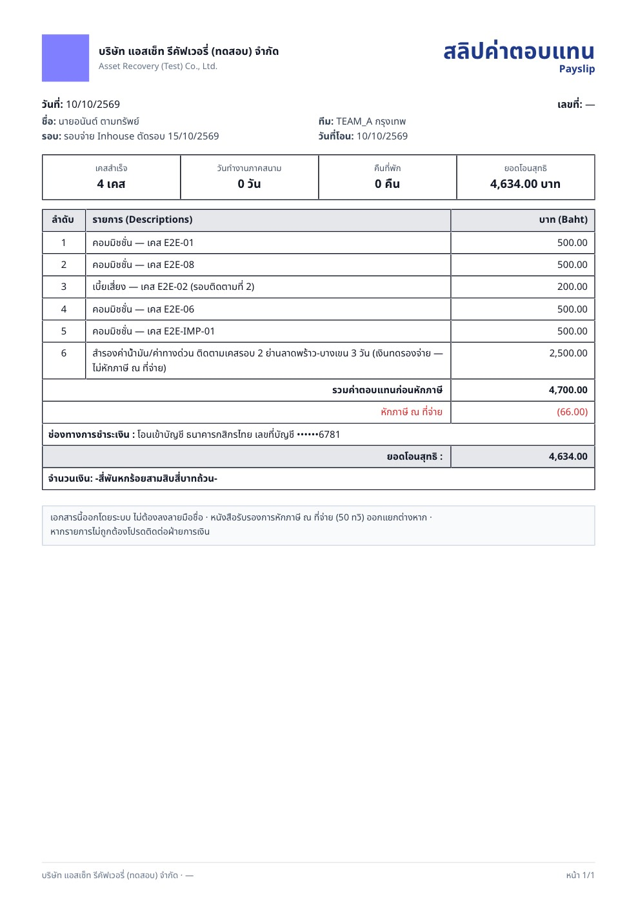

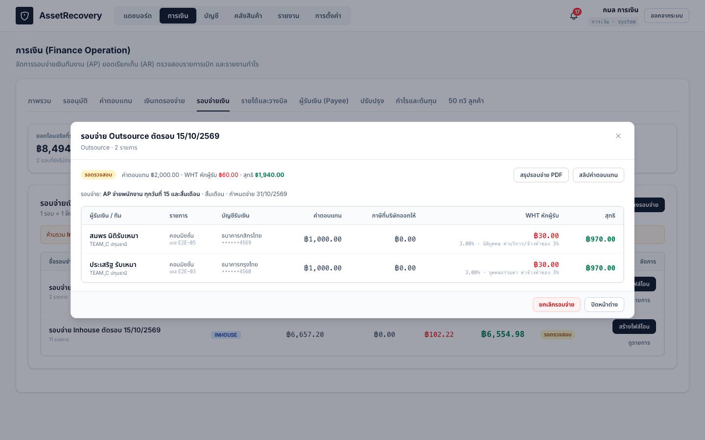

**ข้อควรระวัง / เคล็ดลับ**
- ถ้าพบรายการผิดก่อนโอน ใช้ปุ่ม **ยกเลิกรอบจ่าย** (ต้องกรอกเหตุผล) — รายการจะกลับไปรอจ่ายเพื่อสร้างรอบใหม่
- ตรวจรายละเอียดบนสลิป (รอบติดตาม · จำนวนวันทำงาน · เลขที่) ก่อนส่งให้พนักงาน — สลิปที่ออกก่อนระบบสรุปวันลงพื้นที่อาจแสดงจำนวนวันทำงานเป็น 0

## 14. สร้างไฟล์โอนธนาคาร

**ขั้นตอน**
1. กด **สร้างไฟล์โอน** ที่แถวรอบ (สถานะ รอตรวจสอบ)
2. เลือก **รูปแบบไฟล์ธนาคาร** และ **บัญชีบริษัทที่จ่าย**
3. ตรวจกล่องสรุป: จำนวนรายการ · WHT รวม · ยอดโอนสุทธิ
4. กรอก **เหตุผล / อ้างอิงการอนุมัติจ่าย** → กด **สร้างไฟล์โอน**
5. หน้าต่างผลแสดง **ชื่อไฟล์ · Idempotency Key · SHA-256** → กด **ดาวน์โหลดไฟล์โอน** → กด **ปิด**
6. อัปโหลดไฟล์เข้าระบบธนาคารของบริษัท (เช่น K-Biz) แล้วอนุมัติโอนตามขั้นตอนของธนาคาร

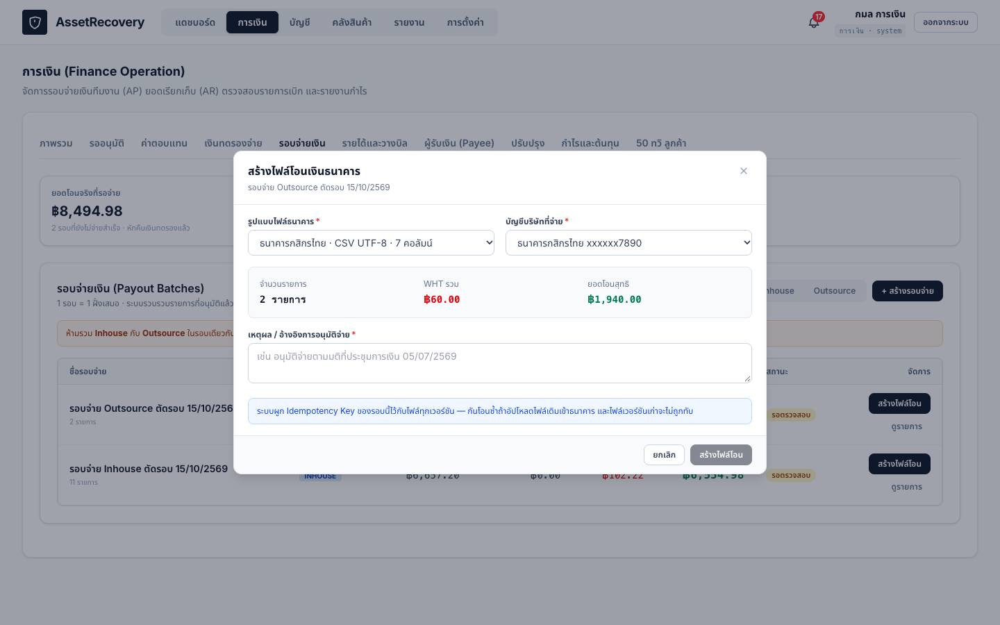

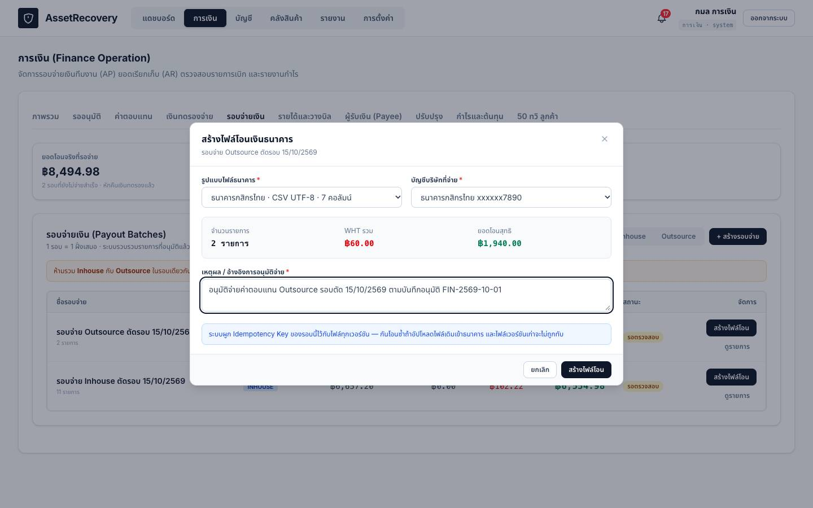

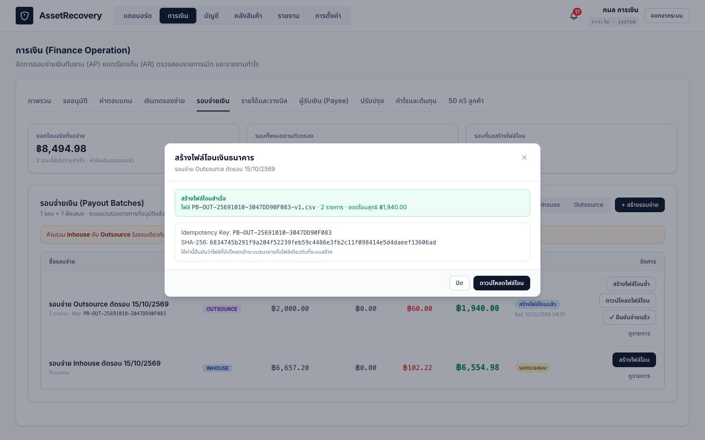

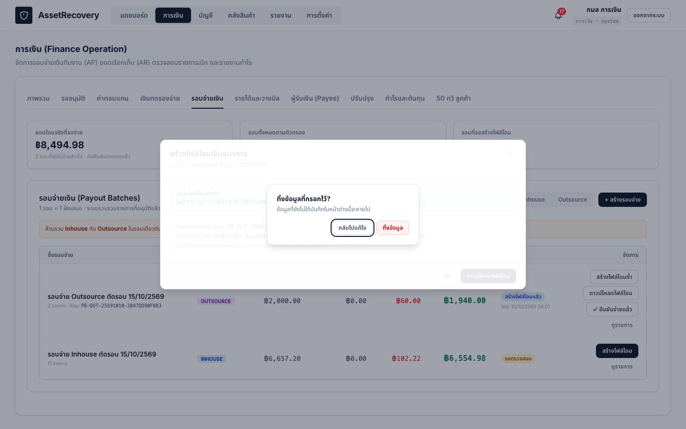

| ช่อง | บังคับ | ตัวอย่าง |
|---|---|---|
| รูปแบบไฟล์ธนาคาร | ✔ | ธนาคารกสิกรไทย · CSV UTF-8 · 7 คอลัมน์ |
| บัญชีบริษัทที่จ่าย | ✔ | ธนาคารกสิกรไทย xxxxxx7890 |
| เหตุผล / อ้างอิงการอนุมัติจ่าย | ✔ | "อนุมัติจ่ายค่าตอบแทน Outsource รอบตัด 15/10/2569 ตามบันทึกอนุมัติ FIN-2569-10-01" |

**ข้อควรระวัง / เคล็ดลับ**
- ไฟล์โอนเป็น **1 บรรทัดต่อรายการเบิก** ไม่ได้รวมต่อผู้รับเงิน — ผู้รับเงินที่มี 6 รายการจะถูกโอน 6 ครั้ง (ค่าธรรมเนียมและรายการใน statement เพิ่มตาม) และไฟล์ **ไม่มีแถวหัวคอลัมน์** — **ทดลองอัปโหลดกับธนาคารและตรวจรูปแบบให้ตรงกับที่ธนาคารรับก่อนใช้จริง**
- ใช้ค่า **SHA-256** ยืนยันว่าไฟล์ที่อัปโหลดเข้าธนาคารคือไฟล์เดียวกับที่ระบบสร้าง
- **Idempotency Key** ผูกกับรอบ ใช้กันโอนซ้ำ — ปุ่ม **สร้างไฟล์โอนซ้ำ** ได้ไฟล์เวอร์ชันใหม่ (v2, v3 …) ไฟล์เดิมไม่ถูกทับ แต่ **อย่าอัปโหลดทั้งสองเวอร์ชันเข้าธนาคาร**
- ปิดหน้าต่างผลด้วยปุ่ม **ปิด** — ถ้ากด Esc ระบบจะถาม "ทิ้งข้อมูลที่กรอกไว้?" ทั้งที่บันทึกแล้ว (กดปิดได้ ไฟล์ไม่หาย)

## 15. ยืนยันจ่ายสำเร็จ

**ก่อนเริ่ม:** ธนาคารโอนครบแล้ว และตรวจสลิป/ผลการโอนแล้ว

**ขั้นตอน**
1. กด **✓ ยืนยันจ่ายแล้ว** ที่แถวรอบ
2. อ่านกล่องข้อมูล: ปกติระบบเปลี่ยนสถานะให้เองเมื่อฝ่ายบัญชีจับคู่รายการเดินบัญชีสำเร็จ — การยืนยันด้วยมือเป็น **ทางสำรอง** เมื่อ statement ล่าช้า และจะบันทึกชื่อผู้ยืนยัน
3. กรอก **เหตุผล** → กด **ยืนยันจ่ายแล้ว**

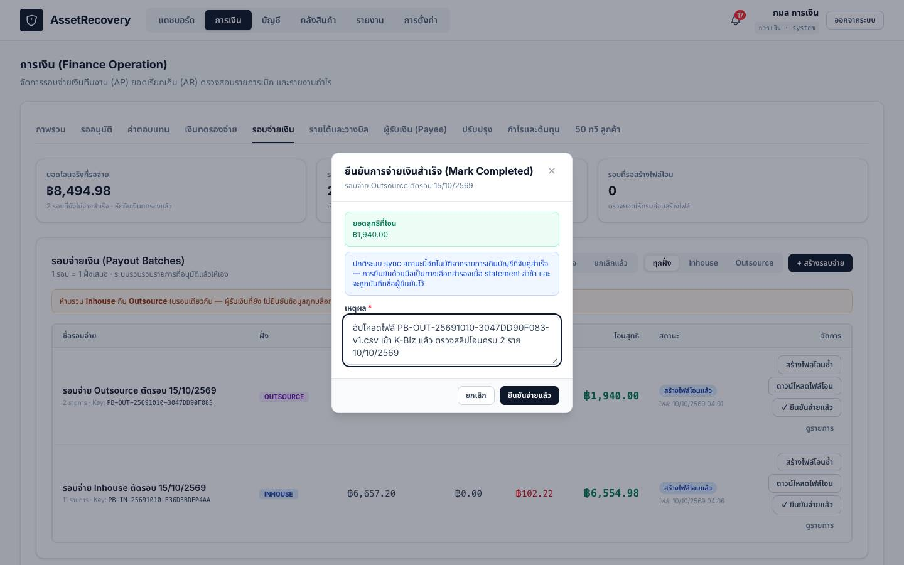

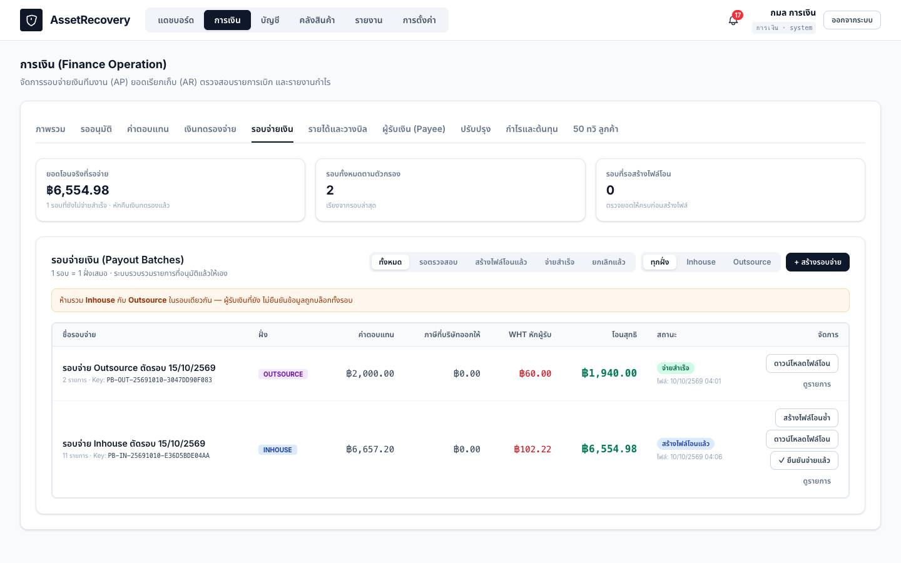

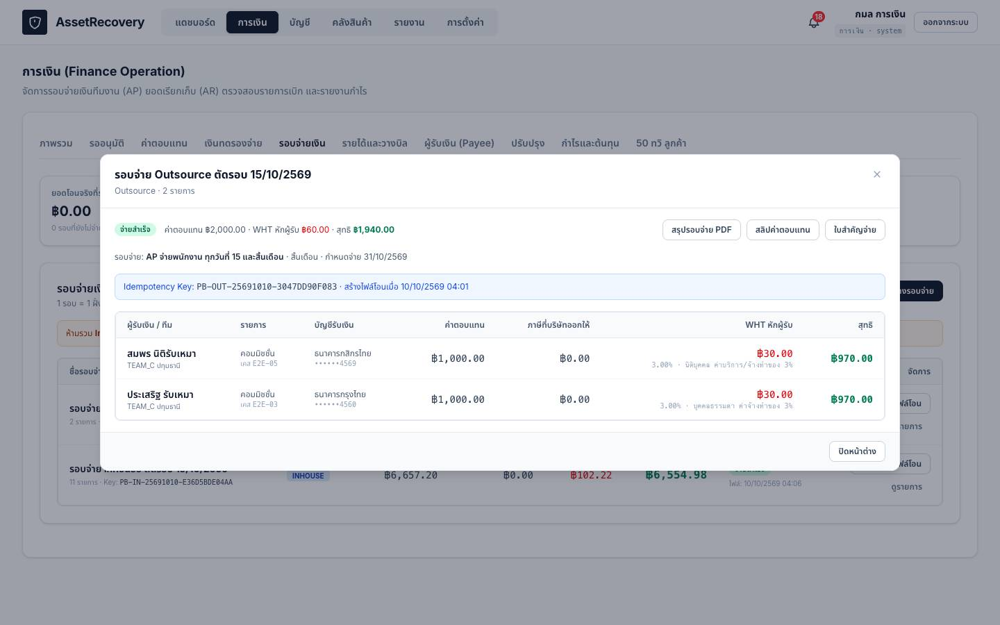

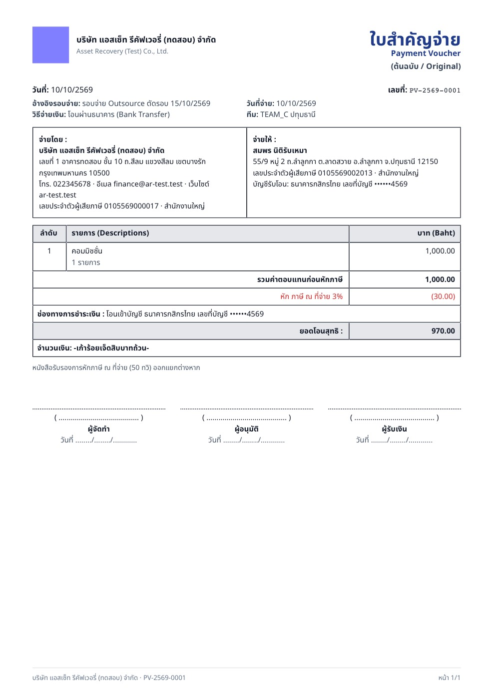

| ช่อง | บังคับ | ตัวอย่าง |
|---|---|---|
| เหตุผล | ✔ | "อัปโหลดไฟล์ PB-OUT-…-v1.csv เข้า K-Biz แล้ว ตรวจสลิปโอนครบ 2 ราย 10/10/2569" |

**ผลที่ควรเห็น:** toast "ยืนยันการจ่ายเงินแล้ว — … ยอดโอน ฿…" · สถานะ **จ่ายสำเร็จ** · มีปุ่ม **ใบสำคัญจ่าย** (PDF) · ระบบออก **50 ทวิ** ให้อัตโนมัติ (บทที่ 16)

**ข้อควรระวัง:** การยืนยันจ่าย **ย้อนกลับไม่ได้** — กดเมื่อเงินออกจากบัญชีจริงแล้วเท่านั้น

## 16. หนังสือรับรอง 50 ทวิ ที่ระบบออกอัตโนมัติ

- เมื่อรอบจ่าย **จ่ายสำเร็จ** ระบบออกหนังสือรับรองการหักภาษี ณ ที่จ่าย (50 ทวิ) **1 ใบต่อรายการที่ถูกหักภาษี** (ผู้รับเงินที่มี 5 รายการถูกหัก จะได้ 5 ใบในรอบเดียว)
- บุคคลธรรมดาเข้า **ภ.ง.ด.3** · นิติบุคคลเข้า **ภ.ง.ด.53**
- ทะเบียน 50 ทวิ · ดาวน์โหลด PDF · สรุปยอดนำส่งรายเดือน · บันทึกยื่นแบบ อยู่ที่ **บัญชี › เอกสาร & WHT** ซึ่งเป็นงานของ **ฝ่ายบัญชี** (ดู [เล่ม 6](06-accounting-exec.md))

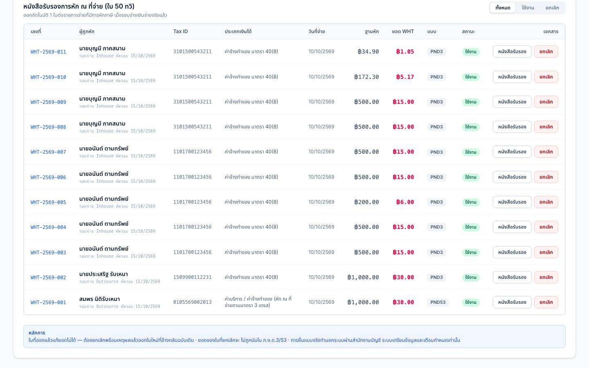

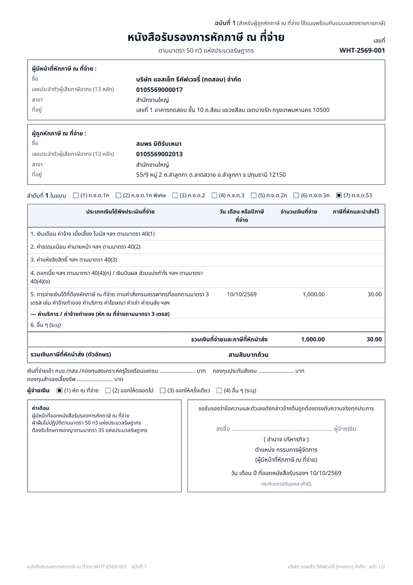

**ข้อควรระวัง / เคล็ดลับ**
- การเงิน **ไม่มีเมนูเปิดดู 50 ทวิ** (เมนูบัญชีของการเงินมีแค่ "ตัวอย่างเอกสารทั้งหมด") และหน้ารอบจ่ายไม่มีลิงก์ 50 ทวิ — ถ้าผู้รับเงินขอสำเนา ให้ขอจากฝ่ายบัญชี
- ชื่อผู้รับเงินบน 50 ทวิ มาจาก **ชื่อผู้ใช้** ของผู้รับเงิน — ผู้รับเงินที่เป็นนิติบุคคลต้องตั้งชื่อผู้ใช้ให้ตรงชื่อบริษัทตามหนังสือรับรองตั้งแต่แรก (บทที่ 24)
- 50 ทวิ ที่ผิดต้องให้ฝ่ายบัญชี **ยกเลิกแล้วออกใบแทน** — ห้ามลบ

## 17. ตัวอย่างรอบจ่ายเล็กที่ไม่ถูกหักภาษี

**สถานการณ์:** หลังรอบแรก มีค่าน้ำมันเหมาจ่าย/เบี้ยเลี้ยงที่ระบบสรุปเพิ่ม (บทที่ 7) และอนุมัติครบ จึงสร้างรอบจ่ายเพิ่มในวันตัดรอบเดียวกัน

**ขั้นตอน** (เหมือนบทที่ 12–15)
1. **+ สร้างรอบจ่าย** → ฝั่ง Inhouse · วันตัดรอบ 15/10/2569 · ตั้งชื่อ "รอบจ่าย Inhouse ตัดรอบ 15/10/2569 (รอบ 2 ค่าน้ำมันเหมา/เบี้ยเลี้ยง)"
2. **ดูรายการ** → ตรวจ
3. **สร้างไฟล์โอน** → ดาวน์โหลด → อัปโหลดเข้าธนาคาร → **✓ ยืนยันจ่ายแล้ว**
4. ทำซ้ำฝั่ง Outsource

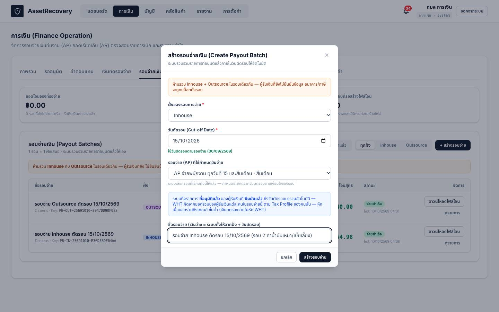

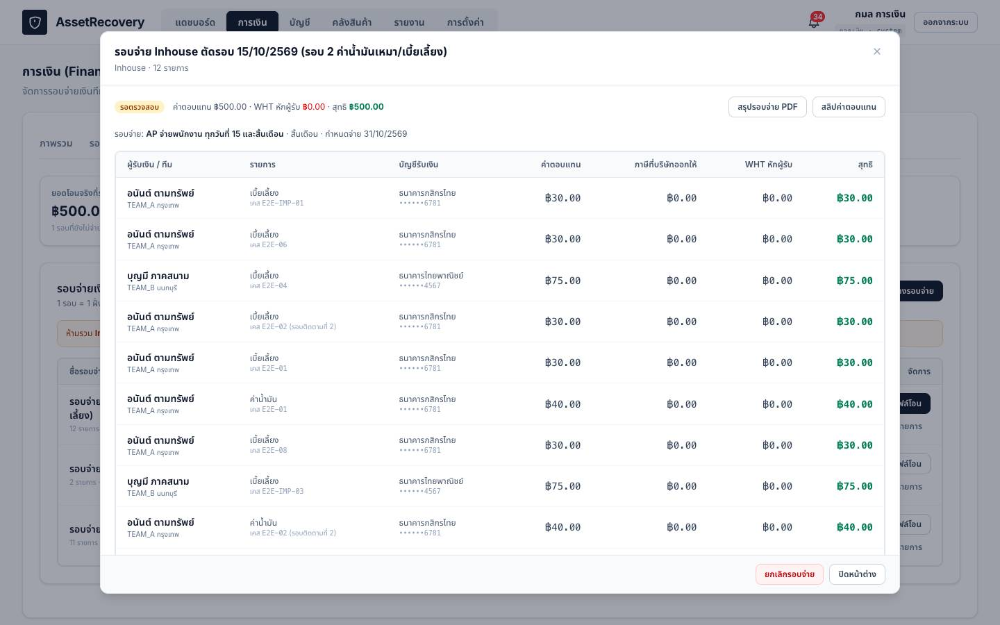

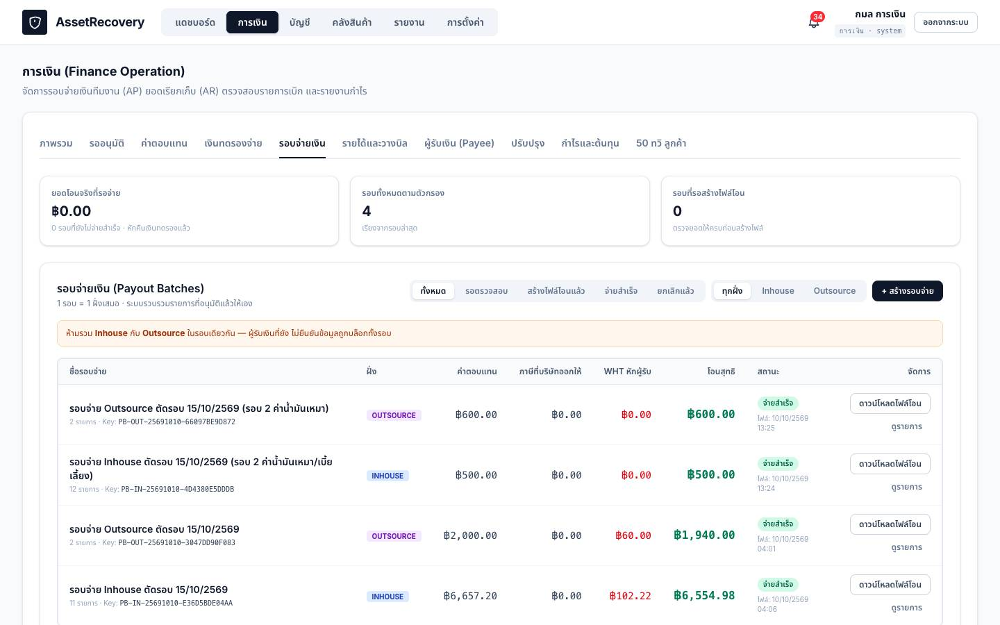

**ผลที่ควรเห็น:** Inhouse 12 รายการ ฿500.00 · Outsource 2 รายการ ฿600.00 · **WHT ฿0.00** เพราะยอดต่อคนต่อรอบต่ำกว่า 1,000 บาท · ไม่มี 50 ทวิ ใหม่

**เคล็ดลับ:** ถ้าต้องการให้หักภาษีตามยอดรวมทั้งเดือน ให้รวมรายการไว้ในรอบเดียว (สร้างรอบหลังรายการรายวันอนุมัติครบ) — การแยกรอบเล็กทำให้แต่ละรอบไม่ถึงเกณฑ์ · หากไม่แน่ใจนโยบาย ให้ปรึกษาสำนักงานบัญชี

---

# ส่วนที่ 3 — งานประจำเดือน

## 18. รายได้เกิดขึ้นเมื่อไร

**รายได้ของเคสเกิดเอง (ไม่มีการสร้าง/แก้ด้วยมือ) เมื่อครบทั้ง 3 เงื่อนไข**

| # | เงื่อนไข | ใครทำ |
|---|---|---|
| 1 | รายการเบิกทุกรายการของเคสนั้น **อนุมัติครบทุกขั้น** | ผู้จัดการทีม + การเงิน (+ บริหาร) |
| 2 | คลัง **ยืนยันล็อตส่งมอบ** ของเคสนั้นแล้ว (เคสปิดสำเร็จต้องผ่านคลังเสมอ) | ธุรการคลัง ([เล่ม 4](04-warehouse.md)) |
| 3 | ระบบ **สรุปวันลงพื้นที่** ของวันที่พนักงานเช็คอินเคสนั้นแล้ว และรายการรายวันที่เกิดขึ้นอนุมัติครบ | ระบบ (ทุกคืน) + การเงิน |

**ขั้นตอน — ตรวจรายได้**
1. **การเงิน** → แท็บ **รายได้และวางบิล**
2. การ์ด **รายได้ที่ยังไม่ถูกรวมรอบ** บอกจำนวนรายได้ที่พร้อมวางบิล
3. เลื่อนลงตาราง **รายการรายได้ (Revenue)** — กรอง **รอวางบิล / รวมเข้ารอบแล้ว**

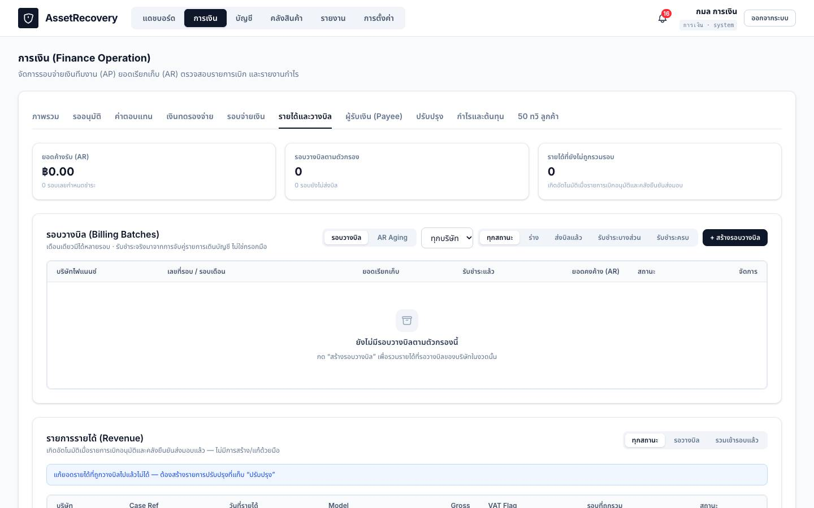

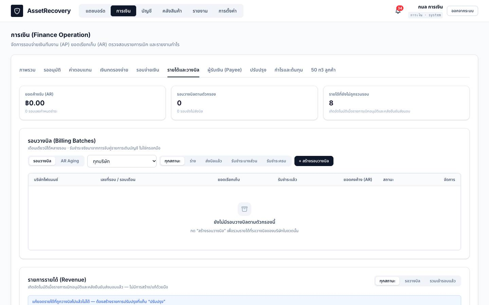

**ข้อควรระวัง / เคล็ดลับ**
- ข้อความบนจอบอกแค่ "เกิดอัตโนมัติเมื่อรายการเบิกอนุมัติและคลังยืนยันส่งมอบ" — **อย่าลืมเงื่อนไขข้อที่ 3** ถ้ายืนยันล็อตและอนุมัติครบแล้วแต่รายได้ยังไม่ขึ้น ให้รอหลังระบบสรุปวันลงพื้นที่ (เช้าวันถัดไป) แล้วตรวจคิวรายการรายวันในบทที่ 7
- ค่าบริการถูก **บันทึกไว้ตอนเคสได้รับอนุมัติ** และ VAT ใช้อัตราที่มีผล ณ วันรับรู้รายได้ — การแก้เทมเพลตค่าบริการภายหลังไม่ย้อนไปเปลี่ยนรายได้เดิม
- แก้ยอดรายได้ที่วางบิลไปแล้วไม่ได้ — ต้องทำผ่าน **ปรับปรุง** (บทที่ 23)

## 19. สร้างรอบวางบิล

**เป้าหมาย:** รวมรายได้ที่รอวางบิลของบริษัทไฟแนนซ์หนึ่งรายเป็นใบแจ้งหนี้

**ขั้นตอน**
1. แท็บ **รายได้และวางบิล** → กด **+ สร้างรอบวางบิล**
2. เลือก **บริษัทไฟแนนซ์** — ระบบแสดงรอบบิลที่ใช้ (เช่น "AR วางบิลสิ้นเดือน ชำระ Net 30 วัน") และเตือนถ้าเอกสารบริษัทไม่ครบ
3. ตั้ง **วันตัดรอบ** (ระบบเสนอตามรอบบิล แก้ได้) — ระบบแสดงวันครบกำหนดชำระให้
4. กรอก **เหตุผล** (อย่างน้อย 5 ตัวอักษร) → กด **สร้างรอบวางบิล**
5. ทำซ้ำทีละบริษัท

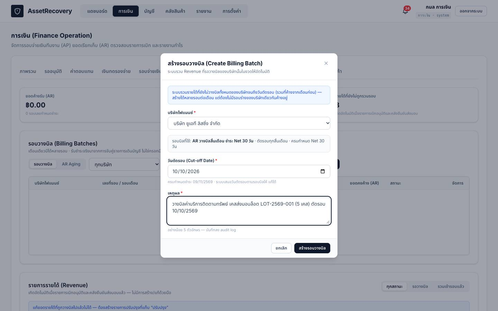

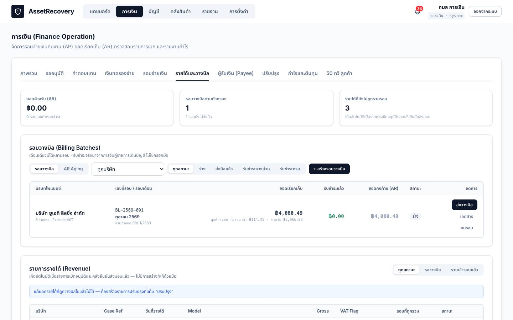

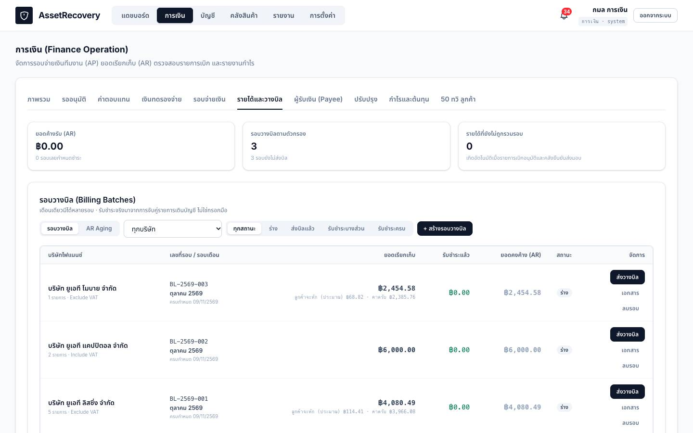

| ช่อง | บังคับ | ตัวอย่าง / หมายเหตุ |
|---|---|---|
| บริษัทไฟแนนซ์ | ✔ | บริษัท ยูเอที ลิสซิ่ง จำกัด |
| วันตัดรอบ | ✔ | 10/10/2569 · ครบกำหนด = +30 วัน (ตามรอบบิลของบริษัท) |
| เหตุผล | ✔ | "วางบิลค่าบริการติดตามทรัพย์ เคสส่งมอบล็อต LOT-2569-001 (5 เคส)" |

**ผลที่ควรเห็น:** รอบใหม่ เช่น `BL-2569-001` สถานะ **ร่าง** · ยอดเรียกเก็บ · "ลูกค้าจะหัก (ประมาณ) ฿… · คาดรับ ฿…" สำหรับลูกค้าที่หักภาษี ณ ที่จ่าย

**ข้อควรระวัง / เคล็ดลับ**
- ระบบรวมรายได้ที่ยังไม่วางบิลทั้งหมดของบริษัทจนถึงวันตัดรอบ (รวมที่ค้างจากเดือนก่อน) · สร้างได้หลายรอบต่อเดือน แต่ต้องไม่มีรอบ **ร่าง** ของบริษัทเดียวกันค้างอยู่
- ถ้าขึ้น "ไม่มีรายได้ให้วางบิล" แปลว่ารายได้ของบริษัทนั้นยังไม่เกิด (บทที่ 18) — ไม่มีรอบเกิดขึ้น
- เตือน "เอกสารบริษัทยังไม่ครบ" ไม่บล็อก แต่ควรแจ้งผู้ดูแลข้อมูลบริษัทไฟแนนซ์ให้เติม
- สถานะ **ร่าง** ยังไม่มีปุ่ม PDF — ใบแจ้งหนี้ออกหลัง **ส่งบิล** (บทที่ 20) · รอบร่างที่ผิดลบได้ด้วยปุ่ม **ลบรอบ**

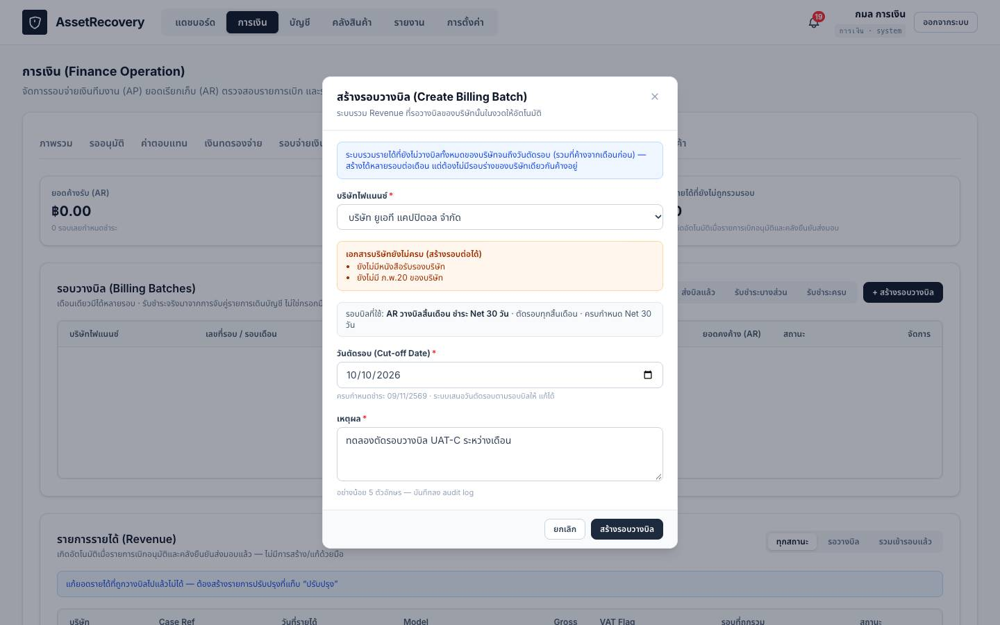

## 20. ส่งบิลและพิมพ์ใบแจ้งหนี้ PDF

**ขั้นตอน**
1. ที่แถวรอบสถานะ **ร่าง** กด **ส่งวางบิล**
2. ตรวจกล่อง **ยอดเรียกเก็บของรอบ** (ยอด · จำนวนรายการ · ครบกำหนด · ภาษีที่ลูกค้าจะหัก · ยอดคาดรับ)
3. กรอก **เหตุผล** (ช่องทาง/ผู้รับ) → กด **ยืนยันส่งบิล**
4. กด **เอกสาร** → **ใบแจ้งหนี้ PDF** → พิมพ์หรือแนบอีเมลส่งบริษัทไฟแนนซ์

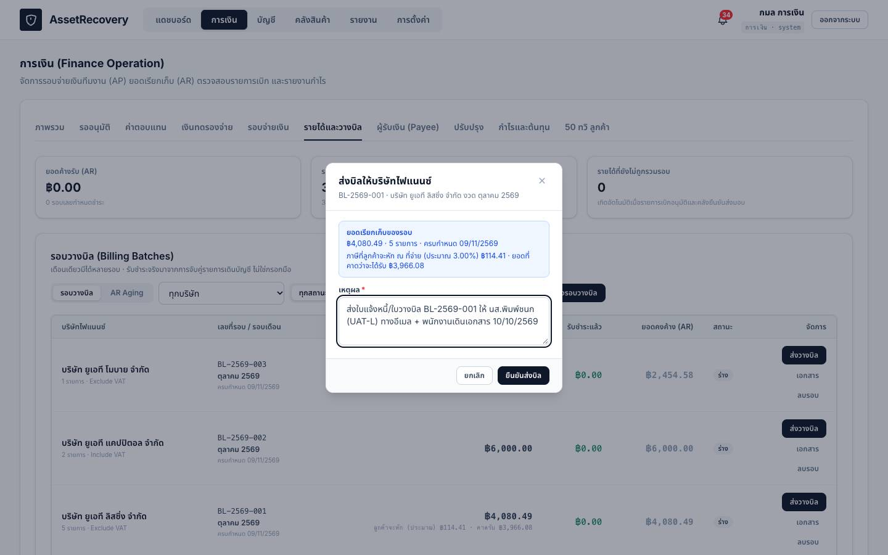

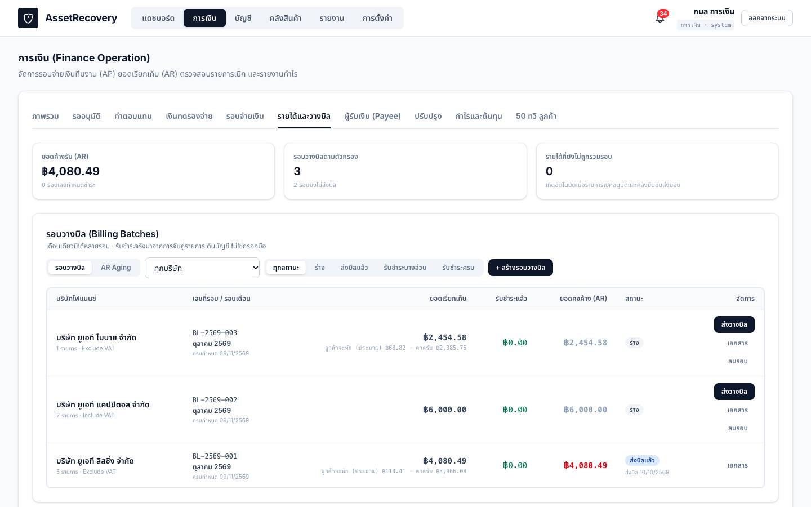

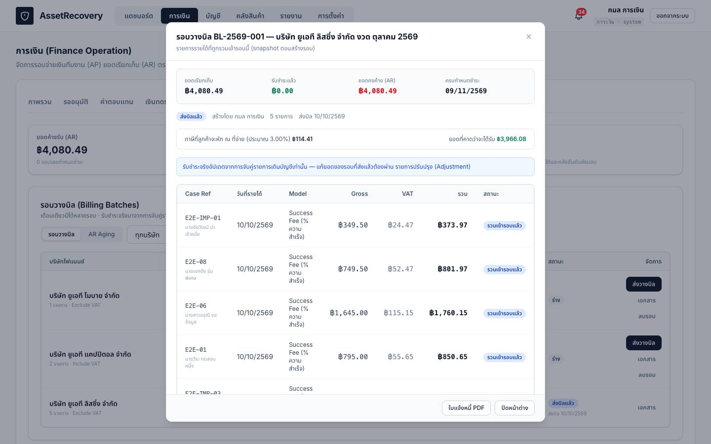

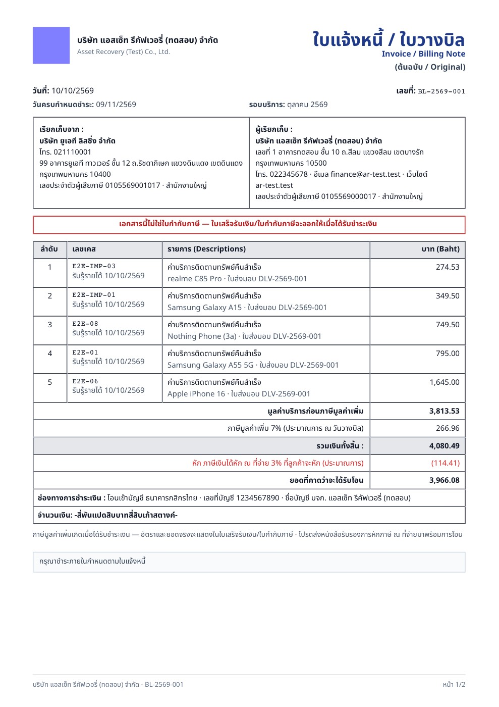

| ช่อง | บังคับ | ตัวอย่าง |
|---|---|---|
| เหตุผล | ✔ | "ส่งใบแจ้งหนี้/ใบวางบิล BL-2569-001 ให้ผู้ประสานงานของบริษัท ทางอีเมล + พนักงานเดินเอกสาร 10/10/2569" |

**ผลที่ควรเห็น:** toast "ส่งบิลแล้ว" · สถานะ **ส่งบิลแล้ว · ส่งบิล <วันที่>** · ยอดเข้าการ์ด **ยอดค้างรับ (AR)**

**ข้อควรระวัง / เคล็ดลับ**
- **ใบแจ้งหนี้ไม่ใช่ใบกำกับภาษี** — ใบเสร็จรับเงิน/ใบกำกับภาษีฝ่ายบัญชีออกเมื่อได้รับเงิน ([เล่ม 6](06-accounting-exec.md))
- ใบแจ้งหนี้แสดงยอดภาษีที่ลูกค้าคาดว่าจะหัก ณ ที่จ่าย และบัญชีรับโอน — ใช้แจ้งยอดที่ควรได้รับกับลูกค้า
- **ส่งบิลแล้วย้อนกลับไม่ได้ และลบรอบไม่ได้** — ตรวจยอดตอนเป็นร่างให้เรียบร้อย ถ้าผิดหลังส่งต้องใช้ **ปรับปรุง** (บทที่ 23)

## 21. ติดตามการรับชำระและอายุหนี้

**ใครทำอะไร:** เมื่อบริษัทไฟแนนซ์โอนเงิน **ฝ่ายบัญชี** เป็นผู้นำเข้า statement และจับคู่เงินเข้ากับรอบวางบิล — สถานะรอบวางบิลจะเปลี่ยนเอง คุณ **ไม่ต้องบันทึกรับเงินด้วยมือ** (และไม่มีปุ่มให้บันทึก)

**ขั้นตอน — ติดตาม**
1. แท็บ **รายได้และวางบิล** → ตาราง **รอบวางบิล (Billing Batches)** — ดู ยอดเรียกเก็บ · **รับชำระแล้ว** · **ยอดคงค้าง (AR)** · สถานะ
2. กรองสถานะ: ร่าง · ส่งบิลแล้ว · รับชำระบางส่วน · รับชำระครบ · กรองบริษัทได้
3. กดปุ่ม **AR Aging** — ยอดค้างแยกตามอายุนับจากวันครบกำหนด: **0–30 · 31–60 · 61–90 · 90+ วัน**
4. ติดตามบริษัทที่มียอดค้าง โดยเฉพาะช่องที่เลยกำหนด

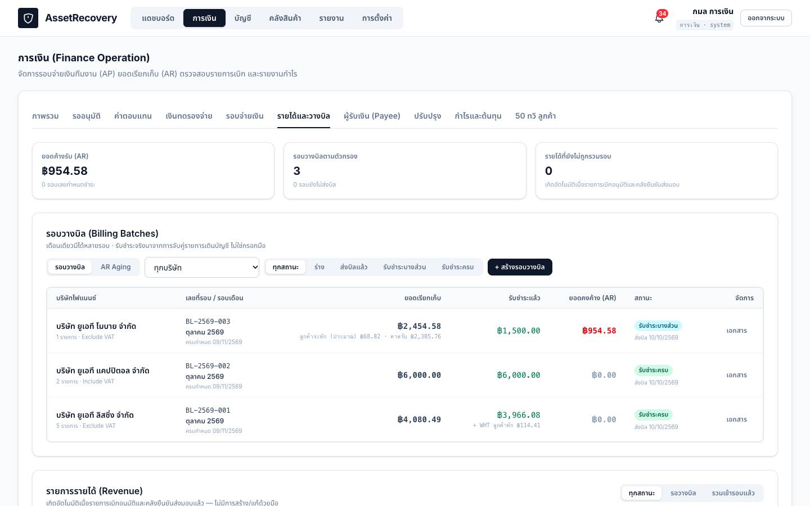

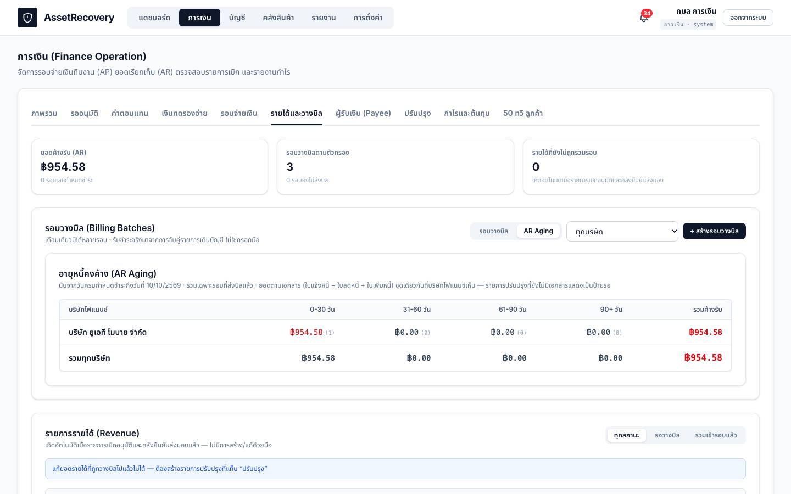

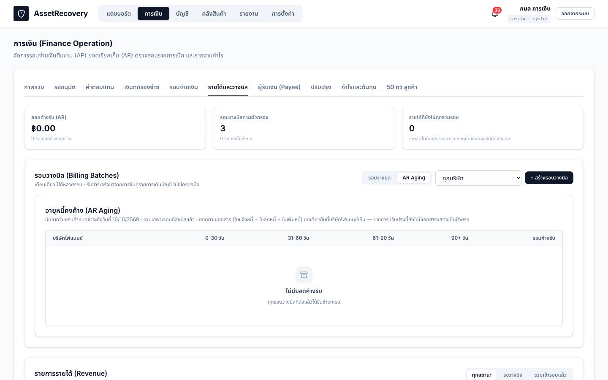

**ข้อควรระวัง / เคล็ดลับ**
- ลูกค้าที่หักภาษี ณ ที่จ่าย จะโอนมาน้อยกว่ายอดบิล — เมื่อฝ่ายบัญชีจับคู่ ระบบนับภาษีที่ลูกค้าหักเป็นการรับชำระ (เช่น รับ 3,966.08 + WHT ลูกค้าหัก 114.41 = ครบ 4,080.49) แล้วสร้างรายการ **รอ 50 ทวิ จากลูกค้า** ให้คุณติดตาม (บทที่ 22)
- ลูกค้าโอนบางส่วน → สถานะ **รับชำระบางส่วน** พร้อมยอดคงค้าง · ถ้าลูกค้าแจ้งยอดชำระที่เหลือ ให้แจ้งฝ่ายบัญชีว่ายอดคงค้างเท่าไร (หน้าจับคู่ของบัญชีแสดงยอดเต็มบิล)
- เงินเข้าที่ไม่ทราบที่มา ฝ่ายบัญชีจะย้ายเป็น **เงินรับรอตรวจสอบ** (ไม่ลดยอดค้าง) — ถ้าคุณทราบว่าเป็นของลูกค้ารายใด แจ้งฝ่ายบัญชี

## 22. บันทึกรับ 50 ทวิ ที่ลูกค้าหัก

**เป้าหมาย:** เก็บหนังสือรับรองที่บริษัทไฟแนนซ์ออกให้ เพื่อใช้เป็นเครดิตภาษีของบริษัท

**ขั้นตอน**
1. **การเงิน** → แท็บ **50 ทวิ ลูกค้า** — รายการ **เกิดเอง** หลังฝ่ายบัญชีจับคู่เงินรับที่ลูกค้าหักภาษี สถานะ **รอ 50 ทวิ จากลูกค้า**
2. เมื่อได้รับหนังสือฉบับจริง กด **บันทึกได้รับหนังสือ**
3. กรอก **เลขที่หนังสือ · วันที่ในหนังสือ · ยอดภาษีที่หัก** (ระบบเติมให้ ตรวจกับหนังสือ) · **ยอดเงินได้** · แนบ **ไฟล์สแกน** · หมายเหตุ → **บันทึกได้รับหนังสือ**
4. ใช้ตัวกรอง **ได้รับแล้ว** ตรวจผล · กด **ดูไฟล์** เปิดสแกนย้อนหลัง

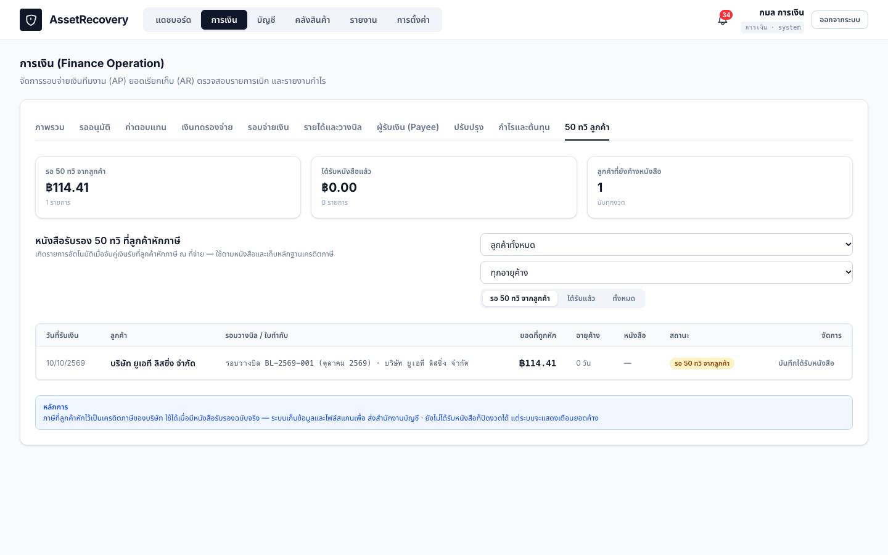

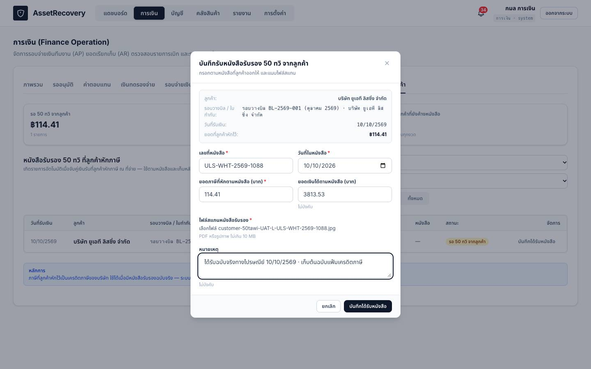

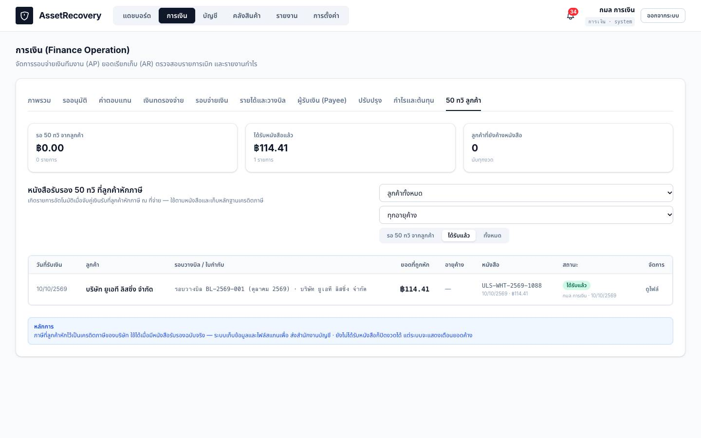

| ช่อง | บังคับ | ตัวอย่าง |
|---|---|---|
| เลขที่หนังสือ | ✔ | ULS-WHT-2569-1088 (ตามหนังสือของลูกค้า) |
| วันที่ในหนังสือ | ✔ | 10/10/2569 |
| ยอดภาษีที่หักตามหนังสือ | ✔ | 114.41 |
| ยอดเงินได้ตามหนังสือ | ไม่บังคับ | 3,813.53 (ยอดก่อน VAT) |
| ไฟล์สแกน | ✔ | PDF หรือรูปภาพ ไม่เกิน 10 MB |

**เคล็ดลับ**
- ยอดภาษีที่ลูกค้าหัก = **3% ของยอดก่อน VAT** (ค่าบริการ) เช่น 3,813.53 × 3% = 114.41
- ลูกค้าที่ชำระบางส่วนโดยยังไม่หักภาษี จะยังไม่มีรายการ — รายการเกิดเมื่อมีการจับคู่ยอดที่หักภาษีจริง
- ฝ่ายบัญชีบันทึกแทนได้จากเมนู **บัญชี › 50 ทวิ ลูกค้า** — ตกลงกันในทีมว่าใครเป็นผู้รับหนังสือ จะได้ไม่บันทึกซ้ำ
- เก็บต้นฉบับหนังสือในแฟ้มเครดิตภาษี และส่งสำเนาให้ฝ่ายบัญชีรวมในชุดเอกสารรายเดือน

## 23. ปรับปรุงรายการ (Adjustment)

**ใช้เมื่อไร:** พบว่ายอดที่บันทึก/อนุมัติไปแล้ว **ผิด** และแก้ที่ต้นทางไม่ได้แล้ว (เช่น รายการเบิกที่จ่ายแล้ว รายได้ที่วางบิลแล้ว)

**หลักการ**
- **ไม่แก้รายการต้นทาง** — สร้างรายการปรับปรุง (ลดยอด / เพิ่มยอด) คู่กับต้นทาง พร้อมเหตุผล เพื่อให้ตรวจสอบย้อนหลังได้
- **ผู้สร้างคือการเงินเท่านั้น** (ฝ่ายบัญชีไม่มีสิทธิ์สร้าง/อนุมัติ)
- สายอนุมัติขึ้นกับ **สถานะรอบบัญชีของรายการต้นทาง**:

| สถานะรอบบัญชี | ผู้อนุมัติ |
|---|---|
| **กำลังรวบรวม** (เดือนที่ยังเปิด) | การเงินอนุมัติเองได้ |
| **ส่งสำนักงานบัญชีแล้ว** | การเงิน **และ** บริหาร |
| **ปิดรอบแล้ว (ล็อก)** | บริหารเท่านั้น |

- ⚠️ **ผลของ Adjustment อยู่ในรายงาน** (ต้นทุน/รายได้/กำไรขั้นต้น) — **ไม่หักคืนเงินที่จ่ายให้พนักงานไปแล้ว** และไม่หักในรอบจ่ายถัดไปอัตโนมัติ ถ้าต้องเรียกเงินคืนจากพนักงาน ต้องตกลงและเก็บเงินคืนนอกระบบ (แจ้งฝ่ายบัญชีให้ทราบ)

**ขั้นตอน — สร้าง**
1. **การเงิน** → แท็บ **ปรับปรุง** → กด **+ สร้าง Adjustment**
2. เลือก **ประเภทรายการต้นทาง**: รายได้ (Revenue) · ค่าใช้จ่าย (Expense/Claim) · รอบวางบิล · รอบจ่ายเงิน
3. ค้นหาด้วยเลขเคส / เดือน / ชื่อรอบ (เว้นว่างแล้วกด **ค้นหา** = รายการล่าสุด 20 รายการ) → **คลิกเลือก** รายการต้นทาง
4. ตรวจกล่อง **สถานะรอบบัญชีของรายการต้นทาง** และ **ต้องผ่านการอนุมัติ: …**
5. เลือก **ประเภทการปรับปรุง** (ลดยอด / เพิ่มยอด) · กรอก **ยอดที่ปรับ** (บวกเสมอ) · **เหตุผล** → **สร้างรายการ**

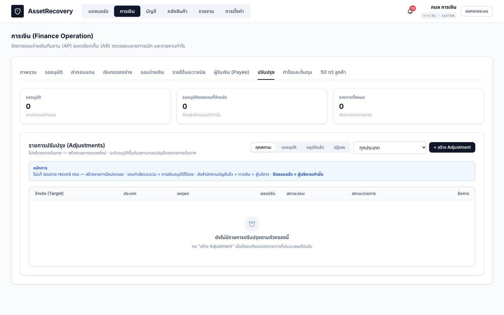

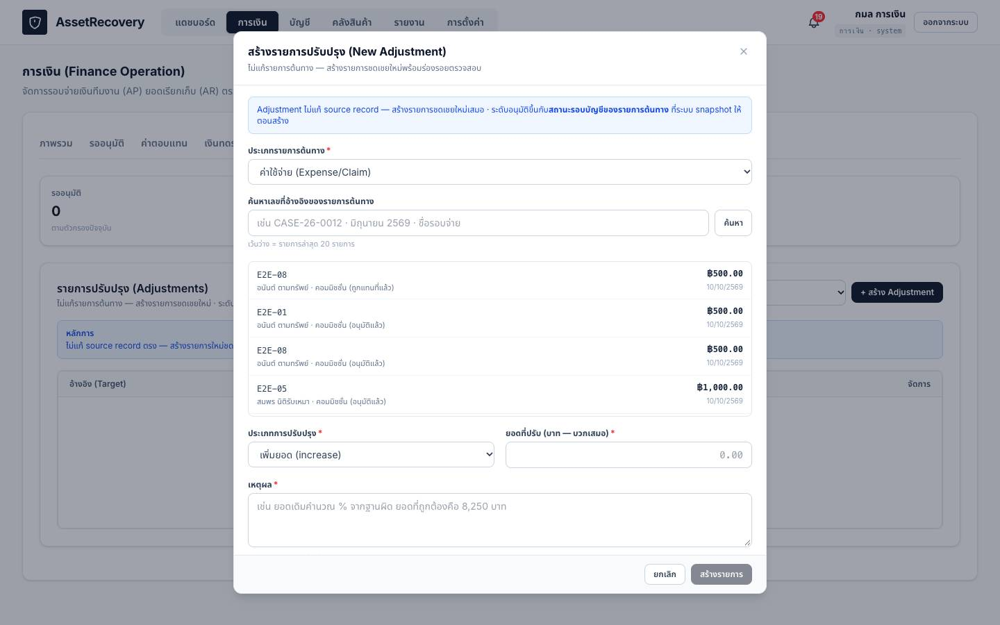

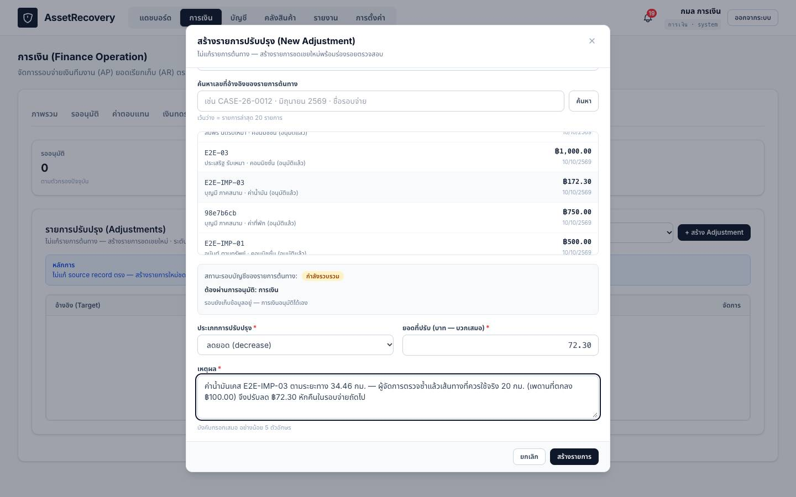

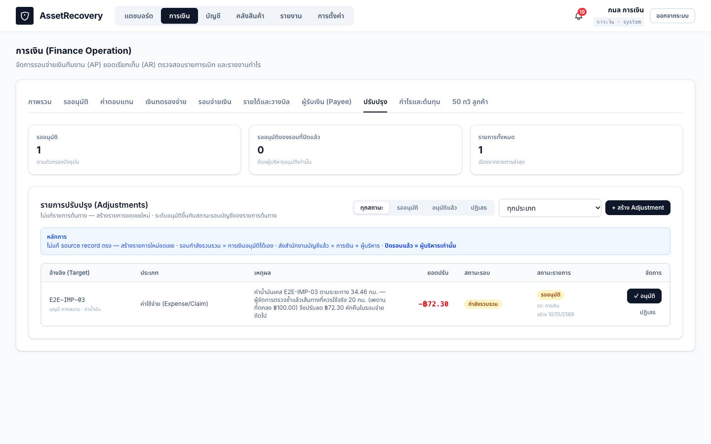

| ช่อง | บังคับ | ตัวอย่าง / หมายเหตุ |
|---|---|---|
| ประเภทรายการต้นทาง | ✔ | ค่าใช้จ่าย (Expense/Claim) |
| รายการต้นทาง | ✔ | คลิกเลือกจากรายการ — อย่าเลือกรายการที่มีป้าย "(ถูกแทนที่แล้ว)" |
| ประเภทการปรับปรุง | ✔ | ลดยอด (decrease) |
| ยอดที่ปรับ (บาท) | ✔ | 72.30 — บวกเสมอ · รายได้ใช้ **ยอดก่อน VAT** |
| เหตุผล | ✔ | อย่างน้อย 5 ตัวอักษร เช่น "ผู้จัดการตรวจเส้นทางซ้ำ ระยะที่ควรใช้จริง 20 กม. จึงปรับลด 72.30 บาท" |

**ขั้นตอน — อนุมัติ**
1. แถวรายการ **รออนุมัติ (รอ: …)** → กด **✓ อนุมัติ**
2. หน้าต่างแสดงว่าใครอนุมัติไปแล้ว (เช่น "อนุมัติแล้ว: บริหาร") → กรอก **หมายเหตุของผู้อนุมัติ** (ไม่บังคับ) → **ยืนยันอนุมัติ**
3. ไม่เห็นด้วย → กด **ปฏิเสธ** พร้อมเหตุผล

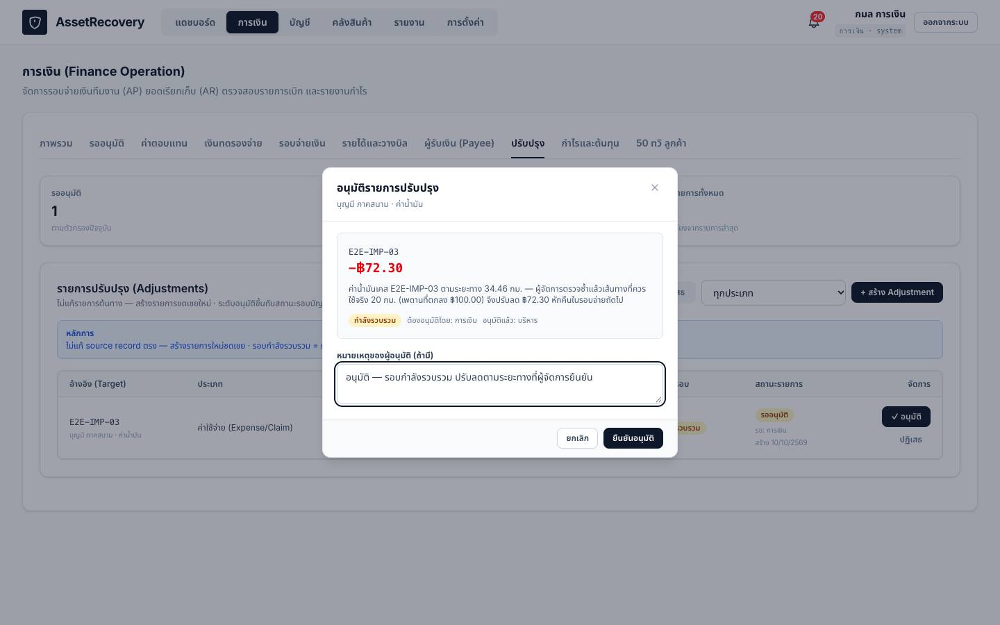

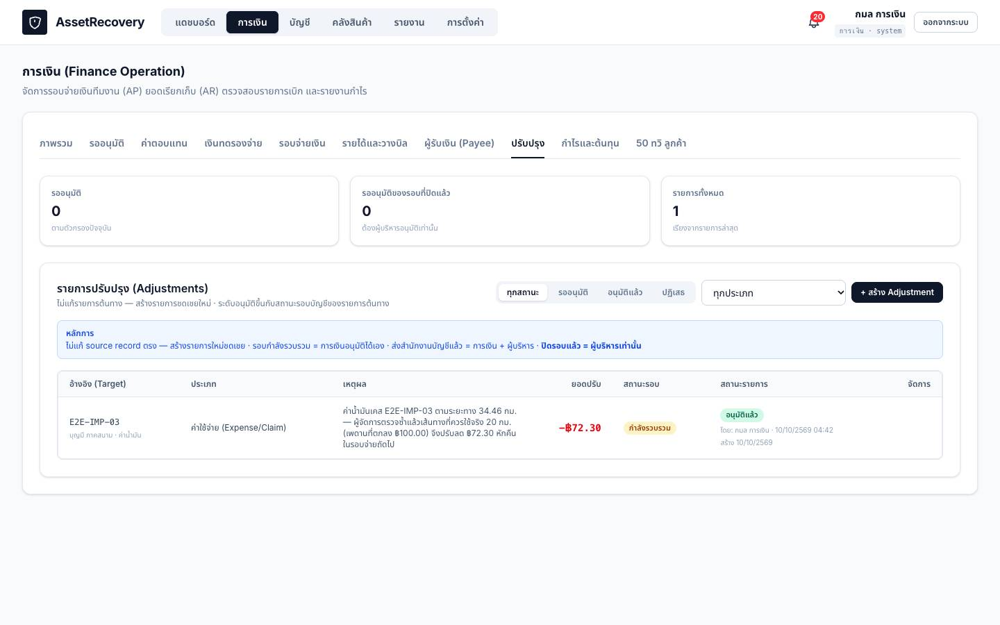

**ผลที่ควรเห็น:** toast "อนุมัติรายการปรับปรุงแล้ว — <อ้างอิง> — ฿…" · สถานะ **อนุมัติแล้ว โดย <ชื่อ> · <วันเวลา>** · รายงานกำไรขั้นต้นสะท้อนยอดที่ปรับ

**กรณีปรับลดรายได้ของบิลที่ออกใบกำกับแล้ว**
- หลังอนุมัติ แถวจะมีป้าย **รอใบลดหนี้ ใบกำกับ INV-…** — ฝ่ายบัญชีต้องบันทึก **ใบลดหนี้** ที่สำนักงานบัญชีออก
- ⚠️ **ใบลดหนี้บันทึกได้เฉพาะบิลที่ยังมียอดค้างชำระ** — ถ้าบิลรับชำระครบแล้ว ระบบจะปฏิเสธ ("รอบวางบิลนี้ไม่มียอดค้างชำระแล้ว … ถ้าต้องคืนเงินให้ลูกค้า ขอให้สำนักงานบัญชีจัดการคืนเงินนอกระบบ") และป้าย "รอใบลดหนี้" จะค้างอยู่ · Adjustment ที่อนุมัติแล้วยกเลิกไม่ได้
- **ก่อนสร้าง Adjustment ลดรายได้ ให้ตรวจยอดคงค้างของรอบวางบิลที่แท็บรายได้และวางบิลก่อนเสมอ** — ถ้าชำระครบแล้ว ให้ตกลงกับสำนักงานบัญชีก่อนว่าจะคืนเงิน/หักกลบบิลถัดไปอย่างไร

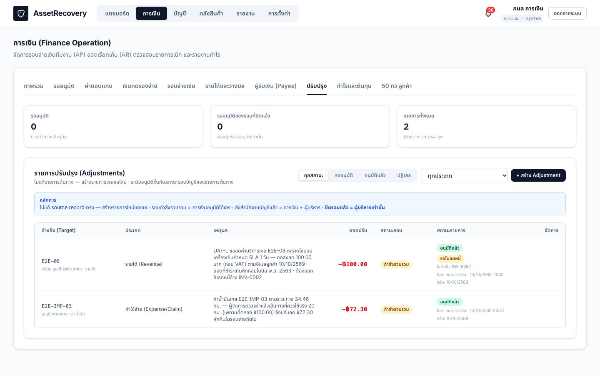

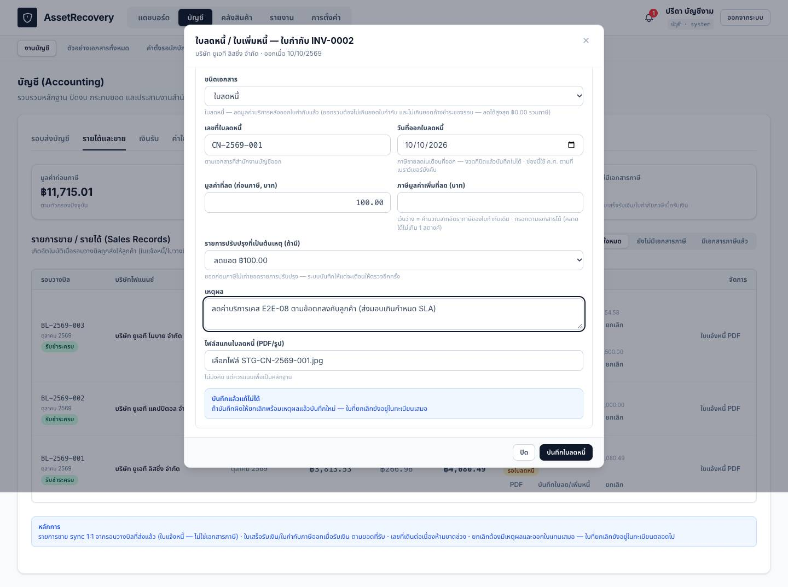

**ข้อควรระวัง / เคล็ดลับ**
- ในรอบที่ **กำลังรวบรวม** แม้บริหารกดอนุมัติแล้ว รายการยัง "รออนุมัติ (รอ: การเงิน)" — คุณต้องอนุมัติด้วย
- แถวที่เลือกเป็นรายการต้นทางมีพื้นสีเทาอ่อน (เห็นไม่ชัด) — ตรวจชื่อเคส/ยอดในกล่องสถานะด้านล่างก่อนกดสร้าง
- ถ้าค้นหาแล้วขึ้น "เชื่อมต่อระบบไม่สำเร็จ" พร้อม "ไม่พบรายการ" ให้ปิดหน้าต่างแล้วเปิดใหม่
- เขียนเหตุผลให้คนอื่นอ่านเข้าใจภายหลัง (อะไรผิด · ตัวเลขที่ถูก · ใครยืนยัน) — เหตุผลถูกบันทึกถาวร

## 24. ดูแลข้อมูลผู้รับเงิน

**เป้าหมาย:** ข้อมูลบัญชีและภาษีของผู้รับเงินถูกต้องก่อนเข้ารอบจ่าย

**ขั้นตอน**
1. **การเงิน** → แท็บ **ผู้รับเงิน (Payee)** — กรองสถานะ **ยืนยันแล้ว / รอยืนยัน**
2. ตรวจ ประเภท (บุคคลธรรมดา / นิติบุคคล) · เลขผู้เสียภาษี · บัญชีธนาคาร · **อัตรา WHT** (ที่มา: Tax Profile รายคน หรือค่าเริ่มต้นตามประเภทผู้รับ)
3. กด **แก้ไข** เพื่อปรับข้อมูล — **การแก้ข้อมูลธนาคาร/ภาษีทำให้สถานะกลับเป็น "รอยืนยัน" และต้องกรอกเหตุผล**
4. กด **+ เพิ่ม Payee** สำหรับผู้รับเงินใหม่

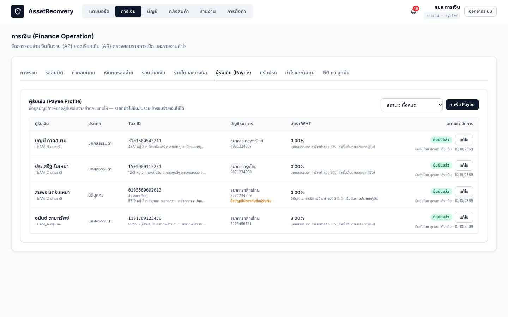

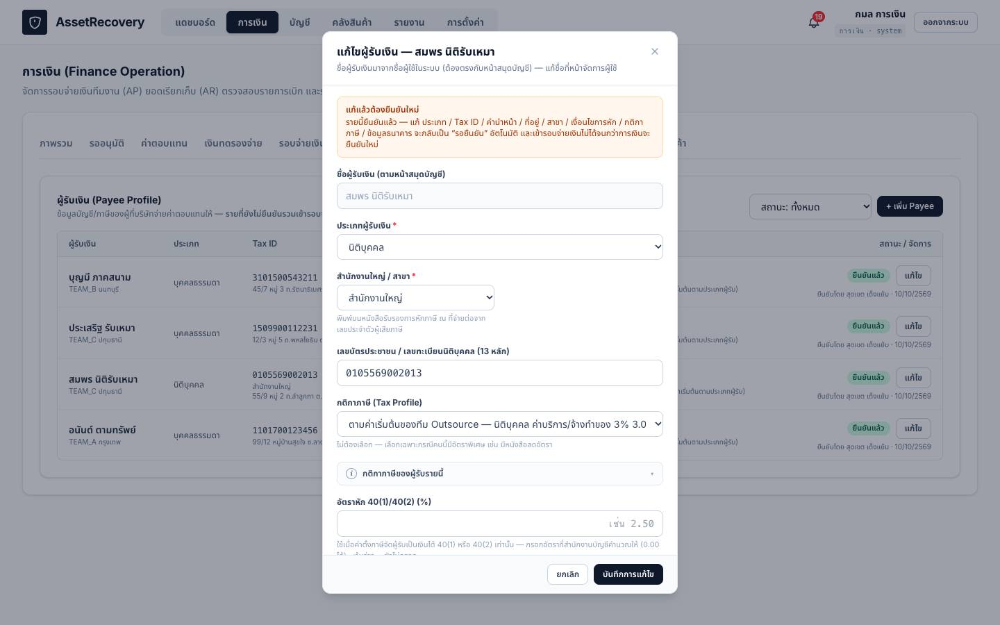

**ข้อควรระวัง / เคล็ดลับ**
- ผู้รับเงินที่ **ยังไม่ยืนยัน** จะรวมเข้ารอบจ่ายไม่ได้ — ตรวจแท็บนี้ก่อนวันตัดรอบ
- **ชื่อผู้รับเงินดึงจากชื่อผู้ใช้** แก้ในฟอร์มนี้ไม่ได้ — ต้องแก้ที่หน้าจัดการผู้ใช้ (ผู้ดูแลระบบ) · สำหรับนิติบุคคล ให้ตั้งชื่อผู้ใช้เป็นชื่อบริษัทตามหนังสือรับรอง เพราะชื่อนี้พิมพ์บน 50 ทวิ ภ.ง.ด.53
- ป้าย **ชื่อบัญชีไม่ตรงกับชื่อผู้รับเงิน** เป็นการเตือน (ไม่บล็อก) — ตรวจกับหน้าสมุดบัญชีก่อนโอน
- บังคับแนบสำเนาบัตร/เอกสารผู้รับเงินตามนโยบายบริษัท

## 25. กำไรขั้นต้นและรายงานฝั่งการเงิน

**ขั้นตอน — กำไรขั้นต้น**
1. **การเงิน** → แท็บ **กำไรและต้นทุน**
2. เลือกมุมมอง **แยกตามบริษัทไฟแนนซ์ / แยกตามทีม** และช่วง **เดือนนี้ / ไตรมาสนี้ / ปีนี้**
3. กด **รีเฟรชตอนนี้** เพื่อคำนวณสด
4. การ์ด 4 ใบ: **รายได้ (ก่อน VAT) · ต้นทุนตรง (ค่าน้ำมัน + เบี้ยเลี้ยง + ค่าตอบแทนเคส) · กำไรขั้นต้น · Gross Margin** · กด **เจาะลึก** ที่แถวเพื่อดูรายเคส

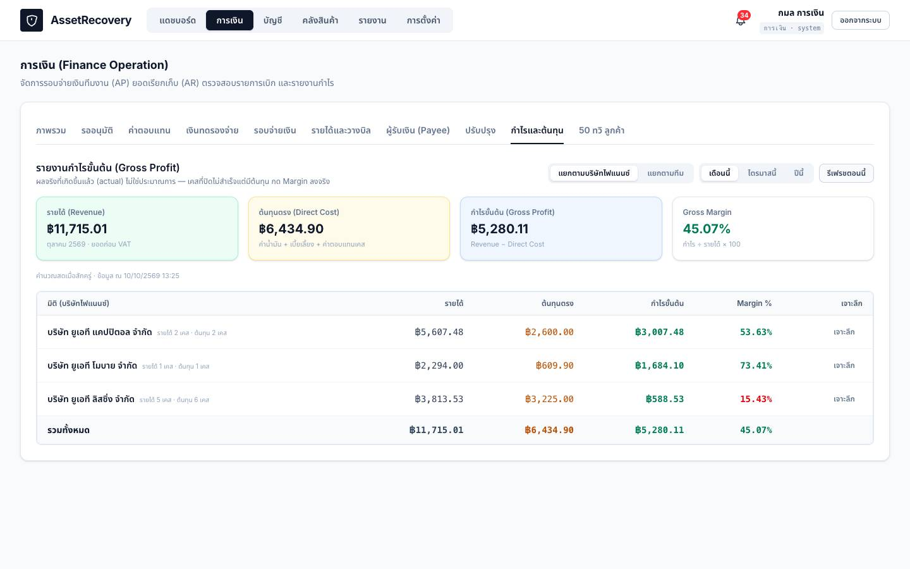

**รายงานหมวดการเงิน (เมนู รายงาน)** — การเงินเห็นเฉพาะหมวดนี้

| รายงาน | ใช้ทำอะไร |
|---|---|
| กำไรขั้นต้น | กำไร/Margin ต่อบริษัท ต่อทีม (ตรงกับแท็บกำไรและต้นทุน) |
| สรุปรายได้ | รายได้รายเดือน จำนวนเคส ค่าเฉลี่ย + กระทบยอดกับใบกำกับภาษี |
| อายุหนี้ลูกค้า | AR แยกช่วงอายุ ต่อบริษัท |
| สรุปค่าตอบแทน | ค่าตอบแทนและ WHT ต่อคน |
| อายุเงินทดรองคงค้าง | เงินทดรองที่ยังไม่เคลียร์ แยกช่วงอายุ |

ทุกรายงานเลือกช่วงเวลาได้ (เดือนนี้ / เดือนที่แล้ว / ไตรมาสนี้ / ปีนี้ / กำหนดเอง) · มีปุ่ม **รีเฟรชตอนนี้ · ส่งออก Excel · ส่งออก PDF**

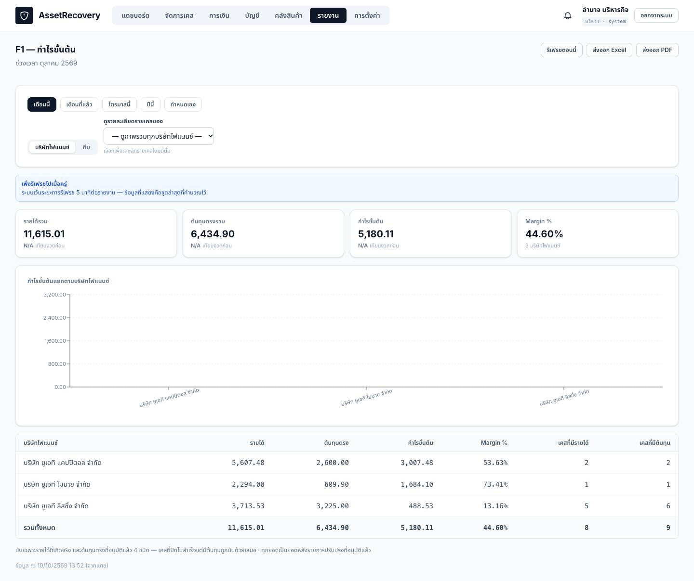

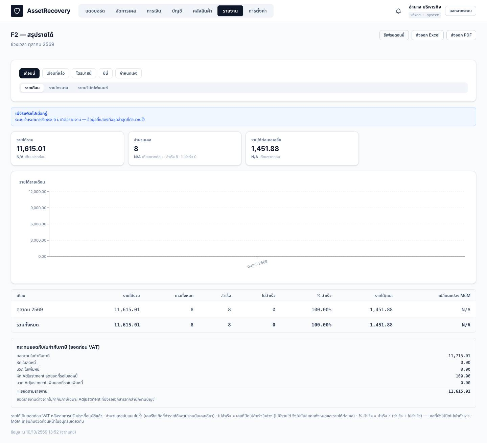

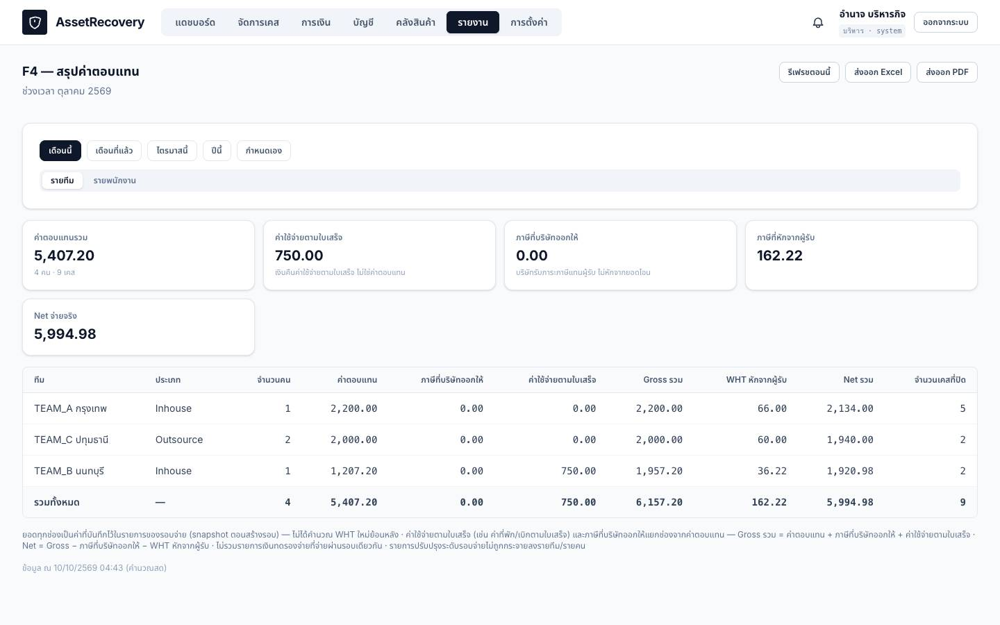

**ข้อควรระวัง / เคล็ดลับ**
- รายงานรายวันใช้ข้อมูลที่เก็บไว้ (แคช) — กด **รีเฟรชตอนนี้** ก่อนใช้ตัวเลขจริง (กดซ้ำได้ทุก 5 นาที)
- เมื่อเดือนนั้นยังไม่มีรายได้ Margin แสดง **N/A**
- หลัง Adjustment ลดรายได้ที่ยังไม่มีใบลดหนี้ รายงานรายได้จะ **ต่ำกว่า** ยอดในใบกำกับภาษี — รายงานสรุปรายได้แสดงบรรทัด "หัก Adjustment ลดยอดที่รอใบลดหนี้" ให้เห็นส่วนต่าง
- รายงานสรุปค่าตอบแทนแสดงยอดตามที่จ่ายจริง (ไม่รวม Adjustment) ขณะที่ต้นทุนตรงในกำไรขั้นต้นรวม Adjustment แล้ว — ตัวเลขสองรายงานจึงต่างกันได้
- รายงานหมวดบัญชี (WHT รายเดือน · ใบกำกับภาษี ฯลฯ) และหมวดผู้บริหาร การเงินเปิดไม่ได้

## 26. ข้อยกเว้นที่ต้องจัดการ (Alerts)

**คืออะไร:** ปัญหาเอกสาร/ข้อมูลที่ฝ่ายบัญชีบันทึกไว้ในงวดนั้น (เช่น "ใบเสร็จค่าที่พักไม่ได้ออกในนามบริษัท 1 รายการ") แสดงที่ **การเงิน › ภาพรวม › Alerts ที่ต้องจัดการ (Exceptions)**

**ขั้นตอน**
1. **การเงิน** → แท็บ **ภาพรวม** → ดูตาราง Alerts: ระดับ · โมดูล / งวด · รายละเอียด · วันที่พบ
2. กด **ดูรายละเอียด** เพื่อดูว่าต้องการอะไร
3. ช่วยแก้ที่ต้นทาง เช่น ขอใบเสร็จใหม่จากพนักงาน · แก้ข้อมูลผู้รับเงิน · ตรวจยอด
4. แจ้งฝ่ายบัญชีเมื่อแก้แล้ว — การปิดรายการ/อนุมัติยกเว้นทำที่เมนูบัญชี ([เล่ม 6](06-accounting-exec.md))

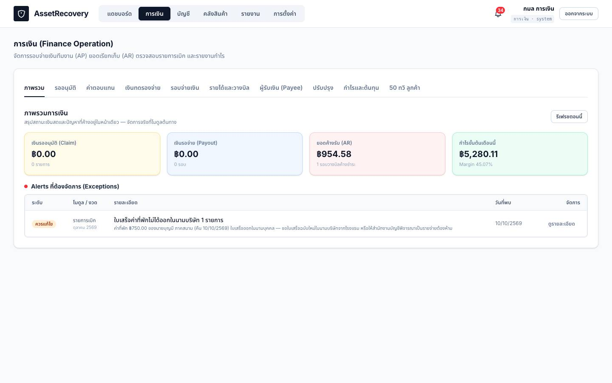

| ระดับ | ความหมาย |
|---|---|
| ข้อมูลทั่วไป | แจ้งให้ทราบ |
| ควรแก้ไข | ควรแก้ก่อนปิดงวด แต่ไม่บล็อก |
| ต้องแก้ก่อนปิดงวด | บล็อกการส่งชุดเอกสารให้สำนักงานบัญชี จนกว่าจะแก้หรือผู้บริหารอนุมัติยกเว้น |

**เคล็ดลับ:** ข้อยกเว้นผูกกับรอบบัญชีของเดือนนั้น ไม่ข้ามเดือน — ปัญหาที่ยังไม่แก้ในเดือนถัดไปต้องบันทึกใหม่

---

# ภาคผนวก

## ภาคผนวก 1 — สถานะที่จะเห็นและความหมาย

### สถานะรายการเบิก
| สถานะ | ความหมาย | ใครทำต่อ |
|---|---|---|
| **รอยืนยันคืนคลัง** | เคสปิดสำเร็จ แต่คลังยังไม่ยืนยันล็อต | ธุรการคลัง |
| **รออนุมัติจ่าย** (ขั้น 1) | รอผู้จัดการทีม | ผู้จัดการทีม |
| **รอการเงินอนุมัติ** (ขั้น 2/2) | ผ่านขั้น 1 แล้ว | **คุณ** |
| (รอบริหาร) | เกินเพดาน ผ่านการเงินแล้ว | บริหาร |
| **อนุมัติแล้ว ✓ ผ่านทุกขั้น** | พร้อมเข้ารอบจ่าย | **คุณ** (สร้างรอบจ่าย) |
| **ถูกตีกลับ — รอแก้ไข** | ส่งกลับให้แก้ เริ่มขั้น 1 ใหม่ | พนักงาน |
| **ไม่อนุมัติ** | ปฏิเสธถาวร | — |
| **ถูกแทนที่แล้ว** | พนักงานส่งปิดงานใหม่ ระบบสร้างรายการใหม่แทนรายการเดิม | — (ไม่จ่าย) |

### สถานะเงินทดรอง
| สถานะ | ความหมาย |
|---|---|
| **รออนุมัติ** | พนักงานส่งคำขอ รอคุณ |
| **อนุมัติแล้ว — รอเคลียร์ยอด** | อนุมัติแล้ว (ต้องจ่ายผ่านรอบจ่าย Inhouse ก่อนพนักงานจึงเคลียร์ได้) |
| **เลยกำหนดเคลียร์** | ระบบเปลี่ยนให้ทุกวันเมื่อเลยกำหนด — ต้องติดตาม |
| **เคลียร์ยอดแล้ว** | พนักงานเคลียร์แล้ว |
| **ไม่อนุมัติ** | ปฏิเสธคำขอ |

**สถานะยอดคืน:** ไม่มียอดคืน · **รอหักในรอบจ่ายถัดไป** · **รอรับคืนแยก** · **คืนครบแล้ว**

### สถานะรอบจ่าย
| สถานะ | ความหมาย | ปุ่มที่ใช้ |
|---|---|---|
| **รอตรวจสอบ** | สร้างรอบแล้ว รอคุณตรวจ | ดูรายการ · สร้างไฟล์โอน · ยกเลิกรอบจ่าย |
| **สร้างไฟล์โอนแล้ว** | มีไฟล์โอน รออัปโหลด/โอน | ดาวน์โหลดไฟล์โอน · สร้างไฟล์โอนซ้ำ · ✓ ยืนยันจ่ายแล้ว |
| **จ่ายสำเร็จ** | โอนแล้ว (ยืนยันมือ หรือระบบเปลี่ยนเองเมื่อบัญชีจับคู่ statement) — ออก 50 ทวิ แล้ว | ใบสำคัญจ่าย PDF |
| **ยกเลิกแล้ว** | ยกเลิกก่อนโอน รายการกลับไปรอจ่าย | — |

### สถานะรอบวางบิล
| สถานะ | ความหมาย |
|---|---|
| **ร่าง** | สร้างแล้ว ยังไม่ส่ง — ลบได้ · ยังไม่มี PDF |
| **ส่งบิลแล้ว** | ส่งให้ลูกค้าแล้ว มีใบแจ้งหนี้ PDF · ย้อนกลับไม่ได้ |
| **รับชำระบางส่วน** | ฝ่ายบัญชีจับคู่เงินเข้าแล้วบางส่วน ยังมียอดคงค้าง |
| **รับชำระครบ** | ยอดคงค้าง 0 (รวมภาษีที่ลูกค้าหัก) |

**สถานะรายได้:** **รอวางบิล** · **รวมเข้ารอบแล้ว**
**สถานะ 50 ทวิ ลูกค้า:** **รอ 50 ทวิ จากลูกค้า** · **ได้รับแล้ว**
**สถานะรายการปรับปรุง:** **รออนุมัติ (รอ: …)** · **อนุมัติแล้ว** · **ปฏิเสธ** · ป้ายเพิ่ม **รอใบลดหนี้**
**สถานะผู้รับเงิน:** **ยืนยันแล้ว** · **รอยืนยัน**

## ภาคผนวก 2 — สูตรที่ควรรู้ (ภาษาคน)

| เรื่อง | สูตร | ตัวอย่าง |
|---|---|---|
| ค่าน้ำมันตามระยะทาง | ระยะทาง (กม.) × อัตรา บาท/กม. | 34.46 × 5.00 = 172.30 |
| ค่าน้ำมันเหมา / เบี้ยเลี้ยงต่อเคส | ยอดเหมาต่อวัน ÷ จำนวนเคสที่เช็คอินวันนั้น | 150.00 ÷ 5 = 30.00 |
| ภาษีหัก ณ ที่จ่าย (ผู้รับเงิน) | ยอดรวมในฐานภาษีของคนนั้นในรอบจ่าย × อัตรา — ถ้าต่ำกว่า 1,000 บาท = 0 | 2,200.00 × 3% = 66.00 · 350.00 → 0 |
| ยอดโอนสุทธิ | ค่าตอบแทน − WHT − ยอดหักกลบเงินทดรอง | 1,000 − 30 = 970.00 |
| ยอดคืนเงินทดรอง | ยอดอนุมัติ − ยอดใช้จริง (ไม่ติดลบ — ใช้เกินระบบสร้างคำขอเบิกส่วนเกินให้) | 2,500 − 2,180 = 320.00 |
| VAT ค่าบริการ (แยก VAT) | ยอดก่อน VAT × อัตรา VAT ที่มีผล ณ วันรับรู้รายได้ | 3,813.53 × 7% = 266.96 |
| ค่าบริการแบบรวม VAT | ยอดก่อน VAT = ยอดรวม ÷ (1 + อัตรา VAT) | 3,000 ÷ 1.07 = 2,803.74 ต่อเคส |
| ภาษีที่ลูกค้าหัก | ยอดก่อน VAT × 3% (ประมาณการบนใบแจ้งหนี้) | 3,813.53 × 3% = 114.41 |
| ยอดคาดว่าจะได้รับ | ยอดรวมในบิล − ภาษีที่ลูกค้าหัก | 4,080.49 − 114.41 = 3,966.08 |
| กำไรขั้นต้น | รายได้ (ก่อน VAT) − ต้นทุนตรง | 11,715.01 − 6,434.90 = 5,280.11 |
| Gross Margin | กำไรขั้นต้น ÷ รายได้ × 100 — รายได้ 0 แสดง N/A | 5,280.11 ÷ 11,715.01 = 45.07% |
| อายุหนี้ (AR Aging) | นับวันจากวันครบกำหนดชำระถึงวันนี้ | ครบกำหนด 09/11/2569 |

> อัตรา VAT ไม่ได้ตายตัวที่ 7% — ระบบใช้อัตราตามวันที่มีผลที่ผู้ดูแลระบบตั้งไว้ และบันทึกอัตราที่ใช้ไว้ในรายได้แต่ละรายการ

## ภาคผนวก 3 — คำถามที่พบบ่อย (FAQ)

**ถาม: คลังยืนยันล็อตแล้ว อนุมัติรายการเบิกครบแล้ว ทำไมรายได้ยังไม่ขึ้น?**
ตอบ: ยังขาดเงื่อนไขข้อที่ 3 — ระบบต้องสรุปวันลงพื้นที่ของวันนั้นก่อน (ทุกคืนหลังเที่ยงคืน) และรายการค่าน้ำมันเหมา/เบี้ยเลี้ยงที่เกิดขึ้นต้องอนุมัติครบ รายได้จะเกิดเองหลังจากนั้น (บทที่ 7 และ 18)

**ถาม: WHT ในคิวอนุมัติเป็น 0 แต่ในรอบจ่ายถูกหัก (หรือกลับกัน)?**
ตอบ: ตัวเลขในคิวเป็นยอดคาดการณ์ต่อรายการ ยอดจริงคิดจากยอดรวมของคนนั้นในรอบจ่าย และหักเมื่อยอดในฐานถึง 1,000 บาท

**ถาม: ผู้รับเงินคนเดิม เดือนเดียวกัน ทำไมรอบที่สองไม่ถูกหักภาษี?**
ตอบ: ระบบคิดเกณฑ์ 1,000 บาท **ต่อรอบจ่าย** รอบที่ยอดต่ำกว่าเกณฑ์จึงไม่ถูกหัก ถ้าต้องการให้หักตามยอดรวม ให้รวมรายการไว้ในรอบเดียว หรือปรึกษาสำนักงานบัญชี

**ถาม: สร้างรอบจ่ายแล้วได้ 0 รายการ?**
ตอบ: ตรวจวันตัดรอบ — ค่าเริ่มต้นเป็นรอบที่ผ่านไปแล้ว ต้องเปลี่ยนเป็นรอบปัจจุบัน และตรวจว่ารายการอนุมัติครบทุกขั้น และผู้รับเงินยืนยันข้อมูลแล้ว

**ถาม: ไฟล์โอนมีหลายบรรทัดต่อคน ธนาคารจะโอนหลายครั้งไหม?**
ตอบ: ใช่ ไฟล์เป็น 1 บรรทัดต่อรายการเบิก — ตรวจรูปแบบและค่าธรรมเนียมกับธนาคารก่อนใช้จริง และแจ้งฝ่ายบัญชีว่า statement จะมีหลายรายการต่อคน

**ถาม: สร้างไฟล์โอนซ้ำแล้ว ไฟล์เก่ายังใช้ได้ไหม?**
ตอบ: ไฟล์เก่ายังอยู่ (ไม่ถูกทับ) แต่ให้อัปโหลดเข้าธนาคารเพียงเวอร์ชันเดียว — ตรวจด้วยชื่อไฟล์และ SHA-256

**ถาม: ยืนยันจ่ายผิดรอบ แก้ได้ไหม?**
ตอบ: ไม่ได้ การยืนยันจ่ายย้อนกลับไม่ได้ — แจ้งฝ่ายบัญชีและผู้บริหารทันที

**ถาม: ผู้รับเงินขอ 50 ทวิ การเงินเปิดได้ที่ไหน?**
ตอบ: การเงินไม่มีเมนูนี้ — ขอฝ่ายบัญชีดาวน์โหลดจาก **บัญชี › เอกสาร & WHT**

**ถาม: ผู้รับเงินนิติบุคคล ชื่อบน 50 ทวิ เป็นชื่อคน?**
ตอบ: ชื่อผู้รับเงินมาจากชื่อผู้ใช้ — ให้ผู้ดูแลระบบแก้ชื่อผู้ใช้เป็นชื่อบริษัท ก่อนรอบจ่ายที่จะออก 50 ทวิ

**ถาม: พนักงานถามว่าเงินทดรองอนุมัติหรือยัง/โอนหรือยัง?**
ตอบ: ระบบยังไม่แจ้งเตือนพนักงานในสองจังหวะนี้ — ให้แจ้งพนักงานเองหลังอนุมัติและหลังยืนยันจ่าย

**ถาม: อยากตรวจใบเสร็จที่พนักงานแนบตอนเคลียร์เงินทดรอง?**
ตอบ: หน้าการเงินไม่แสดงรูปนั้น และการเคลียร์มีผลทันที — ขอรูปจากพนักงานโดยตรง ส่วนรายการไม่มีใบเสร็จดูได้จากใบรับรองแทนใบเสร็จ

**ถาม: ปรับลดค่าน้ำมันที่จ่ายไปแล้ว ทำไมรอบจ่ายถัดไปไม่หักคืน?**
ตอบ: Adjustment มีผลในรายงานเท่านั้น ไม่หักเงินพนักงานอัตโนมัติ — ถ้าต้องเรียกคืน ให้ตกลงกับพนักงานและเก็บคืนนอกระบบ แล้วแจ้งฝ่ายบัญชี

**ถาม: ลดรายได้แล้วฝ่ายบัญชีบันทึกใบลดหนี้ไม่ได้?**
ตอบ: ใบลดหนี้ใช้ได้กับบิลที่ยังมียอดค้างเท่านั้น บิลที่ชำระครบแล้วต้องให้สำนักงานบัญชีจัดการคืนเงินหรือหักกลบนอกระบบ — ตรวจยอดคงค้างก่อนสร้าง Adjustment ทุกครั้ง

**ถาม: บันทึกรับเงินจากบริษัทไฟแนนซ์ที่ไหน?**
ตอบ: การเงินไม่ต้องบันทึก — ฝ่ายบัญชีนำเข้า statement และจับคู่ สถานะรอบวางบิลเปลี่ยนเอง

**ถาม: รายงานตัวเลขไม่ตรงกับแท็บกำไรและต้นทุน?**
ตอบ: กด **รีเฟรชตอนนี้** ที่รายงาน — รายงานรายวันใช้ข้อมูลที่เก็บไว้

## ภาคผนวก 4 — ปฏิทินงานการเงินรายเดือน

| ช่วงเวลา | งาน | บท |
|---|---|---|
| **ทุกวัน (เช้า)** | ดูแดชบอร์ด · อนุมัติขั้น 2 (รวมค่าน้ำมันเหมา/เบี้ยเลี้ยงของเมื่อวาน) · พิจารณาเงินทดรอง · ดู Alerts | 1–8, 26 |
| **ทุกวัน** | บันทึกรับคืนเงินทดรองเมื่อพนักงานคืนเงิน · ติดตามเงินทดรองเลยกำหนด | 10 |
| **ก่อนวันที่ 15** | ตรวจผู้รับเงินที่ "รอยืนยัน" · เร่งอนุมัติรายการค้าง | 24, 5 |
| **วันที่ 15 (ตัดรอบ)** | สร้างรอบจ่าย Inhouse + Outsource ตัดรอบ 15 · ตรวจรายการ · สร้างไฟล์โอน (ถ้าบริษัทจ่ายกลางเดือน) | 12–14 |
| **ทุกสัปดาห์** | ดู AR Aging · ตามบริษัทที่ใกล้/เลยกำหนด · บันทึก 50 ทวิ ลูกค้าที่ได้รับ | 21–22 |
| **สิ้นเดือน (ตัดรอบ)** | สร้างรอบจ่ายตัดรอบสิ้นเดือน → ไฟล์โอน → โอน → **ยืนยันจ่ายสำเร็จภายในเดือน** (ให้ 50 ทวิ ออกในเดือนที่จ่าย) | 12–16 |
| **สิ้นเดือน** | สร้างรอบวางบิลตามรอบบิลของแต่ละบริษัท → ส่งบิล + ใบแจ้งหนี้ PDF | 19–20 |
| **สิ้นเดือน** | สร้าง/อนุมัติ Adjustment ของเดือนนี้ **ก่อนฝ่ายบัญชีส่งงวด** (หลังส่งแล้วต้องให้บริหารร่วมอนุมัติ) · รีเฟรชและตรวจกำไรขั้นต้น | 23, 25 |
| **ต้นเดือนถัดไป (วันที่ 1–7)** | ส่งข้อมูลให้ฝ่ายบัญชีปิดงวด · ตอบคำถามจากบัญชี · ฝ่ายบัญชียื่น ภ.ง.ด.3/53 (แบบกระดาษภายในวันที่ 7 · ยื่นออนไลน์ภายในวันที่ 15) | [เล่ม 6](06-accounting-exec.md) |

> ค่าน้ำมันเหมาจ่าย/เบี้ยเลี้ยงของวันสุดท้ายของเดือน ระบบสรุปให้หลังเที่ยงคืน — รอให้รายการนี้อนุมัติครบก่อนสร้างรอบจ่ายและรอบวางบิลสุดท้ายของเดือน

## ภาคผนวก 5 — คำศัพท์

| คำ | ความหมาย |
|---|---|
| รายการเบิก (Claim) | ค่าตอบแทน/ค่าใช้จ่ายของพนักงานภาคสนาม ที่ต้องอนุมัติก่อนจ่าย |
| Gross / WHT / Net | ยอดก่อนหักภาษี / ภาษีหัก ณ ที่จ่าย / ยอดจ่ายจริง |
| Tax Profile | ชุดอัตราภาษีหัก ณ ที่จ่ายของผู้รับเงิน (เช่น บุคคลธรรมดา 3% ภ.ง.ด.3) |
| เงินทดรอง (Advance) | เงินที่พนักงานยืมไปใช้ก่อน แล้วเคลียร์ด้วยใบเสร็จ |
| ใบรับรองแทนใบเสร็จ (CRT) | เอกสารที่พนักงานเซ็นรับรองสำหรับรายจ่ายที่เรียกใบเสร็จไม่ได้ |
| รอบจ่าย (Payout Batch) | ชุดรายการที่จ่ายพร้อมกันในวันตัดรอบเดียวกัน 1 ฝั่ง |
| Inhouse / Outsource | ทีมในของบริษัท / ทีมนอก (ผู้รับเหมา) |
| ไฟล์โอน (Bank File) | ไฟล์ที่ดาวน์โหลดไปอัปโหลดเข้าระบบธนาคารเพื่อโอนหลายรายการ |
| Idempotency Key · SHA-256 | รหัสกันโอนซ้ำของรอบ · ลายนิ้วมือของไฟล์ ใช้ตรวจว่าเป็นไฟล์เดียวกัน |
| 50 ทวิ | หนังสือรับรองการหักภาษี ณ ที่จ่าย |
| รอบวางบิล (Billing Batch) | ชุดรายได้ของบริษัทไฟแนนซ์ 1 ราย ที่เรียกเก็บพร้อมกัน — เลข BL-ปี พ.ศ.-ลำดับ |
| ใบแจ้งหนี้ / ใบวางบิล | เอกสารเรียกเก็บเงิน (ไม่ใช่ใบกำกับภาษี) |
| AR / AR Aging | ยอดค้างรับจากลูกค้า / ยอดค้างรับแยกตามอายุหนี้ |
| รายการปรับปรุง (Adjustment) | รายการแก้ยอดที่ไม่แก้ต้นทาง — ต้องมีเหตุผลและผู้อนุมัติ |
| ใบลดหนี้ | เอกสารลดมูลค่าหลังออกใบกำกับภาษี (สำนักงานบัญชีออก ฝ่ายบัญชีบันทึก) |
| สรุปวันลงพื้นที่ | งานที่ระบบทำทุกคืน สร้างค่าน้ำมันเหมาจ่าย/เบี้ยเลี้ยงของวันที่ผ่านมา |
| รอบบัญชี: กำลังรวบรวม / ส่งสำนักงานบัญชีแล้ว / ปิดรอบแล้ว | สถานะของเดือนบัญชี — กำหนดว่าใครอนุมัติรายการปรับปรุงได้ |
