# เล่ม 6 — บัญชีและผู้บริหาร

> คู่มือผู้ใช้ AssetRecovery สำหรับ **ฝ่ายบัญชี** (ภาค ก) และ **ผู้บริหาร** (ภาค ข)
> ข้อมูลและภาพในเล่มนี้มาจากการทดลองใช้งานจริงบนระบบทดสอบ เมื่อ 10/10/2569 — ชื่อคน บริษัท เลขบัญชี เลขเอกสาร และยอดเงินในภาพเป็นข้อมูลตัวอย่าง
> ภาพที่มีคำว่า **"ภาพจากระบบทดสอบ"** ใต้ภาพ ถ่ายจากเครื่องทดสอบภายใน เพราะงวดที่ทดลองยังไม่สิ้นเดือน (ปิดงวด ล็อก ปลดล็อก ทำได้หลังสิ้นเดือนเท่านั้น)

---

## เล่มนี้สำหรับใคร

| บทบาท | งานหลักในเล่มนี้ |
|---|---|
| **บัญชี** | กระทบยอดธนาคาร · ออกใบเสร็จรับเงิน/ใบกำกับภาษี · ยกเลิกแล้วออกใบแทน · บันทึกใบลดหนี้/เพิ่มหนี้ · 50 ทวิ (ที่บริษัทออก และที่ลูกค้าส่งมา) · สรุป ภ.ง.ด.3/53 · ข้อยกเว้น · ข้อซักถามจากสำนักงานบัญชี · ระบุศูนย์ต้นทุน · สร้างชุดเอกสารบัญชี (Accounting Pack) · ตรวจความพร้อมและปิดงวด · รายงานหมวดบัญชี A1–A4 |
| **บริหาร** | แดชบอร์ดภาพรวมธุรกิจ · รายงานครบ 17 ตัว · อนุมัติรายการเบิกยอดสูง · อนุมัติรายการปรับปรุง (Adjustment) · อนุมัติยกเว้นข้อยกเว้น · ล็อก/ปลดล็อกงวด · อนุมัติปรับปรุงงวดที่ล็อกแล้ว |
| การเงิน | สร้างรายการปรับปรุง (บัญชีสร้างเองไม่ได้) · ดูหน้ากระทบยอดได้อย่างเดียว — รายละเอียดอยู่ในเล่ม 5 |

### หลักสำคัญที่ต้องรู้ก่อน

> **ระบบนี้ "เตรียมข้อมูล" ให้สำนักงานบัญชีเท่านั้น** — การลงบัญชีแยกประเภท การออกเอกสารภาษีฉบับสุดท้ายบางชนิด (เช่น ใบลดหนี้) และการยื่นแบบภาษีจริง ทำโดยสำนักงานบัญชีนอกระบบ ปุ่ม "Mark ว่ายื่นแล้ว" / "Mark ว่าส่งแล้ว" ในระบบคือ **การบันทึกสถานะ** ไม่ใช่การยื่นหรือส่งจริง

- เงินทุกยอดแสดงเป็น **บาท** ทศนิยม 2 ตำแหน่ง · วันที่แสดงเป็น **พ.ศ.** รูปแบบ `วว/ดด/ปปปป` (ยกเว้นช่องเลือกวันที่ของเบราว์เซอร์บางช่องที่แสดง ค.ศ.)
- เอกสารที่ออกแล้ว **แก้ไม่ได้** — ผิดต้อง **ยกเลิกพร้อมเหตุผล แล้วออกใบแทน** (เลขใหม่) · ใบที่ยกเลิกยังอยู่ในทะเบียนเสมอ ห้ามลบ
- งวดที่ **ล็อกแล้ว** แก้ข้อมูลต้นทางโดยตรงไม่ได้ทุกกรณี — ต้องทำ **รายการปรับปรุง** ให้ผู้บริหารอนุมัติ
- ทุกการกระทำที่กระทบเงิน/ภาษี/งวด ต้องกรอก **เหตุผล** และระบบเก็บประวัติไว้ตลอด (ไม่มีใครลบได้)

### เข้าระบบอย่างไร

1. เปิดเบราว์เซอร์บนคอมพิวเตอร์ไปที่ `https://<โดเมนระบบ>/login`
2. กรอกอีเมลหรือชื่อผู้ใช้ และรหัสผ่านที่ได้รับ → กด **เข้าสู่ระบบ**
3. ระบบเปิด **แดชบอร์ด**
   - ฝ่ายบัญชีเห็นเมนู **แดชบอร์ด · บัญชี · คลังสินค้า · รายงาน · การตั้งค่า**
   - ผู้บริหารเห็นเมนู **แดชบอร์ด · จัดการเคส · การเงิน · บัญชี · คลังสินค้า · รายงาน · การตั้งค่า**

> แนะนำให้ใช้ **คอมพิวเตอร์จอกว้าง** — ตารางบัญชีและรายงานมีหลายคอลัมน์

### ผังงาน (Flowchart)

- งานบัญชีประจำวัน → ประจำเดือน → [ผังงานกลุ่ม 6.1](../diagrams/03-role-flowcharts.md#61-บัญชี-ประจำวัน--ประจำเดือน)
- งานผู้บริหาร → [ผังงานกลุ่ม 6.2](../diagrams/03-role-flowcharts.md#62-บริหาร)
- ปิดงวดและปรับปรุงหลังปิดงวด → [ผังย่อย 2.6](../diagrams/01-workflow.md#26-บัญชี--ปิดงวด--ปรับปรุงหลังปิดงวด) · สถานะงวด → [ผังสถานะ 3.7](../diagrams/01-workflow.md#37-สถานะรอบบัญชี-งวด)
- ที่มาของรายได้/บิล/รอบจ่าย (ฝ่ายการเงิน) → [ผังงานกลุ่ม 5](../diagrams/03-role-flowcharts.md#5-การเงิน)

---

## สารบัญ

**ภาค ก — ฝ่ายบัญชี**

0. [รอบงานของฝ่ายบัญชี และปฏิทินปิดงวด](#0-รอบงานของฝ่ายบัญชี-และปฏิทินปิดงวด)

*เริ่มต้น*
1. [แดชบอร์ดและแท็บของเมนูบัญชี](#1-แดชบอร์ดและแท็บของเมนูบัญชี)
2. [ดูตัวอย่างเอกสารทั้งหมด](#2-ดูตัวอย่างเอกสารทั้งหมด)
3. [ยืนยันค่าตั้งที่รอนักบัญชียืนยัน](#3-ยืนยันค่าตั้งที่รอนักบัญชียืนยัน)

*งานประจำวัน — เงินเข้า/เงินออก*
4. [กระทบยอดธนาคาร — นำเข้า statement](#4-กระทบยอดธนาคาร--นำเข้า-statement)
5. [จับคู่อัตโนมัติ และยืนยันคู่ที่ระบบเสนอ](#5-จับคู่อัตโนมัติ-และยืนยันคู่ที่ระบบเสนอ)
6. [จับคู่ด้วยมือ (จับคู่ Manual)](#6-จับคู่ด้วยมือ-จับคู่-manual)
7. [ปิดรายการที่ไม่ต้องจับคู่ (ค่าธรรมเนียม เงินโอนคืน ฯลฯ)](#7-ปิดรายการที่ไม่ต้องจับคู่-ค่าธรรมเนียม-เงินโอนคืน-ฯลฯ)
8. [เงินรับรอตรวจสอบ และคืนเงินผู้โอน](#8-เงินรับรอตรวจสอบ-และคืนเงินผู้โอน)
9. [บันทึกหนังสือ 50 ทวิ ที่ลูกค้าส่งมา](#9-บันทึกหนังสือ-50-ทวิ-ที่ลูกค้าส่งมา)
10. [ออกใบเสร็จรับเงิน/ใบกำกับภาษี (รวมรับชำระบางส่วน)](#10-ออกใบเสร็จรับเงินใบกำกับภาษี-รวมรับชำระบางส่วน)
11. [ยกเลิกใบกำกับภาษีแล้วออกใบแทน](#11-ยกเลิกใบกำกับภาษีแล้วออกใบแทน)
12. [บันทึกใบลดหนี้ / ใบเพิ่มหนี้](#12-บันทึกใบลดหนี้--ใบเพิ่มหนี้)

*งานประจำเดือน*
13. [หนังสือรับรอง 50 ทวิ ที่บริษัทออก — ดาวน์โหลด · ยกเลิกออกใหม่](#13-หนังสือรับรอง-50-ทวิ-ที่บริษัทออก--ดาวน์โหลด--ยกเลิกออกใหม่)
14. [สรุป ภ.ง.ด.3 / ภ.ง.ด.53 และ Mark ว่ายื่นแล้ว](#14-สรุป-ภงด3--ภงด53-และ-mark-ว่ายื่นแล้ว)
15. [ข้อยกเว้น (เอกสารไม่ครบ)](#15-ข้อยกเว้น-เอกสารไม่ครบ)
16. [ข้อซักถามจากสำนักงานบัญชี](#16-ข้อซักถามจากสำนักงานบัญชี)
17. [ระบุศูนย์ต้นทุน (Map Cost Center)](#17-ระบุศูนย์ต้นทุน-map-cost-center)
18. [ชุดเอกสารบัญชี (Accounting Pack)](#18-ชุดเอกสารบัญชี-accounting-pack)
19. [ปิดงวด — ตรวจความพร้อม · ส่งสำนักงานบัญชี · ล็อกงวด](#19-ปิดงวด--ตรวจความพร้อม--ส่งสำนักงานบัญชี--ล็อกงวด)
20. [รายงานหมวดบัญชี A1–A4](#20-รายงานหมวดบัญชี-a1a4)

**ภาค ข — ผู้บริหาร**

21. [แดชบอร์ดผู้บริหาร](#21-แดชบอร์ดผู้บริหาร)
22. [รายงาน 17 ตัว และการส่งออก](#22-รายงาน-17-ตัว-และการส่งออก)
23. [คิวอนุมัติรายการเบิกยอดสูง](#23-คิวอนุมัติรายการเบิกยอดสูง)
24. [อนุมัติรายการปรับปรุง (Adjustment) ของงวดที่ยังไม่ล็อก](#24-อนุมัติรายการปรับปรุง-adjustment-ของงวดที่ยังไม่ล็อก)
25. [อนุมัติยกเว้นข้อยกเว้น](#25-อนุมัติยกเว้นข้อยกเว้น)
26. [ล็อกงวด และปลดล็อกงวด](#26-ล็อกงวด-และปลดล็อกงวด)
27. [อนุมัติรายการปรับปรุงของงวดที่ล็อกแล้ว](#27-อนุมัติรายการปรับปรุงของงวดที่ล็อกแล้ว)
28. [ดูสิทธิ์ของบทบาทผู้บริหาร](#28-ดูสิทธิ์ของบทบาทผู้บริหาร)

**ภาคผนวก**
- [ภาคผนวก 1 — คำศัพท์](#ภาคผนวก-1--คำศัพท์)
- [ภาคผนวก 2 — สถานะงวดและสถานะเอกสาร](#ภาคผนวก-2--สถานะงวดและสถานะเอกสาร)
- [ภาคผนวก 3 — ตารางรายงาน 17 ตัว](#ภาคผนวก-3--ตารางรายงาน-17-ตัว)
- [ภาคผนวก 4 — ไฟล์ใน Accounting Pack](#ภาคผนวก-4--ไฟล์ใน-accounting-pack)
- [ภาคผนวก 5 — เช็กลิสต์ก่อนปิดงวด](#ภาคผนวก-5--เช็กลิสต์ก่อนปิดงวด)
- [ภาคผนวก 6 — คำถามที่พบบ่อย (FAQ)](#ภาคผนวก-6--คำถามที่พบบ่อย-faq)

---

# ภาค ก — ฝ่ายบัญชี

## 0. รอบงานของฝ่ายบัญชี และปฏิทินปิดงวด

### งานประจำวัน (ทุกวันที่มีเงินเข้า/ออก)

| ลำดับ | งาน | บท |
|---|---|---|
| 1 | ดาวน์โหลด statement จากธนาคาร → **นำเข้า** | 4 |
| 2 | ยืนยัน **คู่ที่ระบบเสนอ** → **จับคู่ Manual** รายการที่เหลือ | 5–6 |
| 3 | รายการที่ไม่ใช่รายรับ-จ่ายของระบบ → **ปิดรายการ** · เงินเข้าไม่ทราบที่มา → **เงินรับรอตรวจสอบ** | 7–8 |
| 4 | เงินรับที่เกิดจากการจับคู่ → **ออกใบเสร็จรับเงิน/ใบกำกับภาษี** | 10 |
| 5 | ลูกค้าหักภาษี ณ ที่จ่าย → ติดตามและ **บันทึกหนังสือ 50 ทวิ ของลูกค้า** | 9 |
| 6 | คำถามจากสำนักงานบัญชี → **บันทึกและตอบ** | 16 |

### งานประจำเดือน (ลำดับที่ทดลองทำจริง)

```
กระทบยอดครบ (ยังไม่จับคู่ = 0) → 50 ทวิ ลูกค้าครบ → ออกใบกำกับครบทุกเงินรับ
→ (ใบลด/เพิ่มหนี้ ถ้ามี) → จัดการข้อยกเว้น (แก้ หรือขอผู้บริหารอนุมัติยกเว้น)
→ Map Cost Center ครบ → ยืนยันค่าตั้งที่รอนักบัญชี
→ [หลังสิ้นเดือน] ตรวจความพร้อม → สร้าง Accounting Pack ฉบับจริง → Mark ว่าส่งแล้ว
→ ส่งสำนักงานบัญชี (เปลี่ยนสถานะงวด) → ตอบข้อซักถาม → Mark ว่าตอบรับ
→ สำนักงานบัญชียื่น ภ.ง.ด. จริง → Mark ว่ายื่นแล้ว → ล็อกงวด
```

### ปฏิทินปิดงวด (ตัวอย่างงวด ตุลาคม 2569)

| ช่วงเวลา | งาน | ใครทำ |
|---|---|---|
| ตลอดเดือน ต.ค. | งานประจำวัน · สร้างชุดเอกสาร **ฉบับร่าง** ส่งให้สำนักงานบัญชีตรวจรูปแบบได้ (ไม่ทับฉบับจริง) | บัญชี |
| วันที่ 15 และสิ้นเดือน | ฝ่ายการเงินตัดรอบจ่ายค่าตอบแทน (ตามค่าตั้งเริ่มต้น) — ใบ 50 ทวิ เกิดเมื่อรอบจ่าย "จ่ายสำเร็จ" | การเงิน |
| 31/10/2569 | นำเข้า statement วันสุดท้าย · จับคู่รอบจ่ายสิ้นเดือน | บัญชี |
| **ตั้งแต่ 01/11/2569 00:00 น.** | ระบบเปิดให้ **ส่งสำนักงานบัญชี / ล็อกงวด** ได้ · ตรวจความพร้อม 5 ข้อ · สร้าง Pack ฉบับจริง · Mark ว่าส่งแล้ว · กด **ส่งสำนักงานบัญชี** | บัญชี |
| 01–06/11/2569 | สำนักงานบัญชีตรวจ · ตอบข้อซักถาม · Mark ว่าตอบรับ | บัญชี + สำนักงานบัญชี |
| ก่อนวันที่ 7 (ยื่นแบบกระดาษ) หรือวันที่ 15 (ยื่นทางอินเทอร์เน็ต) ของเดือนถัดไป — ถ้าตรงวันหยุดเลื่อนเป็นวันทำการถัดไป | สำนักงานบัญชียื่น ภ.ง.ด.3/53 จริง → บัญชี **Mark ว่ายื่นแล้ว** | สำนักงานบัญชี + บัญชี |
| หลังสำนักงานบัญชีตอบรับครบ | **ล็อกงวด** (บัญชีหรือผู้บริหาร) | บัญชี / บริหาร |
| หลังล็อก (ถ้าพบยอดต้องแก้) | การเงินสร้างรายการปรับปรุง → **ผู้บริหารอนุมัติ** · ถ้าจำเป็นจริง ผู้บริหาร **ปลดล็อก** | การเงิน + บริหาร |

> **ระบบไม่ให้ส่ง/ล็อกงวดก่อนสิ้นเดือน** — ปุ่ม **ส่งสำนักงานบัญชี** จะเป็นสีจางพร้อมข้อความ "ส่ง/ล็อกได้ตั้งแต่ 01/11/2569" (ไม่มีทางลัด)

---

## 1. แดชบอร์ดและแท็บของเมนูบัญชี

**เป้าหมาย:** รู้ว่ามีงานอะไรรออยู่ และรู้จักแท็บทั้งหมดของเมนูบัญชี

**ขั้นตอน**
1. เข้าสู่ระบบ ระบบเปิด **แดชบอร์ด** — ดูการ์ดภาพรวมการเงิน (เงินรออนุมัติ · เงินรอจ่าย · ยอดค้างรับ · กำไรขั้นต้นเดือนนี้) และกล่อง **งานรอดำเนินการของฉัน**
2. กดเมนู **บัญชี** — ระบบเปิดแท็บ **รอบส่งบัญชี** เป็นค่าเริ่มต้น
3. แถบด้านบนมีลิงก์ **งานบัญชี · ตัวอย่างเอกสารทั้งหมด · ค่าตั้งรอนักบัญชียืนยัน**

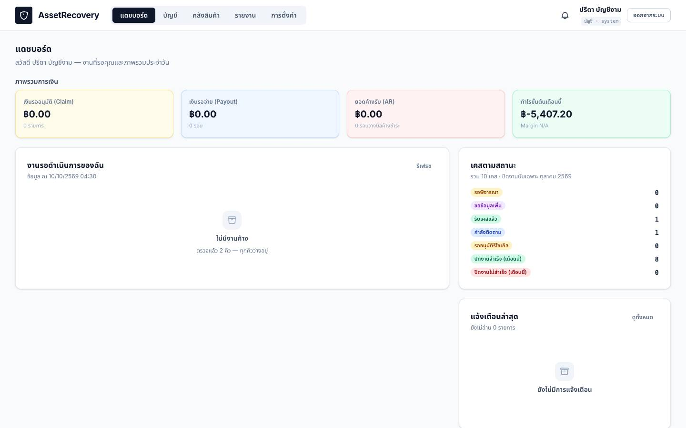

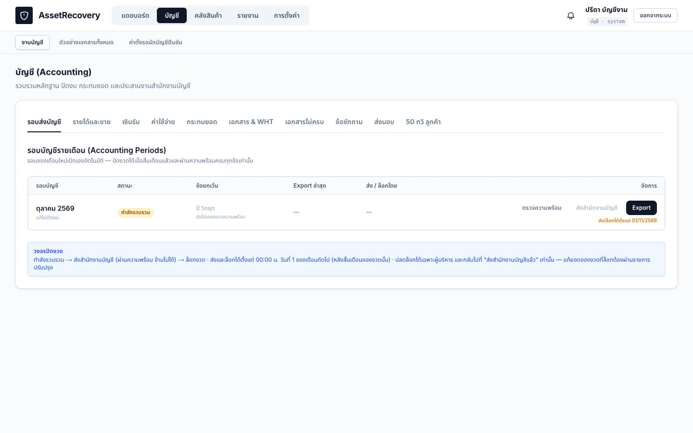

**แท็บในเมนูบัญชี**

| แท็บ | ใช้ทำอะไร | บท |
|---|---|---|
| รอบส่งบัญชี | ดูสถานะงวด · ตรวจความพร้อม · ส่งสำนักงานบัญชี · ล็อกงวด · Export | 19 |
| รายได้และขาย | รายการขายที่เกิดจากรอบวางบิล · ยกเลิกใบกำกับ · บันทึกใบลด/เพิ่มหนี้ | 11–12 |
| เงินรับ | เงินรับที่เกิดจากการจับคู่ · ออกใบเสร็จรับเงิน/ใบกำกับภาษี · ออกใบแทน | 10–11 |
| ค่าใช้จ่าย | รายการจ่ายจากรอบจ่ายที่ "จ่ายสำเร็จ" แล้ว · Map Cost Center | 17 |
| กระทบยอด | นำเข้า statement · จับคู่ · ปิดรายการ · เงินรับรอตรวจสอบ · คืนเงินผู้โอน | 4–8 |
| เอกสาร & WHT | ทะเบียน 50 ทวิ ที่บริษัทออก · สรุปรอบนำส่ง ภ.ง.ด. · Mark ว่ายื่นแล้ว | 13–14 |
| เอกสารไม่ครบ | ข้อยกเว้นของงวด | 15 |
| ข้อซักถาม | คำถามจากสำนักงานบัญชีและคำตอบ | 16 |
| ส่งมอบ | สร้าง/ดาวน์โหลดชุดเอกสารบัญชี · Mark ส่ง/ตอบรับ | 18 |
| 50 ทวิ ลูกค้า | หนังสือรับรองที่บริษัทไฟแนนซ์หักภาษีเรา | 9 |

**เคล็ดลับ:** ทุกแท็บมีกล่อง **หลักการ** อธิบายที่มาของข้อมูล — อ่านครั้งแรกเพื่อเข้าใจว่าตัวเลขมาจากไหน · แท็บ **ค่าใช้จ่าย** แสดงเฉพาะรอบจ่ายที่ฝ่ายการเงินยืนยัน "จ่ายสำเร็จ" แล้วเท่านั้น

## 2. ดูตัวอย่างเอกสารทั้งหมด

**เป้าหมาย:** ดูหน้าตาเอกสารทุกชนิดที่ระบบออก ก่อนใช้จริงหรือก่อนส่งให้สำนักงานบัญชีตรวจรูปแบบ

**ขั้นตอน**
1. กดลิงก์ **ตัวอย่างเอกสารทั้งหมด** ด้านบนหน้าบัญชี
2. เลือกเอกสาร → **ดูตัวอย่าง** หรือ **ดาวน์โหลด PDF**

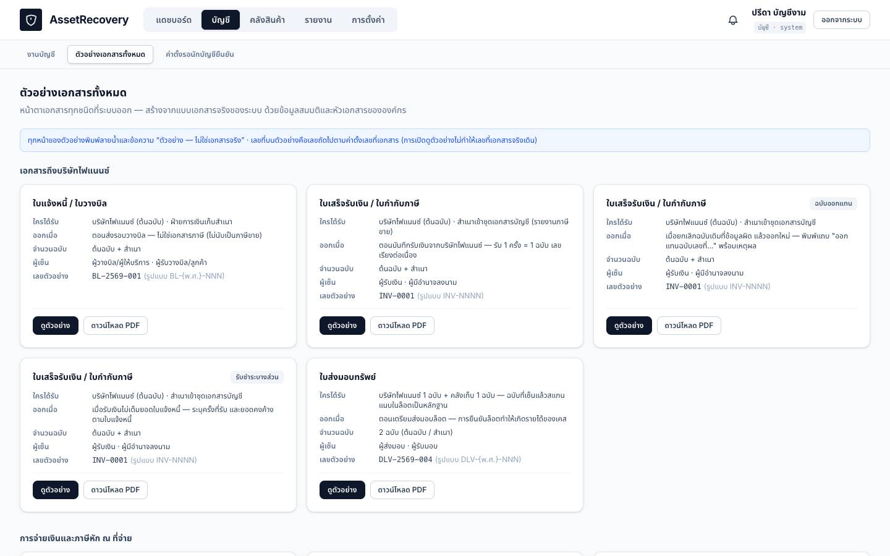

**ผลที่ควรเห็น:** การ์ดของเอกสารแต่ละชนิด บอก ใครได้รับ · ออกเมื่อไร · จำนวนฉบับ · ผู้เซ็น · ตัวอย่างเลขที่ (เช่น BL-2569-001 · INV-0001)

**เคล็ดลับ:** ตัวอย่างมีลายน้ำ "ตัวอย่าง — ไม่ใช่เอกสารจริง" และการเปิดดู **ไม่ทำให้เลขที่เอกสารจริงเดิน**

## 3. ยืนยันค่าตั้งที่รอนักบัญชียืนยัน

**เป้าหมาย:** ยืนยันค่าตั้งด้านภาษี/การเงินที่ระบบใช้ค่าแนะนำไปก่อน หลังสำนักงานบัญชีตอบแล้ว

**ก่อนเริ่ม:** ได้คำตอบจากสำนักงานบัญชีเป็นลายลักษณ์อักษร (เช่น อีเมล) ว่าค่าที่ใช้อยู่ถูกต้อง — ดูรายการค่าตั้งเริ่มต้นและเหตุผลได้ที่ [ค่าตั้งเริ่มต้นตามมาตรฐานการเงิน/ภาษีไทย](../settings-preset.md)

**ขั้นตอน**
1. กดลิงก์ **ค่าตั้งรอนักบัญชียืนยัน**
2. อ่านคอลัมน์ **ค่าที่ใช้อยู่** ของรายการที่สำนักงานบัญชียืนยันแล้ว
3. กด **ยืนยันแล้ว** ท้ายแถว → กรอก **เหตุผล** (บังคับ) → กด **ยืนยันแล้ว** ในหน้าต่าง
4. ทำซ้ำทีละรายการ · ใช้ตัวกรอง **ยืนยันแล้ว / รอยืนยัน** ดูแต่ละกลุ่ม

| ช่อง | ตัวอย่าง | หมายเหตุ |
|---|---|---|
| เหตุผล | สำนักงานบัญชียืนยันทางอีเมล 10/10/2569 — ฐานหัก ณ ที่จ่ายตามแนวกรมสรรพากร ไม่รวมค่าที่พักตามใบเสร็จ | บังคับ |

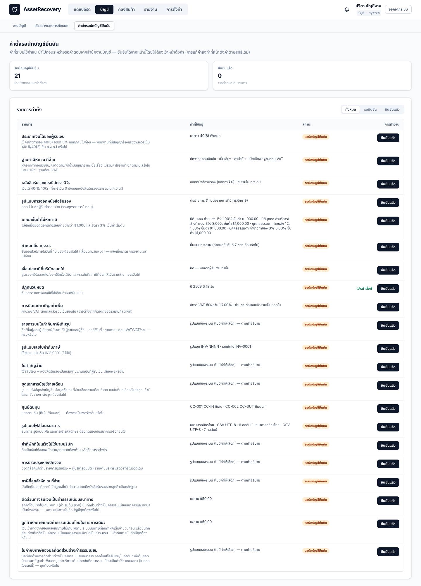

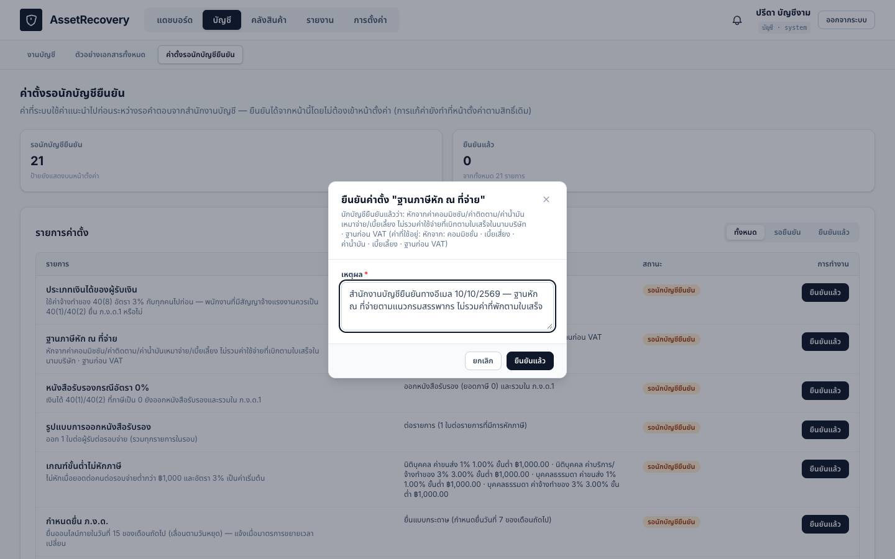

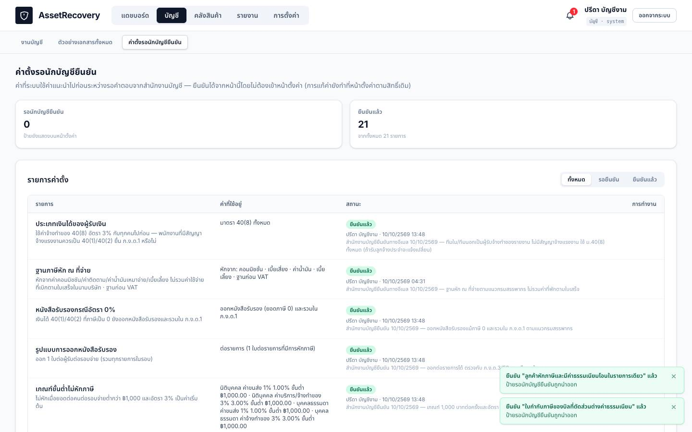

**ผลที่ควรเห็น:** ข้อความ "ยืนยัน "…" แล้ว — ป้ายรอนักบัญชียืนยันถูกนำออก" · แถวแสดง **ยืนยันแล้ว** + ชื่อผู้ยืนยัน/เวลา/เหตุผล · ตัวนับรอยืนยันลดลง (ตัวอย่างจากการทดลอง: ยืนยันครบ 21 จาก 21 รายการ)

**ข้อควรระวัง**
- หน้านี้ **ยืนยันได้อย่างเดียว ไม่เปลี่ยนค่า** — ถ้าสำนักงานบัญชีให้เปลี่ยนค่า ต้องให้ผู้มีสิทธิ์แก้ที่หน้าตั้งค่าก่อน (บางแถวมีปุ่ม **ไปหน้าตั้งค่า**) แล้วจึงกลับมายืนยัน
- รายการที่สำนักงานบัญชียังไม่ตอบ ให้เว้นไว้ อย่ายืนยันแทน
- คำอธิบายของบางรายการ (เช่น กำหนดยื่น ภ.ง.ด.) อาจเขียนเป็นแนวทางทั่วไป — ให้ยึดคอลัมน์ **ค่าที่ใช้อยู่** เป็นหลัก

---

*งานประจำวัน — เงินเข้า/เงินออก*

## 4. กระทบยอดธนาคาร — นำเข้า statement

**เป้าหมาย:** นำรายการเดินบัญชีจากธนาคารเข้าระบบ เพื่อยืนยันว่าเงินที่ระบบบอกว่าควรรับ/จ่าย ตรงกับที่ธนาคารบันทึกจริง

**ก่อนเริ่ม:** ดาวน์โหลด statement จากระบบธนาคารเป็น **CSV หรือ XLSX** ตามรูปแบบที่ผู้ดูแลระบบตั้งไว้ให้บัญชีธนาคารนั้น

**ขั้นตอน**
1. **บัญชี** → แท็บ **กระทบยอด** → กด **Import Statement**
2. เลือก **บัญชีธนาคาร** — ข้อความในหน้าต่างเปลี่ยนเป็นรูปแบบ statement ของบัญชีนั้น
3. (ไม่บังคับ) กด **ดูคำอธิบายคอลัมน์** / **ดาวน์โหลดไฟล์ตัวอย่าง (.xlsx)** หรือ **CSV** เพื่อเทียบรูปแบบ
4. คลิกกรอบอัปโหลด เลือกไฟล์ statement
5. กด **อัปโหลดและประมวลผล**

| ช่อง | ตัวอย่าง | หมายเหตุ |
|---|---|---|
| บัญชีธนาคาร | ธนาคารกสิกรไทย (xxxxxx7890) | บังคับ |
| ไฟล์ | statement 6 คอลัมน์: วันที่ · รายละเอียด · เงินเข้า · เงินออก · เลขที่อ้างอิง · ยอดคงเหลือ | วันที่กรอก พ.ศ. ได้ · เงินออกใส่ในช่องเงินออกเป็นเลขบวก |

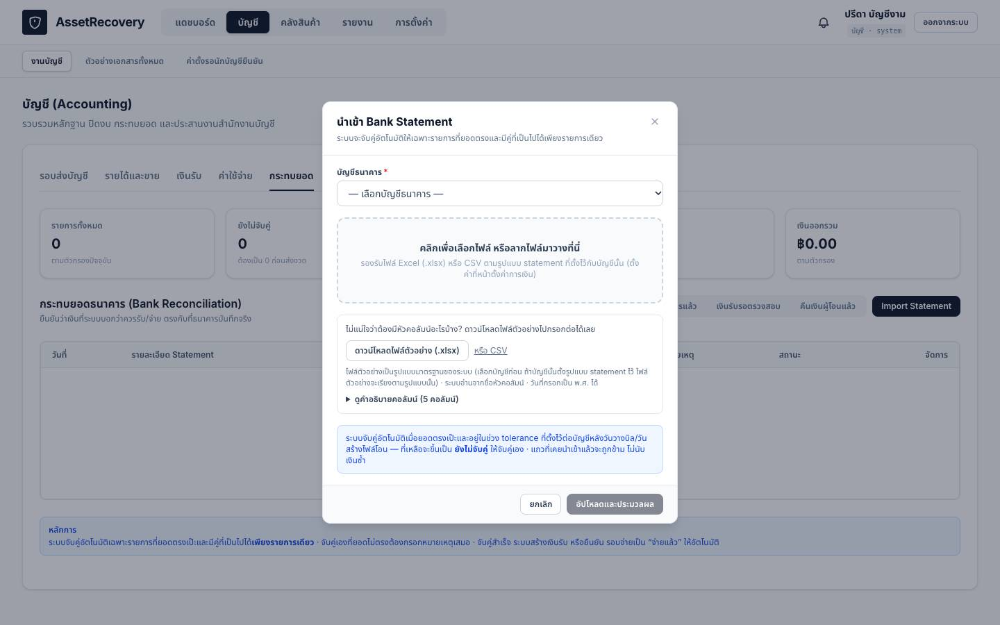

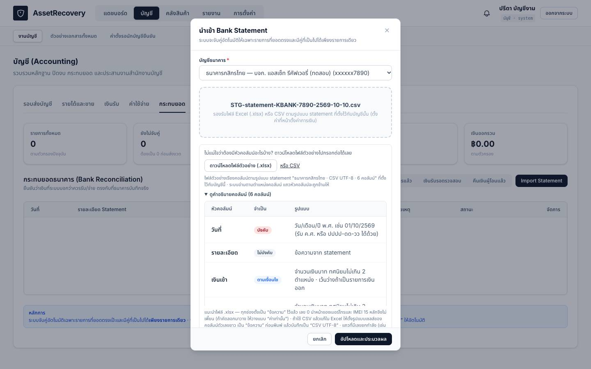

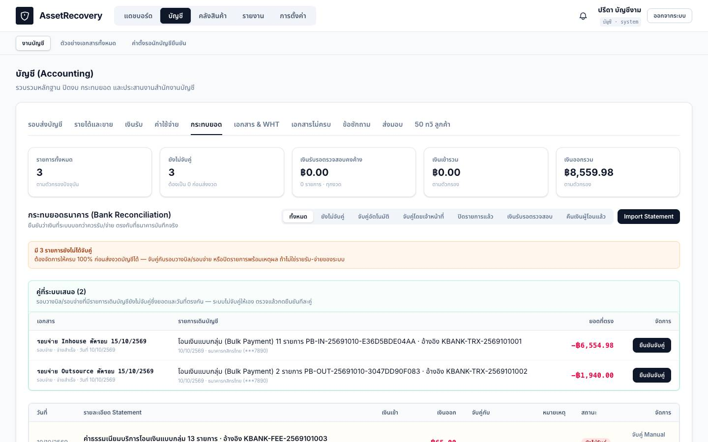

**ผลที่ควรเห็น:** ข้อความ "นำเข้า statement แล้ว — บันทึกใหม่ … รายการ · จับคู่อัตโนมัติ … · ซ้ำ … · อ่านไม่ออก …" · ถ้ายังมีรายการค้าง จะมีแถบเตือน "มี … รายการยังไม่ได้จับคู่" และอาจมีแผง **คู่ที่ระบบเสนอ**

**การ์ดสรุปบนแท็บ:** รายการทั้งหมด · **ยังไม่จับคู่ (ต้องเป็น 0 ก่อนส่งงวด)** · เงินรับรอตรวจสอบคงค้าง · เงินเข้ารวม · เงินออกรวม · ตัวกรอง ทั้งหมด / ยังไม่จับคู่ / จับคู่อัตโนมัติ / จับคู่โดยเจ้าหน้าที่ / ปิดรายการแล้ว / เงินรับรอตรวจสอบ / คืนเงินผู้โอนแล้ว

**เคล็ดลับ**
- นำเข้าไฟล์เดิมซ้ำได้ แถวเดิมจะถูกนับเป็น **ซ้ำ** ไม่นับเงินซ้ำ — จึงดาวน์โหลด statement ช่วงที่ทับกันได้โดยไม่ต้องกลัว
- ธนาคารที่ตัดเงินแบบกลุ่ม (Bulk Payment) จะมี **1 บรรทัดต่อรอบจ่าย** = ยอดโอนสุทธิของทั้งรอบ ไม่ใช่รายคน

## 5. จับคู่อัตโนมัติ และยืนยันคู่ที่ระบบเสนอ

**ระบบจับคู่อัตโนมัติเมื่อไร:** ตอนนำเข้า ถ้ารายการเดินบัญชีมียอดตรงกับเอกสารที่รออยู่ — เช่น เงินเข้าที่ตรงยอดคาดรับของรอบวางบิล (รวมกรณีลูกค้าหักภาษี ณ ที่จ่ายแล้วโอนตรงยอดหลังหัก) หรือเงินออกที่ตรงกับรอบจ่ายที่ยังเป็น "สร้างไฟล์แล้ว" — แถวจะขึ้นสถานะ **จับคู่อัตโนมัติ** ทันที

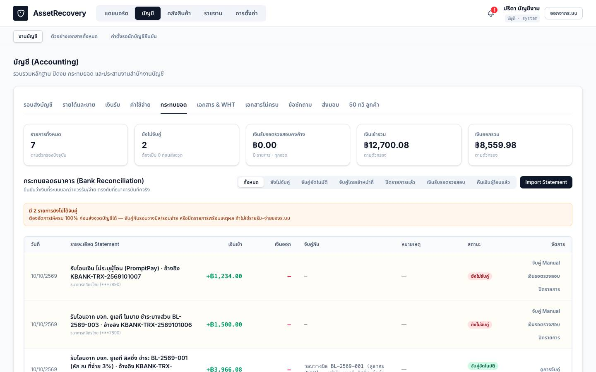

**คู่ที่ระบบเสนอ:** ถ้ารอบจ่ายถูกฝ่ายการเงินยืนยัน "จ่ายสำเร็จ" ด้วยมือไปก่อน ระบบจะ **ไม่จับคู่ให้เอง** แต่ขึ้นแผง **คู่ที่ระบบเสนอ** ให้คุณตรวจและยืนยัน

**ขั้นตอน**
1. ดูแผง **คู่ที่ระบบเสนอ** เหนือตาราง — คอลัมน์ เอกสาร (รอบจ่าย/รอบวางบิล) · รายการเดินบัญชี · ยอดที่ตรง
2. ตรวจชื่อรอบ ↔ รายละเอียด statement และยอดเงิน
3. กด **ยืนยันจับคู่** ทีละแถว


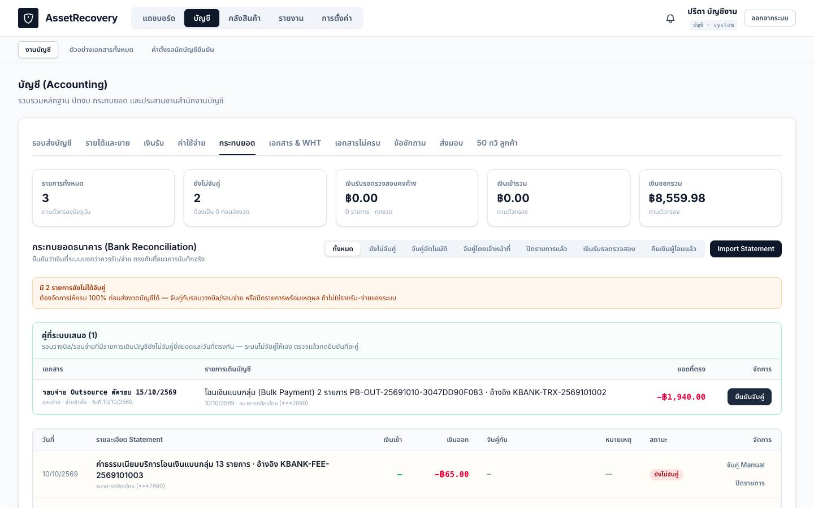

**ผลที่ควรเห็น:** แถวรายการเดินบัญชีเปลี่ยนเป็น **จับคู่โดยเจ้าหน้าที่** พร้อมชื่อเอกสารที่จับคู่ · ตัวนับยังไม่จับคู่ลดลง

**ข้อควรระวัง:** การยืนยันคู่มีผลทันที **ไม่มีหน้าต่างถามซ้ำ** และบางครั้งไม่มีข้อความแจ้งผล — ให้ดูจากสถานะแถวที่เปลี่ยน

**ดูรายละเอียดการจับคู่:** แถวที่จับคู่แล้ว → **ดูการจับคู่** — แสดงงวดบัญชี · ประเภทที่จับคู่ · รายการที่จับคู่ · ผู้ทำรายการ/เวลา

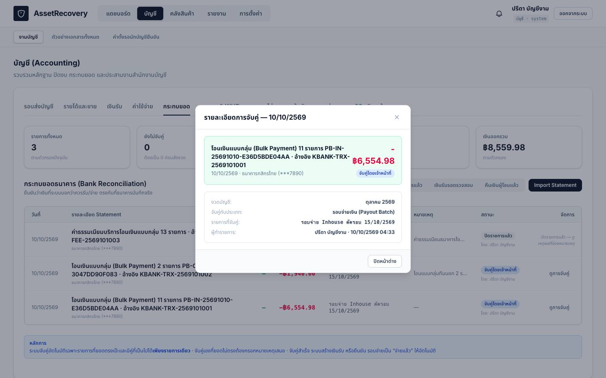

## 6. จับคู่ด้วยมือ (จับคู่ Manual)

**ใช้เมื่อ:** ยอดไม่ตรงพอให้ระบบจับคู่/เสนอเอง เช่น ลูกค้าโอนบางส่วน ลูกค้าหักภาษีแล้วโอนเศษ หรือโอนรวมหลายรายการ

**กติกา:** **เงินออก** จับคู่ได้เฉพาะ **รอบจ่าย** · **เงินเข้า** จับคู่ได้เฉพาะ **รอบวางบิล**

**ขั้นตอน**
1. แถวที่ยังไม่จับคู่ → กด **จับคู่ Manual**
2. **เลือกรายการที่ต้องการจับคู่** — ตัวเลือกที่ยอดตรงจะมีคำว่า "(ยอดตรง)"
3. ถ้ายอดไม่ตรง ระบบเตือน **ยอดไม่ตรงกันเป๊ะ** → ต้องกรอก **หมายเหตุชี้แจง**
4. กด **ยืนยันการจับคู่**

| ช่อง | ตัวอย่าง | หมายเหตุ |
|---|---|---|
| เลือกรายการที่ต้องการจับคู่ | รอบจ่าย Outsource ตัดรอบ 15/10/2569 · ฿1,940.00 (ยอดตรง) | บังคับ |
| หมายเหตุชี้แจง | ยอดค้าง 954.58 หัก 3% ของ 2,294.00 = 68.82 โอนสุทธิ 885.76 | บังคับเมื่อยอดไม่ตรง · ไม่บังคับเมื่อยอดตรงเป๊ะ |

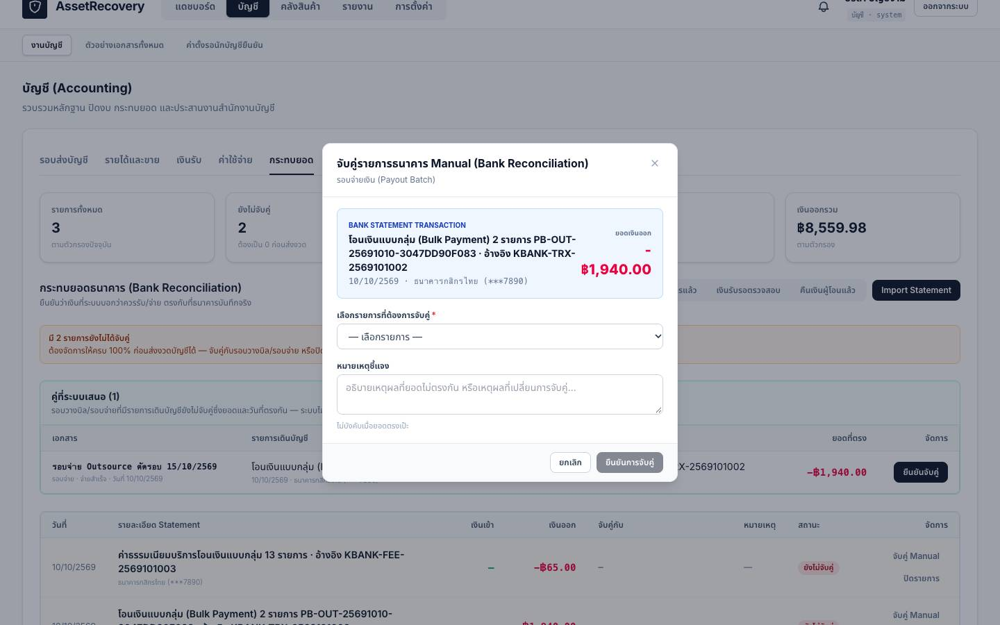

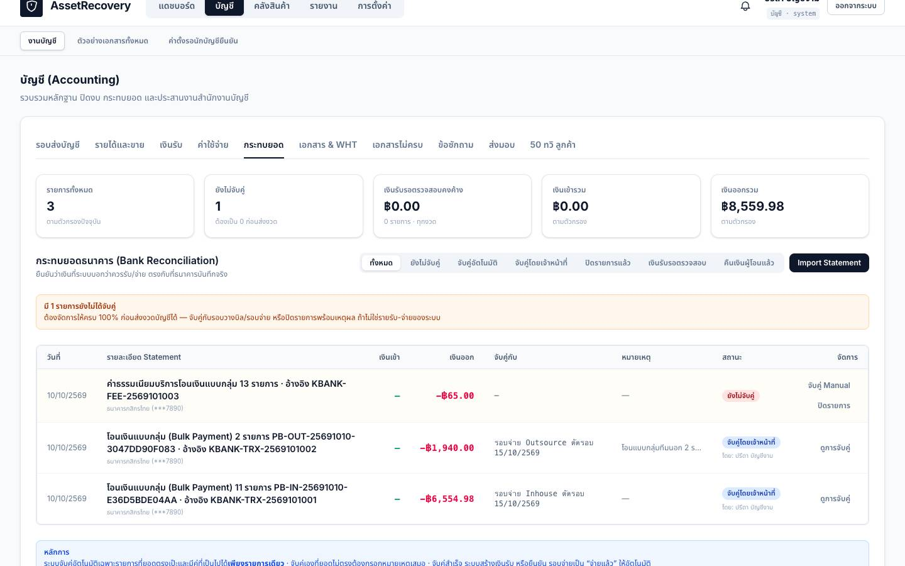

### ผลของการจับคู่แต่ละแบบ

| กรณี | ระบบทำอะไรให้ | ข้อความที่เห็น |
|---|---|---|
| เงินออก ↔ รอบจ่าย | ยืนยันรอบจ่ายเป็น "จ่ายแล้ว" ให้อัตโนมัติ (ถ้ายังไม่ได้ยืนยัน) | "จับคู่รายการสำเร็จ — ยืนยันรอบจ่ายเป็น "จ่ายแล้ว" ให้อัตโนมัติ" |
| เงินเข้า ↔ รอบวางบิล **ครบยอด** | สร้าง **เงินรับ** ในแท็บเงินรับ · รอบวางบิลเป็น "รับชำระครบ" | "จับคู่รายการสำเร็จ — สร้างเงินรับให้แล้ว · ยอดคงค้างของรอบ ฿0.00" |
| เงินเข้า ↔ รอบวางบิล **บางส่วน** | สร้างเงินรับเท่าที่โอนมา · แสดงยอดคงค้างที่เหลือ | "… ยอดคงค้างของรอบ ฿954.58" |
| ลูกค้า **หักภาษี ณ ที่จ่าย** | นับยอดภาษีที่ลูกค้าหักเป็นการรับชำระให้อัตโนมัติ · สร้างแถว **รอ 50 ทวิ จากลูกค้า** ในแท็บ 50 ทวิ ลูกค้า | ยอดคงค้างเป็น 0 ทันทีเมื่อเงินโอน + ภาษีที่หัก = ยอดค้าง |
| ลูกค้าโอน **ขาดเล็กน้อย** (เช่น ถูกหักค่าธรรมเนียมโอน) ไม่เกินเพดานที่ตั้งไว้ | บันทึกส่วนต่างเป็นค่าธรรมเนียมธนาคาร · รอบเป็นชำระครบ | "… ส่วนต่าง ฿… ไม่เกินเพดาน บันทึกเป็นค่าธรรมเนียมธนาคาร · รอบชำระครบ" |

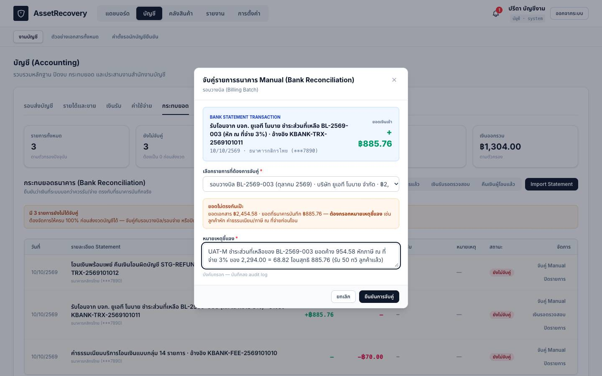

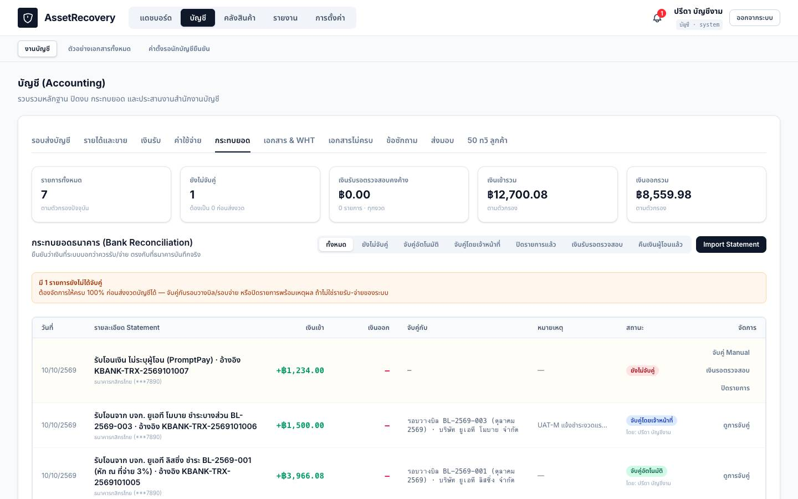

**ข้อควรระวัง**
- ในรายการให้เลือก ยอดของรอบวางบิลแสดงเป็น **ยอดเต็มบิล** (และยอดคาดรับหลังหักภาษีของทั้งบิล) ไม่ใช่ยอดคงค้าง — ถ้าบิลรับชำระบางส่วนไปแล้ว ให้คำนวณยอดคงค้างจากใบแจ้งหนี้เองก่อนเขียนหมายเหตุ
- รายการให้เลือกอาจยังแสดงรอบจ่ายที่ **จับคู่กับรายการอื่นไปแล้ว** — ตรวจชื่อรอบและยอดให้ตรงกับบรรทัด statement ทุกครั้ง อย่าเลือกรอบเดียวกันซ้ำ

## 7. ปิดรายการที่ไม่ต้องจับคู่ (ค่าธรรมเนียม เงินโอนคืน ฯลฯ)

**ใช้เมื่อ:** รายการเดินบัญชีไม่ใช่รายรับ-รายจ่ายของระบบ เช่น **ค่าธรรมเนียมธนาคาร** ดอกเบี้ยรับ หรือ **เงินโอนคืน** ให้ผู้โอนผิดบัญชี

**ขั้นตอน**
1. แถวนั้น → กด **ปิดรายการ**
2. กรอก **เหตุผลที่ปิดรายการ** → กด **ยืนยันปิดรายการ**

| ช่อง | ตัวอย่าง | หมายเหตุ |
|---|---|---|
| เหตุผลที่ปิดรายการ | ค่าธรรมเนียมธนาคารโอนเงินแบบกลุ่ม 13 รายการ ×฿5 — ไม่ใช่รายจ่ายของรอบจ่าย (สำนักงานบัญชีลงเป็นค่าธรรมเนียมธนาคาร) | บังคับ · เก็บในประวัติ |

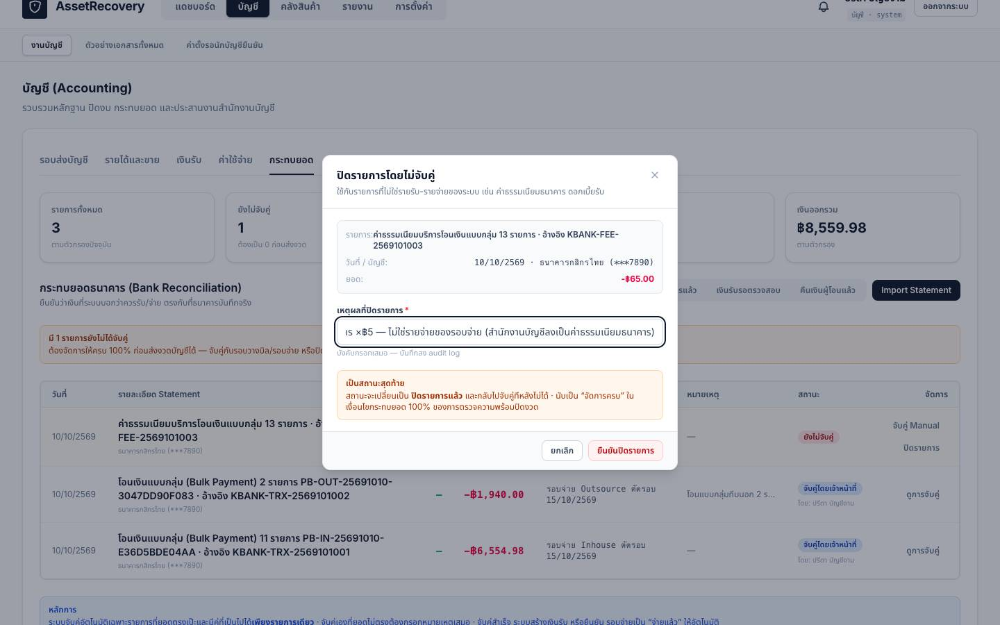

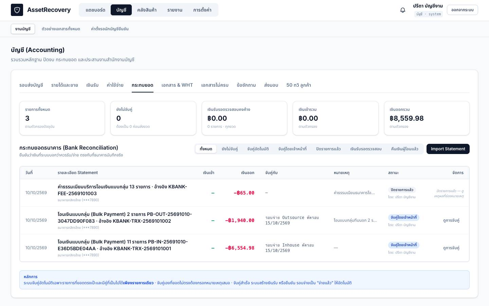

**ผลที่ควรเห็น:** ข้อความ "ปิดรายการแล้ว — รายการนี้ถูกนับเป็น "จัดการครบ" ในการตรวจความพร้อมปิดงวด" · การ์ด **ยังไม่จับคู่** ลดลง

**ข้อควรระวัง**
- **ปิดรายการแล้วเป็นสถานะสุดท้าย** กลับมาจับคู่ไม่ได้
- เงินเข้าที่ **ไม่รู้ที่มา** อย่าใช้ปิดรายการ — ให้ใช้ **เงินรับรอตรวจสอบ** (บทที่ 8)
- เงินโอนคืนใน statement ผูกกับรายการ "คืนเงินผู้โอนแล้ว" โดยตรงไม่ได้ — ใช้ **ปิดรายการ** แล้วพิมพ์เลขอ้างอิงของรายการเงินรับรอตรวจสอบเดิมไว้ในเหตุผล

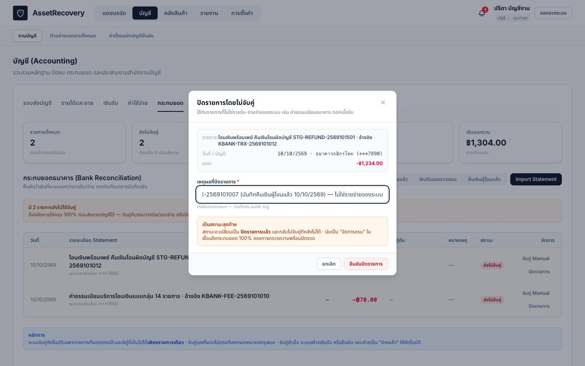

## 8. เงินรับรอตรวจสอบ และคืนเงินผู้โอน

### 8.1 ย้ายเงินเข้าไม่ทราบที่มาเป็นเงินรับรอตรวจสอบ

**ใช้เมื่อ:** มีเงินเข้าที่ไม่ระบุผู้โอน และยอดไม่ตรงบิลใด

**ขั้นตอน**
1. แถวเงินเข้านั้น → กด **เงินรอตรวจสอบ**
2. กรอก **เหตุผล** → กด **ยืนยันย้ายเป็นเงินรับรอตรวจสอบ**

| ช่อง | ตัวอย่าง | หมายเหตุ |
|---|---|---|
| เหตุผล | เงินโอน PromptPay ไม่ระบุผู้โอน ยอดไม่ตรงบิลใด — ขอรายละเอียดผู้โอนจากธนาคาร | บังคับ |

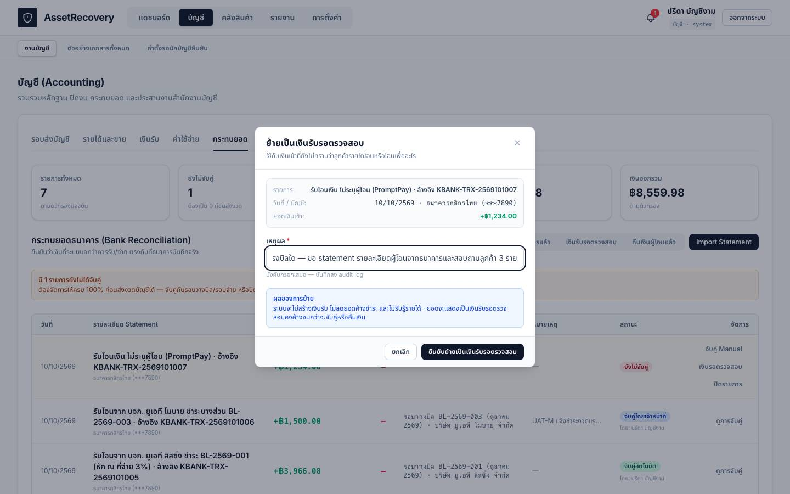

**ผลที่ควรเห็น:** รายการไม่นับเป็น "ยังไม่จับคู่" แล้ว · การ์ด **เงินรับรอตรวจสอบคงค้าง** แสดงยอด — เงินนี้ **ยังไม่รับรู้รายได้และไม่ลดยอดค้างรับ** · ปิดงวดได้แต่มีคำเตือน

### 8.2 เมื่อรู้ที่มาแล้ว — เลือกทางใดทางหนึ่ง

| ผลการตรวจสอบ | ทำอย่างไร |
|---|---|
| เป็นเงินของบริษัทไฟแนนซ์ (ลูกค้าเรา) | **จับคู่ Manual** กับรอบวางบิลของลูกค้านั้น (บทที่ 6) |
| ไม่ใช่เงินของลูกค้า (เช่น บุคคลภายนอกโอนผิดบัญชี) | **คืนเงินผู้โอน** ตามขั้นตอนด้านล่าง |

### 8.3 คืนเงินผู้โอน

**ก่อนเริ่ม:** โอนเงินคืนผู้โอนผ่านธนาคารแล้ว และมีสลิปโอนคืน

**ขั้นตอน**
1. แท็บ **กระทบยอด** → แถวสถานะ **เงินรับรอตรวจสอบ** → กด **คืนเงินผู้โอน**
2. ตรวจรายละเอียดรายการและเหตุผลที่รอตรวจสอบเดิม
3. กรอก **วันที่โอนคืน** · แนบ **หลักฐานการโอนคืน** · **เหตุผลที่คืนเงิน**
4. อ่านกล่อง "เป็นสถานะสุดท้าย" → กด **ยืนยันคืนเงินผู้โอน**

| ช่อง | ตัวอย่าง | หมายเหตุ |
|---|---|---|
| วันที่โอนคืน | 10/10/2569 | บังคับ · ค่าเริ่มต้นวันนี้ |
| หลักฐานการโอนคืน | สลิปโอนคืน (รูปหรือ PDF) | บังคับ · ไม่เกิน 10 MB |
| เหตุผลที่คืนเงิน | ธนาคารแจ้งผู้โอนเป็นบุคคลภายนอก โอนผิดบัญชี ขอคืนเต็มจำนวน | บังคับ |

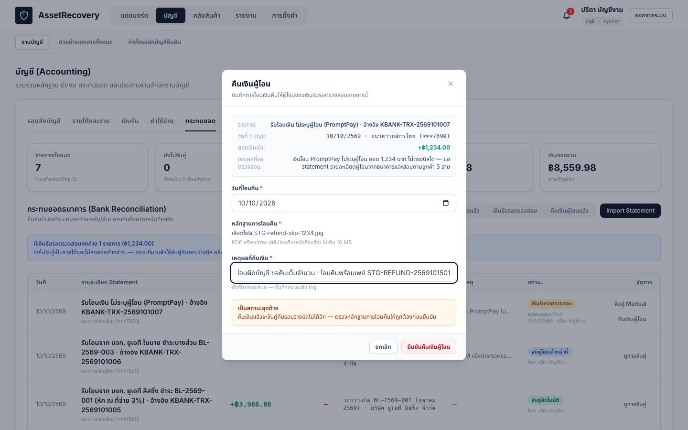

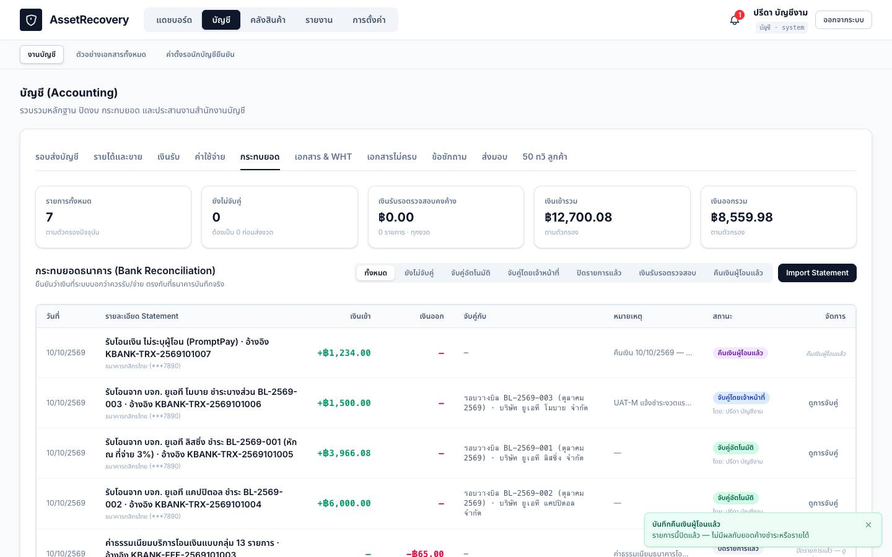

**ผลที่ควรเห็น:** ข้อความ "บันทึกคืนเงินผู้โอนแล้ว — รายการนี้ปิดแล้ว ไม่มีผลกับยอดค้างชำระหรือรายได้" · สถานะ **คืนเงินผู้โอนแล้ว** · เงินรับรอตรวจสอบคงค้างลดลง

**ข้อควรระวัง:** คืนเงินแล้ว **จับคู่กับบิลไม่ได้อีก** — ยืนยันให้แน่ว่าไม่ใช่เงินลูกค้าก่อน · เมื่อนำเข้า statement รอบถัดไปจะมีบรรทัดเงินออกของการโอนคืน ให้ **ปิดรายการ** ตามบทที่ 7

## 9. บันทึกหนังสือ 50 ทวิ ที่ลูกค้าส่งมา

**ที่มา:** เมื่อจับคู่เงินเข้าที่บริษัทไฟแนนซ์หักภาษี ณ ที่จ่ายไว้ ระบบสร้างแถว **รอ 50 ทวิ จากลูกค้า** ให้อัตโนมัติ — คุณต้องบันทึกเมื่อได้รับหนังสือตัวจริง (หลักฐานเครดิตภาษีของบริษัท)

**ขั้นตอน**
1. **บัญชี** → แท็บ **50 ทวิ ลูกค้า** → แถวสถานะ **รอ 50 ทวิ จากลูกค้า** → กด **บันทึกได้รับหนังสือ**
2. กรอกข้อมูลตามหนังสือ แนบไฟล์สแกน
3. กด **บันทึกได้รับหนังสือ**

| ช่อง | ตัวอย่าง | หมายเหตุ |
|---|---|---|
| เลขที่หนังสือ | UMB-WHT-2569-0457 | บังคับ |
| วันที่ในหนังสือ | 10/10/2569 | บังคับ |
| ยอดภาษีที่หักตามหนังสือ | 68.82 | บังคับ · ระบบเติมยอดที่คาดไว้ให้ |
| ยอดเงินได้ตามหนังสือ | 2,294.00 | ไม่บังคับ |
| ไฟล์สแกน | รูป/PDF ของหนังสือ | บังคับ |

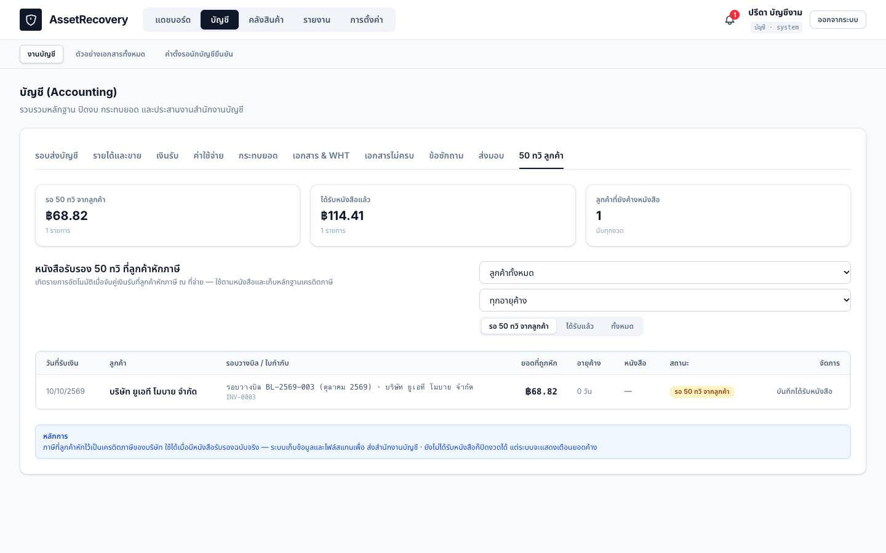

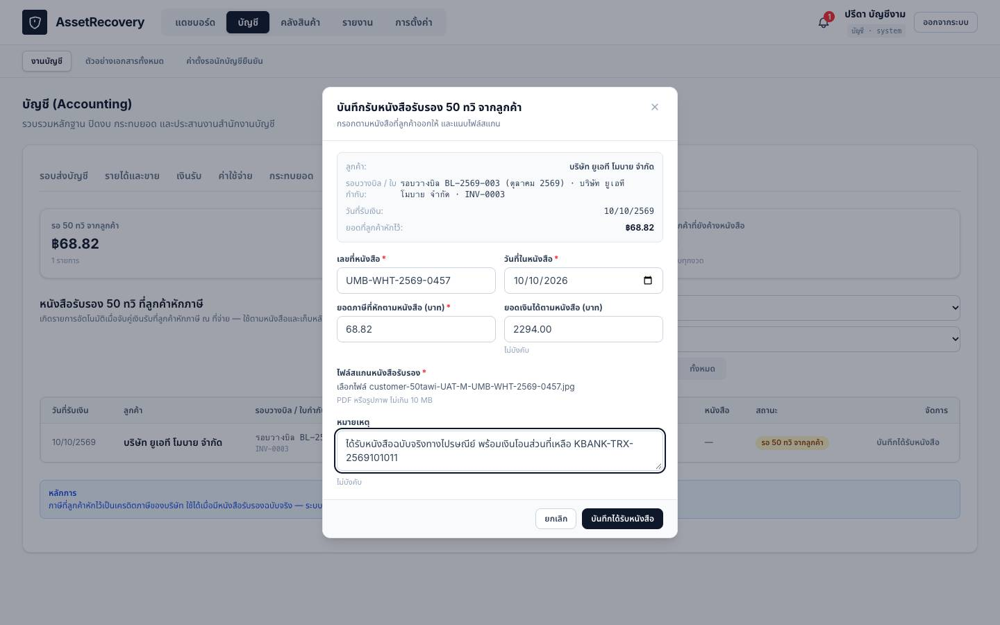

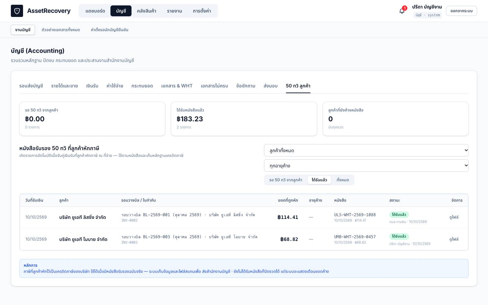

**ผลที่ควรเห็น:** ข้อความ "บันทึกรับหนังสือเลขที่ … แล้ว" · สถานะ **ได้รับแล้ว** · ปุ่ม **ดูไฟล์**

**ข้อควรระวัง:** ไฟล์สแกนหนังสือ 50 ทวิ ของลูกค้า **ไม่ได้รวมอยู่ในไฟล์ ZIP ของ Accounting Pack** (มีเฉพาะรายการเลขที่ในไฟล์ 10_Customer_WHT.csv) — ให้ส่งไฟล์สแกนให้สำนักงานบัญชีแยกต่างหาก · หนังสือที่ยังไม่ได้รับจะขึ้นเป็นคำเตือนตอนตรวจความพร้อมปิดงวด (ปิดได้ แต่ควรติดตามต่อ)

## 10. ออกใบเสร็จรับเงิน/ใบกำกับภาษี (รวมรับชำระบางส่วน)

**ที่มา:** ทุกครั้งที่จับคู่เงินเข้ากับรอบวางบิล ระบบสร้างแถวในแท็บ **เงินรับ** สถานะ **ยังไม่ออก** — 1 เงินรับ = 1 ใบเสร็จรับเงิน/ใบกำกับภาษี

**ขั้นตอน**
1. **บัญชี** → แท็บ **เงินรับ** → แถวที่ **ยังไม่ออก** → กด **ออกใบเสร็จรับเงิน/ใบกำกับภาษี**
2. ตรวจยอดในหน้าต่าง: เงินโอน + ภาษีที่ลูกค้าหัก = ยอดบนเอกสาร · ตรวจ **วันที่เอกสาร**
3. กด **ยืนยันออกเอกสาร**
4. กด **PDF** ที่เลขเอกสารเพื่อดาวน์โหลด/พิมพ์

| ช่อง | ตัวอย่าง | หมายเหตุ |
|---|---|---|
| วันที่เอกสาร | 10/10/2569 | ค่าเริ่มต้น = วันรับเงิน · ห้ามก่อนวันที่ของใบก่อนหน้า และห้ามเกินวันนี้ |

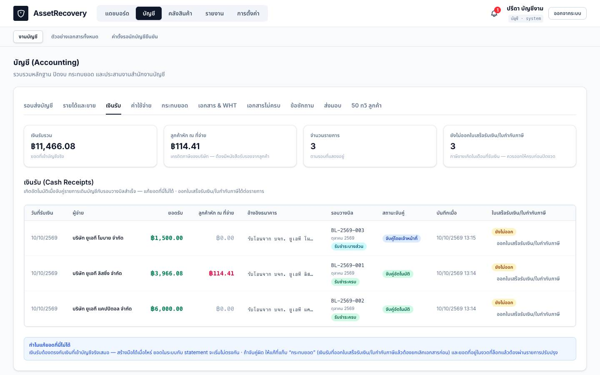

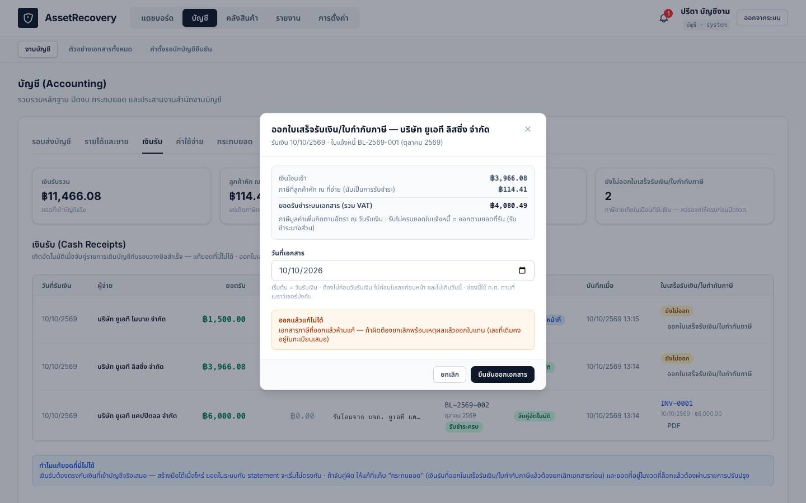

### รับชำระบางส่วน

ถ้าบิลถูกชำระหลายครั้ง แต่ละครั้งออกใบแยกกัน:
- ใบแรกระบุ **"รับชำระบางส่วนครั้งที่ 1"** และยอดคงค้าง
- ใบสุดท้ายระบุ **"รับชำระครั้งที่ 2 (ครบยอด)"** — ภาษีที่ลูกค้าหัก (คิดจากมูลค่าทั้งบิล) แสดงทั้งก้อนในใบสุดท้าย

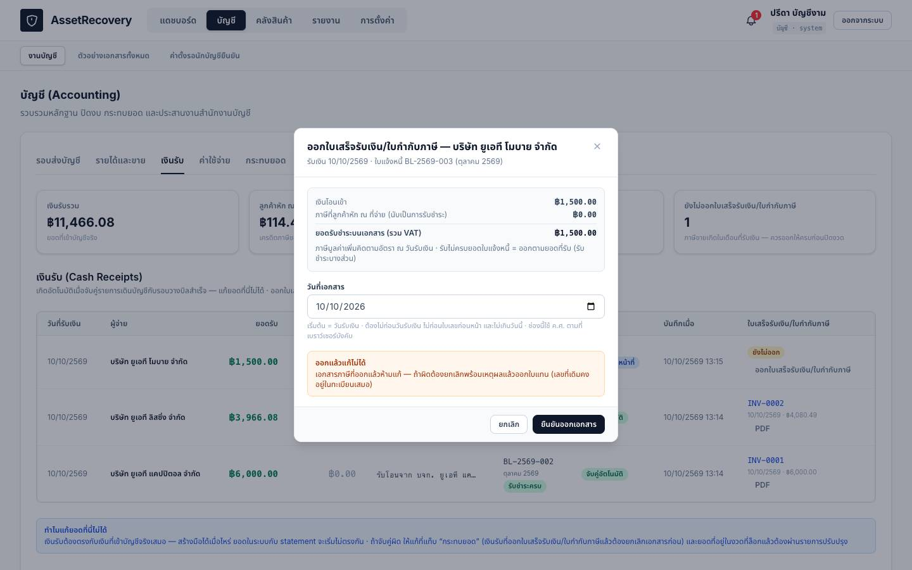

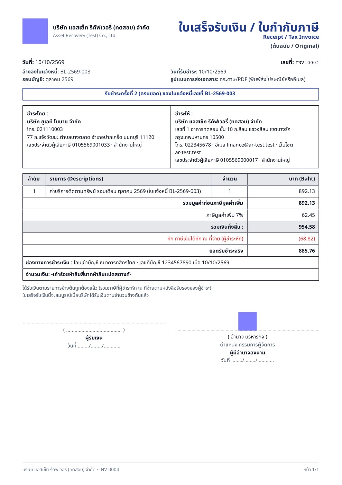

**ผลที่ควรเห็น:** ข้อความ "ออกใบเสร็จรับเงิน/ใบกำกับภาษีเลขที่ INV-… แล้ว" · PDF แสดง มูลค่าก่อน VAT · VAT · รวม · หักภาษี ณ ที่จ่าย · รับจริง

**ข้อควรระวัง:** ออกแล้ว **แก้ไม่ได้** — ผิดต้องยกเลิกแล้วออกใบแทน (บทที่ 11) · เลขที่เอกสารเดินต่อเนื่อง ไม่มีเลขว่าง

## 11. ยกเลิกใบกำกับภาษีแล้วออกใบแทน

**ใช้เมื่อ:** ใบที่ออกไปแล้วต้องเปลี่ยน เช่น ลูกค้าขอใบแทน หรือข้อมูลบนใบผิด

### ขั้นที่ 1 — ยกเลิก (แท็บรายได้และขาย)
1. **บัญชี** → แท็บ **รายได้และขาย** → แถวรอบวางบิล → ปุ่ม **ยกเลิก** ข้างเลขใบกำกับ
2. กรอก **เหตุผล** → กด **ยืนยันยกเลิกเอกสาร**

| ช่อง | ตัวอย่าง | หมายเหตุ |
|---|---|---|
| เหตุผล | ลูกค้าขอให้ออกใบแทน — ยอดเงินและรายการถูกต้อง | บังคับ · พิมพ์ลงใบแทน |

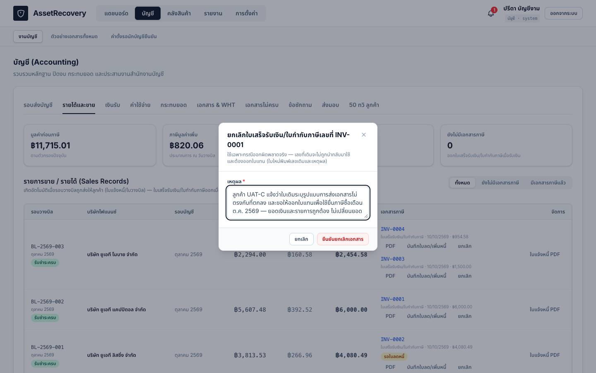

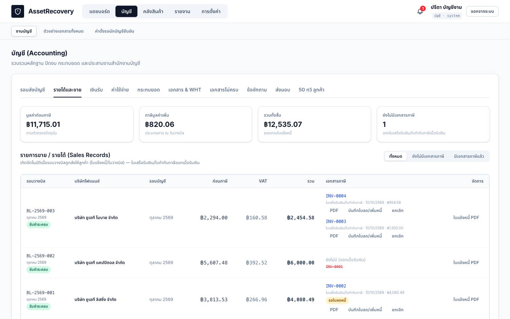

**ผลที่ควรเห็น:** ข้อความ "ยกเลิกใบเสร็จรับเงิน/ใบกำกับภาษีเลขที่ … แล้ว — เลขที่เดิมยังอยู่ในทะเบียน ออกใบแทนได้ที่แท็บเงินรับ (ใบใหม่ได้เลขถัดไป)"

### ขั้นที่ 2 — ออกใบแทน (แท็บเงินรับ)
1. แท็บ **เงินรับ** → แถวเดิม (มีป้ายใบเดิม "ยกเลิก") → ปุ่มเปลี่ยนเป็น **ออกใบแทน**
2. ตรวจยอด → **ยืนยันออกเอกสาร** → **PDF**

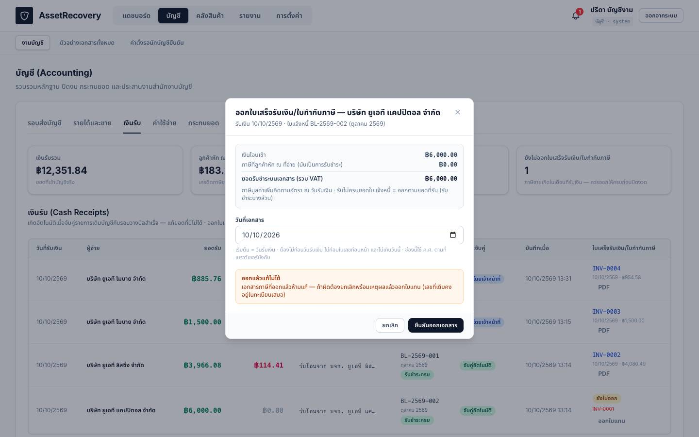

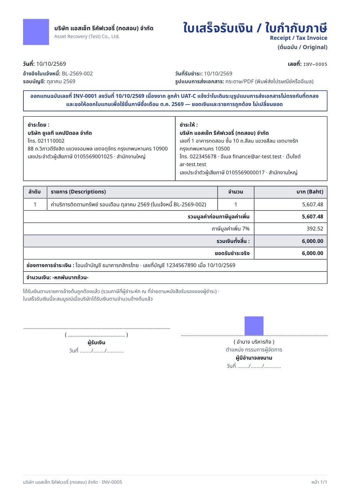

**ผลที่ควรเห็น:** ใบแทนได้ **เลขใหม่** · PDF มีแถบ "ออกแทนฉบับเลขที่ … ลงวันที่ … เนื่องจาก …" · ใบที่ยกเลิกยังอยู่ในทะเบียน รายงาน A2 และใน ZIP ชื่อ `…-CANCELLED.pdf`

## 12. บันทึกใบลดหนี้ / ใบเพิ่มหนี้

**หลักการ:** ระบบ **ไม่ออกใบลดหนี้/เพิ่มหนี้เอง** — สำนักงานบัญชีเป็นผู้ออก แล้วฝ่ายบัญชีนำมา **บันทึก** ในระบบพร้อมไฟล์สแกน

**ลำดับงานปกติ**
1. ฝ่ายการเงินสร้าง **รายการปรับปรุง** ลด/เพิ่มรายได้ (ยอดก่อน VAT) และได้รับอนุมัติ
2. แถวในแท็บ **รายได้และขาย** ขึ้นป้าย **รอใบลดหนี้** (ระบุเลขใบกำกับ)
3. สำนักงานบัญชีออกใบลดหนี้/เพิ่มหนี้
4. ฝ่ายบัญชี: แถวนั้น → **บันทึกใบลด/เพิ่มหนี้** → อ่านกล่องยอด → กรอกข้อมูล → **บันทึกใบลดหนี้**

| ช่อง | ตัวอย่าง | หมายเหตุ |
|---|---|---|
| ชนิดเอกสาร | ใบลดหนี้ / ใบเพิ่มหนี้ | |
| เลขที่ | CN-2569-001 | ตามเอกสารที่สำนักงานบัญชีออก |
| วันที่ออก | 10/10/2569 | ช่องนี้แสดง ค.ศ. ตามที่เบราว์เซอร์บังคับ · งวดที่ปิดแล้วบันทึกไม่ได้ |
| มูลค่าที่ลด/เพิ่ม (ก่อนภาษี) | 100.00 | VAT เว้นว่าง = ระบบคำนวณให้ |
| รายการปรับปรุงที่เป็นต้นเหตุ | ลดยอด ฿100.00 | ถ้ามี |
| เหตุผล · ไฟล์สแกน | | |

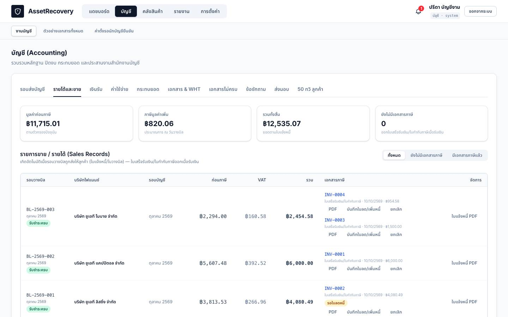

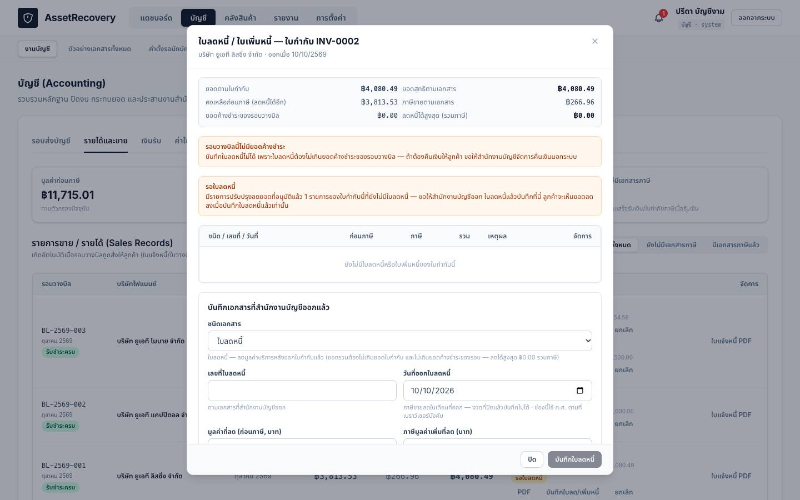

### เงื่อนไขสำคัญ — ใบลดหนี้ต้องไม่เกินยอดค้างชำระของบิล

กล่องยอดด้านบนหน้าต่างบอก **ยอดค้างชำระของรอบวางบิล** และ **ลดหนี้ได้สูงสุด** — ใบลดหนี้บันทึกได้ **เฉพาะบิลที่ยังมียอดค้าง** และไม่เกินยอดนั้น · ใบเพิ่มหนี้ไม่มีเพดานนี้

ถ้าบิล **รับชำระครบแล้ว** ระบบจะปฏิเสธพร้อมข้อความว่า รอบวางบิลนี้ไม่มียอดค้างชำระแล้ว ถ้าต้องคืนเงินให้ลูกค้า ให้สำนักงานบัญชีจัดการคืนเงินนอกระบบ

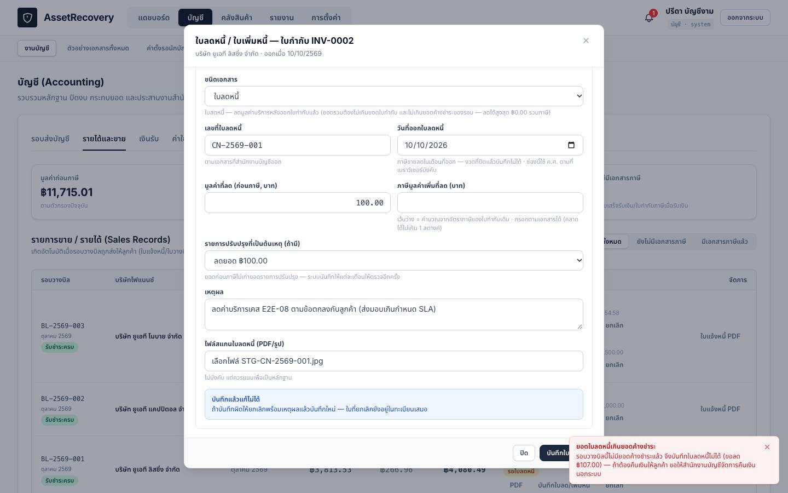

**ข้อควรระวัง**
- **ก่อนให้การเงินสร้างรายการปรับปรุงลดรายได้ ให้ตรวจยอดค้างของบิลก่อนเสมอ** — ถ้าบิลชำระครบแล้ว ระบบยังยอมให้สร้าง/อนุมัติรายการปรับปรุงได้ แต่บันทึกใบลดหนี้ไม่ได้ ผลคือ ป้าย **รอใบลดหนี้ค้างอยู่** · รายงานรายได้ (F1/F2/E1) ลดลงแล้ว แต่ยอดใบกำกับ/VAT ขาย (A2 และชุดเอกสาร) ยังไม่ลด และรายการปรับปรุงที่อนุมัติแล้วยกเลิกไม่ได้ · การตรวจความพร้อมปิดงวดก็ไม่เตือนเรื่องนี้ — ให้แจ้งสำนักงานบัญชีให้รับทราบ
- วิธีที่ปลอดภัย: ทำส่วนลดกับ **บิลที่ยังไม่ได้รับชำระ** (เช่น บิลรอบถัดไป) แล้วบันทึกใบลดหนี้ก่อนลูกค้าโอน
- ข้อความใต้ช่อง "รายการปรับปรุงที่เป็นต้นเหตุ" เป็นคำอธิบายที่แสดงตลอด ไม่ได้แปลว่ายอดที่กรอกไม่ตรง

---

*งานประจำเดือน*

## 13. หนังสือรับรอง 50 ทวิ ที่บริษัทออก — ดาวน์โหลด · ยกเลิกออกใหม่

**ที่มา:** ระบบออกหนังสือรับรอง 50 ทวิ **อัตโนมัติ 1 ใบต่อรายการที่หักภาษี** เมื่อรอบจ่ายค่าตอบแทน "จ่ายสำเร็จ"

### 13.1 ดูทะเบียนและดาวน์โหลด
1. **บัญชี** → แท็บ **เอกสาร & WHT** — ดูแถบเตือนกำหนดนำส่ง · การ์ด ภ.ง.ด.3/53/1 · ตาราง **สรุปรอบนำส่ง WHT รายเดือน** · ทะเบียนใบ 50 ทวิ
2. แถวที่ต้องการ → กด **หนังสือรับรอง** — ระบบ **ดาวน์โหลดไฟล์ PDF** (ไม่เปิดในเบราว์เซอร์)

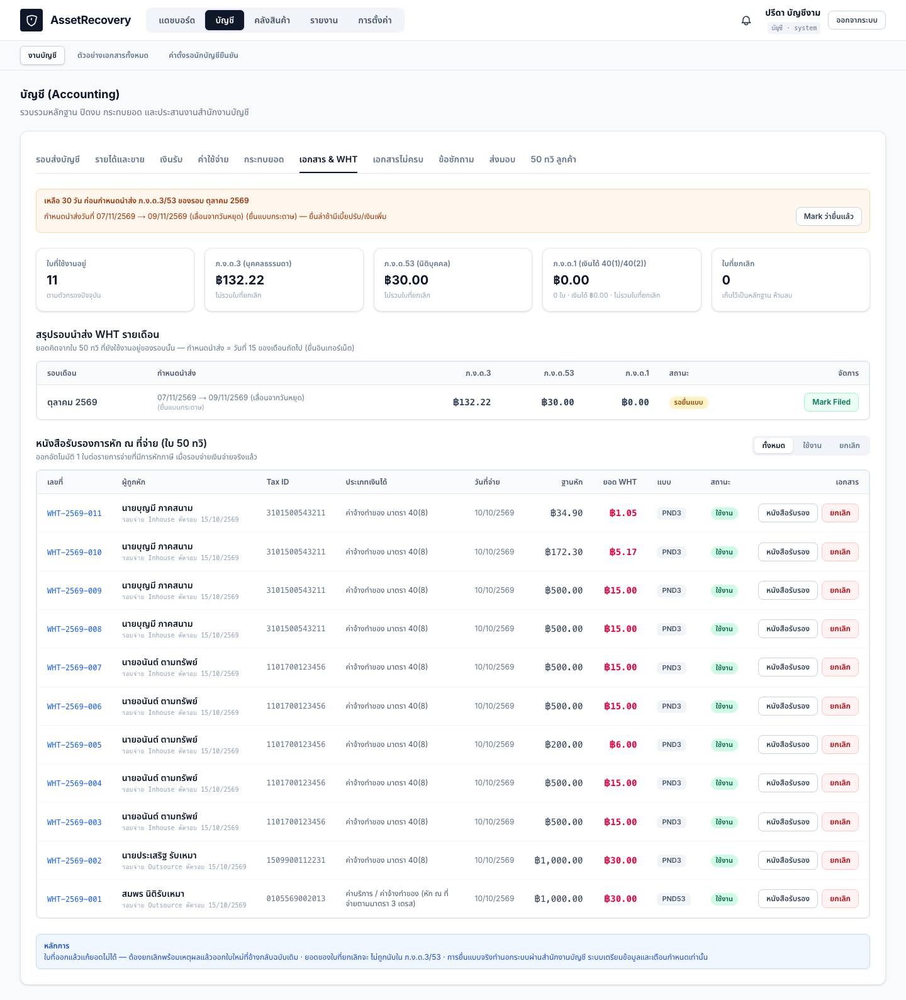

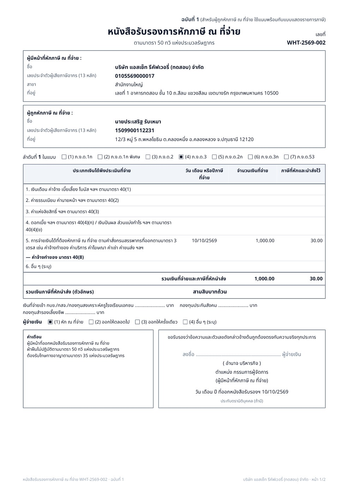

**ผลที่ควรเห็น:** PDF 2 หน้า (ฉบับที่ 1 ให้ผู้ถูกหักใช้แนบแบบ · ฉบับที่ 2 เก็บเป็นหลักฐาน) ตามแบบ 50 ทวิ

### 13.2 ยกเลิกแล้วออกใบแทน
**ใช้เมื่อ:** ข้อมูลบนหนังสือผิด เช่น ที่อยู่ผู้ถูกหักไม่ครบ (แก้ข้อมูลผู้รับเงินให้ถูกก่อน แล้วจึงออกใบแทน)

1. แถวใบที่ผิด → กด **ยกเลิก**
2. กรอก **เหตุผลการยกเลิก**
3. ติ๊ก **ออกใบแทนทันทีด้วยข้อมูลปัจจุบัน** (ไม่ติ๊ก = ยกเลิกอย่างเดียว)
4. กด **ยืนยันยกเลิก**

| ช่อง | ตัวอย่าง | หมายเหตุ |
|---|---|---|
| เหตุผลการยกเลิก | ที่อยู่ผู้ถูกหักในหนังสือรับรองไม่ครบ (ผู้รับแจ้งเปลี่ยนที่อยู่) — ยกเลิกและออกใบแทนด้วยข้อมูลปัจจุบัน | บังคับ · พิมพ์ลงเอกสาร |
| ออกใบแทนทันที | ติ๊ก | |

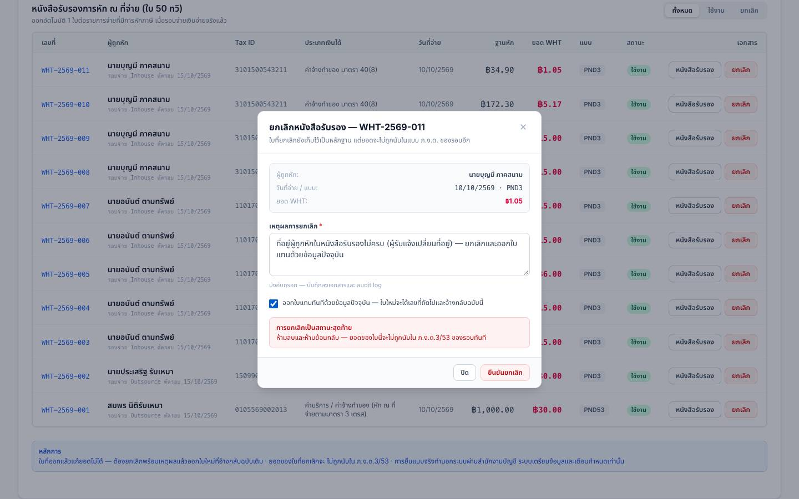

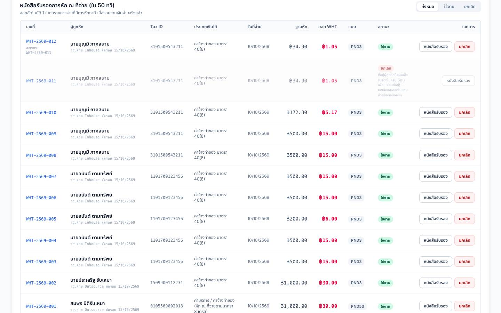

**ผลที่ควรเห็น:** ข้อความ "ยกเลิก WHT-… แล้ว — ออกใบแทนเลขที่ WHT-… เรียบร้อย" · ใบเดิมสถานะ **ยกเลิก** + เหตุผล · ใบใหม่มีป้าย **ออกแทน WHT-…** · ยอด ภ.ง.ด. ไม่เปลี่ยน (นับเฉพาะใบที่ใช้งาน)

**ข้อควรระวัง:** การยกเลิกเป็น **สถานะสุดท้าย** ห้ามลบ/ย้อน — ใบที่ยกเลิกยังอยู่ในทะเบียนและในชุดเอกสาร (`…-CANCELLED.pdf`)

## 14. สรุป ภ.ง.ด.3 / ภ.ง.ด.53 และ Mark ว่ายื่นแล้ว

**เป้าหมาย:** ตรวจยอดภาษีหัก ณ ที่จ่ายที่ต้องนำส่งของเดือน และบันทึกว่ายื่นแล้วหลังสำนักงานบัญชียื่นจริง

### 14.1 ดูสรุป
- แท็บ **เอกสาร & WHT** → ตาราง **สรุปรอบนำส่ง WHT รายเดือน** — แถวของเดือนแสดง ภ.ง.ด.3 · ภ.ง.ด.53 · ภ.ง.ด.1 · **กำหนดยื่น** (เลื่อนให้อัตโนมัติถ้าตรงวันหยุด) · สถานะ **รอยื่นแบบ**
- ตัวอย่าง ต.ค. 2569: ภ.ง.ด.3 ฿132.22 · ภ.ง.ด.53 ฿30.00 · ภ.ง.ด.1 ฿0.00 · กำหนด 07/11/2569 → 09/11/2569 (เลื่อนจากวันหยุด)
- ยอดมาจาก **ใบ 50 ทวิ ที่ใช้งานเท่านั้น** (ไม่นับใบยกเลิก)
- ไม่มีปุ่มดาวน์โหลดไฟล์ยื่นแบบ/ใบแนบ ภ.ง.ด. ในหน้านี้ — ข้อมูลสำหรับยื่นอยู่ในไฟล์ **05_WHT_Data.csv** ของชุดเอกสาร และ **รายงาน A1** (ส่งออก Excel/PDF ได้)

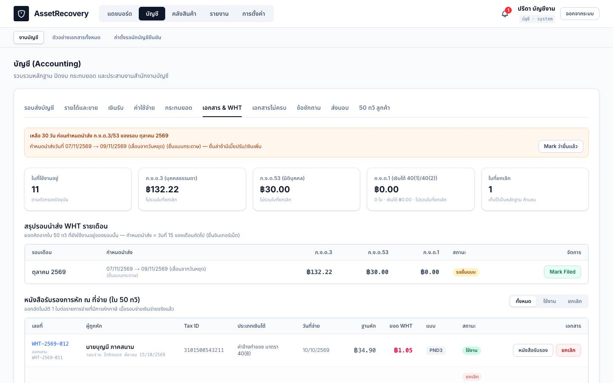

**ข้อควรระวัง:** คำอธิบายใต้หัวตารางอาจเขียนกำหนดนำส่งเป็นแบบยื่นทางอินเทอร์เน็ต (วันที่ 15) — ให้ยึด **วันที่ในแถวของเดือนและแถบเตือน** ซึ่งคำนวณตามวิธียื่นที่ตั้งไว้จริง

### 14.2 Mark ว่ายื่นแล้ว

> **แนะนำ: Mark หลังสิ้นเดือน และหลังสำนักงานบัญชียื่นจริงแล้วเท่านั้น** — ระบบยอมให้กดได้ตั้งแต่ระหว่างเดือน แต่ถ้ายังมีรอบจ่ายหรือใบ 50 ทวิ เกิดเพิ่มในเดือนเดียวกันหลัง Mark ยอดจะเข้าไปในเดือนที่ "ยื่นแล้ว" และระบบจะติดธง **ต้องยื่นเพิ่มเติม** พร้อมยอดต่าง

**ขั้นตอน**
1. แถวเดือนที่ยื่นแล้ว → กด **Mark Filed** (หรือ **Mark ว่ายื่นแล้ว** บนแถบเตือน)
2. กรอก **อ้างอิงการยื่น** → กด **ยืนยันว่ายื่นแล้ว**

| ช่อง | ตัวอย่าง | หมายเหตุ |
|---|---|---|
| อ้างอิงการยื่น | ยื่นแบบกระดาษ ณ สรรพากรพื้นที่ … เลขที่ใบเสร็จ ภ.ง.ด.3 … · ภ.ง.ด.53 … เมื่อ 07/11/2569 โดยสำนักงานบัญชี | บังคับ · มีช่องเดียว ให้ใส่ทั้งวันที่ เลขใบเสร็จ และผู้ยื่นในช่องนี้ |

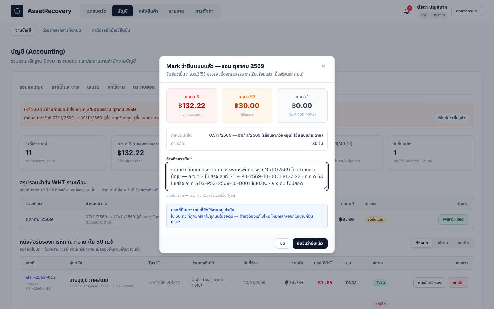

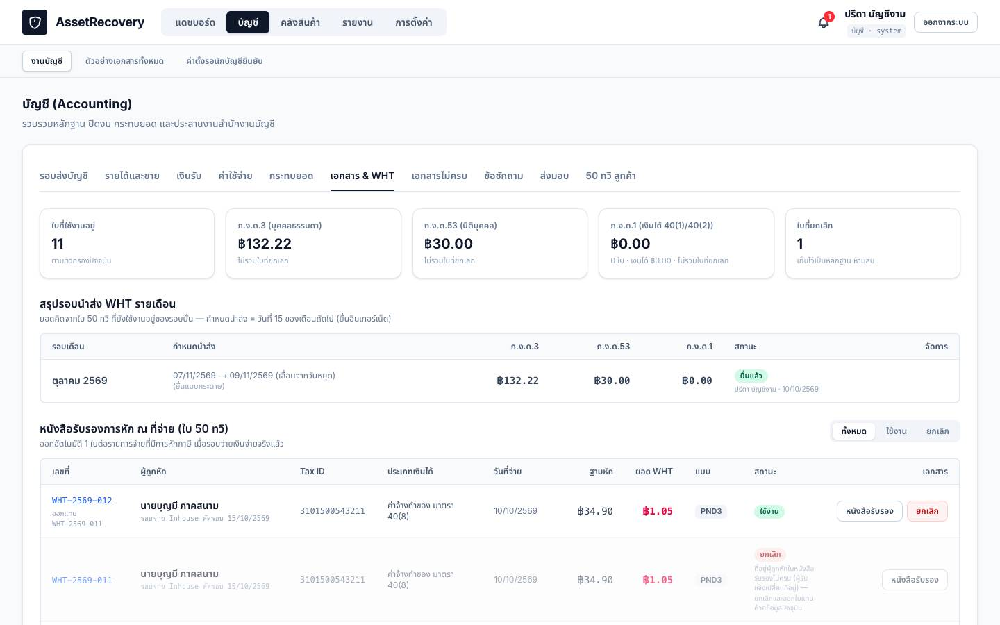

**ผลที่ควรเห็น:** ข้อความ "บันทึกว่ายื่นแบบรอบ … แล้ว — ระบบเก็บอ้างอิงการยื่นไว้ใน audit log" · สถานะ **ยื่นแล้ว · ชื่อผู้บันทึก · วันที่**

**ถ้ามีธง "ต้องยื่นเพิ่มเติม":** แจ้งสำนักงานบัญชียื่นแบบเพิ่มเติมตามยอดต่างที่แสดง แล้วบันทึกการยื่นเพิ่มเติมที่แถวเดือนนั้น

## 15. ข้อยกเว้น (เอกสารไม่ครบ)

**ใช้เมื่อ:** พบปัญหาเอกสาร/ข้อมูลที่ต้องติดตามในงวด เช่น ใบเสร็จไม่ได้ออกในนามบริษัท

**ระดับความสำคัญ**

| ระดับ | ผลต่อการปิดงวด |
|---|---|
| ข้อมูลทั่วไป | ไม่บล็อก |
| ควรแก้ไข (คำเตือน) | ไม่บล็อก แต่ขึ้นเป็นคำเตือนในตรวจความพร้อม |
| ต้องแก้ก่อนปิดงวด (วิกฤต) | **บล็อก** การส่งสำนักงานบัญชี/ล็อกงวด และการสร้างชุดเอกสาร จนกว่าจะแก้ หรือผู้บริหารอนุมัติยกเว้น |

### 15.1 บันทึกข้อยกเว้น
1. แท็บ **เอกสารไม่ครบ** → กด **บันทึกข้อยกเว้น**
2. เลือกระดับความสำคัญ · โมดูลต้นทาง · รอบบัญชี → กรอกหัวข้อ · รายละเอียดปัญหา · อ้างอิงรายการต้นทาง
3. กด **บันทึกข้อยกเว้น**

| ช่อง | ตัวอย่าง | หมายเหตุ |
|---|---|---|
| ระดับความสำคัญ | ควรแก้ไข | |
| โมดูลต้นทาง | รายการเบิก | บังคับ |
| รอบบัญชี | ตุลาคม 2569 · กำลังรวบรวม | ไม่เลือก = เดือนปัจจุบัน |
| หัวข้อ | ใบเสร็จค่าที่พักไม่ได้ออกในนามบริษัท 1 รายการ | บังคับ |
| รายละเอียดปัญหา | ค่าที่พัก ฿750.00 ของพนักงาน … ใบเสร็จออกในนามบุคคล — ขอใบเสร็จฉบับใหม่ในนามบริษัท หรือให้สำนักงานบัญชีพิจารณาเป็นรายจ่ายต้องห้าม | บังคับ |
| อ้างอิงรายการต้นทาง | รอบจ่าย Inhouse ตัดรอบ 15/10/2569 | ไม่บังคับ |

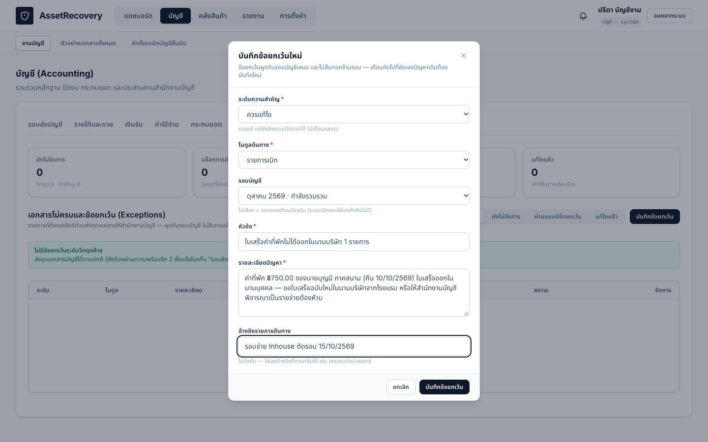

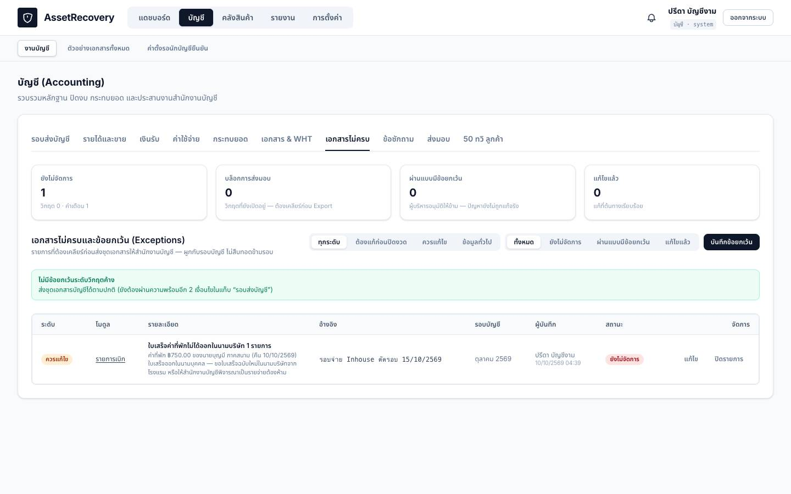

**ผลที่ควรเห็น:** ข้อความ "บันทึกข้อยกเว้นใหม่แล้ว — ตุลาคม 2569" · แถวสถานะ **ยังไม่จัดการ** มีปุ่ม **แก้ไข / ปิดรายการ** · ข้อยกเว้นขึ้นในกล่อง "Alerts ที่ต้องจัดการ" ของฝ่ายการเงินด้วย

### 15.2 จัดการข้อยกเว้น — 3 ทาง

| ทาง | ใครทำ | ทำอย่างไร |
|---|---|---|
| อัปเดตความคืบหน้า | บัญชี | **แก้ไข** → แก้รายละเอียด → **บันทึกการแก้ไข** |
| แก้ต้นเหตุแล้ว | บัญชี | **ปิดรายการ** → กรอก "แก้ไขอย่างไร" → ยืนยัน (สถานะ **แก้ไขแล้ว**) |
| แก้ไม่ได้/ไม่ทันในงวดนี้ | **ผู้บริหาร** | **อนุมัติยกเว้น** (บทที่ 25) → สถานะ **ผ่านแบบมีข้อยกเว้น** |

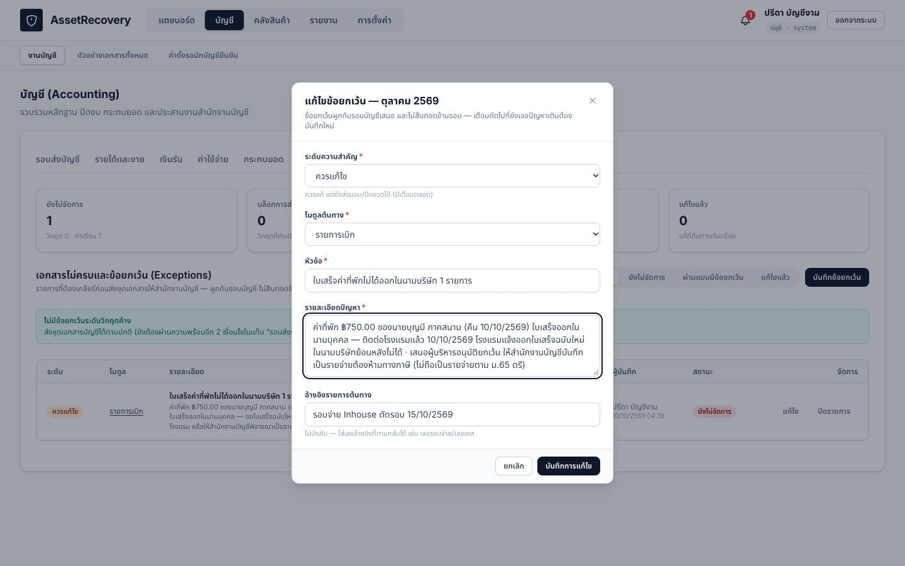

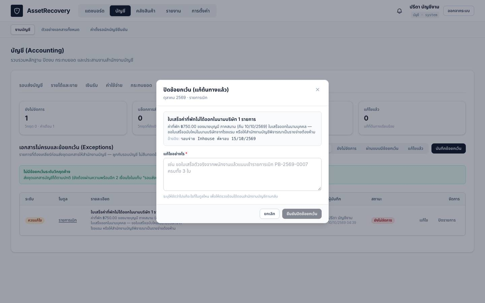

**ข้อควรระวัง:** ข้อยกเว้น **ผูกกับรอบบัญชี ไม่สืบทอดข้ามเดือน** — ถ้าเดือนถัดไปปัญหายังอยู่ ต้องบันทึกใหม่

## 16. ข้อซักถามจากสำนักงานบัญชี

**เป้าหมาย:** เก็บคำถาม-คำตอบกับสำนักงานบัญชีไว้ในระบบ ผูกกับงวด

**ขั้นตอน**
1. แท็บ **ข้อซักถาม** → กด **บันทึกข้อซักถาม** → พิมพ์คำถาม → **บันทึกข้อซักถาม**
2. แถวใหม่สถานะ **รอตอบ** → กด **ตอบคำถาม** → พิมพ์คำตอบ → **ส่งคำตอบ**

| ช่อง | ตัวอย่าง | หมายเหตุ |
|---|---|---|
| คำถาม / ข้อสงสัย | รายการเงินออก ฿65.00 วันที่ 10/10/2569 ที่ปิดรายการโดยไม่จับคู่ เป็นค่าธรรมเนียมของรอบจ่ายใด และมีใบกำกับภาษีค่าธรรมเนียมจากธนาคารหรือไม่ | บังคับ |
| คำตอบ / ชี้แจง | เป็นค่าธรรมเนียมโอนเงินแบบกลุ่มของ 2 รอบจ่ายวันที่ 10/10/2569 (13 รายการ × ฿5) · ธนาคารออกใบกำกับภาษีค่าธรรมเนียมรวมทั้งเดือนต้นเดือนถัดไป | บังคับ · **ตอบได้ครั้งเดียว** |

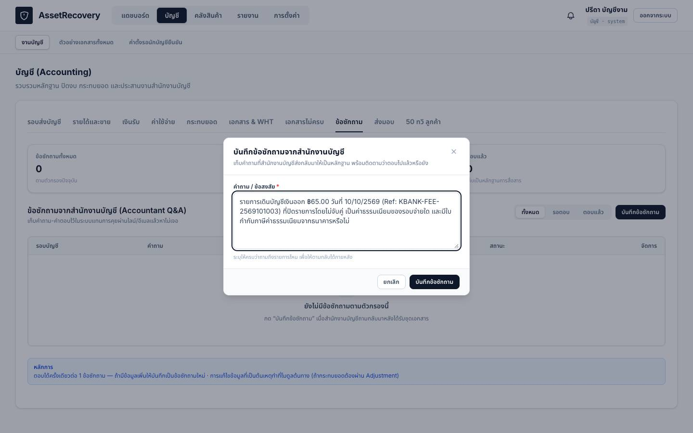

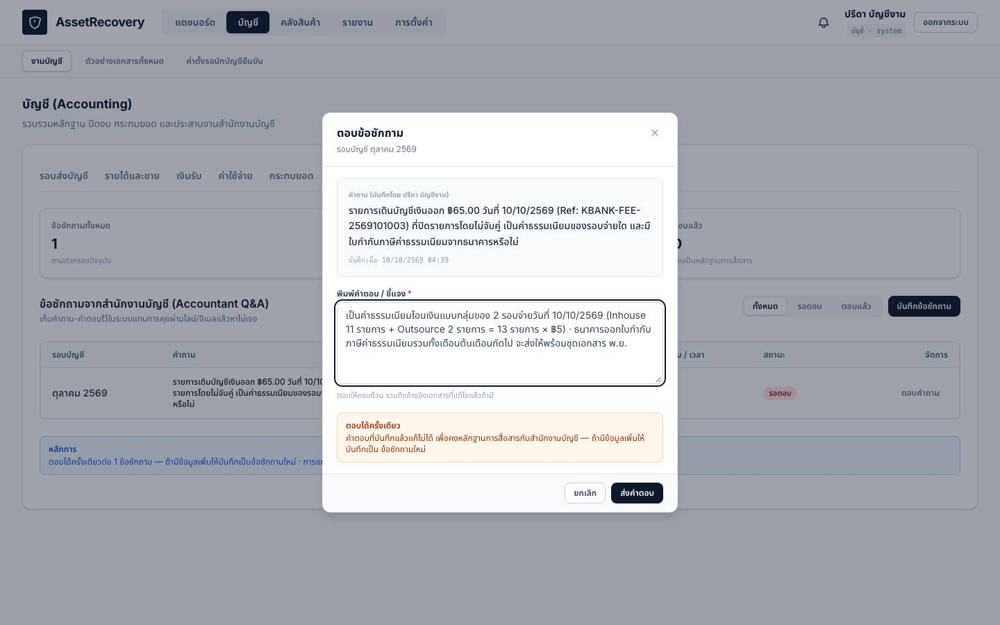

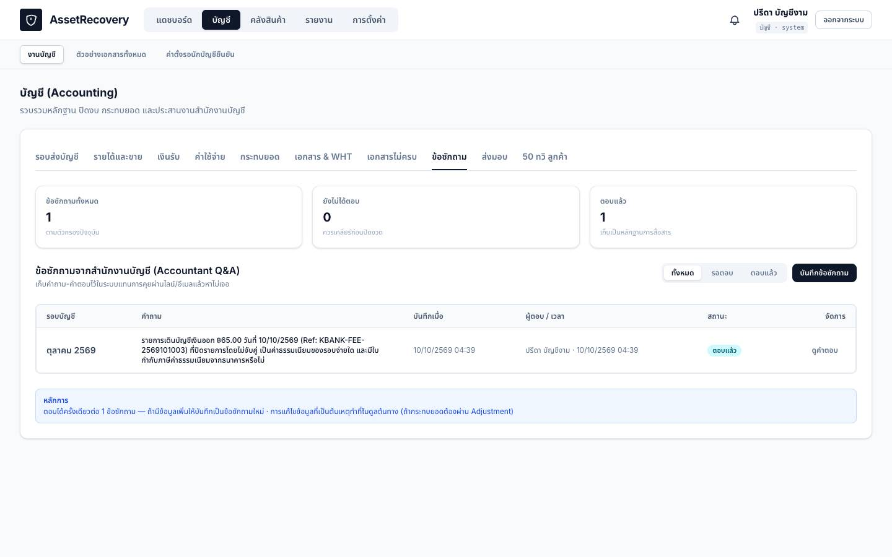

**ผลที่ควรเห็น:** สถานะ **ตอบแล้ว** · แถวแสดงผู้ตอบ/เวลา + ปุ่ม **ดูคำตอบ**

**เคล็ดลับ:** คำตอบแก้ไม่ได้ — ถ้ามีข้อมูลเพิ่มภายหลัง ให้บันทึกเป็นข้อซักถามใหม่

## 17. ระบุศูนย์ต้นทุน (Map Cost Center)

**เป้าหมาย:** ระบุว่ารายการจ่ายแต่ละรายการเป็นต้นทุนของศูนย์ใด (เช่น ทีมใน / ทีมนอก) เพื่อให้สำนักงานบัญชีแยกต้นทุนได้

**ขั้นตอน**
1. แท็บ **ค่าใช้จ่าย** — แถบเตือน "ยังไม่ได้ map Cost Center … รายการ"
2. แต่ละแถว → **Map Cost Center** → เลือก Cost Center → กรอกหมายเหตุ → **บันทึก Cost Center**

| ช่อง | ตัวอย่าง | หมายเหตุ |
|---|---|---|
| เลือก Cost Center | CC-001 — CC-IN ทีมใน (ผู้รับเป็นทีม Inhouse) / CC-002 — CC-OUT ทีมนอก (ผู้รับเป็นทีม Outsource) | บังคับ |
| หมายเหตุการ Mapping | ผู้รับเป็นพนักงานทีมนอก (Outsource) | บังคับ |

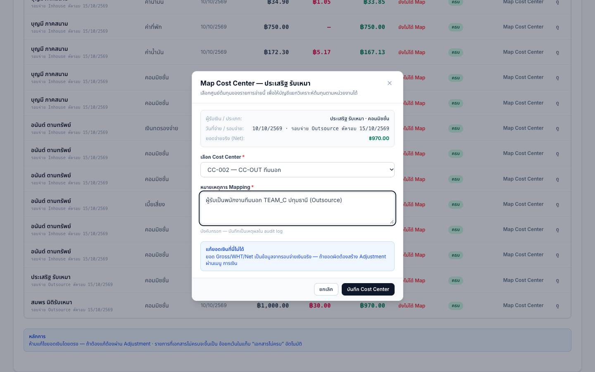

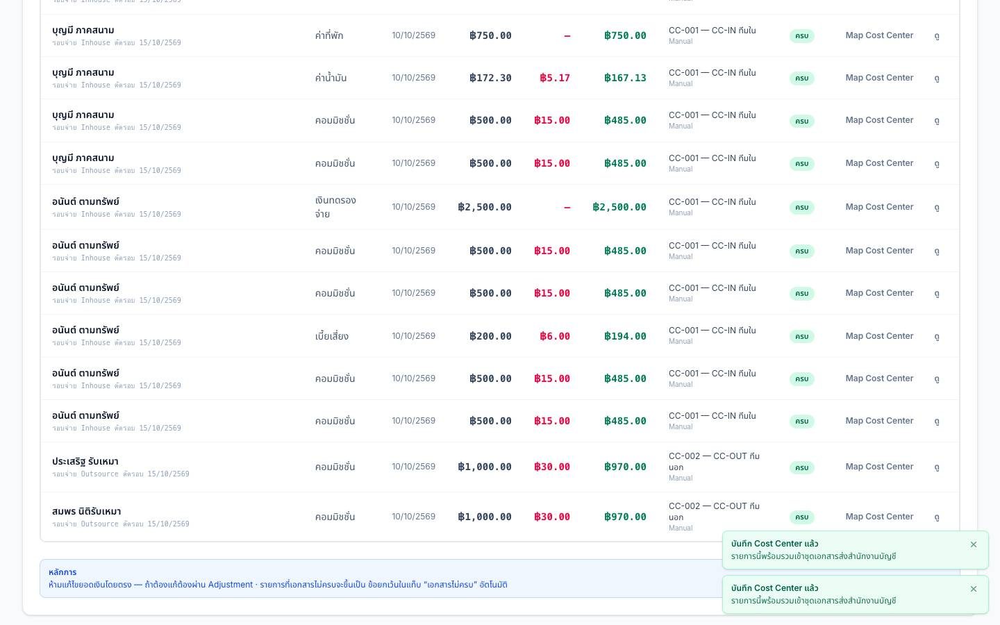

**ผลที่ควรเห็น:** ข้อความ "บันทึก Cost Center แล้ว — รายการนี้พร้อมรวมเข้าชุดเอกสาร" · แถวแสดง "CC-… · Manual" · เมื่อครบ แถบเตือนหายไป

**ข้อควรระวัง**
- ทำได้ **ทีละรายการ** (ยังไม่มีเลือกหลายแถว) และต้องกรอกหมายเหตุทุกครั้ง — รายการรายวัน (ค่าน้ำมัน เบี้ยเลี้ยง) ทำให้จำนวนแถวเพิ่มเร็ว แนะนำให้ทยอยทำทุกสัปดาห์
- ระบบ **ไม่บล็อก** การสร้างชุดเอกสารหรือการปิดงวดเมื่อยัง map ไม่ครบ (คอลัมน์ศูนย์ต้นทุนในไฟล์จะเป็น "-") — ต้องตรวจเองให้ครบก่อนสร้างชุดเอกสารฉบับจริง

## 18. ชุดเอกสารบัญชี (Accounting Pack)

**เป้าหมาย:** สร้างไฟล์ ZIP รวมข้อมูลและเอกสารของงวด ส่งให้สำนักงานบัญชี

### 18.1 สร้างชุดเอกสาร
1. แท็บ **ส่งมอบ** → กด **สร้างชุดเอกสารใหม่** (หรือปุ่ม **Export** ที่แถวงวดในแท็บรอบส่งบัญชี)
2. ตรวจรอบบัญชี · กล่องสถานะ (เขียว "ไม่มี Critical Exception — พร้อม Export") · เวอร์ชันที่จะได้
3. กรอก **บันทึกช่วยจำ** (ไม่บังคับ) → กด **ดาวน์โหลดไฟล์ (.zip)** — รอประมาณ 20 วินาที

| ช่อง | ตัวอย่าง | หมายเหตุ |
|---|---|---|
| บันทึกช่วยจำ | ฉบับสมบูรณ์ ต.ค. 2569 — กระทบยอดครบ ใบกำกับครบ | ไม่บังคับ |

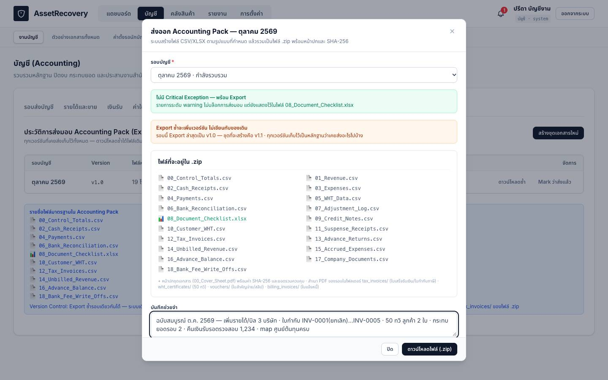

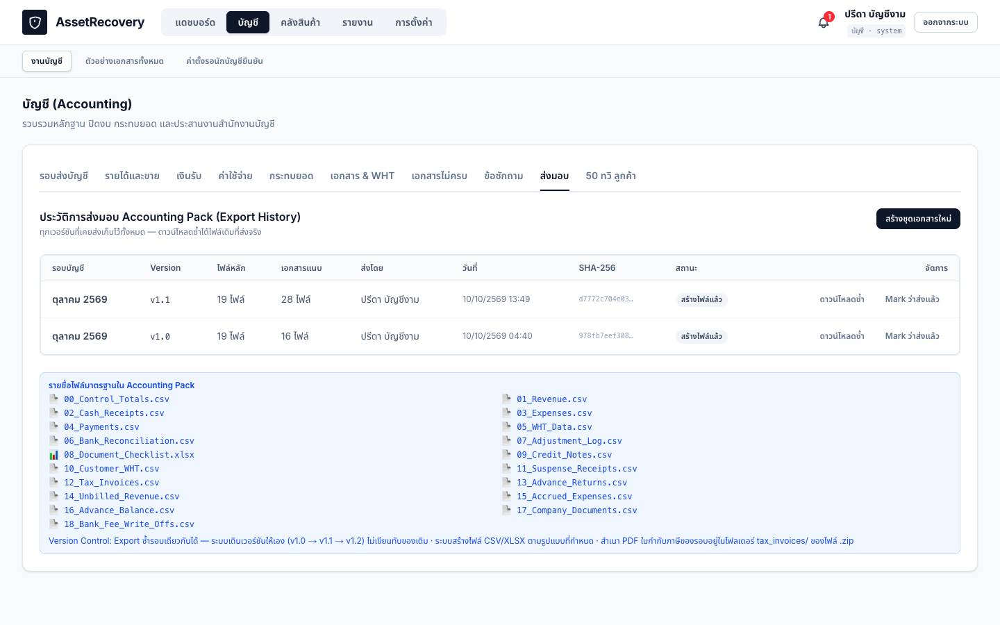

**ผลที่ควรเห็น:** ข้อความ "สร้างชุดเอกสาร … v… แล้ว" · ได้ไฟล์ `AccountingPack_<เดือน>_<ปี>_v<เวอร์ชัน>.zip` · ตารางประวัติแสดง เวอร์ชัน · ไฟล์หลัก · เอกสารแนบ · ผู้สร้าง · วันที่ · **SHA-256** · สถานะ **สร้างไฟล์แล้ว** · ปุ่ม **ดาวน์โหลดซ้ำ / Mark ว่าส่งแล้ว**

**ถ้ามีข้อยกเว้นวิกฤตค้าง:** ระบบไม่ให้สร้าง — ต้องแก้ หรือขอผู้บริหารอนุมัติยกเว้นก่อน

### 18.2 ไฟล์ใน ZIP

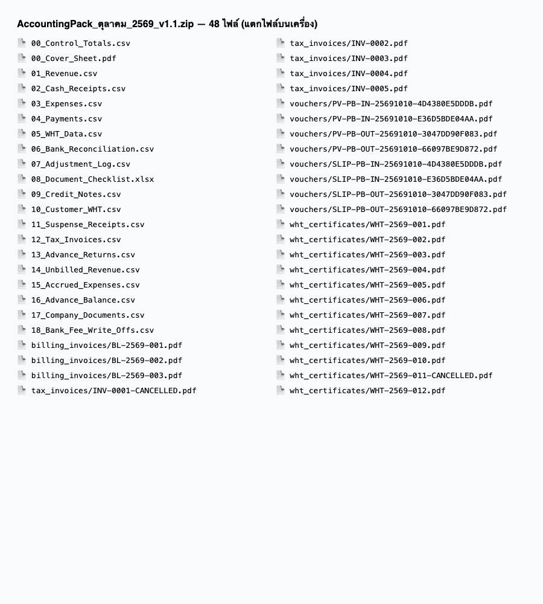

- **ไฟล์ข้อมูล 19 ไฟล์** (00_Control_Totals ถึง 18_Bank_Fee_Write_Offs) + **หน้าปก 00_Cover_Sheet.pdf** — รายละเอียดดู [ภาคผนวก 4](#ภาคผนวก-4--ไฟล์ใน-accounting-pack)
- โฟลเดอร์เอกสารแนบ: `billing_invoices/` (ใบแจ้งหนี้) · `tax_invoices/` (ใบกำกับ รวมใบยกเลิก `-CANCELLED`) · `vouchers/` (ใบสำคัญจ่าย PV + สลิปโอน ของแต่ละรอบจ่าย) · `wht_certificates/` (50 ทวิ ที่บริษัทออก รวมใบยกเลิก)
- **ไม่มี** ไฟล์สแกน 50 ทวิ ของลูกค้า — ส่งแยก (บทที่ 9)

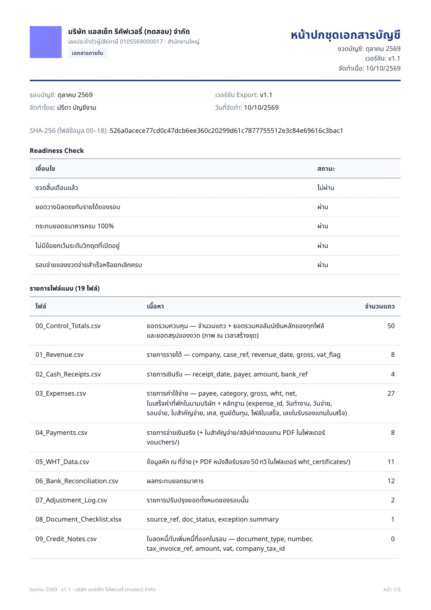

### 18.3 SHA-256 คืออะไร
**SHA-256** คือ "ลายนิ้วมือไฟล์" — ถ้าไฟล์เปลี่ยนแม้ 1 ตัวอักษร ค่านี้จะเปลี่ยนทั้งหมด ใช้ยืนยันกับสำนักงานบัญชีว่าไฟล์ที่ได้รับคือไฟล์เดียวกับที่ระบบสร้าง — แนะนำให้แนบค่า SHA-256 ไปในอีเมลที่ส่งไฟล์ (ค่าในตารางแสดงย่อ ชี้ค้างเพื่อดูเต็ม)

### 18.4 เวอร์ชัน
- สร้างซ้ำในงวดเดียวกันได้เสมอ ระบบ **ขึ้นเวอร์ชันใหม่ให้เอง (v1.0 → v1.1 → v1.2) ไม่เขียนทับของเดิม** · เวอร์ชันเก่ายังดาวน์โหลดซ้ำได้
- แนวทางที่ใช้จริง: กลางเดือนสร้าง **ฉบับร่าง** ให้สำนักงานบัญชีตรวจรูปแบบไฟล์ → หลังสิ้นเดือนสร้าง **ฉบับจริง** แล้ว Mark เฉพาะฉบับจริง

### 18.5 Mark ว่าส่งแล้ว / Mark ว่าตอบรับ
> เป็น **การบันทึกสถานะ** — การส่งไฟล์จริง (เช่น อีเมล) ทำนอกระบบ

1. ส่ง ZIP ให้สำนักงานบัญชีนอกระบบ
2. แถวเวอร์ชันที่ส่ง → **Mark ว่าส่งแล้ว** → หมายเหตุ (เช่น "ส่งอีเมลถึงสำนักงานบัญชี 10/10/2569 แนบ ZIP + SHA-256") → **ยืนยันว่าส่งแล้ว** — สถานะ **ส่งสำนักงานบัญชีแล้ว**
3. เมื่อสำนักงานบัญชีตอบรับ → **Mark ว่าตอบรับ** → หมายเหตุ (เช่น "สำนักงานบัญชีตอบรับแล้ว ยอดรวมควบคุมตรง") → กดปุ่มยืนยัน (ปุ่มชื่อ **ยืนยัน Accepted**) — สถานะ **สำนักงานบัญชีตอบรับแล้ว**

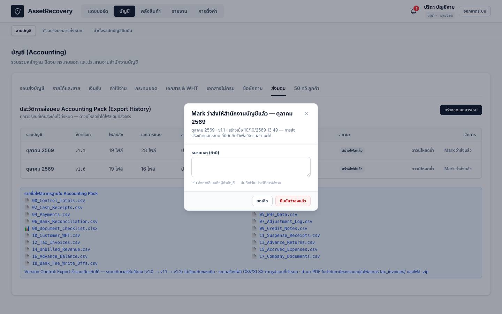


**เคล็ดลับ:** คำแนะนำในช่องหมายเหตุของหน้าต่าง Mark ว่าตอบรับ อาจเป็นตัวอย่างเดียวกับขั้นส่ง — ให้เขียนเรื่องการตอบรับตามจริง

## 19. ปิดงวด — ตรวจความพร้อม · ส่งสำนักงานบัญชี · ล็อกงวด

**วงจรของงวด:** **กำลังรวบรวม** → (ผ่านตรวจความพร้อม) **ส่งสำนักงานบัญชีแล้ว** → **ปิดรอบแล้ว (ล็อก)** · ระบบเปิดรอบของเดือนใหม่ให้อัตโนมัติ

> ส่งและล็อกได้ตั้งแต่ **00:00 น. วันที่ 1 ของเดือนถัดไป** เท่านั้น

### 19.1 ตรวจความพร้อม
1. แท็บ **รอบส่งบัญชี** → แถวงวด → กด **ตรวจความพร้อม**
2. อ่านเงื่อนไข 5 ข้อ (ระบบตรวจสดทุกครั้งที่เปิด) → **ปิดหน้าต่าง**

| ข้อ | เงื่อนไข | ถ้าไม่ผ่าน ทำอะไร |
|---|---|---|
| 1 | **งวดสิ้นเดือนแล้ว** | รอถึงวันที่ 1 ของเดือนถัดไป |
| 2 | **ยอดวางบิลตรงกับรายได้ของรอบ** | แจ้งการเงินตรวจรอบวางบิล/รายได้ที่ยังไม่วางบิล |
| 3 | **กระทบยอดธนาคารครบ 100%** | กลับไปจัดการรายการยังไม่จับคู่ให้เป็น 0 (บทที่ 5–8) |
| 4 | **ไม่มีข้อยกเว้นระดับวิกฤตที่เปิดอยู่** | แก้/ปิดข้อยกเว้น หรือขอผู้บริหารอนุมัติยกเว้น (บทที่ 15, 25) |
| 5 | **รอบจ่ายของงวดจ่ายสำเร็จหรือยกเลิกครบ** | แจ้งการเงินปิดรอบจ่ายที่ค้าง |

นอกจากนี้มีส่วน **คำเตือน — ผ่านได้แต่ควรตรวจก่อน** เช่น ข้อยกเว้นระดับคำเตือน หรือยังรอหนังสือ 50 ทวิ จากลูกค้า

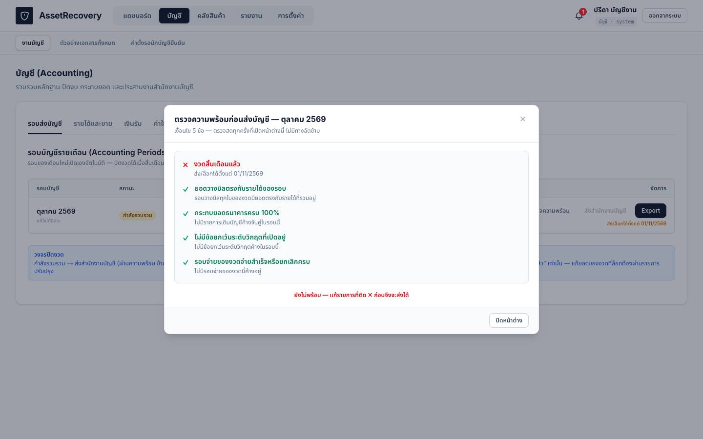

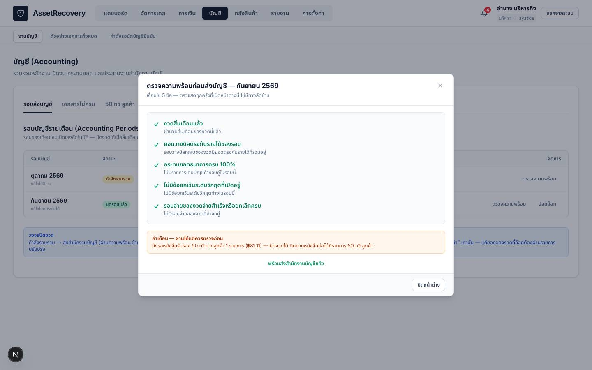
*ภาพจากระบบทดสอบ*

**ข้อควรระวัง:** หลังปิดหน้าต่าง แถวงวดอาจยังแสดง "ยังไม่เคยตรวจความพร้อม" — ไม่ต้องกังวล ระบบตรวจใหม่ทุกครั้งที่เปิดหน้าต่าง และตรวจซ้ำอีกครั้งตอนกดส่ง

### 19.2 ส่งสำนักงานบัญชี
1. แถวงวด (สถานะ **กำลังรวบรวม**) → กด **ส่งสำนักงานบัญชี** (กดได้เมื่อสิ้นเดือนแล้ว)
2. หน้าต่าง **ส่งมอบรอบบัญชีให้สำนักงานบัญชี** → กรอก **เหตุผล** (บังคับ) → **ยืนยันส่งมอบ**
3. ระบบตรวจความพร้อมอีกครั้ง — ไม่ผ่านจะปฏิเสธพร้อมบอกว่าติดข้อไหน

| ช่อง | ตัวอย่าง |
|---|---|
| เหตุผล | ปิดยอดเดือนครบแล้ว ส่งชุดเอกสารให้สำนักงานบัญชีตามรอบ |

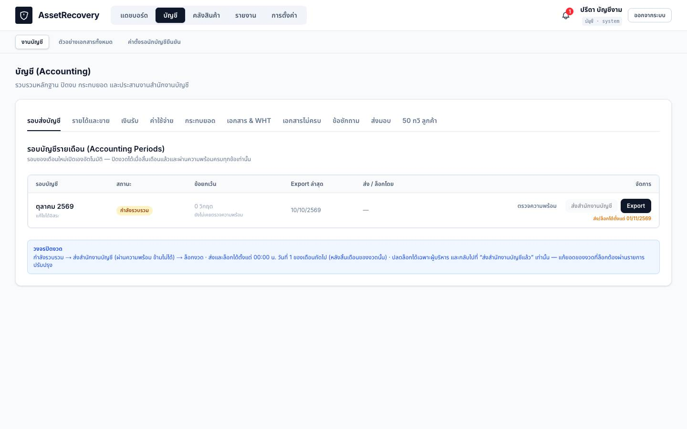

**ผลที่ควรเห็น:** สถานะงวด **ส่งสำนักงานบัญชีแล้ว** · ช่อง "ส่ง / ล็อกโดย" แสดงชื่อผู้ส่ง

### 19.3 ล็อกงวด
**ใครทำได้:** ฝ่ายบัญชี หรือผู้บริหาร · **เมื่อไร:** งวดอยู่สถานะ **ส่งสำนักงานบัญชีแล้ว** และสำนักงานบัญชีตอบรับครบ

1. แถวงวด → กด **ล็อกงวด**
2. หน้าต่าง **ล็อกรอบบัญชี (ปิดงวด)** แจ้งว่า "ล็อกแล้วห้ามแก้ข้อมูลต้นทางโดยตรงทุกกรณี — ต้องแก้ผ่านรายการปรับปรุง พร้อมผู้อนุมัติ"
3. กรอก **เหตุผล** (บังคับ — เช่น "สำนักงานบัญชีตอบรับชุดเอกสารครบแล้ว ปิดงวดตามกำหนด") → **ยืนยันล็อกงวด**

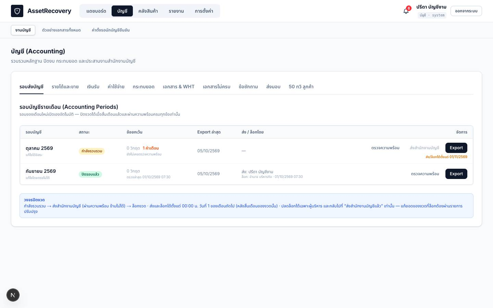
*ภาพจากระบบทดสอบ*

**ผลที่ควรเห็น:** สถานะ **ปิดรอบแล้ว** · ใต้ชื่องวดเขียน "แก้ไขโดยตรงไม่ได้" · ช่อง "ส่ง / ล็อกโดย" แสดงผู้ส่ง ผู้ล็อก และเวลา

**หลังล็อก:** ถ้าพบยอดต้องแก้ ให้แจ้งฝ่ายการเงินสร้าง **รายการปรับปรุง** (ผู้บริหารอนุมัติ — บทที่ 27) · การปลดล็อกทำได้เฉพาะผู้บริหาร (บทที่ 26)

## 20. รายงานหมวดบัญชี A1–A4

ฝ่ายบัญชีเห็นเมนู **รายงาน** เฉพาะหมวดบัญชี 4 รายงาน (รายงานหมวดอื่นเปิดไม่ได้ แม้พิมพ์ที่อยู่หน้าเว็บตรง ๆ ระบบจะพากลับหน้ารวมรายงาน)

| รายงาน | ใช้ทำอะไร |
|---|---|
| **A1 สรุป WHT รายเดือน** | ยอด ภ.ง.ด.3/53/1 รายเดือน · กำหนดยื่น · วิธียื่น · สถานะ — ใช้ประกอบการยื่นแบบ (ไม่นับใบ 50 ทวิ ที่ยกเลิก) |
| **A2 สรุปใบกำกับภาษี** | จำนวนใบ · ยอดก่อน VAT · VAT · ยอดรวม · จำนวนใบยกเลิก — ใช้ตรวจกับรายงานภาษีขาย (VAT เป็นค่าที่บันทึกตอนออกใบ) |
| **A3 สถานะส่งออกชุดข้อมูลบัญชี** | ทุกเวอร์ชันของชุดเอกสารแต่ละงวด · ส่งเมื่อ · ส่งโดย · สถานะ |
| **A4 สรุปข้อยกเว้นรายงวด** | ข้อยกเว้นแยกตามระดับ (วิกฤต/คำเตือน/ข้อมูล) และสถานะ (แก้ไขแล้ว/ผ่านแบบมีข้อยกเว้น/ยังเปิดอยู่) |

**ขั้นตอน:** เมนู **รายงาน** → กดการ์ด → เลือกช่วงเวลา (เดือนนี้ / เดือนที่แล้ว / ไตรมาสนี้ / ปีนี้ / กำหนดเอง) → **ส่งออก Excel** หรือ **ส่งออก PDF**

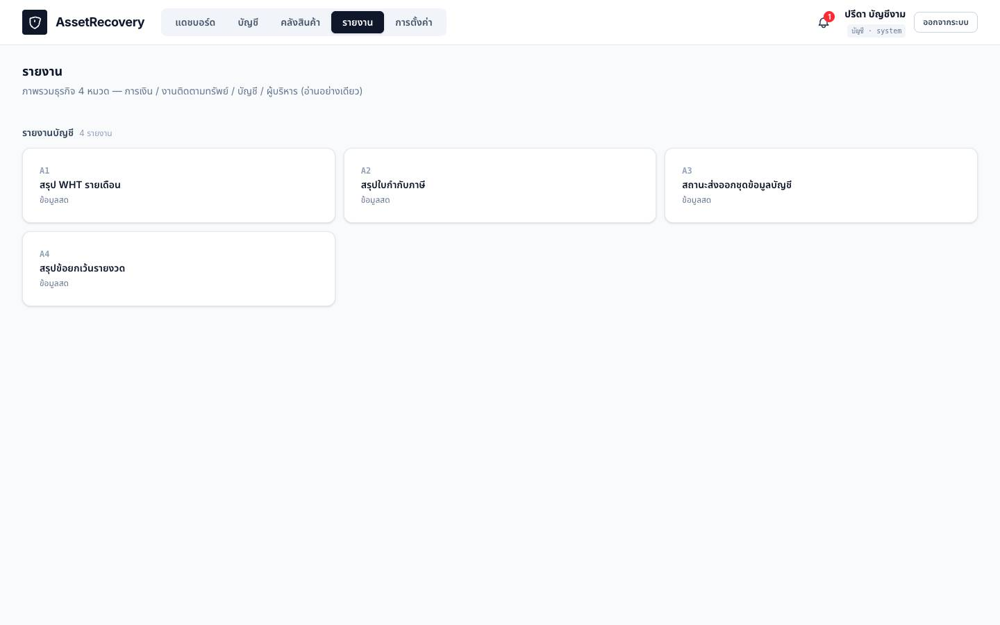

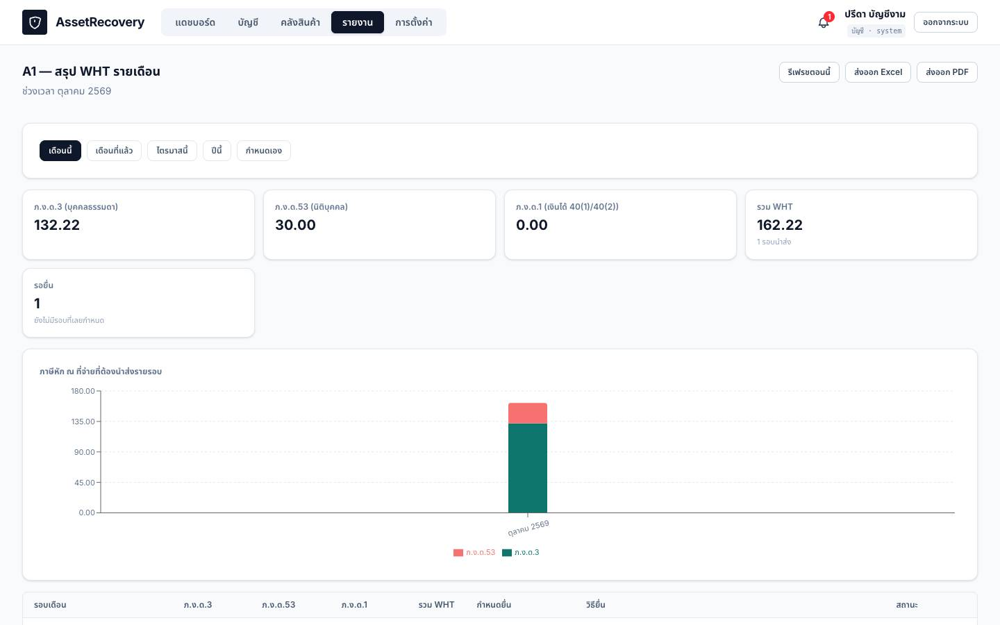

**เคล็ดลับ:** รายงานหมวด A คำนวณสดทุกครั้ง · ถ้าคำอธิบายใต้ตาราง A3 ไม่ตรงกับตัวเลข (เช่น จำนวนไฟล์/เอกสารแนบ) ให้ยึดตารางประวัติในแท็บ **ส่งมอบ** เป็นหลัก

---

# ภาค ข — ผู้บริหาร

**สิ่งที่ผู้บริหารเห็นในเมนูบัญชี:** 3 แท็บ — **รอบส่งบัญชี · เอกสารไม่ครบ · 50 ทวิ ลูกค้า** · งานที่ล็อกไว้ให้ผู้บริหารเท่านั้น (มอบให้บทบาทอื่นไม่ได้) มี 3 อย่าง: **อนุมัติรายการปรับปรุงของงวดที่ล็อกแล้ว · อนุมัติยกเว้นข้อยกเว้น · ปลดล็อกงวด**

## 21. แดชบอร์ดผู้บริหาร

**ขั้นตอน**
1. เข้าสู่ระบบ ระบบเปิด **แดชบอร์ด**
2. ดูการ์ด **ภาพรวมธุรกิจ** ของเดือน: **รายได้รวม · Margin % · % สำเร็จ · AR ค้างรับ** (ลิงก์ **ดูรายงาน KPI ภาพรวม** มุมขวา)
3. กล่อง **งานรอดำเนินการของฉัน** — เช่น "1 รายการปรับปรุงรออนุมัติ" → กด **ไปที่ การเงิน › ปรับปรุง**
4. กล่อง **เคสตามสถานะ** และ **แจ้งเตือนล่าสุด**

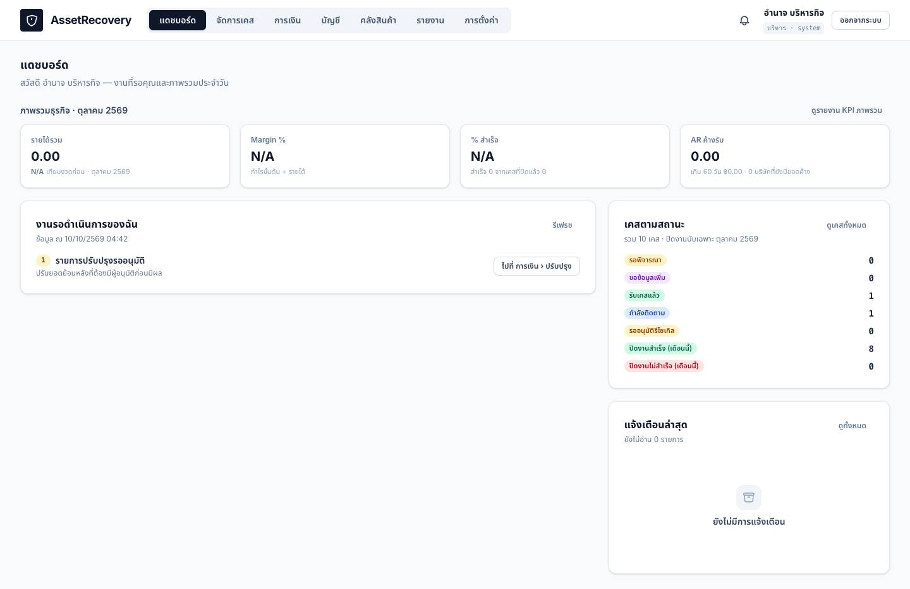

**ข้อควรระวัง**
- ตัวเลขบางการ์ดใช้ข้อมูลสรุปรายวัน — ถ้าเห็น **N/A** หรือ 0 ทั้งที่มีเคสปิดแล้ว ให้เปิดรายงาน **E1 KPI ภาพรวม** แล้วกด **รีเฟรชตอนนี้** จากนั้นกลับมาที่แดชบอร์ด
- Margin % แสดง **N/A** เมื่อรายได้เป็น 0 (ไม่หารด้วยศูนย์)

## 22. รายงาน 17 ตัว และการส่งออก

**ขั้นตอน**
1. เมนู **รายงาน** — หน้ารวม 4 หมวด: **การเงิน F1–F5 · งานติดตามทรัพย์ O1–O5 · บัญชี A1–A4 · ผู้บริหาร E1–E3**
2. กดการ์ดรายงาน → เลือกช่วงเวลา (เดือนนี้ / เดือนที่แล้ว / ไตรมาสนี้ / ปีนี้ / กำหนดเอง) · บางรายงานกรองบริษัทไฟแนนซ์/ทีมได้
3. รายงานที่ใช้ข้อมูลสรุปรายวัน (เช่น F1 F2 F3 E1) กด **รีเฟรชตอนนี้** เพื่อคำนวณใหม่ (รีเฟรชซ้ำได้ทุก 5 นาที)
4. กด **ส่งออก Excel** หรือ **ส่งออก PDF**

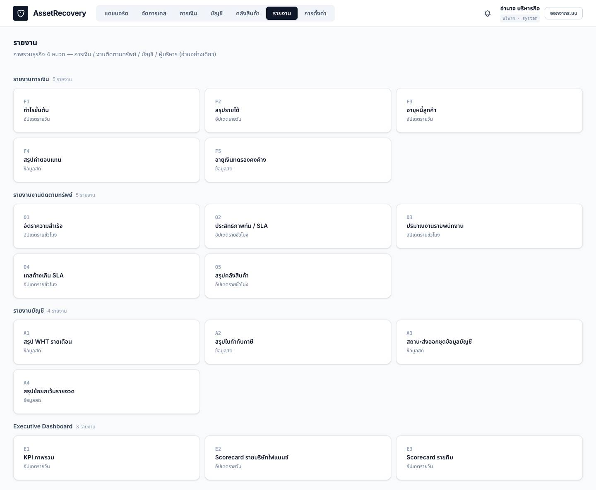


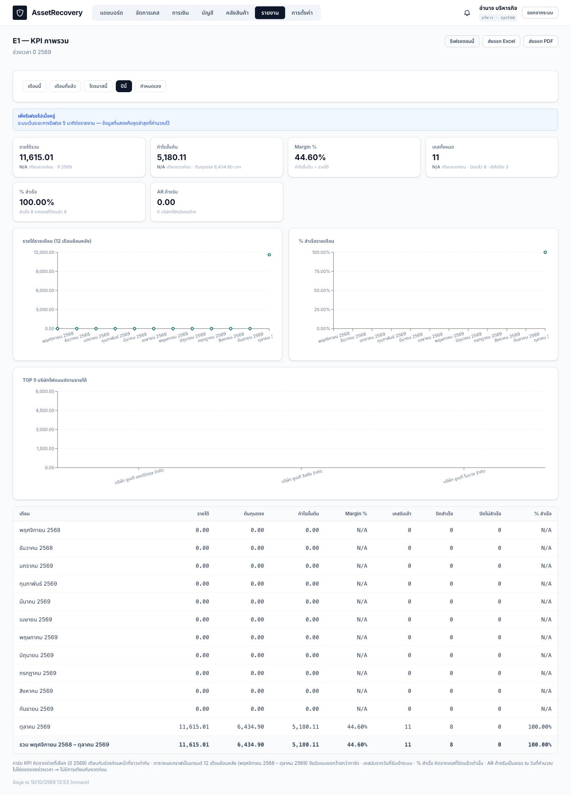

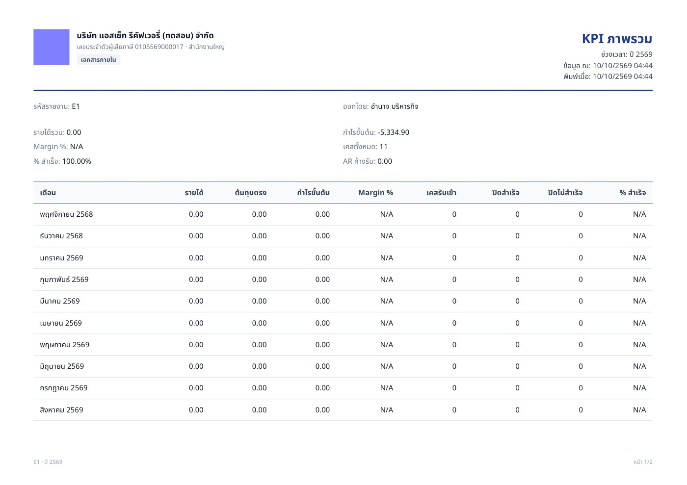

**ผลที่ควรเห็น:** ไฟล์ชื่อแบบ `F1_กำไรขั้นต้น_<วันที่>_<เวลา>.xlsx` / `E1_KPI-ภาพรวม_<วันที่>_<เวลา>.pdf` ดาวน์โหลดภายในไม่กี่วินาที

**อ่านรายงานอย่างไร (ข้อสังเกตสำคัญ)**
- ทุกยอดในรายงานเป็น **ยอดหลังรายการปรับปรุงที่อนุมัติแล้ว**
- รายได้ใน F1/F2/E1 อาจต่างจากยอดใบกำกับภาษี (A2) ได้ เฉพาะเมื่อมีรายการปรับปรุงที่ **ยังรอใบลดหนี้** — F2 แสดงบรรทัดกระทบยอดให้เห็น (ใบกำกับ − รายการที่รอใบลดหนี้ = รายได้ในรายงาน)
- ต้นทุนค่าตอบแทนใน F4 เป็นยอดตามรอบจ่าย อาจต่างจากต้นทุนตรงใน F1 ถ้ามีรายการปรับปรุงค่าใช้จ่าย
- รายชื่อรายงานครบทั้ง 17 ตัวและใช้ทำอะไร ดู [ภาคผนวก 3](#ภาคผนวก-3--ตารางรายงาน-17-ตัว)

## 23. คิวอนุมัติรายการเบิกยอดสูง

**ที่มา:** ตามค่าตั้งเริ่มต้น รายการเบิก **ไม่เกิน 5,000 บาท** อนุมัติ 2 ขั้น (ผู้จัดการทีม → การเงิน) · **เกิน 5,000 บาท** มีขั้นที่ 3 คือ **ผู้บริหาร** (ผู้ดูแลระบบปรับเพดานได้)

**ขั้นตอน**
1. เมนู **การเงิน** → แท็บ **รออนุมัติ** — ตาราง "รายการเบิก (Claims) — อนุมัติหลายขั้น"
2. แถวที่ถึงขั้นของผู้บริหาร → กด **รายละเอียด** / **ดูสูตร** เพื่อตรวจที่มาของยอด
3. เลือกอย่างใดอย่างหนึ่ง:

| ปุ่ม | ใช้เมื่อ | ผล |
|---|---|---|
| **อนุมัติขั้น 3** | ยอดและหลักฐานถูกต้อง | อนุมัติแล้ว → เข้ารอบจ่ายได้ |
| **ตีกลับ** + เหตุผล | เอกสาร/ใบเสร็จไม่ถูกต้อง ให้ผู้เบิกแก้ | กลับไป "ต้องแก้ไข" และ **เริ่มอนุมัติขั้นที่ 1 ใหม่ทั้งหมด** |
| **ปฏิเสธ** + เหตุผล | ไม่จ่ายแน่นอน | ปฏิเสธถาวร ผู้เบิกส่งใหม่ไม่ได้ |

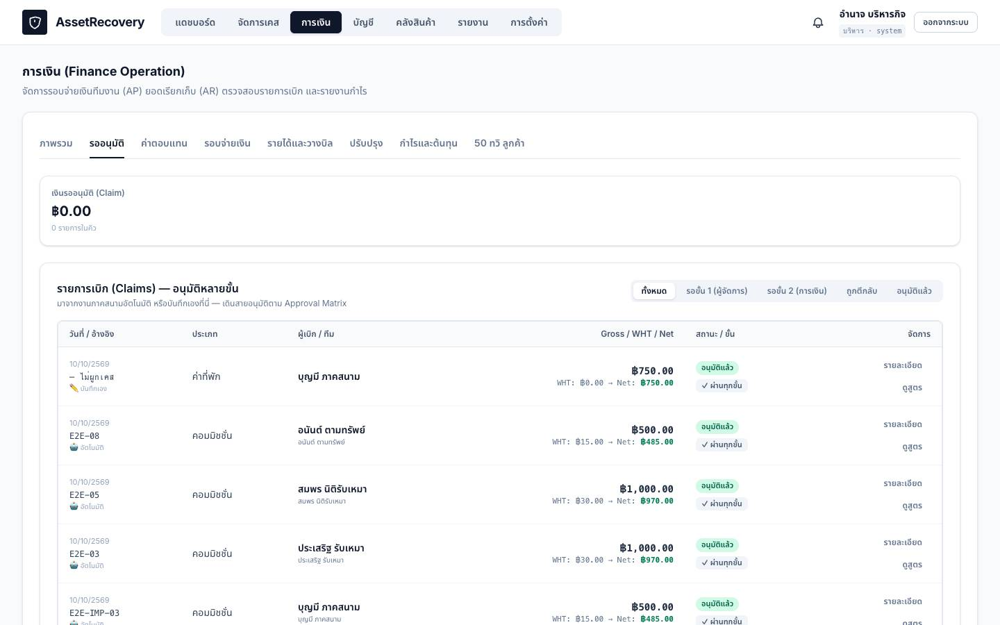

**เคล็ดลับ:** ถ้าสงสัย **หลักฐานการปิดงาน** (ไม่ใช่เอกสารค่าใช้จ่าย) อย่าตีกลับรายการเบิก — ให้แจ้งเจ้าหน้าที่อนุมัติเคส

## 24. อนุมัติรายการปรับปรุง (Adjustment) ของงวดที่ยังไม่ล็อก

**หลักการ:** รายการปรับปรุง **ไม่แก้รายการต้นทาง** แต่สร้างรายการชดเชยใหม่ · **ฝ่ายการเงินเป็นผู้สร้าง** (ฝ่ายบัญชีสร้างไม่ได้) · ผู้อนุมัติขึ้นกับสถานะงวดของรายการต้นทาง:

| สถานะงวดของรายการต้นทาง | ต้องอนุมัติโดย |
|---|---|
| กำลังรวบรวม | การเงิน (อนุมัติเองได้) |
| ส่งสำนักงานบัญชีแล้ว | การเงิน **และ** ผู้บริหาร |
| ปิดรอบแล้ว (ล็อก) | **ผู้บริหารเท่านั้น** (บทที่ 27) |

**ขั้นตอน**
1. แดชบอร์ด → การ์ด "รายการปรับปรุงรออนุมัติ" → **ไปที่ การเงิน › ปรับปรุง** (หรือเมนู **การเงิน** → แท็บ **ปรับปรุง**)
2. อ่านแถว: อ้างอิง · ประเภท · เหตุผล · ยอดปรับ · สถานะรอบ · สถานะรายการ (เช่น "รออนุมัติ — รอ: การเงิน")
3. กด **✓ อนุมัติ** → กรอก **หมายเหตุของผู้อนุมัติ** (ไม่บังคับ) → **ยืนยันอนุมัติ** · หรือกด **ปฏิเสธ** + เหตุผล

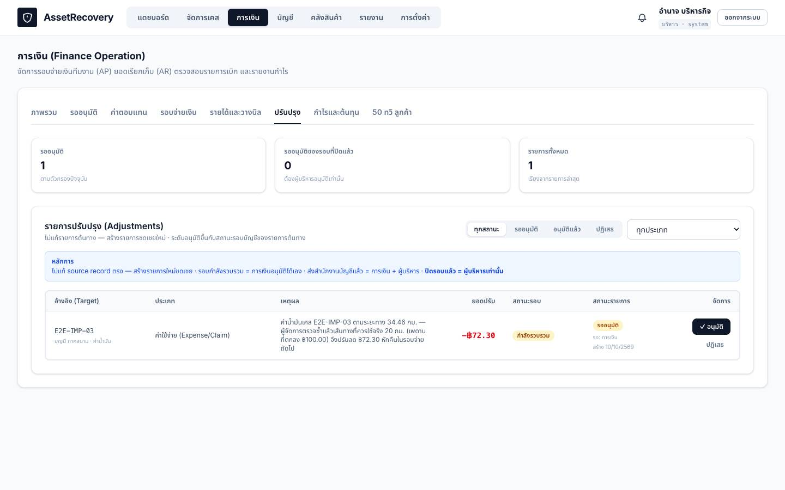

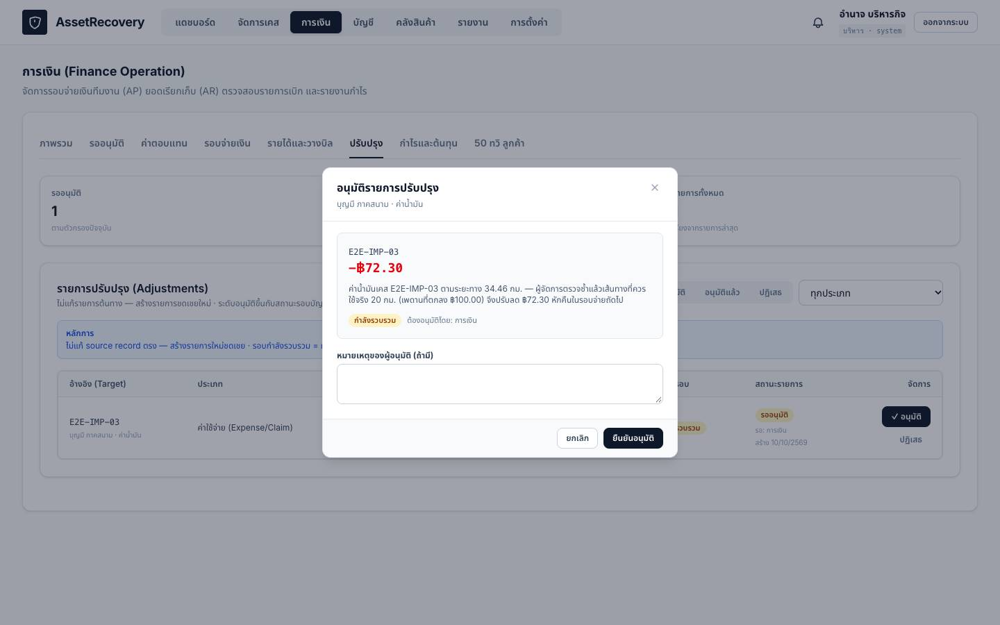

**ผลที่ควรเห็น:**
- ถ้ายังต้องรอผู้อนุมัติอื่น: "บันทึกการอนุมัติแล้ว — ยังรออนุมัติจาก: การเงิน"
- เมื่อครบ: "อนุมัติรายการปรับปรุงแล้ว — …" · สถานะ **อนุมัติแล้ว โดย … · วันเวลา** · รายงานที่เกี่ยวข้องเปลี่ยนตามยอดปรับ

**ข้อควรระวัง**
- งวด **กำลังรวบรวม** การอนุมัติของผู้บริหารยังไม่พอ ต้องให้การเงินอนุมัติด้วย — หลังผู้บริหารกดแล้วแถวอาจยังแสดงปุ่ม **✓ อนุมัติ** อยู่ **ไม่ต้องกดซ้ำ** ดูคำว่า "รอ: การเงิน" ในสถานะรายการ
- รายการปรับปรุง **ลดรายได้** ของบิลที่ **รับชำระครบแล้ว** จะบันทึกใบลดหนี้ไม่ได้ (ดูบทที่ 12) — ก่อนอนุมัติให้ถามการเงินว่าบิลยังมียอดค้างหรือไม่ เพราะอนุมัติแล้วยกเลิกไม่ได้

## 25. อนุมัติยกเว้นข้อยกเว้น

**ใช้เมื่อ:** ข้อยกเว้น (โดยเฉพาะระดับวิกฤตที่บล็อกการปิดงวด) **แก้ต้นเหตุไม่ได้หรือไม่ทันในงวดนี้** และผู้บริหารยอมรับความเสี่ยง

**ขั้นตอน**
1. เมนู **บัญชี** → แท็บ **เอกสารไม่ครบ** → แถวข้อยกเว้น → กด **อนุมัติยกเว้น**
2. อ่านกล่องเตือน "นี่ไม่ใช่การแก้ปัญหา … ปลดบล็อกเฉพาะรอบบัญชีนี้"
3. กรอก **เหตุผลที่ต้องยกเว้น** (บังคับ) → **ยืนยันอนุมัติยกเว้น**

| ช่อง | ตัวอย่าง | หมายเหตุ |
|---|---|---|
| เหตุผลที่ต้องยกเว้น | ยอดไม่มีสาระสำคัญ (฿750) — ให้สำนักงานบัญชีบันทึกเป็นรายจ่ายต้องห้าม | บังคับ · เก็บในประวัติ |

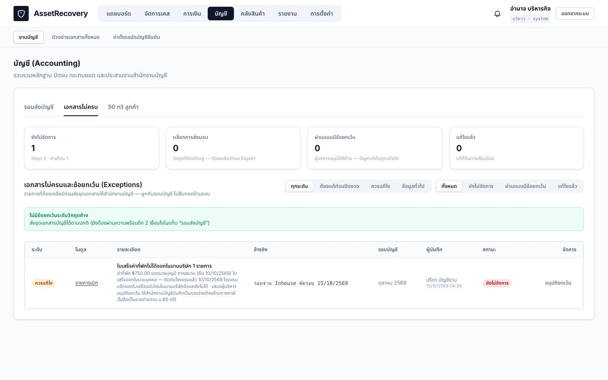

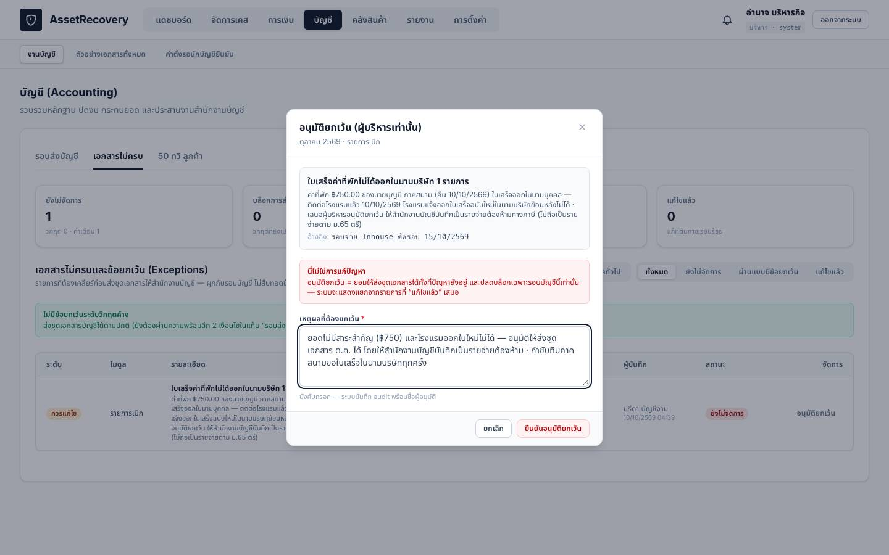

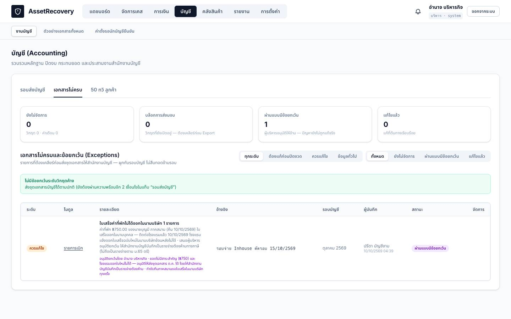

**ผลที่ควรเห็น:** ข้อความ "อนุมัติยกเว้นสำหรับ … แล้ว — ปลดบล็อกเฉพาะรอบบัญชีนี้" · สถานะ **ผ่านแบบมีข้อยกเว้น** · ตรวจความพร้อมขึ้น "0 วิกฤต"

**ข้อควรระวัง:** การอนุมัติยกเว้น **ไม่สืบทอดข้ามงวด** — เดือนถัดไปถ้ายังไม่แก้ ต้องบันทึกและอนุมัติใหม่ · รายงาน A4 นับ "ผ่านแบบมีข้อยกเว้น" แยกจาก "แก้ไขแล้ว" เพราะต้นเหตุยังอยู่

## 26. ล็อกงวด และปลดล็อกงวด

**แท็บ:** เมนู **บัญชี** → **รอบส่งบัญชี** — ตารางรอบบัญชีรายเดือน (สถานะ · ข้อยกเว้น · Export ล่าสุด · ส่ง/ล็อกโดย · จัดการ)

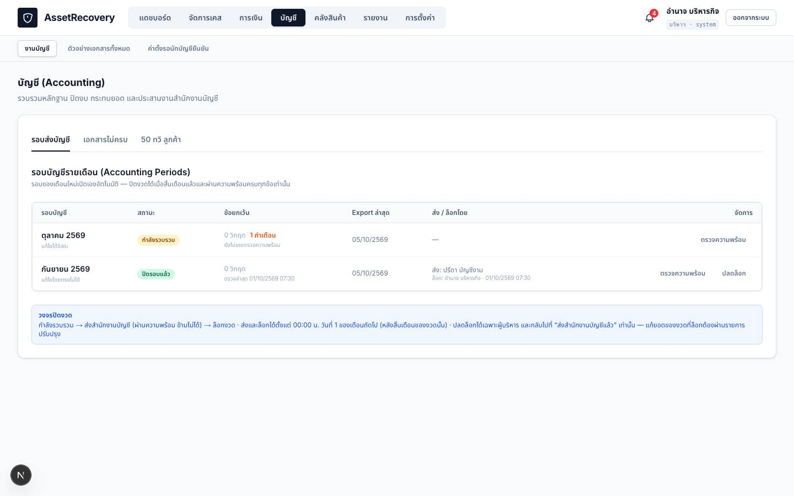
*ภาพจากระบบทดสอบ*

### 26.1 ล็อกงวด
ผู้บริหารล็อกงวดได้เช่นเดียวกับฝ่ายบัญชี — ขั้นตอนตามบทที่ 19.3 (งวดต้องอยู่สถานะ **ส่งสำนักงานบัญชีแล้ว** · กรอกเหตุผล · **ยืนยันล็อกงวด**)

### 26.2 ปลดล็อกงวด (ผู้บริหารเท่านั้น)

**ใช้เมื่อ:** จำเป็นต้องเปิดงวดที่ล็อกแล้วกลับมาทำงาน เช่น พบรายได้ตกหล่นจำนวนมาก — ถ้าแก้เพียงบางยอด **ให้ใช้รายการปรับปรุงแทน** (บทที่ 27) โดยไม่ต้องปลดล็อก

**ขั้นตอน**
1. แถวงวดที่ **ปิดรอบแล้ว** → กด **ปลดล็อก**
2. หน้าต่าง **ปลดล็อกรอบบัญชี (ผู้บริหารเท่านั้น)** แจ้งว่า "ปลดล็อกแล้วรอบกลับไปสถานะ "ส่งสำนักงานบัญชีแล้ว" (ไม่กลับไปกำลังรวบรวม)"
3. กรอก **เหตุผล** (บังคับ) → **ยืนยันปลดล็อก** (หรือ **ยกเลิก** ถ้าเปลี่ยนใจ)

| ช่อง | ตัวอย่าง |
|---|---|
| เหตุผล | พบรายได้ตกหล่นของงวดนี้ ต้องเปิดแก้ผ่านรายการปรับปรุงตามมติผู้บริหาร |

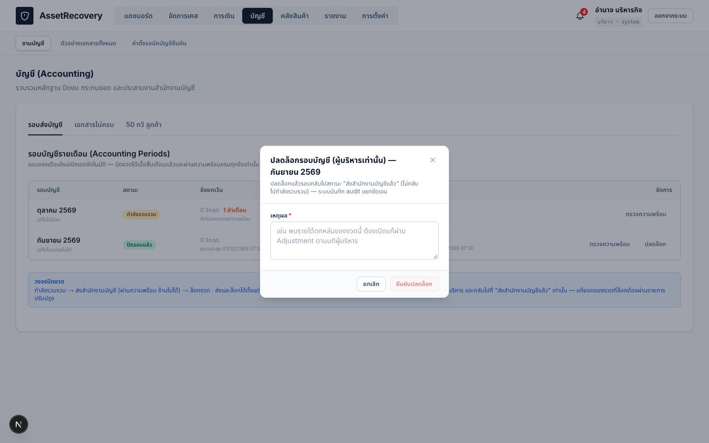
*ภาพจากระบบทดสอบ*

**ผลที่ควรเห็น:** สถานะงวดกลับเป็น **ส่งสำนักงานบัญชีแล้ว** · ระบบบันทึกการปลดล็อกแยกไว้ชัดเจน · เมื่อแก้เสร็จต้อง **ล็อกงวดใหม่**

**ข้อควรระวัง:** การปลดล็อกกระทบตัวเลขที่ส่งสำนักงานบัญชีไปแล้ว — แจ้งสำนักงานบัญชีทุกครั้ง และสร้าง Accounting Pack เวอร์ชันใหม่หลังแก้

## 27. อนุมัติรายการปรับปรุงของงวดที่ล็อกแล้ว

**ที่มา:** ฝ่ายการเงินสร้างรายการปรับปรุงโดยเลือกรายการต้นทางที่อยู่ในงวด **ปิดรอบแล้ว** — หน้าต่างสร้างแสดง "สถานะรอบบัญชีของรายการต้นทาง: **ปิดรอบแล้ว** · ต้องผ่านการอนุมัติ: **บริหาร**" และเตือนว่ารายการนี้แก้ยอดตรงไม่ได้แล้ว รายการปรับปรุงคือช่องทางเดียว

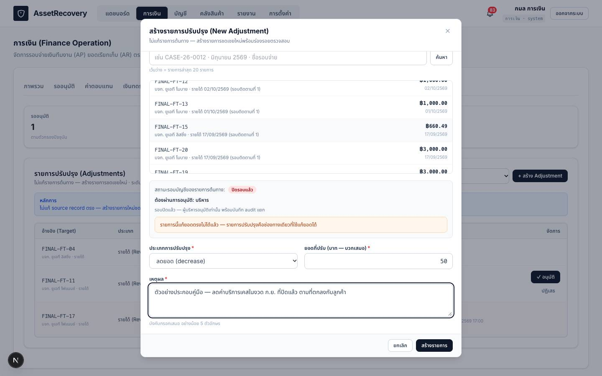
*ภาพจากระบบทดสอบ*

**ขั้นตอน (ผู้บริหาร)**
1. เมนู **การเงิน** → แท็บ **ปรับปรุง** — การ์ด **รออนุมัติของรอบที่ปิดแล้ว** บอกจำนวนที่รอคุณ
2. แถวที่สถานะรอบ **ปิดรอบแล้ว · ต้องผู้บริหาร** → อ่านเหตุผลและยอด
3. กด **✓ อนุมัติ** → หมายเหตุ (ไม่บังคับ) → **ยืนยันอนุมัติ** · หรือ **ปฏิเสธ** + เหตุผล

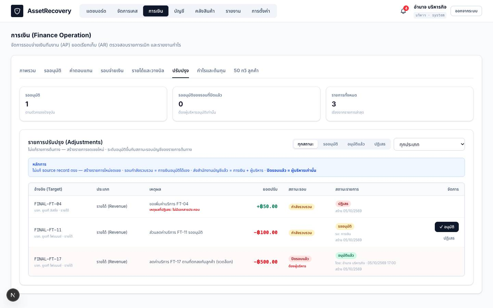
*ภาพจากระบบทดสอบ*

**ผลที่ควรเห็น:** สถานะ **อนุมัติแล้ว โดย <ชื่อผู้บริหาร> · วันเวลา** · ยอดในรายงานเปลี่ยนตามการปรับ โดยข้อมูลต้นทางของงวดที่ล็อกไม่ถูกแก้

**เคล็ดลับ:** ถ้าเป็นการลดรายได้ที่ออกใบกำกับไปแล้ว ต้องมี **ใบลดหนี้** ตามมา — ตรวจว่าบิลยังมียอดค้างหรือไม่ก่อนอนุมัติ (บทที่ 12)

## 28. ดูสิทธิ์ของบทบาทผู้บริหาร

**ขั้นตอน:** เมนู **การตั้งค่า** → **สิทธิ์การใช้งาน** → แถว **บริหาร** → **กำหนดสิทธิ์**

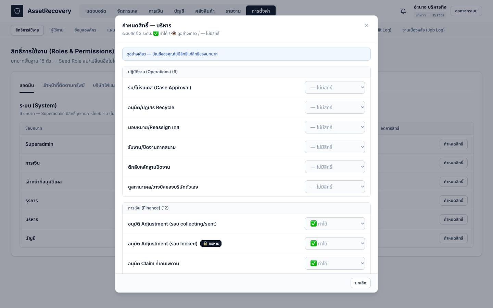

**ผลที่ควรเห็น:** หน้าต่างแจ้ง "ดูอย่างเดียว — บัญชีของคุณไม่มีสิทธิ์แก้สิทธิ์ของบทบาท" · รายการที่มีกุญแจ 🔒 คือสิทธิ์ที่ล็อกไว้กับผู้บริหาร: อนุมัติรายการปรับปรุง (งวดที่ล็อก) · อนุมัติยกเว้นข้อยกเว้น · ปลดล็อกรอบบัญชี — ผู้ดูแลระบบก็มอบสิทธิ์เหล่านี้ให้บทบาทอื่นไม่ได้

---

# ภาคผนวก

## ภาคผนวก 1 — คำศัพท์

| คำ | ความหมาย |
|---|---|
| statement | รายการเดินบัญชีธนาคาร ดาวน์โหลดจากธนาคารแล้วนำเข้าระบบ |
| กระทบยอด | ยืนยันว่ารายการเดินบัญชีแต่ละบรรทัดผูกกับเอกสารในระบบ หรือมีเหตุผลรองรับ |
| จับคู่อัตโนมัติ / โดยเจ้าหน้าที่ | ระบบจับคู่ให้ตอนนำเข้า / ผู้ใช้ยืนยันคู่ที่เสนอหรือจับคู่ Manual |
| ปิดรายการ | ระบุว่ารายการเดินบัญชีนั้นไม่ใช่รายรับ-จ่ายของระบบ พร้อมเหตุผล (สถานะสุดท้าย) |
| เงินรับรอตรวจสอบ | เงินเข้าที่ยังไม่รู้ที่มา ยังไม่รับรู้รายได้และไม่ลดยอดค้างรับ |
| รอบวางบิล (BL) | ใบแจ้งหนี้/ใบวางบิลที่การเงินส่งให้บริษัทไฟแนนซ์ — เลข BL-ปี พ.ศ.-ลำดับ |
| ใบเสร็จรับเงิน/ใบกำกับภาษี (INV) | ออกต่อเงินรับแต่ละครั้ง — เลขเดินต่อเนื่อง |
| ใบลดหนี้ (CN) / ใบเพิ่มหนี้ | เอกสารที่สำนักงานบัญชีออกเพื่อปรับมูลค่าหลังออกใบกำกับ — ฝ่ายบัญชีนำมาบันทึก |
| 50 ทวิ (บริษัทออก) | หนังสือรับรองการหักภาษี ณ ที่จ่ายที่บริษัทออกให้ผู้รับค่าตอบแทน — เลข WHT-ปี พ.ศ.-ลำดับ |
| 50 ทวิ ลูกค้า | หนังสือรับรองที่บริษัทไฟแนนซ์หักภาษีเราแล้วส่งมา |
| ภ.ง.ด.3 / ภ.ง.ด.53 / ภ.ง.ด.1 | แบบนำส่งภาษีหัก ณ ที่จ่าย ของผู้รับที่เป็นบุคคลธรรมดา / นิติบุคคล / ลูกจ้าง |
| ข้อยกเว้น | ปัญหาเอกสาร/ข้อมูลของงวดที่ต้องติดตาม |
| อนุมัติยกเว้น | ผู้บริหารยอมให้ข้อยกเว้นผ่านเฉพาะงวดนี้ โดยต้นเหตุยังไม่ถูกแก้ |
| Cost Center | ศูนย์ต้นทุน เช่น CC-IN ทีมใน · CC-OUT ทีมนอก |
| Accounting Pack | ชุดเอกสารบัญชีรายเดือน (ZIP) ส่งสำนักงานบัญชี |
| SHA-256 | ลายนิ้วมือไฟล์ ใช้ยืนยันว่าไฟล์ไม่ถูกเปลี่ยน |
| รายการปรับปรุง (Adjustment) | รายการชดเชยเพื่อแก้ยอด โดยไม่แก้รายการต้นทาง |
| งวด / รอบบัญชี | ข้อมูลบัญชีของ 1 เดือนปฏิทิน |

## ภาคผนวก 2 — สถานะงวดและสถานะเอกสาร

### สถานะงวด (รอบบัญชี)
| สถานะ | ความหมาย | แก้ข้อมูลได้ไหม | ไปต่ออย่างไร |
|---|---|---|---|
| **กำลังรวบรวม** | งวดเปิดอยู่ ("แก้ไขได้อิสระ") | ได้ | ส่งสำนักงานบัญชี (หลังสิ้นเดือน + ผ่านความพร้อม) |
| **ส่งสำนักงานบัญชีแล้ว** | ส่งข้อมูลให้สำนักงานบัญชีแล้ว | แก้ยอดผ่านรายการปรับปรุง (การเงิน + ผู้บริหาร) | ล็อกงวด |
| **ปิดรอบแล้ว** | ล็อกแล้ว ("แก้ไขโดยตรงไม่ได้") | ไม่ได้ทุกกรณี — ใช้รายการปรับปรุง (ผู้บริหาร) | ผู้บริหารปลดล็อก → กลับเป็น "ส่งสำนักงานบัญชีแล้ว" |

### สถานะรายการเดินบัญชี (กระทบยอด)
| สถานะ | ความหมาย | สถานะสุดท้าย? |
|---|---|---|
| ยังไม่จับคู่ | ต้องจัดการ — ต้องเป็น 0 ก่อนส่งงวด | — |
| จับคู่อัตโนมัติ | ระบบจับคู่ให้ตอนนำเข้า | |
| จับคู่โดยเจ้าหน้าที่ | ยืนยันคู่ที่เสนอ หรือจับคู่ Manual | |
| ปิดรายการแล้ว | ไม่ใช่รายรับ-จ่ายของระบบ (มีเหตุผล) | ใช่ |
| เงินรับรอตรวจสอบ | รอรู้ที่มา (ยังจับคู่หรือคืนเงินได้) | |
| คืนเงินผู้โอนแล้ว | คืนผู้โอนแล้ว (มีสลิป) | ใช่ |

### สถานะเอกสาร
| เอกสาร | สถานะ |
|---|---|
| เงินรับ | ยังไม่ออก → ออกแล้ว (มีเลข INV) · ถ้าใบถูกยกเลิก → ปุ่ม "ออกใบแทน" |
| ใบเสร็จรับเงิน/ใบกำกับภาษี | ใช้งาน · ยกเลิก (สถานะสุดท้าย — ยังอยู่ในทะเบียน) |
| ป้ายบนรายการขาย | รอใบลดหนี้ (มีรายการปรับปรุงลดยอดที่ยังไม่บันทึกใบลดหนี้) |
| 50 ทวิ ที่บริษัทออก | ใช้งาน · ยกเลิก · ป้าย "ออกแทน WHT-…" บนใบแทน |
| รอบนำส่ง ภ.ง.ด. | รอยื่นแบบ · ยื่นแล้ว · ต้องยื่นเพิ่มเติม |
| 50 ทวิ ลูกค้า | รอ 50 ทวิ จากลูกค้า · ได้รับแล้ว |
| ข้อยกเว้น | ยังไม่จัดการ · แก้ไขแล้ว · ผ่านแบบมีข้อยกเว้น |
| ข้อซักถาม | รอตอบ · ตอบแล้ว |
| Accounting Pack | สร้างไฟล์แล้ว · ส่งสำนักงานบัญชีแล้ว · สำนักงานบัญชีตอบรับแล้ว |
| รายการปรับปรุง | รออนุมัติ (รอ: …) · อนุมัติแล้ว · ปฏิเสธ |

## ภาคผนวก 3 — ตารางรายงาน 17 ตัว

| รหัส | ชื่อ | ใช้ทำอะไร | อัปเดต | ใครเห็น |
|---|---|---|---|---|
| F1 | กำไรขั้นต้น | รายได้ − ต้นทุนตรง แยกบริษัทไฟแนนซ์/ทีม เจาะรายเคสได้ (เคสปิดไม่สำเร็จที่มีต้นทุนนับด้วย) | รายวัน | บริหาร · การเงิน |
| F2 | สรุปรายได้ | รายได้รายเดือน จำนวนเคส รายได้ต่อเคส การเปลี่ยนแปลงเทียบเดือนก่อน + กระทบยอดกับใบกำกับ | รายวัน | บริหาร · การเงิน |
| F3 | อายุหนี้ลูกค้า | ยอดค้างรับแยกช่วงอายุ 0–30 / 31–60 / 61–90 / 90+ วัน ต่อบริษัท (ภาษีที่ลูกค้าหักถือว่าชำระแล้ว) | รายวัน | บริหาร · การเงิน |
| F4 | สรุปค่าตอบแทน | ค่าตอบแทน · ค่าใช้จ่ายตามใบเสร็จ · ภาษีหัก ณ ที่จ่าย · ยอดสุทธิ แยกทีม | สด | บริหาร · การเงิน |
| F5 | อายุเงินทดรองคงค้าง | เงินทดรองที่ยังไม่เคลียร์ อายุ และสถานะเกินกำหนด | สด | บริหาร · การเงิน |
| O1 | อัตราความสำเร็จ | % เคสสำเร็จต่อทีม (คิดจากเคสที่ปิดแล้ว) | รายชั่วโมง | บริหาร |
| O2 | ประสิทธิภาพทีม / SLA | เวลาเฉลี่ยตั้งแต่รับเคสถึงปิดงาน · % ปิดภายใน SLA | รายชั่วโมง | บริหาร |
| O3 | ปริมาณงานรายพนักงาน | เคสที่รับ · ปิดสำเร็จ/ไม่สำเร็จ · ค้าง ต่อคน | รายชั่วโมง | บริหาร |
| O4 | เคสค้างเกิน SLA | เคสที่ยังไม่ปิดและเกินเกณฑ์ + ประมาณการรายได้ | รายชั่วโมง | บริหาร |
| O5 | สรุปคลังสินค้า | เครื่องรอรับเข้า · ในคลัง · รอส่งมอบ · ส่งมอบแล้ว ต่อบริษัท | รายชั่วโมง | บริหาร · การเงิน · บัญชี (ตามสิทธิ์) |
| A1 | สรุป WHT รายเดือน | ยอด ภ.ง.ด.3/53/1 กำหนดยื่น และสถานะ | สด | บริหาร · บัญชี |
| A2 | สรุปใบกำกับภาษี | จำนวนใบ ยอดก่อน VAT · VAT · รวม · ใบยกเลิก | สด | บริหาร · บัญชี |
| A3 | สถานะส่งออกชุดข้อมูลบัญชี | ทุกเวอร์ชันของ Accounting Pack และสถานะ | สด | บริหาร · บัญชี |
| A4 | สรุปข้อยกเว้นรายงวด | ข้อยกเว้นแยกระดับ/สถานะ ต่องวด | สด | บริหาร · บัญชี |
| E1 | KPI ภาพรวม | รายได้ · กำไร · Margin · เคสรับเข้า/ปิด · % สำเร็จ · AR รายเดือน (ค่าเริ่มต้นทั้งปี) | รายวัน | บริหาร |
| E2 | Scorecard รายบริษัทไฟแนนซ์ | เคส · % สำเร็จ · รายได้ · กำไร · AR ค้าง · เทรนด์ ต่อบริษัท | — | บริหาร |
| E3 | Scorecard รายทีม | เคส · % สำเร็จ · เวลาเฉลี่ย · ต้นทุนตรง · กำไร ต่อทีม | — | บริหาร |

ทุกรายงาน: เลือกช่วงเวลาได้ · **ส่งออก Excel** และ **ส่งออก PDF** · รายงานที่อัปเดตรายวันกด **รีเฟรชตอนนี้** ได้ (เว้นระยะ 5 นาที)

## ภาคผนวก 4 — ไฟล์ใน Accounting Pack

| ไฟล์ | เนื้อหา |
|---|---|
| 00_Cover_Sheet.pdf | หน้าปก — งวด · เวอร์ชัน · ยอดควบคุม |
| 00_Control_Totals.csv | ยอดควบคุม (รายได้ · เงินรับ · ค่าใช้จ่าย · VAT ขาย · ภาษีหัก ณ ที่จ่าย ฯลฯ) ใช้กระทบกับไฟล์อื่น |
| 01_Revenue.csv | รายได้ |
| 02_Cash_Receipts.csv | เงินรับ |
| 03_Expenses.csv | ค่าใช้จ่าย (รวมคอลัมน์ศูนย์ต้นทุน) |
| 04_Payments.csv | การจ่ายเงิน |
| 05_WHT_Data.csv | ข้อมูลภาษีหัก ณ ที่จ่าย (ใช้ทำใบแนบ ภ.ง.ด.) |
| 06_Bank_Reconciliation.csv | ผลกระทบยอดธนาคาร |
| 07_Adjustment_Log.csv | รายการปรับปรุง |
| 08_Document_Checklist.xlsx | รายการตรวจเอกสาร |
| 09_Credit_Notes.csv | ใบลดหนี้/เพิ่มหนี้ |
| 10_Customer_WHT.csv | 50 ทวิ ที่ลูกค้าหัก |
| 11_Suspense_Receipts.csv | เงินรับรอตรวจสอบ (รวมที่คืนผู้โอน) |
| 12_Tax_Invoices.csv | ทะเบียนใบกำกับภาษี |
| 13_Advance_Returns.csv | เงินทดรองที่คืน |
| 14_Unbilled_Revenue.csv | รายได้ที่ยังไม่วางบิล |
| 15_Accrued_Expenses.csv | ค่าใช้จ่ายค้างจ่าย |
| 16_Advance_Balance.csv | เงินทดรองคงเหลือ |
| 17_Company_Documents.csv | เอกสารบริษัท |
| 18_Bank_Fee_Write_Offs.csv | ส่วนต่างที่ตัดเป็นค่าธรรมเนียมธนาคาร |
| billing_invoices/ · tax_invoices/ · vouchers/ · wht_certificates/ | PDF เอกสารแนบ (รวมใบที่ยกเลิก ชื่อ `-CANCELLED`) |

## ภาคผนวก 5 — เช็กลิสต์ก่อนปิดงวด

**ระหว่างเดือน / ก่อนสิ้นเดือน**
- [ ] นำเข้า statement ครบถึงวันสุดท้ายของเดือน
- [ ] การ์ด **ยังไม่จับคู่ = 0**
- [ ] เงินรับรอตรวจสอบคงค้าง: จับคู่หรือคืนผู้โอนแล้ว (หรือมีเหตุผลที่ค้างไว้)
- [ ] ทุกเงินรับออก **ใบเสร็จรับเงิน/ใบกำกับภาษี** แล้ว
- [ ] หนังสือ **50 ทวิ ลูกค้า** บันทึกครบ หรือรู้ว่าค้างใบไหน
- [ ] ป้าย **รอใบลดหนี้** ไม่มีค้าง (หรือแจ้งสำนักงานบัญชีแล้ว)
- [ ] ข้อยกเว้นวิกฤต = 0 (แก้แล้ว หรือผู้บริหารอนุมัติยกเว้น)
- [ ] **Map Cost Center** ครบทุกรายการ (ระบบไม่เตือนตอนปิดงวด)
- [ ] ค่าตั้งที่รอนักบัญชียืนยัน — ยืนยันรายการที่สำนักงานบัญชีตอบแล้ว
- [ ] รอบจ่ายของเดือนจ่ายสำเร็จหรือยกเลิกครบ (ถามการเงิน)

**หลังสิ้นเดือน (ตั้งแต่วันที่ 1)**
- [ ] **ตรวจความพร้อม** ผ่านครบ 5 ข้อ และอ่านคำเตือนแล้ว
- [ ] สร้าง **Accounting Pack ฉบับจริง** · จด SHA-256 · ส่งให้สำนักงานบัญชี (+ สแกน 50 ทวิ ลูกค้าแยก) · **Mark ว่าส่งแล้ว**
- [ ] กด **ส่งสำนักงานบัญชี** (สถานะงวด)
- [ ] ตอบ **ข้อซักถาม** ครบ · **Mark ว่าตอบรับ**
- [ ] สำนักงานบัญชียื่น ภ.ง.ด. จริงแล้ว → **Mark ว่ายื่นแล้ว**
- [ ] **ล็อกงวด**

## ภาคผนวก 6 — คำถามที่พบบ่อย (FAQ)

**ถาม: นำเข้า statement แล้วจับคู่อัตโนมัติ 0 รายการ ผิดปกติไหม?**
ตอบ: ไม่ผิดปกติ — ถ้าฝ่ายการเงินยืนยันรอบจ่าย "จ่ายสำเร็จ" ด้วยมือไปก่อน ระบบจะไม่จับคู่ให้เองแต่ขึ้นเป็น **คู่ที่ระบบเสนอ** ให้กดยืนยัน

**ถาม: นำเข้าไฟล์ซ้ำ เงินจะถูกนับซ้ำไหม?**
ตอบ: ไม่ — แถวเดิมถูกนับเป็น "ซ้ำ" และข้ามไป

**ถาม: ปิดรายการผิด แก้ได้ไหม?**
ตอบ: ไม่ได้ ปิดรายการเป็นสถานะสุดท้าย — ตรวจให้แน่ก่อนกด ถ้าเป็นเงินเข้าที่ไม่แน่ใจให้ใช้ "เงินรับรอตรวจสอบ" แทน

**ถาม: ลูกค้าหักภาษี ณ ที่จ่ายแล้วโอนมา ยอดคงค้างของบิลไม่เป็น 0?**
ตอบ: ตอนจับคู่ ระบบนับภาษีที่ลูกค้าหักเป็นการรับชำระให้แล้ว ถ้ายังค้างแปลว่าเงินโอน + ภาษีที่หัก ยังไม่เท่ายอดค้าง — ตรวจกับใบแจ้งหนี้ (รายการให้เลือกแสดงยอดเต็มบิล ไม่ใช่ยอดคงค้าง)

**ถาม: ออกใบกำกับผิด แก้ได้ไหม?**
ตอบ: แก้ไม่ได้ — ยกเลิกที่แท็บรายได้และขาย (พร้อมเหตุผล) แล้วออกใบแทนที่แท็บเงินรับ ใบแทนได้เลขใหม่

**ถาม: ทำไมบันทึกใบลดหนี้ไม่ได้?**
ตอบ: ใบลดหนี้ต้องไม่เกินยอดค้างชำระของรอบวางบิล — ถ้าบิลชำระครบแล้ว บันทึกไม่ได้ ต้องให้สำนักงานบัญชีจัดการคืนเงินนอกระบบ ครั้งต่อไปให้ตรวจยอดค้างของบิลก่อนสร้างรายการปรับปรุงลดรายได้

**ถาม: ฝ่ายบัญชีสร้างรายการปรับปรุงเองได้ไหม?**
ตอบ: ไม่ได้ — ฝ่ายการเงินเป็นผู้สร้าง ผู้อนุมัติขึ้นกับสถานะงวด (กำลังรวบรวม = การเงิน · ส่งแล้ว = การเงิน + ผู้บริหาร · ล็อก = ผู้บริหาร)

**ถาม: Mark ยื่น ภ.ง.ด. ก่อนสิ้นเดือนได้ไหม?**
ตอบ: ระบบยอมให้กด แต่ **ไม่แนะนำ** — ถ้ามีรอบจ่ายเพิ่มในเดือนเดียวกัน จะเกิดธง "ต้องยื่นเพิ่มเติม" ให้ Mark หลังสิ้นเดือนและหลังยื่นจริงแล้วเท่านั้น

**ถาม: ระบบมีไฟล์ยื่น ภ.ง.ด. ให้ดาวน์โหลดไหม?**
ตอบ: ไม่มีปุ่มไฟล์ยื่นแบบโดยตรง — ใช้ 05_WHT_Data.csv ในชุดเอกสาร หรือรายงาน A1 (Excel/PDF) และใบ 50 ทวิ ในโฟลเดอร์ wht_certificates/

**ถาม: สร้าง Accounting Pack หลายครั้งได้ไหม จะทับของเดิมไหม?**
ตอบ: ได้ ไม่ทับ — ระบบขึ้นเวอร์ชันใหม่ทุกครั้ง เวอร์ชันเก่ายังดาวน์โหลดซ้ำได้ · Mark ส่ง/ตอบรับเฉพาะเวอร์ชันที่ส่งจริง

**ถาม: ทำไมปุ่ม "ส่งสำนักงานบัญชี" กดไม่ได้?**
ตอบ: งวดยังไม่สิ้นเดือน — ปุ่มจะกดได้ตั้งแต่ 00:00 น. วันที่ 1 ของเดือนถัดไป และต้องผ่านตรวจความพร้อมครบ 5 ข้อ ไม่มีทางลัด

**ถาม: ล็อกงวดแล้วพบยอดผิด ต้องปลดล็อกไหม?**
ตอบ: ส่วนใหญ่ไม่ต้อง — ให้การเงินสร้างรายการปรับปรุงแล้วผู้บริหารอนุมัติ · ปลดล็อกเฉพาะกรณีจำเป็นจริง (ผู้บริหารเท่านั้น) และงวดจะกลับไปที่ "ส่งสำนักงานบัญชีแล้ว" ไม่ใช่ "กำลังรวบรวม"

**ถาม: ผู้บริหารอนุมัติรายการปรับปรุงแล้ว ทำไมยังรออยู่?**
ตอบ: งวดที่ยังเปิด (กำลังรวบรวม) ต้องให้การเงินอนุมัติด้วย — ดูคำว่า "รอ: การเงิน" ในสถานะรายการ ไม่ต้องกดซ้ำ

**ถาม: แดชบอร์ดผู้บริหารแสดง % สำเร็จ N/A ทั้งที่มีเคสปิดแล้ว?**
ตอบ: การ์ดใช้ข้อมูลสรุปรายวัน — เปิดรายงาน E1 กด "รีเฟรชตอนนี้" แล้วกลับมาที่แดชบอร์ด

**ถาม: ฝ่ายบัญชีเปิดรายงาน F1 กำไรขั้นต้นไม่ได้?**
ตอบ: ถูกต้องตามสิทธิ์ — ฝ่ายบัญชีเห็นเฉพาะรายงานหมวด A1–A4 ถ้าต้องการตัวเลขกำไร ขอจากผู้บริหารหรือการเงิน

**ถาม: หน้าต่างสร้างรายการปรับปรุงขึ้น "เชื่อมต่อระบบไม่สำเร็จ" และ "ไม่พบรายการ" พร้อมกัน?**
ตอบ: ปิดหน้าต่างแล้วเปิดใหม่ (กดค้นหาซ้ำอาจไม่หาย) · ตอนเลือกรายการต้นทาง แถวที่เลือกจะเป็นพื้นเทาอ่อน — ตรวจกล่องสถานะรอบด้านล่างว่าเป็นรายการที่ต้องการ และอย่าเลือกรายการที่มีคำว่า "(ถูกแทนที่แล้ว)"
