# เล่ม 7 — พอร์ทัลบริษัทไฟแนนซ์

> คู่มือผู้ใช้ AssetRecovery สำหรับ **พนักงานของบริษัทไฟแนนซ์** ที่ใช้บริการติดตามทรัพย์กับเรา
> ข้อมูลและภาพในเล่มนี้มาจากการทดลองใช้งานจริงบนระบบทดสอบ เมื่อ 10/10/2569 — ชื่อคน บริษัท เลขที่สัญญา IMEI และเลขเอกสารในภาพเป็นข้อมูลตัวอย่างทั้งหมด

---

## เล่มนี้สำหรับใคร

พอร์ทัลบริษัทไฟแนนซ์คือหน้าเว็บที่ให้บริษัทของท่าน **ติดตามความคืบหน้าของเคสที่ส่งให้เราติดตามทรัพย์** ดูยอดวางบิล ดาวน์โหลดใบแจ้งหนี้ ใบเสร็จรับเงิน/ใบกำกับภาษี และใบส่งมอบทรัพย์ได้ด้วยตนเองตลอด 24 ชั่วโมง

- พอร์ทัลเป็น **โหมดดูอย่างเดียว** — ไม่มีปุ่มแก้ไข ลบ หรือส่งข้อมูลใด ๆ ทุกหน้าจะมีข้อความท้ายหน้าว่า *"แสดงเฉพาะข้อมูลของ <ชื่อบริษัทท่าน> · โหมดดูอย่างเดียว"*
- ท่านจะเห็น **เฉพาะข้อมูลของบริษัทท่านเท่านั้น** ไม่เห็นข้อมูลของบริษัทไฟแนนซ์รายอื่น
- การส่งเคสใหม่ ส่งเอกสารเพิ่มเติม หรือแจ้งเรื่องต่าง ๆ ยังทำผ่านช่องทางปกติกับเจ้าหน้าที่ของเรา (นอกพอร์ทัล)

### ระดับสิทธิ์ของผู้ใช้ 3 ระดับ

บัญชีผู้ใช้ในบริษัทของท่านมีได้ 3 ระดับ แต่ละระดับเห็นหมวดต่างกันดังนี้

| หมวด / สิ่งที่เห็น | ผู้จัดการ | หัวหน้า | แอดมิน |
|---|:-:|:-:|:-:|
| **ภาพรวม** (การ์ดสรุปหน้าแรก) | ✔ ครบ 4 การ์ด + กราฟยอดวางบิล + อายุหนี้ | ✔ 2 การ์ด (เคส · ล็อตรอส่งมอบ) | ✔ 1 การ์ด (เคส) |
| **เคสของเรา** — รายการ รายละเอียด รูปทรัพย์ | ✔ | ✔ | ✔ |
| **รอบวางบิล / ยอดค้างชำระ** + ดาวน์โหลดใบแจ้งหนี้ | ✔ | — | — |
| **ใบกำกับภาษี** + ดาวน์โหลด | ✔ | — | — |
| **ใบส่งมอบทรัพย์** + ดาวน์โหลดใบส่งมอบ/ใบเซ็นรับ | ✔ | ✔ | — |
| **ข้อมูลบริษัท** | ✔ | ✔ | ✔ |
| จำนวนแท็บเมนู (คอมพิวเตอร์) | 6 | 4 | 3 |

> ถ้าท่านไม่เห็นเมนูที่ต้องการ แปลว่าบัญชีของท่านไม่ได้รับสิทธิ์หมวดนั้น — ไม่ใช่ข้อมูลหาย

### เข้าระบบอย่างไร

- ที่อยู่เว็บ: `https://<โดเมนระบบ>/login` (ใช้ได้ทั้งคอมพิวเตอร์และมือถือ ผ่านเบราว์เซอร์ทั่วไป)
- ชื่อผู้ใช้และรหัสผ่านเริ่มต้น เจ้าหน้าที่ของเราจะเป็นผู้แจ้งให้ท่าน

### ใครดูแลบัญชีผู้ใช้

**ผู้ให้บริการ (เจ้าหน้าที่ AssetRecovery) เป็นผู้ดูแลบัญชีทั้งหมด** — ในพอร์ทัลไม่มีเมนูจัดการผู้ใช้ กรณีต่อไปนี้กรุณาติดต่อเจ้าหน้าที่ของเรา

- ลืมรหัสผ่าน / บัญชีถูกล็อก
- ขอเพิ่มผู้ใช้ใหม่ ปิดบัญชีพนักงานที่ลาออก หรือขอเปลี่ยนระดับสิทธิ์
- ขอแก้ไขข้อมูลบริษัท (ที่อยู่ ผู้ติดต่อ ผู้มีอำนาจลงนาม ฯลฯ)

### ผังงาน (Flowchart)

- ภาพรวมการใช้พอร์ทัลและงานที่เชื่อมกับเจ้าหน้าที่ของเรา → [ผังงานกลุ่ม 7 พอร์ทัลบริษัทไฟแนนซ์](../diagrams/03-role-flowcharts.md#7-พอร์ทัลบริษัทไฟแนนซ์)

---

## สารบัญ

1. [เข้าสู่ระบบและตั้งรหัสผ่านครั้งแรก](#1-เข้าสู่ระบบและตั้งรหัสผ่านครั้งแรก)
2. [หน้าภาพรวม](#2-หน้าภาพรวม)
3. [เคสของเรา — ค้นหาและกรองสถานะ](#3-เคสของเรา--ค้นหาและกรองสถานะ)
4. [เคสของเรา — ดูรายละเอียดเคสและรูปทรัพย์](#4-เคสของเรา--ดูรายละเอียดเคสและรูปทรัพย์)
5. [รอบวางบิล / ยอดค้างชำระ และดาวน์โหลดใบแจ้งหนี้](#5-รอบวางบิล--ยอดค้างชำระ-และดาวน์โหลดใบแจ้งหนี้)
6. [ใบกำกับภาษี — ดูและดาวน์โหลด](#6-ใบกำกับภาษี--ดูและดาวน์โหลด)
7. [ใบส่งมอบทรัพย์ — ล็อต รายละเอียด และเอกสาร](#7-ใบส่งมอบทรัพย์--ล็อต-รายละเอียด-และเอกสาร)
8. [ข้อมูลบริษัท](#8-ข้อมูลบริษัท)
9. [ใช้งานบนมือถือ](#9-ใช้งานบนมือถือ)
10. [ความปลอดภัยของข้อมูล](#10-ความปลอดภัยของข้อมูล)

**ภาคผนวก**
- [ภาคผนวก 1 — สถานะที่จะเห็นและความหมาย](#ภาคผนวก-1--สถานะที่จะเห็นและความหมาย)
- [ภาคผนวก 2 — คำถามที่พบบ่อย (FAQ)](#ภาคผนวก-2--คำถามที่พบบ่อย-faq)
- [ภาคผนวก 3 — สำหรับผู้ให้บริการ: โหมด "ดูในฐานะบริษัท"](#ภาคผนวก-3--สำหรับผู้ให้บริการ-โหมด-ดูในฐานะบริษัท)

---

## 1. เข้าสู่ระบบและตั้งรหัสผ่านครั้งแรก

**เป้าหมาย:** เข้าใช้พอร์ทัลได้ด้วยรหัสผ่านของท่านเอง

**ขั้นตอน**
1. เปิดเบราว์เซอร์ไปที่ `https://<โดเมนระบบ>/login`
2. ช่อง **อีเมลหรือชื่อผู้ใช้** — กรอกตามที่เจ้าหน้าที่แจ้ง
3. ช่อง **รหัสผ่าน** — กรอกรหัสผ่านชั่วคราวที่ได้รับ (กด **แสดง** เพื่อตรวจว่าพิมพ์ถูก) แล้วกด **เข้าสู่ระบบ**
4. **ถ้าเป็นการเข้าครั้งแรก** ระบบจะแสดงหน้า **ตั้งรหัสผ่านใหม่ก่อนเริ่มใช้งาน**
   - **รหัสผ่านชั่วคราว (ที่ผู้ดูแลแจ้ง)** — กรอกรหัสเดิมอีกครั้ง
   - **รหัสผ่านใหม่** — อย่างน้อย 8 ตัวอักษร และต้องมีทั้งตัวอักษรและตัวเลข
   - **ยืนยันรหัสผ่าน** — พิมพ์รหัสผ่านใหม่ซ้ำ
   - กด **บันทึกรหัสผ่านใหม่**
5. ระบบพาเข้า **พอร์ทัล** หน้า **ภาพรวม** ทันที

**ผลที่ควรเห็น:** มุมบนซ้ายแสดง "พอร์ทัลบริษัทไฟแนนซ์ · <ชื่อบริษัทท่าน>" มุมบนขวาแสดงชื่อและระดับสิทธิ์ของท่าน พร้อมปุ่ม **ออกจากระบบ**

**ข้อควรระวัง**
- อย่าใช้บัญชีร่วมกันหลายคน — ขอบัญชีแยกต่อคนจากเจ้าหน้าที่ได้
- ใช้เครื่องสาธารณะเสร็จแล้ว ให้กด **ออกจากระบบ** ทุกครั้ง
- ถ้าเปิดทิ้งไว้นานจนหมดเวลาใช้งาน ระบบจะให้เข้าสู่ระบบใหม่ แล้วพากลับหน้าที่เปิดค้างไว้
- ถ้าต้องการเปลี่ยนรหัสผ่านภายหลัง หรือลืมรหัสผ่าน ให้ติดต่อเจ้าหน้าที่ของเรา เจ้าหน้าที่จะตั้งรหัสชั่วคราวให้ แล้วท่านตั้งรหัสใหม่เองตามขั้นตอนที่ 4

---

## 2. หน้าภาพรวม

**เป้าหมาย:** เห็นสถานะล่าสุดของบริษัทในหน้าเดียว

**ขั้นตอน**
1. เข้าสู่ระบบ (หรือกดแท็บ **ภาพรวม**)
2. อ่านการ์ดสรุปด้านบน — กดที่การ์ดเพื่อไปหน้าที่เกี่ยวข้องได้
3. (ผู้จัดการ) เลื่อนลงดูกราฟ **ยอดเรียกเก็บค่าบริการ — 6 เดือนย้อนหลัง** และตาราง **อายุหนี้**

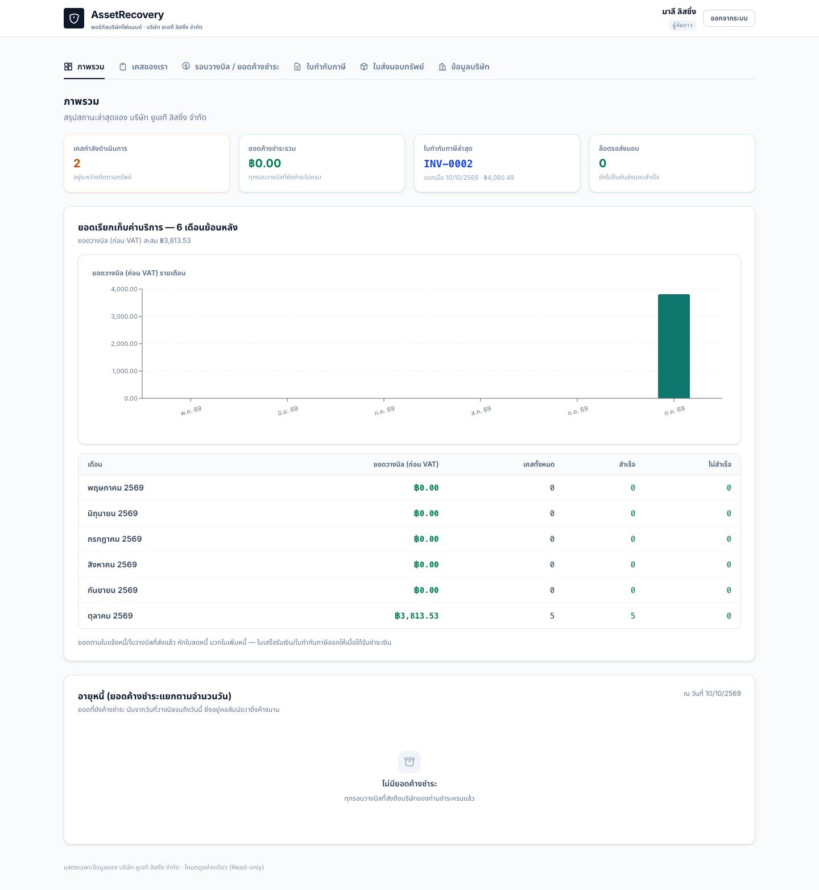

**ความหมายของการ์ด**

| การ์ด | แสดงอะไร | ใครเห็น |
|---|---|---|
| **เคสกำลังดำเนินการ** | จำนวนเคสที่อยู่ระหว่างติดตามทรัพย์ | ทุกระดับ |
| **ยอดค้างชำระรวม** | ยอดรวมของทุกรอบวางบิลที่ยังชำระไม่ครบ (บาท) | ผู้จัดการ |
| **ใบกำกับภาษีล่าสุด** | เลขที่ วันที่ออก และยอดของใบล่าสุด | ผู้จัดการ |
| **ล็อตรอส่งมอบ** | ล็อตทรัพย์ที่ยังไม่ยืนยันส่งมอบสำเร็จ | ผู้จัดการ · หัวหน้า |

**กราฟและตาราง (ผู้จัดการ)**
- **ยอดวางบิล (ก่อน VAT) รายเดือน** — ย้อนหลัง 6 เดือน พร้อมตารางจำนวนเคสทั้งหมด / สำเร็จ / ไม่สำเร็จ ของแต่ละเดือน
- **อายุหนี้** — ยอดที่ยังค้างชำระ แยกตามจำนวนวันนับจากวันวางบิล ยิ่งอยู่คอลัมน์ขวายิ่งค้างนาน ถ้าชำระครบทุกรอบแล้วจะแสดง "ไม่มียอดค้างชำระ"

หัวหน้าและแอดมินจะเห็นการ์ดน้อยลงตามสิทธิ์

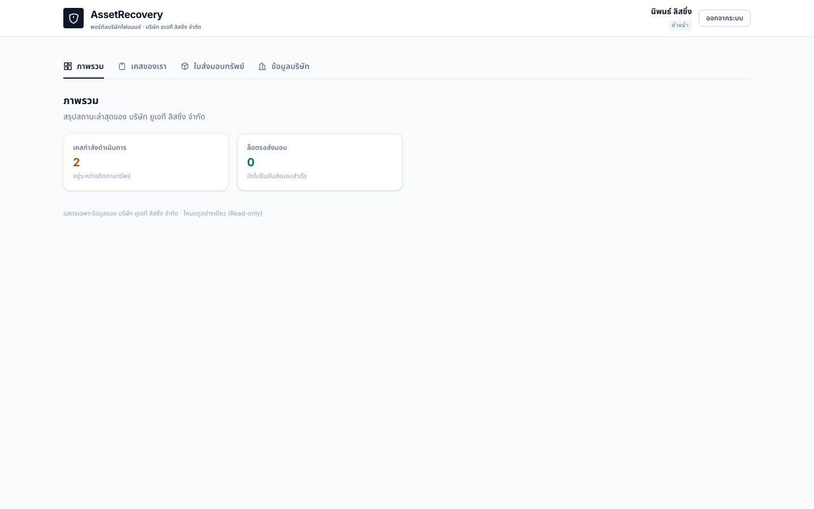

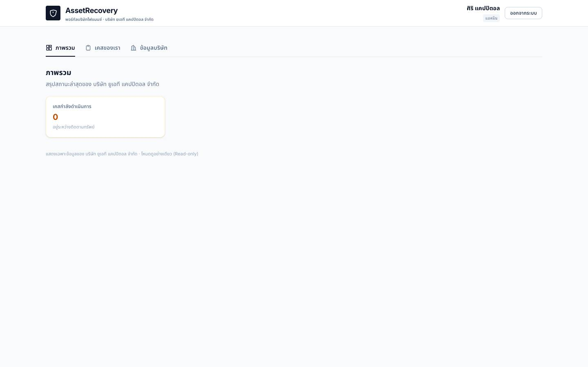

---

## 3. เคสของเรา — ค้นหาและกรองสถานะ

**เป้าหมาย:** ตรวจว่าเคสที่ส่งมาแต่ละเคสอยู่ขั้นไหนแล้ว

**ขั้นตอน**
1. กดแท็บ **เคสของเรา**
2. ช่อง **ค้นหาเลขที่สัญญา / ชื่อลูกหนี้...** — พิมพ์เพียงบางส่วนก็ได้ ระบบค้นให้ทันทีขณะพิมพ์
3. ดรอปดาวน์ **สถานะทั้งหมด** — เลือกสถานะที่ต้องการดู
4. กด **ล้างตัวกรอง** เพื่อกลับมาดูทั้งหมด
5. ถ้ามีหลายหน้า ใช้ปุ่ม **ก่อนหน้า / ถัดไป** ท้ายตาราง

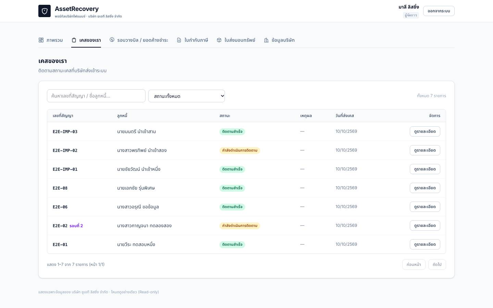

**ผลที่ควรเห็น:** ตารางแสดง **เลขที่สัญญา · ลูกหนี้ · สถานะ · เหตุผล · วันที่ส่งเคส** และปุ่ม **ดูรายละเอียด** มุมขวาบนบอกจำนวนรายการทั้งหมด

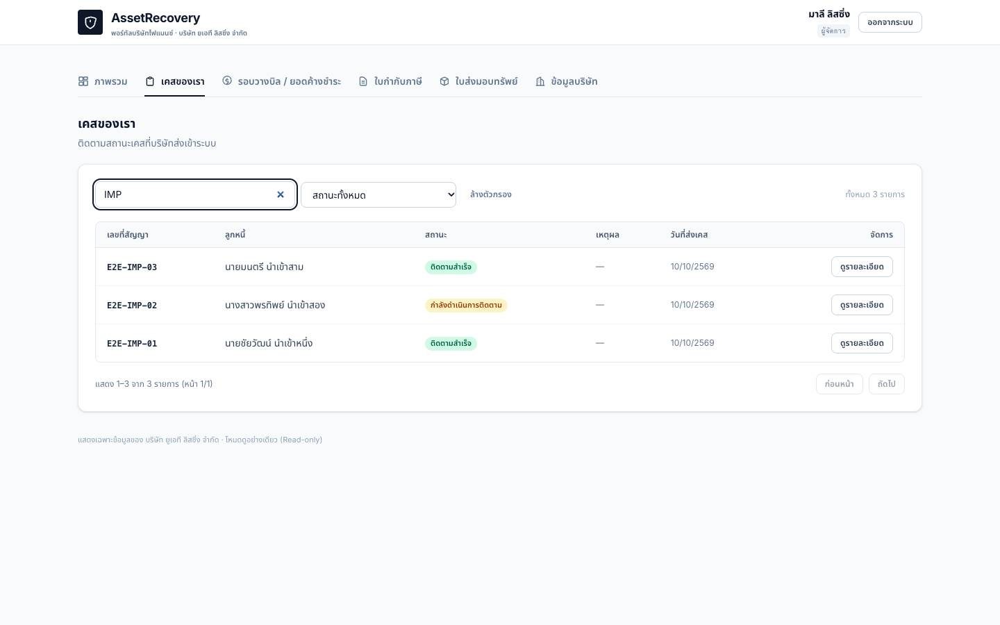

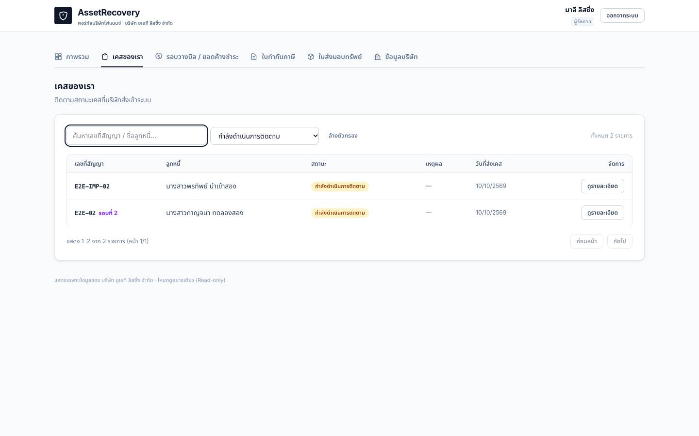

**สถานะเคสในพอร์ทัล (แบบสรุป)**

พอร์ทัลแสดงสถานะแบบสรุป 6 ค่า เพื่อให้อ่านง่าย — ขั้นตอนภายในของเรา (เช่น อนุมัติแล้ว กำลังมอบหมายทีม ลงพื้นที่) จะรวมแสดงเป็น "กำลังดำเนินการติดตาม"

| สถานะ | ความหมาย | ท่านต้องทำอะไร |
|---|---|---|
| **อยู่ระหว่างตรวจสอบ** | เราได้รับเคสแล้ว กำลังตรวจความครบถ้วนของข้อมูล | รอ |
| **ขอข้อมูลเพิ่มเติม** | ข้อมูลหรือเอกสารยังไม่พอ ดูรายละเอียดในคอลัมน์ **เหตุผล** | ส่งข้อมูลเพิ่มให้เจ้าหน้าที่ทางช่องทางปกติ |
| **ไม่รับเคส** | เคสนี้เราไม่รับดำเนินการ ดูเหตุผลในคอลัมน์ **เหตุผล** | ติดต่อเจ้าหน้าที่หากมีข้อสงสัย |
| **กำลังดำเนินการติดตาม** | อนุมัติแล้วและอยู่ระหว่างติดตามทรัพย์ | รอ |
| **ติดตามสำเร็จ** | ได้ทรัพย์คืนแล้ว | รอรับทรัพย์ตามใบส่งมอบ |
| **ติดตามไม่สำเร็จ** | ปิดงานโดยไม่ได้ทรัพย์คืน | ติดต่อเจ้าหน้าที่หากต้องการส่งติดตามรอบใหม่ |

**เคล็ดลับ**
- เคสที่ส่งติดตามซ้ำจะมีป้าย **"รอบที่ 2"** (หรือรอบถัดไป) ต่อท้ายเลขที่สัญญา
- คอลัมน์ **เหตุผล** จะมีข้อความเฉพาะเคสที่ "ขอข้อมูลเพิ่มเติม" หรือ "ไม่รับเคส" — เคสอื่นแสดงเป็นขีด (—)

---

## 4. เคสของเรา — ดูรายละเอียดเคสและรูปทรัพย์

**เป้าหมาย:** ดูข้อมูลทรัพย์ ค่าบริการ และรูปเครื่องที่ได้คืน

**ขั้นตอน**
1. ในแท็บ **เคสของเรา** กด **ดูรายละเอียด** ท้ายแถว — แผงรายละเอียดเปิดทางขวา
2. อ่านข้อมูลหลัก: **เลขที่สัญญา · สถานะ · ลูกหนี้ · ทรัพย์** (รุ่น · ความจุ · สี) **· วันที่ส่งเคส**
3. อ่านส่วน **ค่าบริการ**: รูปแบบค่าบริการ · อัตรา/ค่าบริการ · เมื่อติดตามไม่สำเร็จ · **ค่าบริการโดยประมาณ**
4. (เคสติดตามสำเร็จ) เลื่อนลงดู **รูปสินค้า (แนบตอนรับเข้าคลัง)** และ **สภาพเครื่อง** — กดที่รูปเพื่อขยาย ใช้ลูกศรซ้าย/ขวาเลื่อนดูรูปถัดไป
5. กด **ปิด** (หรือกดปุ่ม Esc บนคีย์บอร์ด)

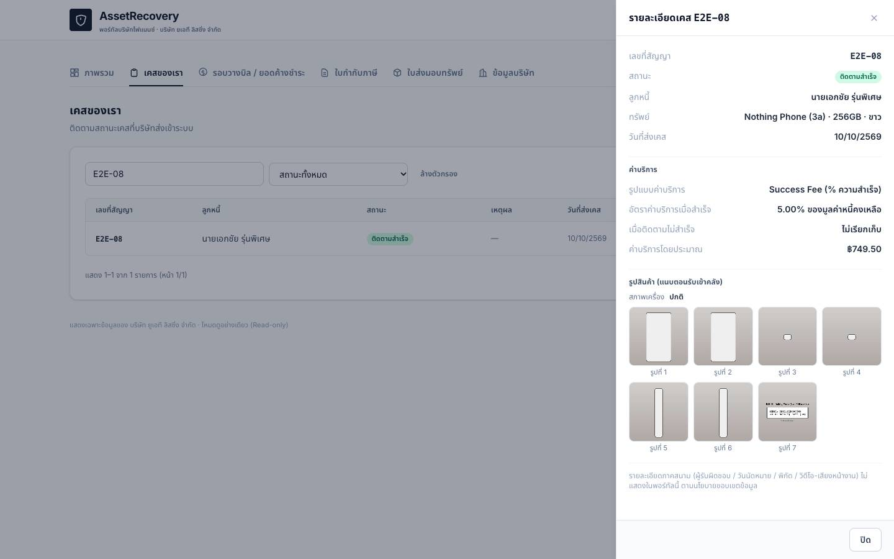

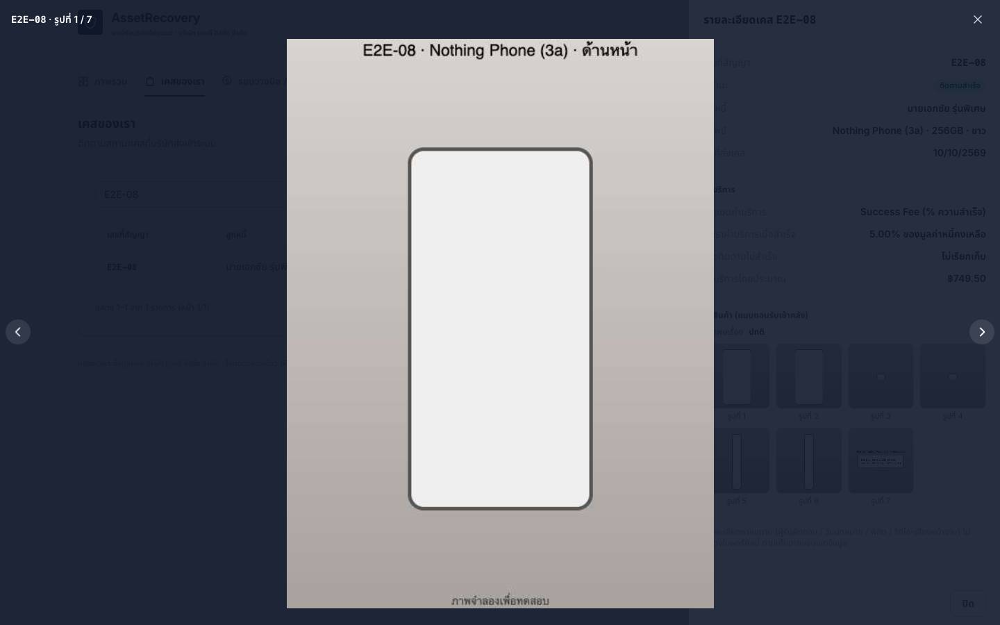

ถ้าเครื่องมีสภาพไม่ปกติ (เช่น ชำรุด หรืออุปกรณ์ขาดหาย) จะมีกรอบ **หมายเหตุสภาพเครื่อง** แสดงรายละเอียดที่คลังบันทึกไว้

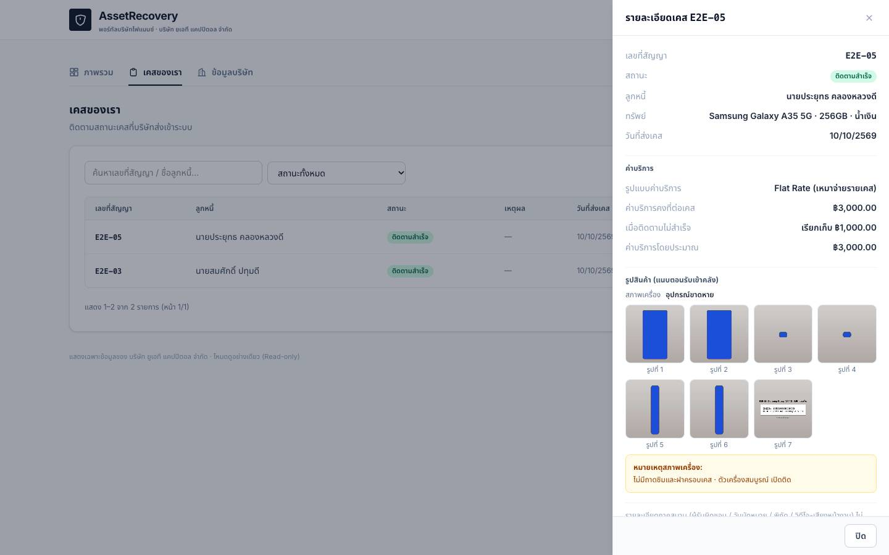

เคสที่ยังอยู่ระหว่างติดตามจะแสดงเฉพาะข้อมูลหลักและค่าบริการ ยังไม่มีรูป

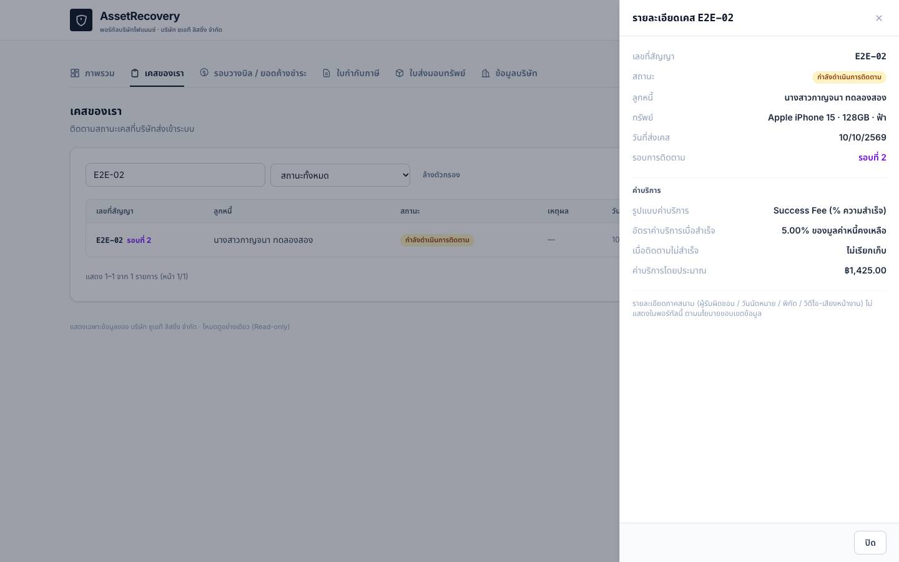

**ข้อควรทราบ**
- พอร์ทัลแสดง **สถานะปัจจุบัน** ของเคสเท่านั้น ไม่มีไทม์ไลน์ย้อนหลัง
- **ไม่แสดงรายละเอียดภาคสนาม** (ผู้รับผิดชอบ วันนัดหมาย พิกัด วิดีโอ/เสียงหน้างาน) และ **ไม่แสดง IMEI** บนหน้าจอ ตามนโยบายขอบเขตข้อมูล — IMEI จะปรากฏในใบส่งมอบ PDF (บทที่ 7)
- รูปทรัพย์แสดงเฉพาะเคส **ติดตามสำเร็จ** ที่เครื่องรับเข้าคลังของเราแล้ว ผู้ใช้ทุกระดับเห็นรูปได้จากหน้านี้
- รูปเรียงชื่อเป็น "รูปที่ 1–7" (ไม่มีป้ายบอกมุม) — ดูจากตัวภาพว่าเป็นด้านหน้า ด้านหลัง ด้านข้าง หรือฉลาก IMEI
- **ค่าบริการโดยประมาณ** คำนวณตามเงื่อนไขค่าบริการของเคส ณ วันที่อนุมัติ และยังไม่ได้ระบุว่าเป็นยอดก่อนหรือรวม VAT — ใช้เป็นตัวเลขอ้างอิงเท่านั้น ยอดที่เรียกเก็บจริงให้ยึดตาม **ใบแจ้งหนี้** (บทที่ 5) ซึ่งแยกยอดก่อน VAT / VAT / ยอดรวมไว้ชัดเจน

---

## 5. รอบวางบิล / ยอดค้างชำระ และดาวน์โหลดใบแจ้งหนี้

*สำหรับผู้จัดการ*

**เป้าหมาย:** ตรวจรอบวางบิล ยอดที่ชำระแล้ว ยอดค้าง และดาวน์โหลดใบแจ้งหนี้

**ขั้นตอน**
1. กดแท็บ **รอบวางบิล / ยอดค้างชำระ**
2. อ่านการ์ดด้านบน: **ยอดค้างชำระรวม · รอบที่ยังค้างชำระ · รอบวางบิลทั้งหมด**
3. กรองด้วยปุ่มสถานะ: **สถานะทั้งหมด · ส่งบิลแล้ว · รับชำระบางส่วน · รับชำระครบ**
4. กดลิงก์ **ใบแจ้งหนี้ PDF** ใต้เลขรอบวางบิล เพื่อดาวน์โหลดใบแจ้งหนี้

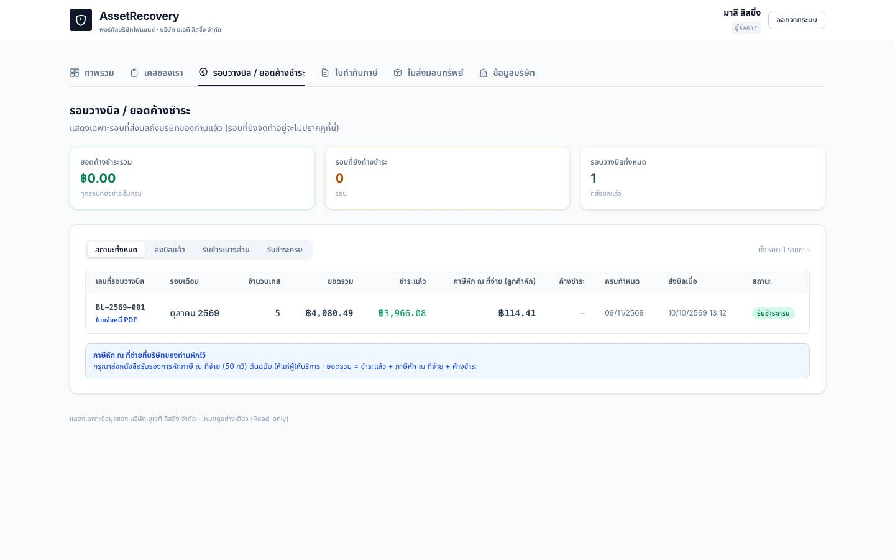

**ผลที่ควรเห็น:** ตารางแสดง **เลขที่รอบวางบิล · รอบเดือน · จำนวนเคส · ยอดรวม · ชำระแล้ว · ภาษีหัก ณ ที่จ่าย (ลูกค้าหัก) · ค้างชำระ · ครบกำหนด · ส่งบิลเมื่อ · สถานะ**

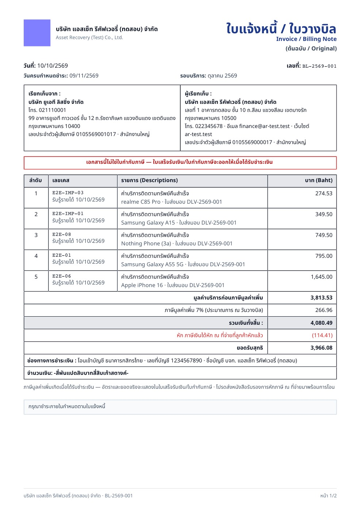

**วิธีอ่านยอด**

> **ยอดรวม = ชำระแล้ว + ภาษีหัก ณ ที่จ่าย + ค้างชำระ**

ตัวอย่างในภาพ: ยอดรวม ฿4,080.49 = ชำระแล้ว ฿3,966.08 + ภาษีหัก ณ ที่จ่าย ฿114.41 + ค้างชำระ ฿0 → สถานะ **รับชำระครบ**

**เคล็ดลับ / ข้อควรทราบ**
- หน้านี้แสดง **เฉพาะรอบที่ส่งบิลถึงบริษัทท่านแล้ว** — รอบที่เรายังจัดทำอยู่จะไม่ปรากฏ
- ถ้าบริษัทท่าน **หักภาษี ณ ที่จ่าย** ไว้ จะมีกรอบสีฟ้าเตือนให้ส่ง **หนังสือรับรองการหักภาษี ณ ที่จ่าย (50 ทวิ) ต้นฉบับ** ให้เรา กรุณาส่งตามช่องทางที่ตกลงไว้
- การชำระเงินทำโดยโอนตามรายละเอียดในใบแจ้งหนี้ เมื่อเราตรวจรับเงินแล้ว สถานะจะเปลี่ยนเป็น **รับชำระบางส่วน** หรือ **รับชำระครบ** และจะออกใบเสร็จรับเงิน/ใบกำกับภาษีให้ (บทที่ 6)

---

## 6. ใบกำกับภาษี — ดูและดาวน์โหลด

*สำหรับผู้จัดการ*

**เป้าหมาย:** ดาวน์โหลดใบเสร็จรับเงิน/ใบกำกับภาษีไปใช้ลงบัญชีของบริษัท

**ขั้นตอน**
1. กดแท็บ **ใบกำกับภาษี** (ส่วนหัวของหน้าจะแสดงชื่อเต็มว่า "ใบเสร็จรับเงิน/ใบกำกับภาษี" — เป็นหน้าเดียวกัน)
2. กด **ดาวน์โหลด PDF** ท้ายแถว

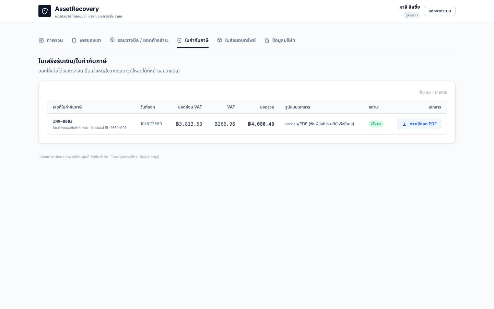

**ผลที่ควรเห็น:** ตารางแสดง **เลขที่ใบกำกับภาษี** (ใต้เลขที่บอกว่าเป็นของใบแจ้งหนี้รอบใด) **· วันที่ออก · ยอดก่อน VAT · VAT · ยอดรวม · รูปแบบเอกสาร · สถานะ** และได้ไฟล์ PDF

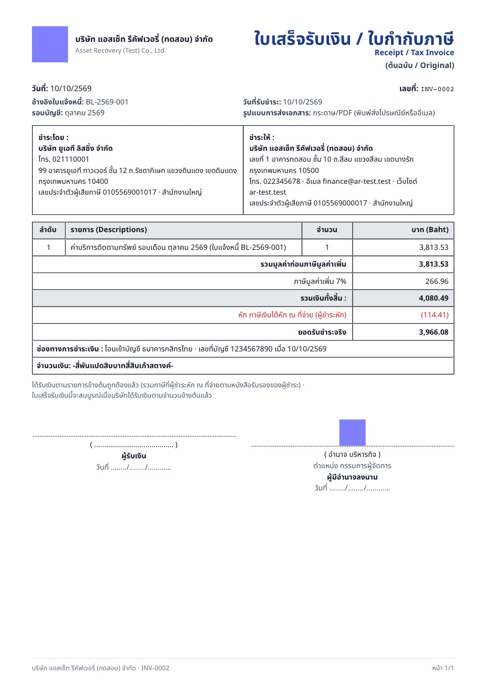

**ข้อควรทราบ**
- ใบเสร็จรับเงิน/ใบกำกับภาษี **ออกให้เมื่อเราได้รับชำระเงินแล้วเท่านั้น** — ถ้ายังไม่เห็นใบของรอบที่โอนไปแล้ว อาจอยู่ระหว่างตรวจรับเงิน
- ถ้าบริษัทท่านหักภาษี ณ ที่จ่าย ใน PDF จะแสดงยอดที่หักและยอดรับจริงไว้ด้วย
- **ใบแจ้งหนี้** ไม่ได้อยู่หน้านี้ — ดาวน์โหลดได้ที่หน้า **รอบวางบิล** (บทที่ 5)
- คอลัมน์ **รูปแบบเอกสาร** บอกว่าต้นฉบับจะส่งถึงท่านทางใด (เช่น กระดาษ/PDF ส่งไปรษณีย์หรืออีเมล)

---

## 7. ใบส่งมอบทรัพย์ — ล็อต รายละเอียด และเอกสาร

*สำหรับผู้จัดการและหัวหน้า*

**เป้าหมาย:** ตรวจว่าทรัพย์ที่ได้คืนส่งมอบถึงบริษัทแล้วหรือยัง และเก็บเอกสารส่งมอบ

**ขั้นตอน**
1. กดแท็บ **ใบส่งมอบทรัพย์**
2. (ถ้าต้องการ) กรองด้วย **สถานะ · สร้างตั้งแต่วันที่ · ถึงวันที่** หรือพิมพ์ **เลขล็อต หรือ เลขที่ใบส่งมอบ** ในช่องค้นหา แล้วกด **ค้นหา**
3. กดที่การ์ดล็อต เพื่อเปิด **รายการทรัพย์ในล็อต**
4. ในหน้าต่างล็อต กด **ดาวน์โหลดใบส่งมอบ (PDF)** และ/หรือ **ดาวน์โหลดใบเซ็นรับ**
5. กด **ปิด**

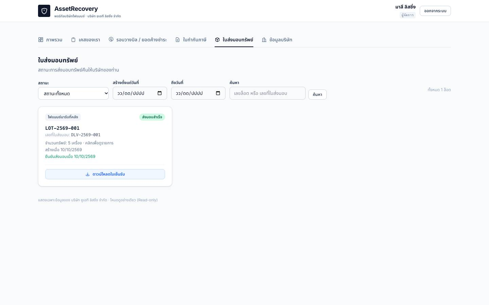

**การ์ดล็อตแสดง:** วิธีส่งมอบ (เช่น ไฟแนนซ์มารับที่คลัง) · สถานะ · เลขล็อต · เลขที่ใบส่งมอบ · จำนวนทรัพย์ · วันที่สร้าง · วันที่ยืนยันส่งมอบ · ปุ่ม **ดาวน์โหลดใบเซ็นรับ** (ดาวน์โหลดจากการ์ดได้ทันทีโดยไม่ต้องเปิดล็อต)

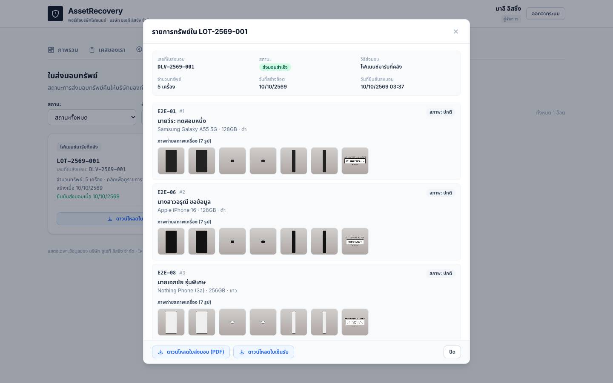

**ในหน้าต่างล็อต** แต่ละเครื่องแสดง เลขที่สัญญา · ชื่อลูกหนี้ · รุ่น/ความจุ/สี · ป้าย **สภาพ** และ **ภาพถ่ายสภาพเครื่อง** — ถ้าเครื่องชำรุดจะมีหมายเหตุจากคลังกำกับไว้

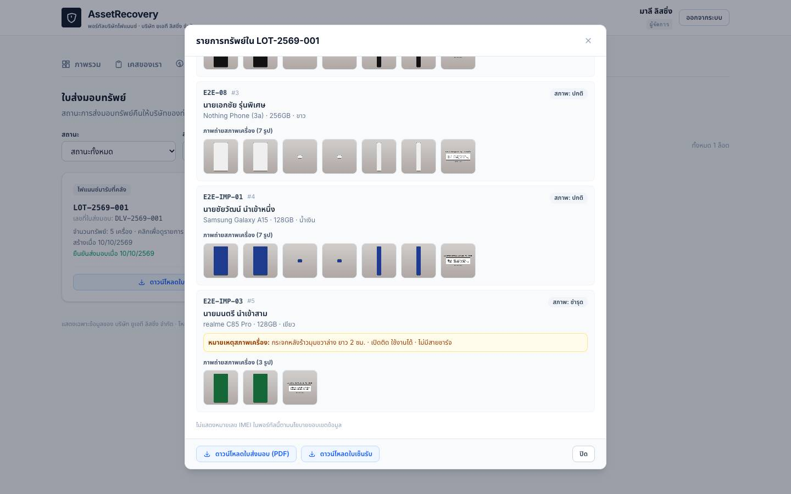

**เอกสารที่ดาวน์โหลดได้**

| เอกสาร | คืออะไร | ดาวน์โหลดจาก |
|---|---|---|
| **ใบส่งมอบ (PDF)** | รายการทรัพย์ทั้งล็อต พร้อม IMEI สำหรับใช้ตรวจนับตอนรับเครื่อง | หน้าต่างล็อต |
| **ใบเซ็นรับ** | สำเนาใบส่งมอบที่ลงนามรับเรียบร้อยแล้ว (มีเมื่อยืนยันส่งมอบแล้ว) | หน้าต่างล็อต หรือการ์ดล็อต |

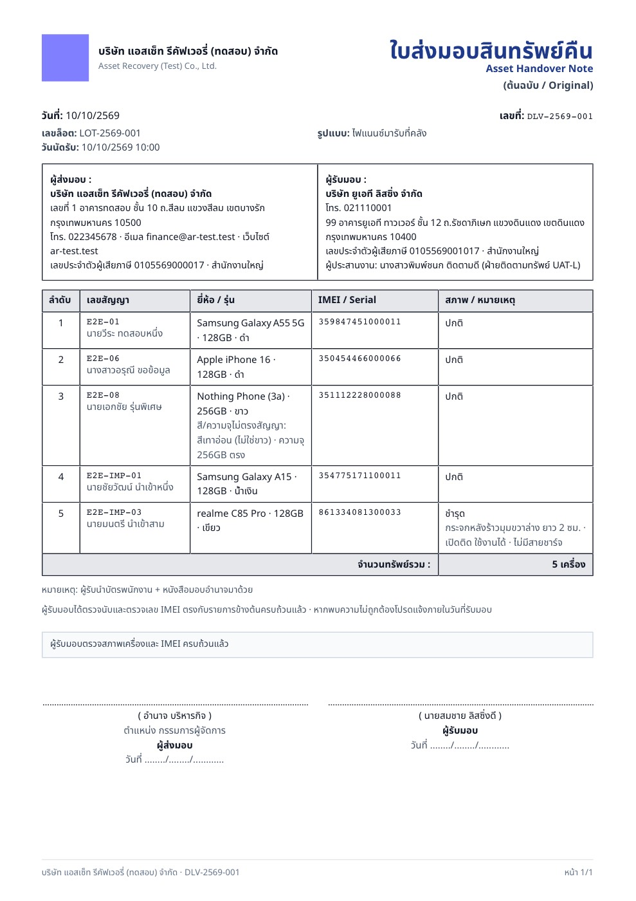

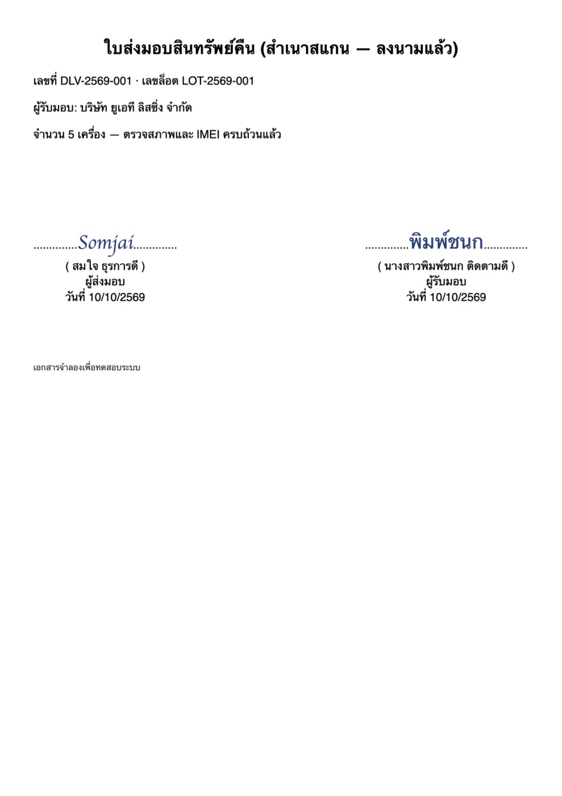

**ข้อควรทราบ**
- หน้าจอ **ไม่แสดง IMEI** แต่ **ใบส่งมอบ PDF และใบเซ็นรับมี IMEI** เพราะเป็นเอกสารของบริษัทท่านเอง ใช้ตรวจนับเครื่องตอนรับได้
- ช่องค้นหาของหน้านี้ค้นด้วยเลขล็อต/เลขที่ใบส่งมอบเท่านั้น **ค้นด้วย IMEI ไม่ได้** — ถ้าต้องการหาเครื่องเฉพาะ ให้ค้นด้วยเลขที่สัญญาหรือชื่อลูกหนี้ในแท็บ **เคสของเรา**
- หน้าจอแสดงสีและความจุ **ตามสัญญา** ถ้าคลังพบว่าสีหรือความจุของเครื่องจริงไม่ตรงกับสัญญา ใบส่งมอบ PDF จะพิมพ์บรรทัด "สี/ความจุไม่ตรงสัญญา" พร้อมรายละเอียดไว้ — ควรเปิด PDF ตรวจทุกครั้ง
- เมื่อรับเครื่องและลงนามในใบส่งมอบแล้ว เจ้าหน้าที่ของเราจะแนบใบเซ็นรับและยืนยันล็อต สถานะจะเปลี่ยนเป็น **ส่งมอบสำเร็จ**

---

## 8. ข้อมูลบริษัท

**เป้าหมาย:** ตรวจว่าข้อมูลบริษัทที่เราใช้ออกเอกสารถูกต้อง

**ขั้นตอน**
1. กดแท็บ **ข้อมูลบริษัท**
2. ตรวจ **ชื่อบริษัท · เลขประจำตัวผู้เสียภาษี (สำนักงานใหญ่/สาขา) · ที่อยู่จดทะเบียน · ผู้ติดต่อประจำวัน · ผู้มีอำนาจลงนาม · เทมเพลตค่าบริการที่ผูกอยู่**

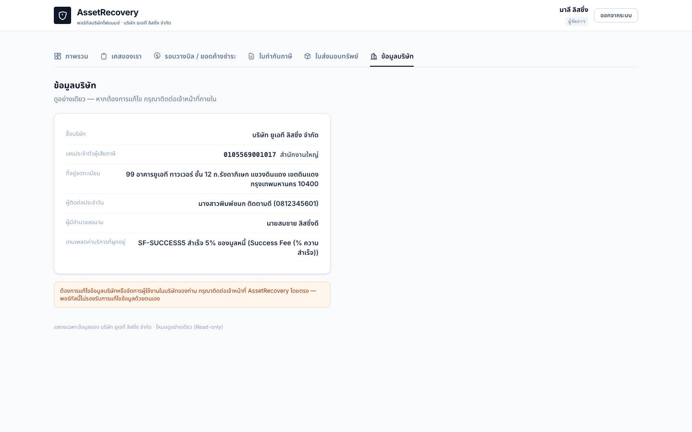

**ข้อควรทราบ**
- หน้านี้ **ดูอย่างเดียว** — ถ้าข้อมูลไม่ถูกต้อง หรือต้องการจัดการผู้ใช้ในบริษัท กรุณาติดต่อเจ้าหน้าที่ AssetRecovery โดยตรง
- ข้อมูลในหน้านี้ใช้พิมพ์ลงใบแจ้งหนี้และใบกำกับภาษี — ถ้าพบที่อยู่หรือเลขผู้เสียภาษีผิด ควรแจ้งแก้ **ก่อน** รอบวางบิลถัดไป
- เอกสารบริษัท (เช่น หนังสือรับรองบริษัท ภ.พ.20) ไม่แสดงในพอร์ทัล หากต้องการส่งหรือปรับปรุงเอกสาร ให้ส่งผ่านเจ้าหน้าที่

---

## 9. ใช้งานบนมือถือ

**เป้าหมาย:** ตรวจสถานะเคส ยอดวางบิล และล็อตส่งมอบได้จากมือถือ

เปิด `https://<โดเมนระบบ>/login` จากเบราว์เซอร์ในมือถือ แล้วเข้าสู่ระบบตามบทที่ 1 — หน้าจอปรับให้พอดีจอโดยอัตโนมัติ ไม่ต้องติดตั้งแอป

**ขั้นตอน**
1. หน้าแรกแสดงการ์ดสรุปเรียงเป็นตาราง เลื่อนลงดูกราฟได้
2. ใช้ **แถบเมนูด้านล่าง** เพื่อสลับหน้า
3. กด **☰** มุมขวาบน เพื่อเปิดเมนูครบทุกหมวด และปุ่ม **ออกจากระบบ** — ปิดเมนูด้วยปุ่ม **X** หรือแตะพื้นที่ว่างด้านข้าง

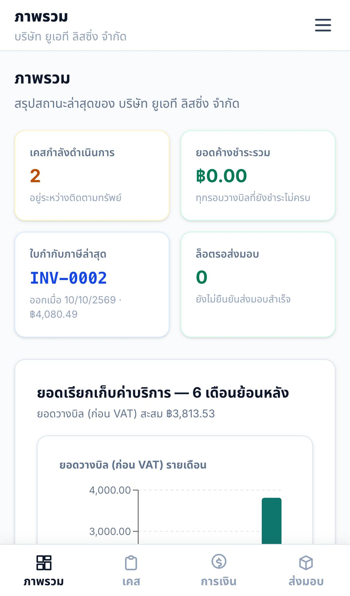

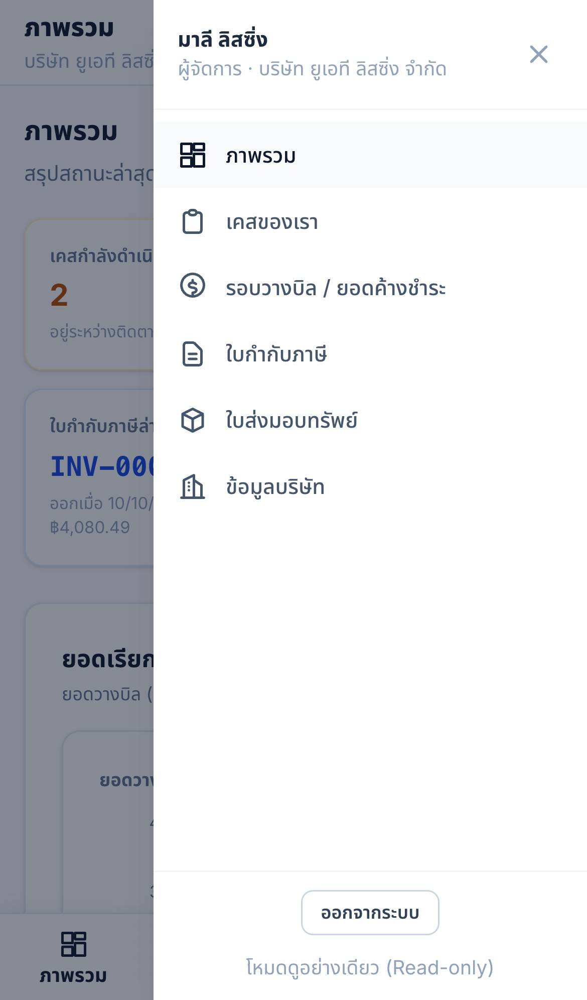

**ปุ่มบนแถบเมนูด้านล่างตามระดับสิทธิ์**

| ระดับ | ปุ่มด้านล่าง | ต้องใช้เมนู ☰ สำหรับ |
|---|---|---|
| ผู้จัดการ | ภาพรวม · เคส · การเงิน · ส่งมอบ | ใบกำกับภาษี · ข้อมูลบริษัท |
| หัวหน้า | ภาพรวม · เคส · ส่งมอบ | ข้อมูลบริษัท |
| แอดมิน | ภาพรวม · เคส | ข้อมูลบริษัท |

- **เคส** → รายการเคสแบบการ์ด แตะการ์ดเพื่อดูรายละเอียด
- **การเงิน** → หน้ารอบวางบิล/ยอดค้างชำระ
- **ส่งมอบ** → รายการล็อตส่งมอบ

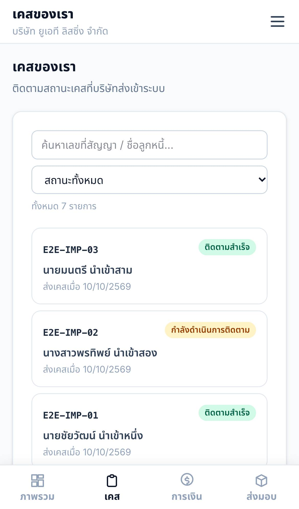

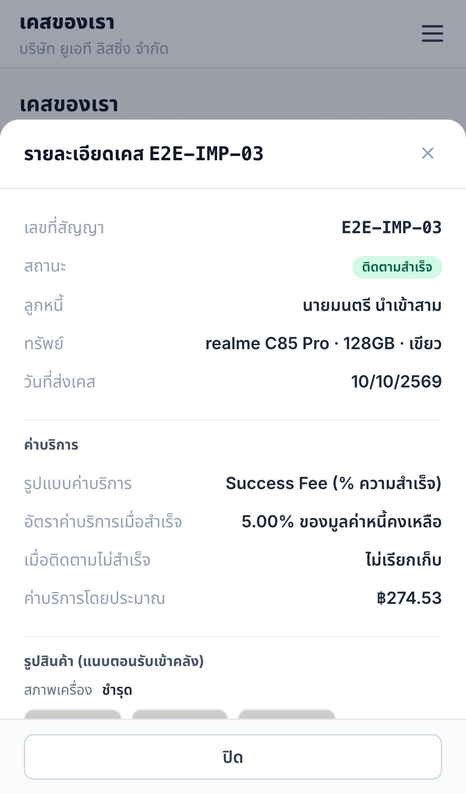

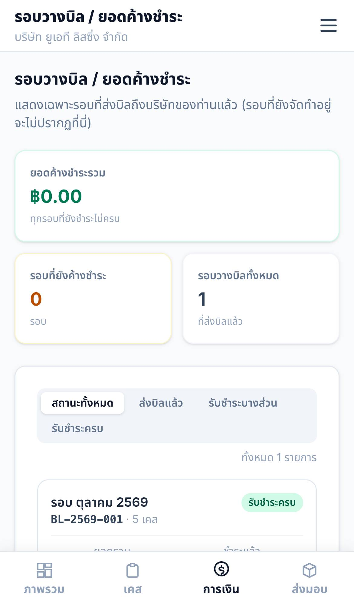

**เคล็ดลับ**
- ปุ่ม **การเงิน** พาไปหน้ารอบวางบิลเท่านั้น — ถ้าต้องการ **ใบกำกับภาษี** ให้กด **☰** แล้วเลือก **ใบกำกับภาษี**
- ไฟล์ PDF ที่ดาวน์โหลดบนมือถือจะเปิดด้วยโปรแกรมดู PDF ของเครื่อง และบันทึกไว้ในโฟลเดอร์ดาวน์โหลด
- งานที่ต้องเปิดเอกสารหลายฉบับหรือตรวจตารางยาว แนะนำให้ใช้คอมพิวเตอร์

---

## 10. ความปลอดภัยของข้อมูล

- ท่านจะเห็น **เฉพาะข้อมูลของบริษัทท่านเท่านั้น** แม้จะได้รับลิงก์เคสหรือล็อตของบริษัทอื่นมาเปิด ระบบจะแสดงข้อความ **"ไม่มีสิทธิ์ใช้งาน — บัญชีนี้ไม่มีสิทธิ์ทำรายการที่ร้องขอ"** และไม่แสดงข้อมูลใด ๆ (กรณีนี้กด **ปิด** ได้เลย การกด **ลองใหม่** จะได้ผลเหมือนเดิม)
- ระดับสิทธิ์ถูกตรวจทุกครั้งที่ระบบดึงข้อมูล — ถ้าพิมพ์ที่อยู่หน้าที่ไม่มีสิทธิ์ (เช่น หัวหน้าเปิดหน้ารอบวางบิล) ระบบจะพากลับหน้า **ภาพรวม** โดยไม่มีข้อความแจ้ง ซึ่งหมายความว่าบัญชีของท่านไม่มีสิทธิ์หมวดนั้น
- บัญชีพอร์ทัลเข้าหน้าระบบภายในของผู้ให้บริการไม่ได้ ระบบจะพากลับพอร์ทัลทุกครั้ง
- ทุกการดาวน์โหลดเอกสารและทุกความพยายามเข้าถึงข้อมูลที่ไม่มีสิทธิ์ ระบบบันทึกไว้เพื่อการตรวจสอบ
- เมื่อพนักงานลาออกหรือย้ายงาน กรุณาแจ้งเจ้าหน้าที่ของเราให้ปิดบัญชีโดยเร็ว

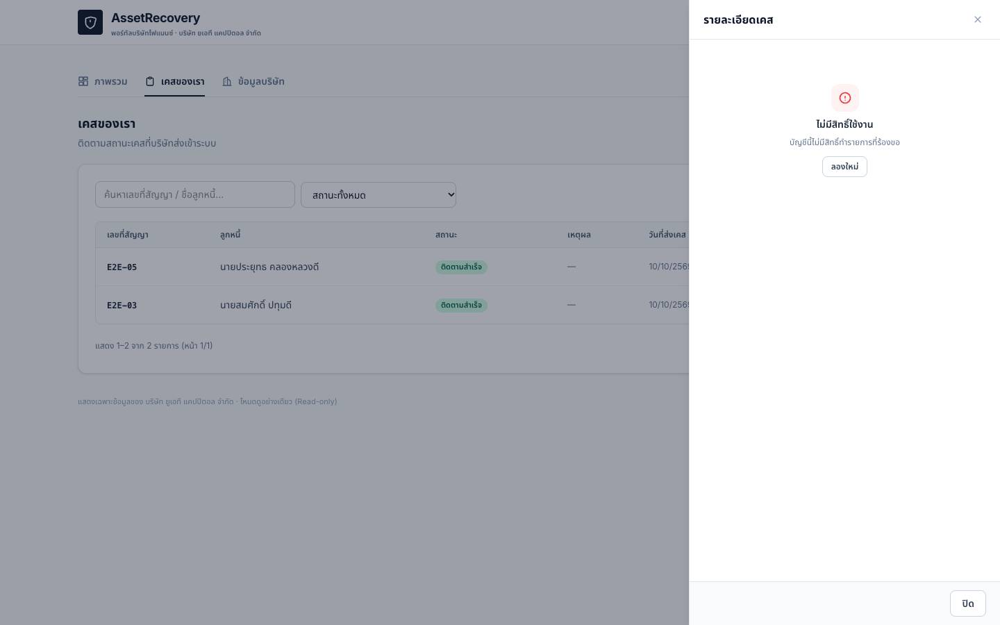

---

# ภาคผนวก

## ภาคผนวก 1 — สถานะที่จะเห็นและความหมาย

### สถานะเคส

| สถานะ | สีป้าย | ความหมาย |
|---|---|---|
| อยู่ระหว่างตรวจสอบ | — | ได้รับเคสแล้ว กำลังตรวจข้อมูล |
| ขอข้อมูลเพิ่มเติม | — | ต้องการข้อมูล/เอกสารเพิ่ม ดูคอลัมน์เหตุผล |
| ไม่รับเคส | — | ไม่รับดำเนินการ ดูคอลัมน์เหตุผล |
| กำลังดำเนินการติดตาม | เหลือง | อนุมัติแล้ว อยู่ระหว่างติดตามทรัพย์ |
| ติดตามสำเร็จ | เขียว | ได้ทรัพย์คืนแล้ว |
| ติดตามไม่สำเร็จ | — | ปิดงานโดยไม่ได้ทรัพย์คืน |

ป้าย **"รอบที่ N"** ต่อท้ายเลขที่สัญญา = เคสที่ส่งติดตามซ้ำเป็นรอบที่ N

### สถานะรอบวางบิล

| สถานะ | ความหมาย |
|---|---|
| ส่งบิลแล้ว | ส่งใบแจ้งหนี้ถึงบริษัทแล้ว ยังไม่ได้รับชำระ |
| รับชำระบางส่วน | ได้รับชำระแล้วบางส่วน ยังมียอดค้าง |
| รับชำระครบ | ชำระครบแล้ว (รวมภาษีหัก ณ ที่จ่าย ถ้ามี) |

### สถานะใบกำกับภาษี

| สถานะ | ความหมาย |
|---|---|
| ใช้งาน | ใบกำกับภาษีที่มีผลใช้ได้ |

### สถานะล็อตส่งมอบ

| สถานะ | ความหมาย |
|---|---|
| รอดำเนินการส่งมอบ | สร้างล็อตแล้ว รอนัดรับ/จัดส่ง |
| จัดส่งแล้ว รอยืนยัน | ส่งเครื่องออกไปแล้ว รอเจ้าหน้าที่ยืนยันเมื่อได้หลักฐานการรับ |
| ส่งมอบสำเร็จ | ยืนยันส่งมอบเรียบร้อย ดาวน์โหลดใบเซ็นรับได้ |

### สภาพเครื่อง (ในรายละเอียดเคสและล็อต)

| สภาพ | ความหมาย |
|---|---|
| ปกติ | เครื่องอยู่ในสภาพปกติ |
| ชำรุด | พบความเสียหาย ดูหมายเหตุประกอบ |
| อุปกรณ์ขาดหาย | ส่วนประกอบบางชิ้นไม่ครบ ดูหมายเหตุประกอบ |

---

## ภาคผนวก 2 — คำถามที่พบบ่อย (FAQ)

**ถาม: ลืมรหัสผ่าน ทำอย่างไร?**
ตอบ: ติดต่อเจ้าหน้าที่ AssetRecovery เจ้าหน้าที่จะตั้งรหัสผ่านชั่วคราวให้ เมื่อเข้าสู่ระบบด้วยรหัสชั่วคราว ระบบจะให้ตั้งรหัสผ่านใหม่ของท่านเอง

**ถาม: ไม่เห็นเมนูรอบวางบิล / ใบกำกับภาษี / ใบส่งมอบทรัพย์**
ตอบ: ระดับสิทธิ์ของบัญชีท่านไม่ครอบคลุมหมวดนั้น (ดูตารางระดับสิทธิ์ต้นเล่ม) หากจำเป็นต้องใช้ ให้ผู้มีอำนาจของบริษัทแจ้งเจ้าหน้าที่ของเราเพื่อขอปรับสิทธิ์

**ถาม: เปิดลิงก์ที่เพื่อนร่วมงานส่งมา แล้วถูกพากลับหน้าภาพรวม**
ตอบ: ลิงก์นั้นอยู่ในหมวดที่บัญชีของท่านไม่มีสิทธิ์ ระบบจึงพากลับหน้าภาพรวม

**ถาม: ส่งเคสใหม่หรือส่งเอกสารเพิ่มผ่านพอร์ทัลได้ไหม?**
ตอบ: ยังไม่ได้ พอร์ทัลเป็นโหมดดูอย่างเดียว กรุณาส่งผ่านช่องทางปกติกับเจ้าหน้าที่ของเรา เมื่อเจ้าหน้าที่บันทึกแล้ว สถานะในพอร์ทัลจะอัปเดตเอง

**ถาม: เคสขึ้น "ขอข้อมูลเพิ่มเติม" ต้องทำอะไร?**
ตอบ: อ่านคอลัมน์ **เหตุผล** แล้วส่งข้อมูลหรือเอกสารที่ขาดให้เจ้าหน้าที่ เมื่อครบแล้วเคสจะเข้าสู่ขั้นติดตามต่อ

**ถาม: ทำไมไม่เห็นว่าใครเป็นผู้ติดตาม หรือนัดลงพื้นที่วันไหน?**
ตอบ: รายละเอียดภาคสนามไม่แสดงในพอร์ทัลตามนโยบายขอบเขตข้อมูล หากต้องการทราบความคืบหน้าเพิ่มเติม ติดต่อเจ้าหน้าที่ได้

**ถาม: ทำไมหน้าจอไม่แสดง IMEI?**
ตอบ: เพื่อความปลอดภัยของข้อมูล หน้าจอจึงไม่แสดง IMEI แต่ **ใบส่งมอบ PDF และใบเซ็นรับ** มี IMEI ครบ ใช้ตรวจนับเครื่องได้

**ถาม: "ค่าบริการโดยประมาณ" ในรายละเอียดเคส ไม่ตรงกับยอดในใบแจ้งหนี้**
ตอบ: ค่าบริการโดยประมาณเป็นตัวเลขอ้างอิงตามเงื่อนไขค่าบริการของเคส และอาจเป็นยอดก่อนหรือรวม VAT ตามรูปแบบราคาของบริษัท ยอดที่เรียกเก็บจริงให้ยึดตามใบแจ้งหนี้ ซึ่งแยกยอดก่อน VAT / VAT / ยอดรวมไว้

**ถาม: โอนเงินแล้ว ทำไมยอดยังค้างและยังไม่มีใบกำกับภาษี?**
ตอบ: เจ้าหน้าที่ต้องตรวจรับเงินเข้าบัญชีก่อน เมื่อตรวจแล้วสถานะรอบวางบิลจะเปลี่ยน และใบเสร็จรับเงิน/ใบกำกับภาษีจะปรากฏในหน้าใบกำกับภาษี หากผ่านไปหลายวันทำการแล้วยังไม่เปลี่ยน กรุณาส่งหลักฐานการโอนให้เจ้าหน้าที่

**ถาม: หักภาษี ณ ที่จ่ายไว้ ต้องส่งอะไร?**
ตอบ: ส่ง **หนังสือรับรองการหักภาษี ณ ที่จ่าย (50 ทวิ) ต้นฉบับ** ให้เรา ยอดที่หักจะแสดงในคอลัมน์ "ภาษีหัก ณ ที่จ่าย (ลูกค้าหัก)" ของรอบวางบิล

**ถาม: ใบแจ้งหนี้อยู่ที่ไหน?**
ตอบ: ที่แท็บ **รอบวางบิล / ยอดค้างชำระ** — กดลิงก์ **ใบแจ้งหนี้ PDF** ใต้เลขรอบวางบิล (แท็บใบกำกับภาษีมีเฉพาะใบเสร็จรับเงิน/ใบกำกับภาษี)

**ถาม: สีเครื่องในหน้าจอไม่ตรงกับเครื่องที่ได้รับ**
ตอบ: หน้าจอแสดงสีและความจุตามสัญญา หากคลังพบว่าเครื่องจริงต่างจากสัญญา จะระบุไว้ในใบส่งมอบ PDF บรรทัด "สี/ความจุไม่ตรงสัญญา" กรุณาตรวจใน PDF

**ถาม: ขอเพิ่มผู้ใช้ หรือแก้ไขที่อยู่บริษัท?**
ตอบ: ติดต่อเจ้าหน้าที่ AssetRecovery — พอร์ทัลไม่รองรับการแก้ไขข้อมูลด้วยตนเอง

---

## ภาคผนวก 3 — สำหรับผู้ให้บริการ: โหมด "ดูในฐานะบริษัท"

> ส่วนนี้สำหรับ **ผู้ดูแลระบบ และธุรการ** ของ AssetRecovery (ไม่ใช่ผู้ใช้ของบริษัทไฟแนนซ์)

**ใช้ทำอะไร:** เปิดดูพอร์ทัลแบบเดียวกับที่บริษัทไฟแนนซ์เห็น เพื่อช่วยตอบคำถามลูกค้า หรือตรวจว่าข้อมูลที่ลูกค้าเห็นถูกต้อง โดยไม่ต้องขอรหัสผ่านของลูกค้า

**ใครใช้ได้:** ผู้ดูแลระบบ และ **ธุรการ** (ตามค่าเริ่มต้น) — ผู้ใช้ของบริษัทไฟแนนซ์ใช้โหมดนี้ไม่ได้

**ขั้นตอน**
1. เข้าสู่ระบบภายในตามปกติ → เมนู **การตั้งค่า** → **บริษัทไฟแนนซ์**
2. ที่การ์ดของบริษัทที่ต้องการ กด **เปิด portal ของลูกค้า ↗** — ระบบเปิดแท็บใหม่
3. ด้านบนสุดมีแถบสีเหลือง *"กำลังดูในฐานะ <ชื่อบริษัท> (ดูอย่างเดียว) · ทุกการเปิดดูและดาวน์โหลดถูกบันทึกในชื่อของท่าน"*
4. ใช้เมนูพอร์ทัลได้ครบทุกหมวด เหมือนสิทธิ์ **ผู้จัดการ** ของบริษัทนั้น (รวมดาวน์โหลดเอกสาร)
5. เสร็จแล้วกด **กลับระบบภายใน** ที่มุมขวาของแถบเหลือง — ระบบพากลับหน้าบริษัทไฟแนนซ์

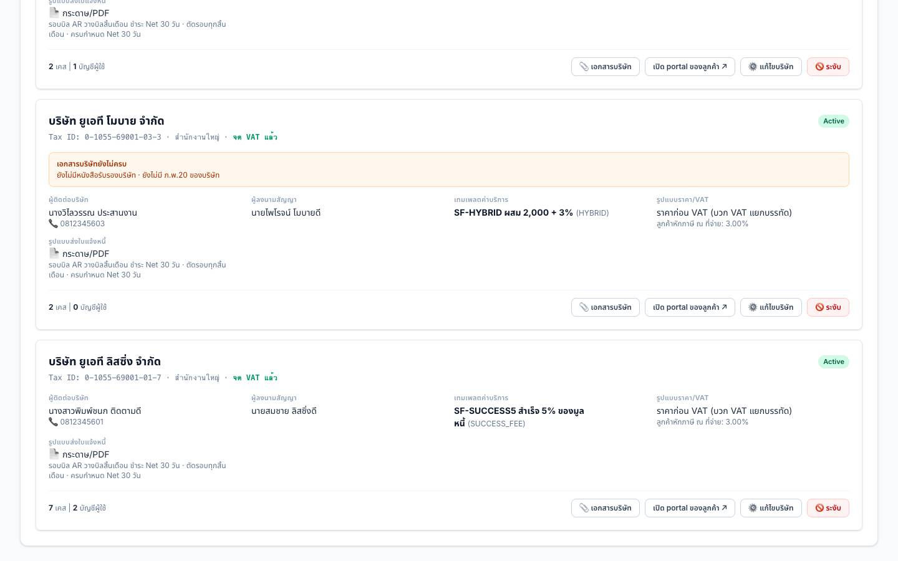

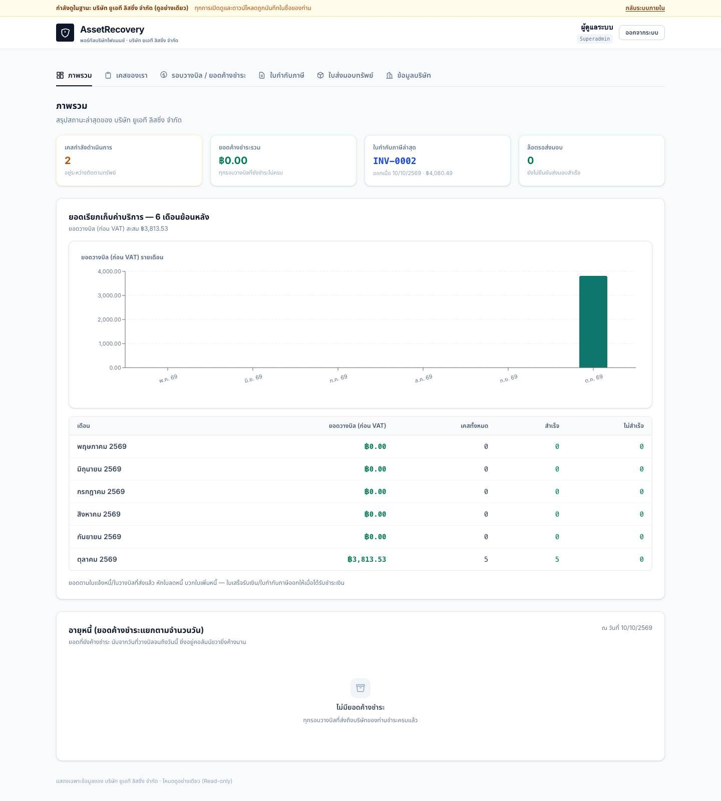

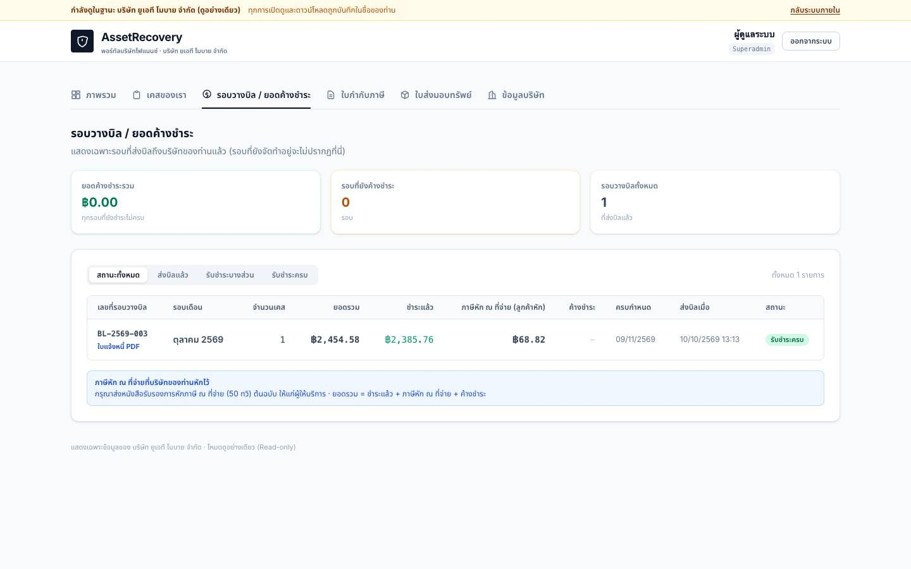

**ข้อควรทราบ**
- เป็น **โหมดดูอย่างเดียว** ทำรายการใด ๆ แทนลูกค้าไม่ได้
- **ไม่ได้สวมรอยเป็นผู้ใช้ของลูกค้า** — มุมขวาบนยังแสดงชื่อและบทบาทของท่านเอง และทุกการเปิดดู/ดาวน์โหลดถูกบันทึกในชื่อของท่าน
- ข้อมูลที่เห็นเหมือนระดับ **ผู้จัดการ** ของบริษัทนั้น ถ้าลูกค้าเป็นระดับหัวหน้าหรือแอดมิน เขาจะเห็นน้อยกว่าที่ท่านเห็น (ดูตารางระดับสิทธิ์ต้นเล่ม) — ควรคำนึงถึงตอนอธิบายลูกค้า
- เปิดดูหลายบริษัทพร้อมกันได้ โดยเปิดแต่ละบริษัทในแท็บของตัวเอง และตรวจชื่อบริษัทในแถบเหลืองทุกครั้งก่อนอ่านตัวเลขให้ลูกค้าฟัง
- งานที่ลูกค้าขอแต่พอร์ทัลทำไม่ได้ (รีเซ็ตรหัสผ่าน เพิ่มผู้ใช้ เปลี่ยนระดับสิทธิ์ แก้ข้อมูลบริษัท) ทำในระบบภายในที่ **การตั้งค่า → ผู้ใช้งาน** และ **การตั้งค่า → บริษัทไฟแนนซ์** — ดู [เล่ม 1](01-admin.md)
