# ผังการทำงาน (Work Flow) — AssetRecovery

> ผังภาพรวมทั้งระบบ ตั้งแต่ตั้งค่า → รับเคส → ติดตามภาคสนาม → คลัง/ส่งมอบ → เบิกจ่าย → รายได้/วางบิล → รับชำระ → ปิดงวดส่งสำนักงานบัญชี
> ชื่อสถานะ/ปุ่ม/เมนูในผังเป็นข้อความเดียวกับที่ผู้ใช้เห็นบนหน้าจอ · วิธีอ่านสัญลักษณ์ดูที่ [README](README.md)

## สารบัญ

1. [ผังภาพรวมทั้งระบบ (แยกตามแผนก)](#1-ผังภาพรวมทั้งระบบ-แยกตามแผนก)
2. ผังย่อยต่อโมดูล
   - [2.1 รับเคสและอนุมัติเคส](#21-รับเคสและอนุมัติเคส)
   - [2.2 มอบหมายงานและภาคสนาม](#22-มอบหมายงานและภาคสนาม)
   - [2.3 คลังสินค้าและล็อตส่งมอบ](#23-คลังสินค้าและล็อตส่งมอบ)
   - [2.4 เบิกค่าใช้จ่าย · อนุมัติ · รอบจ่าย · เงินทดรอง](#24-เบิกค่าใช้จ่าย--อนุมัติ--รอบจ่าย--เงินทดรอง)
   - [2.5 รายได้ · วางบิล · รับชำระ (AR)](#25-รายได้--วางบิล--รับชำระ-ar)
   - [2.6 บัญชี · ปิดงวด · ปรับปรุงหลังปิดงวด](#26-บัญชี--ปิดงวด--ปรับปรุงหลังปิดงวด)
3. ผังสถานะ (State) ของข้อมูลหลัก
   - [3.1 เคส](#31-สถานะเคส) · [3.2 งานมอบหมาย](#32-สถานะงานมอบหมายภาคสนาม) · [3.3 รายการเบิก](#33-สถานะรายการเบิกค่าตอบแทน)
   - [3.4 รอบจ่ายเงิน](#34-สถานะรอบจ่ายเงิน) · [3.5 รอบวางบิล](#35-สถานะรอบวางบิล) · [3.6 ล็อตส่งมอบ](#36-สถานะล็อตส่งมอบ) · [3.7 รอบบัญชี](#37-สถานะรอบบัญชีงวด)
   - เพิ่มเติม: [3.8 เงินทดรองจ่าย](#38-สถานะเงินทดรองจ่าย) · [3.9 ทรัพย์ในคลัง](#39-สถานะทรัพย์ในคลัง)
4. [หมายเหตุ: จุดที่เอกสารสเปคกับโค้ดปัจจุบันไม่ตรงกัน](#4-หมายเหตุ-จุดที่เอกสารสเปคกับโค้ดปัจจุบันไม่ตรงกัน)

---

## 1. ผังภาพรวมทั้งระบบ (แยกตามแผนก)

แต่ละกรอบคือแผนก/ผู้รับผิดชอบ · ลูกศรคือการส่งต่องาน · ◇ คือจุดตัดสินใจ

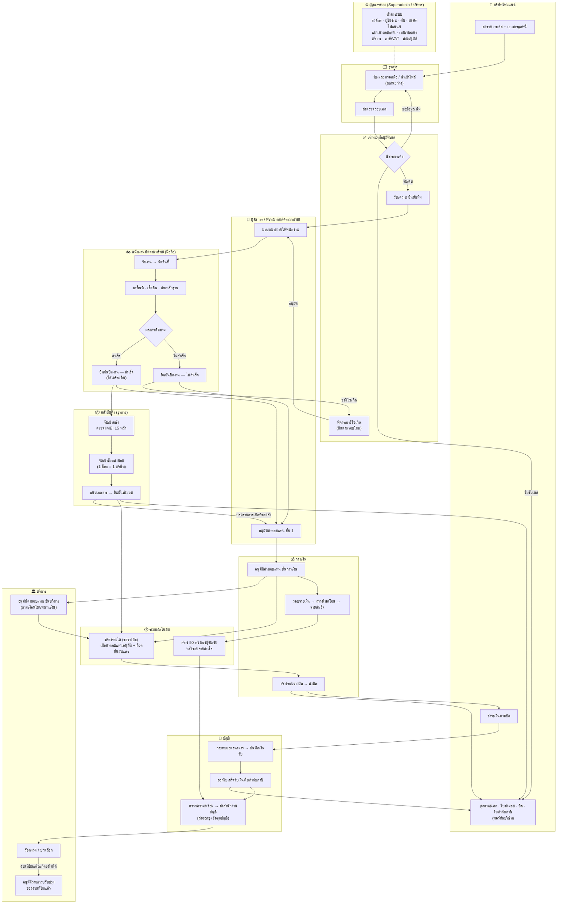

> **ลำดับหลัก** — เคสที่ปิดสำเร็จต้องผ่าน **คลังสินค้า** เสมอ (แม้ไม่มีรายการเบิก) รายได้จึงจะเกิด · เคสที่ปิดไม่สำเร็จ**ไม่ผ่านคลัง** และเกิดรายได้เฉพาะเมื่อเทมเพลตค่าบริการกำหนด "ยอดกรณีไม่สำเร็จ" ไว้

---

## 2. ผังย่อยต่อโมดูล

### 2.1 รับเคสและอนุมัติเคส

เมนู: **จัดการเคส → รับเคส**

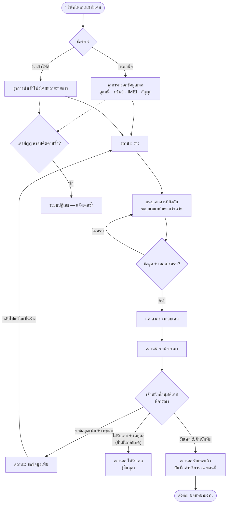

### 2.2 มอบหมายงานและภาคสนาม

เมนู: **จัดการเคส → มอบหมายงาน** (ผู้จัดการ/หัวหน้าทีม) · **จัดการเคส → ติดตามภาคสนาม** (พนักงาน — มือถือ)

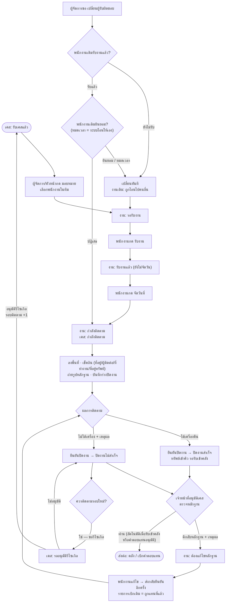

> ระหว่างลงพื้นที่ ระบบคำนวณ **ค่าน้ำมันเหมาจ่าย/เบี้ยเลี้ยงรายวัน** ให้อัตโนมัติทุกวัน (งานเบื้องหลังรายวัน) · พนักงานเบิกค่าที่พัก/ค่าใช้จ่ายมีใบเสร็จเองได้ที่เมนู "เบิกค่าใช้จ่าย"

### 2.3 คลังสินค้าและล็อตส่งมอบ

เมนู: **คลังสินค้า** (ธุรการทำงานคลัง · การเงิน/บัญชี/ผู้จัดการทีมดูอย่างเดียว)

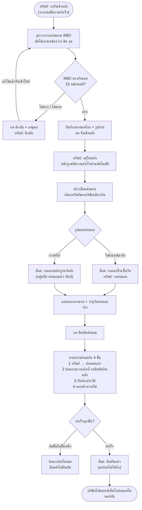

### 2.4 เบิกค่าใช้จ่าย · อนุมัติ · รอบจ่าย · เงินทดรอง

เมนู: **การเงิน → ค่าตอบแทน / รออนุมัติ / เงินทดรองจ่าย / รอบจ่ายเงิน / ผู้รับเงิน (Payee)** · พนักงาน: **เบิกค่าใช้จ่าย / เงินทดรองจ่าย** (มือถือ)

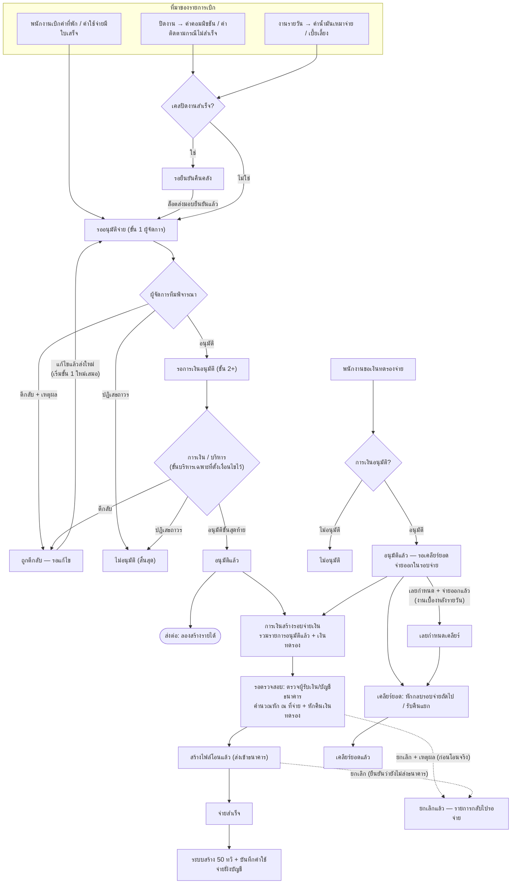

### 2.5 รายได้ · วางบิล · รับชำระ (AR)

เมนู: **การเงิน → รายได้และวางบิล / 50 ทวิ ลูกค้า** · **บัญชี → งานบัญชี → เงินรับ / กระทบยอด / รายได้และขาย**

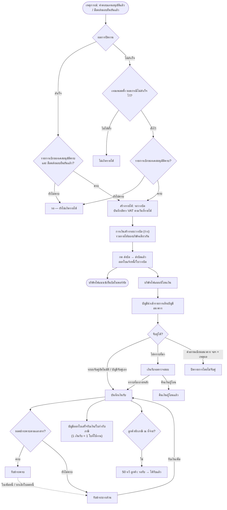

### 2.6 บัญชี · ปิดงวด · ปรับปรุงหลังปิดงวด

เมนู: **บัญชี → งานบัญชี → รอบส่งบัญชี / เอกสารไม่ครบ / ข้อซักถาม / ส่งมอบ / เอกสาร & WHT** · **การเงิน → ปรับปรุง**

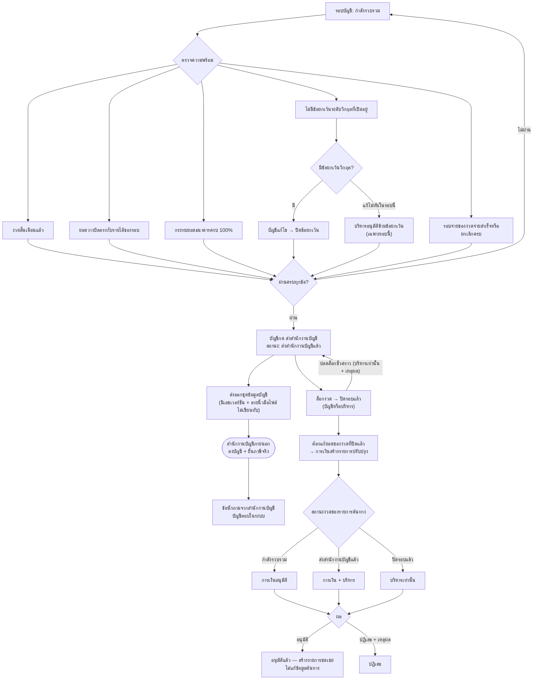

---

## 3. ผังสถานะ (State) ของข้อมูลหลัก

> ชื่อในกล่อง = ป้ายสถานะที่ผู้ใช้เห็น · ข้อความบนลูกศร = ปุ่ม/เหตุการณ์ที่ทำให้เปลี่ยน · `[*]` = จุดเริ่ม/สิ้นสุด

### 3.1 สถานะเคส

```mermaid
stateDiagram-v2
  %% enum case_status (02 §3) · lib/cases/state-machine.ts + lib/field/queries.ts
  state "ร่าง" as draft
  state "รอพิจารณา" as pending_review
  state "ขอข้อมูลเพิ่ม" as need_info
  state "ไม่รับเคส" as rejected
  state "รับเคสแล้ว" as approved
  state "กำลังติดตาม" as active
  state "ปิดงานสำเร็จ" as closed_success
  state "ปิดงานไม่สำเร็จ" as closed_fail
  state "รออนุมัติรีไซเกิล" as pending_recycle_review

  [*] --> draft: กรอกมือ / นำเข้าไฟล์
  draft --> pending_review: ส่งตรวจสอบเคส
  pending_review --> approved: รับเคส & ยืนยันทีม
  pending_review --> rejected: ไม่รับเคส (เหตุผล)
  pending_review --> need_info: ขอข้อมูลเพิ่ม (เหตุผล)
  need_info --> draft: กลับไปแก้ไขเป็นร่าง
  approved --> active: พนักงานจัดวันที่
  active --> closed_success: ยืนยันปิดงาน (สำเร็จ)
  active --> closed_fail: ยืนยันปิดงาน (ไม่สำเร็จ)
  closed_fail --> pending_recycle_review: ขอรีไซเกิล (เหตุผล)
  pending_recycle_review --> approved: อนุมัติรีไซเกิล (รอบติดตาม +1)
  pending_recycle_review --> closed_fail: ไม่อนุมัติรีไซเกิล (เหตุผล)
  rejected --> [*]
  closed_success --> [*]
```

### 3.2 สถานะงานมอบหมาย (ภาคสนาม)

สถานะย่อยของเคสที่ "รับเคสแล้ว" — 1 เคสมีงานที่ยังเปิดได้ครั้งละ 1 งาน

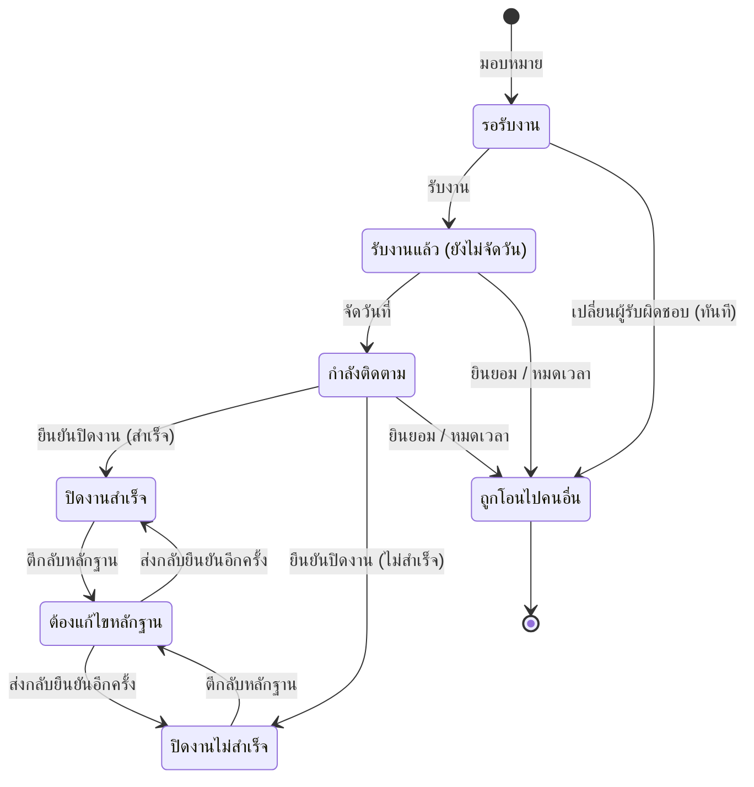

### 3.3 สถานะรายการเบิก/ค่าตอบแทน

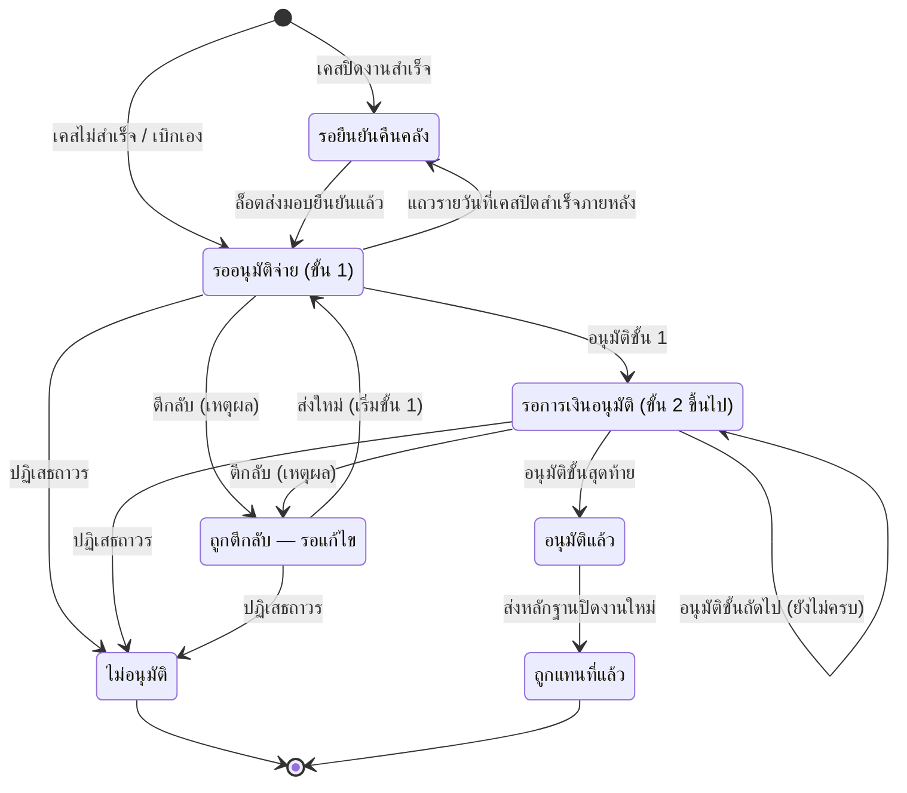

### 3.4 สถานะรอบจ่ายเงิน

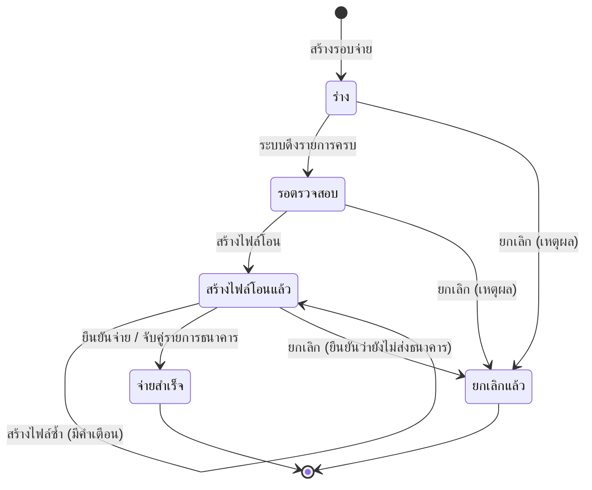

### 3.5 สถานะรอบวางบิล

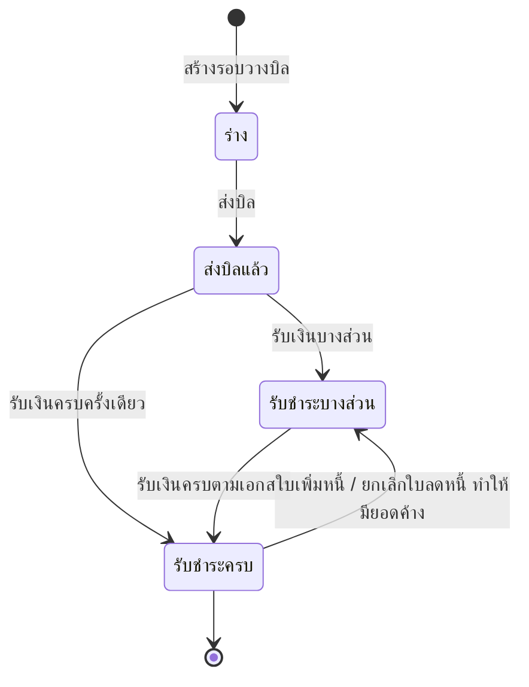

### 3.6 สถานะล็อตส่งมอบ

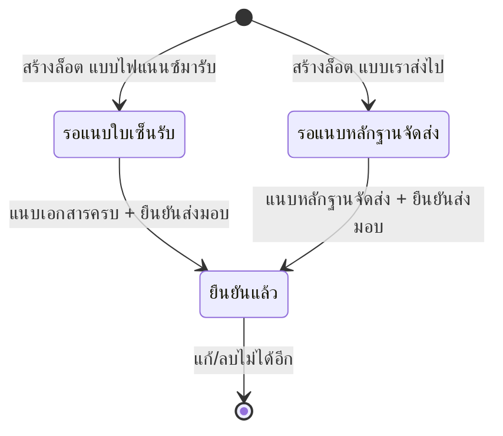

### 3.7 สถานะรอบบัญชี (งวด)

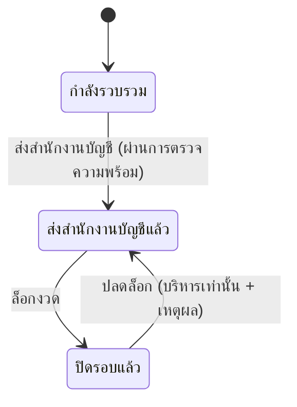

> งวดที่ **ปิดรอบแล้ว** ห้ามแก้ข้อมูลต้นทาง (รายได้/รายการเบิก/รอบวางบิล/รอบจ่าย) โดยตรงทุกกรณี ต้องทำ **รายการปรับปรุง** แทน

### 3.8 สถานะเงินทดรองจ่าย

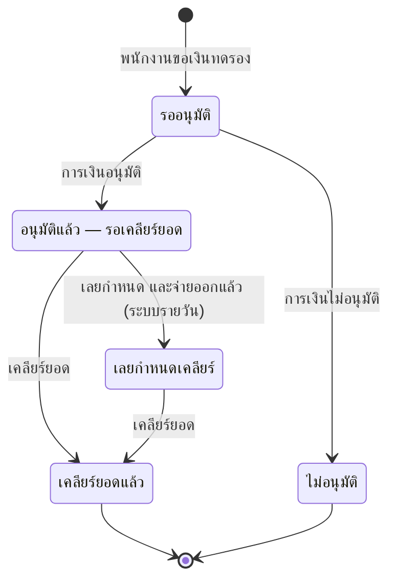

### 3.9 สถานะทรัพย์ในคลัง

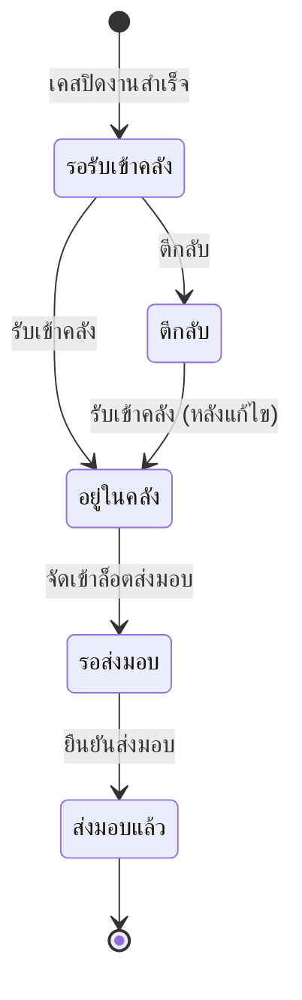

---

## 4. หมายเหตุ: จุดที่เอกสารสเปคกับโค้ดปัจจุบันไม่ตรงกัน

ผังในไฟล์นี้ยึด **โค้ดปัจจุบัน** เป็นหลัก — จุดที่ต่างจากเอกสาร (สำหรับทีมพัฒนา)

| # | เรื่อง | เอกสารสเปค | โค้ดปัจจุบัน (ที่ผังใช้) |
|---|---|---|---|
| 1 | state ของเคส / งานมอบหมาย / ล็อตส่งมอบ / ทรัพย์ | `docs/23` ไม่มี state machine ของ 4 entity นี้ (มีเฉพาะฝั่งการเงิน/บัญชี) | ยึด enum ใน `prisma/schema.prisma` (`02` §3) + `lib/cases/state-machine.ts` · `lib/field/field-status.ts` · `lib/warehouse/lot-status.ts` · `lib/warehouse/asset-status.ts` |
| 2 | เคส `รับเคสแล้ว → กำลังติดตาม → ปิดงาน` | ไม่ได้เขียนเป็นเส้นใน `23` | เคสเป็น "กำลังติดตาม" ตอนพนักงาน **จัดวันที่** และเป็น "ปิดงานสำเร็จ/ไม่สำเร็จ" ตอนยืนยันปิดงาน (`lib/field/queries.ts`) |
| 3 | รายการเบิก → ถูกแทนที่แล้ว | `23` §6.3 มีเส้นเดียว `approved → superseded` | `lib/field/expense-status.ts` ยอม `supersede` จาก รอยืนยันคืนคลัง / รออนุมัติจ่าย / รอการเงินอนุมัติ / ถูกตีกลับ / อนุมัติแล้ว (ผังวาดเฉพาะเส้นตามสเปค) |
| 4 | สายอนุมัติขั้นเดียว | `23` §6.3 เขียน `pending_approval → pending_finance_approval → approved` | `lib/compensation/approval.ts`: สายที่มีขั้นเดียวไปจาก รออนุมัติจ่าย → อนุมัติแล้ว ได้ตรง · ขั้น ≥ 2 ทุกขั้นใช้สถานะ "รอการเงินอนุมัติ" |
| 5 | ผู้ล็อกงวด | `23` §6.13 "Executive ยืนยันปิดงวด" | `app/api/accounting/periods/[id]/lock` ยอมทั้งบัญชี (`manage_accounting_period`) และบริหาร (`unlock_period`) ตาม `30` §9 · ปลดล็อกยังเป็นของบริหารเท่านั้น |
| 6 | เมนู "มอบหมายงาน" ของเจ้าหน้าที่อนุมัติเคส | `06` §7.1 ข้อความใต้ผังบอกว่าเห็น · ตาราง §7.1.1 บอกว่าไม่เห็น | `lib/nav/menu-registry.ts` ไม่ให้เห็น (ตรงกับตาราง §7.1.1) |
| 7 | ช่องทางส่งเคสจากบริษัทไฟแนนซ์ | enum `case_source` มี `api` | หน้าที่ใช้งานจริงมี กรอกมือ + นำเข้าไฟล์ (ธุรการ) · พอร์ทัลบริษัทเป็นแบบอ่านอย่างเดียว ส่งเคสผ่านพอร์ทัลไม่ได้ |
