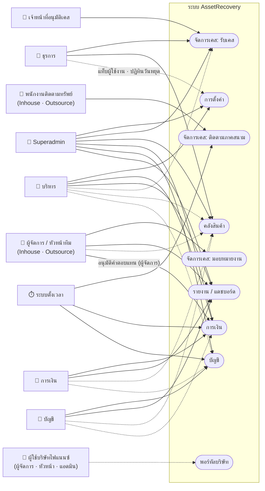
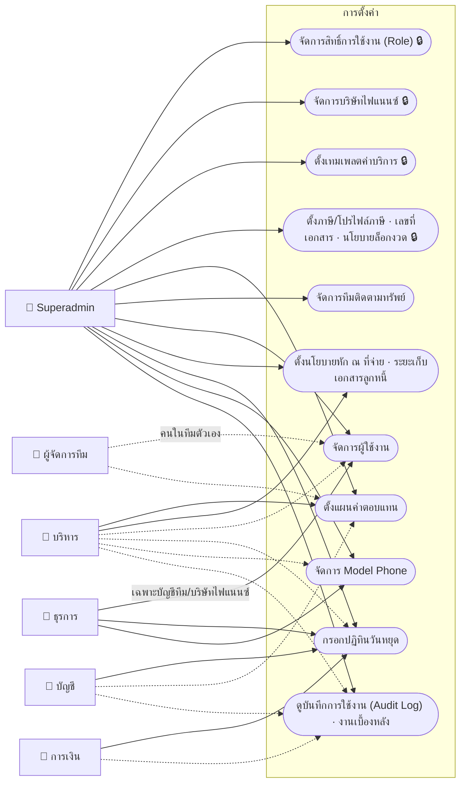
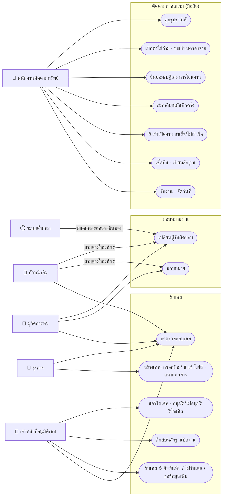
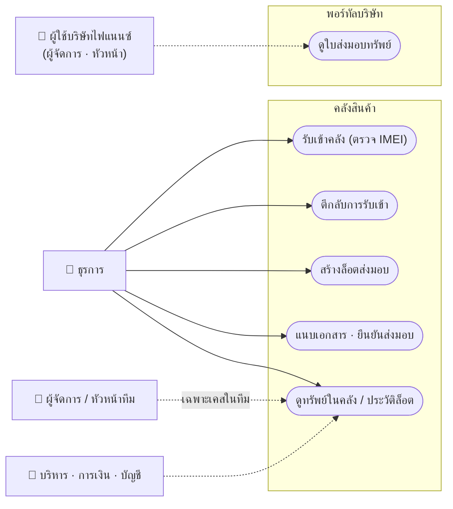
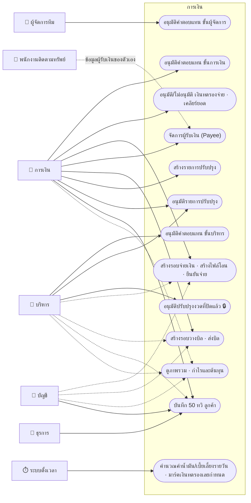
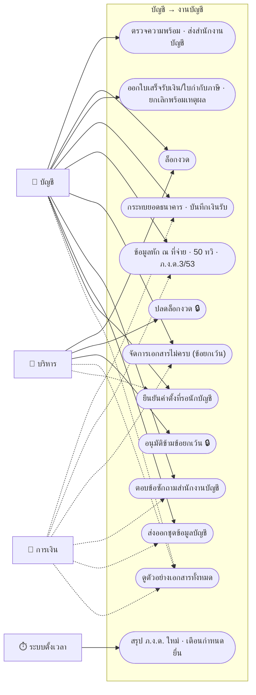
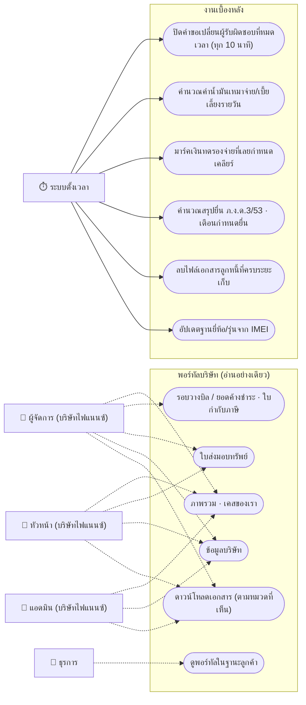

# ผังกรณีการใช้งาน (Use Case Diagram) — AssetRecovery

> ใครทำอะไรในระบบได้บ้าง · ผู้ใช้ (actor) = 👤 · กรณีการใช้งาน (use case) = กล่องวงรี · กรอบ = ระบบย่อย
> Mermaid ไม่มีผัง use case โดยตรง จึงวาดด้วย flowchart แทน (เส้นทึบ = ทำได้/จัดการได้ · เส้นประ = ดูอย่างเดียว)
> สิทธิ์ทั้งหมดอิงค่าเริ่มต้นของระบบ — Superadmin ปรับสิทธิ์ของ role อื่นได้ที่ **การตั้งค่า → สิทธิ์การใช้งาน** (ยกเว้นรายการที่ล็อก 🔒)

## สารบัญ

1. [กลุ่มผู้ใช้ทั้งหมด (15 role + ระบบ)](#1-กลุ่มผู้ใช้ทั้งหมด-15-role--ระบบ)
2. [ภาพรวม: ผู้ใช้ × ระบบย่อย](#2-ภาพรวม-ผู้ใช้--ระบบย่อย)
3. ผังกรณีการใช้งานต่อระบบย่อย
   - [3.1 ตั้งค่าระบบและผู้ใช้](#31-ตั้งค่าระบบและผู้ใช้)
   - [3.2 รับเคส · มอบหมาย · ภาคสนาม](#32-รับเคส--มอบหมาย--ภาคสนาม)
   - [3.3 คลังสินค้า](#33-คลังสินค้า)
   - [3.4 การเงิน](#34-การเงิน)
   - [3.5 บัญชีและปิดงวด](#35-บัญชีและปิดงวด)
   - [3.6 พอร์ทัลบริษัทไฟแนนซ์ และระบบตั้งเวลา](#36-พอร์ทัลบริษัทไฟแนนซ์-และระบบตั้งเวลา)
4. [ตารางสรุป use case × role](#4-ตารางสรุป-use-case--role)
5. [หมายเหตุ: จุดที่เอกสารสเปคกับโค้ดไม่ตรงกัน](#5-หมายเหตุ-จุดที่เอกสารสเปคกับโค้ดไม่ตรงกัน)

---

## 1. กลุ่มผู้ใช้ทั้งหมด (15 role + ระบบ)

| กลุ่ม actor | role ในระบบ | กลุ่มบัญชี |
|---|---|---|
| ผู้ดูแลระบบ | Superadmin | ระบบ (System) |
| บริหาร | บริหาร | ระบบ (System) |
| การเงิน | การเงิน | ระบบ (System) |
| บัญชี | บัญชี | ระบบ (System) |
| ธุรการ | ธุรการ | ระบบ (System) |
| เจ้าหน้าที่อนุมัติเคส | เจ้าหน้าที่อนุมัติเคส | ระบบ (System) |
| ผู้จัดการ/หัวหน้าทีม | ผู้จัดการทีมติดตามทรัพย์ · หัวหน้าทีมติดตามทรัพย์ | Inhouse และ Outsource (คนละชุดกัน = 4 role) |
| พนักงานภาคสนาม | พนักงานติดตามทรัพย์ | Inhouse และ Outsource (2 role) |
| ผู้ใช้บริษัทไฟแนนซ์ | ผู้จัดการ · หัวหน้า · แอดมิน | บริษัทไฟแนนซ์ (3 role) |
| ระบบตั้งเวลา | งานเบื้องหลังอัตโนมัติ (ทุก 10 นาที / รายวัน) | — (ไม่ใช่ผู้ใช้) |

รวม 6 + 4 + 2 + 3 = **15 role**

---

## 2. ภาพรวม: ผู้ใช้ × ระบบย่อย

---

## 3. ผังกรณีการใช้งานต่อระบบย่อย

### 3.1 ตั้งค่าระบบและผู้ใช้

### 3.2 รับเคส · มอบหมาย · ภาคสนาม

### 3.3 คลังสินค้า

### 3.4 การเงิน

### 3.5 บัญชีและปิดงวด

### 3.6 พอร์ทัลบริษัทไฟแนนซ์ และระบบตั้งเวลา

> งานเบื้องหลังที่ **ผู้ใช้สั่ง** (ไม่ใช่ตั้งเวลา): ส่งออกชุดข้อมูลบัญชี · สร้างไฟล์โอนเงินของรอบจ่าย · ส่งออกรายงานขนาดใหญ่ · ทำขั้นหลังรอบจ่ายสำเร็จ · คำนวณระยะทางค่าน้ำมันย้อนหลัง — ดูสถานะได้ที่ **การตั้งค่า → งานเบื้องหลัง (Job Log)**

---

## 4. ตารางสรุป use case × role

สัญลักษณ์: ✅ = ทำ/จัดการได้ · 👁 = ดูอย่างเดียว · — = ไม่เห็น · 🔒 = ล็อกกับ role เจ้าของ (มอบให้ role อื่นไม่ได้) · ⓢ = จำกัดขอบเขต (ทีมตัวเอง / งานตัวเอง / บริษัทตัวเอง)

คอลัมน์: **SA** Superadmin · **บห** บริหาร · **กง** การเงิน · **บช** บัญชี · **ธก** ธุรการ · **อค** เจ้าหน้าที่อนุมัติเคส · **ผจ-I/หน-I/พน-I** ผู้จัดการ/หัวหน้า/พนักงาน ทีม Inhouse · **ผจ-O/หน-O/พน-O** ทีม Outsource · **ฟ-ผจ/ฟ-หน/ฟ-อด** ผู้จัดการ/หัวหน้า/แอดมิน ของบริษัทไฟแนนซ์

| Use case | สิทธิ์ในระบบ | SA | บห | กง | บช | ธก | อค | ผจ-I | หน-I | พน-I | ผจ-O | หน-O | พน-O | ฟ-ผจ | ฟ-หน | ฟ-อด |
|---|---|---|---|---|---|---|---|---|---|---|---|---|---|---|---|---|
| **การตั้งค่า** | | | | | | | | | | | | | | | | |
| จัดการสิทธิ์การใช้งาน (Role) | `manage_roles` 🔒 | ✅ | — | — | — | — | — | — | — | — | — | — | — | — | — | — |
| บริษัทไฟแนนซ์ · เทมเพลตค่าบริการ · โปรไฟล์ภาษี · เลขที่เอกสาร · นโยบายล็อกงวด | 🔒 (5 รายการ) | ✅ | — | — | — | — | — | — | — | — | — | — | — | — | — | — |
| ดูข้อมูลหลัก (master data) | `view_master_data` | ✅ | 👁 | 👁 | 👁 | 👁 | — | — | — | — | — | — | — | — | — | — |
| แผนค่าตอบแทน | `manage_compensation_plans` | ✅ | ✅ | ✅¹ | 👁 | — | — | 👁 | — | — | 👁 | — | — | — | — | — |
| จัดการผู้ใช้งาน | `manage_users` | ✅ | 👁 | — | — | ✅² | — | 👁ⓢ | — | — | 👁ⓢ | — | — | — | — | — |
| นโยบายหัก ณ ที่จ่าย | `manage_wht_policy` | ✅ | ✅ | — | — | — | — | — | — | — | — | — | — | — | — | — |
| ระยะเก็บเอกสารลูกหนี้ | `manage_data_retention` | ✅ | ✅ | — | — | — | — | — | — | — | — | — | — | — | — | — |
| ปฏิทินวันหยุด | `manage_holidays` | ✅ | 👁 | ✅ | ✅ | ✅ | — | — | — | — | — | — | — | — | — | — |
| Model Phone | `manage_device_catalog` | ✅ | 👁 | — | — | ✅ | — | — | — | — | — | — | — | — | — | — |
| บันทึกการใช้งาน (Audit Log) | `view_audit_log` | ✅ | 👁 | 👁 | 👁 | — | — | — | — | — | — | — | — | — | — | — |
| งานเบื้องหลัง (Job Log) — ดู/สั่งซ้ำ | `manage_jobs` | ✅ | 👁 | 👁 | 👁 | — | — | — | — | — | — | — | — | — | — | — |
| **เคส · ภาคสนาม** | | | | | | | | | | | | | | | | |
| สร้างเคส · นำเข้าไฟล์ · แนบเอกสาร | `record_admin_data` | ✅ | — | — | — | ✅ | — | — | — | — | — | — | — | — | — | — |
| ส่งตรวจสอบเคส | `record_admin_data` / `approve_case` / `assign_case` | ✅ | — | — | — | ✅ | ✅ | ✅ⓢ | ✅ⓢ | — | ✅ⓢ | ✅ⓢ | — | — | — | — |
| ดูรายการเคส (เมนูจัดการเคส) | (ตามหน้าที่) | ✅ | 👁 | — | — | ✅ | ✅ | ✅ⓢ | ✅ⓢ | — | ✅ⓢ | ✅ⓢ | — | — | — | — |
| รับเคส & ยืนยันทีม / ไม่รับเคส / ขอข้อมูลเพิ่ม | `approve_case` | ✅ | — | — | — | — | ✅ | — | — | — | — | — | — | — | — | — |
| ตีกลับหลักฐานปิดงาน | `reject_evidence` | ✅ | — | — | — | — | ✅ | — | — | — | — | — | — | — | — | — |
| ขอ/อนุมัติ/ไม่อนุมัติ รีไซเคิล | `approve_recycle` | ✅ | — | — | — | — | ✅ | — | — | — | — | — | — | — | — | — |
| มอบหมาย · เปลี่ยนผู้รับผิดชอบ | `assign_case` | ✅ | — | — | — | — | — | ✅ⓢ | ✅ⓢ³ | — | ✅ⓢ | ✅ⓢ³ | — | — | — | — |
| รับงาน · จัดวันที่ · เช็คอิน · ปิดงาน · ส่งกลับยืนยัน | `perform_field_work` | ✅ | — | — | — | — | — | — | — | ✅ⓢ | — | — | ✅ⓢ | — | — | — |
| ขอเงินทดรองจ่าย | `request_advance` | ✅ | — | 👁 | — | — | — | — | — | ✅ⓢ | — | — | ✅ⓢ | — | — | — |
| **คลังสินค้า** | | | | | | | | | | | | | | | | |
| รับเข้าคลัง (ตรวจ IMEI) | `intake_asset` | ✅ | 👁 | 👁 | 👁 | ✅ | — | 👁ⓢ | 👁ⓢ | — | 👁ⓢ | 👁ⓢ | — | — | — | — |
| ตีกลับการรับเข้า | `reject_asset_intake` | ✅ | — | — | — | ✅ | — | — | — | — | — | — | — | — | — | — |
| สร้างล็อตส่งมอบ | `create_handover_lot` | ✅ | — | — | — | ✅ | — | — | — | — | — | — | — | — | — | — |
| ยืนยันส่งมอบล็อต | `confirm_handover_lot` | ✅ | — | — | — | ✅ | — | — | — | — | — | — | — | — | — | — |
| **การเงิน** | | | | | | | | | | | | | | | | |
| อนุมัติค่าตอบแทน ขั้นผู้จัดการ | `approve_expense_manager` | ✅ | — | — | — | — | — | ✅ⓢ | — | — | ✅ⓢ | — | — | — | — | — |
| อนุมัติค่าตอบแทน ขั้นการเงิน | `approve_expense_finance` | ✅ | — | ✅ | — | — | — | — | — | — | — | — | — | — | — | — |
| อนุมัติค่าตอบแทน ขั้นบริหาร | `approve_expense_executive` | ✅ | ✅ | — | — | — | — | — | — | — | — | — | — | — | — | — |
| อนุมัติเงินทดรองจ่าย | `approve_advance` | ✅ | — | ✅ | — | — | — | — | — | — | — | — | — | — | — | — |
| รอบจ่ายเงิน | `manage_payout_batch` | ✅ | 👁 | ✅ | 👁 | — | — | — | — | — | — | — | — | — | — | — |
| สร้างไฟล์โอน | `generate_payment_file` | ✅ | — | ✅ | — | — | — | — | — | — | — | — | — | — | — | — |
| ผู้รับเงิน (Payee) | `manage_payee_profile` | ✅ | — | ✅ | — | — | — | — | — | 👁ⓢ | — | — | 👁ⓢ | — | — | — |
| รายได้และวางบิล | `manage_billing` | ✅ | 👁 | ✅ | 👁 | — | — | — | — | — | — | — | — | — | — | — |
| 50 ทวิ ลูกค้า | `manage_customer_wht` | ✅ | 👁 | ✅ | ✅ | ✅ | — | — | — | — | — | — | — | — | — | — |
| สร้างรายการปรับปรุง | `create_adjustment` | ✅ | — | ✅ | — | — | — | — | — | — | — | — | — | — | — | — |
| อนุมัติรายการปรับปรุง | `approve_adjustment` | ✅ | ✅ | ✅ | — | — | — | — | — | — | — | — | — | — | — | — |
| อนุมัติปรับปรุงงวดที่ปิดแล้ว | `approve_adjustment_locked` 🔒 | ✅⁴ | ✅ | — | — | — | — | — | — | — | — | — | — | — | — | — |
| ภาพรวมการเงิน · กำไรและต้นทุน | `view_finance_dashboard` | ✅ | 👁 | 👁 | 👁 | — | — | — | — | — | — | — | — | — | — | — |
| **บัญชี** | | | | | | | | | | | | | | | | |
| ส่งสำนักงานบัญชี · ล็อกงวด | `manage_accounting_period` | ✅ | ✅⁵ | — | ✅ | — | — | — | — | — | — | — | — | — | — | — |
| ปลดล็อกงวด | `unlock_period` 🔒 | ✅⁴ | ✅ | — | — | — | — | — | — | — | — | — | — | — | — | — |
| ใบเสร็จรับเงิน/ใบกำกับภาษี | `manage_tax_invoice` | ✅ | — | — | ✅ | — | — | — | — | — | — | — | — | — | — | — |
| หัก ณ ที่จ่าย · 50 ทวิ · ภ.ง.ด. | `manage_wht` | ✅ | — | 👁 | ✅ | — | — | — | — | — | — | — | — | — | — | — |
| รายได้และขาย · ค่าใช้จ่าย · ศูนย์ต้นทุน | `manage_sales_expenses` / `map_cost_center` | ✅ | — | 👁 | ✅ | — | — | — | — | — | — | — | — | — | — | — |
| กระทบยอดธนาคาร | `manage_bank_reconciliation` | ✅ | — | 👁 | ✅ | — | — | — | — | — | — | — | — | — | — | — |
| เอกสารไม่ครบ (ข้อยกเว้น) | `manage_exceptions` | ✅ | — | 👁 | ✅ | — | — | — | — | — | — | — | — | — | — | — |
| อนุมัติข้ามข้อยกเว้น | `authorize_exception` 🔒 | ✅⁴ | ✅ | — | — | — | — | — | — | — | — | — | — | — | — | — |
| ข้อซักถามสำนักงานบัญชี | `manage_accountant_questions` | ✅ | — | 👁 | ✅ | — | — | — | — | — | — | — | — | — | — | — |
| ส่งออกชุดข้อมูลบัญชี | `export_accounting_pack` | ✅ | — | 👁 | ✅ | — | — | — | — | — | — | — | — | — | — | — |
| ตัวอย่างเอกสารทั้งหมด | `view_document_samples` | ✅ | 👁 | 👁 | 👁 | — | — | — | — | — | — | — | — | — | — | — |
| **รายงาน** | (ตามเมนู) | ✅ | ✅ | 👁 การเงิน | 👁 บัญชี | — | — | 👁ⓢ ปฏิบัติการ | 👁ⓢ ปฏิบัติการ | — | 👁ⓢ ปฏิบัติการ | 👁ⓢ ปฏิบัติการ | — | — | — | — |
| **พอร์ทัลบริษัท** | | | | | | | | | | | | | | | | |
| ภาพรวม · เคสของเรา | `portal_cases` | — | — | — | — | — | — | — | — | — | — | — | — | 👁ⓢ | 👁ⓢ | 👁ⓢ |
| รอบวางบิล · ยอดค้าง · ใบกำกับภาษี | `portal_finance` | — | — | — | — | — | — | — | — | — | — | — | — | 👁ⓢ | — | — |
| ใบส่งมอบทรัพย์ | `portal_handover` | — | — | — | — | — | — | — | — | — | — | — | — | 👁ⓢ | 👁ⓢ | — |
| ข้อมูลบริษัท | `portal_profile` | — | — | — | — | — | — | — | — | — | — | — | — | 👁ⓢ | 👁ⓢ | 👁ⓢ |
| ดาวน์โหลดเอกสาร | `portal_download` | — | — | — | — | — | — | — | — | — | — | — | — | 👁ⓢ | 👁ⓢ | 👁ⓢ |
| ดูพอร์ทัลในฐานะลูกค้า | `view_client_portal_as` | ✅ | — | — | — | 👁 | — | — | — | — | — | — | — | — | — | — |

หมายเหตุใต้ตาราง
1. การเงินถือสิทธิ์ `manage_compensation_plans` ระดับจัดการ แต่แท็บ "แผนค่าตอบแทน" ในเมนูการตั้งค่าแสดงเฉพาะ Superadmin/บริหาร (ดูหมวด 5)
2. ธุรการจัดการได้เฉพาะบัญชีกลุ่ม Inhouse / Outsource / บริษัทไฟแนนซ์ — บัญชีกลุ่มระบบเป็นของ Superadmin เท่านั้น
3. หัวหน้าทีมมอบหมาย/เปลี่ยนผู้รับผิดชอบได้ตามค่าตั้งองค์กร (ค่าเริ่มต้น = เปิด) · ถ้าปิด ปุ่มจะถูก**ซ่อน** แต่ยังเห็นเมนูมอบหมายงาน
4. Superadmin ผ่านการตรวจสิทธิ์ทุกตัวโดยนิยาม จึงทำ 3 รายการที่ล็อกกับบริหารได้ด้วยในโค้ดปัจจุบัน (ดูหมวด 5)
5. บริหารล็อกงวดได้ (ผ่านสิทธิ์ปลดล็อก) แต่ "ส่งสำนักงานบัญชี" เป็นของบัญชี

---

## 5. หมายเหตุ: จุดที่เอกสารสเปคกับโค้ดไม่ตรงกัน

ตารางข้างบนยึด **โค้ดปัจจุบัน** (`lib/roles/default-matrix.ts` · `lib/roles/capability-locks.ts` · `lib/nav/menu-registry.ts` · `lib/auth/permission.ts`)

| # | เรื่อง | เอกสารสเปค | โค้ดปัจจุบัน |
|---|---|---|---|
| 1 | Superadmin กับ 3 รายการที่ล็อกกับบริหาร (อนุมัติปรับปรุงงวดปิด · ปลดล็อกงวด · อนุมัติข้ามข้อยกเว้น) | `docs/25` §7.4/§7.5 คอลัมน์ Superadmin = "—" | `hasCapability()` คืน true ให้ Superadmin ทุกตัว + `lib/accounting/queries.ts` เขียน `isSuperadmin \|\| unlock_period` ตรง ⇒ Superadmin ทำได้ |
| 2 | ผู้ล็อกงวด | `docs/23` §6.13 "Executive ยืนยันปิดงวด" | route lock ยอม `manage_accounting_period` (บัญชี) หรือ `unlock_period` (บริหาร) ตาม `docs/30` §9 |
| 3 | การเงินกับแผนค่าตอบแทน | `docs/11` §12 ให้การเงินจัดการได้ | default-matrix ให้ `manage` แต่เมนู "การตั้งค่า → แผนค่าตอบแทน" audience = Superadmin/บริหารเท่านั้น ⇒ การเงินไม่มีทางเข้าจากเมนู |
| 4 | ผู้ขอรีไซเคิล | (ชื่อปุ่มอยู่ฝั่งเคส) | `create_recycle_request` ใช้ `approve_case` ⇒ เจ้าหน้าที่อนุมัติเคสเป็นผู้กดทั้งขอและอนุมัติ |
| 5 | เมนูมอบหมายงานของเจ้าหน้าที่อนุมัติเคส | `docs/06` §7.1 ข้อความบอกว่าเห็น · ตาราง §7.1.1 บอกว่าไม่เห็น | ไม่เห็น (ตรงตาราง) |
| 6 | Company User ในตารางเมนู `docs/06` §7.2 | คอลัมน์เดิมมี ✅ แดชบอร์ด/จัดการเคส/คลัง | ใช้พอร์ทัลทางเดียว — หน้า/API ภายในปฏิเสธ (เอกสารเองก็หมายเหตุ 🔻 ว่าคอลัมน์ใช้ไม่ได้แล้ว) |
