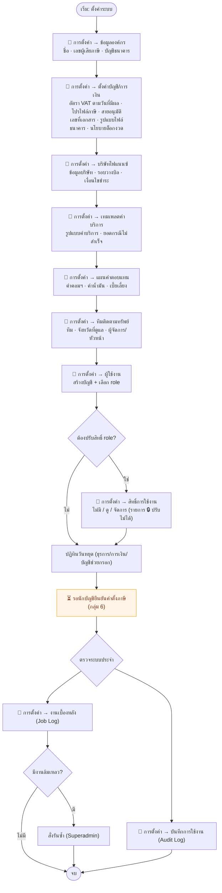
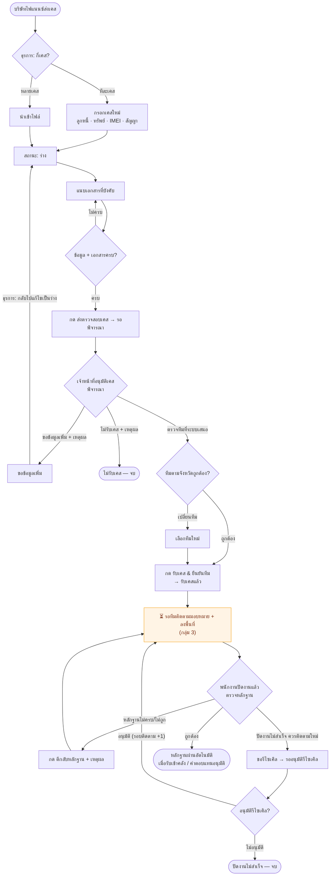
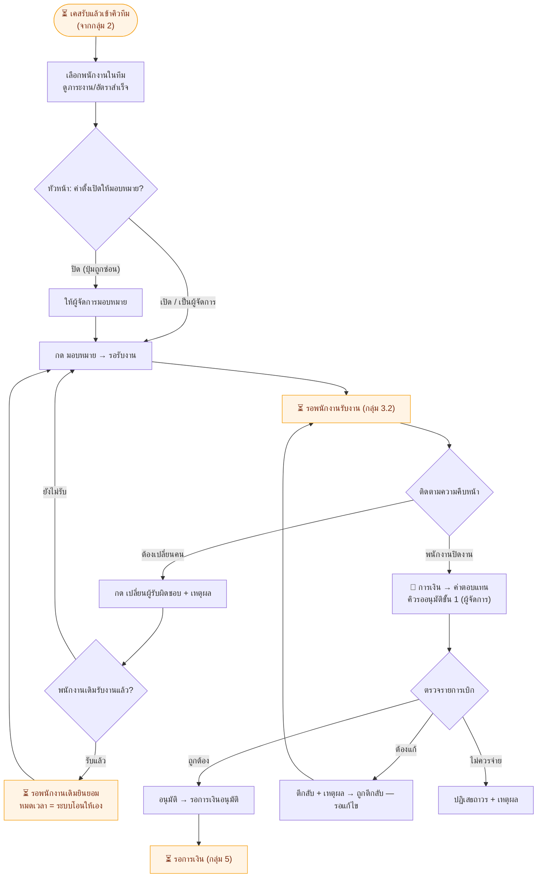
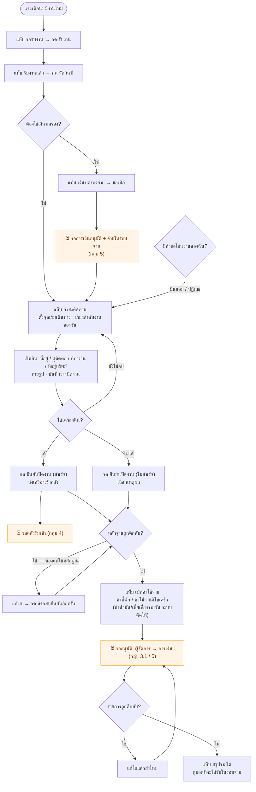
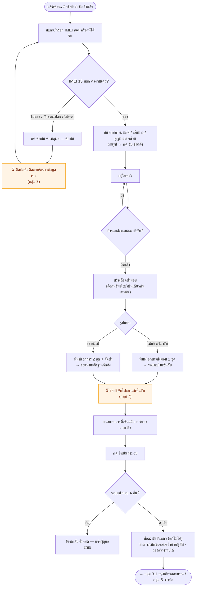
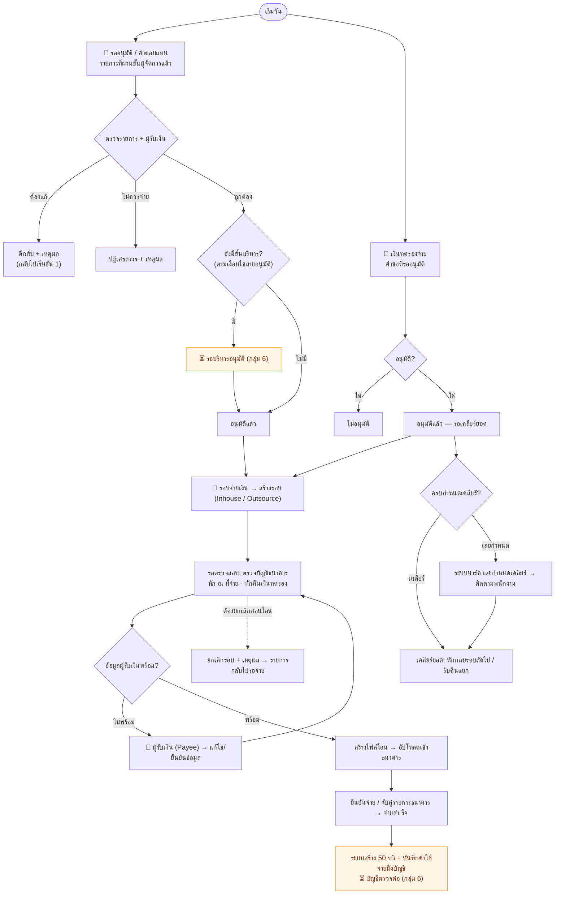
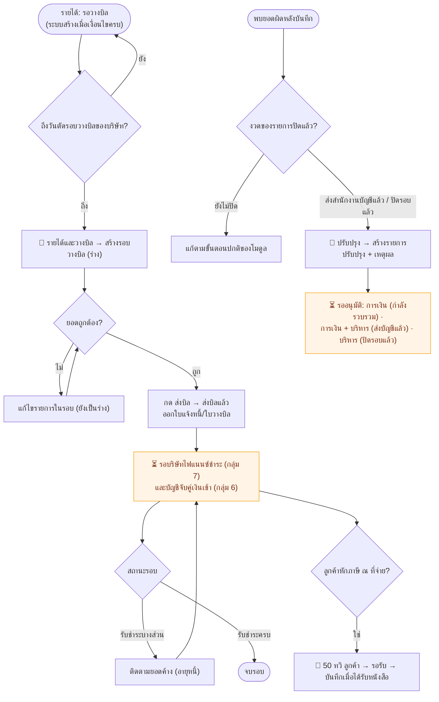
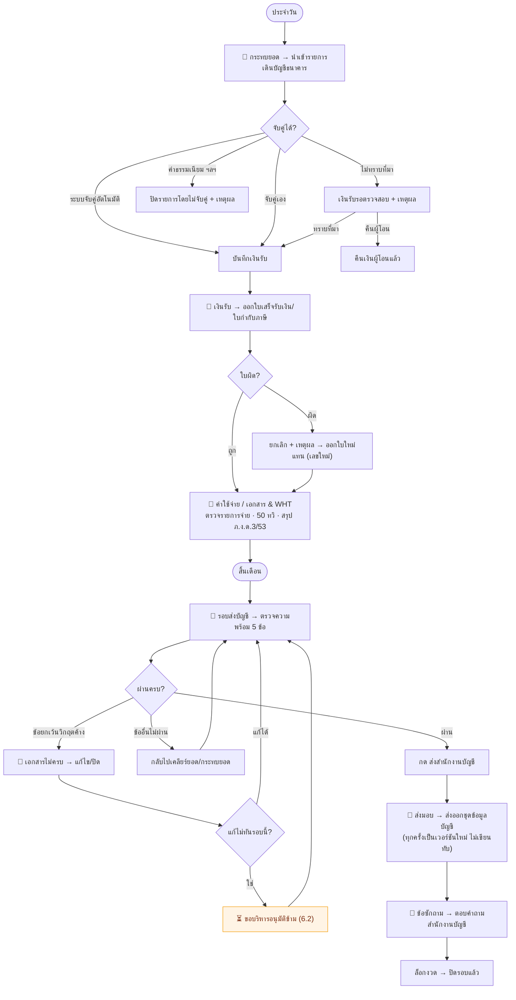
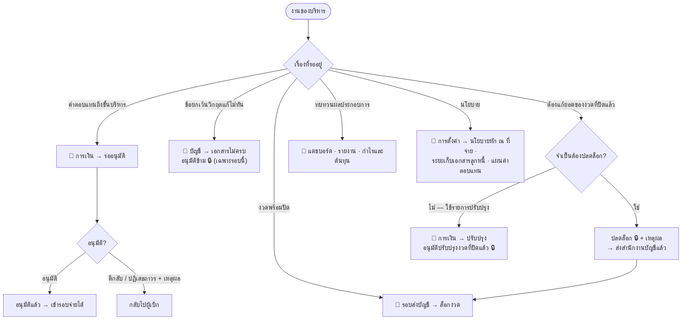
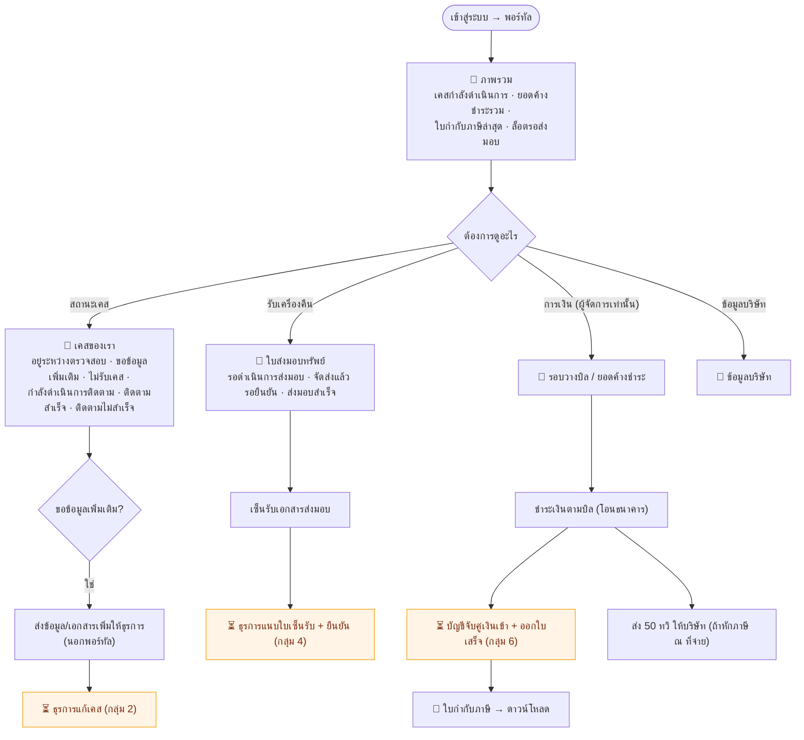

# ผังงานราย role (Flow Chart สำหรับอธิบายทีมงาน)

> แต่ละกลุ่มแสดง **งานประจำวัน/ประจำรอบ** ของ role นั้น · ◇ = จุดตัดสินใจ · กล่องสีส้ม ⏳ = **ต้องรอ role อื่น** (ลิงก์ไปกลุ่มนั้นอยู่ใต้ผัง) · 📍 = ทำที่เมนูไหน
> ชื่อเมนู/ปุ่ม/สถานะตรงกับหน้าจอจริง · วิธีอ่านสัญลักษณ์ดู [README](README.md) · ภาพรวมทั้งระบบดู [ผังการทำงาน](01-workflow.md)

## สารบัญ

1. [ผู้ดูแลระบบ (Superadmin / บริหารฝั่งตั้งค่า)](#1-ผู้ดูแลระบบ)
2. [ธุรการ + เจ้าหน้าที่อนุมัติเคส](#2-ธุรการ--เจ้าหน้าที่อนุมัติเคส)
3. [ทีมติดตาม: ผู้จัดการ · หัวหน้า · พนักงานภาคสนาม](#3-ทีมติดตาม-ผู้จัดการ--หัวหน้า--พนักงานภาคสนาม)
4. [คลัง/ส่งมอบ](#4-คลังส่งมอบ)
5. [การเงิน](#5-การเงิน)
6. [บัญชี + บริหาร](#6-บัญชี--บริหาร)
7. [พอร์ทัลบริษัทไฟแนนซ์](#7-พอร์ทัลบริษัทไฟแนนซ์)

---

## 1. ผู้ดูแลระบบ

**ใคร:** Superadmin (ทุกอย่าง) · บริหาร (บางแท็บ) · ธุรการ (แท็บผู้ใช้งาน / ปฏิทินวันหยุด / Model Phone)
**เมื่อไร:** ตั้งต้นก่อนเปิดใช้ระบบ แล้วทบทวนเมื่อมีทีม/บริษัท/อัตราใหม่

⏳ ลิงก์: [กลุ่ม 6 บัญชี + บริหาร](#6-บัญชี--บริหาร)

> 🔒 รายการที่ Superadmin เท่านั้นทำได้: สิทธิ์การใช้งาน · บริษัทไฟแนนซ์ · เทมเพลตค่าบริการ · โปรไฟล์ภาษี · เลขที่เอกสาร · นโยบายล็อกงวด — ทุกการแก้ไขที่กระทบเงิน/ภาษี/สิทธิ์ต้องระบุเหตุผล

---

## 2. ธุรการ + เจ้าหน้าที่อนุมัติเคส

**ใคร:** ธุรการ (คีย์เคส) · เจ้าหน้าที่อนุมัติเคส (พิจารณา/ตีกลับหลักฐาน/รีไซเคิล)
**เมื่อไร:** ทุกวัน เมื่อบริษัทไฟแนนซ์ส่งเคสมา · 📍 **จัดการเคส → รับเคส**

⏳ ลิงก์: [กลุ่ม 3 ทีมติดตาม](#3-ทีมติดตาม-ผู้จัดการ--หัวหน้า--พนักงานภาคสนาม) · งานคลังของธุรการดู [กลุ่ม 4](#4-คลังส่งมอบ)

> ธุรการยังช่วยงานอื่นได้: 📍 การเงิน → 50 ทวิ ลูกค้า (ติดตามหนังสือรับรองจากลูกค้า) · 📍 การตั้งค่า → ผู้ใช้งาน / Model Phone / ปฏิทินวันหยุด · 📍 การตั้งค่า → บริษัทไฟแนนซ์ → ปุ่ม "เปิด portal ของลูกค้า" (ดูอย่างเดียว)

---

## 3. ทีมติดตาม: ผู้จัดการ · หัวหน้า · พนักงานภาคสนาม

### 3.1 ผู้จัดการ / หัวหน้าทีม

📍 **จัดการเคส → มอบหมายงาน** · ผู้จัดการ: **การเงิน → ค่าตอบแทน** (อนุมัติขั้น 1) · **คลังสินค้า** (ดูทรัพย์ของทีม) · **รายงาน** (ปฏิบัติการ เฉพาะทีมตัวเอง)

⏳ ลิงก์: [กลุ่ม 2](#2-ธุรการ--เจ้าหน้าที่อนุมัติเคส) · [3.2 พนักงาน](#32-พนักงานติดตามทรัพย์-มือถือ) · [กลุ่ม 5 การเงิน](#5-การเงิน)

> รายการเบิกของเคสที่ **ปิดงานสำเร็จ** จะขึ้นคิวอนุมัติก็ต่อเมื่อ **ล็อตส่งมอบยืนยันแล้ว** (สถานะก่อนหน้า = "รอยืนยันคืนคลัง")

### 3.2 พนักงานติดตามทรัพย์ (มือถือ)

📍 **จัดการเคส → ติดตามภาคสนาม** — แท็บ หน้าแรก · รอรับงาน · รับงานแล้ว · กำลังติดตาม · จบงาน · เบิกค่าใช้จ่าย · เงินทดรองจ่าย · สรุปรายได้

⏳ ลิงก์: [กลุ่ม 4 คลัง](#4-คลังส่งมอบ) · [กลุ่ม 5 การเงิน](#5-การเงิน) · [3.1 ผู้จัดการ](#31-ผู้จัดการ--หัวหน้าทีม)

---

## 4. คลัง/ส่งมอบ

**ใคร:** ธุรการ (ทำงานคลังทั้งสาย) · การเงิน/บัญชี/บริหาร/ผู้จัดการทีมดูอย่างเดียว
📍 **คลังสินค้า** · **เมื่อไร:** ทุกวันที่มีเครื่องเข้า · ทุกรอบนัดส่งมอบ

⏳ ลิงก์: [กลุ่ม 3 ทีมติดตาม](#3-ทีมติดตาม-ผู้จัดการ--หัวหน้า--พนักงานภาคสนาม) · [กลุ่ม 7 พอร์ทัล](#7-พอร์ทัลบริษัทไฟแนนซ์) · [กลุ่ม 5 การเงิน](#5-การเงิน)

> เลขล็อต/เลขใบส่งมอบใช้ปี พ.ศ. · ล็อตที่ยืนยันแล้วแก้/ลบไม่ได้ทุกกรณี

---

## 5. การเงิน

📍 **การเงิน** — แท็บ ภาพรวม · รออนุมัติ · ค่าตอบแทน · เงินทดรองจ่าย · รอบจ่ายเงิน · รายได้และวางบิล · ผู้รับเงิน (Payee) · ปรับปรุง · กำไรและต้นทุน · 50 ทวิ ลูกค้า

### 5.1 ขาจ่าย (ค่าตอบแทน · เงินทดรอง · รอบจ่าย)

### 5.2 ขารับ (รายได้ · วางบิล · ปรับปรุง)

⏳ ลิงก์: [กลุ่ม 6 บัญชี + บริหาร](#6-บัญชี--บริหาร) · [กลุ่ม 7 พอร์ทัล](#7-พอร์ทัลบริษัทไฟแนนซ์) · [กลุ่ม 3.1 ผู้จัดการ](#31-ผู้จัดการ--หัวหน้าทีม)

---

## 6. บัญชี + บริหาร

### 6.1 บัญชี (ประจำวัน → ประจำเดือน)

📍 **บัญชี → งานบัญชี** — แท็บ รอบส่งบัญชี · รายได้และขาย · เงินรับ · ค่าใช้จ่าย · กระทบยอด · เอกสาร & WHT · เอกสารไม่ครบ · ข้อซักถาม · ส่งมอบ · 50 ทวิ ลูกค้า · 📍 **บัญชี → ค่าตั้งรอนักบัญชียืนยัน** · 📍 **บัญชี → ตัวอย่างเอกสารทั้งหมด**

### 6.2 บริหาร

📍 **การเงิน → รออนุมัติ / ปรับปรุง** · **บัญชี → งานบัญชี → รอบส่งบัญชี / เอกสารไม่ครบ** · **รายงาน** · **แดชบอร์ด**

⏳ ลิงก์: [กลุ่ม 5 การเงิน](#5-การเงิน) · [กลุ่ม 1 ผู้ดูแลระบบ](#1-ผู้ดูแลระบบ)

> ระบบนี้ **เตรียมข้อมูล** ให้สำนักงานบัญชีเท่านั้น — การลงบัญชีแยกประเภทและการยื่นภาษีจริงทำโดยสำนักงานบัญชีนอกระบบ

---

## 7. พอร์ทัลบริษัทไฟแนนซ์

**ใคร:** ผู้จัดการ (ทุกหมวด) · หัวหน้า (เคส + ส่งมอบ + ข้อมูลบริษัท) · แอดมิน (เคส + ข้อมูลบริษัท) — **อ่านอย่างเดียว** เห็นเฉพาะข้อมูลบริษัทตัวเอง
📍 **พอร์ทัล** — เมนู ภาพรวม · เคสของเรา · รอบวางบิล / ยอดค้างชำระ · ใบกำกับภาษี · ใบส่งมอบทรัพย์ · ข้อมูลบริษัท

⏳ ลิงก์: [กลุ่ม 2 ธุรการ](#2-ธุรการ--เจ้าหน้าที่อนุมัติเคส) · [กลุ่ม 4 คลัง](#4-คลังส่งมอบ) · [กลุ่ม 6 บัญชี](#6-บัญชี--บริหาร)

---

## หมายเหตุ: จุดที่เอกสารสเปคกับโค้ดไม่ตรงกัน

- ผังกลุ่ม 2: ปุ่ม **ขอรีไซเคิล** ในโค้ดใช้สิทธิ์ `approve_case` (เจ้าหน้าที่อนุมัติเคส) — ผังจึงวางไว้ในงานของเจ้าหน้าที่อนุมัติเคส
- ผังกลุ่ม 6.1: **ล็อกงวด** ในโค้ดทำได้ทั้งบัญชีและบริหาร (`docs/23` §6.13 เขียนว่าบริหารเป็นผู้ยืนยัน) · การปลดล็อกยังเป็นของบริหารเท่านั้น
- ผังกลุ่ม 7: พอร์ทัลเป็นแบบอ่านอย่างเดียว — การส่งเคส/ส่งข้อมูลเพิ่มของบริษัทไฟแนนซ์เกิดนอกระบบ แล้วธุรการเป็นผู้คีย์/นำเข้า (enum `case_source` มีค่า `api` แต่ยังไม่มีช่องทางให้บริษัทส่งเคสเข้าระบบเอง)
- รายละเอียดเพิ่มเติมดูหมวดหมายเหตุท้าย [01-workflow.md](01-workflow.md#4-หมายเหตุ-จุดที่เอกสารสเปคกับโค้ดปัจจุบันไม่ตรงกัน) และ [02-use-case.md](02-use-case.md#5-หมายเหตุ-จุดที่เอกสารสเปคกับโค้ดไม่ตรงกัน)
